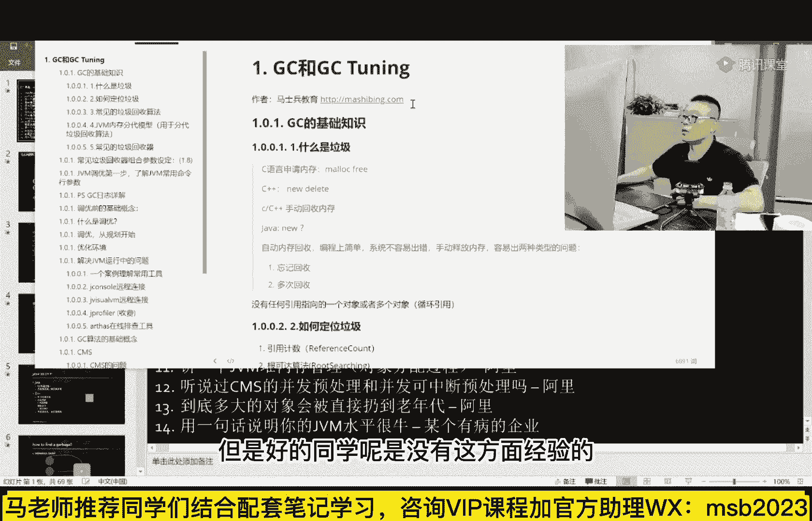
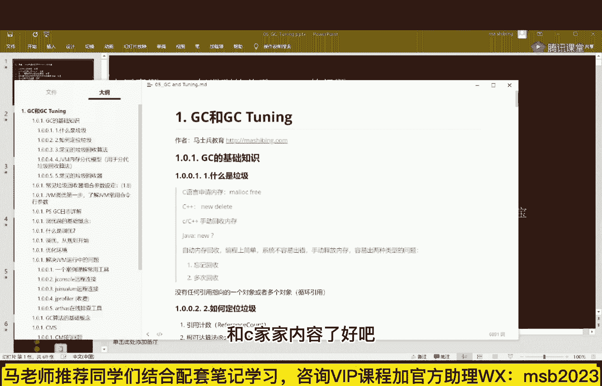
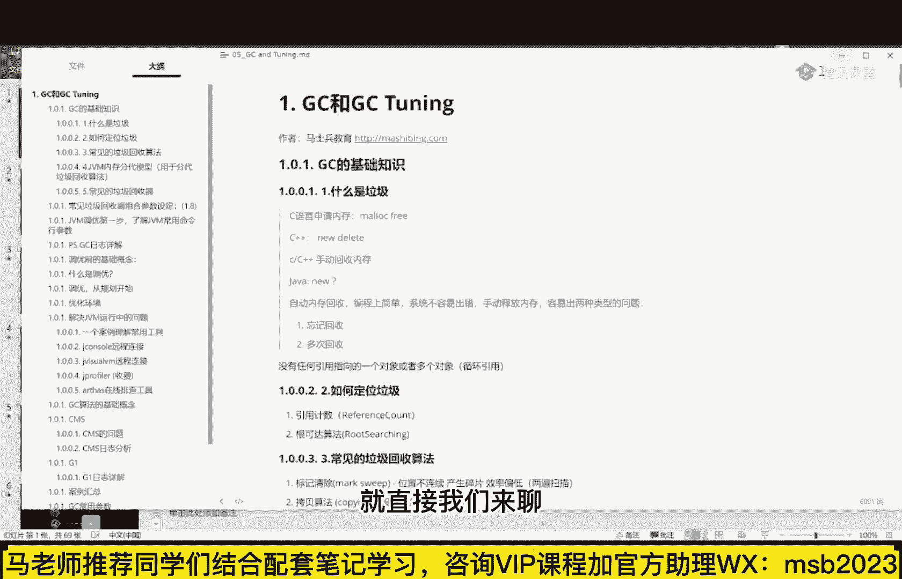
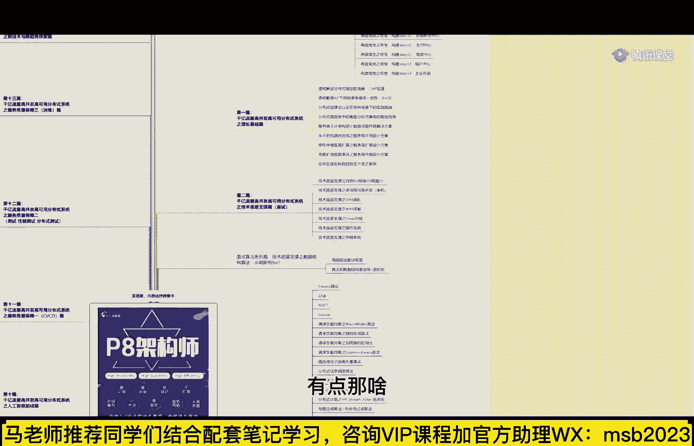
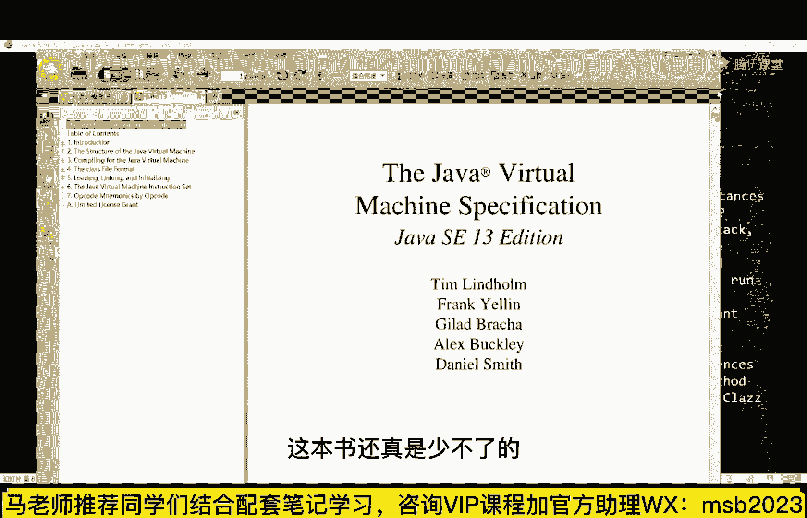

# 马士兵教育MCA架构师课程 - P1：什么是垃圾？ - 马士兵学堂 - BV1RY4y1Q7DL

嗯首先我们先来聊什么叫gc啊，gc，好g c这个是这个事先理解啊，g c的全称叫什么呢，它叫做garbage collector，或者叫garbage collecting，看你用在什么语境上。

简单说就是垃圾收集或者垃圾收集器，是这么个意思，嗯既然是垃圾收集，垃圾收集收集器，那么到底什么是垃圾，到底什么是垃圾啊，呃我原来讲的一般都从c和c加加开始讲，但是好多同学呢是没有这方面经验的。

所以呢我就不专门的来给大家讲，这个c和c加加内容了。

好吧，就直接我们来聊java里面到底什么是垃圾。

什么垃圾呢，看这里就是当我们溜出来一个对象的时候，没有任何引用指向它了，好这个就是垃圾，ok先说我们两天讲什么内容啊，我简单说一下，有一些基础的内容补给大家，就是what is garbage。

到底什么是垃圾，或者find it到底怎么去定位它，垃圾回收哪些算法，jc的egorithms，以及呢，目前在jvm里面存在的这些个垃圾回收器，一共有十种，最后呢我们来聊在线上的生产环境底下的调用，呃。

大家注意啊，这个调优呢如果你是在测试环境下，那你可用的东西特别多，但是生产环境里头可用的东西真心不多，在生产环境里的调优好看，这里我们一点点讲，首先来聊呢到底什么是垃圾，什么是垃圾呢。

由于这个内容呢我在预习的课程里头啊，其实也讲给大家听了，所以呢我在这呢快速过一遍好吧，好比如说我们new了一个对象出来，这个对象有一个成员变量，这个就是它的成员变量，这个成员变量指向了我们。

新旧程的另外一个对象，那么这时候的问题就来了，假如在运行的过程中，那不好，在这里不是，这个引用啊没有了没有了怎么办，好这块内容就是垃圾，垃圾的意思就是我我再也用不到的那个内存嗯。

你跟你的小伙伴在房间里头玩小线团，一个小线团连着一个小线团，一个小线团连了个小线团，什么时候呢，断了，中间有个小线团啊，这就是垃圾了，ok这是垃圾的最基本的概念，一个对象没有任何引用指向，它就是垃圾。

那现在问题就来了，这个垃圾啊是要进行回收的，不然的话当你程序不断的产生，不断的运行，垃圾越来越多的时候，你的内存就会被占光了，在c和c加加的领域，是我们手动回收，你自己手工去管啊，这块不用了。

你自己要标记一下啊，这块我用不着了，这块用不着了，你自己要标记一下，但是这块是c和c加加，写程序的时候非常容易出错的内容啊，为了让程序员们写的程序更容易，更加容易写得好，更加容易健壮。

让它的开发效率变高，所以诞生了java呀，python啊，go啊这类的语言好，这类语言有什么特点呢，就是不用你自己去回收垃圾，谁来帮你回收垃圾回收器，简单说，如果是c和c加加语言。

你在房间里扔小线团的话，你的小线头不用了，你自己得拿起来把它扔垃圾桶去拿走，但是如果是java go，python，julia啊，rust这样的一些语言的话，这东西不需要你用到。

不需要你用用用用用到用到呃，不需要你自己去清理，谁来清理呢，会有专门的人啊，你的妈妈，你的爸爸，专门的这种垃圾回收器来帮你清理这件事，当然现在呢我们就来聊一聊啊，呃如果你站在一个垃圾回收器的角度。

你已经知道什么样的东西是一个垃圾了，那么我们怎么才能找着这个垃圾，找到这个垃圾的话，一般的情况下有两种方式，第一种呢叫reference count，叫引用计数，这个特别简单，就是咱们不是说了吗。

没有没有任何引用指向的对象，那就是垃圾，那很简单，如果有一个对象，像这个对象，它有三个引用指向它，那么我就在这里给他记个数，上面写了个三，由某一个已经消失了，它就变成二，由某个引擎再消失。

它就变成一由某个引擎再消失，ok它就变成零，当它变成零的时候，它就变成垃圾了，这叫做引用计数，引用计数呢也是有好多的语言在用的，比如python python目前用的就是引用计数呃，js啊。

好多js的引擎用的也是引用计数，并不是说它没有用作为运营技术来说，解决不了一些问题，什么你呢，就是它不能够解决这种循环引用的问题，比如说这哥仨a指向b，b指向c好，指完了之后没有其他任何引用。

指向这哥仨中的任何一个好，这个时候这哥仨全是垃圾，叫做一坨垃圾，一堆垃圾嗯，这三个全是垃圾，那这时候如果有奇数的话，你会发现啊，这里是一，这里也是一，这里是一，因为有有印有指向它。

所以你是定位不出这样的循环引用的，这样的一些垃圾来的，所以这是引用计数的，它的不足之处，所以在jvm里面，或者我们讲我们说的那么直白一点，叫在hospital里面，在oracle的对于jvm的实现里面。

他用的不是这种方式，他用的一种方式叫做research根可达算法，根可达算法的意思就是，当我们跑起来一个程序的时候，我们一运行这个程序的main方法，在这个main方法里面开始分配内存的时候。

比如在这个内存在这个ma方是这么写的，t小t等于啊new t好了，从现在开始开始分配内存，也许在windot的过程之中，它里面又维护着一个队列，在这个队列里面又维护了一系列的对象，好了。

整个程序我们开始跑，所以最后就会形成一种对象图，对象图，这是我们根对象，这是我们的根对象，根儿指的是什么，最开始运行的时候需要用到的对象，好，这个写个叫做根对象，所以跟对象来说。

顺着这个根儿一直找能够找到的对象，那都是有用的，凡是找不着的都是没用的，顺着根儿找找找找找，找到这个了，顺着根儿找找找，找到这个了，找到这个了，找到这个了，但是顺着任何一个根下来都找不到这根俩。

哪怕这哥俩他们引用计数不为零好，这哥俩也是垃圾，这种呢就叫做根可达算法，它解决了那个reference count，解决不了的这种循环引用的问题，当然作为大厂来说呢，他们的面试题呢有的时候会特别变态。

他会问你，他说呃哥们儿，你这个所谓的根卡拉算法，那哪些对象是根呢，好听我说嗯，由于大多数人呢他是没有这个jvm基础的，所以我建议你们学东西的时候呢，先不要使劲玩命的抠细节，等，建立起来知识体系之后。

建立知识体系，去把这个整个的脉络先建立起来，你的知识脉络啊，知识点全建立起来之后，再去抠里面的一些小小的细节，这样的学习方法才是正确的，不识庐山真面目，只缘你在庐山里头研究某一棵小松树。

这个肯定是不行的，你应该是架起飞机在庐山上，整个上面飞过，你就知道了庐山整个的梗概好了，如果说有人问你这样的一些细节，这时候怎么办呢，听我说先把梗概掌握住，所以呢今天呢我不太想跟你解释。

这么这么这么细的一些东西，那如果你想知道的话，我推荐大家一本书，这本书呢叫jvm虚拟机规范，当然这书的话你自己要看，嘿有点那啥。

其实我建议大家呢，你你你听老师讲就行了，因为这规范呢还是挺挺挺繁琐，挺详细的，它是用来查的，并不是用来那个呃让你从头到尾阅读的，我把它打开一下，呃现在应该要出，应该是出那个14版本了，那么这个呢是一个。

第13版本呃，这说那叫java virgmachine specification，呃，你读那个老，这是java虚拟机的标准，java虚拟的规范，它就像是一本说明书，一本国家标准读起来是很枯燥的。

但是你想弄清楚一些精确概念的时候，这本书还真是少不了的好。

那什么叫跟对象呢，在这本书里面是这么写的，这个对象包括jvm stack，native method，stack，run time constant prove。

以及steady reference in method area和class，这几个都要分对象了，那么大家听我说，先不要去细究这些细节，因为你要弄清楚什么叫stack。

这个stack什么叫native method stack，什么叫run time cos to，什么叫做steady reference in method area，什么叫做看来这个东西的话。

需要你补的东西太多，因此呢大家伙暂时先放一边，总而言之，最开始运行的时候需要用到的那些对象，那些对象都叫跟对象啊，通过这些对象找找找找找能找到的对象，ok这些都是有用的，剩下的全是没用的，你你女朋友。

你男朋友啊都在这里一个房间里玩好，这个他们手里头签的第一个线团，这些个都是跟对象，我这么讲，大家是不是能理解，来我们可以继续往下聊的，李老师扣个一，还有抽奖吗，他你让自己变得更强一些，但比抽奖不香吗。

就是好，我们稍微回顾一下啊，我刚才讲了什么内容呢，就是呃到底什么是什么，是垃圾，没有任何引用指向对象啊，这个叫垃圾，那怎么定位一个垃圾呢，两种方式，第一种呢叫reference count，他有毛病。

他解决不了循环引用问题，第二个呢叫根可达算法，好，这个是可以的，这是目前hosport用到的方法，当找到这些垃圾之后，那么常见的垃圾清除的算法有哪些呢，常见垃圾清除算法有这么几个，三个从60年代开始。

就这三个，上世纪60年代，1960年，我忘了是196几年了，到现在为止就这仨，就这根仨后面所有涉及到的垃圾回收器，其实都是这哥仨的来回的组合，灵活运用而已。

这哥仨呢分别叫做mark sweep copy以及mark compact，背过就行了，第一个呢叫标记清除，第二个叫拷贝，第三个叫标记压缩，这哥仨是什么意思，看这图就相当简单。

mark swift的意思就是我们找到一些垃圾之后，比如说这些黑的全是垃圾，我们就直接给他标记一下啊，你这身垃圾可可可以用了，可以清除了，我们把它清掉，换成绿色，你看啊，这原来是黑的，直接换成绿色。

ok了，可以了，这个就叫max sp，也是最简单最容易理解的方式，这块是垃圾，我就把它清掉，这块是垃圾，我就把清掉，这块是垃圾，我就把它清掉，ok这个就叫mark sweep，好，这个方式叫做简单直接。

但是有他的问题，这个问题呢叫碎片，这个这里面呢如果说这块也清掉了对吧，这里面就会产生各种各样的碎片啊，比如这个我用了这个我也用了，结果你就会发现在我整个内存里头，如果我要用一个三个格。

连续起来分配的对象的时候，我发现就找不着了，为什么都是碎片化了，所以这个会产生碎片的话，这是mark sweep固有的缺点嗯，那么第二种不会产生碎片化，第二种是什么，第二种叫copy。

copy的算法也特别简单，无论你有多大，内存一分为二，你要用的时候只能用一半，当我们要回收的时候，怎么回收啊，这些不是垃圾吗，这些黑的全是垃圾，我找到那些不是垃圾的好，这个不是垃圾。

不是我考到像拷贝到下面来，把第二个哎本考到下面来，把第三个诶分考到考下面来，这样你会发现当我们回收完之后，所有有用的连在一起，所有的空余空间连在一起，所以这个时候他是没有碎片的，而且这个算法也超级简单。

拷贝一下就可以了，但是问题我相信小伙伴们拿大腿想想，也应该能想明白问题出在哪，很简单嘛，空间浪费对上面的时候啥啥时候删除呢，拷贝完了呀，把上面的这些所有的该拷贝的东西，拷贝到下面以后。

上面那块空间挂机整个全清掉，是录播吗，是录播啊，晓风残月啊，拜拜好看，这里啊，mark compact，mk compact，第三种呢叫标记压缩，标记压缩不会产生碎片，标记压缩也不会浪费空间。

但是标记压缩需要挪对象，啥意思呢，你看啊，呃回收之前呢，这些东西全是垃圾，当我们回收的时候怎么回收啊，其实就是把这个地儿给它剃掉，这不是有用的吗，哎复制到这里来，下一个有用的哎复制到这里来。

复制到这里来，把那些最终呢就是有用的连在一起，标记清除完了之后呢，再进行一次压缩，把所有用到的压缩到一起来，把所有没用着的连在一起，而这时候就不会产生啊，随便画，当然，大腿想一想也应该知道。

这个的问题就在于效率偏低，为什么效率偏低啊，哎你一边呢还有挪对象，一边进行压缩，一边进行清理，所以它的效率偏低，因此这三种算法呀就是叫做各有特点，另外呢各有毛病，各有问题好。

第一种回顾一下叫max sweep，给它标出来，直接清掉，会产生碎片，第二种叫拷贝算法，很简单，也很快，也不会产生碎片，但是空间浪费，第三种叫mark contact，把它那个标记好了之后。

再进行一个压缩，把那个有用的压缩到一堆去啊，你本来在屋里头扔线团，小屋里头扔线团，扔扔扔扔，扔的满地都是，得把你给清理一下，全挪到全挪到一起来，整排排列整齐，当然它的效率偏低好了。

这三种方式能get到的，老师扣一可以继续的给老师扣，一来也叫标记整理。