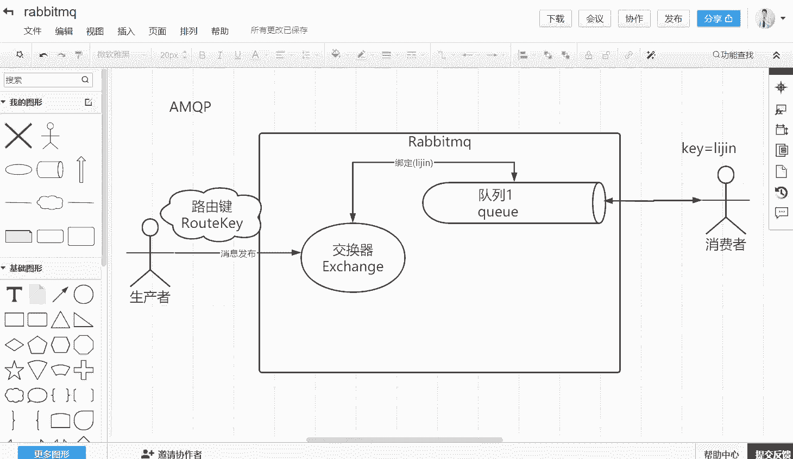
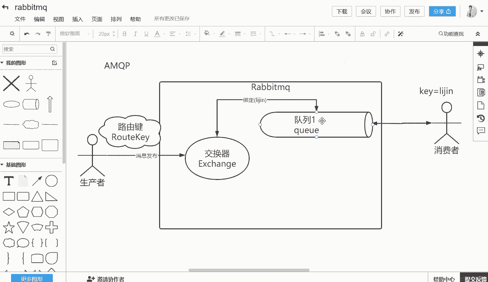
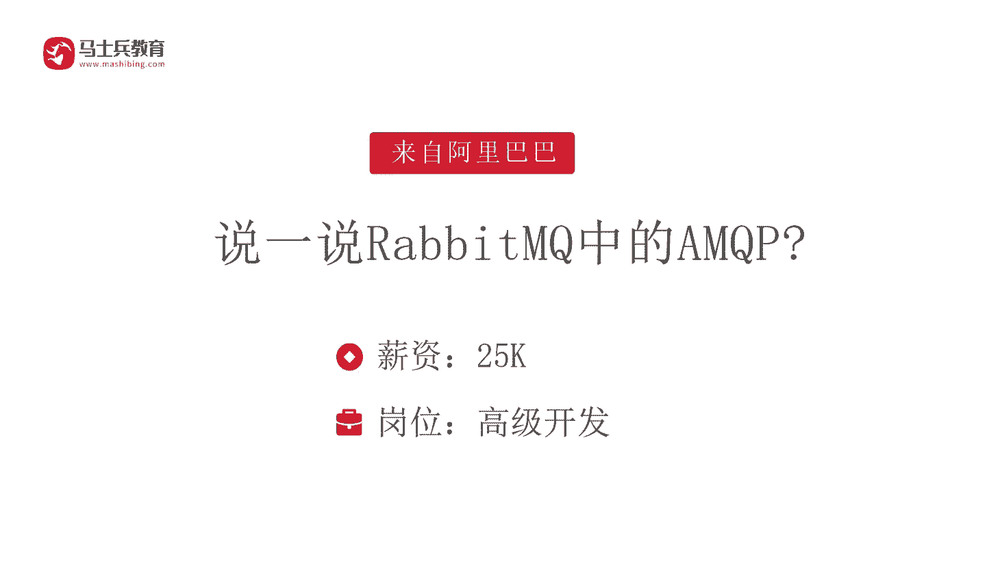

# 马士兵教育MCA架构师课程 - P200：说一说RabbitMQ中的AMQP - 马士兵学堂 - BV1RY4y1Q7DL

我们再来看一下这样的一道面试题，说一说rappingQ当中的AMQP。这道面试题呢来自于阿里巴巴薪资是25K对应的是高级开发。那么你要讲清楚这道面试题的话，首先我们需要去讲清楚两个点。

第一个AMQP是什么，第二个q当中的MQP是什么？首先啊我给大家进行一个对应的分析。作为AMQP的话呢，本质上面它是一个协议。就是QP它的英文全称叫做ad messageq就是高级消息队列协议。

这个协议呢它是通用的啊，它也不是说是q专有的，只是说q里面呢，它是默认情况使用的是AMQP这种协议。😊。

所以我们可以看到，如果你要在rapq当中去讲清楚MQP的话，首先你要画出一个rapQ。好，假设这个地方是一个rapQ。那么在这个rapq当中，你为了去完成这样的一个协议。一般情况下面呢，它会有两种角色。

一种外部的角色叫做生产者。除此之外的话呢，还有一种角色叫做消费者。其实作为生产者和消费者，他都是rappingq的一个客户客户端。那么rappingq它就是一个服务器。那么首先消息它当然是要进行发布的。

所以当我们生产者去发布消息的时候，作为AMQP协议，它会有一个东西要做，就是他需要去把这个东西对接到里面一个叫做交换器的东西。交换器。所以在rappingq当中有一个很重要的组件叫做交换器啊。

英文单词叫做exchange。好，那么我们去生产发送消息的时候，就发送给这个exchange。注意在发送的时候呢，我们称之为消息的发布。在消息发布里面，你的这一条消息一般都要带上一个路由件。

这称之为叫做。Root。就是你每发送一条消息，你必须要指定一个K啊，这个称之为路由器。那么发送完之后的话呢，在这个交换器里面，它会做一个什么事情呢？它会跟我们的这一个Q这个队列进行绑定。

比如说这个地方它有一个队列一。😊，对列，然后呢是Q。好，那么我们在rapq当中，一般来说会建立我们的一个队列和交换器的一个绑定关系。我们称之为帮定。这个绑定关系呢，它是这样的，在很多情况下面。

它也是通过一个叫做绑定。的路由。贱啊。来进行处理的。举个例子啊，在reconQ当中它会有几类这种交换器。这个交换器的话呢，举个例子它会有一种叫做直接交换器。😊，直接交换器叫做drick的交换器。

那么这种交换器的话呢啊比如说路由件里面这个键值是多少？😊，是李景。好，那么你就绑定一个键李紧，然后绑定到我们的队列一啊，这是我们的Q1。这个时候你发送消息，比如说这条消息里面你的这个root key。

😊，啊，简称T啊，它等于李锦的话，那么这条消息就会被我们的交换器，然后把它路由到我们的队列一当中。也就是说你在发消息的时候，如果通过一个direct直接交换器，那么绑定了一个对列一。

那么对绑定的这一个键的名字是李锦的话，那么你去发送一个路由件，对不对？这个时候他带了李锦的标识，那这条消息消息就会被路由到我们的对列一OK啊，当然如果你发送的这个路由件里面，你放了一个李锦2。😊。

不好意思。😡，这个地方它识别不到，或者你发送的一个叉叉叉，这个东西跟我们的路由件没有绑定关系，或者是说在我们的rapq当中，我们找不到对应的交换器和我们队列的绑定关系。那么这条消息它就丢失了。😊。

就是你发送的时候，他就找不到对应的绑定关系。OK那么除此之外的话呢，作为MQP的话，我们要是我们要进行消费。那消费者他就会进行对应的一个投递，对不对？比如说把这个对列一的东西投递给我们的这个消费者一。

那么这个时候的话呢，这一个Q等于李紧的这条消息就会从这个Q，然后投递给我们的消费者一。所以呢这就是AMQP它的一个整体。😊，其实AMQP它的一个整体的关系有几个核心的组件。第一个交换器。第二个队列。

第三个的话呢，交换器和我们的队列当中会建立绑定关系。😊，当然这个绑定关系的话呢，它会有跟交换器它就会有不同。因为交换器里面呢，它可以有direct直接交换器，也可以有这种主题交换器。

就是支持我们的这个正则表达式的。比如说你配置一个新可能匹配的所有啊，然后呢你还可以配置一些其他的啊绑定关系的话呢，也不是说单纯一种可以有多种。

与此同时你的队列也可能有多个可以去根据你的路由去建立不同的绑定关系。然后呢，让我们的生成者根据你发送的时候的不同的路由件，然后根据绑定关系投递到不同的队列当中。然后这个队列的话呢。

就可以去交给我们的某一个消费者来进行消费。所以这就是AMQP在rapQ当中它的一个整体流程。😊，所以回到我们的这个面试题，说一说rappingQ当中的AMQP。

首先你必须要知道AMQP是一个消息队列协议。然后呢，在rappingQ当中它是怎么实现的。它的核心有交换器，有队列，有绑定关系。同时你去发布消息的时候，有路由件。

然后根据你的路由件再去找合适的这样的一个绑定关系，让我们通过这个交换器啊，给它进行对应的投递啊，投递到对应的Q之后的话，每一个Q啊都可以去指定一个消费者，然后进行对应的一个消费。所以这道面试题的话呢。

它考核的点，第一个是协议。第二个是考核你对rappingQ它的内部机制是不是熟悉。😊。

