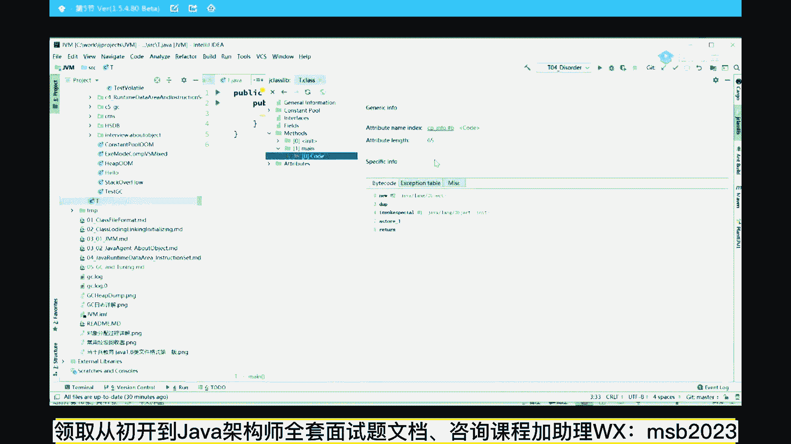
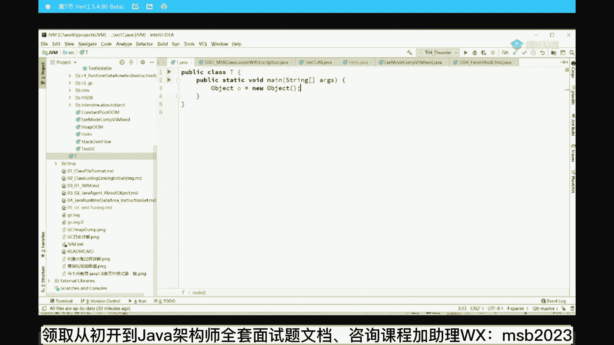
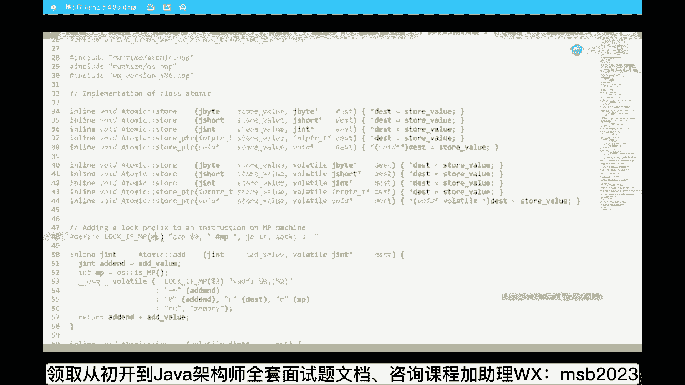
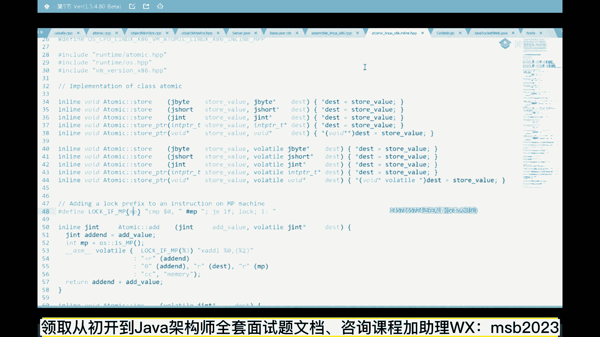

# 系列 6：P22：volatile如何阻断乱序的内存屏障 - 马士兵学堂 - BV1RY4y1Q7DL

比如说呢我们有一个class p，那么它呢有一个成员变量，好它有一成员变量呃，印度雷霆的m嗯，然后呢，当我new t t小t等于new t的时候，他执行的过程到底是什么样的。

刚才我们看到了他有五条指令构成，这条指令分别是new指令，duplicate，复制指令，这个先不管它跟咱们现在要讨论的东西没关系，还有一个指令叫invoke special。

还有一个指令叫a store，最后return指令跟咱们讨论的没关系，所以最核心的是这三条指令，这三条指令分别叫new invoke special和a store，现在大家还能跟上吗。

能跟上的老师扣个一，好可以是吧，可以我我我我要调整一下速度啊，好看这里这个new指令和呃，invoke special和a store，这三条指令构成了new一个对象的核心，这三条指令分别是什么意思。

仔细听我说这个new指令呢，大家知道我们有一个任何一个对象的时候，都是需要在内存里头开辟一块空间的，我得往里头装这个小m呀，我得装那个mark word呀，装那个class pointer啊等等，好。

我总是需要一块空间的，所以这个new指令就是申请一块空间，这是第一条，但是同学们你们需要了解到的一点是什么，当我们申请到这块空间之后，这块空间里一定有一个小m值存在好，这个m的值是几，如果是c。

如果是c加加这个m的值是不能确定的，是原来程序遗留的值，但是如果是java这个值是确定的，这个值叫做成员变量的默认值，这默认值是几呢，它是零，这个我觉得你你你学过最初级的jy c，应该就了解。

那默认值是零，所以当我们new出一个对象来的时候，他这个m的默认值是几呢，是零好，接下来下一步叫invoke，special叫特殊调用，invoke调用special，特殊特殊调用调用了一个方法。

这个方法是哪个方法呢，initialize方法，你说这个方法叫啥，构造方法，构造方法就是把成员变量初始化的，初始化的值是几呢，是八，所以在这个过程中，他会把零改成八好，第三步叫a store。

a s store的意思是小t，和真正的对象建立关联，把这个对象的地址值存到小t里，好看一下这个执行过程，当我们执行到new对象的时候，他会首先在内存里头开发空间，这个值几是零。

当我们执行到invoke special的时候，这个值才会真正的变成八，所以一个对象的诞生中间有一个半初始化状态，什么叫半初始化，就是m的值为默认值是零的这个状态，这个状态叫半初始化。

叫half initialized，好看，这里，接下来a a store的意思就是a这哥俩建立关联，第三条，有同学说老师您讲了半天，这东西跟那个volatile有半毛钱关系吗，有认真听。

这是刚才我们那段代码，我们刚刚证明了指令可以重新排序，我们刚刚证明了d c l必须前后都要加check，我们刚刚证明了你有一个对象，它由三条指令，最核心的三条指令构成，那么现在我们来仔细看一下。

如果发生了这种情况，对照代码，现在第一个线程过来的时候，现在我们要new那个单立状态的那个单位啊，比如说我们在new new这个单立状态的单位的时候，第一个线程来了，哥们儿，你是不是为空啊，是为空。

那他就上锁，上完锁初始化对吧，你这个对象吗，好new，当他new到一半的时候，申请了内存里边的值是一个默认值是零的时候，好在这个时候，正好在这个时候发生了指令重排序，啥意思。

就是下面这两条指令发生重排序了诶，再看一遍，我们现在正在new这个单例对象啊，new到一半的时候，第一个线程来了，上锁上完锁new new new到一半的时候，发生了指令的重排序。

看这里这个指令重排序发生的非常有意思，他会把a store one和inbox special调个个，有可能，那真正会发生一种什么情形啊，同学们，你们想想看a store one什么意思，叫建立关联吗。

那也就是说这个小t执行到这里的时候，here，这个小t已经指向了一个半初始化状态的对象，好这块还能跟上同学给老师扣一，那有同学可能就会说了，同学们，你们想想看，正好在这个时候，第二个线程来了。

第二线程上来先判断诶，哥们儿，你是不是为空啊，如果为空的话，我就再new你啊，但是你要你需要了解的是，这个t为空吗，不为空，但是很不幸的是，它使用的是一个半初始化当状态对象，结果第二个线程来了。

判断你已经不为空了，那干嘛，哎我就直接拿过来用了，结果我就用到了m等于零，这个值我本来想用的这个值是m等于八，这里面正好记录着双11的秒杀，成立了100万订单，正好记住了100万这个值。

结果来的时候本清零了，当然这种情况呢，其实呃绝大多数情况下不太可能发生，但是理论上是有这种情况存在的，好会问老师再看一遍呃，由于double check lock比较特殊，由于cpu会执行这种乱序执行。

它会存在这种现象，由于在java里面，你有一个对象的时候，需要分成三步来做，所以理论上会存在这样一种情形，第一个线程先上来判断哥们儿，你是不是依然为空，视为空，我就new你扭到一半的时候发生指令重排序。

结果t就已经不为空了，不为空了，我另外一个线程来判断，我就直接拿到了半初始化状态的对象，好，好了，所以必须要加volatile来这块能get到的，老师扣个一能理解吗，应该应该应该能听懂吧，好。

当然我估计会有同学，有各方面的各种各样的疑问，那个有些疑问的话，那我们一会再聊，好不好，a store依赖invoke，为何还要重排，对，其实你在问一个问题，我相信多少同学会有这个问题，好好听啊。

好好听，下面是面试中，经常经常经常会被问到的一些专业名词，这些专业名词有有人见过，但是都不理解什么意思，我讲给你听，认真听，第一第一个问题，什么样的指令允许重排序，就是有一些指令是允许前后重排的。

有一些指令是不允许的，那么你怎么知道这两条指令是允许重排序的，来有这个问题的老师，扣一就是重排序的规则到底是什么样的，好大家听我说大家听我说，这个呢有一个专业的名词叫happens。

before有有有有有人见过这个名词吧，应该就是在jvm里面，它规定了八种情形，这八种情形要求绝对不能重排序，除了这八种之外，其他的指令随便你排，这种不存在于这八种里头，如果你想了解自己去搜。

那么还有一个专业名词叫as if serial，还有这种又是什么意思，看上去像序列化执行，实际当中是乱序执行的，只要最终结果不变就可以，这里指的是单线程，如果能理解能理解，不能理解就算了，不管他。

因为下面我要给大家讲的是，怎么才能禁止指令重排序，好听，我说好，我们可以继续吗，可以继续，同学有点可以，为什么加了volatile，它就不重排序了，为什么y，好看这里为什么加了volatile。

就是那个就就就就就可以呃，不发生重排序了，首先你要理解作为硬件的底层来讲啊，所以硬件底层来讲，它到底是怎么禁止这两条指令不能重排序的，好听我说怎么定制这条这两条指令重排序呢，其实非常非常简单。

一个道理就是我在你哥俩中间加一道屏障，你不能越过这道屏障，指令一指令二不允许你重排序怎么办，诶，加一道屏障好，这道屏障被称之为memory barrier，内存屏障好，关于这个内存屏障。

在很多很多cpu里面的实现是不一样的，作为jvm它规定了一种规范的要求，好能理解吧，就是我要在两条指令之间加屏障，就这个就这个可以就禁止你的两条指令，就可以重排序了，不允许你重排。

但是呢很多网上的文章呢会把这个东西啊，java的实现跟你那个底层的实现完全混在一起讲，实际当中远远不是这么回事儿，你好好听，认真听，作为jvm级别的内存屏障，注意这是jvm级别，什么叫jvm级别。

就是我的java的规范里，要求任何一个实现了jvm虚拟机的，这样的虚拟机，虚拟机规范的这样的虚拟机，你都要给我去实现这四种屏障，这四种凭证我花五秒就能给你解释清楚，你不要看它特别复杂。

这四种名字分别叫load，load store store，load store store，load load叫读，store，叫写，凡是你看到这种屏障，load load就是指的是一条指令。

是low的，一条指令也是漏的，这两条指令中间加一个load load屏障，其他的还需要我解释吗，唉能理解这四种屏障了吗，能get到的，老师扣个一，没超过五秒吧，没理解是吧，威力，这还不能理解。

就是load load是一种屏障，这种屏障屏蔽的是哪两种指令，不能重排序，第一个load，第二个load中间加一个load load屏障，这两条load是不可能重排序的，那其他的呢。

store store呢还用我解释吗，上面有一个写，下面有个写，中间加一个s屏障，这哥俩不能不会进行重排序，load是什么，load是读store是什么，store是弦，明白了吗，屏障是自动发生的吗。

no作为java虚拟机来说，规范里头要求你必须给我实现这四种屏障，具体怎么实现呢，我跟你讲，我跟你讲实现具体就是你只要加volatile就可以，就这么简单，对volatile所修饰的任何的一个变量。

其实就是修饰的这块内存吗，volatile修饰的变量不就是修饰的这块内存吗，对这块内存任何的读取操作，任何的写操作都要在前后加屏障，前后加平章的意思是怎么加呢，这么来加的。

当然这个细节我记得只有阿里考过，其他的呢，没有人考过这玩意儿，只有阿里阿里，因为他们面试官的自由度比较高，按着一个问题之后呢，往深里问，随便你问多深，所以只有他们考过，其他人呢基本上没考过。

所以大致了解就可以，jvm层面规范上要求，对于volatile修饰的任何内存，你要对这块内存进行写的时候，前面加一个store store barrier，同学们，你们拿大腿想一下。

这意思不就是说我要对它进行写了，不就store吗，那你前面的store必须给我写完了，我这个写才会执行，等别人全写完我才写，这哥俩不可以重排序，下面叫什么，前面叫store load。

store load的意思是等我写完其他的load才能去读，保证你读到的是最新的值，所以就保持了线程的可见性，ok就这意思，那要是读操作呢，读操作是前面我要读，我等我读完了其他人才能读。

load load barrier，等我读完了其他人才能写load store berry啊，k，大致的volatile的一个一个具体的实现，它是这么要求的，好了，这块能大致理解就可以了。

没有必要去深究它的一个细节，基本上面试也没人没人会问到这个程度，但是实际当中的问题是在于这里，虽然啊这是jvm规范的要求，再强调一遍，这是jvm的规范的要求，specification。

具体你们怎么去实现这些屏障，那是你们具体cpu的事情，我再强调一遍，这东西是一个虚的，是一个标准，实际当中我们用什么指令去实现它，那才是真真正正的实现这块概念，能理解吗，才能理解给老师扣个一。

因为网上很多文章会把这部分的实现，跟你的硬件实现全混在一起讲，所以你会混淆，你听我讲就行了，z o m a n a怎么说，先不聊它啊。

听讲就行了，嗯到目前为止呢，这么说，这个各种的cpu，它对于内存瓶装的实现是不一样的，什么意思呢。

就是给你举个最简单的例子，就是如果你是x86 的cpu这种的，我用的是最多的了，呃它本身呢就支持三种不同的指令，这个指令呢分别叫fence，fence就是里边的意思l fm fans。

那s就是store load，就是那l就是load了，就是一个一个写一个读m的，是所有的，ok好，他其实本身就是在cpu指令这个级别，它是支持这三条指令的，那么有同学可能会想当然地认为你。

jvm不是要求必须实现内存屏障吗，那四种类l l s s l和s对吧，你不都得支持那几种内存屏障吗，既然你都得支持那几种内存屏障的话，你本质上你是不是应该用这个指令来实现啊，那是这样的吗。

讲到这还能跟上吗，同学们，学完这节去面试要多少钱，30万以上是正常的啊，咱们讲一下实际当中是这么实现的吗，然而并不是因为不同的cpu，像这种指令它是不一样的，你不能写一个完全统一的。

所以hosport实际上是偷了个懒，那这个指令是怎么实现的，你得去看他hosport实现啊。

这个hosport实现的话呢。

