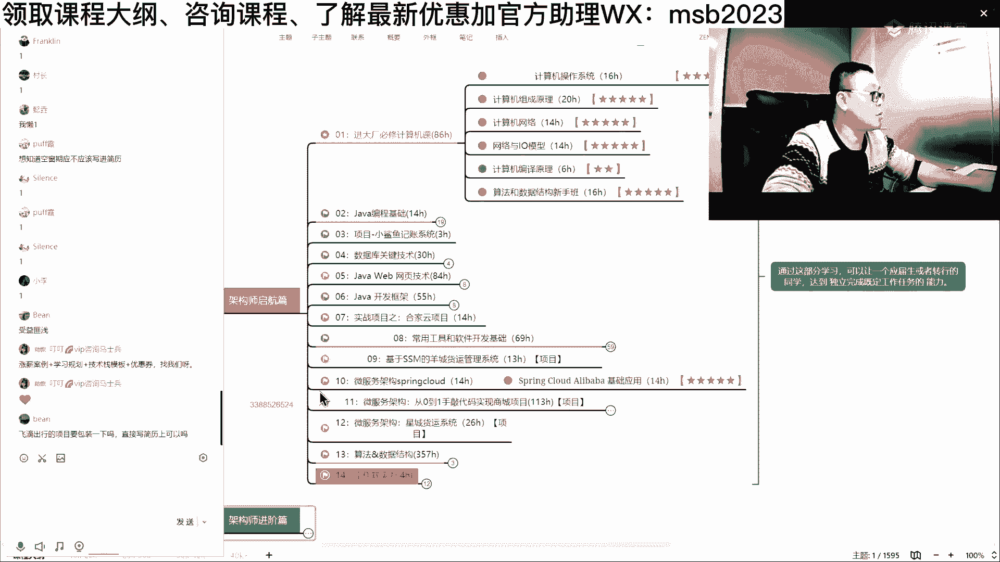

# 马士兵教育MCA架构师课程 - P23：阿里一道关于CF的面试题 - 马士兵学堂 - BV1RY4y1Q7DL

你得去读什么呢，去读那个那个呃，你你你，你得去读那个那个那个整个，你只要把虚拟机对于字节码的解释，那个文件啊，解释执行的run time，解释运行时啊，就是你看他自己节码是怎么被解释执行的。

你得去读这个文件，这个文件呢比较复杂，我能非常贴心的给大家介绍了，笔记里就是这么贴心贴心大姐姐，我是贴心老爷爷，当去读它的时候，你会发现呢它是这么来做的，你要去看他的bad code。

interpreter，bike code，字节码，interpreter解释器，字节码解释器是怎么执行的，java是解释执行的，对不对，然后解释执行的时候，是由于这个c加加的代码来实现的。

它怎么进行呢，他判判断是if catch volatile，如果你这个catch volatile，那就要求你前后要加屏障，前后加篇章怎么加的呢，是调用了这个方法，这个类的fans方法。

fans就里面的意思，order access order顺序，access访问顺序访问你，你你你你不要给我乱序执行fans方法，那这fans方法是怎么实现呢，下面是它的实现，大家看看大致能不能看懂。

啊这个这个最最终的实现是怎么实现的呢，汇编语言的实现，汇编的时间，这条指令loadl，rookie还是lo，大家还记不记得那个synchronized的，是用什么来实现的。

siri怎么是怎么实现lock compare and exchange，对吧哎对，而且这个thing of volatile怎么实现lock adl，有同学可能就会说了，大哥这个洛克怎么什么都管啊。

没错，因为这个洛克他是一条锁总线的指令，同学们，你们想想看，我去访问这个东西的时候，别的cpu都访问不了，我怎么访问，随便我，而且lock指令还能够干一件事，把当前处理器的对应缓存内容刷新到内存。

也就是进行一个内存同步，那么大家你拿大腿想一下，只要有一条lock指令，是不是就能实现了线程可见性了，线程可见，并且使其他处理器对应的缓存失效，啥意思啊，你那边失效了，你是不是得重新去内存读啊。

所以一条洛克指令把这事儿全干了，线程可见性指令重排序，你排不了序，我把我把总线给你锁了，你怎么排序，没法排序，所以这哥们儿干了所有的东西，就是这条lock指令，所以有人在问你volatile怎么实现的。

直接拿一把锁lock扔给他，好面试在问你volatile的时候，你是不是能理解了，来能get到这点，同学老师扣一，索总监效率不高啊对啊，我也想要让他效率高。

我也想让他用那个x86 那种fm fm fans等等，但是他不用啊，他偷懒吗，我不说就是hosport实现它偷了懒吗，那有同学可能就会说了，说老师啊，这个lock为什么adl是个什么东西啊。

为什么要at他呀，为什么lock这条指令呢，你前面的那个lock compare cs操作，我还能我还能理解，对不对，那是要上锁吗，要改里边直的，我这dl是个什么东东，好仔细听，我说这个i d l呢。

是往e s p这个寄存器上加了个零的歌，就是你往某个寄存器里的值，甭管它是几，你往上加了个零，说明没有任何操作，所以这就是一个空操作，只要他中心思想是要这条路，而不是要后面这条指令。

所以这条指令就随便来了一下，就这么回事，那有同学可能就会说了，老实啊，空操作，我学过汇编，我知道啊，汇编里面有一个空操作呀，来有没有同学知道汇编的空操作的，对啊很op吗。

no or no operation，对不对，没有没有没有操作，但是很不幸的是，这条指令如果你去查x86 的，它的汇编的那个指令集的时候，说明你会发现这条指令无法被锁定，这条指令你不能这么写。

lock l p直接就直接就不可能的，不允许，所以没有办法，他就lock了一条加零指令，没有做任何操作，这就是他偷懒的地方，为什么不能不做，问英特尔去，不要问我，为啥我不知道，但给我讲完了。

你还不知道啊，我都讲到这个程度了，你还不知道，还还还不知道，你还要让我怎么说，当然下面我们还有一些实践，这个实践的比较复杂，我今天就不给大家做演示了，关于理论性的东西，我们就聊到这儿，下面讲到面试题吧。

好吧，我们稍微回顾一下我讲讲过的内容啊，看看今天大家是不是有收获，今天讲的内容也是比较多的，就是有很多底层的东西一旦通过之后呢，就各种语言啊，各种那种那种应用级的应用层面的东西，对你来说。

那就是一层窗户纸，一捅就透了，呃我们今天讲了cpu的内存，缓存，有cpu和内存打交道，中间有好多级缓存，一共有三级，回想一下那张图，l one l two是存在我cpu和内部。

l three是存在一颗cpu内部，而我们的内存是多颗cpu共享，那缓存一行往里头缓存的时候，按照一块一块来，这个专业名词叫缓存行，关于这个缓存行来说，那么呃大小呢现在呃是约定俗成的，是64个字节。

因因此呢他们会诞生了这种缓存一致性，要保持一致嘛，缓存一致性协议，英特尔的叫m e s i，其他的和这个不一样，还诞生了一些编程的技巧，这种技巧以前人用的比较多。

后来以至于jdk一点八专门发明了一个注解，来教你，怎么样把这些不同的内容放到不同的缓存行里，cpu呢讲了乱序执行这个概念，也向大家证明了这一点，dcl为什么不能乱序，为什么要加volatile。

刚才给大家解释了，首先你要理解什么是tcl，其次你要理解你有一个对象的时候，它是有好多步骤构成，而且这些步骤之间互相之间的顺序能打断，第三一个volatile是如何到底阻止乱序的，jvm级别的要求。

那四种屏障，low low，the store store load和store store lol，为什么能同时实现volatile两个作用，volatile内敛哪两个作用，线程可见性，指令重排序。

你拿大腿想想，这哥们儿一一log的话，就直接把内存全部都刷新了，得缓存全部刷新，通知其他缓存行失效，你下次要去读的时候，一定得去内存读，保证线程可见性，同时它锁住总线，绝对不可能让你发生重排序。

我都锁总线了，你其他指令想体现执行不可能的，所以一条指令干掉了volatile的两个作用，ok，好能够继续同学老师可以去哪学汇编，去老师这儿来学不就行了吗，老师讲东西讲的这么透彻和清楚，学完就让你掌心。

看这里，听得快忘得快没错，你不做不做总结肯定会忘的，快拿张纸记下来嘛，随便拿张纸记下来，饭前饭后便前便后好好看看他，你只要你别那个变后用了，饭前又用啊，这个不合适，好看这里啊。

这个呢今天再给大家讲一讲那个线程池的问题，呃，以前呢我计划有时间可以给大家讲讲线程池，结果每次都发现，其实讲先生池呢需要给大家讲很多很多的概念，你才能理解线程池，对作为线程师来说呢。

你首先要理解什么是colorable呃，什么是future呃，什么是阻塞队列，blocking to呃，什么是那个线程池的七七个七个七个，那什么啊，还有线程池各种组织的模型。

呃这个呢一两天确实这样讲不清楚啊，vip里面讲的非常详细好听，我说呃最近呢也刚刚遇到一道题，大家可以审一下这道题，看看大家能不能答得出来，这是阿里面试，大概在p6 p6 p7 这样一个水平的时候。

一道面试题看你能不能答得出来，呃其实作为阿里来说呢，很多人可能不太了解啊，这个阿里的p5 其实约等于p6 ，这是啥意思呢，应届生在校的学生进去之后，往往是屁股开始社招生进阿里1~3年左右的。

3年左右的大概是p6 ，一般来说你到了p5 之后呢，再稍微攒攒时间，就可以到p6 了，多页的程序，这辈子不可能这么牛，你给自己这么负面的心理暗示，那我还能说啥呢，这辈子我都不可能赚更多的钱。

那你就真的就赚不了，我觉得你行，你至少试试，好看这里啊，仔细看一下，看这道题大家能不能理解啊，有没有同学有思路的这道题啊，是一个什么问题呢，实际上本质上是是是是一个设计模式的问题，当然你需要理解这道题。

多线程分解多个任务，如果所有校验的结果中均为处处，如果只要一个返回false返回false，最关键的是在这叫尽量快尽量快，什么叫电量快，举个例子，我们下面一个是一个总任务，这个是总任务，张三儿去买水。

李四去买肉，光武去买锅，最后我给他做火锅，这是我们总任务，派出三个县城去干这件事，张三买水需要1年，李sir李sir买过这个王五，买锅需要三秒，李四买肉需要十秒好，现在的问题就是说所有的都买回来。

那表示为true完成了，那么我这个总的程序就算完成，如果说其中有一个返回false了，比如说这哥们儿执行了两秒，就发现我买不着锅，锅没有，所以我给你返回一个false，那么这个时候作为这哥们儿来说。

要通知所有线程cancel掉，cancel掉，整个任务结束要尽量的快，尽量快的，意思是你不能等他执行完1年之后再给他结束，只要有人断了，所有人全给我cancel掉，这其实是一个分布式事物的一个玩法。

如果你能理解这个本质的话，就分布式事物手工实现该怎么去实现，它说不准叫colorable，闪电闪电骑士啊，这个不错，相当不错，forejoin叫color，你能想到这一点，very good，好听。

我说大家如果能理解什么叫future，这道题如果能听懂就听，听不懂就算了，算是附赠给大家的，好吧，呃如果能理解什么什么是future，应该就能理解，这future呢就是一个任务要求。

可以有返回值的这样的这种任务啊，这这就是那个任务的返回值，好关于这个任务的返回值，就是我返回之后呢，要去要要求马上给出反馈，同学们听我说啊，就是那个作为java来说，他原来并没有提供这种模型。

如果有人用过future的话，这个future什么时候才有结果呀，是不是我得调用这个future的get方法呀，我才能知道它这个结果对不对，好听我说这个get方法是什么操作，各位同学，这个叫阻塞操作。

阻塞啥叫阻塞，阻塞的意思就是我在那傻等着，一直等他有了结果为止，那么你拿大腿想一下，有一哥们出去了1年，你在这里get得等他1年才能回来，结果有另外一个哥们已经返回，结果是false了。

你应该把它cancel掉，你怎么cancel掉它，你开脱不掉它，因为这是阻塞，阻塞在这里了，所以这是它的一个核心点的要求非常快，正是由于意识到了，说那个jdk原来的提供的类库里头并没有这种。

等返回来之后，我马上就做出反馈的这样的一个future，所以有没有听说过这个类库瓜子，有听说吗，挂吧，googoogle专门给java做的扩展类库，对不对，google的对好。

这个类库就扩展了一个叫什么叫什么future呢，叫listenable future，有没有听说过这个的叫listenable future，如果你能达到这个very good，很好。

而且呢还乐于学习更多的这种内裤，ok，好这就叫类似的future listener，future出来了之后，就是你一回来，我马上就有反馈意，我不用在那里阻塞着，我，只要注册一个quebec就可以了。

回调监听器对它本质上是一个什么东西呢，observer设计模式，所以设计模式是你长技术内功的第一要义，observer这种设计模式观察者吗，那，当然我们继续讲，这里边还有点深入啊，估计好多同学听不懂了。

听不懂了，我很快讲完啊，听听到什么程度算什么程度，那后来呢jdk一点八说，哎呦不错哟，google谷歌，你不错哟，你居然拓展了我很想拓展的这么一个东西，好，我学你，所以在jdk一点八之后。

有一个future诞生了，这个future叫compatable future，complable完成完成之后就有反馈的这样的一个future，来看这里吧，我简单给大家写了一点小利的程序，不是很完善。

我讲给讲给大家听，future啊，这是listenable future，completable future，看这里啊，这个我做了一个小的模拟，我有三个任务，test one。

test to test three，第一个是三秒，第四秒，第三个是一秒，它会返回false，然后我用completable future怎么玩呢，这么来玩，completable future。

supply is sink，执行第一个任务，执行完了之后会调用我的call back，也就是说任何一个任务执行完，都会调用我的call back，我call back怎么执行啊。

只要有任何一个任务返回给我的false cancel，处理结束流程，让所有其他线程结束，通知其他线程结束，最好你能写回滚roll back，超时处理怎么玩，把这个都写好，这个教会你自己去写。

这就是completable future，它的核心是什么，刚才那小伙说了，小伙水平不错啊，它的核心是fork join pro，加上考了不，效果不错啊，阿里欢迎你，对分支，当然这里面呢还有这种细节。

这种细节呢留给你自己好好思考思考好吧，怎么处理，结束流程就是有一秒的已经回来了，那1年的都得给我，你得给我cancel了呀，对不对，你不能随随便便的还搁那执行1年怎么开走，我告诉你。

cancel这件事让一个线程半途中结束挺困难的，不太容易，你们好好思考一下，通知其他线程回滚，你执行的一些操作都得给我做好日志，由于我先我任务取消了，你是不是该把钱退给我呀，所有的东西做回滚。

如果说做了我，我比方说远程的分布式的事物，那我超时了之后怎么处理，写到这一点的时候，阿里欢迎你，interrupt完成不了interrupt，你得去catch那个exception才可以行进，好。

我们今天就聊到这儿，好吧，记住了东西，我们就聊到这啊，这个一时半会真的聊不完，8月份呢我会重新讲新的整个的线程，我觉得我第一版讲的还可以，但其实呢第二版我想加的内容更多，请允许我介绍介绍我们的课程好吧。

呃课程的深度以及我们的这种知识点的深度，其实呢我相信大家伙应该可见一斑啊，我一直强调就是大家伙在学习的时候，有一个非常重要的东西，不要浪费时间，你个人的精力啊非常的宝贵。

有很多人上学的时候的精力用在去学什么，福特圣呃，学点什么这个设计那个设计啊，学linux的各种命令，学点黑客，然后呢再学点编程，其实你根本就不知道它的整个的多赚钱的点，到底在哪里，能理解吗。

就是说如果你要学photoshop时间，我教你学别的地儿，你可能多赚好多钱，所以组织好你自己的精力和时间，是能够让你的职业生涯变得可预测，而且比较有效，向前看对，但你不愿意向前看的话，我就无所谓啊。

马老这里的课程基本上是以向前看为主，在这里等等，这也是为什么在我们的呃，整个的我们指导的学员里面呢，嗯基本上是短时间之内呢，就能让他有一个不错的薪水上的提升，这是面试突击四个月啊。

这四个月其实还算是比较长的，嗯这是咱们上海的学员，我们老师的面试指导之后，总报80万啊，我周老师的周老师的系列的指导，嗯两个offer是吧，上海应届生15k，上海西安涨了四次签的应届生拿了9k。

虽然不太多，但还可以哈哈，怎么说呢，就是原来是找不着的呃，从时间角度讲呢，这是武汉半个月，就是这是效率啊，我们就我们讲的，我们写程效率，我们找工作涨涨薪水也需要效率。

你非要说我搞个3年我才能涨2000 3000，那就效率太低了，三个月两个offer继续啊，这这就是效率呃，十天突击，为什么十天突击能搞定工作呀，背哈说难听一点就是背搞我们的突击班，背面试题。

当然你也要知道面试题经常会问什么，对不对，突击应该突击什么，好吧好了，整个课程的内容需要做个简单介绍吗，需要的扣个一有十个我就介绍，没有十个我内容就不介绍了，我希望大家伙呢我介绍也不介绍也好。

大家能把咱们的课程内容，要从咱们的小姐姐身边啊，要要走这个课程内容啊，呃其实是其实是这样的，就是说我们是经过了那种，非常非常细致的设计啊，才把这个整个课程内容给他给大家设计出来。

然后哪怕你就算是自己自学也好，自学也好，你看到这个内容自己对照模块去学习的时候，其实你会发现你的条理性也比较好，因为我非常担心，各位同学们的学习呢是这种碎片化的，今儿唠一知识点，明日落一知识点啊。

今儿是关于shell的名人，关于并发的，后天关于数据库的，在后天关于优化的，在后天关于节架构的，后天再来一大数据的，看上去你在这里每天都在这里瞎忙活，忙活完了之后呢，别人拿你简历来一看。

一个给力的项目都没有，是不是有量的吗，就是每天搞点随便画的，有没有，有的扣个扣个一认识一下好不好啊，不要怕丢人，这种男的学习效率就非常非常低了，你叫做战术上特别忙活，忽略了战略上的问题，请大家注意。

所有的学习一定要有一个短期目标，或者涨薪，或者跳槽，或者入行，或者进大厂，以这个来驱动学习，而我们整体的设计呢就是从你最底层开始啊，计算机的基础的必修课，尤尤其是那种非计算机专业的转行过来的。

今天给大家讲了好多，其实就是操作系统的是吧，组成原理的，然后编译原理的这些内容啊，呃大厂必考的内容啊，到基础做项目很关键，项目驱动就是你的你的简历上写一堆项目，才是最重要的，是不是数据库，网页框架。

做项目好常用的软件和开发基础啊，然后做项目，分布式微服务，做项目做项目想进大厂，算法与数据结构工作的软实力，其实到这里的时候呢，就是从零就可以入门了呃，大多数线下的机构讲的逃不出我们这部分内容。

第一部分在这部分内容基础之上，我今天给大家讲的是java底层的一些知识，性能调优的知识，并发的知识原理和源码层面的知识，中间件的运用，综合的项目开发优势项目是吧，然后架构的设计理论，具体的设计方案。

案例的专题，那么这部分内容是带大家进入高新设计内容的，前面的大多数内容是讲落地，从这里开始，我们讲设计设计，我给你举举具体案例吧，学生的具体案例来举例子啊，你就大概知道设计内容是什么内容了。

这是我曾经带过的一个学员，他原来是50多万的年薪，我带他90万干进腾讯，腾讯的典型的面试题，就是一道，刚才我说我给大家讲过的一些，跟大家伙对照课程大纲的这部分内容的题，架构设计题。

大概就是对应的就是这个啊架构的案例专题，这个呢还是挺难设计的啊，一般来讲建议呃2年左右程序员开始涉足，如果你刚开始入行的同学呢，作为兴趣去研究，但是你现在短期可能还用不太上好吧，2年以上开始涉足。

怎么提薪，这个哥们儿是90万拿了腾讯的年薪，但是你学历可能不如他，不过你的技能只要到位了，搞个中间的六七十万，五六十万总是问题不大，微服务的专题设计模式的心法，到呃比较流行的新的微服务云。

原生云原声的落地，这个我们讲现在的架构是不用云，不用云，这个现在是不太现实了啊，呃软件测试啊，大数据的内容，go on的内容啊，如果你要愿意，可以去考试c k的认证和c k s的认证，然后技术的管理。

技术的规划，技术的选型，还有我们就业的，就是帮大家怎么去一一对一的去提升，怎么去提升这个学习，怎么去提升这个面试的突击，帮大家做好潜力的指导，面试的指导啊，如果明天在座的诸位要是愿意的话。

也可以把你们的这个简历拎出来啊，来帮你们改改简历，自我吹牛逼一点点，请老师改过的简历，其他你任何都不需要有，每个月2000块钱以上的涨幅，就是不干别的，改完简历嗯。

每个月2000块钱以上的涨幅白来了好吧，只要改完简历就有啊，然后呢贴近于我们上面所拥有的所有技术的呃，各种项目，这样方便你在简历上写出来，各种各样的项目，写到简历上，好了呃，呃这是给大家呢深入总结的。

作为一个优秀的技术人员，应该掌握的技术站技术突破，兔子虾兄弟们只是这样的啊，有没有问那种软性问题，我没有办法一一帮你解答呃。

关于软性问题，大概我们总结有70个左右。

这部分问题呢，我们总结在了我们的第一次的面试突击里面。

我登录一下就算了，不登了，我登录一下吧，微信扫一下。

行，那么这个教师呢到现在为止，我们一共为大家提供了226门课，3800个左右小时的时长，这是已经讲完的，不包括正在直播的呃，基本上每天都有直播，直播课的内容也在不断更新，在这其中呢。

我们在我们第一次的面试突击里面，给大家讲了一系列的这些个小细节的，软性的内容，这部分内容呢其实我说起来的话呢，也不太好回答是吧，你那个到底你要不要编啊啊或者怎么样啊，你这跳槽怎么看呀是吧。

你你为什么要离职啊，你还是模拟要问吗，工作失误怎么办啊，你怎么理解你这个岗位，你为什么要离职啊等等，这些各位兄弟们关于hr的70个软件问题，这里都有，我在这里就不想展开了，你要编或者不要编。

其实是去跟你的具体的工作内容有关系，这也是为什么我们学生的面试成功率比较高，很简单是由老师在这里陪跑陪着你，你到底有什么地方呢，觉着没没没答对了，哪怕你回头找老师问或者录音录下来。

老师告诉你什么地方拿的不好，下一次不要犯这种错误就ok了，因为这种成功率比较高的原因，我只会算法提供管理系统啊，那你就永远会是吗，所以我跟你，我跟你们一直说，你们是一个不断成长的过程，你现在只会这个。

难道说代表着你就以后这辈子只会这个吗，学习嘛，对不对，差什么学什么不就ok了，三期外包怎么规划，首先第一步定目标，长远目标不好定，你可以定短期目标，短期目标一般以两种方式为主，第一种是我要成为某个岗位。

第二种是我要多赚多少钱，出来之后还能听懂不，所以自己定好我要多长时间之内多挣多少钱，这是最简单的目标，定完目标之后呢，就知道学习该怎么学了，差哪些该怎么补了，只有你定完这个老师才能给到你具体的路线。

这是为什么，我报完名之后呢，就是有一个老师帮你梳理的这个过程啊，然后后期呢帮你陪跑，这个过程我学习涨了七个，就是你可以给自己定目标，你说我三个月我想让5000老师。

我现在这个目标是这样的，老师你看看我现在以我现在的情况合适不合适，35岁，40万年薪涨到了70万，开不开心自己想啊，自己琢磨开不开心是不是很爽。

1年多赚了30万，我们整个学费多少钱，1万出头而已，投资记住给我记住这一点就是投资自己，投资自己是你这辈子永远最值得投资的事情，作为男人也好，作为女人也好，作为男人投资你自己，让你自己变得更强。

你才能吸引更优秀的女性，记住这一点，女生不是追来的，是吸引来的，所以女生也是一样的，你有自立的能力，你就不会不会依附于某一些质量特别差的男性。

西施玩到手也就50多，你有吗啊就更经我没法跟你聊的，你关注点永远这么奇葩是吧，他说我关注点是他从40万到手二到手30万，涨到了70万，到手50多万，你的关注点是70万哦，才到才50万，卷少鸡腿往上涨了。

好的好的好了，今天呢有一个很重要的环节，就是有不少同学是要我改，帮我改一下简历啊，兄弟们，这个这个简历是怎么怎么提给我的呀，我们小姐姐已经提给我了啊，我来，下载一下，找几份简历给大家看看啊。

有时候怼大家两句，也不要往心里去，给大家两句呢，是让大家伙理解这个社会的险恶，以及你思路上的偏颇，把思路给我纠正过来，就是你你自己琢磨一件事情，那就是非常简单，你要不要多赚点钱，如果你这个欲望没有。

就不要找我，如果这个预告有老师就有办法，他说70万的不多，虾皮年薪850000加股票年薪百万还不够是吧。

还不够，还要更高的，就是大小伙儿啊，都是一个慢慢成长的过程。

你知道哪天说你刚毕业，这是我们迄今为止最牛逼的学生，30岁，公司给了5000万的股票，已经变现，也就是说他的现金资产就已经5000万，30岁啊，一个普普通通没有背景的程序员。

这是他总结的关于p p7 的部分应该做什么，当然你的上嘴唇一碰，下嘴唇不就才5000万吗，因为目标都都还很远是吧，你不用跟我聊啊，你很牛逼啊，这个cpu吧，不是cpu，使他运气比较好。

他正常年薪是在120万左右，赶上公司上市，但是他技术水平确实比较好，老罗小姐给我提了一份简历，又抽烟，24届应应届校招的简历，柴哥的悉尼大学，on the resume。

嗯master i t南京好多23应届生资源科技，首先你要问清楚一点啊，就是这个很重要的一点呃，你是在国内找还是在国外找，在国外和国内呢它的内容是不一样的，你写的中文我估计是在国内啊。

我们以国内来举例子好吧，然后我们目标薪水是多少，目标薪水也没有写，那边薪水没有写二维设计游戏，举点性收集信息科技雅思，你这次你嗯那个各位应届生的同学啊，你这么写东西是不行的，好吧，嗯听我说啊。

就是各位应届生同学呢，我们以以什么来举例子，我以一个就是咱们南京教育呢，这个这个是有线下班，这个大家可能也知道是吧，先下班呢我们是不收学费，然后等你毕业之后再来付学费的啊，主要是解决第一你要用时间来学。

第二呢你没有多少钱，嗯然后呢等你赚到钱之后呢，我们再来收你这个学费啊。

这也是比较良心的，呃这个呢目前呢是县中心是有两个地方，一是上海。

一是长沙，我们现在长沙内容是一样的啊，嗯这个方向是以java大数据为主。

然后我们线下版在整个的去年。

在上海那边的就业，我给他抽烟。

回来瞅一眼，我们线下班在上海这边的一个就业情况啊。

这是去年呃，一丁点不夸张啊，我可以负责任拍胸脯的相机讲，这里头的数据没有一丁点水分，这是我们整个去年一整年的，在上海这边大概就600 600人左右，这200元呢一部分是中专高中的最低年薪，拿了15万。

然后呢凡是大专起步的18万以上，没有低于18万的，然后50%呢是在就是你本科的，差不多就20万以上啊，就这样，那么这个它会涉及到一个重度的简历，润色过程哈。

我都不能叫环，叫包装，叫润色，这个简历呢应届生的简历。

你要想拿到比较好的薪水啊，如果你目标只是找个什么6k的，7k的，8k的，找个外包。

那就无所谓，你随便写，你像这种简历差很远的地方在于什么地方呢，你的知识点会哪些不会哪些不知道啊，看不出来看到了吗，你博客历史啊，什么决定啊，跟我跟我没关系啊，参加了口周赛挺好，这个是这个是重要的。

热爱唱歌，你说有意义吗，一点意义没有，就是说你整个的东西能偏了嗯，雅思多邻国的份，这个意义也不大，还有呢又擅长这个语言，又删除这个语言，偏了散了，记住了，想拿高薪一定是聚焦聚焦，聚焦聚焦你们入行的时候。

想拿高薪是1米宽，1百米深这样的一个知识体系，随着你整个成长的，你慢慢又变成1百米宽，56米深，越来越宽的知识体系，所以这时候你要聚焦，我的目标是java后端这些东西啊。

什么a p f x swagger postman意义不大，我的目标如果是java端，你给我写这里写python意义不大，你跟我这里写什么嗯，这个多少分，这多少分往后放，你你要愿意的话，往后放。

能理解就重点往往前突出，还有非常重要一点，如果以我们闲下来举例子，一个应届生要想当很好的薪资，四个项目，1234，前面这两个分布式微服务的比这个差的有点多，但是你的优势在哪里，你的优势是在这学校不错。

学校不错，学历不错，这个一张这个你可能会拿到一些面试机会，可能会拿到一些对应的薪水，但是看着这份简历正常的，你按照老师的模板给你改完的那种，如果你拿18000，你这份简历可能只能拿到12000。

差百分之差1/3吧，所以重点在什么地方呢，我再跟你说一遍，第一重点突出，重点突出就代表着你知道什么是值钱的东西，你跟我这说什么，有运维经验，跟我这说，了解shell语言对我来说没有意义，你知道吗。

因为我要招的人是什么，一定要站在我的角度考虑问题，而不是站在你自己的角度，我再重复一遍，简历是什么，简历是广告，广告是什么，广告是我是我厂商要什么，你要往上写什么，我厂商重视什么，一定是往前提前写什么。

能不能理解我现在厂商重视的时候，我要找一个比较牛逼的实实实习生算法什么的，前提是吧，我这个那个那个那个那个你还这个解释了，解释了一些什么乱七八糟的东西，不要解释这些东西都没意义，对我来说。

你成就成够就够，我们你这个水平够了，没拉你过来，水平不够，你就就不拉你，你想办法把自己水平写够了就行啊，系列的精通，熟悉重点的知识点，要了解哪些是重要的，哪些是不重要的，哪些是我们企业看重。

哪些是不看重的，这些个呢你分开要分开，你要知道的是他看重的那些不看重哪些啊，seo server不看重的mq可以往后放，分布式微服务，这里没有是吧，然后如果对应项目的话。

四个项目为什么会有那些二本的学生，在我们线下会拿到40万年薪以上，刚毕业很给力，就是项目写的很给力，知识写的很给力，但是我不我就不给你展示他们的，他们的这种这种简历的那个具体的内容了啊。

所以这个是需要你大量的积累之后，你才能写的写的上去，四个项目，前两个分布式微服，后面两个写什么，后面两个可以稍微的就是，就是相当于你你可以稍微的把标准降低一些，可以写单机版的游戏的后端，实在不知道的话。

从我们这里挑，就是我们为什么在我们整课程体系里头，给大家提供一系列的项目，从这里挑就行了，前面写两个写音乐，音乐音乐水中心或者写我们的网约车，ok后面再写两个写什么就写游戏，后端这个也很给力。

ok写个何佳芸不就行了吗，你说清楚了吧，来看看这个吧，换一个吧，这个写法要比要比上一个稍微好一好一点点啊，呃二次的离职就是我至少知道呢，我专业技能我是什么，我要稍微排练一下，前面那同学。

你不要认为你是你是学生，就按照那种对自己的要求放松，你一定是按按照一个专业专业的人，职业的人要求自己啊，这个知识常用的ok spring cloud sql，ok我觉得他这个排列还可以啊，排列还可以。

就是我我最烦的是什么样的一种写法呢，上来先写a tml css js会idea或eclipse会get，你这东西都是都是都是边缘性质的啊，我搞一个较好的人，我上来，你这些东西强不强，跟我有毛线关系吗。

这些都是夹缝线，往后放啊，你看他这个就放到最后，他这个你看idea eclipse maven放到最后看到了吗，重点往前放刺，就是最差，往后放，这是最最普通最简单朴素的原理吗。

你第一个你最最最拿得出手的点，是不是第一个让人家看见呀，恶灵力哪个哪哪哪哪，跳槽有点多啊，兄弟这三个就跳了1年不到，实习不说了，记住啊，这跳槽这件事情对你们将来非常的重要。

你们一定要一定要找到我加入进去啊，非常的重要，是怎么说呢，5年两跳，大厂能接受，过去任何一家工作经验超过3年，大厂能接受，除了两种情况之外，很多大厂就直接把你家给pass了，clb环境。

smart oa，spring cloud and sql，呃，这种的都往后放，应该是先把这块儿往前，把这块往前放，这是业务的描述，职责的描述，买了你这个为什么测试提交bug，然后呢进行全方位调用。

你这个听我说啊，就是说各民族大学为了教育职业学院自我评价，你别写这么多自我评价啊，你得听我说啊，就是说你这份简历呢，我觉得是一个中规中矩的简历，这都是同学带我来，这是一份中规中矩的简历。

但是你这份简历呢值钱不高，值钱度不高呃有很多时候我们批改简历的时候，有个很重要的参考点，就是你的你这份简历想要拿到多少钱，在哪个城市，这个呢特别特别重要，我再重复一遍，就这个简历你扔出去。

你说我找一份普通的工作，拿一份外包的那个薪资，这个是没有问题的，这份简历没有问题，但是我们一般改简历的时候都有两个前提，第一个前提是你是在哪个城市，你想用这份简历拿到多少钱，我给你做个假设。

如果你是在北京，你这份简历想拿到25000，那你这个简历就差多了，听懂了吗，如果你是在北京这份简历，我想拿13000，这个简历没问题，可以拿到，我们以25000来举例子，这个简历就差不少了。

好差在什么地方呢，第一个呢这个项目不是很给力，起码我们要看到这个项目牛逼的点，就是你一定要知道，你要你要让别人看到我比较值钱的点，到底在哪里，我这么跟你说，整个的在市场上来讲比较值钱的有以下几点。

第一个叫原理的理解和源码的阅读，就是你对于底层的了解，原理的理解，源码的阅读，如果你想突出的话，尽量突出这个，第二个如果想要还要往上提示什么东西，是架构的设计和理解，听懂了吧。

好第三个就是你特别牛逼的项目，什么叫牛逼的项目呀，大并发量，高弹性，分布式大数据量，云原生落地，要体现这个第四个各种的优化知识，jvm的优化，ngx的优化，数据库的优化，架构的各种调优。

你这个呢稍有体现，但不够突出出，你别在这儿呢，在这呢进行全方位调优，组长的带领参与一下干嘛，你自己干不了是吗，为什么这么谦虚，你应该怎么写，我进行了一个什么样的调优，把原来的并发知识量从8000q p。

给它提升到了20000q ps用数据来说话，这么说，能不能理解兄弟们，就是为什么在我们的课程体系里面，我们会给大家设计一个什么东西啊，就这个啊大厂的架构质量保障，生产事故分享课，这是为什么呀。

你们可能不知道为什么，就是我们设计课程的时候，其实实际是苦心竭虑，但是很可能很多人理解不了，专门这种课，还要拿一个课程出来分享，为什么呀，因为在你们面试的时候，绝大多数都会被问到一个问题。

你们项目中遇到过什么难点，痛点没有，说白了就是你的亮点在哪里，你整个你的简历的支持的，让人让人眼前一亮的东西在哪里，我告诉你就在于这些地方线上工厂出了什么，怎么排查的，cpu标高怎么办呢。

虚拟化的问题出了什么问题怎么办呢，年级时出了问题怎么办呢，性能优化的时候，你踩不到坑，上续环算法重复ready锁失效等等，能理解吗，这就是在咱们原来的京东和新浪的一个老师，原来在京东后来就行了。

他们在线上，京东的线上，先和那个新浪的线上，真正遇到过的问题的实际分享，就是你听完这个课，你就会知道该怎么去跟面试官谈，该怎么把你这个项目说的特别牛逼了，来这边听懂了，给老师敲个一两个q vs大项目了。

对照从文说明这个还是接触过的不错，就这些东西其实老师早就把你们一扫，就把你们考虑好了啊，甘老师扎实过来学涨薪是很轻松的，我带给你的更好的那个收获呢，是你长远的职业发展的旅顺，这样比那个重要的多。

嗯所以这个这个简历再重复一遍，给我简历的时候就要说清楚你是要在哪个城市，想要这份简历拿到多少钱，这是我们调优简历的第一个前提好吧，如果你就想拿个12000，15000左右，可以可以就可以拿这个去拼。

还有啊这种这种废话呀，嗯基本上打动不了谁，只能打动你自己，这样吧，我给大家看一个比较牛逼的简历，就刚才那个年薪120万的简历，你们想看看吗，我还说那牛逼的学生拿拿拿5000万已经套现了。

然后当时的薪水是1000 1120万，你想看看吗，想看漂个一来我来看，就是说，这个就基本上就是那个纯技术类的天花板了，好吧，纯技术类天花板，你们不要担心说你们达不到他这个水平，你们记住了。

他这水平也不是说天生会的，他在大学的时候也不也不是也达不到这种水平，都是一步一步地学习实战，一步一步过来的，马斯克呢可以直接带你到这个水平啊，找一下，呃自己看这个评价，跟你跟刚才那个同学的评价比较。

你们看看这两个的区别到底在哪里，刚才那同学的评价，我找找跑哪儿来了，这个是吧，这是在抒情啊，这是在写小论文，在抒情，感动你自己，但是不职业，你们自己比较就行了，5年多少经验，3年以上的大型系统架构设计。

3年以上的团队管理，分布式高并发，高可用大数据量的系统架构设计和研发，对什么什么开源软件深度阅读，并且能够定制开发，好了很简短，最核心的竞争力已经出来了，这个是什么，这个是在说我很努力。

我愿意从从事这份大哥，不重要啊，不重要，听懂了吗，不要玩自己感动自己的事情，个人技能他永远不会把那个什么html css写前面吧，好了，京东什么阅读过什么分布式，因为你要知道。

如果你真正的理解现在企业看重什么，你就知道他这个排练的前后前后顺序的原因了，非常简单，大家伙看中的排在最前面，分别是to b c t c c，优化中间件集群的搭建分布式吗，对不对。

e中间件消息中间件是吧，负载均衡好，整个的项目经验呢，是以纯技术的列表的形式来体现，分布式的系统架构，当时是怎么来完成的，海量数据的架构以什么来完成，没那么多乱七八糟的业务上的介绍。

业务介绍对我来说不重要啊，高并发的系统，高可用的架构，高性能架构，可这是解密当时120万年薪，各位同学也不要太过于说嗯，哇我什么时候才能到这种程度，其实我跟你讲啊，如果按照一个粗略的先系统化了解。

再去慢慢了解细节的这种学习方法来看的话，只需要六个月的业余时间，老师就能带你把刚才那份简历所涉及到的内容，全部走一遍，但是你说有细节上我能记住多少，背过多少突击，我能搞定多少。

去面试这个东西的话是一个概率问题，掌握10%有10%的机会，掌握20%有2%的机会，但是最重要的知识体系化，跟着我们的各种走，这部分就没问题啊，全全包裹啊，他那个简历里面的东西全包裹，放心。

这里全要这硬度测定分不是破译的，很帅，是的，说明他透彻理解了嗯，好的简历老师手里有很多，但我会告诉你这个简历差在什么地方，我们再来看看嗯，应该我再再再来看看其他的这个同学的简历啊。

起码发过来我给大家瞅瞅好吧，大概的，其实马马老师给给大家改一份简历啊，来来回三天左右时间才能改完一份，就是我为什么毫不夸张的说，就是我们老师给大家改完简历，什么都不用动，你整个薪水凭空增加2000块。

这个大家有信心吗，有信心的飘个一就是你什么都不用动，你什么知识都不用学，就给你改完简历，你整个薪水估计都要2000块钱，一个月1年2万多完全没问题，核心的一点就是你要知道企业要什么，各位兄弟们。

不要老想着自己为什么一定要把这个给我给我，给我给我弄明白了啊，还有一定要理解我所说的简历是什么，是广告，还有一个呢知识点是什么东西，是概率哈哈哈，不是说非要掌握多少啊。

3年java开发端庄高并发分布式挺好，你看他这个他就知道哪些东西是值钱的嘛，对不对嗯，开发框架这可以啊，简短有力啊，比那个写一堆呢还要强不少，当然有一些呢就是有些写的比较细会更好。

有些写的稍微粗一点更好，我一会再给大家看一个细一点的例子好吧，那个那个哥们是24岁，拿了60万年薪啊，想看不能看的太丑，一眼就是关于这部分怎么写，专业技能这部分怎么写，好打开来瞅一眼啊，简单的。

嗯找一下啊，这个，这个你自己看啊，这个是整个专业的技能，它是一个接近应届生的，一个一个一个一个条件啊，你们看到的这面很宽，并且很深，这个是最重要的啊，京东什么属于什么，了解什么是吧，哪个最重要往上写啊。

这个呢是在24岁，大概才工作2年，2年左右，经验2年左右是可以达到这种水平的，兄弟们不要害怕啊，你要这跟我们走，我就能带你到这种水平，然后60万当时拿了60万年薪，我发多少。

你还在看这个刚才那个同学的简历啊，太原科技2020年4月至今good，你看20年4月到现在没跳过槽，没跳过槽就不要跳了，20年到现在2年多，2年多不到3年，我刚才讲过，想杀大涨什么条件来着。

在一个公司工作满3年，别跳啊，别跳就不要跳了，一定是准备好再跳，你吓一跳的话，能够拿一个很好很好的涨幅，王老师这个涨幅不限啊，你不要老让老实说，那我涨幅就是人家就只能超过30%多了，不给那是你傻。

这个你看这种的相对的介绍呢，呃就相对来说偏业务一点，发现了没有，相对来说偏业务一点，不是说不太好啊，如果你想突出你的技术水平的话，那就不要太做过多的关于偏业务层面的东西。

比方说你项目的微服务好这些个呢你可以列，但是你没有必要说把那些后面的细节全列出来，另外呢你列入为服务来为服务很普通啊，那你的优势是什么呢，你这个微服务互相之间的耦合度怎么样，你是怎么组织它的。

是用了什么样的优秀的设计方式吗，d d d吗，怎么拆分它呢，你这些东西没写出来，嘿嘿是不是，还有呢以后不要写html，也不要写前端的东西尽量少啊，跟日子还还包括测试干嘛，这个职责这块就明显不太对了。

职责这块一定是设计类的，往上写牛逼代码的落地，我负责的网上写有一些在线的bug的调整，网上写有一些特定结构的优化，往上写，现在这种配合测试了什么代码，检查了这些东西呢，不值钱，就尽量的不要往上写。

听懂了吗，现在预购每天租房顶的物流，后面就不看了啊，大概是这样的啊，那个还是一句话，就是你想拿这份简历拿到多少钱，如果这份简历放在放在放在北京的话，估计是在2万~25000之间，这应该问题不大。

这个还可以回去，再加上他这个加上他这个没没没怎么跳过槽，这手啊，毕竟还可以啊，看看运气，有可能能还能到3万，这是有可能的，但是如果你想比较有把握的拿到年薪，30万~50万左右的这个区间。

比较有把握的拿到要增加，我给你所说的就是你的项目呀，天天一过网是能够很容易做包装润色的项目，做哪方面的包装润色是不是流量大，并发量大，数据量大，结构复杂，是不在线的，日志的跟踪啊，呃链链链路的追踪啊。

这个这个除了日之外呢，还有这个这个这个呃，呃整个的这个负载这部分了，呃优化这部分了，然后什么缓存这部分了，就是你突出这些点能理解啊，突出你用了redis，redis承载了多少多少东西啊。

中间有没有崩过呀，理论是怎么调优的呀，突出这些啊，这个会让你的会让你这个项目变得更值钱，所以剩下就是往细节里优化，你就能达到下一个吸水的高度，让我说清楚没有，我们从来都看到这了，看这个这个东西。

后端的实习，你这个不是看到这种的，我就不想看了，你知道吗，我学过哪些课，你这个对我来说有你就一定写简历，一定要思考一点，出发点是让对方看到了，愿意继续往下看，以及愿意来拉拉你这个人过来过来。

我们聊聊对方想要啥，对方你既然是想找jva后端时期，一定是对方想要java后端，你看看这里面跟张浩德有半毛钱关系吗，大学英语高数，谁不学安卓嵌入式网页设计，python c sharp。

mysql c加加，跟他们java一个关系都没有的，一个跟java关系都没有，还有我的大哥呀，这后面的我还怎么看，你就自己想去，我第一眼看到的是跟我java后端一点关系没有，我为什么会让你来。

我想要看到的是不是应该是项目相关的呀，是不是应该是和这个相关的呀，兄弟们，fly local说的很对啊，牛肉店看到是大专家没用的课，他说的非常对，fly local他应该也是面试过人的。

就是你的目标是java后端实习啊，兄弟然后你让我第一眼看到的是，第一你学的不太好，第二你学的东西跟java无关，对你要学会隐藏对自己不利的信息，学会突出对方想要的信息，就没什么可说的，你项目经验也不够。

选个权限管理，这不是搞笑的事吗，这是所有项目里面都包含的一个模块而已，比如说你没做过完整的项目，对完整项目长什么样，能不理解，要学会包装这一点啊，你记住啊，就找实习生啊，给你找正式工作。

本质上区别不大的，ok实习生，你如果过去想干真真正正的，对你以后工作有利的事情，而不是说过去打个杂，端个茶，倒个水，就一定把它当成按正式工作去找，正式工作的简历怎么写，你就该怎么写。

这是我们在校生太容易犯的错误了，就这种简历扔出去，你要有反馈，我就太佩服你了啊行吧，就这啊，没没没已经没法就往下看了，ok扬长避短，还不如写在线下培训，不知道吧，对没错，你还真不如写这个。

你说我在哪哪哪，我参加过培训，但人家让你来实习的时候还还非常有可能的，我跟你讲明白吧，好了呃，这边发了我四分，我看看有没有其他同学发给我的，再重新，如果有的话，那就再再再多讲两分好吧。

炎炎老师发了一个抽烟，这个，诶这是那个呃就这种玩法呢，一看就是经过那个专业培训的包装的，我感觉是啊，不知道不呃这个不知道我为什么没有，不知道我理解的对不对啊，这个同学的放大不了啊，烦人啥情况。

我得下载下来吗，好吧，我稍微下载一下，要不然这个放大不了啊，这个看起来太烦了，我来看这个这个这个兄弟的啊，这个感觉是经过有一些人的指点的，车，看上去就比较这种简历呢，就是大概是你呃没有经验的那些个hr。

或者是那些面试官，他会被这样，他会非常喜欢这样的简历，为什么他现在很详细发现了没有显得很细，而且大概流行的什么都懂，哎这就说明我挺需要的，这样的人是我需要的这样的人，但是对一些对于一些有相相对来说。

面食店比较丰富的，这样的话，你就有可能不一定能够能够看得了他，所以这时候呢我们为什么讲这个，你看为什么我们说那个120万年薪的简历，他优秀的原因在于什么地方，你好好自己琢磨一下。

就他第一个上来之后的自我介绍是要转眼球的，就他上来之后的第一份呢就是他的自我介绍，而并不是说个人的概况啊，我知道啊，我知道，我知道你们呢呃，就是你们这些都是模板弄下来的。

但是呢你要想方设法的是要抓对方眼球的，你就这点能理解，一定要理解啊，抓对方眼球，所以你要想办法在前面加你这种，让对方看见眼前一亮的东西，这样可以清平刚刚的求助，籍贯四川成都呃。

6年本科17k6 年17k的话，目前12更新20期望目前不是6年12，你听我说啊，那个以后写期望薪资就不要写5000多少了哈哈，还有一个一定就是大家要钱的时候，要钱的时候务必要了解市场。

市场在什么地方呢，我现在多少年，我是一个什么学历，决定了我现在正常的拿的薪资是多少，我这么跟你讲吧，如果你是在成都，你6年的一个本科生，你现在拿的最少应该是20以上，是最少的啊。

最少20以上要20k以上，有2万 2万块钱，你目前的期望薪资17k，我hr的第一想法是你现在的薪资到不了17k，我的第一个想法是你水平差，所以你到不了你能理解吗，所以不要写自己的水。

你薪水低就不要写出来，另外呢要薪资这块的一个原则叫什么东西啊，叫宁可要跑，不能要少，我给你几个，举个最简单的案例，有个人的真实水平，a和b的真实水平，这个人的真实水平是80，这个外号的真实水平是60。

这个那个什么一点的吧，这个人的真实水平是100，这个人的真实水平是60，这个人的信心不足比较谦虚，我们不能叫信心不足，就比较谦虚，追求那种有把握的事情，一个面试我要争取能通过，给我感觉很爽。

我一定要通过通过概概率比较高，所以呢我会谦虚的往上写东西，希望别人能够认识我这个珠玉，然后呢我正常的往上面写80的水平，往简历上往简历上写80水平，别人怎么灭，我都能看得出我很爽的，我面的过程很爽。

但是需要注意的是，你这双是5万的水平，80别人是看不到你那个100的水平的，我只能在我的眼睛里，我只能给你4万的薪资，因为我不能够判断你这个人的真实水平，我只能通过简历来判断你，我这我又跟你不认识。

我又不是你肚子里蛔虫，我哪知道你有100的水平，这时候你能拿到的是4万的薪资，但是你很爽，你练了十家，你会乘八家，这八家你都能拿到4万的薪资，你会很开心，但是我们换另外一个人，他是真正的水平只有60。

也就是他最真正的水平只能拿3万，但是他蹬着脚都往上写，使劲儿的往上要，还要留给别人砍价的空间，他要45000，最后给他砍成4万 4万，他最后呢念十家只能乘两家，你面十家成了八家，他面十家成了两家。

最后的薪资你们都拿了4万，这是你们真实水平，你拿大腿好好给我想想，是谁哭飞了，是谁赚大了，记住要钱这块儿就体现了你的水平的一部分了，已经给你两瓶2222瓶洗面奶，这个1000块钱一瓶，这个十块钱两瓶。

你告诉我，你下意识认为哪个洗面奶的质量更高，涨幅太高了，企业会认为被宰了，你赢了好吧，我们目前最高跨度的涨幅，长沙6000块，跑到杭州拿25000，企业人家没有没有任何被宰啊，送你们两个，送你们两个字。

傻帽啊，好吧哈哈哈，你要是真正的想多赚点钱，你就不会认为那老是在骂你啊，谁要是老师在开导你，点开你啊，又要少了好吧，直接写啊，我再跟你讲，再跟你说一遍，你真实水平什么样，没人知道啊。

就是你你简历你想写到在长沙，在成都这边，我想写到4万的水平，老师也有办法让你的简历写到，那剩下的不就是说你能cover住这份简历，是不是你就能拿到4万，你好好琢磨这事儿不就这么简单的事吗。

你不要老想着说我真是值多少钱一个人啊，给你确定一个人的薪水靠什么来确定，我在没有见过你的时候，只能根据你简历来确定，如果没有见过你，我跟你简历觉得你值4万块钱，来了之后面试4万的内容。

你过了我就给你4万，知道吗，他给大家公司说的肯定不是6k，说的是6k，只不过当时对方公司确实急着要他水平，人家面他的时候就是按照25k的水平面的，人家过了，能理解吗，当然你要是采用极端方案。

你说的你可以说不是6k啊，我原来18000，现在涨25000，很正常，就是你们好多时候吧你们的认知，你们的认知在于你的想象，你知道吗，就是你们好多认知是在你你们自己的想象，我想象的是这事干不成。

所以我就认为他干不成，你们从来没有试过啊，啊不多说了啊，就是你整个简历看上去很牛逼，但这一份就直接给就给你就给你，把你的水平拉低了，我就这么跟你说啊，好还有很重要一点叫做前后端综合工程师，这叫什么。

全站所有的大公司都没有这个梗，如果有都是打杂的，搞所有的中小公司，有的有这种岗的，基本上就属于想玩命的省成本的，一个人当两个人用的，所以这个东西不值钱，搞后端努力搞好后端，搞前端，努力搞好前端。

前端搞起来也有架构，前端架构师，后端搞起来有后端架构师，不要强调自己是前后端都干，所有前后端各都干的人，在一个老油条的眼睛里，看上去就是一个啥都会，啥都不精的人，没有重点的人。

什么时候你可以突出你前后端都知道呢，开始迈向技术加管理岗的时候，说清楚了没有，所以呢把你这种3年前端开发经验，全部都给我干掉，没有舍就没有得，该舍的要舍掉，注册用户多少，注册用户不重要。

并发量多少才重要，ok搞这些细节我就不再仔细看了，看他们没玩了，都不留给出平台，大量的业务描述不太好，少量的业务描述，重点技术描述，重点责任描述，诶这个写的不错，性能调优几秒提升到一秒。

报表5万提升到百呃，最高百万，ok这是不是就就相对来说比较值钱了对吧，这是优化，如果还有并发，还有那个那个高弹，那就更好了，听听懂了吗，所以重点往这方面引的话就行，并发高谈云原生这些问的都是可以发的。

但是我觉得你整你这个个简历，要比其他的几分好的多啊，要好得多，这个简历而且呢弹性空间很大，做细节优化做好了之后呢，可以大幅度提升薪水，都说的这几几点吧，好好改一改，把这种hydnet之类的边去掉啊。

不值钱，就是要理解现在什么值钱，什么不值钱，可，好吧我们简历简历就讲了这么多吧，尽量不要说上家工资和期望差太多吧，一般来说不要进大厂的时候，大厂会做背调，也很难弄，瞒得过去，广州末流本科5年真实工作。

连毕业7年可以要多少，24x12，24x12，大概在25万左右，35万~40万之间，建议建议这么来，要，各位要薪水这件事我再给大家重复一遍，我再给大家重复一遍，就是你们老是考虑薪水的时候。

你们是一般是一般是这么来考虑啊，我的真实水平什么样，所以我应该对应我真实水平的薪水，但实际当中呢是没有人知道你这种水平的，就你有时候真水问题未必能展现的出来，也嗯嗯各位能听懂吗，能听懂挑个音。

我这不是在教你们歪门邪道，而且只要你每一个认知就是你们啊，放弃你们以自我为中心的想法，一定要考虑，我作为面试官，或者我作为用人单位，我不认识你这个人，我跟你也不熟，我评价你这个人值多少钱，我怎么评价。

你，好好想，我怎么评价我只有一个办法，就是拿到你的简历，看你这份简历值多少钱，听懂的飘逸，所以你下一个工作想拿多少钱，就写值多少钱的简历，自己判断的不好，为什么老师的东西就在这儿呢。

也老师会帮你搞定这份简历，你应该只搞钱，然后剩下的你要干的事情就是cover住这份简历，所谓的cover住，也并不一定说这份简历所有的内容全部百分百，扎扎实实，从头到尾全做过，全掌握住no。

针对这份简历，他会问什么，能够答出来这份薪水你就拿到了，肺腑之言，听进去的扣个一，怎么走捷径就在这儿呢，你呢是有些老师可以让你很简单的走捷径，有些呢老师让你扎扎实实的从头到尾的提升。

所有的一切在于咱们的这个课程大纲，以及咱们的服务模式，一对一的服务，一对一的评估，一对一的指导，面试的陪跑，简历的优化，职业发展的陪伴，还是那句话，你们平时学个四级，知道报个班有用，学个雅思。

知道报个班有用，反而在你们安身立命，涉及到你们每个月多赚多少钱的问题上，不愿意找一个专业教练就太傻了，投资自己永远是你这辈子最应该做的投资。

它会让你翻个五倍，十倍百倍的回报。

让你翻回来，这是我们所取得的一些效果，咱们的女同学涨薪500%，涨薪50%概念，京东的。

咱们的32岁的程序员，2年没参加工作，带娃出来拿40万年薪。

比她老公都高，咱们的女成员，原来11k我们给他带到19。5，大概也就用了三个月左右时间，马老师这里的课不仅不单单是深，而且最关键是我们讲求方法，还能快快速见效，这是过年的一下突击，春节没有好好过春节。

春节期间就好好去学习了，原来拿19，现在拿28，大家都说，如果说按明年再说，明年就比今年多拿了七八万块钱，它不香吗，四个月涨了12k，1年14万，大专学历受到大厂的offer，突击了一周。

就用了一周时间，我们帮他改完简历，3500，就这么快。

修改完简历，两天十几个面试，原来没有面试。

1年没上班，信心满满，回到了ok，两个月薪水涨了66%，拿到55万年薪，敲个牛逼出来吧，这不是一个人，一堆人都能拿到这样的收益，这就是投资自己所带来的，明天最后一天是我们抽奖的最后一天。

明天也是我们的白金卡的最后一天，明天也是我们涨价前夕的最后一天，明天也是我们双旦优惠的最后一天，不要错过，记住早一天开始，其实你的成功的概率就早得多，不要想着撞了你的南墙之后啊，非得等明年过了年。

过了年之后呢，撞南墙，撞了南墙之后呢，发现自己确实比较差，才想着学习了，那是不是又晚了十好几天呢，你知道十几天能学习多少，你知道在马老师这里，一周之内的能长新的学位有多少，我给你，我给你找一找。

一周到两周就涨薪有多少，你搜一下啊，直接搜一周，这里有1000多位好吧，1000多位学员，一周就是一周，ok就干了一周报名了一周，成都20k可以吧，就一周面试前突击了，一周5。5，本科突击了一周。

1年涨了12万，我就不给你一看了，除了一周的两周的，我跟你讲，报名3月啊，实际学了两周，年限涨了6万，一个月5000，其实我跟你讲啊，真正开始学习的时候，如果按照正确的学习方案。

如果按照我们以目标驱动的学习方式，掌心这件事，马老师这里是板上钉钉，我想知道那个带丸子怎么写的简历，简历都这么写，精通什么会什么，写过什么项目都这么写，你知道那个有有毛线用。

每个人情况和每个人情况不一样，这事儿你就交给老师就行了好吧，你拷贝拷贝不来那个那个东西，如果所有的简历都千篇一律，用人单位早晚会意识到这个简历是模板，我们为什么说要每个人不同的简历。

每个人呢老师带着简历为为你陪跑，让你与众不同。

