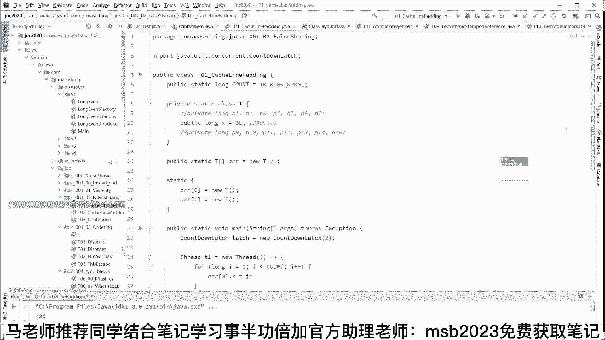

# 马士兵教育MCA架构师课程 - P24：先从一个小程序了解并发 - 马士兵学堂 - BV1RY4y1Q7DL

今天我们从那个最根本的并发开始跟大家聊呃，要聊这个东西呢，我们从我想想从哪开始聊，就就从最简单的一个小程序开始好吧。

最简单的小程序我们开始呃，这个小程序呢。

你跟着我的思路啊，我先带大家读一下。

我们先从小程序开始，这小程序呢大概长这样一个很小的小程序，我们这里有个循环变量，就循环变量名字叫count，它的数值是十个亿，10亿啊，相当于我下面有一个东西呢循环了11次。

好在这里我们有一个class t t，里面有一个成员变量long类型的x啊，就这么一个非常简单的类。

好，接下来我构建了一个数组，有两个t，那么20=6 t ara一等于6t好，同学们看这里相当于呢这是一个数组，这个数组里面装的什么东西呢，装了一个t又装了一个t t里面长什么样啊。

t里面有一个小x小x大概长这样是吧，好接下来呢我们做了一件什么事呢。

往下读，做了这么一件事儿，我们起了两个线程，这是第一个线程，这个这个第一个线程不停的修改，arr 0的x修改11次，第二个线程不停的修改arr一的x修改11次，其实这个小程序就这么简单嗯。

重新用画图的方式解读一下，我们有两个对象，这是第一个t，这是第二个t好，这是第一个t里面的x，这是第二个t里面的x，然后呢我们有两个线程，这是第一个玩命改他这第二个玩命改。

他大概就是这么一个程序来这块没有问题的，同学给老师扣个一啊。

能跟得上的，有点反馈啊，ok懂懂金心，ok感谢，看这里，我们最后呢其实算了一下呢。

很简单，我们算了一下整个程序执行完大概花多少时间。

那好跑一下看。

好看这里啊，这是我们花的时间，这个时间是多少，798，大家记住的时间大概800个毫秒好吧，接下来我对小程序呢稍作修改。

改的地儿不多，就把这两行注释给打开，唉这两行注释打开之后发生什么现象呢，相当于我这个整个class里面呢，我给它加了一些乱七八糟的数据，看到了吧，唉前面给他加了七个long，从p一直到p7 。

在这个x后面呢给他加了又加了七个楼，七个类型，七个long类型的啊，从p9 呢一直到p 15，是不是哎那好，原来这就相当于什么呢，我在用画图的方式说一下啊，相当于什么呢。

相当于哎这个是我们最开始的第一个程序是吧，两个t ok这是第一个t里面的x，是第二个t里面的x，然后有个县城玩命的去改它，第二个线程的玩命去改它，那么我们改了第二个程序之后呢。

相当于在这个x前面从p11 直到p7 ，给他加了好多好多的数据，往后面呢也给他加了好多好多的数据，p9 呢一直到p 15 k相当加了好多冗余数据，当然我们改的重点改的还是这个x，右边这个也一样啊。

我们加了一堆数据，加了一堆数据啊，其他的程序其他的地方哪都没变，刚才呢我们是800多毫秒，我们跑一下看啊，现在新改过之后，这个时间注意看他是244，看了吗，就是最开始的时候是798，现在是244。

也就是意味着什么呢，同样的这个小程序哎，我们给他加了一些乱七八糟数据之后呢，它的效率提升了，来能get到这点，同学你给老师扣个一，好吧啊，稍微给我点反馈，我能知道待会是不是是不是跟上了，是不是听懂了啊。

呃刚进来的小伙伴呢给大家解释一下，那个呃腾讯课堂这边呢他出了点bug，所以呢呃今天呢大家移步移步到咱们自己，咱们自己开发的这个直播间，好吧嗯，哎这就是小程序展现出来的现象，那么这到底是为什么呢。

为什么我们给他给它添加了很多。

乱七八糟数据之后，它反而是效率变高了呢，哎我有我理解上应该是添加这些数据呢，它的效率才会变低才行，你看啊，我把它注释掉，我们就是又回到了那个干干净净的x是吧，好了又是796，哎如果我把这个注释打开。

呃再跑一下，244啊，这就非常奇怪了，这是这个原因是什么呢，在这里呢，这个原因呢其实就是并发的底层里面的可见性，ok下面呢我来给大家解释这个原因，这个原因呢比较特殊啊。

你你要跟着我的思路慢慢走好吧，我们呢从，我把这些线程历史啊，还有面试题啊，基本的概念我就我就不说了，呃我们从呃计算机的组成开始慢慢说啊，听我说呃，我们一般的所谓的这个程序呢，它是怎么执行的。

呃这个事呢比较重要，一般的程序啊，你比方说有这么一个程序叫qq啊，点e x e，假设是windows底下的qq。ex e，他没事的时候，实际上这个文件啊是躺在硬盘上的，对不对，我们把它下载下来。

想让这个qq。ex e运行，我们双击它，双击一个图标，这个qq。e x e的整个程序会放到内存里好了，这就是内存里面的这个qq，点e x c，当然你如果还想运行第二个的话，你再点一下。

还可以有第二个qq，ok对应的是一个文件，说的对吗，那好那这个程序运行的时候怎么运行的，这个程序运行的时候是这样的啊，找到main，不管你是java还是c还是python还是谁，一定有一个主函数。

找到main开始的地方，然后一一句话，一句话的把对应的这些数据放到我们的cpu里面，把对应的指令读到cpu里面，举个最简单的例子，比方说2+3，2+3，这东西是是是怎么算出来的呢。

好当我们读到这这条语句的时候，会把这两个数据二和三唉放到cpu的某个位置上，当然这个位置呢叫寄存器，用来存储数据的呃，好多同学没有学过计算机的一些硬件原理，我在这儿呢稍作补充。

总之呢就是把二和三唉放哪去呢，放到咱们的cpu里面去，好这个二和三其实正常的它在哪啊，是在内存里面是吧，把这个二读过来，读到cpu放放一个位置上，把这三读过来放一个位置上。

然后呢我们对这个23做了什么操作呀，加法操作好，把这个加法指令add o，放到我们的一个叫做program counter程序计数器，其实也是一种指令寄存器啊，大概就这意思就是记着我。

我现在要做什么样的操作啊，是一个ad的操作，这个呃加法操作，然后呢最后就得出来的数值啊，我们得出来的五唉，再给他写回到内存的某个位置上去，大概是这么个过程来，这个过程大概能听明白的，给老师扣个一。

这没有问题吧，总掉线吗，总掉线咋回事，诶首先我我我我的网络还可以啊，因为我这里显示是一帧我都没有掉啊，我一帧都没有掉好，大家看这里啊，那个，这是一个非常简单的程序的运行的原理。

你会发现呢其实所谓的一个小程序啊，呃我们来运行它的时候，其实呢就是呃cpu和内存它们之间的不同，不不间断的不停顿的打交道的这么一个过程，在这个访问过程之中，我们说。

cpu它的速度比内存的速度呢大概快好多好多倍，那大概快多少倍呢，还100倍100倍，有人说这哥们访问一下我的寄存器，如果需要一个纳秒，那么从这哥们这里要是访问到内存去的话，得需要100个纳秒啊。

这是它的速度的差距，速度非常快，那速度非常快的话呢，这就会产生一些问题啊，呃我要是读读里面数据二和三是吧，我读过来我得需要200个纳秒，读一个需要200个对一个，但是我计算一下的话。

我可能只需要一两个纳秒就搞定了，我cpu大多数的时间呢其实在等待啊，这样的话呢对于cpu来讲呢，它就比较浪费啊，我给你提供了这么高的算力，但是你用不上，那怎么办呢，怎么办呢，琢磨一下。

如果我想让从cpu往内存读数据效率变高，诶你猜猜我们该怎么办，兄弟们，课件可以领取吗，可以啊，该怎么办，还挺恶心，技能ok对放缓存这个很容易理解，就是我们在中间啊，由于它离得太远了，速度太慢了。

怎么办呀，哎我们在中间的位置给他放一个啊，离我稍微近一点，他的速度就没那么慢了，然后这里有个二，这里有个三，哎我在这里也放一份二和三，下次啊我要再在访问这个二的时候，我就从这访问了。

我就不会去那个内存里面的，我守着这个距离，如果大家理解不了的话，你把它这个这个地方理解为北京，你把这个地方理解为上海，那么当我们从北京到上海取一份数据，取得比较慢的时候，怎么办，我在济南给他缓存一份。

往这也放一份，我第一次的时候呢，济南什么什么什么什么东西都没有，但是呢我从北京访问上还访问到这个二的时候，往回读的过程呢，我往中间放一份，下次再访问这个二同学们就直接在济南访问了，听明白了吧。

那我再问你，如果从北京到济南，你访问你还觉得慢，你怎么办，还觉得慢的话，中间再放一份，天津在天津再放一会儿是吧，北京到天津，你要还觉得慢呢，各通县一份，ok那那天安门到通县，你还觉得慢怎么办。

跟那个跟那个天门到通县中间是吧，找个找个位置啊，然后再放一层等等，大概就这个意思，那么现在问大家一个问题啊，你们你们动脑筋思考一下，你说呃这一层一层的缓存，我们是多了好呢，还是少了好呢。

兄弟们认为多了好多桥，多，认为少了少了少了，好的桥少多了好少了好，这东西是这样的啊，听我说看情况对，杨大哥说的非常对啊，大家不要认为多就一定是要多少就一定要少，那不是这么回事，多有多的好处，少少的优势。

那多了的好处是什么，多的好处是当我们下次再读数据的时候，它的效率会变高，什么意思啊，比方说我们这里有一层啊，这里有一层，这里有一层，这里有一层，有好多层，由于最近的这一层离我比较近。

如果这个数据我要读的数据呢，最近这层里面有那嗓子速度当然就快多了，但是呢你同学们，你们想一下，如果在每多层的缓存里面都有一份啊，我们想要的这个数据，这个x那假如这个x发生了变化。

那是不是我这个所有缓存里面的x都要改变，想一下是不是如果内存里面的x发生了变化，我这个是不是都要改变，都要变一下，所以呢它维持它的数据的一致性，这块要花费的效率，就花费的精力就比较花费的代价。

就表达能理解我说的意思吗，就是你要保持这些缓存中间的同一个数据的，要保持一致，那你保持一致的话，由于你层数特别多，那当然你花的代价就比较高，这个比较简单，很容易理解，那好这是呃多了的情况，那少的情况呢。

少的情况是我要维护他们之间的一致性代价，我会我会比较低，我改一个地就可以了，比方说只有一层，如果说只有一层情况下呢，又会它的不好的地方在于说诶，他访问的时候的速度也会变慢，所以呃中间到底要放多少层缓存。

这件事听我说啊，中间要放多少层缓存，这件事是工业界呢经过了很长时间的探索，然后呢根据现有的这种硬件的条件，这么来决定的，到目前为止呢，我们绝大多数情况下的，我们的cpu这个缓存的大概是多少呢。

这个缓存大概是三层缓存啊，我把它称之为叫三级缓存，我们略过一些啊，vip里面讲的内容啊，主要看这个缓存的问题好到目前为止呢，我们呃呃我我不在这讲了，我们讲的就是三级缓存啊，再用用用这张图来讲。

这个三级缓存到底什么意思呢，就是从我们的cpu的计算单元啊，或者说从我们的cpu的寄存器吧，在这个位置，那么到我们的内存里面，中间呢是有三级缓存啊，这是第一集，我们称之为叫l one。

这是第二集称重解l two是第三节l three，然后呢内存这个缓存的位置呢，大家不用纠结，如果你没有学过硬件，你可能看着比较别扭一点，实际上这个缓存的位置呢是每一个单独的。

和大家都知道cpu有不同的核，每一个单独的盒都有自己的两极缓存，然后呢，好多盒共用的封装在一颗cpu里面的一整颗啊，两个盒双核cpu，那么它共享一个l3 的缓存，然后cpu直接来访问内存。

大概是这么一个过程，好同学们听我说，当我们有了这三级缓存之后啊，三级缓存的概念来来跟得上的，听明白的老师扣个一啊，我这三级缓存16兆，那不少了，挺挺大的，这块应该没这块应该没问题，比较简单。

那我来考虑一个读数据的场景，比如说啊我们现在这个程序啊，我要需要读到这个内存里面的这个x这个数好，那么读的时候怎么读呢，他读的时候是这么来读的，我首先去我的一级缓存找，我没有找到，那怎么办，去二级啊。

当然有些特殊情况，直接去二级找，就是找不着的情况下怎么办呢，往下级再再再去找啊，l3 也没有，怎么办好，去内存里面读，我读到这个数据之后呢，会顺手往l3 放一份，l2 放一份，l一放一份。

ok那我们下次再用到这个x的时候，就直接从l一可以放完了啊，大概这么一个过程呃，那好我现在再问你一个问题，大家思考这么一个场景，如果我们对每一份微小的数据，每一份微小的数据啊，这么小啊，一个比特啊。

或者一个字节非常少小的一份数据，每次访问的时候呢，比方说我就我这程序非非常特殊，我就是访问了数据一次，ok每一份小的数据，我要访问他的时候都要来这么一遍，第一个找不着找第二个，第二个找不着找第三个。

第三个找不着，ok找到我的位置，y找完了之后呢，往这儿放一分，往这放一分，往这放一分，他效率反而变低了，反而不如直接去访问内存了，是不是这样子，所以呢在这个里面我们还有一个优化的空间。

实际当中呢他是这么来读的，怎么读呢，就是当我用到一份数据的时候，比如说这个x然后我读这个x的时候，我是按照一整块来读啊，我读它一整块的数据x y z是吧，a b c啊，我一下全读过来。

如果这事你理解不了呢，你把它看成一个数组，一般来讲，我们比方比方说我们对数组做一个循环操作，是不是一个for循环啊，从第一个数据开始，然后不停的循环它，那我读我访问到第一个数据的时候呢。

我就把整个数组的数据，一次性的全部给放到缓存里，全部放到缓存里，全部放到缓存里，那就是说我只有第一次的时候，我访问第一个数据的时候，我把这个数据呢放一次，但是第二次访问第二个数据。

马上我就不用再访问第二层三层内存，这个效率就高多了，它的速度会非常快，o这个概念大家是不是能听得懂，就是我读一个数据的时候，并不是说我只读这个数据本身，而是把这个数据放到一整块里。

把它周边的数据一块拿过来，用数组的例子来举的话，就是我们用到的很多种情况呢，呃我用到数组的第一个数据，我大概率会用到这个数组第二个数据，所以我把它读过来，我下次在我离我最近的缓存里去访问。

他的效率就变高了，嗯这块没有问题的，给老师扣个一了，对空间换时间没错啊，比较程序的局部性原理没错啊，就是程序的空间局部性原理啊，当然还有程序的时间局部性原理，这个这个不知道啊。

这个咱们不管他怎么知道是不是第一次，他只要反他，只要他只要看到这个第一级缓存里没有，他就认为是第一次呀，ok大家听我说，下面你再思考另外一个问题，这个问题是这样的，就是我们这个块的这一块的大小是多少。

它大小是多少呃，是大了好还是小了好啊，我们反正我们读一次呢，要读一整块数据，这个这块数据是大了好还是小的好，同学们，来认为大好的敲打，认为小的好的话呃敲小好吧嗯，不大不小适中也看情况对啊，说的很对。

跟那个刚才的层数是一样的，就是大有大的好处，小有小的优势，大有大的不好的地方，小也有小自己的缺点是吧啊，它这个大了有什么好处呢，我们来分析一下，其实很容易理解，如果这个块越大。

那么我一次性能够缓存的数据量就越多，我一次能缓存数据量就越多的话，那我当然命中的概率就比较高，就是我找到我想要的数据里面一下就找到了，就就比较高，但是如果这个块过大的话，我读任何一个小小的数据。

都把它周边的数据全部往里面存存一遍，这个效率肯定会变低，同样的，如果这个块儿过小，存的效率保持一致性的效率肯定变高，这个没有问题，但是呢我的命中率就会变低，哇塞这外面是发生了什么情况。

呃因此在我们同样的啊，也是在我们工业实践的过程之中，找到了一个妥协，在目前为止绝大多数的情况下，这一整块数据的大小，麻烦你给我记住一个数数字，这是数字是多少呢，64个字节来给我记住，不是64位啊。

是64个字节，另外呢给这一整块数据单独取了一个名字，这个名字的名称叫缓存行，缓存行就是我们读数据的时候是一行一行来读，ok它并不是说一个一个来读，而是一行一行来读，缓存行，64个字节，这个概念听懂了吧。

等于16kb大哥，我再给你说一遍，16 64个字节ok了，这个概念叫做缓存行，cline的概念。