# 系列 6：P26：缓存一致性协议 - 马士兵学堂 - BV1RY4y1Q7DL

呃我相信网上的好多，好多同学呢应该读过和缓存行有关的，一系列的方方面面的文章，呃各位同学读过的，你给老师扣个一啊，看有没有读过的，一直不清楚核到底是什么，如果你想透彻的理解的话，得去学那个数字电路。

但是你简单理解的就是，用一个用来计算的单元就可以了，嗯64x8比特对，64个字节啊，好当你理解了这件事情之后，呃，我们来考虑就是这么这么一个场景啊，现在啊，假如说这是我们内存里面的各种各样的数据。

它是呃从逻辑上来说呢，它是一行一行一行一行的，对不对，那在某一个行里面呢有两个数据，一个是x，一个是y，那好假如说啊我们现在有一个线程，那么大家都知道这个线程是跑在不同的cpu上的。

也就相当于呢我有一颗cpu，需要去读这个缓存行的数据，那么读出缓存行数据的时候，他是怎么办的呢，他首先是在一级缓存找，没有二级也没有，三级也没有，怎么办，ok在我们的内存就找到了。

注意这哥们儿要访问的是这个x啊，这个面好，这个x，但是呢他会顺带着把一整行数据全部读过来，ok它这次呢l3 里面把一整行数据缓存在这，把l2 里面缓存一份，l一里面缓存一份，然后呢我以后对于x的访问哎。

就直接从这里开始访问了哦，很简单，那与此同时啊，有另外一个cpu或者说另外一个线程，它要访问的数据是谁呢，他要访问的数据是y，他首先在这个里面找有这个y吗，没有二级里面也没有。

他去三级找三级里面有没有这个y啊，有三级里面这个y在哪个环，在哪一行数据里面在这一行，所以它会把这行数据放到这，把这行数据放在这，然后呢他就开始访问这个y是吧，这边就开始访问这个x大概这么一个过程来呃。

我们这个图呢比较容易看懂啊，那么在这里呢大家伙你瞅一眼，其实对于同一行数据，同样是这个xy所在这一行的数据，它有多少个备份，你看一眼啊，一共有多少个，同样的好备份好，一共有多少个。

一个两个三个四个五个六个，ok那我就想问你了，如果在我们这边这一行的数据发生了改变的话，我要不要使用某种机制去通知另外一行，说哥们儿，我这行的数据发生了改变啊，你这边有及时变化啊，你这边有及时。

你你要不及时变化呢，你访问到的就是没有更新的原来的老数据了，就可能会出问题，原来这个x是零，然后呢我已经把它改成100了，但是呢由于你读的比较早，你这个x还是零，现在我通知你，你得更新一下，哥们儿。

你得更新一下，不更新的话，你这个x的值就是老的值，有可能会不对，咱这块儿听懂的，给老师扣一没有问题吧，也就是说我们需要某一种机制保持什么呢，保持住我们各个缓存行之间的数据，让它保持一致，就是出香之间的。

你不要有错了的现象，ok都保持到一个最新的状态，所以我们讲每一个不同的硬件，每一科不同的cpu啊，不同的厂商都有自己的这种协议，来保障不同缓存行之间的数据，来让它保持一致，避免用到的时候会出错，好了。

这个协议呢我们把它称之为叫缓存一致性协议，叫缓存一致性，ok我们带来这个概念叫缓存一致性协议呃，有多少同学听说过缓存一致性的，有没有缓存一致性协议，这个协议里面有常用的协议有哪些，有听说过。

你敲出来有没有酒吧，有没有听说过这个词，就是m e s i是吧，网上一搜应该一大堆，这是什么，这就是英特尔，英特尔cpu经常使用的，英特尔cpu的使用的那种缓存一致性协议，呃，但是呢需要各位同学听清楚。

就是不同的这种cpu，不同的硬件厂商有他自己的缓存一致性协议啊，有的是英特尔的m s，有的使用是m s m o s synfirefly，dragon protocol等等。

这些东西呢都是现有的cpu厂商所提供出来的，方方面面的这些个缓存一致性，所以大家不要把m e si等同于缓存一致性，这块就就行了，呃，vip课程给大家详细解释了呃，至少是粗略让大家入门什么是msi。

但是在这呢我就不展开了，那个呃各位同学听我说啊，网上有很多很多文章啊，就是把msi和volatile等同起来，还有呢把m e s i和缓存一致性协议等同起来，我告诉你这些全是不对的。

全部队没有一个是对的，听我说，缓存一致性是一个普遍性的称呼，具体的协议，每种硬件厂商和每种硬件厂商它不一样，这块能理解吧，嗯ok好看这里看这里，那那么我们回到刚刚那个小程序好吧，当你理解了这件事之后。

我们回到刚刚那个小程序，就这个小程序呢你会发现诶，我把这个x前后给他堆了一堆的数据之后，大家大家稍等我一下啊，我让咱们外面的咱们的小姐姐们小点声音啊，我马上回来，这边说了放小声，说把声音放小了。

说话声音放小，ok ok好，看这里老板生气没有生气啊，看这里看这里，就是呃，当我们把x前面给他堆了一堆的数，冗余数据之后呢，我们的访问效率反而提升了啊，这个原因到底是什么呢，我们来分析一下。

这是那个第一个x，这是第二个x呃，然后我们这个这个这个线程呢，使着劲或者这个cpu的使劲使劲去访问它，这边呢使着劲儿去修改它，那么在第一种情况下，我们x前后都没有什么数据，s前后没有什么数据呢。

这俩哥们儿大概率啊，我们不能说所有的概率就是大概率位于同一行，这个没有问题吧，那为同一行就意味着什么，意味着说诶我这边呢会有这行的缓存，你这边呢也有这行的缓存，那我改完了这一行的某一个数据之后。

我只要改了其中一个呃，我肯定得用使用某种机制啊，不管这种具体的机制是什么，我一定要通知另外一个线程，或者叫另外一个cpu是吧，就是我这边改动的东西，你那边得可见可见性是不是哎我这边改完了。

你这边得得可见k采用什么样的机制，让你可见是立刻可见还是固定时间，而在什么情况下触发你可见等等，不管怎么样，我得我得使用一种协议来通知你，你想我这边改了10亿次，那我就来回来去老通知你。

我这边改了改了改了改了啊，然后呢，你这边改了第二个x也得来回来去老通知我，所以当我们这个线程开始不停的修改x的时候，看上去他们两个互相之间不影响，但其实他们在内部在不停地使用缓存，一定的协议来保持一致。

那么为什么我们在它前后加了很多数据之后呢。

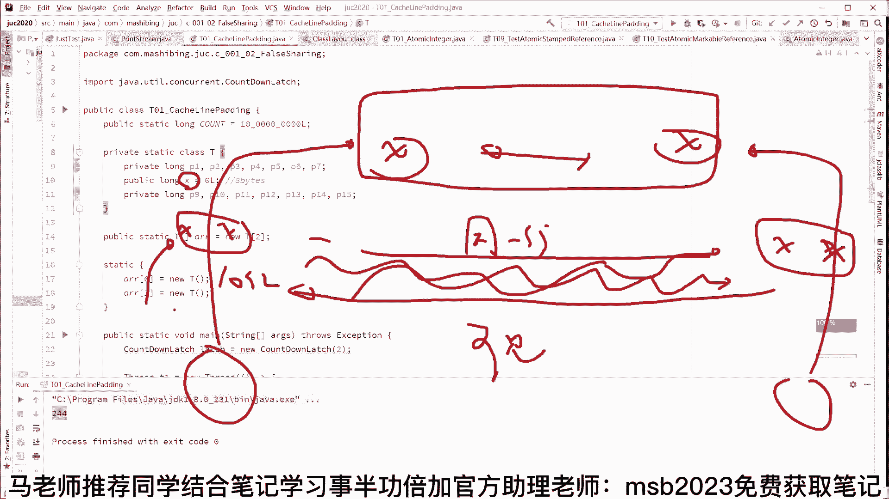

它的效率就变高了，原因是什么呢，其实也非常简单，同学们，你们想一下，如果我把这两个x想办法，让它位于不同的缓存行里面，诶我前面给他堆一堆数据，后面给他堆一堆数据，然后呢这个x前面也是一堆。

后面也是一堆好了，这哥俩呢由于是这个长中，中间的长度，已经超超过这个这个这个缓存行的长度了，所以呢哎这个x位于这行，这个x位于这行，那么同学们你们想一下，我这个线程去访问他的时候，这个线程访问它的时候。

我们还需要互相通知吗，待会不位于同一行数据啊，所以你这边缓存只有这个x，你这边缓存只有这个x，没有其他了。

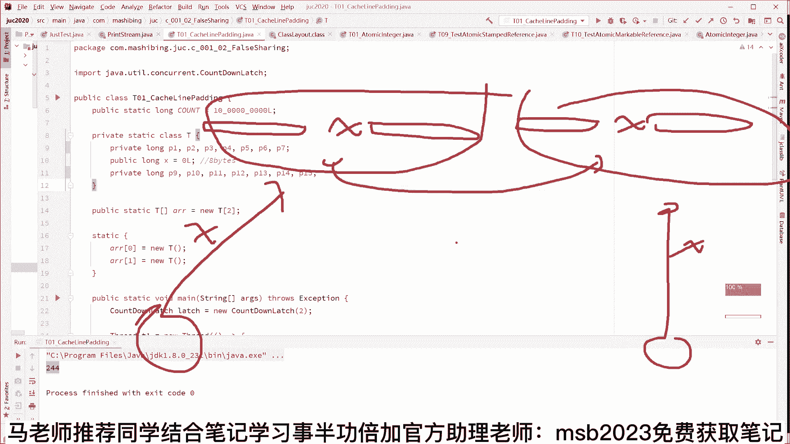

在这块听明白了，也老是扣个一，所以就相当于什么呢，相当于我们用了前后的冗余数据，把这个把这个把这个数据给它保护起来了，保护在一个单独的缓存行里面，是不是很简单嗯，所以它的效率就提升了啊。

这就是我们这个小程序，你把它注释打开之后，它效率提升的根本原因啊，前有同学老师理解不了这一点，所以那个我给大家画了一小图，这个小图一看就能理解，大家还记不记得还记不记得，就说我们一个缓存行的大小是多少。

是64个字节，是不是那好啊，我们一个long类型，java里面的long类型是都是多少多少啊，是八个字节，是八个字节，那64÷8，也就是我们统共一个缓存行，里面能装多少个long呢，一共有八个。

所以我在这个long前面放七个，这个long前面的这个long后面放七个，那么你想想看，无论你如何的排列组合，不管你这个缓存行到底你是你，你是怎么划分啊，你是从哪开始划，无论你怎么画。

哪怕你从这儿开始画，ok我跟前面组合成组成一行，或者从这儿开始画，我们后面组成一行，或者从中间开始画，把我放在中间，但是你放心，我绝对不会和另外一个x位于同一行，以前有同学说啊，以前的同学老问说。

老师啊，你为什么在前面放七个，后面也放七个，你你你你都放前面行不行，我做了一下实验，我发现只要前面放了就可以，是的这个是没问题的，你你把这个前面放了呢，也有可能和其他x不为同一行。

比如这个x在这个位置是不是，但是你要小心的是，有可能这个x位于这个位置，那么它和后面组合的时候，这俩哥们又位于统一好了是吧，同学们乘有两个x吗，乘有两个，你有一个数组啊，你仔细读那个程序就知道了啊。

它是它是一个数组啊，我是用我我是做了做了一个一个数组，这个x这个x啊做一个数据，ok，这就是为什么呢，我们在前后给他怼上这些冗余数据之后呢，它的效率提升的原因，那有同学可能就会说了。

说老师这这这我我要编程，我要考虑这些东西，我就累死了，对同学们听我说，你们日常要编程，要写成这样，我估计你们你们老大他他他会骂，你看不懂是吧，你在干嘛，嗯嗯所以这个东西呢大概存在于两种场景之下。

第一个场景呢，是你真的在为整个公司的人在做类库，在在写底层啊，你写的这个东西呢，你们整个公司的人都在调用，你要想办法提升你效率，可以考虑使用这种技巧，第二个什么呢，第二个是面试。

这是这这这对我们来说是有意义的，以前老有朋友问，说老师讲了半天，这些东西我谁都开发也用不上，我学了干嘛干嘛呢，很简单，过面试最简单的逻辑就是你过了面试拿25000，过不了面试，一分钱拿不着。

或者说你答出来这道题答到这个深度了，拿25000，你达不到这个深度，虽然也让你过了，拿15000，中间差1万块钱，这就是它的存在的意义，好多同学不理解，为什么大厂里面考的东西越来越深，很简单。

因为考浅的，已经不能够把大家伙的水平给区分开来了，考一个招一个切土豆的，一来来了1万人，我怎么切啊，没法切啊，我都不知道该选谁，怎么办，来加强点条件啊，了解那个刀的结构的优先嗯，刷刷去9000。

还剩1000人，还是太多，了解土豆营养的优先，听懂了吗，嗯这就是它存在意义好吧，那么真的有真的有人是这么写程序的吗，呃其中呢如果你是jdk一点七，你要读过源码的话。

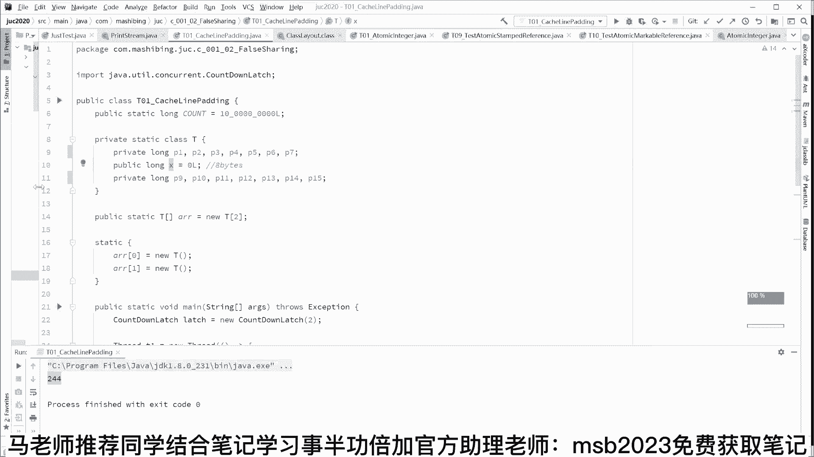

那个lb q就是link的blocking，kj u c里面的那个类，他就是这么写的，如果你还理解不了的话，那我再给大家介绍一个小的框架，这个框架的名字叫this rapture。

这框架不知道大家有没有听过。

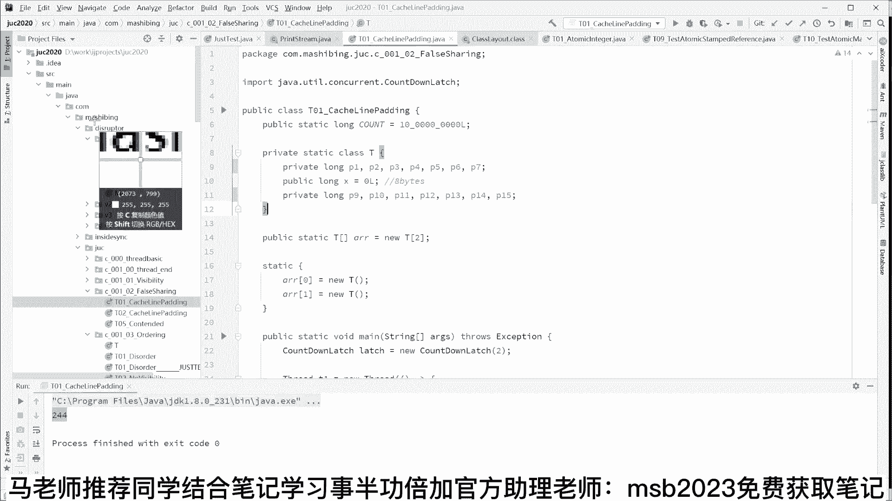

那要听过这个框架呢，你给老师扣个一distrutter，嗯然后找人来做核弹的切土豆，那没办法，做核弹的太多了。

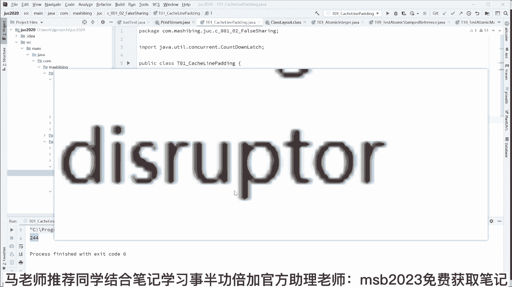

潇洒廉价扣二其他人呢有没有人听说过是吧，有事没事的，多去了解方方面面的各种各样的框架，呃，这个discharter这个框架呢曾经获过一个奖，叫杜克奖，这个奖项相当于计算机械的奥斯卡奖。

你可以这么来理解就行了，它是英国的一个做交易的公司，l max所开发出来的，它可以理解为最，效率最高的嗯，最快速度最快的单机版的mq n q message q，message q呢就是消息队列啊。

一般来讲呢你可以把它简单认为是一个数组，然后呢我一个一个消息扔进去，有一大堆的线程往里头扔消息，还有一大堆线程呢从把这消息读出来，ok这就是一个mq，一个mp呢，大概率的同学们会认为它是一个数组来构成。

或者链表来构成啊，总之呢就是一个线性结构，但是呃这种呢一般有一个头指针，有一个尾指针是吧，我们新新来的呢，哎把这个为把把往往尾巴上放是吧，读的时候呢，你按照按照自己的规则来读，那好呃。

我们这个disrupture，它采用的这种结构呢和其他的不太一样。

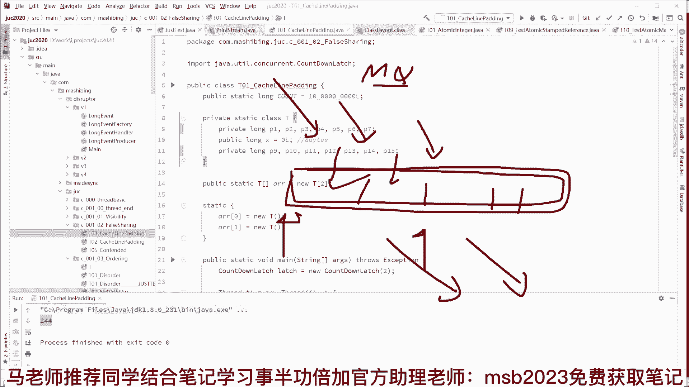

它是一个环形结构，它一个环形结构，一个环在这个环上面分布着一系列的存储位啊，二的多少次方，然后我们最开始的这个指针指在零零，或者叫指在-1这个位置上啊，然后诶等我们向下挪一个，他就指到了零这个位置啊。

指到一的位置，指到二这个位置，我们指针指到哪个位置，你就往哪个位置上放东西就行了，哪有东西是我放满一圈了，怎么办，放满一圈呢，你就等着这个零被毒走了，被释放了，你就再往里头放就可以了好了。

这个玩法呢它就只有一个指针就搞定了，它不需要一个头指针，一个尾指针需要两个指针，只需要一个指针就搞定了，ok那这个这个玩意儿呢，就嗯这方面呢它提升了一个效率，它其实提升效率有两个大的方向啊。

一个是c a s，这个明天我讲给大家听啊，就是做这种无锁的等待嗯，cs然后呢，其中还有一个就是使用了我们这种catch line ping，叫缓存填充技巧，o看这里，那么他是怎么做的呢。

好我们来读一下这个指针它的源源码，大家可以想象一下，就是这个指针的话，它一定是好多好多线程去访问它，因为好多线程都往里扔吗，好多线程去访问，他，要争取对这个这个数据要进行保护啊。

要不要和其他数据混在一起，不要和其他的有用的数据混在一起，这个呢万一其他数据改了，他们两个位于同一行的话。

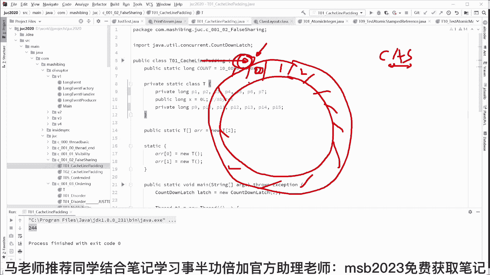

还得来回来去的进行这种缓存行的一致，效率就变低了，这个东西呢它是追求效率的，框架名怎么拼，没记住这个啊。

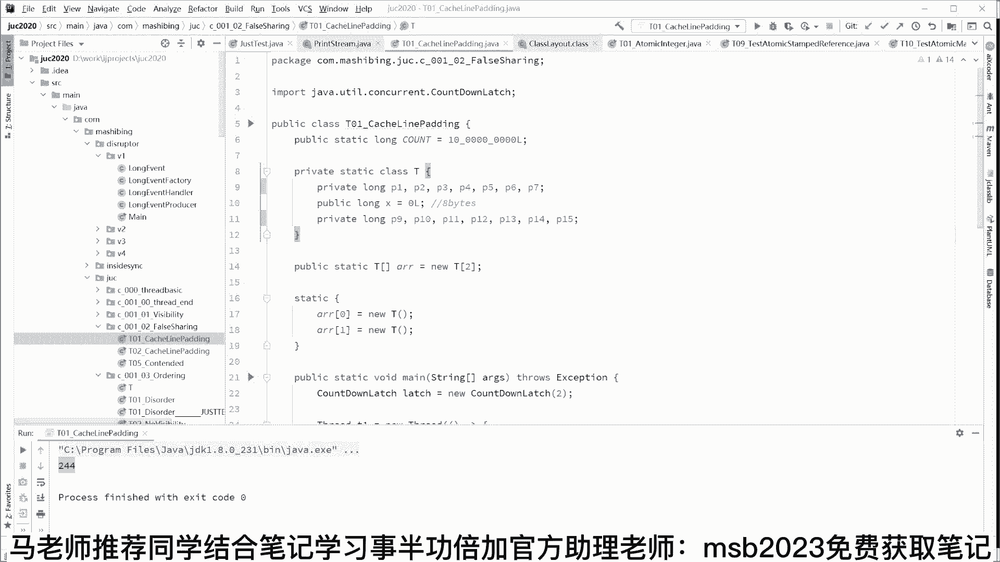

给大家打开这个框架，disrupt。

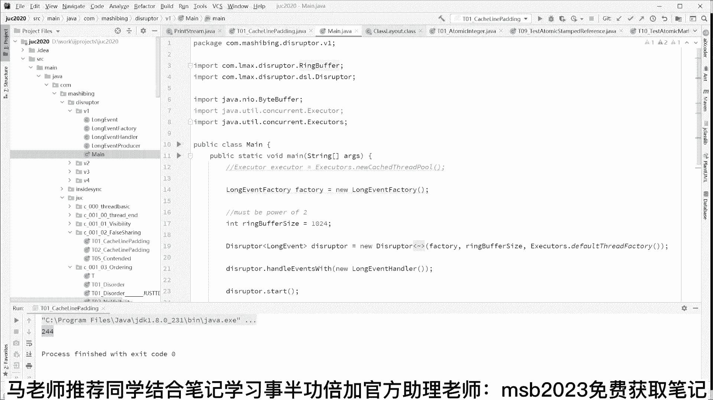

闪电啊，你如果你如果没记住的话。

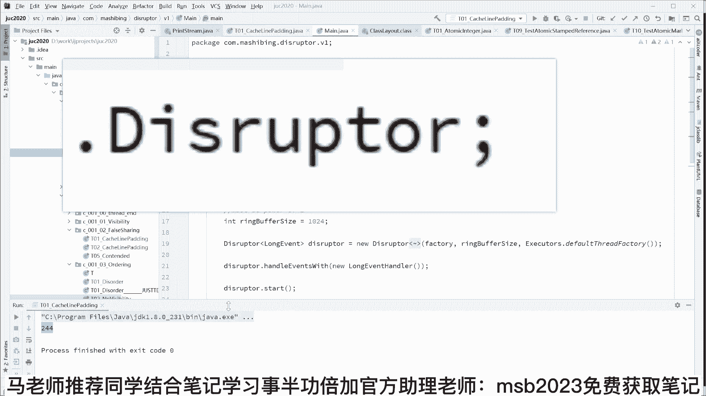

那你就记这个闪电就可以了啊，英文的闪电像闪电一样快，不是那个疯狂动物城里面的闪电。

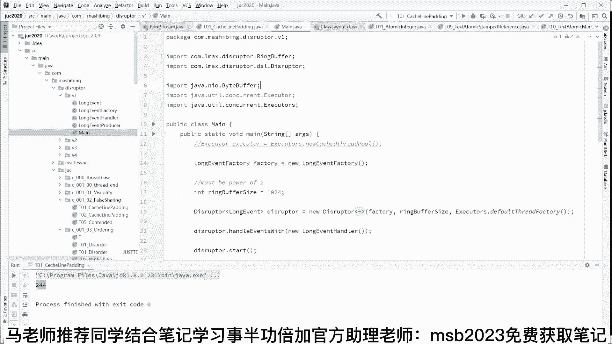

好，我们来看看在这个destruction它的框架里面呢。

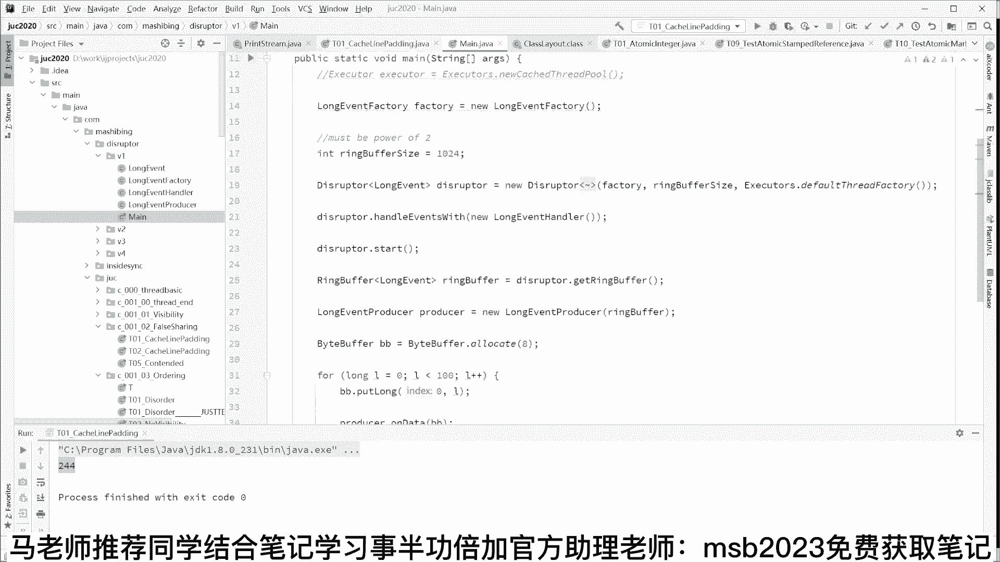

有一个非常好玩的东西呢，叫做ring buffer，ring环形的buffer，环形缓冲区，也就是我们刚才画画的那个环形的那个，纯消息的地方。

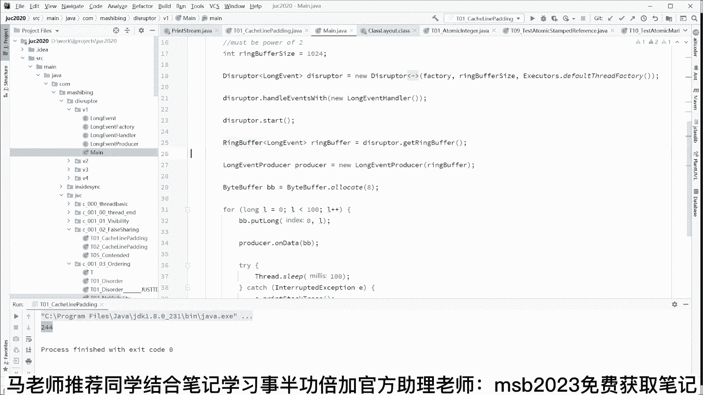

好我们点开这个rain buffer，看看它的源码，你会发现很好玩这个东西，这是那个指针最开始的位置-1啊，然后呢你会发现在这里放了七个lp 1，一直到p7 ，好吧好不好玩，是挺好玩的。

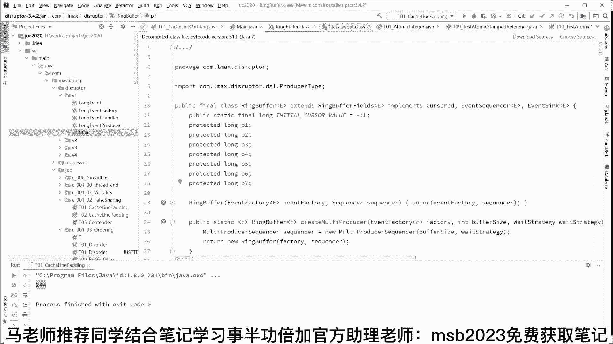

p11 直到p7 ，如果你没有听我讲过，你一定不知道这玩意儿是干嘛使的，很简单，它就是保护那个指针的，不让那个指针和其他地方位于同一行，这样他的访问对那个指针的访问的效率会提升，o来这块能看懂的。

给老师扣个一，是不是有人这么写程序啊，他这应该没问题啊，阿里的基础职位嗯，那有同学说老师这不对啊，你你你只在一边放了呀，只有一边有p到p7 啊，这个不对啊，我们我们刚才讲你要是有一个数据的话。

你得给他放一边，你这x你这个它放在这边，那右边有可能和其他的这种有用的数据。

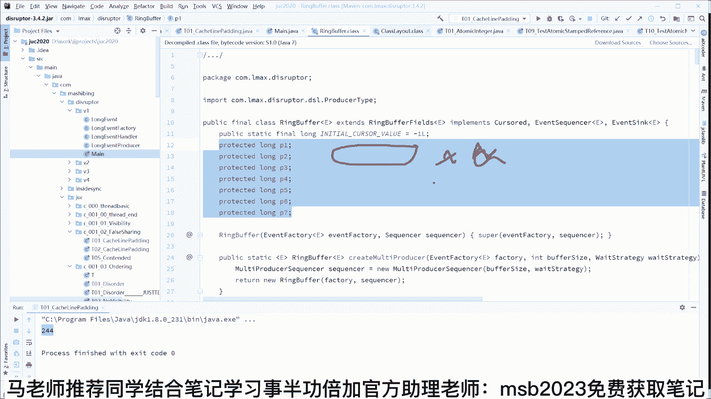

组合在一起啊，那不对是吧，应该还有还有一个p一到p7 才行才对，那么它在哪呢，看这里rain buffer的父类叫rain buffer fields。

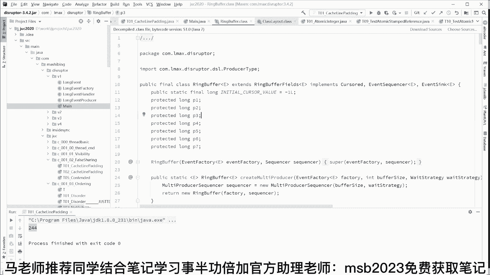

我点进去ring buffer的父类叫ring buffer pad，专门用来做填充的。

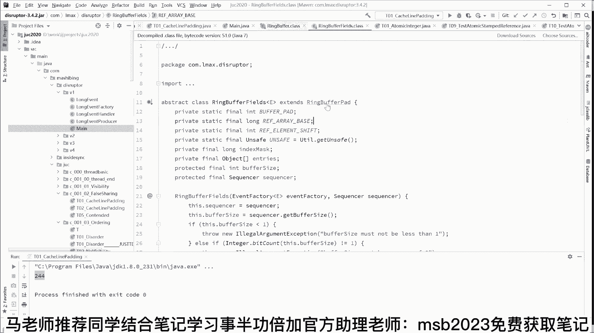

好在这里又有一个p一到p7 ，所以你可以想象一下，这个x前后都有p一到p7 的保护，那么是不是访问它的效率。

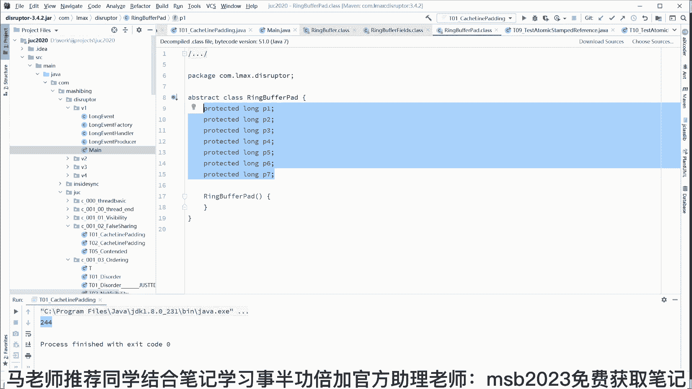

在高并发的情况下就提升了，来这块听懂的给老师扣一有没有问题，这就是最简单的最基本的一个可见性，但是它和程序的可见性还不太一样，它和语言无关，不管你是cc加加python java。

随便你在它最底层的运行上，就是必须要保持缓存行的可见性，o挺好玩的是吧，嗯好当你理解了这件事之后呢，算是开开个胃啊，上点开胃菜，大家呢先理解了一点这种最基本的东西，下面呢我们来讲深入一点的。

稍微难一点的好吧，呃下面这个东西呢我们把它称之为叫做有序性，呃，可见性相对简单，其实就是各个缓存之间如何保持一致，这个改了之后怎么通知对对方好了，这个可见性，那么概念上相对简单啊。

那么第二个呢这个要稍微麻烦一点，这个东西呢叫有序性，打起精神认真听，就是我们写程序的顺序啊，程序执行的顺序。

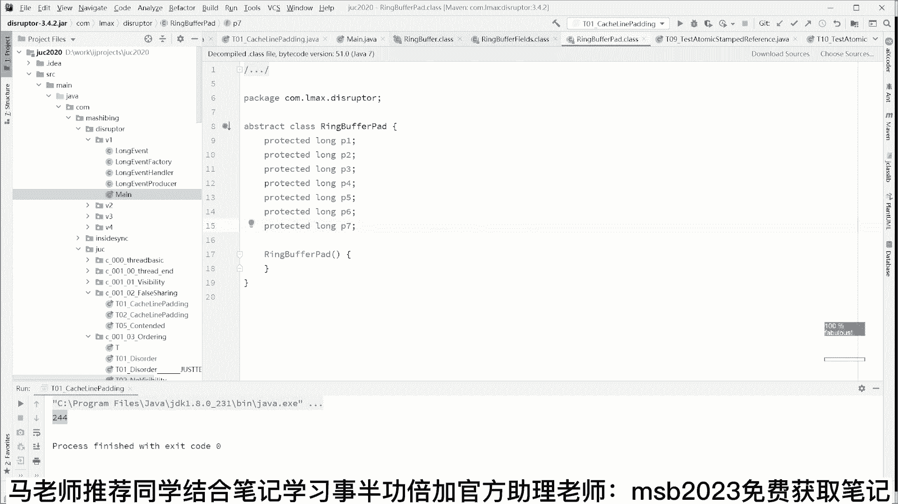

有同学说了，老师你这还有什么可讲的是吧，好同学听我说这个小程序呢，我先让他跑起来，因为这个小程序出结果会非常的麻烦，非常难，有可能最长的时候我等了呢，哎运气真好啊，这次这次只是2万多次，我就得到了。

结果我有一次等等，等，他的话等了十几分钟才得到结果啊，好看这里啊，我给大家解释这个第二个小程序，这个小程序呢比第一个小程序稍微复杂一点点，你要认真听啊，不要，不要走神，不然很容易跟不上啊。

听我说这个小程序是这样的，我们有四个数据，这次数据比较多，x y a和b这是我们四个数据，一个是x，一个是y啊，一个是a一个是b啊，最后我们考察的是这两个x和y的数据，a和b呢就是用来做存储用的啊。

一会儿往下看就行了，然后呢我们进行了一个大量的循环，基本接近于无限次的循环，接下来我在每一次循环里面，每一次循环里面我干了一件什么事呢，起了两个线程，这是第一个线程，这是第二个线程。

好第一个线程干了这两句话，a等于一，x等于b第二线程干了这两句话，b等于一，y等于a就这么简单好，我现在呢需要大家说考察的是什么东西啊，就是这是第一个线程干的两句话，a等于x等于b。

这是第二个线程干的干的两句话，b等于一，y等于a，我现在如果说这是第一句，这是第二句，这是第三句，这是第四句，我现在想问你的是，我们，正常的理解，按照正常的理解，这四句话在时间上先后执行完的顺序。

会有哪些种情况，比如说我第一个线程执行完了，第二个线程才执行，我们执行的顺序就是1234，当然还有一种可能性是第一个线程执行完了，第一第一个第一句话，然后第一个线程暂停了，轮到第二个线程执行。

第二个线程的执行了第三句，然后轮又轮到第一第一个线程，第二句1324能能明白我说的意思了吧，兄弟们，就是我现在要考察的是，这四句话的前后的执行的顺，序的组合到底有多少种。

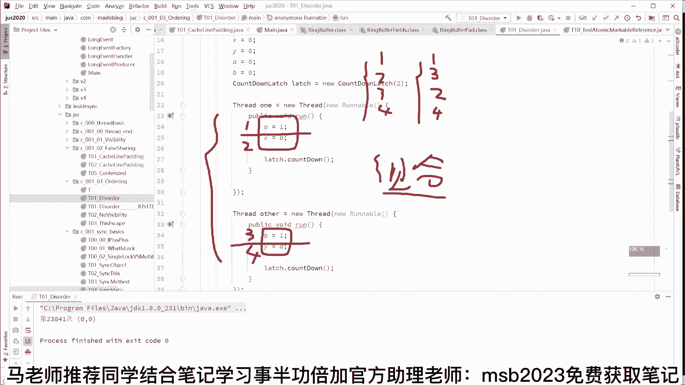

这个大家知道吗，这个组合有多少种啊，就是这个前后的顺序的组合有多少种，这个不不不一定啊，四种no no no，没那么简单啊，这个我就不考大家了。

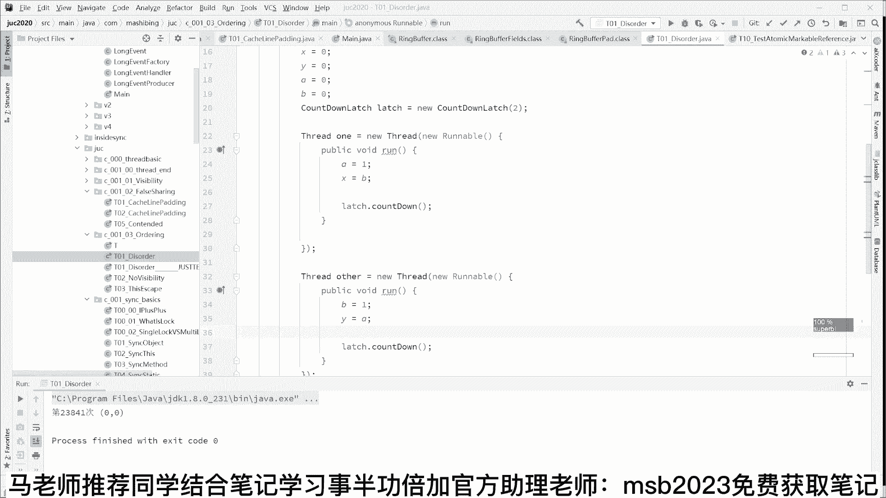

排列组合是吧，比较麻烦，你得自己排。