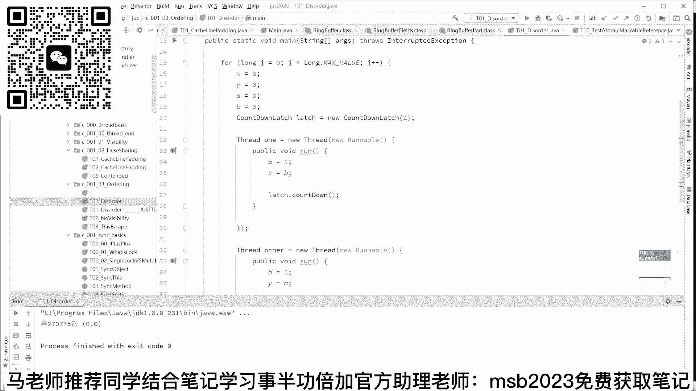
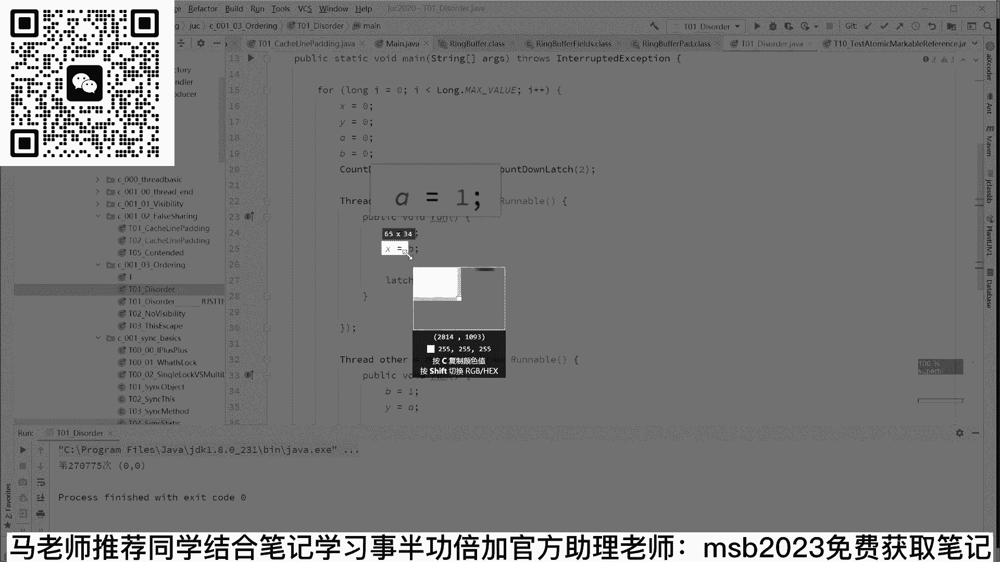
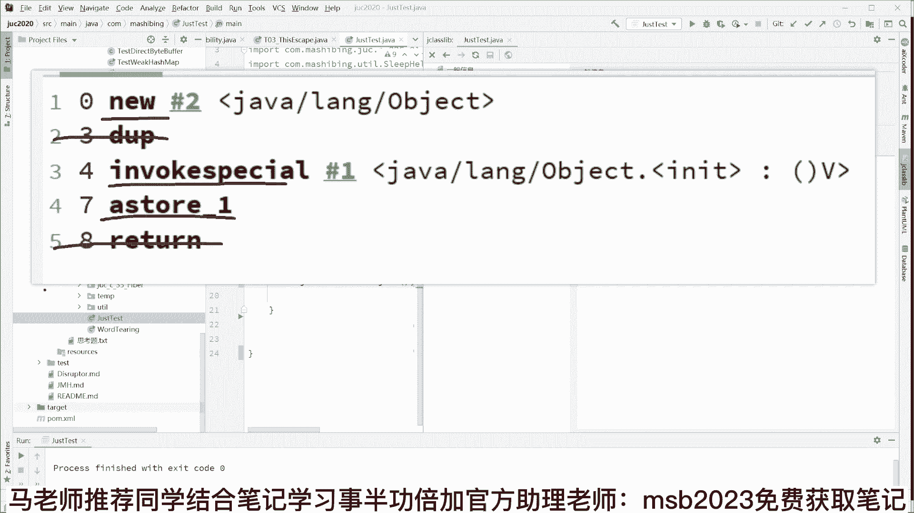

# 系列 6：P27：并发编程底层原理（一） - 马士兵学堂 - BV1RY4y1Q7DL

大家看这里就行了啊，看左边基本上就是这么几种啊，这是第一句，第二句是1234或者叫3412是吧，这种情况啊，1324对吧，嗯3142ok或者1342是吧，然后呢3124大概基本上是这123456。

一共有六种，一共有六种啊，基本就是六种，基本没有其他情况，ok组有六种，看看明白这意思了，兄弟们，那好我们要考察的是什么呢，在这六种执行的情况下，六种不同的情况下，我们最后得到结果。

得到的x值和y的值到底是多少，好我前面讲的能跟上的，你给老师扣个一啊，我讲的是每次讲的是小程序呢，由于它稍微复杂了一点点，好多人跟跟不太上，给我点反馈好不好，所以对，那我们考察这六种情况之下呢。

最后最后得到的x y的结果到底是几，反正的初始值都是零，你看啊a等于一，x等于b那这个时候x的值呢，由于b初始值是零，所以x等于零，b等于一，y等于a，由于这个a已经变成一了，所以y变成一。

所以最后我们得到了xy的结果，这个是零一，以此类推，这里得到的是一零，其他所有情况，像这种的得到是一一这种的一一，这种的一一这种的一一，那就意味着，不管他们之间无论进行任何的排列组合。

不管你怎么进行排列组合，随便你最终我们会得到三种可能的结果，第一种是零零，第二种是什么零一，当然啊一零是吧，还有呢啊对不起，没有零零啊，sorry对不起，三种可能的结果，第一种是零一是吧。

第二种是什么一零，第三种是什么一一，就这三种不可能有，第四种不可能有第四种，各位听明白了吗，好讲到这儿还能跟得上的，给我点反馈，给老师扣个一啊，呃但是呢你会发现，如果你去执行这个程序的时候。

这个程序的什么时候会结束，只有在x和等于零和y等于零，这两个x就是发生了零零这个情况的时候，x y同时为零，我们最后这个成绩才会结束，你会看到我第23841次循环，我们得到了零零这个结果，好不好玩。

那这事就很奇怪了，按理说是不可能的，为什么他会有零零呢，why，神奇密斯卡对，因为发生零零的可能性呢其实并不高啊，不太容易发生，所以有的时候我们一一个程序，一个程序要跑下来的话呢。

有可能你要等好长好长时间，才有可能会发生零零啊，像我第一次运行2万多次就出来了，这个是属于人品好，你像这个第二次在运行，你就等吧，也不知道要等多长时间了，就我们就不等了啊，我们一会儿先讲着课。

然后一会儿你就会看到它的结果，好吧，呃为什么会这样啊，同学们，我们来分析一下在什么情况下才会出现零零，因为你按照排列组合来说，你这种情况是不可能出现零零的，对不对，想出现零零的，基本上是这两种情况。

注意看基本上这两种这两种情况，这两种情况是什么呢，首先是交叉执行，写这个这是第一个啊，第一个本来是a等于一，x等于b是这这是112这个顺序，结果它变成了二一先执行了，第二句话，x等b后执行了a等于一。

ok这时候x等于零没问题，同时呢与此同时第二个线程也反过来了，知道吧，原来是三四的顺序变成四三，先执行了y等于a后执行了b等于一，或者反过来或者反过来交叉，无所谓，能看懂吗。

就为什么这种情况下会非常的稀有稀少，是因为我们不仅第一个县城里面，两句话的顺序变了，另外的第二个线程里面，两句话的顺序也同时变了，并且两个是交叉执行，ok在这种只有在这种可能性之下。

我们才能得到零零的结果，o，好了，这次我们是循环了，你看啊，这次我们是循环了多少次，是27万，这次运气就不太好是吧，循环了270775次之后，我们才得到了零零的结果，ok那也就意味着一点。

我们其实就就就就先先不用讲各种各样的理论，我们从结果来看就已经推算出来了，你看到的不一定是你看到的，你看到的这两句话，a等于一。

是吧，你看到的这是第一句话，然后x等于b。

这是第二句话对吧，你看到的是应该你理解应该是先执行它，后执行它，但是未必有可能是先执行的，x等于b后执行的a等于一好了，这个东西呢就是我们讲的程序的有序性，一般来讲有序性只有一个线程，不会造成严重后果。

没有没有后果，只有一个线程的情况下，你有序性你打乱顺序没有关系，按照规则来就可以，但是在我们多线程的情况下，县城之间的有序性会造成各种各样可能的混乱，而且这是面试的一个重灾区。

我们先讲清楚了这个有序性的概念，来这块听懂的，给老师扣一，我们再来，我们先讲几道和有序性有关的面试题，你们来体验一下，就是说有序性有关的面试题大概长什么样好吧，怎么保证线程执行顺序，我一会儿给大家讲。

比较简单不难，我们呃看一个看看看看看看看看这个吧，看这个呃这个小程序呢，那他的你可以考你的是要找bug好吧，你看看这个小程序有有什么bug存在，这小程序的模拟是一种什么情况，是这么一种情况。

当某件事发生的时候，我要干什么，这个说起来容不容易解释，你可以读成语就行了，我们假设有一个number值，这个number值ok我我我我媳妇的年龄是吧，他现在还比较年轻。

什么时候这个number值变成18了啊，我就娶她为妻，大概这么一个情况呃，我先回答第一个问题，就是这个private static int number，我没有给它设设初始值啊，没有给它设初始值。

同学们告诉我这个初始值是几，number的初始值是几啊，兄弟们，这大家知道吗，这个应该应该知道啊，这个必须得知道，对不对，哎是零，没错啊，说的很对啊，这number的初始值是零，那好。

然后这个是我我媳妇这年龄什么时候准备好啊，我用我用另外一个值给它做一个监控，这个值呢叫ready类型是word类型，布尔类型的ready等于false，什么时候呢，它变成了我能娶她为妻的这个年龄好了。

这个时候这个ready就变成true就可以了，所以呢我在这里有一个观察者线程，readers threat，在这个观察者县城里面呢，我就去读，well，not really，只要你还没有变成true。

well，not ready si yield，我就我就不停的循环不停的循环，什么时候你ready变为true了，我就把这个number值给你打印出来，表示啊，这件事发生了。

那好在我们的主线程里面启动读者线程，接下来把number设为42啊，42我们就结婚是吧，ok然后把reading设为true，那么大家就可以想象一下，number呢已经设为42了，看这里你可以想象一下。

number这个值已经变成42了，然后这个ready已经变成true了，我这个线程一直监控这个ready是吧，这ready已经变成true了，好了，我就开始去访问这个42了，ok大概这么个情况好了。

这个小程序呢呃有两个bug，其实这个小程序有两个，有两个bug，你们找出其中一个来就可以好吧，同学们告诉我，这小程序什么地方有可能会出bug啊，看看是不是能够找出来，54321顺序对，顺序没错。

咱们刚刚讲完有序性吗，好我就问一句啊，就是同学们你们想一下，这是两个线程啊，啊这是第一个线程，对不对，这两个线程啊，这这是这是第一个线程，然后呢我们的主线程是第二个线程，同学们，你们想一下。

我这两句话就是number等于42和re等于true，这俩哥们我刚才讲了两句话，有可能换顺序的，那有没有可能这个ready等于true，放前面去了是吧哈哥俩换了个顺序，ready等于true放前面去了。

正好还没有来得及，就稍微的给大家解释一下啊，这是那个reading等于true，本来正常情况下number等于42，你理解他是在在在在这个前面执行，是不是，但是不好意思啊，这俩哥们换了个顺序是吧。

那等40跑下面来了，reno一处跑上面去了，就跟刚才我们看到的那个那个那个语句一样，他俩换了个顺序，那么在这种情况下，ready已经设为true，还没有来得及去执行，number等于42的时候，好。

我们这个线程执行were not ready，哎ready已经为true了，那就那那就继续往下执行了，直接把number值打印出来，注意这时候number还没有14，42呢，等于几啊，输出为零。

这就不是我们想要这个结果好吧，为啥会换顺序，一会儿我讲为啥我们已经观察到这个现象了，o所以我们可能会得到零这个结果，这明显不是我们想要的，o这是这个小程序的第一个办法，就是它的有序性造成造成的啊。

总之有序性这件事你就一定要知道，就是在我们的单线程的两句话，他前后有可能会换顺序，注意是有可能呃，在这呢我我我先给大家讲为什么会换吧，好不好，先给大家讲为什么会换顺序啊。

我先讲为什么一会儿再来继续讲题好吧，认真听，为什么两句话有可能会换顺序呢，其实呢答案非常简单，是为了优化，是为了提升效率，所以我们计算机的很多地方，都是为了提升我们的计算效率。

ok我们假设有这么一种场景，这么一种情形，认真听呃，我呢有呃做了有有我cpu有有两条指令要运行啊，这是第一条指令，第一条指令呢是去内存里面读一个数据，回来漏的一个数据啊，low的一个数据。

注意去内存里面读，那么第二条指令是什么，这第二条指令是我在我自己的本地的某一个，寄存器里面做一个加加操作啊，比如爱佳佳这个i呢已经在我寄存器里面了，同学们，你们想一下啊，我们假设一下。

我们假设我们从呃我我我是我，我前面刚刚讲过，说这个cpu访问内存的时候呢，它的速度比较慢，我们假设读着读，把这个数据读回来，我们需要100纳秒，好，我们做这个艾加压操作呢，他正常的其实它速度非常快啊。

正常就几个纳秒，我们假设吧假设需要20个纳秒啊，假设好，如果说我严格按照两句话的前后顺序执行，严格按照一二，严格按照前后的两句话的顺序执行，那么总共要花费的时间是120个纳秒，能看懂吗，这个应该没问题。

但是呢如果说我去发了一条读指令过去，我让这个这个读去读内存，我还没有来及读回来，这个过程之中，反正我等着也是等着我这100个大表，等着也是等着我在这个时间呢，先把这个爱加加操作给他先做了。

放前面去先做了，明白了，就是我们还正在执行这条语句的过程之中，还有另外一条语句，执行完了，我们最后得到的结果是多少呢，注意是100个纳秒，我们节省了20纳秒，来这块能听明白的，给老师扣一。

如果你还理解不了这件事，我给你给你举个最浅显的例子，比方说我我现在要吃饭，我吃饭的话，那我肯定要做锅做水，然后烧菜洗菜切菜，然后呃蒸米饭等等，有一种呢就是说我我我先跟着做锅，刷锅做水是吧，然后等水开了。

我再我再去切菜，再不弄弄，这个太慢了，怎么办啊，在等水开的过程之中，我就把菜给切了，把那个其他的全都给准备好了，把我锅碗瓢盆全全给摆好了，ok这个效率就提升了，就这么简单，所以它的本质上是为了优化。

那好那好，那当你那个理解了这件事之后，还有同学可能就会说说老师这能随便换吗，他有可能会换，但是他能不能随便换呢，答案当然不行，某些情况下两句话是可以换顺序，但是某些情况下是不能够换顺序的。

给你举个最浅显的例子，就是前后这两句话存在依赖关系，比如说我们现在有这么一个这两句话，i等一爱佳佳来，你告诉我这哥俩能换顺序吗，能不能，这百分百不能，这哥俩换了顺序，我们最后得到的爱这个结果。

i是内存里面有个值，它它它它就不一样了，对不对，i等于i加加，我们得到的结果是二，我们要反过来的话，a加加a等于一，我们得到的结果是一，所以这两句话叫做存在前后依赖关系，那这两句话就不能换。

这东西由我们的优化程序来判断编译器，来进行判断编译优化啊，呃当然执行的过程中也可能进行优化，来这块能听懂的老师扣一单线程不会，no no no no no no no，注意所有的有序性指的就是单线程。

单线程里面才存在有序性，多线程有序性是正常的，多线程乱序是正常的，兄弟们，你多线程两不同，不同线程能连这几句话，但那那这个顺序是我是确定不了的，这就是单线程的两句话，他们的乱。

他们的乱序才能称之为叫叫有序性，ok但是单线程的有序性啊，呃按照规则来的时候，他不会对最终最终结果产生影响，只不过在多线程的情况下，他才会产生影响，这个比较麻烦，我再说一遍，我再说一遍啊，这里有点绕。

就是单线程，比方说这两句话，i等于1g等二，这两句话可以换顺序吗，随便换是不是，反正最终的结果呢都是哎，这里面这个i的值和j的值，最终结果都是一样的，随便你放前面，放后面都一样好了，所以在单线程里面。

这两句话是随便换顺序的，o但是多线程就像刚才那种情况，就有可能发生我们不可预知的情况，有可能发生我们理解不了的情况，ok所以单线程的有序性是为了提升效率，但是它会造成多线程的麻烦。

来各位听懂的给老师扣一，那我们讲讲最简单的这个换顺序的原则，就这两句话，怎么样才能允许他换，怎么样不允许他换呢，其实最终的判断是单线程的最终一致性，就是你只要最终的我们得到这个结果是一致的，你就随便换。

a等于对等，二，你谁谁在前，谁在后，我们得到的i和j的值都是一样的，但是最终一致性不能保证的情况下，你就不能换，这时候这是最终的一个一个判断，当然里边的判断需要各种各样的技巧，他的技巧比较多。

那是编译器干的事，你可以暂时不用理解它，好简短总结，为了提升效率，单线程可能换顺序，但是换了顺序之后，在多线程的情况下可能会惹麻烦，这就是我们要讲的最基本的概念，呃我讲到这儿还能跟上的，给老师扣一。

我们下面要上一点难度啊，我希望你前面都能理解了好吧，因为前面这些个呢我们讲只是一个偏便宜点，说明是1万多的难度吧，后面我们可能要上到三四万左右的难度啊，这个难度呢就更难一些，注意看呃。

我们来看我们来看这件事，也是多线程的情况下引起的啊，多线程情况引起的，这是一个著名的问题，这个问题呢叫做this escape，this escape，this指针溢出问题。

这个问题在所有的语言里面都有，各位同学，我其实今天讲的和明天讲的很多东西，都跟语言的关系并不大，它涉及到的都是一些底层的原理，这个是this溢出的问题，这个指的是什么东西啊，我们理解这件事情呢。

我们需要你理解，就是一个对象的构建过程到底长什么样，看这里啊，呃这是我们一个类啊，就它类名叫什么，不管它有一个成员变量，number值等于八呃当我们new这个对象的时候。

new这个对象的时候需要你注意的是，new这个对象的过程，我想给大家讲清楚，就是我们构建java构建一个对象，呃，其实c加加里面构建一个对象，python里面go on里面各一个对象。

它的它的这个过程是一样的啊，那都有这个过程，就是构建一个对象的过程，大概长什么样呢，呃我知道很多东西可能没有学过c，没学过c加加呃，但其实这就是你跟计算机专业科班出身的，他的差距啊。

我希望给大家补补一点这种基础的知识呃，我们所谓的构建一个对象啊，比如说我们现在有一个类叫t，然后它里面有个成员变量叫number是吧，其实我们所谓的构建一个对象呢，就是首先我用这个对象的大小。

在内存里面申请一块空间，构建出一个空对象来，然后它里面不是有个x吗，哎我把这个x的值呢再付给他啊，比方说等于八就ok了，这个大概是一个过程，下面呢我们来跟踪一下这个过程啊，就是new一个对象的过程。

认真看认真看啊，我给大家呢为啥在看清楚这个过程，我给大家这块一定要跟上啊，就是我刚才讲完了111万，1万多的这样的面试题，我们现在下面要讲三四万的面试题啊，这个面试题呢肯定会稍微难一点点，注意看。

我们看这个啊object，我们看一最简单的就是object o等于new object，我们这是一个最简单的java程序了，我跑一下嗯，好我们跑完这个程序之后啊，大家都知道这个java程序的执行呢。

它最后会翻译成class文件，会翻译成为一次解码啊，就是它内部的执行过程到底什么样，我们可以通过观察它的字节码的执行，能知道它内部是怎么执行的，好注意看我们观察它的字节码。

will so bad code啊，去显示它的字节码是吧，找到方法这个了，这一栏找到main方法，找到它的code，好注意看这个就是整个程序的执行过程，这就是整个程序的运行过程。

就是这也就是我们另一个对象的过程，这个过程呢呃看上去跟天书似的，不过没有关系，我稍微给你稍作解释，你就理解了啊，这里面起作用的指令大概有这么几条，第一个是new申请一块空间。

第二个叫invoke special，调用构造方法，第三个叫a store，建立关联，duplicate，不用去管它，return，不用去管它啊。

我现在不跟你解释那么多乱七八糟的。