# 马士兵教育MCA架构师课程 - P29：并发编程底层原理（三） - 马士兵学堂 - BV1RY4y1Q7DL

这个问题现在呢我们依然是这段代码，依然是代码if，因此n次等空，然后上锁啊，我们现在假设有依然是两个线程啊，兄弟们，两个线程看怎么给他摆一下，就就这样吧，我们依然是两个线程好，现在是第一个线程过来。

第一个线程过来执行到这句话，if因斯坦等空没问题，上锁没问题，判断等于空没问题，开始new对象，注意new对象是由几部构成啊，这三步是吧，new invoke a store，好了好了，听我说。

呃我再重复一遍，一个线程顺利执行啊，第一个线程顺利执行，判断等空了，上完锁了，判断依然为空，开始new对象了，注意第一个第一个线程还没有完，还没有完事儿，那第一个线程大家注意，看你你你们你们呃记不记得。

就是说我们开始new这个对象了啊，开始new这个对象了，第一个线程开始new对象的时候呢，它有三部构成，第一个线程开始new这个对象，new这里当然就生出一块空间来，注意这时候的值是几是零，认真听。

当我们new了一半的时候，后面还有两部还没有完成，这两步呢是调构造方法和建立关联，这两步好，我们现在还没有来得及执行，后面两步的时候，后面两步呢换了个顺序，我们讲过这哥俩是可以换顺序的。

你说先建立关联和先调构造方法，还有呢先调构造方法和后建立关联，有什么区别吗，最终结果是不是都一样的呀，反正就是t指向了一个对象吗，再看一遍再看一遍，第一个线程过来开始创建对象，创建了一半的时候。

后面这哥俩换了个顺序，后面这哥俩这哥俩换了个顺序好，这哥俩一换顺序不得了，相当于这句话，这句话跑前面来了哦，这句话什么意思啊，这句话是建立关联啊，兄弟们，也就是说他先建立了关联。

还没有来得及调构造方法好，正好在这个时间节点上，第二个县城来了，大家还记不记得第二个线程的第一句话，是不是判断呀，if什么t是不是等于空，来你告诉我等于空吗，t等于空吗，他10000%不等于空。

他已经指向一个对象了，怎么可能等于空啊，那如果他已经不等于空了，哎我t就直接拿来用了是吧，instance直接拿来用了，我这个时候就用到了初始化了一半的对象，注意这个对象还没有构造完成。

好再看一遍再看一遍，我们第一个再看一遍啊，第一个线程，一个线程稍微把这个缩小一点，第一个线程判断冷空上锁判断依然为空，开始new对象，new对象的时候呢，new了一半，后面这两句话换了个顺序。

先建立了关联，先建立了关联，正好在这个时间节点上，另外一个线程来了，它已经不等空了，直接使用使用了初始化了一半的对象，来各位能听明白的，给老师扣一，这个一定要理解，就是你想进大厂。

这种问题是一定要理解的啊，尤其是，想进好一点的企业，好当你理解了这件事情之后，有的人会说老师这事儿不对呀，注意看我们这段代码是放在了锁里面呀，我们new对象是放在了锁里，看到了没有。

我们这个对象是不是放在了锁里面，放了一把锁里面，是不是我们放在synchronize里面，你放在这里的时候，我们讲过这个锁被锁定代码是什么样子的，一定是一个线程先执行完。

另外一个线程才能执行这段被锁定的代码对吧，那你告诉我说我这个对象new了一半，被另外一个县城给看见了，你这不扯淡吗，我怎么可能会看见被锁定的代码，执行的一个中间状态，这不可能啊，听清楚这个问题了吗。

来听清楚这个问题的同学给老师扣一，这个问题是面试官会继续问你啊，你为什么不可能啊，对不对，你这个的代码放在锁里面的，你溜了一半啊，被别人防到了中间状态，你这不扯呢吗，如果是说我们这段代码。

第一个线程执行的是这段代码，第二线程执行的也是这段代码，那第一个线程和第二个线程，它一定是序列化执行，它绝对不可能说并发执行，一定不可能说我这个里面会读到，你这个的中间状态。

一定是你这边执行完了我才能执行，但是关键的问题在于，比方说我们现在，我们现在有，两个线程，两个线程执行的是同一段代码，关键问题在于不是说你锁定的代码是什么样啊，你要知道的是注意看啊，这是我们第一个线程。

一个线程判断冷空上锁判断依然为空，开始扭扭了一半，我们还没有来得及释放锁的时候，按理说你是不可能能够访问到的，因为你不可能执行里面代码，但是需要你注意的是，外面的这层判断。

这层判断有没有放在被锁定的代码里面，没有注意，是这层判断里面访问到了，你被锁定代码的中间态是这里访问到了兄弟们，能听懂吗，这块能听明白的，老师口音，那么它就意味着我外面没有上锁的代码。

能不能访问到上锁代码的中间状态呢，产生的中间状态呢能不能呢，答案是当然能yes，必须可以，你要不可以的话，你就相当于任何一段代码都上锁了，这个呢我在vip课里面写实验，向大家证明了的好吧。

在这公开课上我们就不证明这一点了啊，你知道这个就可以好吧，ok，这样的话你就透彻了理解的美团的第二问，至少当然人家的问题是要不要加volatile，但是你至少理解了他问这个问题的本质是什么，好吧。

volatile的问题啊，好了，我前面讲过的所有的东西，大家能听懂的，a老师扣一，十点钟我我一会儿呢再给大家讲，为什么加上volatile就不会有问题啊，因为我给大家讲呃。

我已经给大家呢放在了我们枫叶云笔记上啊。

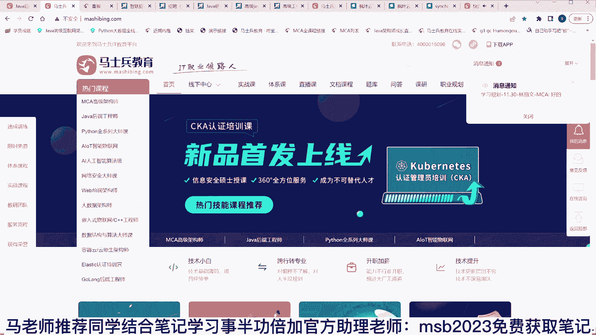

是我们自己做的一个笔记，自己做的一个笔记软件，待会儿呢也可以呃拿来使用，目前免费啊那个，大家呢需要这个这个笔记的，我今天讲的东西啊，我估计很多同学如果你没听过，你会觉得老师。

我觉得我以后写程序我都不敢写了是吧。

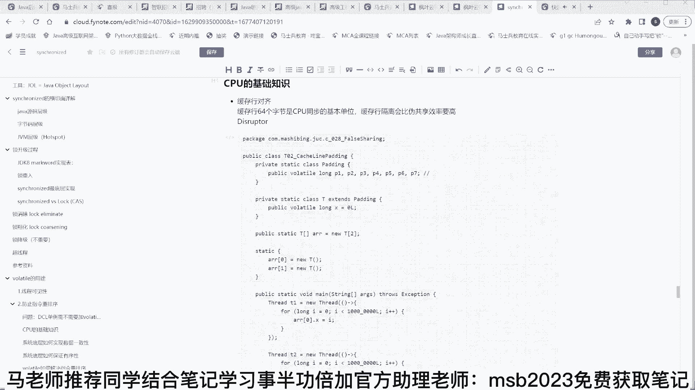

都不敢写了，没法写了啊，这两句话随便换顺序是吧，然后缓存行我们看不见的效率损失等等啊，以前有一只同学有这样的想法，这样的感想，但其实我要告诉你的是怎么说呢，就是一般来讲呢，就是你理解一件事情的时候。

当你理解不深的时候，你觉得我什么都懂嗯，我不跟你讲这些东西，你看这个代码看着都比较简单，我给你讲完了你会发现哦，代码原来背后有很多很多的故事，但是不要自欺欺人，你不要认为他真的很简单。

同时人家大厂也会问你它背后的故事，但当你理解了背后的故事，你突然间发现这代码真的不简单是吧，不过呢当你后，随着你后面理解越来越深的时候啊，你会发现山还是那座山，学知识大概就是这么一个过程。

最开始看山就是个破山，有什么可看的，后来发现山里面的故事很多，各种细节特别多啊，看山不是山，当你慢慢的掌握了之后，融会贯通之后，看山还是那座山，只不过更通透了，ok，这个内容呢是我讲的一门课。

就是并发这门课这门课里面的一小部分啊，呃整门课呢它的内容比较多，我们在我们做了一个完整的，关于掌心的整个的序列，这个呢是课程中的其中一部分，那么。

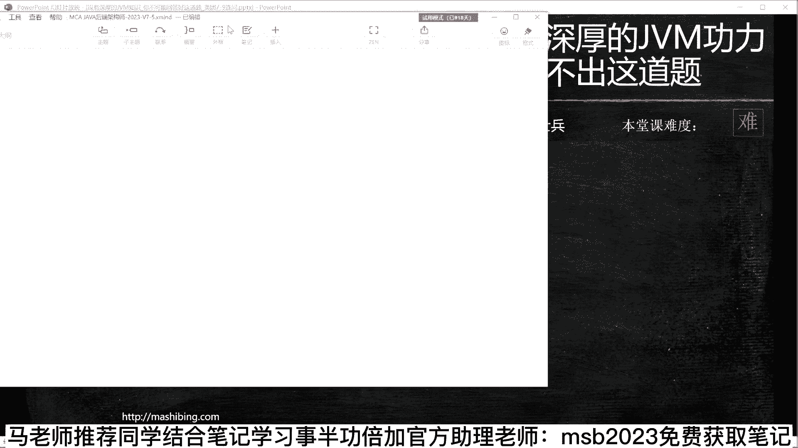

这个序列是一个很有用的序列，这个序列呢我会用最快速的方式，五分钟给大家快速介绍完，介绍完之后呢，我再给大家讲为什么加volatile之后，为什么加了volatile之后，它就能解决这一系列的问题。

听明白了吗，呃这一序列呢我用五分钟五分钟快速介绍完，大概我追求的是全而且深，是大概整个序列是我是，我是我设计课程的时候所追求的东西呃，全体现在什么地方呢，从零开始，从你刚入行开始，一直到你年薪过百万。

大概在我们整个的mca的2023版里头，就全包括了呃，整个的系列的深深体现在什么地方，就是面试所问到的一系列的底层原理，底层的源码都给大家讲到位，这是比较难的，不太容易，很多机构讲课的时候呢是挑容易的。

讲应用级别的啊，教你怎么搭配，怎么配置，配置完了之后怎么运行，怎么调bug，不难，找一份初级的，找一份薪水偏低的问题不大，呃马老师这里呢是追求一个全而且深，不仅全而且深，只有到了一定的深度。

你才能拿到更好的薪资，从咱们入学开始啊，入学的第一课教大家怎么去提问，因为一个优秀的提问可以得到一个快速的回答，到学前的面试指导，学习之前的面试，当我们的架构是开始启航，启航里面呢会讲了很多。

我们计算机系的一些课程，进大厂所必修的计算机课，编程的基础啊，这计算机课程里面呢主要是包括了操作系统，网络组成原理，io编译原理，数据结构和算法，如果你是计算机专业的，你看上去没什么新鲜。

但是非计算机专业的特别多，补补计算机一些专业的专业课，然后开始讲基础项目，web项目常用的工具和软件项目呃，系列的框架，java开发框架，一系列微服务的系列框架，微服务的项目，算法与数据结构的大常客。

工作的软实力好，这篇呢其实叫启航篇，可以认为是入行篇，就是如果是你是零基础，没有入行，靠这一篇入行问题不大，在入弯行之后是提升篇，提升篇呢我们讲java底层的深入知识性能的调优。

好今天我讲的这个呢是属于这部分的，叫java的并发编程，并发编程里面呢呃我们讲了三大特性，就是在这里挑了一些东西给大家讲出来，原子性，可见性，有序性呃，今天讲的有序性嗯，讲了可见性。

那个原子性呢咱们明天讲给大家听啊，拿出这样一小节来做公开课好吧，那么将框架的原理和源码读典型的就可以，我们的一个学生拿下阿里p7 ，就靠典型源码就拿下了中间件的综合运用，实战的项目开发。

然后大概呢有十个左右的项目，供大家写在简历上，那么架构设计的理论，这个到p7 的内容了啊，呃架构方案，架构案例，微服务的专题，架构设计的知道应该叫模式和心法服务保障，service mesh。

新一代的分布式微服务云原生软件测试啊，那么当你到这一步的时候呢，差不多是五六十万年薪，七八十万年薪左右啊，到这篇就完成了，再往后呢说明要掌握大数据云原生重中之重，这没什么可说的，就是云原生的落地状态啊。

这篇文档啊，我希望大家伙拿走拿走，好好读一下，听我说为什么建议大家好好读一下这篇，因为这一篇呢，差不多涵盖了你从零到年薪百万左右，所走过的一系列的路，就是说你到年薪百万应该掌握哪些知识。

都在这里面放着吧，找老师，以前有同学大概跟我们课跟了2年左右，才报了名，实际上你2年前要报的话，他就不至于有现在的这种困境了，他现在是遇到困难了，想起我们来了那个嗯，如果说愿意跟老师学，你就节省时间。

不走弯路，刘老师来帮助你，怎么样快速的找到一条通道，我们去掌心去入行，就算你不想跟老师学，非得要自学，从头到尾读完，你也知道先该学什么，后该学什么，学到什么程度，会拿什么样的薪水，作为架构师。

你可以再了解另外一种语言，go on，作为架构师去了解c k a c k s好，在这个基础之上，我们进入到技术管理的视野，大型团队的管理，产品的管理，生产事故的分享，技术的选型管理。

ok这个呢p7 到p8 之间，如果有人特别着急找工作，我已经被裁掉了，我想一个月之内，两星期之内搞定工作的就业突击，面试指导，服务陪跑，什么叫服务陪跑呀，解问答，应该的课程指导，应该的滚动直播。

我们每天都有，只要有新技术，我们就有直播，陪跑里面还有很重要的一项，就是在在他们就业突击的陪跑，你呢呃面试什么时候遇到问题了，你要说不知道该怎么答，录音录下来找老师，老师帮你解答。

老师对你进行一对一的学习模块的定制和规划，老师对你进行一对一的全程陪跑，会实现非常快速的就业，快速的涨薪啊，项目的系列升级，有的同学呢写项目，你简历上写的不多，没有怎么办，没有项目经验，没没事儿。

来这儿选选项目，写上去，好了这是我们整个的课程可能超了五分钟，我就介绍完了，别的不想多说课程取得的效果啊。

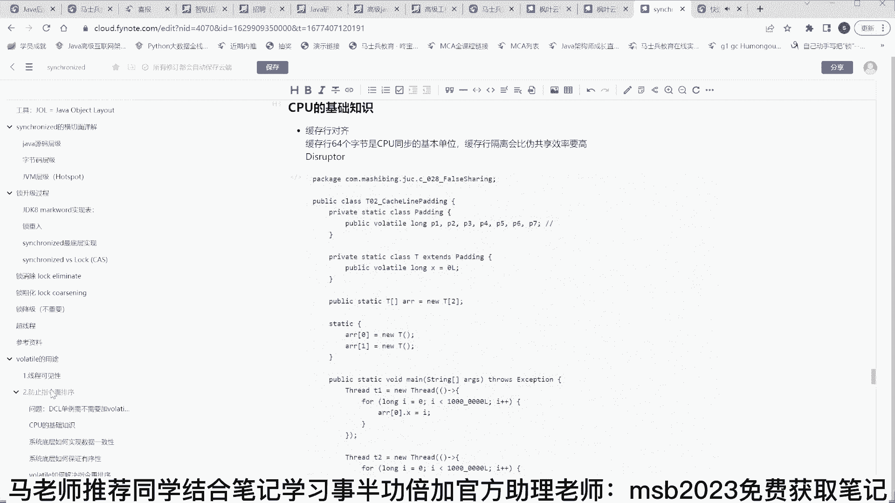

我们就拿突击举例子吧，就拿突击举例子啊。

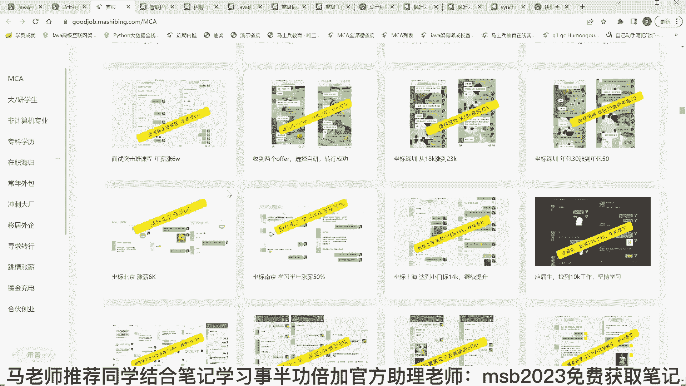

这是我们面试突击课，年薪涨6万，就是搞定了突击。

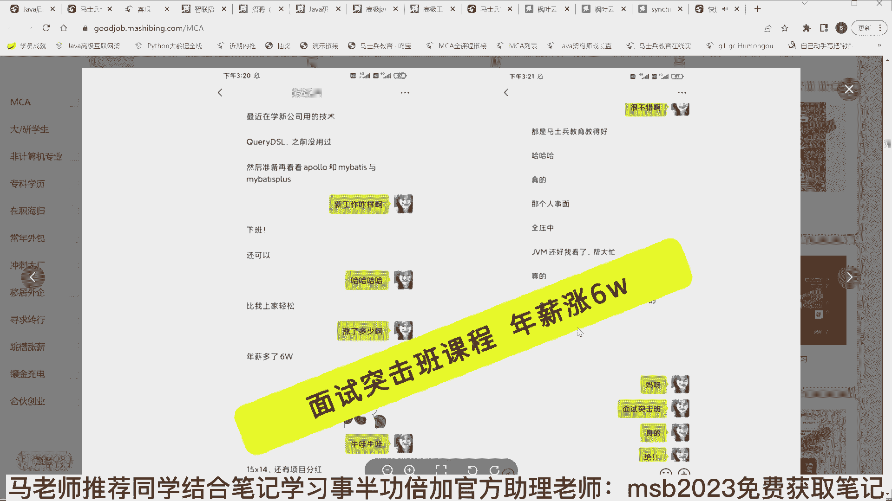

其他什么都没动，突击了一下，时间呢其实比较短啊。

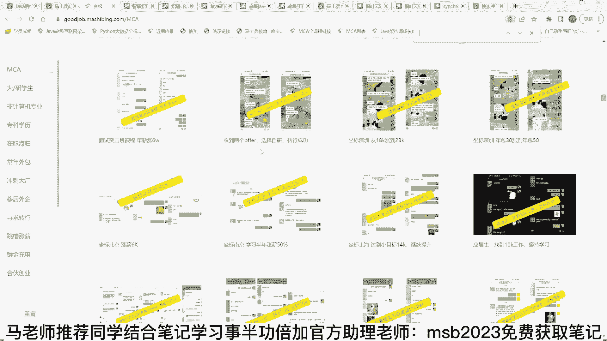

我们搞突击的时间一般都建议比较短，1年之中的金九银十啊，这是突击三个月，这个时间已经比较长了。

我们看这个比较短的案例就知道了，这是上海面试突击一个月，八个offer涨薪入职，刚刚的2023年的2月6号看到吧。

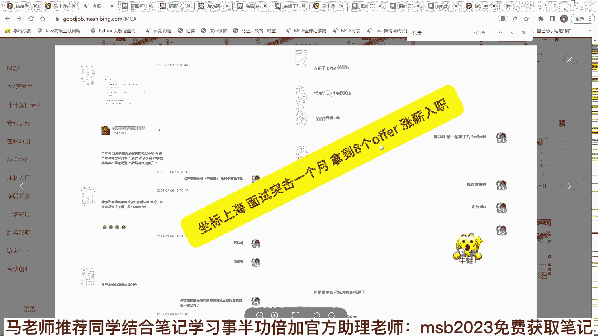

突击四个月，四个月就不能叫突击了，正常学习了，武汉突击半个月啊，十天突击搞定，突击半个月啊，这都是突击半个月的。

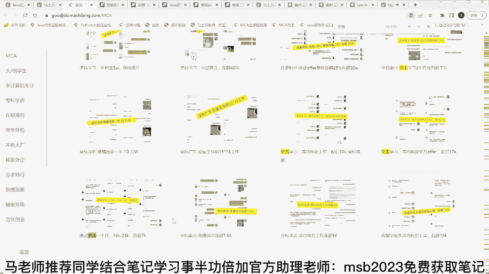

这个是突击了一个月，16000涨到23000还可以吧。

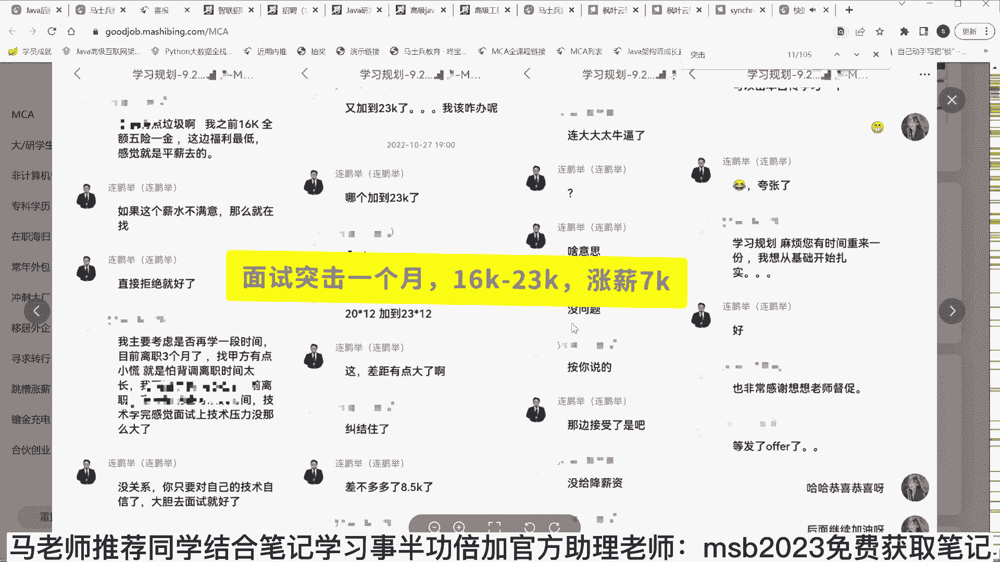

16000涨到23000，就意味着每年涨了8万多，ok这就是收益呃。

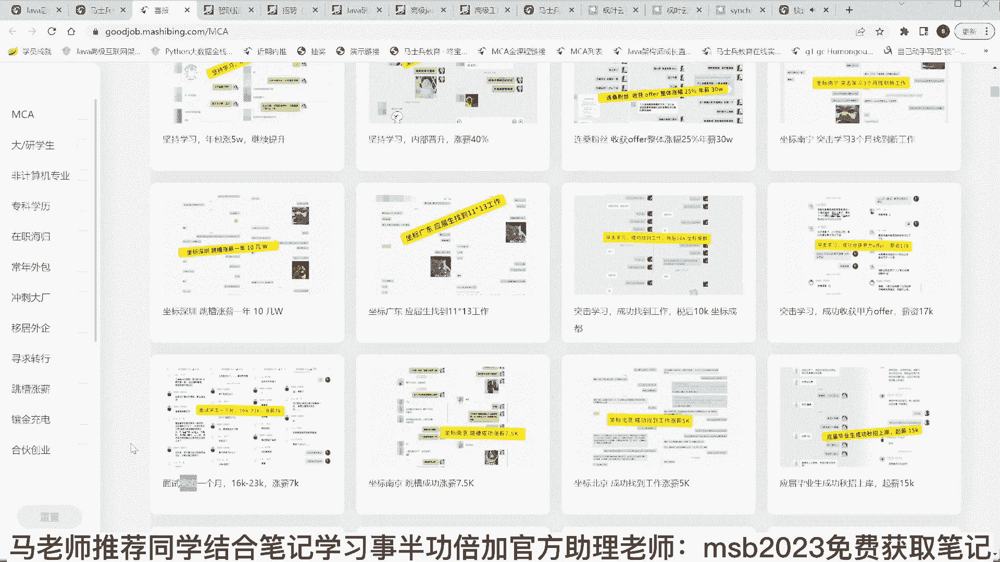

别的不吹牛逼，在马老师这里，你如果找到比我们更全的，找到比我们更深的马老师，这课我就送你了，你找不到啊。

