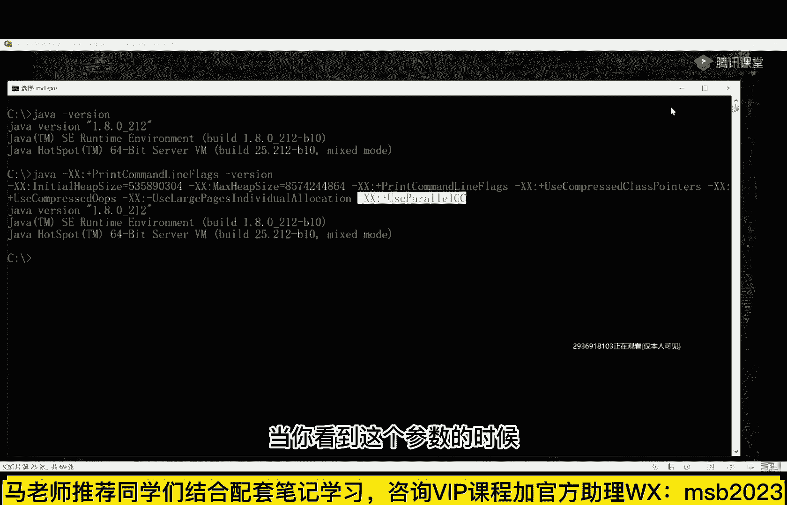
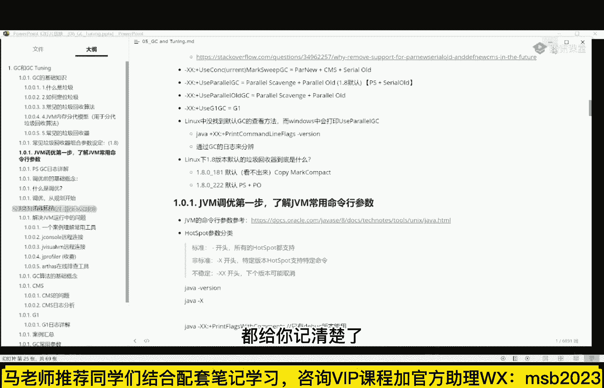

# 马士兵教育MCA架构师课程 - P2：10种垃圾回收器（一） - 马士兵学堂 - BV1RY4y1Q7DL

好了呃，当我们讲完这个之后呢，下面我们就来聊呢，就是在java horse one里面啊，注意啊，我现在跟大家聊的都是hot spot这个小小的概念，需要你理解一下，就是我们平时所说的jvm啊。

它是一个规范，我刚才说过了，规范是什么东西啊，又是个标准吗，真正的具体的实现是每个厂商自己去实现的，各种厂商都有自己的实现，最流传最广泛的实现当然就是oracle的实现，它叫做hotspot。

当然oracle还收购了ba va公司的，原来的实现叫做grocket火箭，这哥们儿这俩被合并了，合并到一起啊，目前的都叫做hosport呃，当然还有ibm的g9 啊，还有那个如果公司的zm啊。

这是号称世界上最快的gbm了，但是它是收费的啊，嗯还有那个那个你像淘宝淘宝的淘宝vm啊等等，这些个都叫做jvm，因为它是符合jvm规范的，今天我们要讲的内容，大多数我所说我一说这vm指的是谁呢。

特定的啊，指的就是hot smart，就是oracle自带的这个，那么在oracle自带里面呢，由于呢他要进行各种各样的垃圾回收，所以在oracle自带里面呢，我给大家总结了一些一些一些东西啊。

就是oracle呢到现在为止，从jdk一点零一直到现在的jdk 14，一共诞生了十种垃圾回收器，而这个图的话呢，我希望你背过，你跟面试官要聊的时候，需要侃侃而谈啊，需要了解这些内容。

有些东西呢你就算原理性的东西还不理解，但是你必须得知道他的名字，cdc谁能给我absolute，我们先说结论，目前在做大多数的啊，我不是特指某个人，而是指在座的诸位嗯，开个玩笑。

你们你们在你们在线上系统里头啊，都会有垃圾，你们线上系统多数用的都是哪个版本，你们自己了解吗，多数用的应该都是1。8啊，还有依然依然少数的是1。7，超级少数的是1。6，比这小的感觉就少了，1。8的居多。

所谓的垃圾回收，所谓的j v m调优，大家听我说，你如果在线上系统要进行调优的话，第一步你需要做的就是你，你要确定你们现在用的是哪个版本，你们现在用的是哪种垃圾回收器，这个影响是超级巨大的。

不同的垃圾回收器它对内存的管理是不一样的，jvm的内存管理是由垃圾回收器来决定的，到现在为止一共有十种垃圾回收器都可以用的，我们先简单过一下，前面六种叫做分带模型，就是内存里头能分成两代，叫分带模型。

用到的垃圾回收器，后面这三种g one呢叫逻辑分带，物理不分带z dc叫逻辑不分带，物理也不分担，shindo跟z dc是竞争关系，他们两个算法差不了太多，excell是jdk 11新出的这个东西。

测试用，以及在特殊情况下不需要垃圾回收的时候使用，你就只管分配，不管回收，他什么事都没干，这是非常特殊的一个啊，今天我跟大家聊的，其实我跟大家聊清楚前面六个就很不错，作为咱们来说呢。

你如果不理解前面六个的话，你后面这三个也很难也很难理解嗯，尤其是你不理解c m s，你根本就理解不了g one，所以我们看今天时间啊，而且尤其由于大多数同学啊，你们在真正的线上系统里头。

如果你没有没有做过任何的调优，没有做过任何的设置的话，默认的是这个组合叫po skyline以及pyo，有同学说老师我怎么知道我用的是哪种啊，一般情况下你有好多工具可以用来定位它。

教大家一个实战的小命令，比如我们要起个java虚拟机，不都这么起了，这么version，只要你敲一个java命令，直接一程序，它就启动了一个java虚拟机，嗯一般大家现在用的最多的就是1。8，那么1。

8它默认的垃圾回收器是什么呢，用这个命令可以把它给找出来，java杠嗯，嗯x x print cmon flags，jership呃，你会看到呢他有这么一个组合叫use parallegic。

这是它自带的默认启动了自带的参数，这个参数呢叫use paralyc，使用的是并行gc，当你看到这个参数的时候。

对应的就是parallel scavenge以及parallel old，那有同学说老师这我哪知道啊，我看到他的参数，我也不知道他是哪种组合呀，没关系，叶老师这么贴心的人，一定会告诉你会给你做总结。

所以呢大家不用担心呃，在这里呢我给大家做了总结啊，你找找常见的垃圾回收器组合参数的设定，1。8的，比如说你用了seridc指的是什么，用的是png c指的是什么。

用的是concurrent mark swift gc又指的是什么啊，g ug one g ci又指的是什么，k linux底下怎么查，windows底下怎么查，都给你记清楚了。

所以我的今天敲的命令，如果大家没有跟上，不用担心，明天听完课，这个文档就发大家了好吗，来可以继续的给老师扣一，文档呢我有时候会调一下啊，所以咱们听完课统一发，好要聊清楚这些垃圾回收器的话。

我们先聊清楚这个分带模型，分带模型，注意我再说一遍啊，你如果你没调过你的垃圾，回你的那个线上的系统的垃圾回收器啊，就是分带模型，所以你先理解分带模型，分带模型是什么意思，分带模型是说。

这个垃圾垃圾回收器在管理整个空间的时候，整个你们的内存空间啊，你家这块地归你妈妈管，说这块地专门扔白线团，这块地专门扔黑线团啊等等，这个是归他管的，那么呃作为流传最广的g d一点八。

默认的它的一种垃圾回收器的组合，叫p s加p o好，这种组合对于整个内存的管理是分带的，叫分带分带模型，分类模型是什么意思呢，就是他会把内存这么大块，那么大块内存分成两大部分。

一大部分呢就这部分叫做新生代，或者叫什么年轻代，第二部分叫什么叫老年代，那有的同学可能会说，这东西为什么叫新生，这东西为什么叫老年，很简单，当我们新诞生一个对象的时候。

尿出来一个刚刚的比较新的新对象的时候，扔到年轻的，每经过一次垃圾回收，它的年龄往上涨一岁啊，这里刚有一个新生代的，经过一次垃圾回收，这哥们儿加一经过一次垃圾回收，这哥们儿加二好到一定的年龄之后。

说这哥们儿太顽固了，经历过了好多次的垃圾回收都回收不掉，它进入老年代，老年代空间空间表达，什么时候老年代空间站满了，再也分配不下新的对象的时候，整体性的开始回收，o这是新生代和老年代的概念呃。

那么在这里呢新生代和老年代呢，由于它的这种特性不一样啊，然后呢他的采用的算法也不一样，呃这个算法是什么样的呢，听我给大家解释，作为新生代来说，根据大多数的程序的统计，这个新生代的对象啊。

在经过一次垃圾回收之后，当然这个垃圾回收叫做新生代垃圾回收，由于它叫y，所以一般呢我们读文章的时候，也会看到这个词的缩写叫什么呀，叫y g c叫年轻代gc，这叫做年轻代的垃圾回收，年轻的垃圾回收。

一般的情况下会回收掉大量的对象，也就是说一个对象啊经过年轻的对象，经过垃圾回收的时候，大概率的会被清掉，为什么呢，比方说我们经常你看啊，这种for循环里边产生的各种的，但是for完了之后。

new new完了之后大家知道吗，for循环结束之后，里边的里里里里里里边的对象都没用啊，对不对，只要没有引用指向它就没用了，像大量的这样的一些个对象，经过一次垃圾回收，它就会被清掉。

那这种呢叫yg c，由于大量的对象会被清掉，根据以前的多数的程序的一个统计结果啊，90%以上的新生代对象，在垃圾回收之后都会被清掉，那会剩多少了，10%，那如果是这样的话，我们采用什么样的算法合适呢。

我们采用mark sweep合适吗，采用mark compact合适吗，都不合适，因为mark wap和mac的，你都要从根上开始搜搜搜特特别特别多，你才能把这个对象的都给搜出来，但是存活对象都特别少。

非常少，我问我显然就没必要这么干，那么这时候他怎么办呢，他都要都要都要，这时候他怎么办呢，他是这么办的啊，既然啊他在呃就是年轻代里头呢，在进行了一系列的小分区，这个小分区是怎么分的呢。

大多数都存活的对象进入到叫一个伊甸园里头，叫伊甸区人类人类诞生的地方，刚才我们说过，我们说呃一个对象了，这十个对象一次回收很可能干掉其中的九个，就剩一个，那如果就剩这一个的话，你们你们好好考虑一下。

如果这时候用mark sweep或者mark compact都不合适，为什么你需要再标记出来，把这把这九个全标记出来，再清理一遍，太浪费了，太费太费时间了，效率不高，所以这时候怎么办呢。

它采用的是叫做拷贝算法，它采用的是第二种拷贝算了，在拷贝的时候就是把拷贝你们还记得吗，就是把那个活着的拷到另外一个地方，有没有印象，把这个活对象考到另一个地方，那活着对象考到哪去呢。

活着的对象直接拷到另外一个区，这个区呢叫silver silver区，我再说一遍，一个新的对象诞生，经过一次拦截回收之后啊，其余的哥们儿都被回收了，这哥们活着，这哥们儿活着呢。

会直接给拷贝到另外一个区域里头，这个区域叫survivor，拷过来，考回来之后，整个区域咔嚓就全部回收了，所以这个效率非常高，当然咔嚓回收了之后，下一次又有新的对象诞生了，这个对要有新的意思。

那就回收来了，这个呃对象呢又被回收一次，这时候它会又拷贝一次，拷贝到哪去呢，拷贝到survival 2，拷贝到这里，然后这个survivor唉整整体清理一遍，所以这东西呢它的效率就会非常高，为什么呢。

因为他只需要遍历到那些有用的就可以了，便利贴有用的就只占了10%嘛，把这11%拷贝，我就不需要去标记那些没有没有没有用的，那些没有用的又特别多，所以我的效率就会比较高，这是拷贝算法。

因此在年轻代里面使用的就是拷贝算吧，但老年代不一样，老年代是那些特别顽固的，老是回收不掉的啊，这种的特别顽固的，那这时候呢你采用的算法呢，就不能像年轻人一样，不能够拷贝来拷贝去，那怎么办呀。

采用的就是mark compact或者是mark sweep，就是从根上找，找出来之后，这个有用的，找着了没用的标记出来清掉，采用的是这样的算作，因为为什么不能用拷贝，你如果这里用拷贝的话。

你每次拷贝的东西太多了，他们都太顽固了，100个对象里头有90个需要拷贝，你的效率显然就变低了，所以我再回顾一下，我记得我刚刚讲的这段内容啊，这是最基本的jvm的理论呃，如果这个都不了解的话。

你跟面试官肯定是没得聊，所以你从这儿开始好不好，我再说一遍，内存呢一般嗯对内存分成两大部分，第一部分呢叫年轻代，第二部分叫老年代，也就是说比例是多少，默认一比二，你自己可以设。

那么年轻代里头呢又分三个小3333个分区，这三个分区呢分别叫依恋区，s区，s区，当然有人叫s0 s1 ，有人叫s1 s2 ，有人叫from to，无所谓，他叫啥都没关系，指的都是一回事儿，好了。

让大家更理解这个算法，我用一个动画让大家更理解这个算法，一个对象产生了之后，它会进入到stack，当然stack比较超级，有点细节了，我们先把它略过好吧，我们不去管它，总而言之，一个对象产生之后呢。

它会进入到一店区，如果这个对象被回收一次，会进入到s1 ，好如果这个对象再被回收一次，会进入s2 ，如果这对象再未回收一次，又进入s1 ，如果这对象再回收呢，又进入s2 ，什么时候它会进入到old区呢。

年龄够了，这个年龄是跟特定的垃圾回收器有关系的，年龄多大才能进呢，可以通过参数进行设置，max tenure and resu，ok一般的普通的垃圾回收器的组合，他的年龄默认值15c m s的默认值六。

啊都给我讲，到现在为止，不知道大家是不是，能理解这种基础的分类模型了，来能够get到来老师扣个一好不好，但是里面还有好多好多好多好多小小的细节啊，我还是那句话，但学东西呢暂时要忽略细节。

然后回过头来再去找细节，先学梗概，先学脉络。

