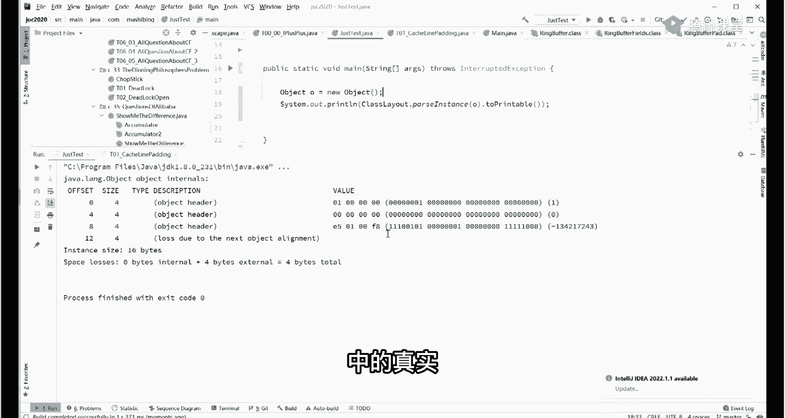
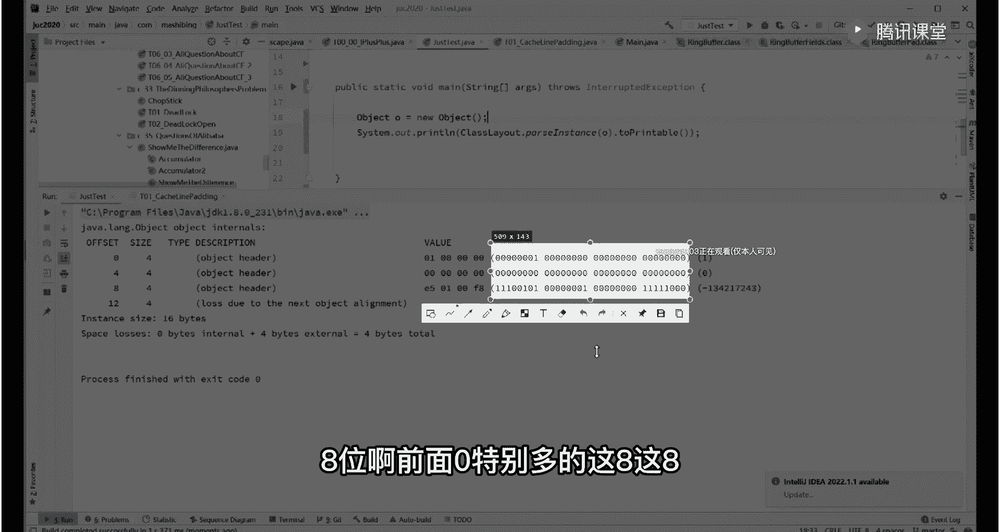
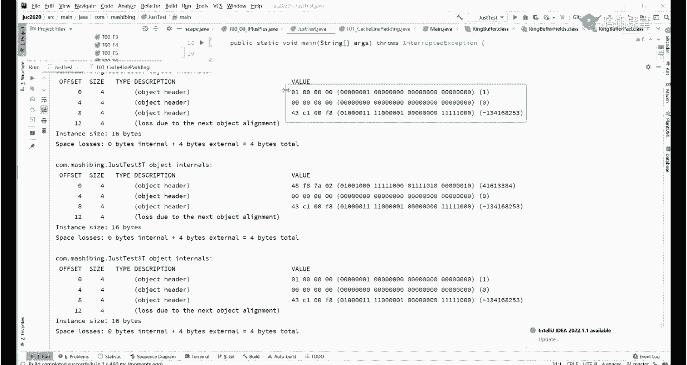
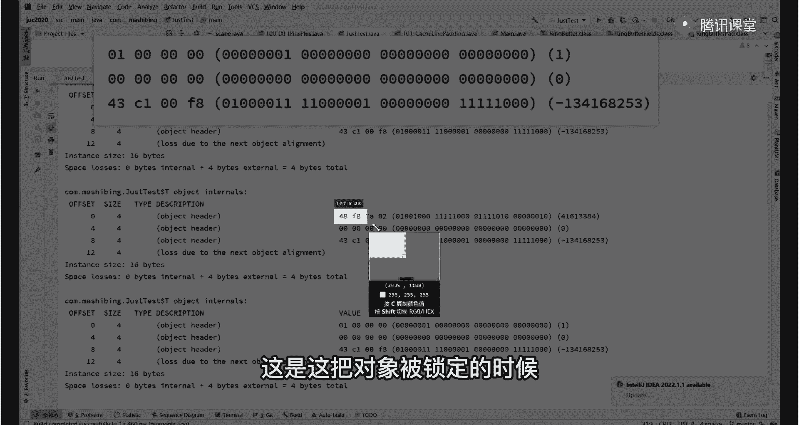
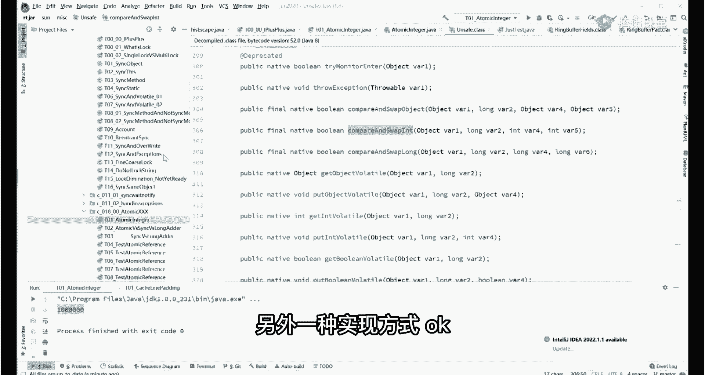

# 系列 6：P31：Java中的锁是如何实现的？ - 马士兵学堂 - BV1RY4y1Q7DL

呃今天呢主要来跟大家讲这个锁的东西，关于所这件事呢，通过一个小的实例来讲，我们就不讲那些个乱七八糟的理论性的东西了，一个小小的案例，这小案例呢喜闻乐见啊，大家肯定是学过或者至少自己敲过。

或者至少了解过叫什么呢，假如我们有一个值n，它最开始的初始值是零，然后呢我们启动了100个线程，这里有100个线程，每一个线程里面呢把这个值给它加1万次o，每次每一个加1万次啊。

那么最终的结果100个线程跑起来，理想的情况下它是100万，但实际当中呢往往不是跑一下看，3万多是吧，嗯再跑一下，ok 30000多，当然如果我们给它上锁。

就是平时我们使用的关键词叫synchronized是吧，ok上厕所跑一下，100万这就没问题，这个原因是什么呀，呃给那些个小白们，基础不是很好的同学解释一下原因，看这里最开始这个值啊是零。

然后每一次对这个值的每一次的递增过程啊，由于呢有现成本地内存，它得把这个内存昨天我也讲过啊，把这内存的一步一步拿到自己的这个呃，cp cccp和cpu核的内部做完了之后再写回来。

所以它中间是这么一个过程啊，一个线程把这个值拿过来，拿到cpu内部零，然后给它加加变成一一呢，再给他写回去是吧，这是这个加加的过程，那这个过程的话呢，为什么我们没有上锁的时候。

为什么我们没有上锁的时候好，他就会造成远远小于100万这个现象，原因是什么呀，原因是如果有一个线程从零这里读过来，变成一好一还没有来得及写，回去的时候还没有来得及啊，然后另外一个线程把这个零六读走了。

他也把这个零变成了一做加加操作吧，然后他也往回写，还没写的时候呢，又有另外一个线程把这个零读走了，所以你看啊加了三次，最终的结果呢全是一是吧，加了三次，最终结果得到了一ok这就是不上所说的情况。

这东西的本质呢，实际上是并发执行所引起的数据不一致，说点专业名词啊，就是并发执行所引起的数据不一致，那什么叫并发执行啊，就是加加这个操作实际上有好几部构成，第一个线程执行加加的时候。

另外一个线程还没等第一个线程执行完，他就进来开始运行了，这两个是并发执行，这两个线程还没有完，第三个线程又来了是吧，三个线程并发最后的结果只得到了一个一，处理这件事情。

想要得到我们期望期望的这个结果该怎么办呀，最简单的办法是把这个加加操作呀，给它变成序列化的，就是我中间不让它并发，什么意思啊，听我说，就说我这个加加操作必须是这个线程执行完了，我加完了写回去。

写完了写成一了，来，你下个线程再继续，你读的时候一定是从一读回来改成二，然后你下个线程再继续二，二回来改成三，也就意味着啊从这个加加操作呢，从原来的这种并发性的，好多人同时在执行这段代码。

变成同一个时刻，只有一个线程执行，执行完了之后，另外一个线程才能执行好，这里面也上一个概念呢，叫做原子形，昨天我给大家讲了可见性，给大家讲的有序性，今天的重点就是原子性，什么叫原子性啊。

其实就是说这个操作，我把它视为一个不可分的原子，当然你还可以写第二句话啊，只要写在这个sychronized内部的，都可以视为一个原子，这个原子的意思就是说只有一个线程执行，执行完了。

另外一个线程才能执行，所以呢这线程的执行会变成序列化的方式，它会变成这样的方式啊，有呢这是第五个，然后才是第四个啊等等，但是从时间角度的话呢，一定是第一个完事了，第二个，第二个完事儿，第三个。

第三个完事儿，第第五个，第五个完事儿，第四个，所以从时间角度它是序列化执行的，这就意味着呢我的中间的这个任何的操作，它是具备原子性，就是不被其他任何线程所打断，不被打断的意思就是说我在执行的过程之中。

另外的线程不能执行好这个概念，大家听懂了吗，能听明白，老师扣个一来嗯，没问题吧，嗯ok ok好，比较简单啊，比较简单呃，这入门入门级别的小程序啊，你们学java的一定是学过学别的语言的，也一定学过好。

下面我们来解析这个synchronized，它的本质是什么，有没有其他的方式，我们能完成原子性操作，保证整个数据的一致性，我可以不保证原子性，但是我要保证数据的一致性，可不可以，完全也可以啊。

好多种方式，我们首先来解析什么呢，一个非常基础的概念啊，就是说这个synchronize，这东西到底是个什么样的东西，大家都知道这个synchronnet写法往往是这么写的，我们在这写啊，随便给一个吧。

o object o等于new object，我们这样写synchronize o是吧，然后呢诶下面一大堆操作，这样的话呢，我们下面这些操作呢就是原原子性的操作好，这个o会帮会被我们当成一把锁来使用啊。

这就是锁的最基本的概念，什么是锁呢，这玩意儿呢就是我们经常用的一种锁啊，这个o就是那个那个锁啊，在java里面任何对象任何对象我再说一遍，任何对象，都可以被当作锁来使用，你随便哪个对象好吧。

都可以被当做锁锁的概念呢，我们日常很容易理解啊，比如说某个人想进厕所干点事儿是吧，然后那个一定是进去之后呢，这就是我们那把锁，本质上来讲，就是这把锁保护着他整个干这个事的过程，如果没有这把锁的话。

他干到一半的时候，没准其他人进来，两个屁股怼在一起也是有可能的，听懂了吧，所以说这把锁保障了我们他干这件事的原则性，只有等他干完别人才能干，你不能说这边正干的时候，中间就进来了啊，这不行。

所以日常生活中这把锁我们很容易理解，但是java java语言里面这把锁呢，大家理解起来可能稍微困难点，就是任何一个对象都可以当成一把锁，在这把锁上执行的任何的方法，同时只能有一个线程，啥意思呢。

比方说我在这里写了一个scho，我在另外一个方法里，另外一个地方，假设别的方法里啊，static的方法，我们呢，锁的只要是同一把锁，也就是同一个对象，看这里，我简单写啊。

比方说在这里他写的又是synchronized o，然后又写了一段其他代码，那么这两段代码能不能够同时执行啊，当然是不可以好吧，等在同一把锁上的这样的代码，同一个时间点只能有一个执行，一个执行完。

其他一个才能执行，这点大家能理解吧，好那这边锁的本质是什么东西呢，它是怎么实现的呢，今天给大家做一点简单的小实验啊，让大家认识一下，就是说java里面是怎么运用这把锁的，好吧嗯好。

刚才讲这里这这这一小段大家能跟上吗，能跟上给老师扣一栏，没问题啊，这样啊我我我带大家做一个小小的认知，这个我不知道大家了不了解啊，就是一个对象在内存中的存储布局，到底长什么样，这什么意思。

就是说当我们new出一个普通对象的时候，这个呢大家应该知道啊，就是当我们new出一个呃普通对象来的时候呢，这个对象它在内存里面分配一个空间，这空间呢到底有多大，结构是什么样子的，他问的是这个问题。

也是美团的祁连问之一，一个对象在内存中的存储布局呢，在hot sport的它的实现里面是这是长这这样啊，它一共有四部分构成，这四部分呢是面试的重灾区，尤其是大厂面试的重灾区，往这看，首先呢这是第一部分。

第一部分呢它的名字叫mark word，中文翻译过来叫标记字，但是我觉得你们就别记这个中文名字了，就叫mark word，记住就行，它的大小是八字点八个bytes，记住啊，大小是八个字节。

第二个呢叫做类型指针，就class pointer，class pointer的意思是说我new的哪个对象，它指向这个对象所在那个类，比如说啊我们new的是一个object。

那这个class pointer是个指针，它指向谁呢，指向object。class啊那个类型o，然后使它的实例数据就是它成员变量，最后一个叫对齐，关于对齐的概念呢，很多人老是尤其是没有计算机基础的啊。

老理解的特别费劲，简单说呢就是对得整整齐齐的，由于前面的各种数据对起来呃，有有可能呢比较乱是吧，最后要求就是整个对象的大小能被八字节整除，能被八字节整除，听懂了吧，我简单说。

就是前面你比方说前面这三部分加起来，如果只有12个字节，它不能被八整除怎么办，后面放上四个，这几个概念大家能能能能跟上吗，再重复一遍啊，第一个mc word macworld，我一会给大家讲。

这是面试重灾区，重中之重，第二个呢是class pointer，指向这个对象所在那个类啊，第三个呢是它的成员变量，第四个是对齐，所以整个长度要被八字节整出嗯，加四倍八整除。

废话我说的是12 12+4不被八整除吗，呃那个美团里面有一个小问题啊，就是美团的美团的那个七连问啊，曾经有一个小问题，大家来读一下，看一眼，可能新单位的第一个小问题啊。

就是说看这个啊叫object o等于new object，在内存中占用多少字节，哈哈这是他的一个小问题，好我们通用小工具呢来认知一下，看这里啊，我在这里呢new了一个object，我教大家使用一个工具。

这个工具的名字叫j o l，这是它的全称，全称叫java object layout是open jdk提供的，随便百度1下就能知道它的用法，在maven里面引入进来，就能用这东西用来干什么的。

用来查一个对象在内存中长什么样，看这里plus layout pass，instance，pass是解析，instance是对象，解析某个对象解析哪个对象，解析o这个对象，two principle。

把它转成可以打印出来的格式，再把它打印出来，来认知一下一个简单的小对象到底长什么样，好同学们讲到这儿还能跟上吗，能跟上给老师扣一来，搞点反馈啊，咱们小直播间的没人跟得上吗，只有麦田一个人吗，跑一下。

假如有人跟着费劲呢啊那个反馈出来，这个工具会让我们看到一个对象，在内存中的真实真实的布局。

这你能看到它的零和一的布局，看到了吗，这就是你的内存之中把一个对象new出来之后，它就长这模样，一个object对象长这模样，八位八位八位八位八位啊，前面零特别多的这八，这八这八个八位就是八个字节。

就是我们的什么呀，就是我们的mark word标记字，这八个，这四个这四个啊，这四个这四个这个加起来就是我们的mark word，那么后面这部分是什么东西啊，后面这部分是class pointer。

还记得吧，那么它指向谁，是一个指针，指向谁啊，指向谁，指向object。class，呵呵对没错，然后最后这四个呢，前面一共是12个字节了是吧，记住啊，类型指针四个字节，mark word是八个字节。

加起来是12个，我们讲不能被八整除怎么办，后面补四个，这里后面是补的四个啊，嗯比较简单啊，不太难，这样我给大家做一点小练习吧，看看能不能够理解的了，我们随便定一个class t。

我在这里写t小t等于6t，我们把这个t进行分析来，谁能告诉我这个t占多少个字节，告诉我一下，思考一下这多少个字节啊，16个对没错啊，说的很对，往下看，还是那句话啊，就是我们看啊。

就是它前面那八个字节永远是mark word，后面这四个字节呢永远都是class pointer，12个不能被八整除，它也没有成员变量是吧，它内部没有成员变量，所以呢再给它补上四个，让他被八整除就行了。

o，来看这里，ini来同学们告诉我，如果我这个时候把这个题弄出来，它占多少个字典，为啥要把被被八整除，对齐之后，管理对象比较好好好管理，如果你实在理解不了，你就想往一艘船上使劲的装袜子。

大米各种的东西这么散着装好，还是把它装到集装箱里，比较整齐地堆放好，好，好啦，这里是多少多少，8+4+4，怎么还有20的呀，咱们说一个对象的大小，它至少应该被八整除，你你给我写20是几个意思。

还有写32的是几个意思，一个int类型是多少，int类型是四个字节对吧，认识一下啊，它前面八个字节永远是我们的mark word，中间这四个字节永远是class pointer，一共是12个嘛。

12个呢，这12个一般被我们称之为叫对象的头部，叫object header啊，然后int类型多多少四个字节，对不对，所以一加正好16个默认值，看到了吗，零所以，16个字节比较简单啊。

好我们再来做个小练习啊，lol来告诉我一下这个对象new出来多少个字节，首先你想想看一个long类型占多少个字节啊，露脸雄这八个字节对不对，原来16个再加八个，24个嘛。

你这个为啥又被八帮助我解释过一遍了啊，你不认真听，你老老让我重复说，这顶得住吗，嗯漏了就是八个字节啊，看这里啊，我们再来一个啊，来一个稍微难一点的，来哪位同学知道我这个对象应该占多少个字节。

有人说是32，我们看这个小直播间，有人说吗，32，24加八三十二，跑下看看是不是32，好看这里啊，呃前面那四个加四个，再加四个什么对象头是吧，这个不说了啊，不重复了。

四个字节的i8 个字节的l一个字节的布尔，也就是说在java面呢，布尔类型实际上占一个完整的字节，那加起来是24，加一是25，不能被八整除怎么办，后面补七个，补到32，看懂了吧，比较简单。

来再来一个终极难度，这个对象占多少个字节，嗯32 40数吧，数什么数，这个字符串长度吗，这是jdk几有关系吗，只有指针嗯，32啊，大多数同学还是比较明白的，我们跑一下看看这里啊，string有三个常量。

吃三个字节，我也是醉了，看这里啊，首先12个字节的头八个字节，mark word，四个字节class pointer，这不说了，接下来呢四个字节的int，八个字节的long，一个字节的布尔。

三个字节的对齐，注意我们这个s占多少，string类型的，这是一个引用类型，是个指针，这是一个指针，后面的这个字符串，并不真实存在于我们这个t对象内部，也就是说我们new出这个t来的时候。

在这个t内部只有谁呢，只有i有l有b有一个小s，这个小s指向常量池里面的字符串，http哈马上变点com指向这个串，这个串并不真实存在于我们这个对象内部，也就是说，你只要知道这个指针的长度是多少就行了。

这个指针长度是多少呢，指针长度是四个字节，在默认的64位虚拟机开启压缩的情况下，它的长度是四个字节，所以看懂这布局了吧，这样的话呢美团的这个关于布局的问题，你就应该能理解了啊，好讲到这里。

这块没有问题的啊，给老师扣一，我们继续好吧，我们主要是讲锁的，我不是跟大家讲这个布局，就顺带着给大家补一补一补啊，下面我们把这把这些复杂的东西全去掉，我们把这个最简单的东西当成一把锁来使用。

当成一把锁来使用，本质上是个什么东西呢，我们做一个小小的对比实验就可以了，往这儿看，t小t等net，这是他刚刚new出来的时候，内存的布局情况，接下来我们给他上把锁，就是把它当成一把锁来使用。

而且锁定它，然后我再把它的布局再打印出来，看锁解开之后再把它的布局打印出来，看跑下看，我们跑跑看做个小小的对比，对比一下这三种情况，看看有什么区别，来各位同学自己自己仔细做对比，这是最开始的时候。

对象刚刚new出来。

这是这把对象被锁定的时候。

被当成一把锁来使用，并且我们锁定它，看出区别来了吗，兄弟们，这是这把锁被释放了的情况，这三种情况你自己做对比，能不能看出区别来，头部一样断着，所以在java里面呢怎么实现一把锁呢。

这把锁的信息记录在什么地方呢，我相信你就应该有答案了，mark word的作用非常重，要，就是在我们整个对象的脑袋上呢，这部分内容，对象脑袋的这部分内容啊，这部分内容就是mark word这部分。

这部分的作用特别重要，我们平时讲说呃，我们把一个对象当成一把锁来使用，我们讲的很简单，那这把锁怎么来使用它啊，实际上在这把锁的内部呀，记录着是谁，你说哪个县城，哪个县城的id，他锁定了我持有我这把锁。

比方说你进厕所之后啊，脑门上写了名字叫小壮，这个小壮啊，就把这个信息记录在这把锁的脑袋上，记录在mark word里面，听懂了吗，然后呢，当别人去申请这把锁的时候，发现这把锁已经被小壮持有了。

他怎么办呀，等待等着扎扎实实在旁边好好等待，所以呢在java之中啊，关于锁的信息，它是记录在对象的头部，头部什么地方呢，mac word里面，这小这个小知识大家听明白了吧，只用四个字节。

对目前他只用了四个字节就够了啊，呃mc word比较复杂啊，它里面呢有三大类信息，一类是关于锁的，一类是关于垃圾回收器的，这个就更复杂了，我就在这就先不展开了。

那个这个主要跟那个呃坑这个这个这个cm s，那个垃圾回收器有关系啊，呃然后那么第三个呢是关于他的hash code啊，这点可以给大家做个小实验啊，就比较好玩，你这个你自己看看就就就就就可以了。

大家看这里啊，呃同样的我们打印这个小t的信息，最开始的时候呢是这样子是吧，我们只要调用一次它的t的hash code，只要只要调用它一下啊，然后呢再打印一遍，好接着看，诶你对比一下结果你自己做对比。

这两个你会发现呢，我没我虽然没上锁，但是我掉了还是扣的，诶，它内部也发生了变化，说明什么呢，说明他的hash code也是记录在我们的mark word里面，因此这mc word有三个作用。

第一个呢是记录垃圾回收器的信息，第二个记录锁信息，第三个呢记录hash code的信息啊，ok嗯关于microworld的简单认知，我们就认知到这，今天我们主要讲，所所以呢呃我们当我们讲到这里的时候呢。

关于synchronize这把锁的一个基本的构图啊，基本的影像我们就给它勾勒出来了，相当于什么呢，相当于这里确实有个有个对象扔在这儿，然后呢我把这个对象当成一把锁。

我sychronized锁定它当成一把锁的时候，比如说我上来之后呢，夏鹏飞啊这个线程，然后呢持有了这把锁，他会把自己的信息啊记录在mark word里面，把这里改一改，说这这把锁归我了，各位兄弟们。

然后夏鹏飞呢就开始去里面干事去了，大便小便是吧啊啊这个吃饭外卖啊等等，在里边呢干一大堆的事儿，那么在他里边干这些事的时候呢，这把锁由于一直被他持有，其他的人来了之后呢，是不能够进去干这些事的。

是不能够去执行这段代码的，那么其他人得等什么时候啊，得等夏鹏飞把这把锁给释放了，后来人一看哦，ok这把锁发现没有人占用了啊，那下一个人继续来，这会儿能听懂吗，嗯这会能听明白，给老师扣个一来比较简单啊。

这是java里面经常使用的一把古老的锁，的内部的执行执行执行方案，但是这个听我说，这里面呢其实还有更复杂的过程，我再讲下一个比较复杂的过程，之前给大家讲了另外一种，保障数据一致性的解决方案。

大家看这里啊，就是说我们还拿这个小程序来举例子，这小程序呢，每一个线程给它加好多好多次，然后呢还要保证它最后的结果呢是没有问题的，是吧，呃除了除了我们使用我们传统的synchronized。

上锁的这种方案之外，其实还有另外的解决方案，下面我我我教大家呢另外的解决方案，这另外的解决方案是什么呢，就是这玩意儿啊，这我不知道有多少同学用过，就是atomic类，有原子类。

这些原子类呢是来源于j u c这个包啊，j u c这个包java有体力，有tility的concurrent，这个包简称g o c，atomic atomic energy。

比如说如果我们有一个数值int类型，最开始的初始值是零，我们就直接new一个原子类型的int类型，原子类型int类型一，正常的情况下呢，我们对这个数值呢进行多线程的加加操作，比如说我每一个线程。

100个线程，每个线程呢都去执行这个m方法，这个m方法呢对我们这个值加了1万次，这家的操作叫count。increment get，这是它内部的方法啊，本质上也是一个加加操作，但是在这里头呢。

我们会发现这种写法完全可以保障数据一致，因为它本身就是原子性的支持原子性，它的所有的方法支持原子性，它的中间呢诶被别人打断了，也能得到正确的结果，它本身是支持原子性。

所以最后我们一定能得到100万这个结果，但是我们就想了说，你既然能得到100万这个结果，你内部是不是使用了一些这上锁的操作呀，是不是使用了那个sychronized，是这样的吗，来我们点进去看看好不好。

count their increment get，ok，我们点进去看一眼，看看里面有没有啊，哎走你好，这里它调用了on safe这个类，get and add int，我们再点进去跟着走啊。

跟着我跟着我思路走走，你哎你会发现它调用了unsafe这个类的，什么呀，compare and swap int掉了这个类，哎，到这里的时候已经是native了，已经是c和c加代码了，哎你跟到最后。

你其实没有并没有发现那个synchronized是吧，你最起码没有发现java里面的synchronized，没有发现，所以这玩意儿他没上锁，你发现没有没上锁，它居然最后也能保证原子性，诶。

这是怎么实现的呢，这是另外一种实现方式，另外一种实现方式，ok好讲到这还能跟上吗。

