# 马士兵教育MCA架构师课程 - P32：CAS - 马士兵学堂 - BV1RY4y1Q7DL

再回顾一下，由于有些人对这类可能不太熟啊，这个类呢就是一个原子类型的类，他的加加操作呀，本身就支持原子性，它是怎么支持的呢，我们去探究一下啊，我们探究了半天，我们发现它本身没有上锁。

没有上锁是怎么完成的呢，面试中另外一个重灾区，本质上可以认为是特殊的，所叫乐观锁啊，叫c a s compare and swap，int c a s，讲一下c c a s的本质，这是另外一种锁。

也可以认为是无锁啊，好多人认为是无所，知道了。

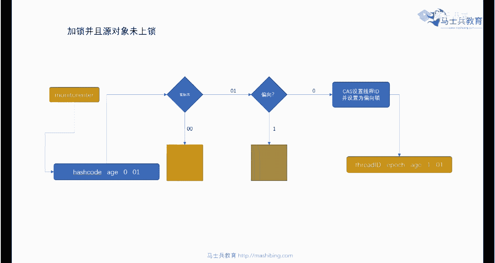

我的图图去哪里了，看这张图吧，呃我下面我们来聊一下这个cs的本质，就是它是怎么完成，怎么操作的，听我说啊，关于cs这件事呢，面试里头问的也是贼多贼多的，我希望你能掌握呃。

cs呢它的全称呢叫compare swi，或者叫compare and set，比较并设置比较便交换或者叫什么呀，或者叫compare and exchange，比较并交换都是指的一个意思。

它的执行的原理是这样子的，长这样，认真听认真听，这是我们最开始那个数值是零，然后呢我们有一个线程的拿过来在这里改成一，然后再写回去，另外一个线程，我们说保障数据一致性的话呢，等我写回去之后。

另外一个线程再继续就能保障，但是c s操作并不保证说，我中间不被其他线程所打断，那么这个时候完全有另外一种可能性，在我写回去的过程之中，它已经变成八了，它是怎么保障我的数据一致性的呢，它是这么来保障的。

好好听他做了一个操作，做了一个比较并交换的操作，这个比较并交换的操作呢是这么做的，这是原来那个零，我这线程把它读过来之后，改成一，我一往回写的过程之中做个操作，看看你是不是依然为零，依然为零。

那如果你依然为零，说明你没有其他的线程把这个数值改变过，那我就直接把你改成一就可以了，所以就是可以这么可以理解为，当我们往回写的过程之中呢，我们做了一个判断，说if你这个值啊是不是依然为零啊。

如果你依然为零啊，那就把你改成一，这就是比较一下，并且再重新设置，是这个意思，那个同学可能会说了，那老师他他已经被别人改过了，怎么办呀，他已经改成八了，改成八个没有关系，就说明我们这次递增的操作失败了。

我就把这个八读过来，读过来，改成九，往回写的过程中判断，哥们儿，你是不是依然为八，如果你是依然为八，我就把你改成九，那有同学又改成100万，别人改了，我把这100改过来，改成101。

往回写的过程中判断你是不是依然是那个100，如果是那100改成101，如果不是一直操作到有一次成功为止，一个死循环，一个while循环啊，跟着你不停的循环，哎哥们儿，你是不是原来那个数，如果是改回去。

如果不是，来再来一遍，听明白了吗，来这块能听懂的，给老师扣个一，就是乐高所的本质对，是的，比较并交换对，这就是他的，这是怎么保障那个数据数据一致性的，就是这么来保障的啊，当然关于cs呢面试的重灾区嘛。

他一定问的问题不会这么简单，当你理解了原始的问题之后啊，他首先会问你第一个问题，就是cs里面著名的a b a问题啊，什么叫a b a问题呢，就是说你看啊有一个零，然后被一个线程拿走了。

改成一一往回写的过程之中，他看到的依然还是一个数值为零，但是这个零有可能是什么呀，有可能在他拿走改的过程之中，这个零被另外一个线程改成了八，又被其他线程改回成了零，所以这个零确实是那个零。

但是中间经历了一个过程，就是从0~8又回到零的过程，这是有可能的，这是a b又回到a的问题，叫aba问题，这块能听懂吗，比如说这是如果这是这是一个简单数值，所以呢只要它是那个零的值就无所谓。

那如果是一个引用类型呢，原来只像一只猫，一只黑猫，然后中间它指向了其实指向了一只狗，做了很多操作，回回来又指挥成了一只猫，这个时候就有可能引发你程序的不一致性了，所以a b a这个问题。

你是需要想办法去解决它的，你可以解决它，也可以不解决它，取决于你实际当中的运行情况，呃，那么如果你想解决它，前两天才问是吧，看292945说对，如果你想解决它，怎么解决它呢，解决它办法呢非常的简单。

就是给它加一个版本号啊，再加一个version version，理解这件事情很简单啊，这是你的男朋友boyfriend啊，你要出差了，你担心他出点什么事，你在他脑门上给他写一个一点，然后主持人走了。

回来了之后呢，你看一下是不是你依然还是那个男朋友，如果你发现他脑门上一点没问题，就是如果你发现他脑门上已经写上了，99点，那么说明在你离开期间，一定他经历了某些事情能听懂吗，就是给他加个版本号就可以了。

ok嗯懂了是吧，对这个版本号这个版本号啊有两种方式啊，就是第一种是使用数值，比方说一经历过一次就是二，再经历一次就是三，就是你不钻递增，这是一种，第二种呢就是你你你你可以用布尔类型啊，你在他脑门上写。

当你离开的时候，你写true啊，它是true，然后当你回来的时候，如果它变成了false，至于中间多少次，那就不管了，这是另外一种java本身提供，嗯这比较简单很容易理解啊。

java本身它是提供现成的类的。

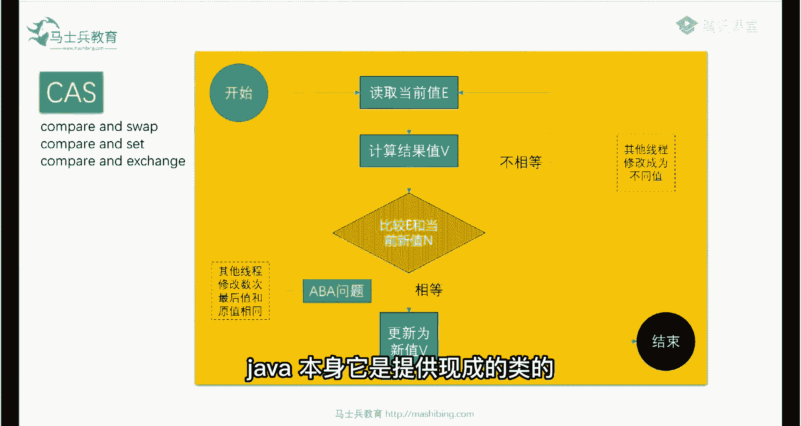

比如说我们看这个叫atomic stampreference，这个stamped所代表的就是版本号的意思，好吧，atomic stamp reference k使用布尔类型，中间两个线程改了怎么办。

那我说了，你使用布尔类型代表你自己不在乎多少次，只要有人改过就变就变成false了啊，变成非处了，这种呢是是是是带版本号的，那么另外一种呢atomic markable reference。

那么这种呢是布尔类型的好吧，布尔类型啊，initial mark可以是true，可以是false，所以你来这块大家听明白了吗。

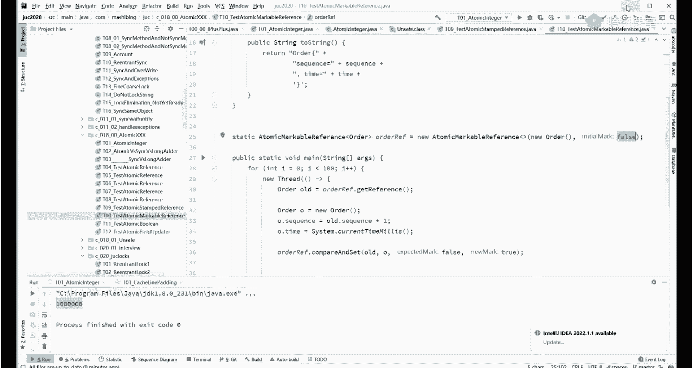

怎么怎么解决这个aba问题，这是第一个问题啊，就是aba的问题，就是加版本号就可以了，就这个代码是我们的vip的代码，这个代码是不给的好听，我说第二个问题会非常容易被问到的，第二个问题关于cs的。

认真听这个问题才是致命的问题啊，很多时候问到这个问题的时候，对cs一知半解的人就开始就开始犯傻了，犯糊涂了，cs呀，他就问你，他说哥们儿，你这个最后一步呢，c最后一步是什么，我们分析一下。

就是从零变成一，一往回写的过程之中呢，判断一下再再进行修改吗，就是if哥们儿，你是不是依然还等于那个零，如果还等于那个零，才能把你变成一，那么假设我在判断完了，我已经判断完了，确实你为零。

我还没有来得及把你改成一的时候，你这个值被其他的值修改成八了，这不就又出问题了吗，听懂了吗，兄弟们，这个问题o我再重复一遍啊，就是说他会问你，他说你这个cs最后一步的操作。

不就是说我判断一下你是不是原来那个值，如果你还是原来那个值，我就给你改成新值，如果不是原来的值，我就再来一遍，不就这个操作吗，那我判断你这个值是原来那个值，我还没有来得及改成新值的时候，被别人打断了。

同学们这个呢就需要cas操作这一步操作，这一步操作他自己要保障原子形，中间不能被别人打断是吧，同学们好，那这个那这个他是怎么完成的呢，底层还是上锁，对这个要看它的底层的话呢，呃后面你别走神儿。

有决心往下挖掘一下的，给老师扣一，我带你稍微的挖掘一下，这个稍微有点麻烦，别走神啊，没关系啊，就是跟不上这个过程的，可以最后把结果记下来好吧。

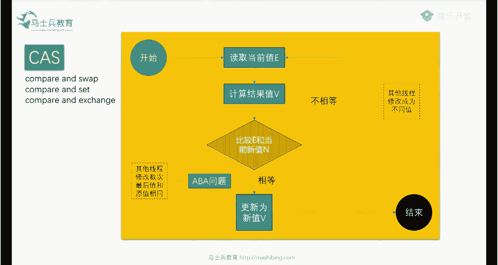

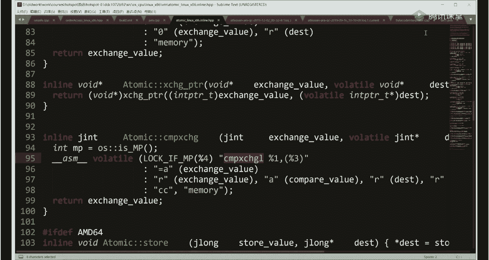

大家仔细看啊，嗯当我们要探究它背后的执行的原理的时候呢。

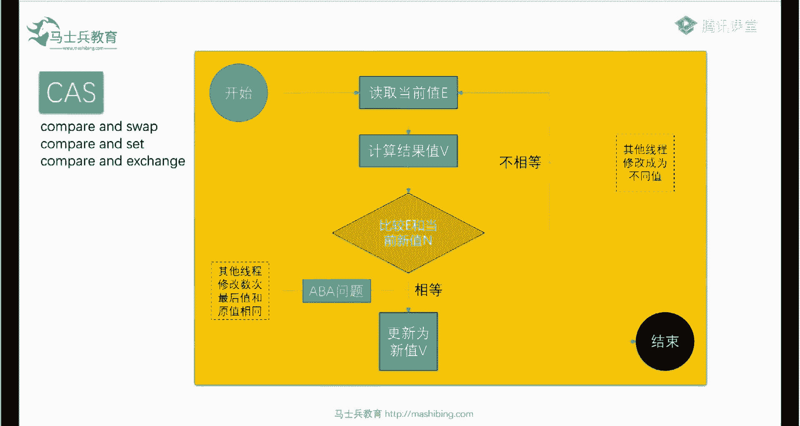

一般的情况下我们去分析它的代码对吧，分析它的源代码，它源代码是什么样呢，就类似于像这个atomic integer这样，他本身用的cs，那么它是怎么完成的呢，我们点进去看，我们点进去看。

我们点来点去呢会发现它进入到了哪个代码呢，进入到了native代码，native是c和c加加写的，那么这个能不能跟进去，答案是可以啊，这个过程呢，其实跟这个native代码的过程比较复杂。

我在这呢就带着你呢简单带大家读一遍好吧，就是我们要知道他最后调用了是一个c和c，加加的compare and swap in的代码，这个类的名字叫unsafe。

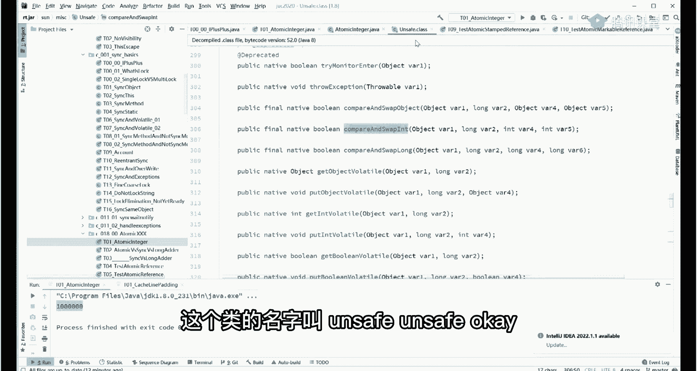

unsafe o，如果你能找到，jdk他c和c加加的代码啊，这个open jdk是提供的，你自己可以去找，你可以找到这个类，这个类那叫unsafe。c p p，这个明显它是一个呃c加加的类。

ok然后在这个类的内部compare and swap int，在这里方法在这，你可以理解为刚才那个方法调了这个方法，那这个方法呢实际上又掉了。

atomic这个类的compare and exchange方法，当然这个要跟过去的话，那我就直接跟过去，你就能看到我们本质上的cas，它到底是怎么完成的，就这部分代码。

当然这份代码你要跟起来就相对费劲一些，我带大家呢做一点小小的解析，在这儿能跟到这里的，来跟老师扣一啊，目前还能跟得上的听大概就可以，一般的面试问到这个程度就差不多了啊，认真听认真听。

大家看这里本质上它是由这个代码实现的，compare and exchange l这东西是个什么东西啊，当你看到前面这个标志的时候，a s m什么标志啊，汇编语言对不对，这是汇编语言的标志。

也就意味着这个代码呢是汇编代码，也就意味着我们cpu本身它支持一个指令，这个指令呢就叫做比较并交换，也就意味着这是一颗cpu，这是一颗cpu，如果对我们内存里的某一个数值，进行修改的时候。

这是内存的某个数值x对它进行修改，我可以有直接修改的方式，也可以有cas方式进行修改，把你拿过来改成一个值，改完一个值之后呢，比较一下，你是不是原来那只是原来那只再给你改，不是原来那值重新拿过来再改。

这个大家能听懂吗，没问题吧，所以说呢硬件指令本身就支持cs操作，这是我们的第一个结论，但是各位同学硬件知识的操作，未必意味着这个操作具备原子性，我再重复一遍，即便是你cpu直接支持的指令。

也并不是说你这个指令本身就支持原子性，完全有可能发生一件什么事情了，就是当我第一个cpu在改这个x的时候，我把这x拿过来改成x加一，往回写的这个过程还没有来得及写的时候。

另外一颗cpu把这个x已经改成别的值了，改成x加二了，听懂了吗，完全有可能，所以这个操作本身不具备原子性，那回到了那个悖论了，就既然你不具备原子性，那你cs操作还是有漏洞啊，那怎么办。

所以在这个操作前面最关键的代码在这儿，在这儿叫lock if mp啊，在这volatile，你们跟着volatile是这是c和c加加里的volatile，往这看，他最关键的代码在这啊。

叫lock if mp，那么这段代码怎么去理解它，好记住这条指令了吧，就是说底层指令支持，这是第一，这是第一个结论，但是这条指令本身不具备原子性，我想办法让这条指令具备原子性怎么办。

ok这里呢是一个红操作，做一个替换就可以，这宏操作里面比较复杂，你别的不用看，只要看这条指令就可以，这条指令叫lock好，这个红的叫lock if mp。

他说adding a log preface to an instruction on mp machine，mp什么意思呀。

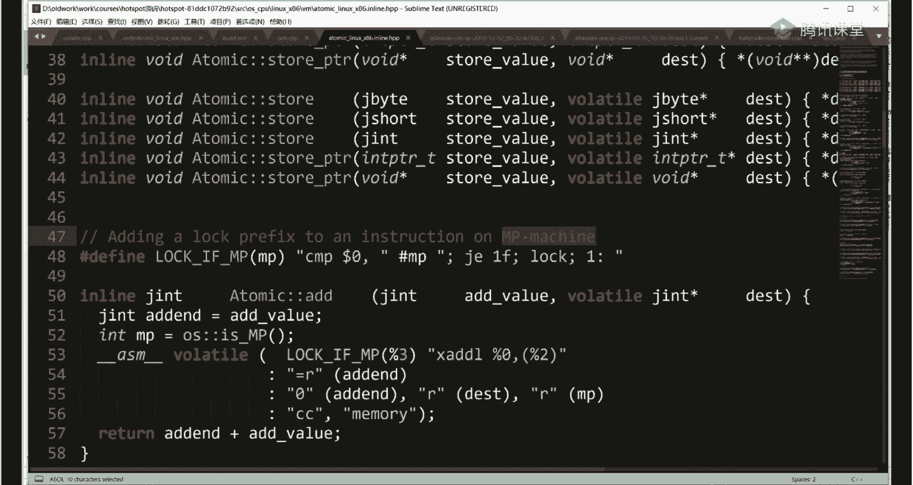

mp的意思就是multi processor，相当于就是你你多核的，如果你有多个核，我就前面给你加一条指令，lock lock指令，所以最终的结论呢我们就得到了，昨天给大家分享的文档里也有。

你呢也可以打开文档看啊。

昨天给大家分享的文档final。

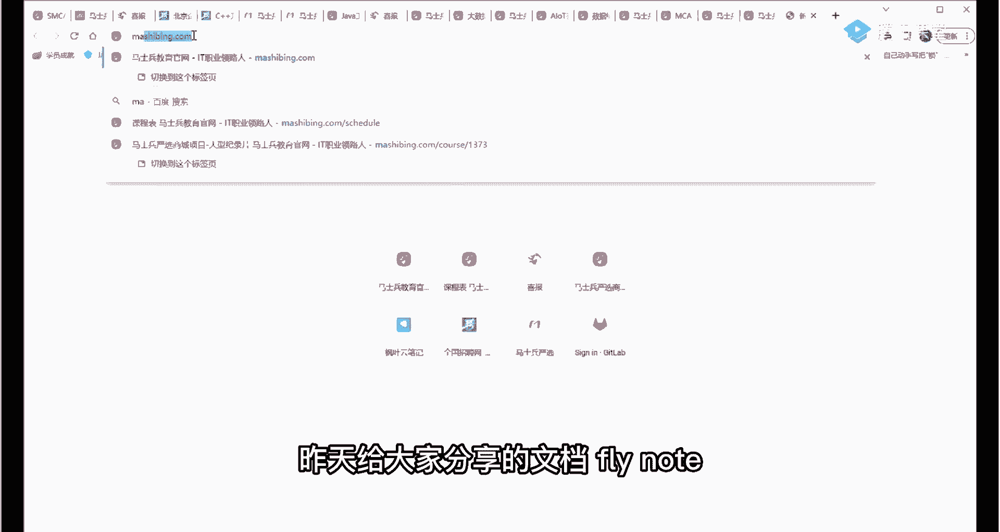

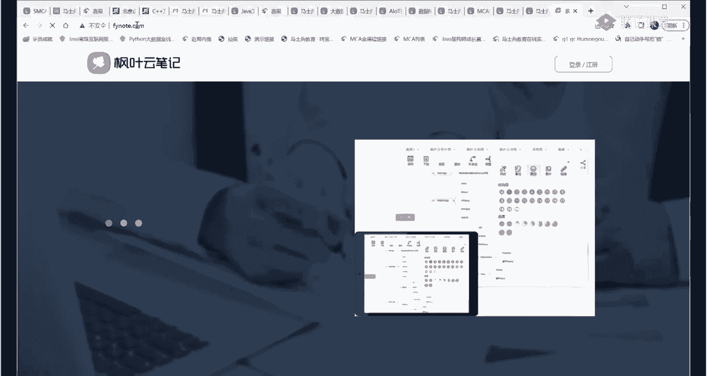

昨天给大家分享分享的文档也有，在这个文档里呢，呃我教了大家怎么样去跟踪cs啊，怎么样去跟踪cs，从cas读到on safe，从as unsafe呢读到unsafe。c p p，从on save。

cpp呢，找到我们的lock if mp是吧，找到这里，从lock if mp呢我们得到最终的结论啊。

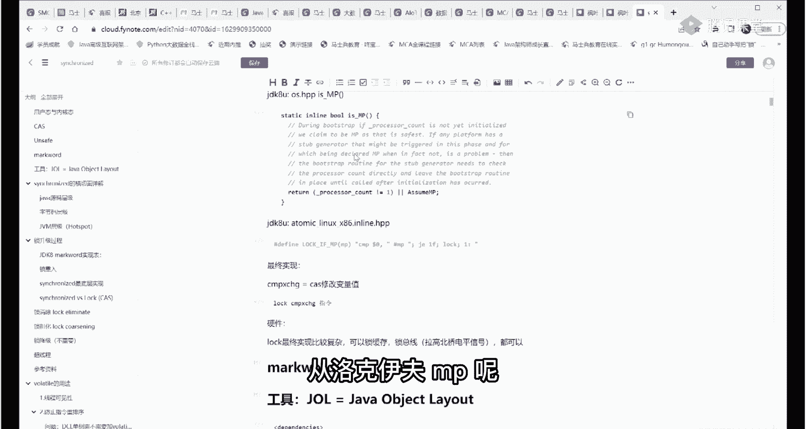

这里是最终的结论，各位同学只要把这个最终的结论记住就可以了。

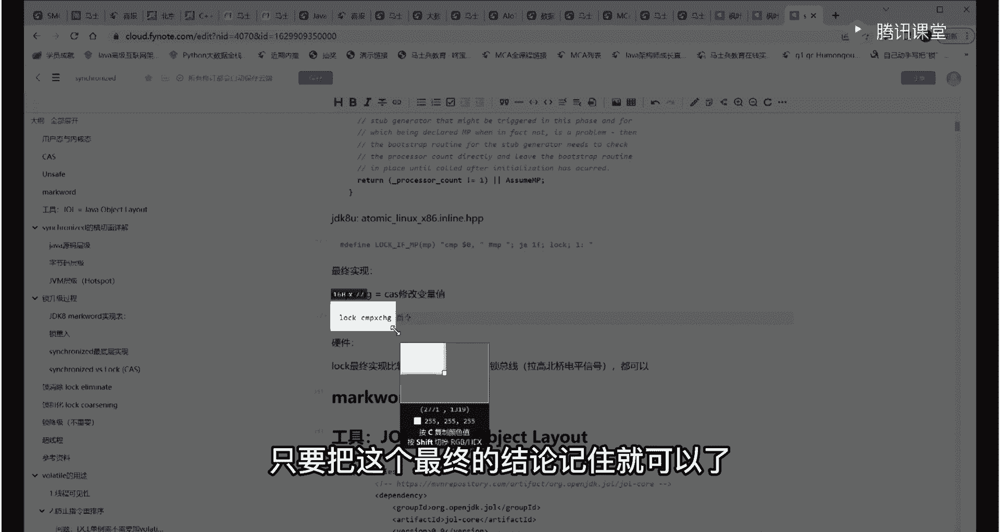

刚才那段你跟得上就跟跟不上，记住最终的结论，我们所有的cs操作在hot sport这个虚拟机的情况下，它本质上是由这条指令来完成，这条指令叫叫log compare and exchange，好。

怎么理解这条指令，只要现在能都能跟上吗，兄弟们有没有跟不上的，能跟上，给老师扣一，跟不上的呢，你有什么问题直接提啊，下面我们来聊怎么理解这条指令，这条指令怎么去理解它呢。

首先呢后面这条指令呢我刚才讲过了，你应该能理解了啊，这是一颗cpu，这是一颗cpu，通过这条指令可以cs操作去改某一个数值x，然后呢，前面这条指令是关键点，前面这条指令的关键点是说。

当我执行后面这条指令的时候，不可以被其他的cpu或者其他线程所打断好了，这是一条lock指令的含义，lock的含义听懂了吧，当然我讲到这儿，很多愿意刨根问底儿的小伙伴，他肯定不开心。

老师你告诉我他是怎么保证这一点的呀，怎么保证他不被打断的呀，各位同学，保障一条指令不被打断，从硬件层面上来讲，它有好多好多的方式和方法，这里面它内部升是一个升级的过程啊，我就在这就不展开了。

它有哪些方式和方法，第一个呢叫关中断，如果你学过微机的原理，你就会知道，我们所有的操作都是通过中断来完成的，在我们的操作系统这个级别上啊，cpu这个级别上都是通过中断来完成，就说我执行这段代码的时候。

我根本就不想用任何中断，你任何人都可能不可能打断我，所以第一个叫关中断，第二个呢叫缓存锁，昨天我讲过缓存的概念，就是把整个缓存行x所在缓存行全部锁定，我改的过程中不允许任何人进行任何修改。

这个可以不可以，完全也可以，但是有的时候x可能数值特别大，都超越整个缓存行了，你这时候怎么办，所以第三种第三种叫什么，第三种叫锁总线，锁总线，什么叫锁总线，就是我把这个通道给锁住。

当我执行这个操作的时候，只允许我这颗cpu去访问这个通道，其他谁都不可以怎么锁，拉高芯片上的北北桥芯片的一根一根电平，往上拉高就可以了，好了就讲到这里啊，再往下讲的话呢，我觉得给你探究硬件了。

还能跟上吗，兄弟们懵逼是吧，懵逼就算了啊，我们回顾一下啊，把前面把前面这部分稍微回顾一下，稍微回顾一下，梳理一下，我们再继续往下o，什么意思啊，认真听我们所有的语言。

所有语言虽然说我以java语言来给你举例子，但我讲的东西不限于java语言，c和c加加本质是一样的，他的所有的说呃，内部的这种语言，所synchronized的什么什么什么什么。

实际上呢是把任何对象都可以当成一把锁，在某个位置，在java里面是在他的mark word上记录着这个锁的信息，是谁持有了这把锁，我我把它释放开了之后，另外才可以，这是我们日常使用的锁。

一般我们把它称之为叫悲观锁啊，就是上来之后二话不说，我先把我名字记上，先锁住啊，我其实你想想看，有的时候你进门上厕所，你是不需要上上锁的，是吧啊，你在家就家里就你一个人，你不用上锁，对不对。

但是呢我们上来就给他上锁，表示自己很悲观啊，我我我管他呢，我悲观的认为一定会有人来，所以我上来先把锁锁上，这叫做悲观锁，那么第二种方式呢就是cs，它是乐观锁的一种实现方式，本质上他认为呢在我改的过程中。

不会有其他人对他进行修改，那么如果有其他人进行修改了，我就采取补救措施啊，我零已经被别人改成八了，没关系，我把八拿过来改成九啊，写会计的过程中，八又被别人改成100了，再拿过来改成100。

一直到有一次成功为止，那么它的本质实现实际上也是悲观所实现，所以就是说所归根结底只有一种就是悲观的啊，这个没有办法啊，它的本质实现呢我们一层一层的跟下来之后呢，你会发现它掉了unsafe。

unsafe下面呢它掉了c和c加加的on safe，对吧，我们会发现了一条指令叫compare and exchange，表示它cpu级别直接直接支持一条指令，但这条指令本身不具备原子性。

我们怎么保证它原子性啊，在硬件层面我们加这条lock指令，这条指令就可以保证，这条指令内部是怎么实现的呀，一共有三种方式啊，这个内部是一个升级过程，太复杂就不展开了，ok基本上我以前遇到的面试。

就问到这个程度了啊，没有比这个更深了，好讲到这里我们可以继续的给老师扣一了，大家可以从笔记里头找到老师的这个跟踪过程，好吧，虽然说你可能不知道怎么去搞那个，hosport代码之类的。

咱们v i p呢是有一些hosport代码，讲给大家听的啊，比较关键的代码呃，有就是那个那个满足，有一部分呃，比较想深入了解底层的兄弟们的胃口，是这个意思啊，但是对于大多数人来讲呢。

你跟跟着我差不多走一遍啊，然后记住结论基本上就可以了，呃大多数面试官呢基本上就就搞不定你了，听懂了吧，嗯好嗯，ok ok好，那你理解了这件事情之后，当你列了这件事情之后呢。

下面我们来看另外一个理解了这件事，我们就可以深入的理解synchronize的关键词了，就这个文件字啊，就synchronized，大家平时都老用老用老用，现在你明白这是怎么使用的了。

但是synchronized的内部是有一个所升级的过程，这也是面试的重灾区之一，就是c synchronized的内部是怎么进行所升级，也叫所优化的，我们讲一个锁呢，如果你上来二话不说。

就拿一把锁挂机关注之后就开始用，那么它效率一定很低，原因是什么呀，原因是同一个时间点啊，这个坑只能一个人用吗，对不对，我想提升整个锁的效率，我该怎么做，它内部帮你做了一系列的提升哇，这个又又又又又复杂。

有的讲了啊，好看，这里读没必要锁毒没必要，锁也有，有的时候也有必要，你读的过程被别人写了怎么办，锁呢有好多好多种啊，讲了基本的悲观所，讲了基本的乐观所，实际上在我们没有j u c这个包之前。

大多数因为用的锁就是synchronize，也没有其他没有其他可以选，但是我估计应该有很多人了解过啊，实际上j u c包了出来之后呢，有好多种其他的锁了，就比如说reentrance log是吧。

这个就是用来替代synchronized，还有什么呀，countdown latch门栓，ok它的本质也是用c a s来实现的，ok还有呢sec liberrier栅栏是吧，per阶段同步器。

ok刚才有同学说读不用上锁，本质上都是有些毒是需要上锁的，万一被别的鞋所改变了呢，你读的不是一个中间值了吗，就成了对吧，所以呢read riot读写锁，ok还有summer信号锁。

还有呢exchanger是吧，交换器以及呢比较好用的这个lock support啊，所支撑，还有呢stem lock啊，这种的是不可重入锁呃，steplog呢是唯一的一个不可重入锁啊。

其他的基本上没有不可重入锁啊，呃j o c提供了很多很多线程的锁，你可以直接拿来使用，j o c呢也提供了自己的那个锁，构建锁的基础要素，你也可以愿意的话，可以自己构建，比如说你自己写一把锁啊。

em lock我就是星期二上锁，其他的都不上锁，哈哈也可以的，本质上你都可以用自己的想法来实现好吧，这块呢也是面试的一个重灾区，但是今天我们就没法展开了，我们今天先讲，先讲所的本质好吧，相比讲所的应用。

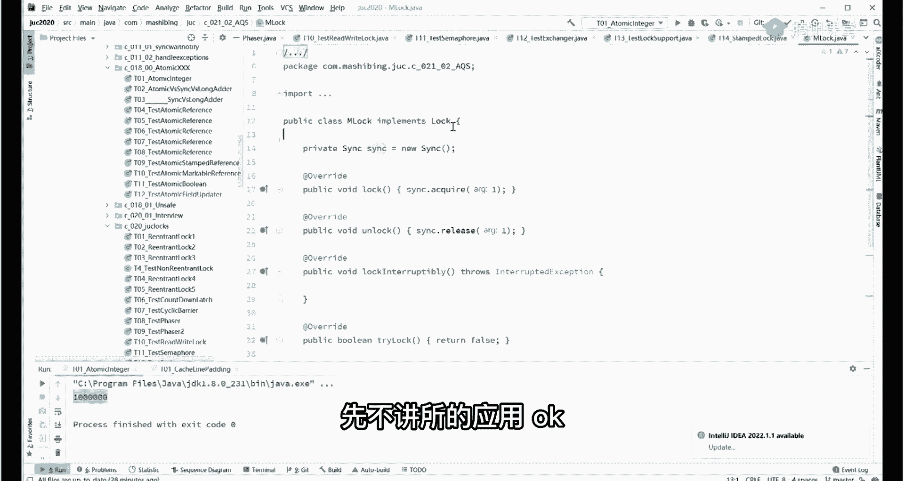