# 系列 6：P33：锁的升级：偏向锁未启动 - 马士兵学堂 - BV1RY4y1Q7DL

下面呢我们来聊什么呢，就面试中常问的另外一个问题就是锁升级，索隆提是一个很很细节的过程，今天我给大家聊一个初步的脉络和梗概，大家看这张图，记住这张图就是synchronized的内部，所执行的流程图。

synchronized，当你new一个对象出来，刚刚开始new出来的时候，它会是一个普通对象，如果你偏向锁打开，它会是匿名偏向，如果是偏向锁打开了，第一步锁定的是偏向锁，第二步锁定的是轻量级。

第三步锁定的是重量级啊，中间有一个升级的过程，好了来，下面我们要准备对这幅图进行细节的展开，准备好的同学再给老师扣一，嗯嗯好的，大家认真听，偏向锁概念相对复杂一点，我们先扔一边。

下面我们首先首先来理解什么是轻量级，什么是重量级，好各位同学听我说这个轻量理所呀，就是我们刚才讲的这个cas的概念，ok，这个清掉你所就是cn的概念，也就意味着在synchronized的内部。

执行的过程之中，实际上它有一步呢是在做这个轻量级锁的操作，现在你所的意思就是说啊，我们还拿那个上厕所来举例子啊，哥们儿有一哥们在里面上厕所对吧，现在你所是怎么操作的呀，轻量级锁的操作是这么操作的。

有一个人已经进去了，然后呢门上贴着他的名字是吧，这门上是叫铜墙铁壁，然后如果有人来了，用轻量级锁的方式来热竞争，cas循环不停的循环，while循环怎么循环啊，简单理解为就是拎着裤子跟着原地转圈。

每转一圈看看锁开了没有，每转一圈儿看看锁开了没有，什么时候发现锁开了嗯，比如说，来比如说这上面坐着的人是铜墙铁壁是吧，然后来了一个人叫夏天，夏天就开始拎着裤子跟他转圈转一圈，哎，哥们儿你出来没有。

哥们儿你出来没有，然后又来一人l b p也跟着拎着裤子转圈儿，哥们儿你出来没有，你出来没有，什么时候发现门一旦开了，或者锁被打开了，这两个人一拥而上，看看谁先抢到，谁先抢到。

比如说夏天抢到了夏天进去干事，lb hero在这里继续拎着裤子转圈，唉，转每转一圈开了没有，每转一圈开了没有，直到开了位置啊，听懂了吗，这就是那个轻量级锁的，用cs实现了一个简单简简单的理解啊。

就是这么来理解，ok来这块听明白，老师可以啊，好这是轻量级锁啊，下面我们来理解什么叫重量级锁，各位同学，重量级锁这件事情呢相对难一些，理解重量，你所就需要理解另外一个概念，认真听啊。

我发现需要补的基础概念，大家伙应该是比较多，没办法给大家补一补，稍微，就是线程模型啊，我们讲这个线程模型啊，好大家看这里看这里啊，我给大家画一下图就行了，那么这是我们的操作系统dos大家都知道啊。

我们的虚拟机啊是跑在，我们的虚拟机呢是跑在操作系统里面的是吧，我们我我们虚拟机啊，这是我们那个jvm，这个m呢是跑在操作系统里面的呃，关于对于cpu的各种调度，对应的操作系统啊。

其实就是操作系统里面的线程，这是操作系统的线程，操作系统限制操作系统线程好，现在问题是呢，大家都知道我们在jvm里面，我们也可以写自己的线程，对不对，在jvm内部啊，我们也可以写自己的线程好。

这是jvm的线程，现在我问你的是呃，jvm写一个线程应该大家都会写吧，thread等于new thread就new出来一个线程，对不对，下面我问你的是一个jvm的线程。

对应操作系统的是一个操作系统线程吗是吗，就说我在jvm里面六个线程出来，我的操作系统是不是，真正的会给他new一个线程出来，是吗啊，有人说是，有人说不是啊，答案是yes，记住答案是yes。

目前呢大多数的jvm的实现，就看具体看哪个哪个jvm实现啊，兄弟们具体看哪个jm实现，目前大多数jm实现都是这样的，一比一的关系，这里起一个，这里就起一个，因为他偷懒儿，明白吗。

如果我要自己去管理整个线程的调度，我需要单独写算法，写起来很麻烦，所以jvm呢从开始就偷了个懒，我把我所有的线程的调度，线程的管理交给谁，交给操作系统了，我这里有一个交给他去管理。

new一个交给他去管理，然后呢他再把结果反馈反馈回来给我，ok这是dvm。

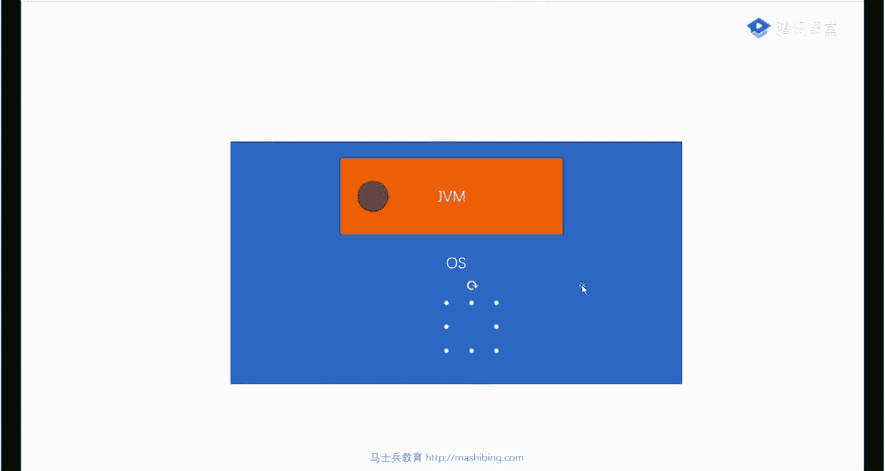

那么和这个形成鲜明对比的是另外一个语言，是另外一个语言好这个语言是什么呢，这语言是go，go on的虚拟机，go on虚拟机长什么样呢，go on的虚拟机呢，记住在go里面，它的名字叫不叫县城。

叫携程啊，或者叫先城，这里面它起n多n多的携程，或者叫n多n多的线程，那么对应我们的操作系统起多少个呢，其实最多就起那么十几个，这里是一个m bn的关系，o这里面它里面执行的所有的任务。

最终是由我们操作系统的十几个线程，或者几十个线程来完成的，而这个里面的携程可以起多少个上万个，ok这大家能听懂吗，这就是虚拟机的线程模型，每一个模型有每一个模型自己的好处，并不是说go的一定好。

并不是说java一定差啊，也不是说java一定好，go的一定差，go on是这么设计的，go on呢起一个协程非常简单，一个关键词go就可以搞定了，对不对，好各位同学，这里面就意味着有一个本质的。

有一个本质的这种这种区别，这种区别是什么呢，就是我对于自己内部现成的管理，说这两个线程之间，他们之间如果想做数据同步的话，由谁来管理啊，注意是要交给我们的go的虚拟机直接管理，那对于jvm来说。

如果两个线程冲突，他们有一个做一个数据的一致性的这种呃，比方说等待在同一把锁上的这种一致性的啊，调度调度管理啊，轮到谁不不轮到谁这样的管理好，这种时候交给谁啊，交给操作系统老大，各位听懂了吗，兄弟们。

来这块能听明白的，给老师扣一，一比一究竟是一个还是还是还是两个，当然是一个呀，本质上所有的东西，所有的最终都要通过操作系统的线程来完成吗，最终就是操作系统一个线程嘛，所以你看你攻你。

你自己看你的眼神钉在哪个层次上，ok好，各位同学认真听啊，那么回回过头来，我们来看这张图。

来看这张图，这张图的重量，你所意味着什么东西，请大家记住，如果是在轻量级锁这个层面，在轻量级锁的这个层面，java虚拟机自己就能搞定，while循环吗，反正well，你not open。

我就跟着转圈就行了，是不是很简单，就在这里，java虚拟机自己搞定，不需要经过操作系统，老大，接下来如果你要交给，说我管不过来了，交给谁，重量级锁的概念，就是交给操作系统老大帮我管理。

这是重量级锁的概念，这部分我自己管，这部分交由我的上级来管，所以它比较重，中间加了一层操作，得我的老大给我反馈回来，我才能得到结果，这是重量级锁的概念，各位听明白了吗，来这会儿大概听明白的。

给老师扣个一，所以轻量级自己搞定，重量级老大搞定o，那下面的问题是，老大搞定和我自己搞定有什么区别，听我说啊，就是这个老大呀，它内部又是一个复杂的过程，这部分也是一门课，叫操作系统吧。

学过这门课的就容易理解，没学过这门课就不容易理解，不过没有关系，我给你讲一个典型的场景，典型场景是什么样子的呢，典型场景是这样的，这个重量你所管理的时候经常有一个操作，就是让人去等待。

各位同学有没有调用过这个方法，叫older weight。notify，这句话的本质是什么意思呀，这个大家知道吗，weight，进入这把锁所关联的等待队列，仔细听啊，这不是让他进入等待状态。

是进入这把锁所关联的等待队列，让这个线程一个人来了，使劲儿转圈儿，转圈的人实在是太多了，我都转不过来了，我cpu都忙不过来了，怎么办，交给我吵醒老大，我操醒了，怎么管呢，让它直接进入等待队列。

来了之后呢，这是那把锁，这把锁所关联呢有一个等待队列，一个队列，这个队列呢让这个人直接进去排队就行了，什么时候轮到你了，什么时候把你拎出来，什么时候轮到你了，什么时候把你拎出来，听懂了吗，只要等待队列。

所以呢轻量级锁和重量级所它的区别，现在就呼之欲出了，这也是面试的经常问的问题，问轻量级锁和重量级所有什么区别，呼之欲出，轻量级所示，所有的线程都活着，原地转圈儿，消耗cpu。

while循环能不消耗cpu吗，重量级所示，很多线程进入等待状态，什么时候叫醒，什么时候再执行，不消耗cpu，各位听懂了吗，这是轻量级锁和重量级锁的区别，来我上面讲完的，能跟上的，给老师扣一。

嗯有点反馈啊，确认你还在听好不好，这边就只有那个小记号还在跟着我听是吧，其他的就不跟着听了，嗯雷雨嗯，ok 7371，good，好认真听认真听好，接下来那它中间这个升级过程是怎么升级的，为什么要升级。

这里面又隐含着一个面试题，就是到底轻量级锁好还是重量级所好，有了清道理所为什么还需要重量级锁是吧，有了轻量级，为什么还需要重量级，ok y哪个锁更好，答案是各有各的好处哈哈不然的话那就没必要。

其中有一个就没必要存在了，对不对，在什么情况下我们使用轻量级，什么情况下我们使用重量级，那么你想想看，如果有这么一种情形，这哥们儿呢叫伯伯峰，肠胃不太好，吃的又多，进去之后一干就干半小时。

然后外面等待的人又特别多，1万个人在外面等待，各位同学告诉我，这时候用轻量级好还是重量级好啊，轻量级轻量级就意味着什么呀，轻量级就意味着这1万个人在那拎着裤子，玩了命的转圈。

每转一圈消耗cpu cpu发现这都是活着的现场啊，不能让他们得不到我的cpu的时间，这个也不行，对不对，所以得让他们得到时间片执行，那就意味着光线程切换就消耗了很多cpu了，效率反而不高。

而且呢我转半天圈也得不到锁，为什么，因为波波峰这哥们儿，他这个时间太长了，是不是，所以这种情况下，我们一定是让这1万个人去排队，让伯伯峰什么时候完事了，什么时候再拎出另外一个人来，再进去就行了。

这样的效率反而变高了，ok所以我们得出结论是什么情况下呢，一般来讲我们干的这件事儿，专业名词呢叫做critical section，叫临界区，临界区的这个操作，也就是你干这件事啊。

大大个便这个时间特别长，与此同时竞争又很激烈，什么叫竞争很激烈，就是等待的人很多，这种情况下不适合轻量级，直接升级为重量级，其他时候都是轻量级，这块大家大概听懂了吗，呵呵好大题，明白之后呢。

我看刚才有同学问啊是吧，老师那什么时候清量级升级为重量级啊，这玩意儿比较复杂，你们想听的看，我其实有的有点懒得跟你们讲啊，这会儿还能跟上呢，还可以往细节里揪一揪的给老师扣个。

一来就是说在什么具具体在什么情况下，轻量级升级为重量级，好吧嗯，反正就是你大概理解就是轻度竞争的时候，我们使用轻量级就可以了，现在机搞不定的时候才会升级为重量级，听懂了吧，那具体什么时候升级呢。

这里面是有它的一个指标，这个东西呢，我在那个笔记里给大家写的很清楚啊，所以说呃我是推荐各位学习呢，不要追求说我就一定上来之后，所有细节全掌握，你应该先掌握这张图的大概脉络。

然后呢再去慢慢的去探究这里面的细节，这样来学习啊，不要那个上来学一大堆细节，所以我有的时候呢还给大家讲太多的细节，主要是因为这种学习方式效率其实并不高，呃如果有兴趣去读这话。

各位看这里啊，如果竞争加剧，在这里在这里，因为这里面涉及到另外一个东西，就是呃jvm的u调优啊，就是你需要指定jvm参数，如果竞争加剧是这样的，在以前的老版本的情况下，线程超过十次自选。

就是在转圈转了十次都没轮到他，或者说自学的线程数超过cpu核数的一半，比如说你那个有有十个和十个盒，然后呢这时候数量已经有六个线头了，在这里转圈了，好这个时候呢升级为重量级，但是呢jdk一点六之后。

他加入了自适应自旋转圈，a dance of spinning，adaptive self spinning啊，跟我读啊，adaptive self spinning。

ok adaptive self spinning，这时候由由谁来控制呢，jym自己控制就行了，你不用再管了好吧，不用再管了就ok，所以这个如果你要愿意管。

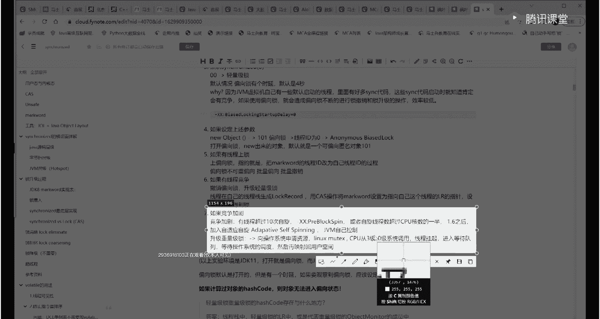

你也可以自己指定啊，但是一般不建议管这事儿了，简单说呢就是这事不要不要你管了，他自己管，自己判断什么时间生，他不生来这块听明白了吧，啊关于这块我就大大概给大家讲清楚了，就是轻量级锁什么意思。

重量级锁什么意思，k所谓的轻度竞争是什么啊，什么时候转成重量级好，我们我们我们给大家讲一个比较难的概念，偏向锁好吧，嗯来准备好的同学和老师扣一，这个偏锁呀，它比较特殊，是不是从重转为轻，转不了啊。

没有没有往回的箭头，这东西只能往前走，好变t啊，这个偏向锁呢它这个概念呢比较特殊啊，这个也就是存在于面试里面，其实呢你掌握它不掌握它，我认为关系不大，为了就是有些同学的刨根问底儿。

给大家讲一讲偏向锁的概念，偏向锁，偏向锁，严格来讲并非一把锁，啥叫偏向锁，讲这个电阻呢也可以顺带着教大家，你看清楚你现在的锁是哪种锁。

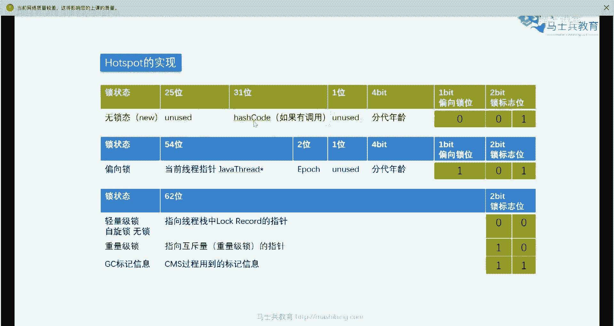

呃实际上我们是可以通过一个观察，一个对象内部的结构，能够观察出来我们现在用的是哪种锁啊。

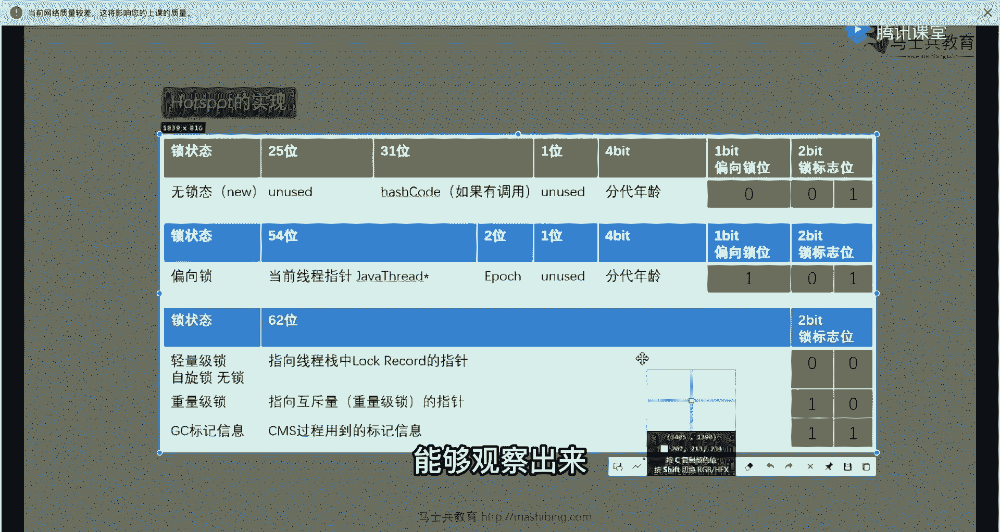

这我教大家一个小小小技巧，看这里，比如说，那刚才那个小程序来举个例子啊，比如说t小t等于6t是吧，我上我给这个小t上把锁synchront，然后呢把它给里面内部再解析一下，跑一下，大家看这里啊。

就是说这个时候啊，是我们被锁定的那个对象的内部状态，如果你想知道他现在上的是哪种锁，你只需要对照老师给你画的那张表就可以了，我们把那张表调出来，刚才那张表啊，就这张表只需要跟这张表做对照。

从哪里做对照呢，从这几位这几位做对照。

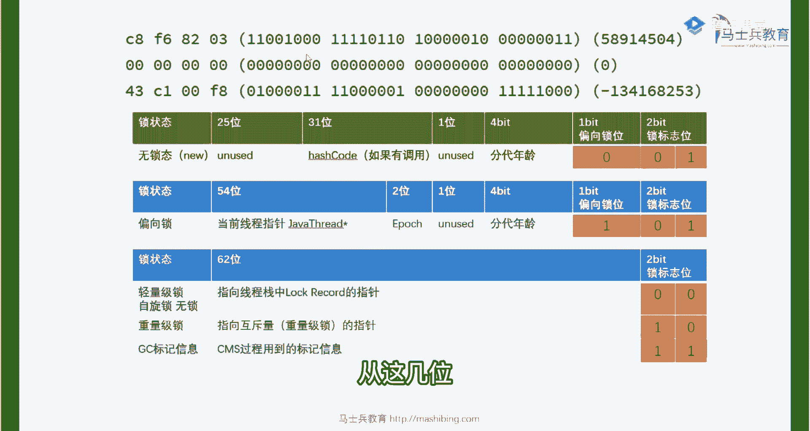

ok你看啊，你读这几位，这几位目前是000。

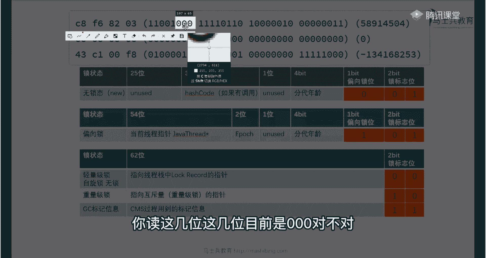

对不对，如果这几位是001，对应的是无所啊，我们我我，我们看那个我们那个小程序刚刚new出来的时候，是不是零一看了吗，这时候是没有锁的，等于是没有人锁定的，所以他怎么判断是没有人锁他呀。

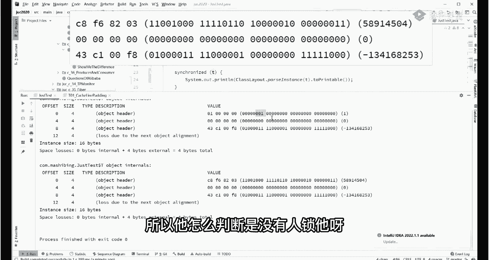

只要判断这几位就可以了。

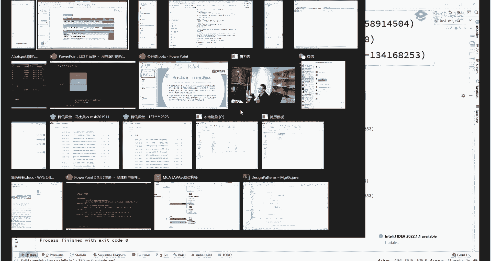

好我们翻过头来，那么如果你这里写的是幺零，幺，对应的是偏向锁，听懂了吧，如果这里是零零啊，我们现在就是零零，对应的是轻量级锁或者是自旋锁，或者叫无锁啊，那么如果这里是一零，对应的是重量级锁。

ok如果这里是一一，就是表示呃这是我们垃圾回收器，那这样来回收这个对象，来这块儿大概能看懂的，给老师扣一没问题吧，就是你看啊我们上来之后上的就是轻量级锁，对不对，那有同学可能会说老师。

那什么时候我能看到那偏向锁呢，看到偏向锁呀也很简单，就是你只要干这么一件事就可以了，thresleep 5000，我们只要上来先睡五秒钟，这里稍微等一下，因为他睡五秒，睡五秒之后。

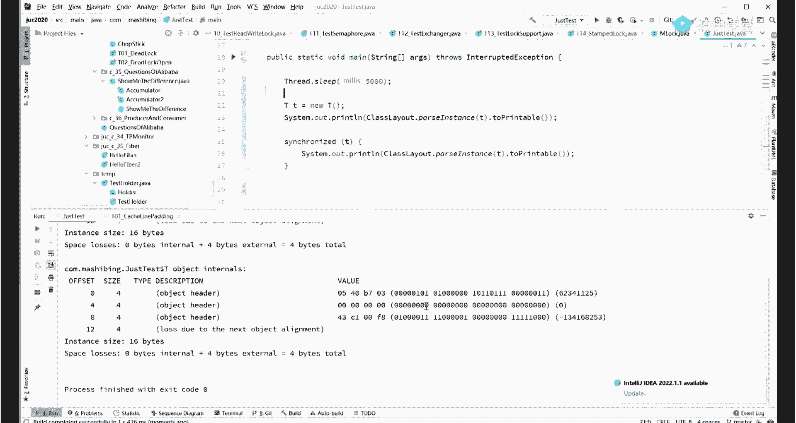

你发现我们上的锁，我们看到这个对象上完锁之后呢，和原来就不一样了。

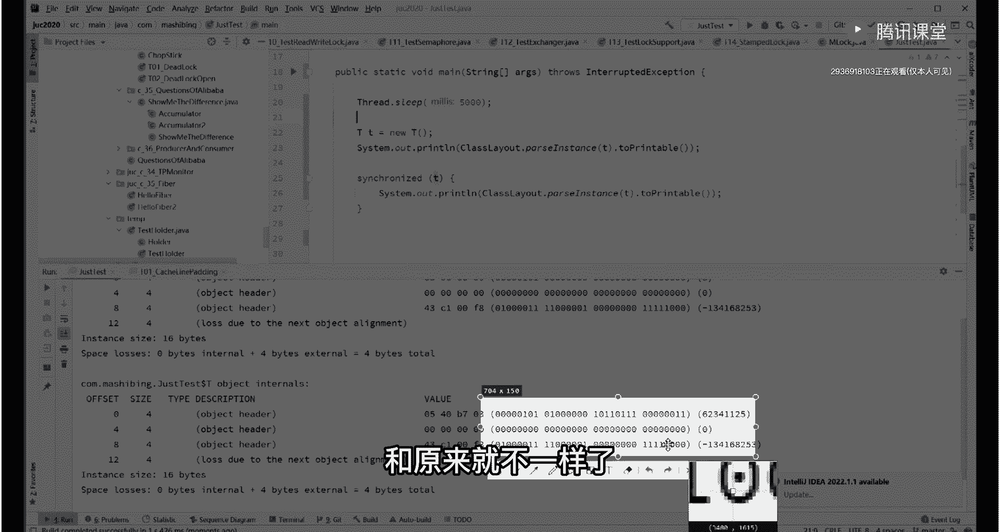

刚才你还记得吗，他是零零，是不是现在是什么，现在是101，那101什么是什么状态，对比一下101在这什么状态，偏向锁是吧，就是睡五秒钟之后啊，你发现你那个对象就变成偏向状态了，哈哈好。

下面我们就开始讲这个偏向锁的概念啊，也顺带让大家理解为什么睡五秒钟它就变偏，就变偏向了啊，后两位还是三位，两位或者三位吗，不都一样吗，仔细听仔细听这个片索呢，其实他还挺有意思的啊，挺好玩的。

给大家讲一下偏向锁，那到底什么叫偏向锁呢，各位同学偏向所最基本的理解就是一个标记，他甚至呢本质上都不是一把锁啊，它就是个标记，比如说我再举个例子啊，我拿我拿谁来举例子呀，我看看谁正好错的，错的是龙舞啊。

龙舞太不雅观了，ok龙五呢觉得很不雅观，所以呢他上锁的时候上偏向锁，偏向锁的第一个概念叫做偏向第一个线程，厕所开门了，第一个过来的人是龙舞，好了，这把锁就是龙舞的，那这个偏向锁怎么上呢。

龙五把自己名字写上龙龙五，ok把门往往门往上往上一贴，说哥们儿啊，这把这个坑归我了，进去干事好了，这个标记上面贴着的这张字条就是偏向锁，从专业角度讲呢。

就是龙舞把自己的线程id直接写在mark word里面，表示这把锁归我啦啊这就叫偏向锁，那偏向所有什么好处呢，大家都知道县城是执行一会儿休息，一会儿执行，一会儿休息，一会儿，听从线程调度器的龙五。

在持有了这把偏向锁之后，它是由于他是第一个来的，第一个来的，所以呢这把锁是偏向他龙武的，就给他写一名龙舞，不会写别人的名，只会写第一个过来人的名字啊，那龙舞呢就是你的，就是这个他的初恋对吧。

刻骨铭心的记录在这里啊，只会偏向第一个，后面的都不算，这有什么好处呢，好处在于龙舞这个线程暂停之后再回来的时候，只要他回来，发现上面写着我的名字，龙舞直接进去继续干事就可以了。

没有必要进行所竞争这块大家能听懂嗯，就是他省了很多锁竞争的过程，ok这就是偏向锁的概念，那下面我们来讨论，如果又来了第二个人怎么办，假如第二个人来了章鱼，和铜墙铁壁，这俩人来了，这俩人来了一看，哥们儿。

你你不对呀，就你一个人把坑全占了，这不合适啊，把龙武的名字撕下来，然后这三个人开始轻量级锁，拎着裤子转圈，竞争是竞争上谁就是谁的，这块就升级到了那个轻量级锁了，好吧，什么时候撕，只要有第二个线程来了。

就直接撕好，这是这个过程啊，我们再重复一下，就说第一个人来了呢，把他名字往上一贴，然后如果他再回来，就不用有所竞争，上面看就是我的名字，直接推门就进，那这个时候如果第二个人来了，我们要进行锁竞争。

谁哪有这把锁，谁才能够在里面干事儿，就把这个名撕下来，然后他们三个人开始自旋锁竞争，拎着裤子转圈，一一往往的具体的实现呢也是优先偏向龙舞啊，就是即便升级为轻量级锁龙五，也是第一个进去的啊，一般是这样的。

就偏向哦，好各位认真听啊，认真听，那么这个时候呢这把偏向锁有什么作用呢，就很奇怪啊，那有一个人来了，我直接让他去进行锁定增生，不管甭管是轻量级重量级不就行了吗，干嘛要设计这么一个标记。

设计在这里有什么用，这里面有它背后深刻的含义，各位同学，这个深刻的含义我是尝试讲出来，看能不能理解，这里面呢有一个小小的调查，就是在我们日常工作的过程之中，虽然说我们用到了某些带同步的方法。

比如说synchronized的各种各样的方法，你可能没有意识到，其实你一直在用，但是在绝大多数情况下，我们用这些方法的时候，实际上只有一个线程，在百分之八九十的情况下。

我们在使用synchronized方法的时候，实际上只有一个线程在用，有同学说老师不理解，我给你看一个最粗浅的案例，你就理解了，大家看这里，我们日常开发之中经常这么写，is out。

hello world，好，我们看了我们写了这句话，这句话里面有几个线程告诉我有几个线程，几线程，一个主线程就一个，对不对，那么你这里面用锁了吗，有没有用锁，你可能不知道rain line。

这里面就有synchronize，看到了吗，所以他实际上已经使用了锁，ok，那假如说我大多数县城，只有一个线程在使用这把锁，我有没有必要启用那种复杂的锁竞争机制，啊我判断一下谁是什么状态，该轮到谁了。

下一步是谁的，这把锁是谁的等等，有没有必要我再重复一遍，在绝大多数情况下，我们可能自己知道不知道的时候，我们就已经使用上锁代码了，那使用这个上锁代码的过程之中，的绝大多数情况只有一个线程。

那只有一个线程情况下，我们有没有必要启用一个复杂的锁定成机制，有没有必要，没有必要了，那没有必要的话，那干脆就给他设计一个偏向锁就算了，所以在你一个线程使用这个synchronized的时候。

它内部就是一个偏向锁，就偏向你这个线程，你如果没有别的线程，你在重回的时候，重入的时候永远不会有锁定争，你的效率就提高了，这就是偏向所的设计机制，来各位听懂的老师可以，那好那我们回头再来看啊。

那为什么这个偏向锁，向左为什么是最开始没启动啊，我睡五秒钟才会启动啊，为什么会这样子呢，刚才我们实验过，对不对，我们上来睡五秒，然后我们就观察到了那个偏向锁是吧，synchronized。

然后synchrono，这时候我们就观察到那个偏向锁啊，为什么我们在这时候会观察到它的原因是什么，嗯那我们反过来问一个问题，就是说当我明确的知道是多线程的时候，我们说大多数情况下是一个线程。

所以我们设计一个偏向锁，但是当我明确知道，我非常明确的知道我下面用的肯定是多线程，一定是多个线程，我有没有必要启用偏向锁，骗子组还有没有用啊，没用，反正你出来之后也要也要被人撕掉。

撕掉的过程是不是还得费一部手续，效率反而低了，一个虚拟机启动的过程会启动好多好多线程，大概十几个，明确的多线程，听懂了吗，什么垃圾回收线程啊，背后分分配的线程啊，找操作系统要资源的线程等等等等。

它会启动好多个线程，明确的是多线程，还有没有必要启用偏向锁呀，没必要，所以虚拟机启动的过程是这样子的，在最开始它不会启用偏向锁，什么时候会启用啊，默认配置四秒以后，四秒以后启用偏向锁。

这个结论呢在老师给你的笔记里，也记得非常清楚啊，各位同学，如果你要愿意，你也可以使用jvm调优的参数来自己设置，这把偏向锁什么时候启用或者不启用，这些都可以听懂了吧，看这里可以用这个参数来修改它。

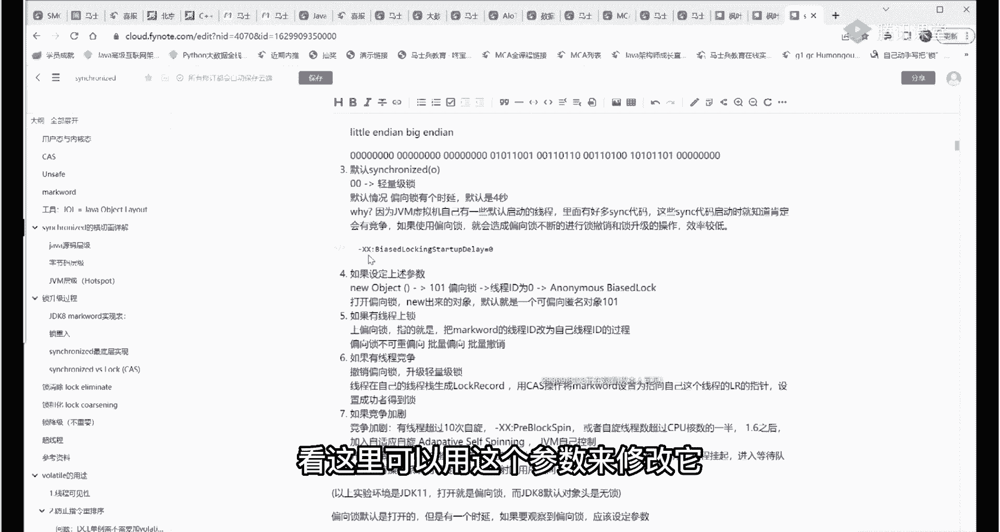

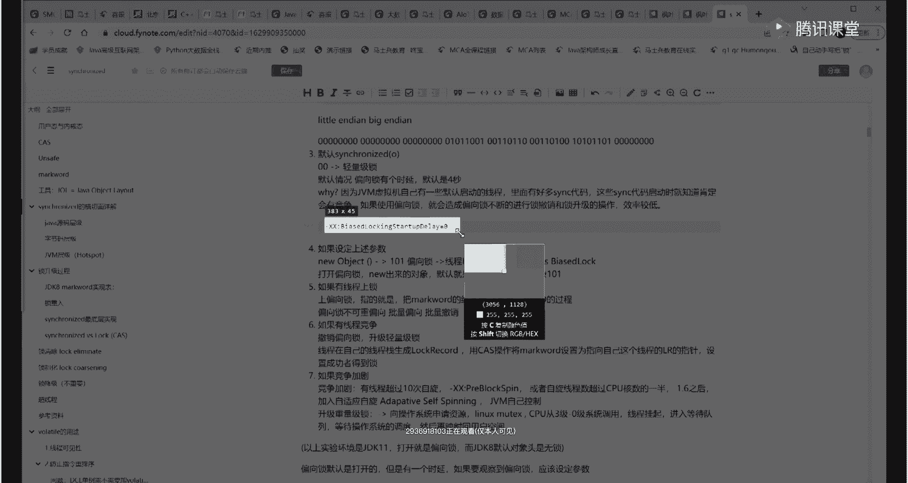

这个参数呢叫biased，lockjof daily啊，跟着我读，biased就是偏向的locking锁，start up，启动delay延迟，你可以把它启动延迟设置为零，那就刚开始虚拟机启动。

它就启动了，默认四秒，好了，偏向锁我就讲到这儿啊，大体的概念我就讲清楚了吧，应该这个图看翻译出来看看，还有什么不明白的吗，一股子咖喱味，好我们再看这张图，看是不是能看明白了，来关于这张图。

还有没有谁有疑问的，好不要聊聊英语了好吧，英语浪费了我们中国人。

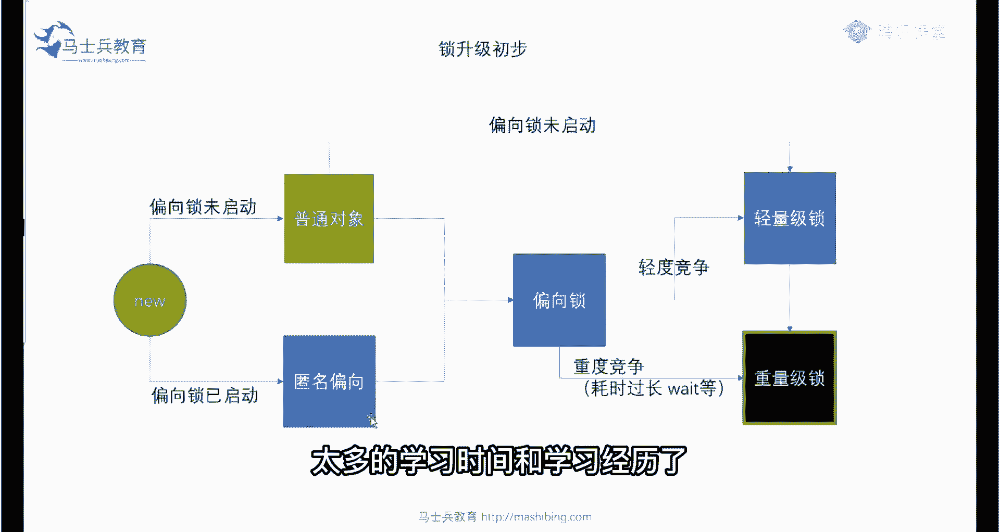