# 马士兵教育MCA架构师课程 - P34：锁的升级：偏向锁已启动 - 马士兵学堂 - BV1RY4y1Q7DL

现在有点懂了是吧，ok我估计好同学呢可能还不知道呢，这个匿名偏向是什么意思，匿名偏向的意思呀，就是当我们new一个普通对象的时候，看这里啊，嗯你看啊，我们如果不睡不启用偏向锁，也就是说不睡这五秒钟。

这时候我们new对象普通对象啊，注意看普通对象走，你，好一会把它给输出出来啊，that's layout as essence to prinable s，把输入出来，记得结论就行了，啊。

这是咱们一个偏向所，没有启动的时候的一个普通对象，记住它长这样，下面呢我们来看偏向所启动之后的普通对象，让偏向组启动跑一下，比较一下，来比较一下，有什么区别，你看看这个对象上来。

是不是就自带着偏向锁的标记啊，101这里是什么零零有，对不对，也就是说当我们偏向锁机制没有启动的时候，我们这个对象啊就是一个普通对象，001呃，如果偏向锁机制已经启动了呢，它自带偏向锁标记好了。

这个对象就是匿名偏向，因为他上来呢还没有人给他上锁，还没有人还没有人锁他呢，也就是说他还没有偏向任何一个人呢啊，所以他叫匿名偏向，是这个意思，听懂了吧，很简单好，嗯关于这个图啊。

大概就是这样的一个小的升级的过程，我都讲清楚了，里面呢还有好多好多小小的细节呃，我都在那个笔记里头给大家记得比较清楚，vip里面会讲的比较详细，公开课呢我们就讲到这里好不好，还没上锁，咋偏向不是。

所以还没有偏向任何一个县城嘛，所以叫匿名匿名的吗，地名偏向意义是什么，没什么意义，就是上来之后呢，他已经把脑袋给你设设计好了，你不用再从普通对象转过来了，意义不大。

老师聊一下synchronized底层是怎么实现的，synchon底层我在笔记里给大家介绍的比较清楚，它本质上也是用log来实现，synchronized的底层是用log来实现的。

昨天我已经分享过了这个笔记的地址，找咱们任何一位小姐姐去找她要一下就ok啊，一我想现在呢我估计有一些那个大厂的面试题，你就应该能答得出来了，我瞅眼看看有哪些你能答得出来的，仔细从头读到尾。

这些都是百度阿里美团，什么顺丰，都是一些大厂的面试题，都会明天就送外卖嗯挺好，去美团送外卖，嗯在这儿呢再给大家拓展一些小小的细节啊，后面内容呢能跟上就跟，跟不上就算了，好不好。

嗯今天呢由于跟大家拓展的知识面比较宽，有一些呢其实大多数都是涉及到一些，计算机系的基本的这种基本的这种这种这种课，呃，这也是为什么，就是老师呢在这里给大家在我们的课程中呢，给大家设计好多这种基础课的。

原因就是基础课你搞定了之后呢，基础不牢，地动山摇，搞定之后呢，你就会走得比较高远啊，比较长久，基础打牢了，这里面有好多计算机系应该要玩的，一些基本的内容就是操作系统，计算机组成原理，io和网络。

计算机网络，然后那个linux系统算法，数据结构，今天听课的如果是有一些非计算机系的同学们，时间够的情况下，优先要把这部分内容搞定的，听懂了吗，补一点那个这部分内容的基本的基础啊。

今天今天是不是有人是那种非计算机系的有吗，有没有有的老师扣个一的，有应该有啊，因为咱们国内呢呃，搞编程的程序员其实很专业的并不多，当然他现在的要求会变得越来越专业，但是听不懂，你听老师的课就能听懂了。

你听我的课听不懂吗，我跟你讲这些原理，你听不懂吗，我们回到那个美团的面试题。

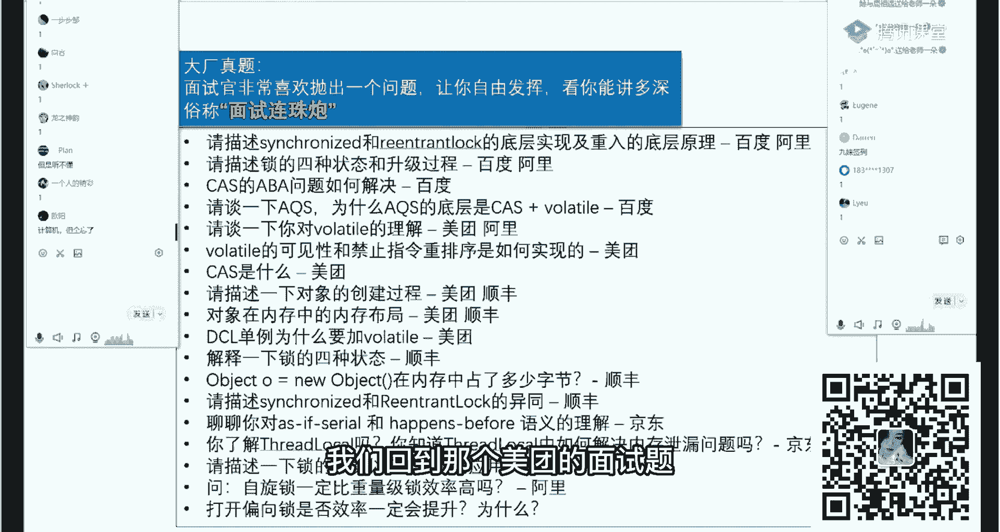

美团面试题呢，他就问你说那个一个对象，在内存之中的存储布局，那么各位同学啊，呃这里面其实有一个很好玩的地方，就是我讲的比较清楚，我说mark word是多大呢，是八个字节，对不对，指针类型是多大。

指针类型是四个字节，对不对，这就比较好玩了，各位同学，我不知道大家了不了解啊，就是你们的使用的虚拟机，它是多少位的，一般来说我们讲虚拟机这块呢，都是说你是多少位的虚拟机是吧，你是多少位的机器。

你们知道自己的虚拟机是多少位的虚拟机吗。

这块怎么查呀，挺好查的是吧，64位的对呃，怎么看呢，你敲一个命令就能看出来啊，看这里啊，我就敲java，这玩水就行了，这里写得非常清楚，64位虚拟机好嗯，你比方说你的操作系统。

你的windows是多少位的呀，64位的对吧，如果以前的话，实际上什么windows xp啊，还有32位的等等好，那么各位同学你们了不了解。

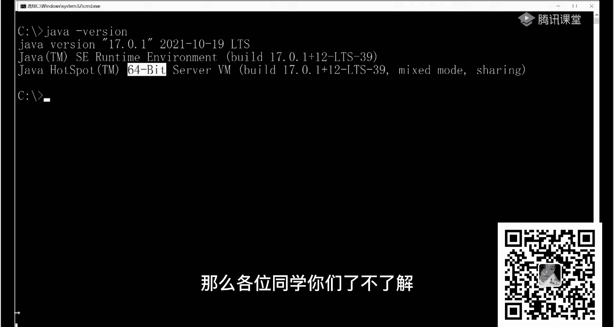

尤其是哪些非计算机系的，这个64位意味着什么，32位意味着什么，谁能告诉我这指的是什么东西什么的，什么东西的长度，什么东西的长度啊，寻址的宽度对啊，寻址的对没错啊，寻址呃，机器字长。

这跟机器字长应该关系不大啊，就寻指的宽度，指针的长度简单说就是指针的长度，就是我在里面一个指针，指针记录的是某一个东西的地址嘛，对不对，那记住这个地址的时候，这个长度到底是多少，这个长度呢64位的机器。

这个指针的长度就应该是64位，32位的机器，这个指针的长度就应该是32位，那么以前的xp呢大多数时候是32位，32位就意味着它的寻址空间，寻址空间呢，就是说我用多少个这么长的长度。

来标记我们整个内存地址，比如说我如果有一位，我就只能访问内存的两个小格，零或者一是吧，零或者一，如果两位呢，那我就能访问四个小格，对不对，01101100对吧，我标记四个地址，那如果是三位呢。

那就我能访问内存中的八个小格是吧，那如果是32位呢，那我就能访问二的32次方个小格好，如果每一个小格代表的是一个比特的话，我能访问多大的内存，二的32次方是多大的内存，各位兄弟，多大内存。

这个大家知道吗，了不了解，4g，所以，在原来的xp，你在这这种32位的xp的机器上，你装超过四个g内存，有没有用，有没有用，一点用都没有，因为再大的空间他已经访问不到了。

所以前的xp不知道有没有人还有印象，它最大内存就支持三个座机，因为它还有一些其他限制啊，识别不到对，那么现在的机器多数都是64位，唉你看我就知道有人64位，不就是八个g而已吗。

来各位同学有没有人嘲笑他一下，二的32次方是四个g，二的33次方是八个g，你自己给我算二的64次方到底是多少个g，我已经无语了啊，我买高科技，好好好，我们讲这个并不是为了给大家讲讲内存啊，主要看这里啊。

就是我们java虚拟机啊，现在是64位虚拟机，64位虚拟机，它的内部的指针长度应该是多少，是64位，各位同学，64位，可是我们刚才所看到的任何的对象啊。

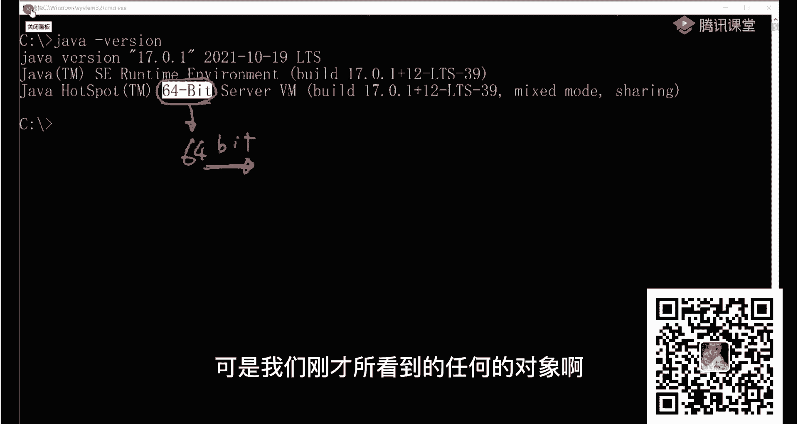

刚才我在给大家演示这个对象大小的时候，大家都看到了我们看到的任何的对象，它的指针，我们说这个指针这个指针是多少四个字节呀，这就开玩笑呢，您您您老人家64位的机器，结果你弄一指针出来四个字节。

这是以前有面试官问过的，why，这四个字节四个byt，为什么好，各位同学，这里是压缩过的啊，这点你要知道这是压缩过的，还有我讲过，我说在t里面，我们看这里啊，没有，我们还是用这个t啊。

三回头来给大家补一点，这些基础知识，因为如果真的问到这里，其实就能问出来你到底是计算机系的，还不还是不是计算机系的，我就这么跟你说啊，作为面试官来讲呢，他判断你到底是计算机专业还还是不是。

就问你这些基础知识啊，t小t等于net，我们说如果t里面有一个string s，各位同学它的长度是多少，按理来讲，您老人家是64位的机器，是不是64位的，加入虚拟机，你这个长度必须得是64位。

八个字节才对，你说对不对啊，同学们，可实际上实际当中是什么样子的呢，跑一下看，它是多少个字节，四个字节看了吗，它的指针是多长，他这个脑袋上这个指针是多长，指向那个class的指针还是四个字节。

ok这玩意儿就就有点有点过分了。

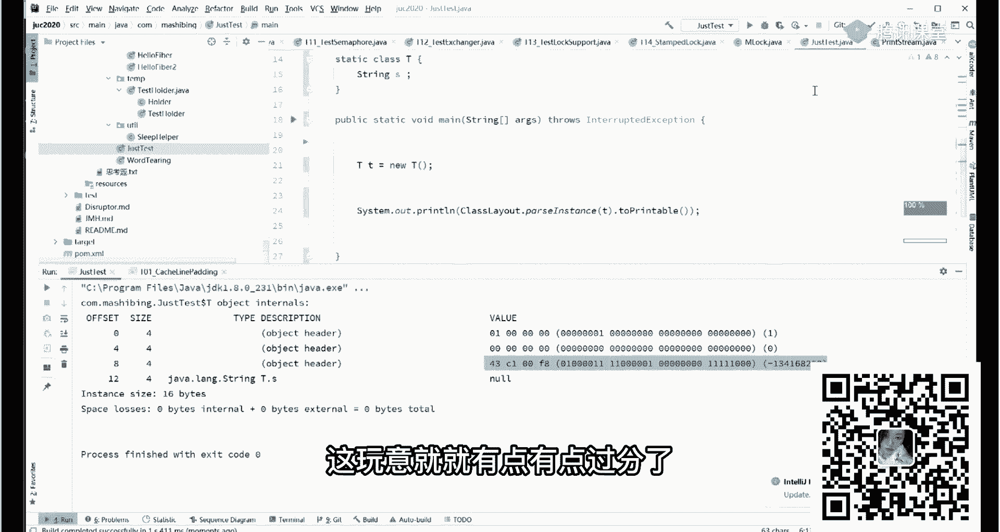

原因是什么呀，原因是你需要理解java里面有一些好玩的参数，我们把这些参数让你给他展现出来，java conversion，要么更，print come on lying flags。

老师的记忆力还可以啊，princeline flags，就是把那个命令行参数自带的那些，全给自己敲出来了。

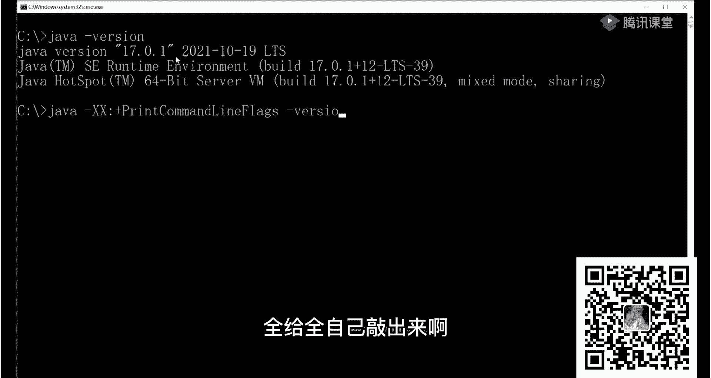

conversion，大家看这里，这里头呢有一些这是java自带的参数，看了吗，concurrengc threads，这就是有多少个gc的线程是吧，一起就11个啊，所以说我们讲这版本启动的时候。

有好多好多个线程启动，这里面我们主要看这两个参数，这里我们用的是g y g c k，我们主要看这个参数，这是其中的一个，这是其中的另外一个这两个参数啊，这两个参数呢就是去。

就是决定着你到底是压缩了还是没压缩在这里，这是它默认的参数，呃这边调优课呢，主要讲这些参数怎么来进行运用，什么意思啊，读一下，理解一下，compressed as sponders compress。

压缩的class pointers类指针类指针进行了压缩。

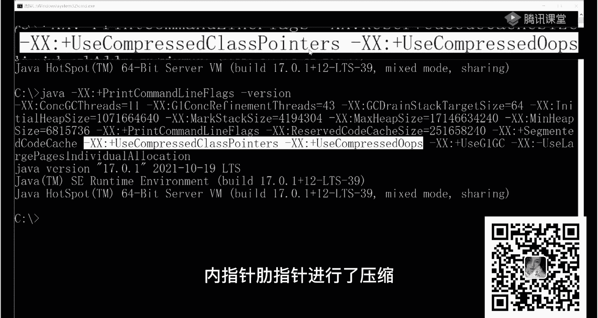

所以我们这里看到的，我们这里，这里看到的这个指针，这个指针它就是四个字节，因为它开启了压缩，那么后面这个是什么意思啊，o p s的全称呢叫，ordinary。

ordinary object pointers，好就不写全了啊，普通对象指针，ordinary object pointers，就是普通对象的指针，什么指针，这个指针这个指针它也是压缩了。

还有同学说老师我能够打开它这种压缩吗，打开压缩呢有两种方式，第一个呢你的内存足够大，就是你使用的内存足够大，你这外面使用内存一般来讲，超过32g压缩就不起作用了，如果你jvm管理的内存超过32g。

压缩自动不起作用，各位听懂了吧，这是第一个一个结论，第二个呢我们可以使用参数来把它打开，我们来看一看参数打开的状态好不好嗯，到现在还能跟上吗，各位兄弟们能跟上老师扣个一来。

就后续我真心希望你们扎扎实实的跟着老师，第一好好训练训练基础，第二呢顺带着把java虚拟机怎么优化，各方面的内容也都掌握住，多线程内容掌握住，这样的话呢，最起码很多很多的那种基础型的大大厂的面试。

你就能搞定了啊，我们我们跑一下这个还是这个小程序啊，我们跑下一下run，我们指定它一下，just test edit，指定他的vr motions program arguments o。

指定他的vm options on gram xx，加号就表示开启，减号呢就表示关闭，等着我们关闭掉，use嗯，impress o o p s，就是我们把那个普通对象指针给它关闭掉好吧。

apply run，跑一下，看，好各位同学仔细看，现在我们这个，我们这个普通对象的指针s变成了什么，自己看变成什么东西了，o，八个字节是不是啊，同学们好，大家看到了吗，看懂了吧。

嗯当然我们可以把这个也打开，这个时候呢我们这个指针就变成了八个啊，这是，一些小小的基础补充给大家听啊，运行的时候再解压缩，是的是的嗯，好这块内容大家听懂的，跟得上的，给老师扣一，下。

面我再问你一个触及灵魂的问题，一个触及灵魂的，涉及到计算机基础知识的问题，这个呢比较难答，我想问你的是，这个压缩的时候是把八个字节压成四个字节，按理说这四个字节它最大能够管理的内存，我再说一遍。

一个四个字节的指针最大管理内存是多大4g，可是我刚才明确说过，jvm什么时候这种压缩它会失效，超过32g才会失效，那这事儿就很神奇了，一个压缩完成之后，只有4g能管理四个g的这么多的地址的。

这样的一个指针，他居然管理着32g内存的，是y y32 g内存之前他都可以用压缩的啊，这个你们自己去实验就知道了，这儿曾经有一个忘了某一个厂子的面试官，问的啊，物质是由原子构成。

现实只允许操作到分子水平ab 8哈哈，虚拟定位说的很对啊，就是说说的很对，说的很对，没错啊，这其实呃这两位同学他都是明白的，说的是对的，仔细听这个很简单，就是说在java里面操作任何的数据的。

基本单位是一字节，一个字节，也就是八个八个位，有时候我一个地址啊，我不4g一个地址吗，二的32次方4g个地址，我一个地址啊，代表着是一个字节，而不是一位听懂了吧，所以这里头呢是4g乘八，一共是32g。

32g内存，32g内存之后压缩才失效，ok，好讲到这里，其实还有一点扩充的知识也可以补充给大家，这块儿大家还能跟上吗，能跟上，我就稍微的扩充一点点好不好，对一些基础稍微好的同学，我扩充一点点啊。

不能跟上就算了，给老师扣个一来，我们看要不要再再再再扩一点，ok好看看多少啊，00976还在听呢，jack夏天铜墙铁壁，这些都是变变变得很久的人，好小柳马上马上成功，大家可能了解就是一个jvm的虚拟机。

它的垃圾回收器呢有好多种是吧，垃圾回收器呢原始的有那个serial serial两种是吧，serial serial，young serial old就年轻代老年代有两种。

两种cereal两种parallel两种并行的，这单线程的是多线程的是吧，然后c m s和他加那个po啊，这两个配合的是吧，这是六种，一共是六种了，这是两种这两种这两种，那么背后呃。

现在我们用的比较多的是g one，叫gabbage，first k g one，那么g one之后呢，我们又又有又有两个是吧，这这两个分别叫叫什么名字，大家知道吗，叫shannon da，谁能懂。

这东西是一个那个美国一个公园的名字啊，还有一个呢叫zgc，这个呢是下一代的垃圾回收器jdc好，还有一个是什么，还有一个是appellent，这东西是用来做测试用的啊，这个用的很少，大概一共有十种。

在这时钟里面呢，下一代的垃圾回收器，就是它z dc效果效率非常非常高，高的原因在哪里，他在指针上做文章，大家知道64位的指针，它可以寻址的空间极大极大，实际上是用不完的。

后来呢整个jdc是在64位指针的基础之上，一共用到了48位，在启动在这个基础之上叫颜色指针技术，叫color red pointer，color red pointers设计了非常漂亮的垃圾回收器啊。

这个垃圾回收器呢color pointers 64位的这种指针，其中用到了其中的四位o很好玩，总共用到了48位，实际上没有用用用特别多啊，如果大家会有兴趣，可以去钻研一下。

向面试官展示你知识面的宽度深度，以及你对技术的好奇心，好吧，cdc会大面积普及吗，我这边m调优不是白学了，在你普在大面积普及那一天，你也没有白学，好多时候你能讲出原理来，讲出历史来。

在面试官的印象要比别的人要深得多，大家可以去研究一下那个color pointers，那里面又牵扯了很多底层的这样的技术，挺好玩的嗯，细节我就不展开了，因为这块的话呢，估计大多数人是不了解这方面知识。

以后都用这个k 11了嘛，这无所谓，看你们用什么，好那个我今天的技术内容我就聊到这里好吧，昨天呢我也给大家介绍过咱们自己的课程，咱们课程呢还是那句话，是从零基础开始，从零开始一直到百万年薪的水平。

在一两门课里有所体现，一门课呢是入门，就是整个课程的，其中有门课是入门，就是java后端工程师啊，这里面呢适合小白，刚刚入门的同学入行，这里面是最大值，在里面集合里面我可以给你调最小值。

这样的入行的话呢，你会非常非常的快啊，快速而明确，在入行之后的提升呢是另外一门课，这门课呢叫架构师呃，在这个教育师课里头呢，整个内容呢大概100多门课程啊，我们教这100多门课的时候。

也并这是一个最大值啊，还是那句话，我提供给大家的是最大值呃，真正你学习的时候呢，可以先挑最小值来学，再慢慢进行体系化学习，这是我所提倡的，先赚了钱，涨了心，跳了槽进了大厂，然后呢。

在真正的慢慢的跟老师进行体系化的训练，你这时候你会发现，你后面的职业生涯会越走越好，越走越强，这个这个学习路线呀，这个学习路线呀我也给大家展示过啊，崭新的学习路线是吧，这也是比较全面的学习路线啊。

你像在这里面的话，老师给你画好路线之后呢，你就可以挨着牌的一条路线，一条路线的一门课。

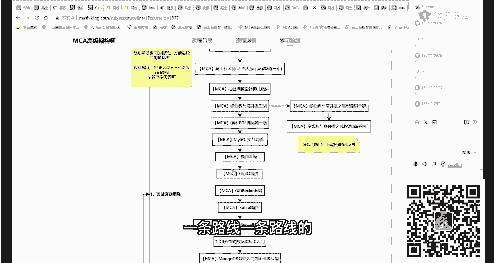

一门课的跟着往前走啊，操作系统是吧。

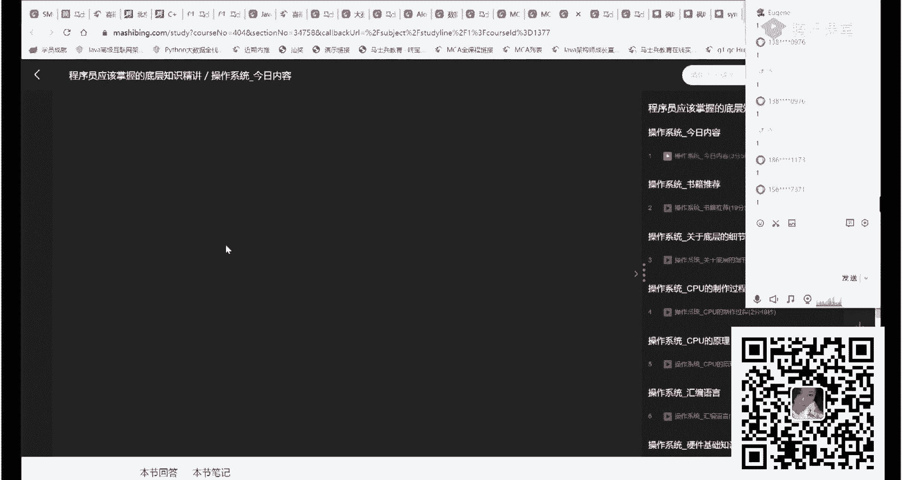

你像，呃这样的话呢就会能做到，咱们的学习效率比较高，高到什么程度呢，绝大多数的同学寻求涨薪的，三个月之内就搞定了，寻求入行的3~6个月业余时间就搞定了啊，如果你要想快速入行的全身心投入的话。

有可能是两三个月就搞定了，这就看你每天投入的时间，因此呢不要看咱们课程多，课程多呢给大家的素材多，但并不意味着你要把所有东西一口气全学完，一口一口吃台阶儿，我们一个一个卖，慢慢的。

我们迈向薪水比较高的那个台阶上去就行了，vip课呢目前有直播和录播两个部分构成，我们直播完成的东西，它就一定会形成录播课，我们直播的内容，大家也可以在咱们的网站上直接查询呃，直播课呢向大家负责任的讲啊。

后面由于是那个端午节，所以这个呢今这周的直播课会相对偏少，但是你看上周的直播课，你就会发现咱们直播课的内容超级多，那个我们直播课的内容大概相当于其他机构的，至少是三倍以上，直播课完成之后会形成录播。

避免有同学你错过之后呢，唉没有办法再继续学习这个意思，所以是直播加录播嗯，这是咱们整体的课程的量以及课程的特点，定制化呢是咱们最大的课程特点啊，呃因为这样的话就能实现每个人的情况不一样。

那么他的学习路线就完全可以做到不一样，他的学习效率就和其他人比较高很多，如果你在线下学习，咱们内容全是一样的，我学这个，我明天讲这个，你听不了，别的线上不一样，我想让你听哪一块，你可以优先听哪一块。

这是线上所带来的好处，而且在我们大量的素材的前提之下，我可以帮你定制各种各样的快速的路线出来呃，在这里呢在咱们的整个细胞里呢，大家自己去可以也可以去了解一下，绝大多数同学啊，三个月搞定快的话。

学了半个月涨薪10%，10%，虽然不多，在疫情的情况下学了半个月而已，也还可以吧，俩月原公司涨薪4k一年5万多也还可以吧，这是学的时间比较长的，十个月薪资从10k涨到17k，1年涨了8万多。

这是学了俩月12k offer继续提升，刚入行的应该是，这是毕业半年让他涨薪涨了50%，这是花旗和微软的两个offer，这是面面试突击的课，跟着咱们学完，年薪涨了6万啊，整个课程内容的话呢。

从咱们入行开始，到很多人不愿意讲的这种底，非常底层的基础的内容啊，好多机构其实不愿意讲这块，因为它很枯燥，但是它又很重要，它是我们的易筋经，是我们基础中的基础，尤其是关于算法这块，关于算法这块。

这是这只是入入门级别的整个算法的内容啊，在咱们整个课程体系里面也是很大的一块，那个算法这块呢是咱们嗯左成云，左老师啊，大概呢讲了九个阶段，不能这没有点开啊啊，小姐姐们帮我反馈给咱们的技术，这块没有点开。

我不知道是什么情况，我我直接反馈吧，反馈一下，诶老师你看一眼那个数据结构和算法，那个大纲那里面的那个图片是点不开的啊，阶段一阶段二，看一眼，看一眼技术那个是怎么是怎么回事，呃算法内容是咱们的重中之重。

这里面大概包含了新手班的学习体，系班的学习，然后刷题班的学习面，常见的面试题呃，精品这种高频的面试题啊，算法的押题的内容基本上呢，每周啊基本上都在更新，这是咱们正在更新中的是吧，4月第四周嗯。

5月第一周，ok这些都在更新之中，好，呃有了这些内容呢，就是底层基础你会打的比较牢靠，当然了，还是那句话，就是说在你时间不足的情况下，你也可以先补补这些知识啊，老师可以帮你找到一条。

比较快速的升职涨薪的路线，然后升值展现完之后呢，再慢慢的进行你的基础化的训练，今天讲的很多内容呢，是来源于咱们并发编程的部分啊，大家打开大纲自己去进行查询，rpc的通信原理主要讲jk double。

然后消息中间件我们主要讲rocket卡夫卡，poser rabbit，active缓存的中间件呢我们知道叫memory catch和redis，软件设计的基础，u ml设计模式，软件工程的发展。

高并发相关的分布式的架构的实践，高并发高可用的部分啊，e t c d h a proxy key lives zk，通信和调用呢我们主要讲这个restful thrift，nt double。

缓存中间件主要讲redis存储中间件比较多啊，fs dfs，ht，fs mango，tedb neil否认ob click hospute等等呃，分布式锁各种实验方式，分布式事务，各种实验方式。

链路追踪的实验方式主要是step walking，预警监控，普罗普罗是吧啊，ok其他的各种分布式的东西，这个完成之后，我们主要来聊回复，两大体系，微服耐飞微服，阿里巴巴啊，这个完成之后呢。

我们主要来聊系统的性能优化，这是你简历中呃增光添彩的一方面，jvm调优，mysql调优，tomcat调优，alex调优是吧，高并发大流量的服务的调优的实战案例化，海量数据的处理存储搜索。

我们对于大数据这部分啊，e l k cloudoris啊，new ycle had to flink，这些网络基础设施建设运维层面，我们主要讲dns相关，cdn相关啊，全球同服的问题啊。

多级缓存资源静态化落地的问题，服务保障device，现在我们开发开发之中，所应用的最多的开发模型，软件测试的部分赠送大家一期一期课啊，only one service mesh呃。

如果你用go语service mesh是经常使用的，用来实现微服务的方式好了，这块呢就是咱们整个的基础点的内容，搞好技术点之后呢，要学会下一步的设计过程，指挥技术点，不会设计不行，好去聊理论基础。

去聊基础算法，去聊原理和源码的剖析，这块是你跨越落地奔向设计的要跨越的一，一站在这个基础之上，学习设计理论，高性能的架构，怎么设计分流，怎么设计并行并发，怎么设计缓存，存储可靠性，怎么设计。

应用保护怎么设计，在这个基础之上，再用各种各样的案例来帮你做实践，电商秒杀怎么设定红包，怎么设计微博互关百万级的并发，这种票务的联网系统，12306怎么设计弹幕系统，全链路压测的方案的设计。

零零丢失保护方案的设计啊，大数据相关的各种设计专题等等等等，最后我们用亿级流量这样一个完整的项目，来让大家完成一个比较完善的互联网，三高级别的架构师设计啊，这两个完成之后呢，基本技术方面你就搞定了。

好吧呃我不能说到头了，但也差不多了，在这些基础的基础之上呢，我们去学习云原生相关的啊，这是我们未来架构的重中之重啊，现在呢全球来说就是不管是大中小，各种各样的厂子都在上学，原上没有不上云原生啊。

从各种各样的那个软件及服务是吧，基础设施及服务平台及服务等等，一直到后端及服务啊，b a s云基础云架构容器容器的编排监控，devops持续集成，core sphere。

easter terrifensable，公有云，私有云到混沌工程呃，这种东西呢可以这么说，在中小的那种城市里面，二三线城市里面，你可以吊打很多人还掌握不了呢，常见的半个处理专题。

这东西呢主要是提升你们面试的时候的这种嗯，技术水平，说出来的内容比较高大上，薪资会比较高，那么从技术角度再往上就是要进行团队管理了，咱们的皮班老师，他是原来的真正的p8 管，100多人的。

教你怎么进行大型团队管理，咱们的p9 老师，原来是管理200多人的p9 团队，ok教你怎么运用产品管理好吧，ai送大家一个入门，这样大家做一个入门，ok中台的构建领域驱动d d d带大家学习好。

学习好啊，好整个技术的体系我就介绍完了，除了技术体系之外呢，我们另外的就是项目体系，项目体系就不一一介绍了啊，就是咱们可以写在简历中的项目非常多，解决大家伙你简历中项目没得写的问题，两大项目介绍给大家。

第一个呢是咱们飞机出行新版的2022，从项目的介绍，组织方式，整体设计开发规范，整体的技术栈的选型，到用户端到api的服务层，到service的服务层啊，各种各样的服务，健全订单消息网关地图等等派单。

然后到项目怎么测试，到项目怎么部署，怎么扩展，再教你项目怎么怎么拿这个项目去面试，如果以前只有c r o d传统项目的，搞定一个飞机出行，互联网级别的高并发的项目，你就有经验了，那么第二个呢。

是我们自己现在正在对外运行中的，你可以直接下单的啊。

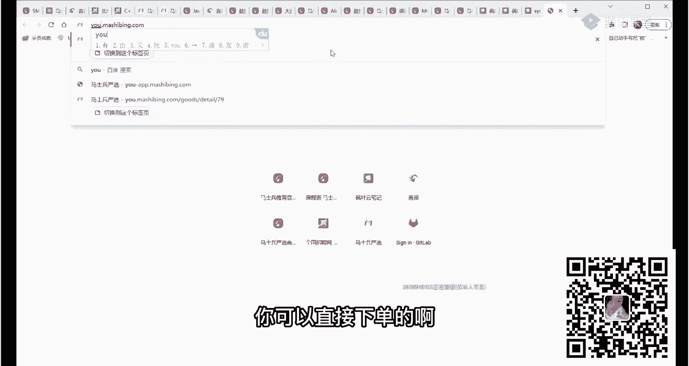

咱们的马士英严选，在咱们的严选的里面呢，又是一个大概老是投入了呃，不到30个人吧，前后啊，前后不到30个人，为大家研发了这种大型项目架构，这这这个课是一个真正的呃，开发出来也在实际当中运行啊。

你也可以了解咱们整个后台架构，也可以在里面下单的真正的一个项目，也有咱们的pc端，也有咱们的h5 端等等，严选的商，这个咱们严选商城来讲的话呢，内容呢牵扯内容会更多一些啊，有各种各样的内容会更多一些。

我建议大家要过去，因为你会读到一个完整的稍微大型一点的项目，它到底具备哪，是哪些团队来做的，是由哪些技术选项，要选的是由哪些架构要构建的，从前端架构到后端架构，到运维架构，到各种中台的设计。

到应用架构的设计原则，容容量怎么估算，服务怎么设计各种的服务，然后到中台怎么设计到测试，怎么样进行自动化的测试，怎么性生成报告，怎么进行微服务的治理，怎么进行链路的追踪，怎么进行可视化的监控。

怎么进行容器的管理，好吧，怎么进行多租户的管理，包括我们开发的整个过程，开发运维的一体化是怎么实施的，ok呃我们搜索的过程ef k是怎么完成的，项目的规范是什么样子的，呃读完这个白皮书呢。

你可以自己带一个小团队尝试，就可以自己带小团队了，ok至少能你读完之后呢，别人问你，你说你们项目有多少人，你在里面做哪个哪个哪哪哪个东西，你能够完完整的说得出来啊，这是咱们的一些技术的选型啊，前端的。

后端的，pc端的h5 端的后台管理的，后端的架构的嗯，水同步用什么配中心，用什么网络用什么，然后这个是咱们后端后台的那个整体的运维架，构长什么样，这是咱们自己进行的飞马系统的框架设计，可以用。

大家也可以直接拿去用，我们也是准备开源的，这是咱们后面的架构的设计是怎么做的啊，这是咱们中台的设计，这是咱们i m的中台，这个是支持上亿级的那种并发的i m啊，它不是一个很小的就简单的聊天系统啊。

那个是拿不拿不出手的啊，这是咱们支付中台是怎么设计的，ok搜索中台怎么做呃，很具备参考性，各位同学可以拿去直接应用。

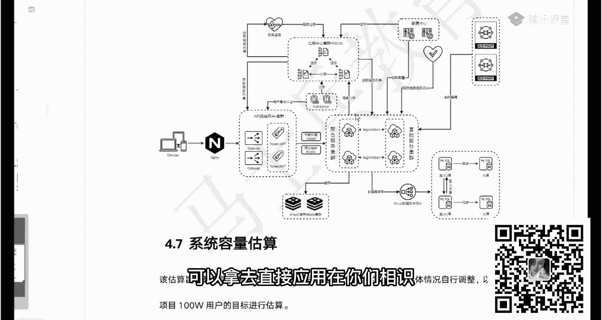

在你们现实现实项目里，我们直接把它放到网上。

你们下单也好，或者是学习也好，都可以拿来用好吧，ok，整个大概的这个内容的介绍就介绍到这里啊，最近呢咱们在搞我们的报名活动，典，报名的同学呢可以享受咱们的抽奖，一等奖是苹果板，二等奖是iphone。

三等奖是pad，四等奖是无人机啊，五等奖是曼卡顿音响，那么，整个课程呢呃还能享受的其他的一些优惠，呃，我觉得一门好课，给你带来的是你的整个职业生涯的颠覆式的，你收到的收获和收益啊，这个是很大的啊。

各位同学可以从咱们的就业里面，能够找得到这其中的蛛丝马迹，这里面呢没有任何一个聊天记录是给你p过的，只是隐藏了一些隐私信息，没有任何一个聊天记录是假的，好吧，你像，三个月入职涨薪70%就学了仨月。

一般情况下想涨薪的话，三个月足够啊，除非你水平特别差好吧，可以优惠几千吗，问咱们小姐姐吧，ok，现在有的公司是不是都拆中台了，有的是这样，但中台这个概念呢，其实你也不要把它想象成是一个。

你可以理解为我们中间的一层api层啊，你不要把它完全理解为说，马云原来提出的这种中台概念，那个是好多人都拆了啊。

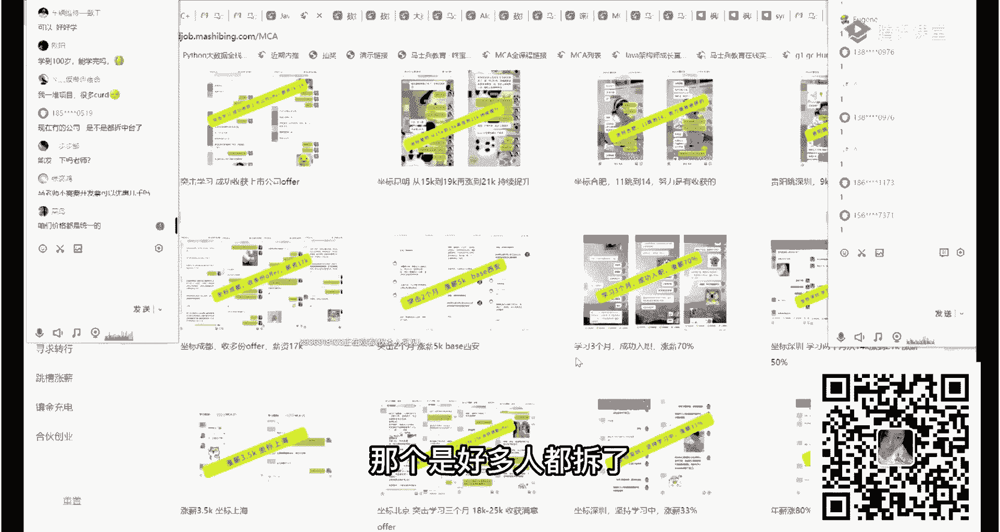

这是应届生嗯，欧克原料14x18。

呃各个层面跟咱们学的同学，其实最后都得到了他们想要的结果，干哪种类型的项目对自己提升比较大，马士英严选这个项目要要完白皮书，你就知道了，你把它搞完，上上次有一个同学就是说搞完这个项目啊。

他突然间发现了他所有的全通了，就是所有知识全通了，你能理解这意思吗，如果我们平时学的某一个点啊，redis卡夫卡啊，spring spring mvc，什么mysql等等，这些都是一个零件的话。

你会发现咱们严品项目把这些零件全穿起来了，穿起来了之后呢，你会有那种感觉啊，就是有那种一体化的感觉，整个知识体系全建立了，然后再去看这些知识点的时候也就比较通透了，所以呢项目驱动很好的学习方式啊。

推荐大家使用，我咨询小姐天天睡到下午才起床，回信息，因为咱们咨询小姐姐，每天晚上12点之后才下班，所以咱们是下午上班，这个是哪位小姐姐，你可以再找她一下，你专门在这里，我专门跟她说一下好不好嗯。

最晚报名，明天抽奖，明天晚上是咱们抽奖的最后一天，明天晚上咱们周年庆典的活动就结束了，大家对于技术也好啊，我仅仅讲到了各种各样的技术，或者对于工作形势前途，职业发展课程有任何问题的，我们聊会儿聊天儿啊。

咱们准备11点吧，好吧嗯，物联网是不是不怎么好，不是不怎么好啊，就物联网呢他也是一个很大的行业方向，它里面的需求的人也挺多的，嗯物联网的多数是跟那个什么有关系呢，嵌入式跟这个关系比较大。

呃他的薪资呢确实不会像互联网后端这样高，他是这个意思啊，但是也谈不上说不怎么好，所以你得定一下，你这个不怎么好是什么意思啊，没有什么不怎么好的，挺好的啊，我们前20名报名的同学呢有500的返现。

有咱们白金的vip卡，这我稍微介绍一下啊，就是说有这张卡的好处呢，在于咱们后面的升级的内容，ok你可以用很小的代价就可以听，呃，你像我们目前每年升级的内容，目前每年的升级的内容呢大概是几百个小时吧。

几百个小时后面还会多啊，还有好多好多其他的内容啊，文字的内容，音频的内容，视频的内容都会有，像刚才给大家看到的直播啊，或者说咱们的科研更新，你在这里都能看到，就是说我们有哪些更新计划，什么时间再更新。

什么时间再更新，哪些的更新都在这里写的非常清楚，就是咱们更新的内容呢，有了张白金的vip卡，你只需要付一个流量费就可以听了，什么叫流量费呢，大家都知道啊，就是我们现在对外提供的这个平台，我不知道大家。

你很多人学习课程是在咱们手机上，手机上下载咱们的这个，app啊，这是咱们app，你下载完成之后呢，直接打开点开课程就可以学，比如这个鸿蒙鸿蒙的基础课，鸿蒙克是吧，嗯打开来。

再看这里你直接就可以进行学习啊，那么这个里面呢是我们要付给那个嗯云厂商呢，呃流量的费用啊，我我希望你每年负担一个流量的费用，老师呢就可以把课程免费的送给您，能理解的意思吗，就是咱们更新的内容啊。

你付一个100多块钱的流量费就够了，1年，马老师，请问张一鸣老师为啥不讲了，您得问张老师去啊，张老师有他的想法嗯，老师鸿蒙有前景吗，我认为有前景，但这东西呃预测未来是有风险的啊，我比较我喜欢啊。

我喜欢鸿蒙挺好的，因为当你到达某个层次之后，你会发现所有的东西，所有的脖子都在别的国家的手里头掐着你，你会非常非常非常的难受，我告诉你啊，我觉得任何一个系统，哪怕他现在不是很成熟，不是很好。

只要能够愿意打破这种垄断，我就喜欢去推广它，所以很多那种培训机构没有的课，这里有一堆，主要是咱们老师的一些情怀，那个从mc体育课里面我就能看出来一些啊，就说有一些课呢，你可能听都没听说过的。

比方说我刚才跟你讲过java语言和go语言的区别，他者的区别呢，是携程，但是java里面有没有携程的解决方案，当然有java里面携程的解决方案，colin的自带那个kim，阿里就用过用它来做解决方案。

这是我专门请的，阿里用kim做过解决方案的老师讲给你讲的，其实从这你就能看出来，就是老师选课的时候，一个就选老师也好，选课的时候一个讲讲究的程度，我毫不夸张的说，很大多数机构做不到这一点。

因为呢我我我是能够动洞洞察到，就是说我们需要哪些东西，你有可能会需要将来流行的地方，到底是有哪些提前的，就帮你把内容准备好了，kim是阿里的，这个以前用携程去做一些高并发处理的时候，使用过的解决方案。

好吧，这里面也有携程，你像整个mc里面，我们为什么要讲go浪，各位同学就mc叫架构师，架构师实际上是跨越语言的，后面呢我是想把整个架构师的呢，慢慢的升级成为java加go双语架构时。

这些个升级对于咱们现有的报名的同学来说，是免费的啊，当然我们真正升级完成之后，我们整体的课程价格是一定要往上调，一调的内容变得越来越多了嘛，嗯呃也就你也就不用再纠结了，我是走java还是走够了，没关系。

我一个课里都给你包含了啊，你选哪个，看你实际当中需要哪个，ok这个还可以吧，觉得还可以的，老师扣个一来认可一下是吧，打个牛逼出来啊，双语架构师啊，我们准备要退出了，也就嗯。

计算机语言一点不懂内容来学java吗，你原来所有人都是从不懂过来的啊，没学历寸步难行，没学历补学历啊，你学历差到什么程度，中专初中大专感觉白扯了，大专是绝对够的学历啊。

但是我个人虽然我个人提倡你还是要补到本科，但是大专学历，在很多时候呢，其实是已经非常非常的完全够了的，这是菲律宾从大专那边转成java的，涨了7k还，这是大专二线城市薪资直接翻番了。

这是大专，武汉四个月涨了7k一对啊，19年大专毕业生跳槽，直接涨了5k大专的应届毕业生，直接让他拿了21k能想象吗，这就是咱们的课程啊，非全大专一样的啊，这个大专本质上都差不多啊，就是不是非全没有关系。

你既然学了非全大专，我就建议你再补一个非全本科，听懂了吗，大专你好一点的，甲方费劲，这个呢是你的技术不行，不要怪学历，给咱们讲那个bug课的就是一大专生，他原来在京东，现在新浪，你跟我说费劲。

只能说是你技术不行，java python都学时间够吗，没必要都选一个架构师呢，了解语言的特点，带领下面的团队就足够了，没有必要把所有细节全掌握，逍遥说专升本没有学位证，大厂可以进吗。

本身这个是这怎么说呢，就是说你有些大厂是不在乎的啊，但是说你的技术得特别特别大的，比比其他人强才行，就是我一个很粗浅的例子，一个是大专生，一个是本科生，如果你们俩的水平是一样的，那我一定选本科。

比如说你的这个水平，一定要高于这个本科生的水平，你才有自己的竞争力，能听懂吗，所以付出自己的努力啊，有有一些大厂是并不在乎你的学历的啊，比较典型的京东阿里都不是很在乎你的技术，非常到位的情况下就可以。

厉害想知道他们的成长经历，这是逆袭，没有什么成长经历，跟着我们学课程，把基础锻炼好了就成了呀，你搞技术的，你只要把技术锻炼好不就完事儿了吗，嗯阿里学历差的别人不行吗，听不懂你在说啥。

我有好几个学生专科实践的案例，但是筛选简历根本不行吧，除非内推，我们所有的国内的一线大厂都有内推，前提，你得水平够，你不要跟我说，那我水平不够啊，我又是专科，你就得给我内推，那不扯淡吗，所以呢学历不行。

技术来凑啊，赶紧你，你如果学历不行，技术又不行，我不知道你的长处在哪里，别人为什么要看好你，多大岁数就不建议学，一般我是建议32岁，如果你还没有入行，就不建议入行，不一定对啊，这个只是个人的一个看法。

只是我现在补了本科挺好的呀，补上，我们明天明晚就抽奖了啊，今天晚上可以说报名的最后一个晚上了，大家走过路过，不要错过我们这次最大的活动，这次活动一定是他的力度，是超过咱们618的啊。

这个是给你一个承诺啊，不会比618的活动的力度更低啊，不会有科大讯飞那推岗吗，还真有啊，这个由咱们的严老师直接可以给你推进去，杨老师，原来科大讯飞出来的，他选妃本身不是个特别嗯特别牛的场子。

