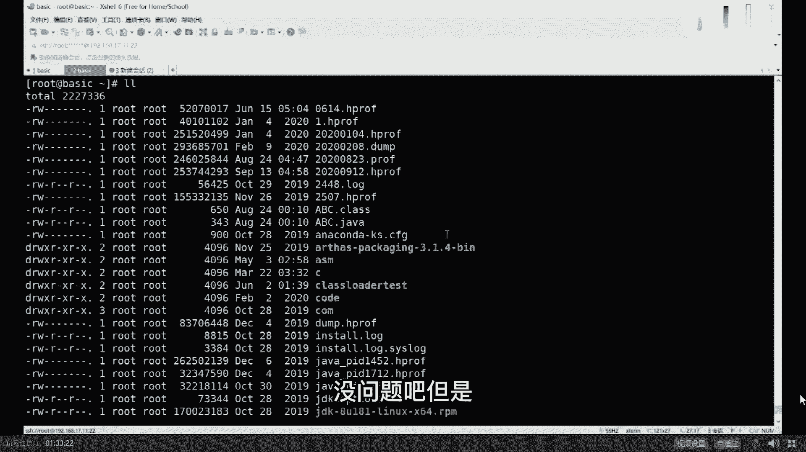
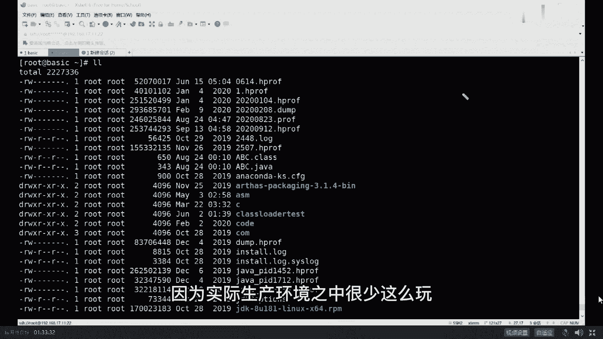
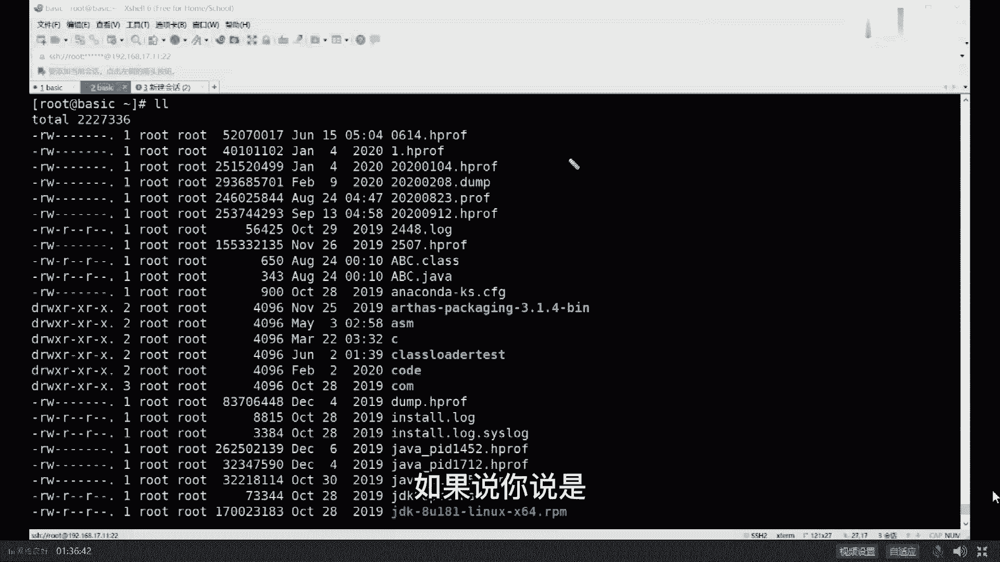
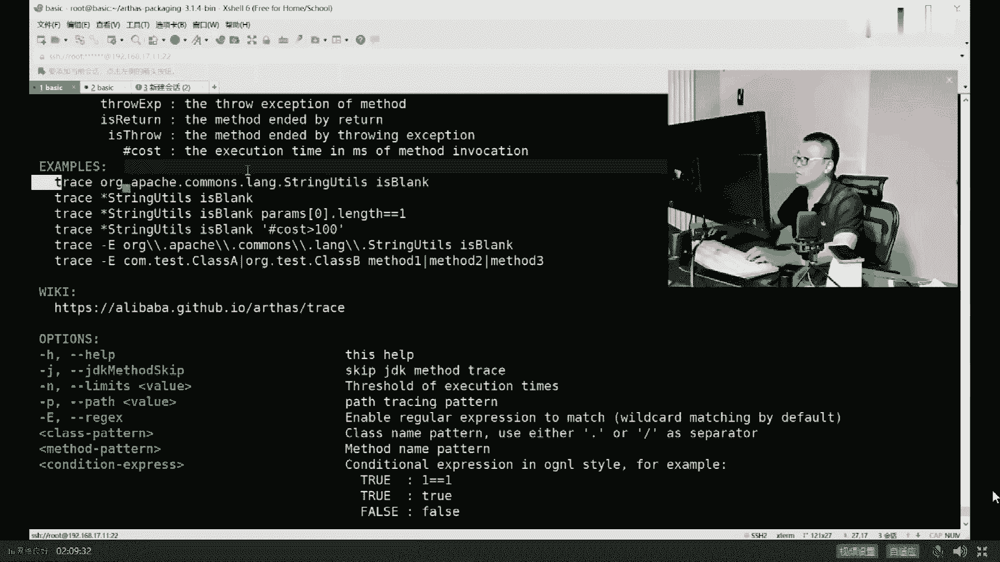

# 系列 6：P42：JVM调优实战（下） - 马士兵学堂 - BV1RY4y1Q7DL

for slb，摘下来执行，good不错，还有一种说法是什么，来的访问，复制一份，复制到备份机，在备份机上执行，good不错，测试环境压测的执行。

good的不错，都可以get了吗，我们来看第j map。

第二个命令，第二个作用，好看这里，那么gmap的第二个作用，我先把我的头像拖出去，再看这里，in g map，第二个作用是什么呢，第二个作用是它可以用量来写dump。

format等b就是binary 2进制类型，产生一个dump文件，file等于刚说就今天是2020年9月11号，20200912点，h profi，后缀名无所谓啊，后缀名写什么都行。

这是产生一个我们整个堆内存的转储文件，然后呢来对它进行分析啊，然后后面跟我们的id号id号是什么来着，11988是吧，11988我就好了，他这时候开始把堆定转储产产生完了啊。

这是我们新产生的20200922的h方法，好听，我说一句。

这个堆专注文件的意思是把java的整个堆，整个堆。

jvm的整个堆导成一个文件，然后下面可以你对这个文件进行分析。

对这个文件夹分析的时候，就完全可以使用那些网上。

你们喜闻乐见的各种工具了，比如说图形界面的jvo vm。

这是jvo vm，嗯你你你你打开文件啊，装入，你就直接把那个刚才那个文件呀，给他装入进来就可以了，这种的profile给装进来好吧，然后呢装置进来之后呢，你找到内存，找到抽样。

然后你就观察出来到底是哪些个，你对象来占的内存比较多，你就观察出来了，嗯这是一种好吧，这是第一种，有同学说了，老师这个jvr vm我没接触过，这是java自带的这东西，这东西用我说吗，这都用我说吧。

不用吧，不用不用啊，很很很简单啊，这是java jdk自带的好吧，说两句，我同学实在是基础太弱，你基础这么弱，我就没招了，简单跟你说两句吧，你你就是你java装完了之后。

jdk binary里面你找到这vo vm，就是这个图形界面的工具，这图形界面的工具呢它也比较强大，它呢除了可以观察你本机的这些id之外，也可以装入用文件来观察。

也可以干嘛呢，也可以远程来观察啊。

比如说这是你linux服务器，你也可以用一个gb ram远程连接去观察它。

这也是可以的，这也没问题。

然后你就可以对它进行分析，分析完之后你也得出结论了。

原来是cut inf那个类太多了，依然是这个结论，没有什么其他的好吧。

然后下一步查你业务逻辑，查业务逻辑，别人就替不了你了。

好这块内容讲的稍微快了一些，来能跟上来扣个一。

因为我觉得这个比较简单，没问题吧。

但是但是。

我讲这么快是有原因的，因为实际生产环境之中很少这么玩。

原因是啥，你往外导文件依然会产生卡死。

会让jvm卡死。

你能让你随便倒吗，不能。

所以这就涉及到，你什么时候才能把这个文件给拿到，生产环境里头的第一件事儿。

好好听我讲，生产环境第一件事叫做设置好你的启动参数。

这个启动参数啊。

包括这个参数，hip dump on out of memory era，就是当我们启动的时候，一定要把这个参数给设置好，这个设置好的意思是什么呢，就是hp down什么时候产生oom了。

什么时候它会帮我自动生成堆转储文件，再说一遍，什么时候你的内存爆了，它会自动帮你生成一个对准储文件，dump文件，这时候你内存爆了，相当于你java进程已经死了，这时候就没关系了。

把你的文件拿出来做分析分析的工具，特别我呢跟大家说，我jv vm jdk自带的jhg命令行的eclipse，带的mad完全也可以，还有其他各种各样的工具都可以，刚才有同学提到gc easy。

那是读日志的，跟这没有半毛钱关系，好了，同学们这块不知道我说清楚没有，所以你在生产环境之中，你说我用jamap导的不对，这个事儿不对，这是第一个，第二个，你跟面试官聊的时候，说我远程是linux。

我用jvm远程连接上去，这事儿对吗，能这么说吗，告诉我一下这console也可以远程连接，这比如vim也可以远程连接，这profiler收费的也可以远程连接，你要跟面试官说。

你说我在生产环境之中，双11那机器人在那玩着呢，我上一个g b u v m去观察它完蛋。

面试官估计一个大嘴巴子抽上来，不哪凉快，哪呆着去搁哪学的吧，你出门右转啊，拜拜。

听我说一句，在生产环境中的机器，一般情况下除了运维之外。

尽量不多开任何端口，但是你如果用远程的这种图形界面去连接它。

sorry必须得开各种各样的端口，产生各种各样的安全问题。

另外呢它会对性能造成一定的影响，大概性能会下降10%到15%。

因为它需要不断的对vivo j vo vim往外传。

我每一个对象的状态。

好吧，所以这是不行的。

还有同学说了，老师，那我人家面试官问我，我是怎么查出来的呀。

我该怎么办呢，好听我说一句，如果说你说是图形界面的工具观察出来的。

也可以，什么情况，比较牛逼的说法是我是在压测环境里头，压测的时候好挂一个上去，远程观察，这个没问题，这是第一种说法。

第二种说法是我们机器做了负载均衡，我们发现程序有问题之后，我把这台摘出来。

从负载环境里头摘出来，我把它的堆转储文件导出来好。

这个也没问题，very good。

这是第二种，第三种。

由于双11的或者是什么样的，这些个从互联网过来的连接特别多。

我用tcp dump这个命令给它复制一份，一份打到我们的生产环境里头。

一份打到我们测试环境里头。

我们用测试在测试机上做观察，good牛逼，说明你不仅懂负载均衡。

你还懂tcp弹吗，你还懂生产环境里头这么调优的手段。

好了，50万给你了，供给内。

呃我说清楚了吗。

tcp吧，sorry，tcp copy吧，tcp copy，sorry啊，不是不是。

tcp down，i'm sorry。

super king，这是50万必备的技能之一。

反正不是你那摁电源好吧，super king。

你要摁电门，那个你别说50万了，5000都嫌多。

哼哼哼哼哼，super king啊，好嘞。

我们可以继续了吗。

但是呢在这儿我今天给大家介绍的并不是这个，我今天给大家介绍的是阿里开源的工具，这个工具很有名，目前用的特别多，这个工具名字叫做阿阿尔萨斯，叫s好听，我讲啊，作为asset来说。

是阿里开源的中文文档的工具，今天呢我带大家用一下，但是我不想带大家安装了，这个没问题吧，我不想带大家安装了，安装你们自己去玩，我让他跟着讲，安装就没劲了，好作为阿尔萨斯来说。

下载下来之后解压，解压开之后得到这个目录。

进到这个目录里去，我已经进来了，想执行它的时候，执行这个站文件就可以，它有好多种启动方式，这是最简单的java杠，这office杠boot要站回收，达到启动之后，它会自动地寻找。

你当前机器里面的那些个java的进程，目前呢只有119988号进程，在它的阿尔萨斯的内部编号里头叫做一，所以你调一阿尔萨斯，尝试着把自己挂到这个进程上，可能挂不上去了，因为他已经死了，重新起啊。

挂不上去了，稍等卡屏了吗，卡屏了吗，我还在吗，还活着吗，你们还在吗。

你们还活着吗，一输but an。

重新启动，我们重新挂一下，嗯ok，重新启动了小程序，我们在阿尔萨斯里面挂上它。

回头当你看到这个输出的时候。

说明阿尔萨斯已经正常的挂到了。

我们这个进程程，这个进程号是12202，这块能跟上吗，就是在我们整个系统里头，这是一java进程，阿尔萨斯的进程，在这里阿尔萨斯挂到这个进程上，然后对它进行观察好了，可以继续吗。

下面我来介绍阿尔萨斯它的一些个功能，这个不会s t w这个性能上会有所降低，但降的不多，至于会不会s t w的歌，取决于你要执行什么命令，阿尔萨斯完全可以替代我前面敲的，基本上能替代我们敲的所有命令。

而且他比较直观，大家看这里234他有好多命令，如果你不知道的话。

你就叫help就好了，help。

他有这么多命令，help key map，i c s m class。

loader，j d st，七八糟的好了，同学们。

在这些命令里面，我教大家几个，一个叫dashboard。

这是最常用最简单的一个命令，dashboard仪表盘回车。

他用命令行底下模拟一个仪表盘，在这里面它基本上综合了top那个命令和top gun，hp命令，以及这inf命令的一个组合，在这你能看到你的整个进程里面有哪些个县城，有哪些线程在吃cpu，线程。

吃cpu的都都放在最前面，然后线程的状态是什么，接下来内存占了多大一点，区占多少，survivor占多少，老年代占多少，非堆内存占多少，这些都是常用的一些参数的信息嗯。

所以这个一个dashboard搞定了，很直观，最关键的，最最好用的是，这个就是到底哪个线程在吃内存啊，吃cpu，你如果用jdk和top gun h p组合的话，你得来回的换算，因为他哥俩啊。

一个是十进制，一个16进制，我跟你说，这哥俩你得来回换算，但是你如果用阿尔萨斯的话。

直接一观察就知道了哦，原来是52号线程，它的线程名字叫pro 1 threat 39。

他在吃cpu，不知道大家听清楚没有。

嗯好这是第一个命令，我们继续，除了这个命令之外。

还有一些什么命令呢，help，看这个命令hdmp还用我解释吗。

这命令mod是吧。

hip dump替代谁的，替代哪个命令，能不能告诉我jim map是吧。

这太简单了啊。

hp dump，okay，take map对好。

还有一个命令叫thread回车，它会把整个你的进程里面所有的线程全给你。

列出来哪个线程吃cpu最多。

最关键，这个工具有一个特别牛叉的地方。

thread一条杠，help呃，第一个呢他的帮助非常的给力啊，完全有中文版，这虽然这是英文版啊，但它是完全有中文版，另外呢它有好多好多这些examples，你都可以直接拿来用就行了，特别简单。

来教大家thread里面最常用的一个参数，这个参数叫杠b看一眼这什么意思，读一下thread钢笔的，include blocking thread，啥意思，find thread。

who is holding a log that blocks，the most number of threads，啥意思啊，对查找死锁，查找死锁，你像我教你用jdk的时候，你还记得吗。

jdk如果你要观察死锁的话，你得去观察每一个线程，它是不是wait在同一把锁上，为了好长时间，这个时候有可能会产生死锁，你也会检查，但是阿尔萨斯里面一个命令就可以搞定了，直接敲，400钢笔，当然了。

我由于我们这个线程呢，我们这个程序它没有思索，所以他找不出来，norma blocking three f，如果是你自己故意写一个搜索程序，你用这个来观察一下，一把就给你找出来，好用点赞，可以继续吗。

还有一个名叫jvm jvm，当然这个命令呢其实很简单，他就是那个j infer，差不多他会把这个java的进程。

一些常见的参数是怎么设的，给你列出来哈哈这里面有一个比较好玩的。

你可以观察它的garbage collectors，就是它默认用的哪种垃圾回收器呢，garbage glectors，但你会你会发现年龄大用的是copy，老年代用的是mark sweep。

compact，一般max sweep啊，max web已经成了碎片化了，compact进行压缩。

好还有其他命令吗，还有这几个比较酷的。

这就太简单了，这几个比较酷的。

来我们来看这个命令。

可以跟上吗，新时代说抽奖吧，不抽不要带节奏。

带节奏，我先把你的名字给踢出去，我再抽奖。

为啥这工具不会影响系统性能，大哥我我哪句话说不会影响系统性能啊。

我说过吗，这个会影响系统性能10%到15%，好看这里，看这里教大家这个命令，这个命令叫j d k j d的意思是什么呢，就在这个命令的话，那我就换一个程序吧，不用这个程序了，我们换一个小程序。

clear在这儿还有个小程序啊。

这小程序呢叫。

叫t我们先来看这小程序。

there mt。java和正好看这里啊，这小程序。

我这个t这个小程序呢是干了这么一件事，你读一下很简单，sd变函数里面写一个死循环，这个死循环syneena read，我从命令行上读一个字符进来啊，读一次我就new出一个tt对象来调它的m方法。

mt 7点点了，com t t t t m方法怎么写的，这方法超级简单，就是system out prinline一就打了个一，所以你执行这个程序，执行起来就是这样子的，jvt回车输一个字符。

他要出出一个一输一个字符，出一个一输个字符，出个一输个字符，出个一嗯，这个输了三个字符，所以出了三个一好的小程序，能看懂吗，相当简单，下面呢我们通过阿尔萨斯挂了它，教大家一个命令。

就是j a d g a d的意思是反编译，叫java d compile，反编译java j a d t比这好。

你就会看到诶，他把整个呃源代码呢给你反编译出来啊。

然后你j a d t t等t t回车啊，在线反编译啊，给你反编译出来，有同学在这儿就开始说了，老师你逗我玩呢，这破工具能有啥用啊，我代码是我自己写的，我还用反编译，我不是有毛病吗，来认为这个工具没用的。

给老师扣二，认为有用的给老师扣一，有扣二的吗，没有吗，啊还有的说太有用了，还有扣二的说没有用，来凡是科二的，我估计你们就是在小p公司里，一个小p工程师拧着一个小p螺丝，为啥呢，其实啊。

在一个超级大型的项目里头，是由很多个团队共同把代码往上写，a团队的代码有可能依赖b团队，b团队，一个程序员把整个程序上运行起来之后，发现代码怎么不对呀，我检查我自己代码也没问题啊。

为什么输出结果是不对的呢，本来这里想输出的是二，结果你问您老人家为什么输出的是一呢，好我听你听我讲，你这时候怎么查呀，这个时候你如果怀疑有可能a团队用错了，b团队的版本版本，听懂了吗。

很有可能是a团队用错了b团队的这个版本，我的第一个版本里面输出的是二点，二版本输出的是一，结果你用错版本了，你输出的不对，并不是我b团队的问题，我怎么定位这个问题啊，没办法，在线反编译对。

先开始开始扯皮啊，两个两个那个那个哎。

为什么我这图像是模糊啊。

关闭摄像头，重新打开，诶为什么这么模糊呢，有点模糊啊，大家凑合看吧，对两两个小组的组长，a组和b组开始扯皮。

看看谁嗓门大，互相猜忌，然后论证，这时候呢其实很简单。

去上线反编一下，看看正在运行的是哪个版本就搞定了，剑走轻灵长的模糊，对你是怎么知道的，我用了好多锐化技术才达到这种情形，混淆过的代码可以反编译吗，反编译，不管你什么代码，当然可以反编译，只不过混淆之后。

他反编译出来是那个混淆的那份代码，好了不知道这个问题大家听清楚了吗，在线定位一些问题，bug到底出在哪啊，这个反编译工具很重要，很有用，这ad是哪个命令，exception的名字是哪个，哎呦我的妈呀。

这ad是哪个命令，你还要问我，这d命令当然就是这d了，大哥，那，idea自带反编译来super king，super king的提出的问题总是能触及灵魂，super king的意思是说。

当你这个程序在远程你的服务器上运行的时候，它可以用idea远程连上去，给你反编译下来，哎呀super king，你赶紧，你这个骚操作如果能做出来，赶紧教我一下啊，佩服啊，简直实在是太佩服了啊，我。

可以用javp好，可以可以可以完全可以好吧好吧好吧，你你你们别搁这扯了啊，那个凡是提出奇奇怪怪的问题的那些啊，奇怪的知识，奇怪的问题啊，奇怪的问话你就不要再提了，好好反思你自己。

你就是那个小p公司的小批螺丝钉，记住这个就行了啊，好嘞，来我们继续，那现在下面我再讲另外一个比较酷的，比较酷的这样的一个命令，这个命令叫redefine，redefine，好redefine是什么意思。

define，define是定义，如果你学过老师讲的class loader，你就应该知道这个东西呢是定义一个class，用的是可以修改一个class的，relify叫在线修改class，啥意思呢。

仔细一看，现在这个小程序，当我们敲回车再输出一，一敲回车输出一，但是经过定位，你用错版本了，我不应该输出一，而应该输出的是二，那么这时候怎么办呢，一个骚操作是这样子的，注意看我不要把程序停掉。

你继续运行，我干这么一件事儿。

我干这么一件事，vm tp点点，我把这里的一，直接给改成二，存盘退出，然后呢加了c tt，改着把它编译好，把这class上传到远程去，这是我本地上传到远程，接下来在阿尔萨斯里面redefine。

root下面的tp。class回收，redefine成功之后，直接在原来程序上回车，诶已经变成二了，这又是一个骚操作，当然有同学可能就会说了，老师这破东西有用吗，我难道就不能本地代码改好了，把一改成二。

编译好了，把原来的程序覆盖掉就行了吗，原来程序停掉，等我改好了覆盖，然后不就搞定了，对不对，你没事，在线改，你不是有病吗，来认为有用的老师扣一，认为没用的扣二，那又有人说可太有用了是吧，嗯李晨啊。

李晨扣二扣二的不多，特别有用是吧嗯，你们该担心这种权限问题的，那是人家运维的权限的管理，跟这有半毛钱关系吗，担心的问题都不知道，担心在哪，这边你跟你媳妇结婚呢，你担心的那个美国那边要大地震着火了。

这不扯呢吗，对在线改代码，这个呢最关键的点呢叫不用重启你的在线程序，听懂了吗，因为什么呢，如果说敲二的，您，您还是那个小p公司的小p螺丝钉，为啥大企业做项目，做在线项目，我就问你这在线项目能随便停吗。

随便说哦，我这有一bug来把它停掉，等我修改完了之后，传上去，发现产生了新的bug，没事停掉，传上去能这样干吗，大哥，你知道在一个大型的公司里头，咱不说大型互联网公司，说银行吧，银行一个系统上线。

上线之后启动开始服务，经过多少多长时间呢，多长时间的审批，有没有在银行呢，有没有，挺好发公告的对啊，一周两周很正常吧，就是一个新系统上线的审批过程，很可能就要一周两周，长则一周两周，短则一天两天。

就为了修改你一个特别小的bug，你得把这些东西全部停掉，如果是大bug，灰度恢复原系统，如果是小bug，直接在线先把它改了，双11马上到了一个小时之后，秒杀开始了，你的这个价格原来是100。

你不小心写成了1000，你怎么改啊，能停掉吗，没关系，直接在线先把它改过来，等下一个版本升级的时候，整个bug全部覆盖成新的，这就是救命用的紧急救命用的，好了，集群用脚本批量执行提问，对啊。

你集训只能用脚本啊，没错，一般都是救命用的，毕竟不是特殊的情况下都特别有用好吗，这个是阿尔萨斯的骚操作之二，还有一些其他的骚操作，你想看吗，比如说我前面讲过的，你怎么定位一个系统的系统瓶颈呢。

阿尔萨斯是可以的，就还写错了，一会教你阿尔萨斯的下一个骚操作好吧，你看银川宁啊，我就知道有人得有人问这个问题，炸包情况下怎么操作呢，哎呦我的银川宁啊，我的银川宁，你你你先拿大腿给我想想这波操作怎么操作。

其他同学也帮他解答一下，指向炸包里，哎呦我的妖娆尾随你，赶紧嫁给银川宁，你们夫妻两个叫做对眼儿水平一致，嗯大哥我就想问你啊，各位小伙伴们，在jvm的内存里有炸包这件事情吗。

有没有有没有一个炸包在jvm内存里，炸包是干嘛的，里面装了好多class，放在硬盘上，jvm启动的时候，从这个炸包里面解压，把这class漏到内存g y m管理里边，有没有什么炸包啊，对你咋不说落包呢。

没错啊，你咋不说zip呢，你咋不说l r呢，你看super king又问了个突击灵魂的问题，super king问的问题一般的水平都比较高啊，super king什么的，v i p中p只要他说话。

所有人都会停止，认真看100台服务器怎么改呀，不能一个一个改吧，怎么改，写个脚本呗，写个脚本批量改呗，good，holy，好了，九点半了，我我怎么说来着，九点半是九点半，是开一个二等奖是吧。

嗯那个听我说啊，你已经录入过信息了，就不要再录入了，如果没录入过信息的话。

微信搜索马士兵老师服务号，点抽奖，抽个二等奖。

一会儿我们抽个二等奖好不好，万一我又中了，你中了不算alan，我定一下规则，alan中了不算，那不可能能换吗，然而并不能，好好好好好，嘿嘿嘿，李先生嗯，来给大家几秒时间，没有录过信息的。

抓紧录完了再老师扣一灰，没看到我的名字，哭了没，无图无真相啊，你到底哭没哭啊。

没有哭的话，其他人吧，打哭，好我们准备开始抽奖，这个奖品是小米手环三，一恭喜张文来，张帆你在吗，张温在吗，张文在吗，不在我们就不算了，不在张弛啊，bug好了，不是bug啊。

这个是人家开发那边给起了一个新的地址，昨天我用的是那个老地址，不是人家开发的问题，是我的问题，好嘞好嘞好嘞好吧好，恭喜张万啊，自己去截屏截屏。

好我们继续讲我们的骚操作好不好。

开完二等奖，大家别着急啊，就算你今天没有奖品，课程结束，每个人都送一本书，ok跟着老师把课程结束，陪着老师聊会天好，每个人都送一本三选一，我填了个贼长的名字，没看到过会有的面包会有的，好好了。

我们继续来看另外一个骚操作，这骚操作呢我重新起个小程序啊，这个小程序我忘了，有点小程序叫a b c，我记得a b c。dea ma b c点占了，先读一下啊，clear moa abc点点a来读一下。

小程序很简单，看能不能读懂，看一眼，十几秒钟读一下，还有这小程序干了件什么事，new了，就在for循环里面，main方法里面new了一个a abc点点，a调new了a b c调用它的a方法。

这a方法呢是睡了一秒钟之后掉了b方法，b方法睡了两秒钟之后掉了c方法，c方法睡了三秒钟，哼哼哼，很很简单啊，好听我讲啊，就这东西呢，呃我主要是模拟每一个方法的调用栈，就是这里面你一定知道a是调用了b。

b调用了c，然后我用sleep模拟的是什么，sleep模拟的是我业务逻辑，在里面执行了多长时间，大家应该知道作为一个系统来说，有的时候呢，你会观察到你的系统显示速度特别慢，这种的呢。

我在我们学院里头呢已经遇见过好多次了，他说老师我这个系统呢想要速特别慢，并发量特别低，比方说这个并发量，你你做一个压测访问我的a方法，发现我设计是要达到1万的q q p s。

但实际当中呢我只能达到100，原因是啥，原因很简单，一定是a方法执行速度特别慢吗，本来设计之中是10ms完成，结果你500ms完成一次，你一秒钟也就执行了20次，听你听懂我意思了吗。

同学们这块大概知道什么什么意思吧，ok就说我们要查的时候，我们我们我们不知道这个系统的性能点，到底的瓶颈在哪呢，是a呢还是b呢，还是c呢，这个调用栈有可能非常长，c又掉了d，d又掉了f，f又掉了e等等。

这调用站可能特别长，这个链路上，整个这条链路上到底是哪个方法出问题了呢。

阿尔萨斯可以帮我们干这件事，好这个过程中我说清楚了吗，可以继续给老师扣个一来，true boy，你看人家是真正的男孩，他说链路追踪，这叫单机版的链路追踪，单机版的就是你在这一个jvm内部里面。

a掉了bb的lc，但如果是微服务版的呢，这个服务调用了另外一台机上的另外一个服务，他又掉了其他的服务，他又调了别的服务，好，这个叫做分布式链路追踪，今天我给大家讲的是单机版的阿尔萨斯就可以。

这个呢如果你要用分配链路运动，zip can，sky walking都可以好吧，这单咱们vip课里全都有，好听讲234就可以，当然这种工具特别多，除了s之外呢，好多好多其他工具都可以用。

比如j profiler profiler，但是dk自带的还有一个命令，我忘了叫什么了，其实也可以命令很多，但是阿尔萨斯的很好用，这个东西是收费的，这profiler收费的。

jdk自带的呢相对于阿尔萨斯的难用，所以我讲阿尔萨斯这个版本好吧，好看这里厚德载物，厚德载物，不要停啊，你居然你居然说的是名字，是我们的学校的校训，赵清华的校训是什么，自强不息，厚德载物是吧。

清华的校歌是什么，清华的校训是什么，忘了啊，你们知道北大的小哥是什么，肖俊是什么，小辉是什么，没有啊，北大的全没有，所以北大又称三无学校，北大每年那个都探讨，说我们距离国际双一流学校代理还差。

到底还差多远，一般情况下呢，我们都会告诉他出你们东门左转1百米就到了，就差1百米，嗯北大就是这么一个牛逼的学校啊，开个玩笑啊，我们继续，我来我们来来来来，追踪整个呃这个链路到底哪出了问题，这怎么追踪呢。

我们先把它跑起来，java a b c在这依然是挂上阿尔萨斯，挂上阿尔萨斯，一回正好这次我们的命令是什么呢。

是这个这个命令的叫trace。

trace的意思叫trace the execution，time of special method invocation，看一眼这啥意思啊，trace这个没这个方法的执行时间。

trace your help。

呃来看看它的例子程序就知道了啊，trace这个类名。

然后方法名啊，来trace下trace。

abc方法名是a随着。

然后他就开始trace这个方法，effect class count one。

count one coin，这是他方法的分析过程，看到了吗。

他分析出来了，他说他分析了好几次。

他说你看那个我执行a的时候，我执行了六秒钟，我的老大爷哇，你会发现哇，不会吧，我a设计的是500ms，你居然给我执行出六秒钟出来，什么情况哦。

他给你定位。

在a里面自己睡了一秒钟，给你跟踪出来了。

我的我的娘啊，所以b一定是有问题的。

这能看懂吗，能看懂的，老师扣一。

那既然您老人家必是有问题的，咋办啊，追b吗，看看b是啥情况，怎么回事，怎么执行这么长时间，好b追踪出来了，说b总共花了五秒。

他自己执行的时间是两秒钟，sleep了两秒。

但是呢他掉了c你会发现c执行了三秒，我勒个去c怎么回事。

c一定一定是有问题的，所以跟到c里面去嗯。

然后来看看，当然你一路追踪下来，你就会发现你这条链路上到底哪个方法，它的执行过程花费的时间太多了，剑走轻灵啊，前几天刚调试完嗯，剑走轻灵不错，super king啊，这功能好哇。

遭到了super king的表扬啊，今天晚上没白讲，vip有这些吗，必须有的歌，我公开课都有的。

