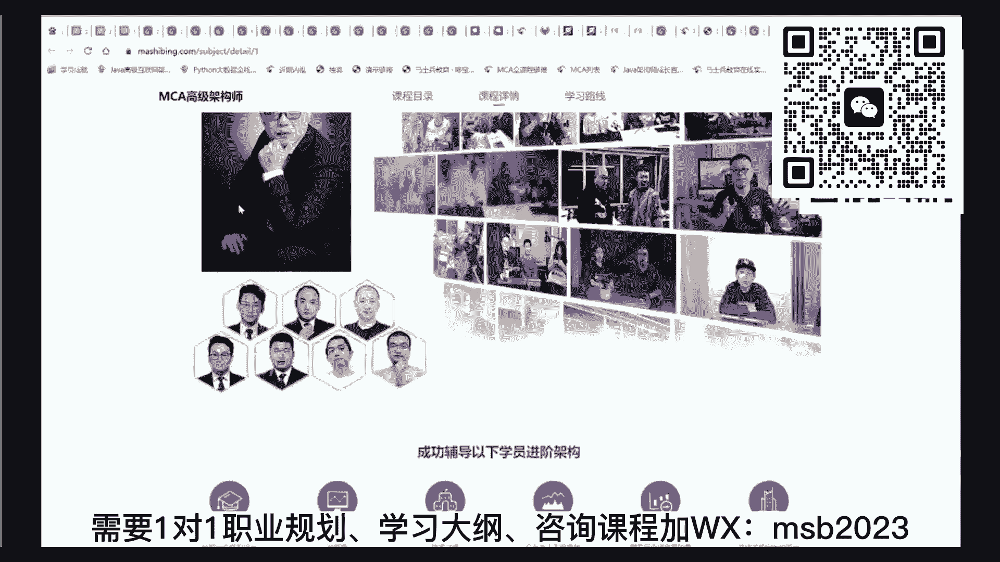
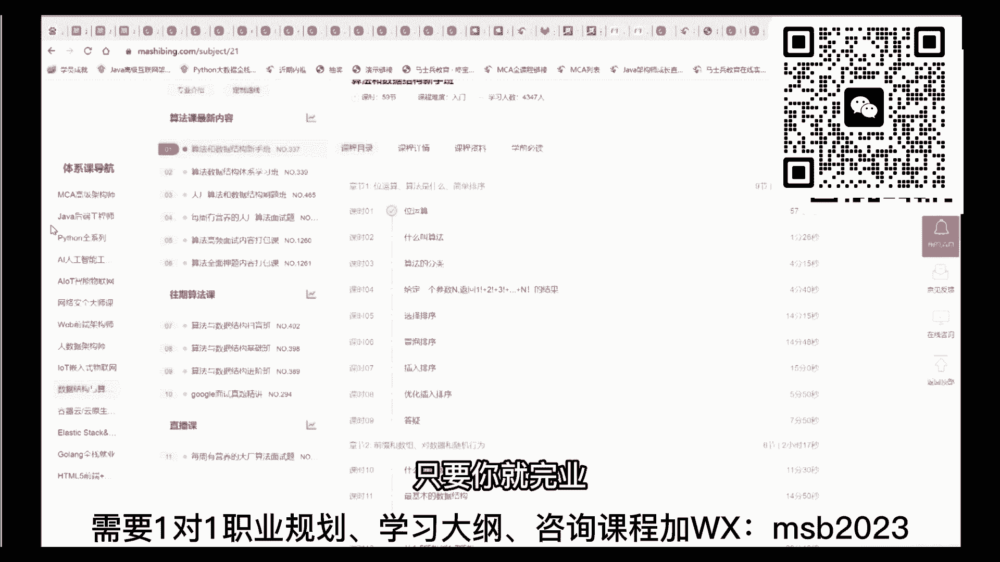
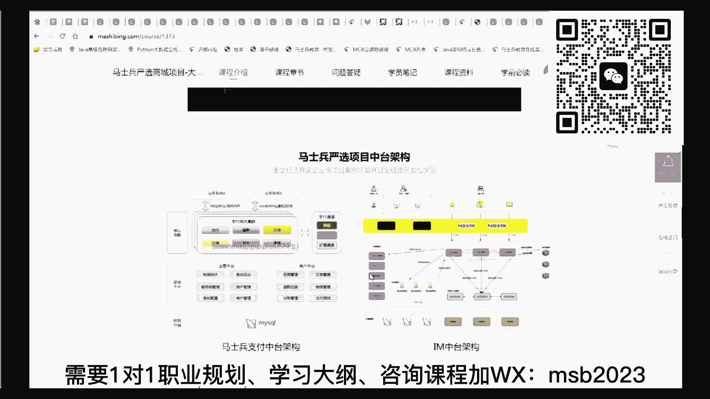

# 马士兵教育MCA架构师课程 - P47：【2023重点】进大厂的“最小值”到底是多少？ - 马士兵学堂 - BV1RY4y1Q7DL

哎对，还有一个有同学说了，说那个，大厂最小值是吧，刚才有同学问我说大厂的最小值是什么，来各位同学想知道大厂最小值的，给老师扣个，一来，哦那个我用阿里来举例子啊，大家都可能我不知道大家了不了解。

就是阿里的他来招人的时候呢，他大概是给这个技术人员分职级的，从p5 大概到p8 这样一个样子啊，就是p6 p7 p8 ，那有同学刚才说了，说老师你刚才给我讲的那个最小值。

从javs e一直到spring cloud这块算是p几啊，那不好意思，只能算p4 啊，各位兄弟们，各位兄弟们啊，那个我刚才讲的最小值应该只能算p4 啊，可能不太会到，到不了p5 嗯。

我们就以刚那个刚才是p4 ，我们现在跟大家聊，简单聊一聊这个p5 ，这块呢大家可以找到我们mc架构师的那个课程。

课程课程介绍，这里啊，我们曾经原来做一张图嗯，p5 这块啊大概是这么这么一张非常细的图，但是没关系啊，我帮你提炼那个最重点的东西好吧，那么p5 呢首先掌握p4 的知识，这个没什么可说的。

就是首先第一点你要掌握p4 o，先把p4 那个大概掌握了，那么p5 还需要什么东西呢，p5 实际上还需要算法啊，大概是这么多，这个就是它的最小值了啊，因为大厂来招的时候。

他往往招的都是一些这种计算机的专业方向的，这些人啊，呃在座的今天听课的，我觉得会有一部分人呢，他是没有那种专业方向的，就是没有那种没有那种呃，不不不是计算机专业的，等于那么不是计算机专业的呢。

我教大家一下，就是非计算机专业，今天因为听课的有大二的，大三的，如果你不是计算机专业的，你想补成计算机专业，差不多你应该重点补那几个，大概补四个内容，第一个呢就是操作系统啊，网络祭祖嗯。

然后呢加算法如果只需要补一个的话，就是就是他就是算法，如果只补一个，就是他啊，如果要补四个，大概就是这四个，大家听懂了吧，呃其实不是很好补，我建议大家呢也可以不用要求的。

对自己要求太高呃如果想速成的补呢，你建议就不算法啊，其他的可以暂时放一边，当然你想说你说我想非常有把握的进大厂呢，那这些基础知识是真的少不了啊，所以算法叫底层原理，底层原理呢可以简单理解为操作系统。

网络技术啊，这个简理解为这个还要包括什么呢，如果你是java方向，那就是jvm火箭筒，部分数据库吧，大概是这样啊，db然后加部分源码，因为呢有一些源码呢，对你来说是强力的加分项啊，这个是。

掌握的多肯定是越多越好啊，不掌握的话呢也有可能能杀得进去好吧，这个我们讲最小值吗，不是最大值，是不是，这个大概是p5 啊，但是p5 和p4 嗯，我可以这么来理解吧，就是说p4 的话呢。

差不多就是那个你是大专生啊，或者说学校不太好，可能应届生进不了大厂那种学校，大概你搞定p4 就能搞定一份工作了，如果加上p5 的话，就是你这份工作薪水会更会更强，大概是这么一个概念，这块大家能听懂吗。

那这块大概能听明白，老师扣个一，db数据库，对对对对对，数据库啊，就掌握mysql什么的就可以了，但是其实作为大厂的p5 来讲，就是大厂的屁股来讲，比p4 还可以少一个东西，就是什么意思呢。

其实他未必需要项目经验，这个就是它的好处，各位认真听啊，就是作为你去大厂，你未必是需要项目经验的，这点比较好玩，那个这个咱们以前有同学就是这样的，他的项目经验其实并没有，因为应届生嘛，嗯那个。

但是呢不耽误他得到了大厂的那个面试的要求，要面试要求之后，他把这些东西问的特别细致，问完了之后呢，ok没有考面试经验也进去了，所以如果聊最小值来讲呢，这个项目经验没准p p5 想进大厂。

可能还不是你十分需要的那个值，o当然这个是也是加分项啊，肯定是有的话，比没有要强的多得多，但是反过来说，如果你要想找工作，p4 找工作，那不好意思，这项目经验是少不了的。

这是大家伙写在简历上非常头疼的一件事，因为大家你想一下你们你们的项目经验，第一个你们没有真实的项目经验，第二个你们大多数的项目经验呢，都是跟着好多老师的，这个个人的一个这个这个视频也好。

或者敲敲代码也好，就是一步一步敲出来的，非常粗浅的一个项目经验，一个小模块写到简历上也不好看，所以这里面会涉及到一个，我怎么样才能拿到更多的面试经验，有没有速成的办法，其实也有啊，这也有速成。

但是大家就就不就不展开多说了，要不然咱们说不完了啊，这办法这个也有速成，你就记住了啊，没有没有不能速成的东西，好吧，除了除了这个啊，呃算法是真的，老师没办法帮你速成，因为算法是，考验一个程序员的内功能。

就相当于我要招一个保镖，我看你的，看你的是什么东西，看你的是内力，是你的易筋经的锻炼了多少年，而不是说你什么会什么地躺刀啊，会什么黑虎掏心会这个的啊，所以算法这个我没有办法帮你速成啊。

呃咱们课呢是把算法呢单独列了一门课，这个课呢是咱们那个左程云。

左老师辛辛苦苦给大家带来的呃，呃希望大家伙去了解啊，那个，这我也不太了解，大家知道那个左老师听说过左老师吧，应该我们叫左神是吧，嗯算法对，慢慢啃对，听说过是吧，他是原来是在华中科大的。

然后在芝加哥大学念念的研究生，后来在美国那边是在亚马逊啊，然后再回回国之后呢，在百度做了一段时间，然后呃开始专门教大家怎么样讲算法，就是带大家伙怎么进大厂的这个啊，因为算法是进大厂要的，如果你不进大厂。

只是想拿一份工作，实际算法暂时是不需要的好吧，同学们嗯这会儿要听懂呃，算法课内容呢内容会挺多的，我们是单程差不多是400多个小时的算法课，所以说我建议大家学算法怎么学呢。

我就教大家一个方法叫做日拱一卒啊，算法怎么学，叫日拱一卒，所以你千万不要想着速成，速成这件事不太可能呃，每天学那么一点点，比方说你每天如果有两个小时学习时间的话，你拿出半个小时来学算法。

如果你有四个小时，你就拿出一个小时来学算法，听懂了吧，就是每天你不间断或者两天学也可以啊，三天学一回也可以，就是你不要间断，间断了就完蛋，只要你细水长流地学下去，你会发现你个人脱胎换骨。

因为为什么你从你你是从整体的那种易筋经，从内力的方向开始，慢慢的去理解整个的i i t的知识体系的好吧，因为这个东西的话，那就完完全全就是不一样的，那这块大家能听进去的，给老师扣个一啊，我我我我。

我们讲做培训的很多人就是培训的是速成，其实很少有人呢来帮大家设计一门算法课，因为算法课这件事情叫吃力不讨好，他太硬核了，他跟那个速成那个是完全的两个概念，所以说那个你靠背靠什么都可以。

但是算法靠背靠门它是真不行，但是我觉得呢要成为中国优秀的专业的程序员，我愿意为大家提供一门算法课，既然提供算法课呢，我就找那个讲算法，讲的最牛逼的就是咱们左老师，没有之一啊，嗯案例我就不做，不给你看了。

就是曾经有同学一个算法，就把全中国大厂全拿遍了，而且算法重要在什么地方呢，你一定要记住它的重要点在于，国际大厂要考东西就考算法，然后就考什么呢，呃算法加那个系统设计，没有别的啊。

案例案例我就我我我就不急了啊，我就不举了，太多了啊，所以请大家听进去，这就是p5 的那个差不多，你你你进你进大厂的p5 的水平，这p5 水平呢不是想象中那么好进呃，信息这是一个知识点的一个列表啊。

我在这儿呢就不给大家1111讲了，呃不一定是你需要把所有东西全搞定，因为这里头是一个最大最大集，它不是一个最小集啊，我我给大家讲的是那个最最小最小集合呃，也给大家瞅一眼，就是大厂那种招屁股的时候。

它的一个面试的深度是什么样子，好不好，大概是这个样子啊，这个是一个典型的，这是原来呢咱们这个同学是一个研究生，他进去的时候拿的是一个p5 呃，大概在阿里那边练了七次，他呃面工程项目经验基本为零啊。

所以就是死磕开始死磕它的基础知识啊，大概就是这些啊，大家愿意的话，这个面试题的一些简单列表吧，其实其实还是蛮深入的，考的都是基础的知识加算法题啊。

刚才有同学问我说那个大厂的实习，它的最小值是什么，跟p5 是差不多的，我再重复一遍啊，大厂实习跟真正找大厂工作本质上是差不多的，跟p5 的那个要求是差不多的，听懂了吧，好这个基本上就是p5 的内容。

大厂以前的这个p5 的职级里呢，他的年薪是20万~40万，p4 的话，那你肯定是刚入行，一般是到不了20万的。

好前面这两项我大概就讲完了，不知道大家有没有谁有疑问的地方，就是说再重复一遍啊，就是说你是学历不太好，你初初心就是想找份工作，我教你怎么速成，然后速成的最小值是什么，这个最小值甚至还可以速成。

就说你没必要去搞那么多操作，你就用我教的办法，用最最快速的方式先玩了命的呢，做一些粗浅的操作，然后更细致的那种工作上的要求的操作，等你拿到工作之后再说，诶，这是最好的促成的方式，最快的。

然后如果是p5 的话呢，差不多你需要再加这些东西啊，就够了，好我讲到这儿看看过去讲的这部分还有什么，谁有疑问的，嗯如果没有问题的话呢，哦m说mc是和哪部分学是吧，大概mc是这样的啊，听我说我们。

我们。

课程里头的这两门课，这两门啊就是一个是mc的高级架构师，一个是java后端工程师，这个课呢是入门。

是入门，是小白，就是你那个呃刚刚就还没有就业的情况下，第一次就业做这个课就可以了啊。

然后在这个课的基础之上，比方说你已经就业了，已经就业了半年工作半年，1年2年3年，只要你就完业。

拿到了工作了，业余时间，这是咱们的业余时间提升的课，叫mc高级架构师，提升呢就是你已经拿到工作了。

在他的工作的前提之下，然后该怎么样去，拿到更好的薪水，因为很多人拿到工作呀，他真的是很粗浅的，很很简单，一份工作很可能拿的是外包，拿的是一个那种呃，其实很低，这样的工作不是很理想。

能本来有能进大厂的资质，但是没有进去等等这方面，那么在这个基础之上呢，帮大家做提升的，所以这是这两门课，大概入行这块呢我差不多就讲完了，这个入行入行这块的话呢，大家也可以找咱们去咱们网站上查内容。

也可以啊，入行这块的大纲的话呢，也也给大家那什么意见吧，给大家一下啊，这是那个入行的大纲啊，这入行呢我们给我再说一遍，我们给的是最大值，我们这个大家入行的时候，是你你你把这个值学完了，肯定是就入行。

肯定没问题啊，我们给的是最大值，你可以玩最小值，这个老师老师教你玩最小值也可以啊，在这个基础之上呢，找那个最速成的部分，其实也可以，这个最大值呢，实际上是包括了p4 和p52 部分啊，还有少部分p6 。

所以这个这个打开看呢，你会感觉到比较多，大家听我说呢，也不用害怕多，因为这里面包含了好多细节的操作，我还是那句话，你如果想速成，反过来选你的这个成功率就高多了，还有一个呢就不需要花那么多时间了。

当然它带来的坏处呢，就是说呃你的那个你你你得你得自尊心啊，你得你得会有一定程度上的受挫，造一个呢要让自己试错，成功率和那个正常的那个学习比较没那么高，所以看大家伙自己的时间上的准备，还是那句话。

你要想两周搞定工作，老师也也有办法，并不是说就搞不定啊，我我就当然需要你配合啊，你以前有同学说老师我就是过不了心里这关，那那那那那那那就真的真的没办法，肯定是需要你配合的啊，只要你配合好。

我们说两周搞定工作，不是想象中那么难好吧，行我大概就，说到这把入行这块，我就说到这，下面我跟大家聊那个呃入行入行的知识数，大家清楚了吧，入行的知识数大家清楚了吗，还有没还有没有谁不清楚的。

下面我跟大家聊进阶的知识数啊，清楚了是吧，再说一次好对入行知识数不但不太难啊，我跟大家伙再简单重复一遍，比方说你我我们说找一份工作好好听啊，就说找一份工作，其实你只需要从java s e js。

甚至都不需要掌握那么多啊，只需要掌握的运行对象，掌握常见的一类的处理，甚至都可以啊，然后呢数据库当然还包括数据库操作，jdbc，还有前端，web前端web前端不需要掌握手机什么的。

前端web前端的大体掌握就可以，不需要太不需要太深，然后呢我们讲那个后后台的不需要掌握，不需要掌握jsp，不要跟我去学那个啊civior，然后spring spring mvc。

spring mybatis，spring boot，spring cloud，好到这里，这是入行的知识点，找一份工作，不过这里面比较难的点呢是项目啊，这个是比较难的，这大家要有心理准备。

我们一般推荐你入行的时候给我写四个项目，入行就要写四个，不然你去试试，你写个一两个很粗浅的那种项目，你还是拿不到面试机会，入行写四个，就这块是比较比较难的，就是这也，这也是我们为什么在课程里面。

给大家准备好几个项目的原因，就是因为呢怕你在里面写不出来呃，游戏后端项目，然后那个何家园项目，网约车项目，咱们的严选项目，商城项目就是一定要让你写出四个来，就算你没有四个，你只要掌握知识点之后。

老师也能速成，让你去搞那个你原来没有做过的项目，也并不是写不出来，听懂了吧，入行要学到微服务，对要学到这是比较有把握的，你可以不学到微服务，但是就把握性没那么强啊，这大概是最小值，我讲清楚了吧。

这是找找工作啊，我们说进大厂，进大厂，在这个基础之上呢，呃算法算法你要想进大厂的话，差不多要掌握到那个至少是什么莫里斯便利，呃，然后那个贪心啊，呃然后动态规划这部分，dp这部分啊等等。

然后呢呃这个计算机的这个三剑客是吧，计算机机组操作系统网络原理啊，机组操作操作系统网络原理，然后还有一些底层的技术，jvm多线程啊，数据库调优等等，在这基础之上呢，你因为你看他面试题全都是锁呀啊。

什么并发呀，多线程访问下应该怎么样啊等等，然后呢在这个基础之上呢，建议加一点点源码进去会更好，比方说那个jdk的一些常用类的源码，spring源码啊，然后嗯这方面的等等的一些源码啊。

叫什么mybatis源码等等，越多越好啊，但是最基本的，我希望你读一些jdk自带的一些源码，比如说threlocal了啊，还是map了呃，这些个源码啊，这些个它是板上钉钉会考到的，如果就搭乘来说好。

所以说上面可以简单认为呢就是p4 ，下面可以认为是大厂的p5 ，这两部分一加最小值啊，这块这块get到了吗，来这块get完的没有问题的，给老师扣个一啊，粗浅者跟他写的项目也能往简历上写吗。

你问出这个问题了，说明你刚才没有认真听课啊，就是说你没做过的项目都可以，往往往简历上写，我刚才讲过了，你简历是拿到了，是拿是要你拿到那个面试机会的，怎么写，能拿到面试机会就要这么写，o大数据想学好。

怎么学大数据的路线呢，大数据路线也比较简单，大数据路线比那个想中要比那个java的后端呢，可能还要容易一些，好哦，我们下面聊那个掌心的，就是再往深里掌掌心的一些东西，这个东西呢因为我们还是那句话。

就是我们大纲里面给的是最大值，就是这个大纲呢你们把他要回去，把它要回去，把要过去一定要过去，要过去之后呢，不需要你，我不需要你说你，你说我老师我就不想报你们班，跟跟你学没关系啊，你爱报不报。

但是我至少能够向你提供一个指导，指导是什么东西呢，哪怕你自选，你可以沿着这种路线来学，他一定是没有没有那什么的啊，就说不会不会让你走弯路的，就怕你自己搁那学，学了很多东西，有以前有同学在那使劲。

还在那学学扣那个habit，扣了半天，还在那扣p h p的，扣了半天，浪费时间，兄弟们知道吧，可以让你的学习更有效率一些啊，呃关于那个p6 这一块呢，其实p6 是在p5 的基础之上。

刚才你们你们了解到p5 了，对不对，p6 是什么呢，p6 是在p5 的基础之上加项目经验，所以这里面的很多东西啊，实际上是和p5 的没有太多区别啊，就是对技术知识点的要求上，对p5 来讲没有太多区别。

但是呢作为p6 来讲呢，p6 是呃我们我们是讲阿里的体系，p6 呢是要求你掌握知识点，还在社会上大概工作了3年左右，听懂了吧，这个是很多人嗯，面面面p6 时候的一个真实的年龄水平，就是大概你已经工作了。

然后掌握了屁股的知识点，工作了，但是没进过大厂吗，工作了3年左右，这时候去大厂面试的时候，拿到的会是p6 左右的职级，这p6 呢有的给的薪资还蛮高的啊，40万~60万，这是以前现在不知道有没有降。

不知道啊，但是我们不管他的体系划分的还是比较科学的，我们就讲这个体系听，首先第一点呢就是从知识点的角度呢，呃，它的宽度肯定要比那个你刚毕业那会儿的宽度，要要增加，呃，我们给大家准备的。

记住我们给大家准备的是一个最大值，就说你未必非得完全的把这些全学完，才能拿到批流，我给大家准备的是最大值教学嘛，我期望给到大家最多，哪怕你暂时用不着，你什么时候用不着了，什么时候查都行，记住了吧。

所以这个呢你也不用太害怕，我们从那个这些类似于像p4 p5 的知识，这些要前置，我就不重复了，那么底层基础这个就类似于那个你要p5 ，要去考大厂那些，最大值我一定是拿大厂的要求来要求的啊。

你可以可以达不到啊，那个这是大厂的一些要求，操作系统网络等等，然后呢并发的编程这块呢也是大厂的要求嗯，r pc的通信这块呢叫分布式分布式的东西呃，对于现在做项目，如果你做的不还是单体，它就不值钱。

能理解吗，我再重复一遍，好同学说，老师我就学到单体行不行，其实可以，但是你拿钱拿的会很少，四五千，现在的项目单体就不值钱，能理解吧，单体项目就不值钱，所以你一定一定的对自己来讲呢。

要把自己盖到一个这种这种，带到一个这种分布式的这种这个这个高度，在分布式的基础之上呢，我们这时候呢你可以去了解消息的中间件啊，rocket和卡夫卡这两个是最主要的好吧，入门来讲呢。

你搞那个rabbit也可以缓存的中间点呃，软件初步设计的基础就是整个软件工程呃，分布式的技术架构，从高频发高可用到存储，分布式锁分布式，我这就比较多了，还是那句话，给的是咱咱家是一个最大值。

包括p5 的，那这里面是包括p5 的呢，然后呢大数据的部分，数据的存储，数据的这个搜索啊，数据的处理，实时处理和和这个和这个和这个批处理呃，网络基础运维的部分，然后呢现在最流行的呃。

做软件工程的这种实践就是debus啊，就是这个运维开发一体化啊，测试的部分和那个新新版的这种，微服务啊，新版的微服务嗯，差不多呢，这个就相当于一个p6 了啊，到这部分呢。

其实你就拿到40万~60万左右的薪资了，就是这样一个水平好，我讲的比较粗啊，还是那句话，我给大家的是一个最大值，你可以拿到其中一部分，没有关系的，嗯在这部分看看大家伙有什么有疑问的地方，没有关于p6 。

如果只有单体项目经验，怎样分装成为如果只有单体项目进行，怎样分装成为分布式项目，首先呢你要把分布式的知识学好，在这个学校这个知识的基础之上呢，你再去想，如果用分布式的东西去怎么做。

你原来的业务逻辑在你脑子里做一遍就够了，听懂了吧，嗯啥时候有提问环节，现在可以提啊，就关于我刚才讲的这一段老师有免费进阶课本，好像是有的，因为我们最近是我们的周年庆典，是我们m c a的三周年庆典。

去咱们招聘网上不去，咱们去咱们的官网上，你去查一下，应该是有了啊，这是我们的我们的上在线上的三周年庆，应该是基础体系，现在对待账户是全部免费开放了，就是大家学学go on的a l o t的web。

前端的python和java，对于刚入行的这部分，对大家伙是完全免费开放了，到目前为止啊，呃当然只是入行部分啊，咱们老师们也是要吃饭的，呃还是那句话，如果你想比较有把握的技能行业。

让老师带你肯定是最有把握的，我讲到这儿呢，稍微梳理一下，p5 的p6 的就p4 p5 p6 ，其实大家都清楚了吧，p4 p5 p6 涨跌到30需要哪些知识，p6 呢已经涵盖到40万左右了。

其实这些知识你就到30了，这些是没有没有问题的，好吧，一会儿我呢我我跟大家简单梳理梳理，就是到什么薪资，你应该掌握哪些好不好，我先给大家再直抵上，梳理完再帮大家梳理梳理一份，就是到什么薪资。

应该掌握哪些，ok可以吗，我觉得可以，同学老师扣个一，我先帮大家梳理完体系啊，这个呢是p6 的知识体系，其实到现在为止，关于知识体系层面呢，我们在后面又增加了一些新的这个呢。

这些知识体系的话呢也是慢慢的开始，需要大家伙掌握的，就是关于云原生的，我看刚才还有同学问啊，说那个mc里面有没有k8 s的，这个必须得有，因为关于云的这部分，是我们将来很可能就跟现在的操作系统似的。

就是linux似的啊，你不用都不行，我不知道大家有没有有没有感触到啊，就是我你像我们现在对外的给大家的教学项目，都是在云上的，我们给大家的最新的这个，你比方说投入了几十个人给大家开发出来的啊。

像这个呃这个都是在云上啊。

完完全全整个架构全部都在云上，所以云这个东西呢你是避不开的，各位兄弟们，各位成员的组成员的，咱们咱们的同学们，一定一定一定一定开始，慢慢的要把它放到你的学习日程上，从云基础到云架构啊。

到这个多到容器到容器编排，到监控，到持续集成，到这个easter terraform ensable service，互联工程等等，这些都是和云相关的，这是咱们的重中之重，好吧知识点这块呃。

我们有一个专门的特特别的课，很特别的一个课呢叫做大厂八个处理专题，这个主要是咱们原来的那个京东的老师啊，他们在上线自己的项目的时候，在实际当中又遇到过哪些事故啊，这个专题是我特殊设计的啊。

为什么要设计这个专题呢，其实还是有点苦心在里面，这个专题呢主要是帮大家解决，在面试之中，别人问到你一个问题，这个问题最常问的是什么问题呢，就是说你做了一个什么样的项目，你在这个项目里面有哪些个痛点。

有哪你遇到一个什么难点，你是怎么解决的，这时候是展现你价值的时候，一定要说那种特别拿得出手的痛点难点，你不要让自己说啊，我那个有一次jdbc没调通，后来我调了调给调通了，各位同学们能听懂吗。

来这会能听见吗，扣个一吗，你那个能体会到老师设计这个课的苦心的，好不好，就是这个这个问题是大家伙最常问到的，主要是你们去面试，面过试的，你反馈一下有没有人遇到过这个问题，就是他问你。

你原来的你原来的那个做做过什么样的项目，你说了半天，然后说这个项目里面你遇到的难点，有没有遇到过，你这个遇到过给老师扣个一出来好不好，就这种问题问的太多了，所以专门给大家准备这样一个课。

还是很有价值的啊，那科的价值就在于说这个一个课搞定了之后呢，你你很有可能你这个原来赚15000的，就变成17000了，好吧，现在问我都头脑对，所以这课就专门给大家准备解解，解决这一个问题的啊。

就是课程现在怎么细致程度比较细致了，我们讲p6 这部分的主要集中在操作和落地上，就是日常的操作啊，日常给你一个模块，你能够写的出来呃，如果到下一个职级的话呢，实际上它叫做原理和设计，就这个内容的话。

它就开始牵扯到你整个的架构师的核，心部分了啊，架构师的核心部分，就是对于整个结构的理解和技术的选型，这块是一个架构师的核心能力，给你一个业务，你要把这个业务呢转换成为技术好，选转换成为技术的时候。

你肯定要想，我应该是选砖头啊，还是应该选瓦块啊，还是应该选混凝土啊，还是应该选塑料啊，选型能力，这里面呢主要是分布式架构的理论基础啊，分布式架构的算法支撑，这里面主要两两大算法，一个是分布式算法。

一个是机器学习相关的算法，然后呢框架的原理和源码的剖析，这会儿要不要让大家公源码，如果不公源码，你就不会意识到一个优秀的，别人写的东西的结构到底长什么样，就相当于呢你做建筑的人读源码的过程。

就相当于你去解剖那些个现实之中，已经非常好的一些建筑的，它的内部的结构，你说它重要不重要，他一定重要啊，然后呢在掌握了p6 的基础之上，你你接触了很多中间件，我刚才讲过啊，像这个呃mq的中间件。

像像像这个缓存的中间件等等，你都接触了，那么实际当中呢你设计什么样的结构，去做什么样的接受度，比方说100万的流量过来，你应该做什么样的结构来处理，那么一个亿的流量过来，你又该做出什么样的处理。

所以这块的话呢，就是对于架构的设计和选型这方面，薪资的话呢，其实到现在50万以上了，就肯定是没有问题的，当然掌握了一些理论之后呢，还需要做出案例的设计，比如说给你一个什么样的案例。

你应该做出什么样的处理啊，这是一一的各种各样的案例的处理，这里面比较重要的一个课程呢，是咱们的一级流量，这个专题就是高并发大量来的处理的时候，我到底从前端接收开始。

从网络开始怎么打到我们的后端的数据库上，不让它崩，很值钱，如果你在简历上呢能够写得出来，对于高并发量的处理，对于大数据量的处理，到这个时候你这个简历就会非常非常值钱了啊，相关于原理和设计的一个层面。

看同学们有没有谁有疑问的，公司架构师，豪车别墅丁丁发红包都是几千几千，是哈哈，关于这款，听说有教师不是写代码的，是不是真的，其实是真的，架构师呢，至少不是写那个呃日常的那种业务代码的。

但是架构是有可能写一部分demo代码，就是在我做好结构的基础之上，你怎么去写通这个东西，我给你写个小demo，这是有可能的，这能听懂吧，绝对不夸张，我就是老大，各位同学关于这个p7 的部分。

还有什么有疑问的地方没有，这是咱们最新的课程的更新呃，这个更新的话，那我就不一一讲了，这个主要指的是呢，在咱们课程体系里面是由几百个小时的直播课，外加几千个小时的录播课构成。

这是咱们整个课程体系的结构呃，因为以前老有同学问我说，老师你们是不是只有录播课呀，这个绝对不是啊，咱们呢还是提倡大家伙上来上咱们的直播课的，就这个直播课来讲呢，大家可以看到咱们的直播课的呃。

所有的列表从咱们的网站上就能看到，大家打开来就能看到schedule呃，每每天的直播呢在这里大家都能看到，今天有哪个直播课，今天有哪个直播课，大家都能看到，其实每年呢我们的直播课的话呢，一个方向啊。

几百个小时的直播是不成问题的，这个是要超越很多课程，课程量比较大，嗯所以有哪些在更新，有哪些在直播，大家都能都能看得到啊，跟着学就可以，当然这是课程的更新，我就不说了，那么最新的一个更新呢。

是咱们网约车的2022版，这个呢是新项目啊，大家对于项目比较匮乏的，跟着走就可以了，好吧，这个呢是p6 和p7 ，其实再往后讲呢，我估计大多数程序应该到不了了，还需要我往后给大家伙简单交代一下吗。

需要的扣个一出来我问问吧，好不好，不需要的话，我就不给大家交代更深入的内容了，讲讲吧，听过程是吧行，我快速给大家讲一下，因为大多数人到p8 这个水平，其实是不太容易的，呃我也不怕揭自己短。

我们到现在为止培养的学生里面，真正靠面试，从外面面试直接杀进阿里p8 的，到目前为止呢，其实只有only one一个啊，只有一个难度太高了，他整个面了11次，11次面试。

因为面进去差不多就200万年薪了，知道吧，就是年薪就比较高了，灭了11次啊，差点最后一个还给毙掉啊，那同时p 11般来讲呢到p8 的话，你应该是升值进去，就是你可以面积p6 去，面积p7 去。

然后升值到p8 ，这个是最好的路线，空降的p8 呢比较不容易，而且空降p8 很容易被干掉，你原来的在公司的根基不稳，那么从皮八角度讲，它就不单单是那个技术内容了，它主要是会牵扯到一些相关的管理内容呃。

为了向大家传递p8 的知识呢，我们在整个知识体系里呢请了一位真正的p8 ，他在阿里，他就是原来阿里的p8 啊，他的那个花名叫良禽，如果今天有阿里同学可以查一下，他原来是阿里的皮吧，在阿里高德那边。

原来管理团队就管理的一一百号以上的人啊，当然这里头就开始讲管理能力了，这个咱们再往后再说好不好，年龄特别大的同学，我是真心希望你要掌握这方面知识的，因为呢你如果还在一线车间里面的车床上。

还和那些个刚进来的员工去竞争，你的竞争力已经不太强了，然后呢p9 的话我就更不说，因为p9 的话，我的同学啊，我上大学的同学今年40岁了，阿里做p9 ，最近刚生成，刚刚升为p 10，平时做啤酒。

他的年薪整个是在400万左右，我觉得大多数人呢到现在只能是可望而不可及，往后再说，慢慢慢慢来，就各位同学呢一定要有，对自己呢要有一个综合性的认知，而我自己呢还是有方，各方向能力还是有提升空间的。

一定是这样，你千万不要想着说我老跟着躺平啊，我我就不上进，那你肯定是没有想，那肯定是没有想象空间的好吧，当然呢我请他来呢来给大家讲讲了，专门的做产品管理的课，因为这个时候和技术呢。

就不是特别有关联的东西了，好吧就是他他会讲，他会给你讲什么呢，从整个产品的级别来，带领不同的各方方面面的团队啊，从售前到那个设计啊，到产品到ui到运营，到到到技术啊，到测试到运维不同的团队好吧，然后来。

了解整个的带领这个团队的过程，这个就比较就比较比较更更高一些了，之后就不在不在这完全深入展开了，这个呢对于咱们低级别的同学来说呢，你就把它当成一个给大家伙儿的一个赠送，就可以了，好不好。

等你用到的时候没坏处，听一听一定没坏处，好吧。

这是咱们算是进阶一点的内容啊，主攻的呢我们还是p6 和p7 的两只，这两个级别呃，当然，当然那个从知识点的角度呢其实也不太多吧，也就这么多啊，但其实如果呃后面呢其实主要从两个层面，又给大家做了一些拓展。

这两个层面呢嗯我也希望你能那个讲的到呢，老师的一个苦心，就是第一个层面呢是实战公安，可不属项目落地，什么意思呢，就是你的像你的你的简历里面不太容易写项目，对不对，因为你没做过吗。

老师帮你做好一些个不同的项目，能够让你写在你的上，同时老师就教你呢怎么去无限拓展项目啊，了解业务逻辑之后，脑子里给他做出来写，写进去其实也可以啊，前提是要掌握技术，这样的话那你就呃慢慢的呢。

你的你的简历会比较丰富，简历比较丰富，你就更容易拿到面试机会，这是肯定的，在这里面呢有咱们的合家园项目，咱们的网游，网游的后端项目，这个比较适合在校的大学生，展现你的技术水平的。

比较适合去找实习的那些人，展现你的技术水平啊，这个项目是很给力的，千万不要小看它，很多人都是靠这种项目写在简历上，然后拿到的面试，拿到了实习的机会，然后呢咱们的网约车项目也也比较好玩。

这个项目呢到目前为止已经服务了很多学员了，因为他是一个优秀的项目，原因是什么呢，这个嗯你好好写简历，同时呢又不能够做到千篇一律，这大家能理解吗，就是说如果说你做完一个什么百万千万级别。

上亿级别流量的商城，那么别人一定会问你的商城在哪，你告诉我，但是网约车这件事情啊，你可以随便写，每个城市都有自己的网约车，还有好多好多家啊，甚至小的很小的城市都有，所以你写简历上呢。

它的可信度非常非常的高，尤其而且呢他用的技术也比较靠谱，最新的咱们又更新了最新版，咱们的2022版嗯，这个呢大家伙也可以拿到，拿到咱们的这个大纲之后呢，在从头到尾的读好吧，从项目的基本的概述开始。

到整体设计啊和技术的开发规范，那整个技术站用的是什么，到用户端是什么样的a p服务层是什么样的，健全是怎么做的，订单是怎么做，交易网关地图，支付派单计价中台能力的沉淀，项目的测试到项目的部署。

到项目拓展，最重要的还教你怎么样进行项目的面试啊，总之呢这个项目帮助咱们不少同学，拿到他的进阶或者第一份工作出版的进阶呃，然后我们最新做的项目呢是叫做严选，也就是大家伙儿看到的这个项目啊。

这个这个严选呢，是大家可以直接在上面玩儿的啊。

就这个项目也是咱们对外公开的，也有pc端，也有那个呃。

手机端也有那个那个那个h5 端都有呃。

这是测试商品，大家要是愿意尝试一下整个的流程的话，可以花个一分钱尝试一下，是你需要真正付费的好吧，咱们的整个的严选商城，呃前端呢。

其实虽然看上去它也是一个很普通的商场，但是后端呢其实内容是非常非常多啊。

大家有有机会的可以了解咱们整个的东西。

因为我们做商城啊，是很多做培训的人呢经常采用的一个案例。

因为为什么要采用商城的案例，是因为它的业务逻辑比较简单啊。

一说知道都知道是干什么的，但是呢很多的商城呢都是一个老师，然后带着慢慢敲啊，敲一两个模块出来，后来我我我是感觉，如果是这样的一个方式的话呢，它的第一你接触不到更大，整个项目更大的一个面貌，它的一个梗概。

第二呢，一两个模块呢可能也说明不了什么，就是你你你你写起来的信心可能也不足，所以咱们这个呢是老师投入了很多人啊，从这个人员上，也给大家那个。

稍微看一眼啊。

这是咱们vip的直播地址啊，这是咱们白皮书的购买地址，这是咱们整个的技术的架构。

这是咱们立项启动的过程。

这是咱们整个人员的配备，我这里不是学生啊，各位同学，这里是咱们马云教育为这个项目投入的研发人，员，好吧，还可以吧，就说我是希望的想向大家展示一个在公司之中，一个真正的完整的商城产品。

它是怎么样由不同的团队一步一步构建出来的，o，这块感受到老师苦心的给老师扣个一吧，扣个牛逼出来，ok，就真正愿意做这份投入的培训机构，应该不太多啊，老师还是愿意做这份投入的啊，所以呢我们就我们就建立了。

整个项目的这种层次感，就是说不同的人选不同的项目，然后架构师应该选什么样的项目，刚入行应该选什么样的项目，咱们的那种那种呃架构级别的架构的老师，应该是应该选什么的项目等等。

大概呢就分成了从技术啊到项目两个大的层面，与此同时呢，还有一个呢，最后也是咱们苦心孤诣的最后一项吧，就是确实有些同学就特别想快速的涨速成速成，它的成功的概率就一定要降低，速成对大家伙的要求呢也比较高。

但是很多人的要求呢就是想速成啊，今天上午我见那个同学，已经不速成也不行，怎么办啊，21k回到行业能不能做到啊，问我，我教他两周之内可以呃，成功的概率其实三四十二三十没有关系，就十家里头乘两家。

哪怕你十加成一家拿到了不就ok了吗，所以专门为了速成呢，我们准备了整个的突击冲刺，但这个突击冲刺呢，是建立在以前的这个知识树的基础之上的，这点大家能理解了，就是我们突击冲刺并不是没有把握的。

给你固定的背题，这样是不行的，是我我我讲过，你是需要大体了解整个知识数，这是最好的方式，了解知识数的情况下，想突击冲刺的难度就不高了好吧，所以突击冲刺这件事情呢，到现在我们整个的体系里面呢。

就变得越来越重要，整个的突击冲刺的过程，可以分成呢这么几个步骤，我也顺带教大家，你真正去做自己，怎么去做这种突击冲刺的掌心。

