# 马士兵教育MCA架构师课程 - P48：【2023】突击冲刺15天涨薪 - 马士兵学堂 - BV1RY4y1Q7DL

我下面教大家做做突击冲刺的掌心操作，认真听啊，各位同学呢，首先第一点啊，就是说你比方说我就想两三周，我就想涨点，涨点钱，哪怕涨2000，你就想如果我两周的冲刺能够涨2000。

我1年是不是就多赚了2万块钱，这是能理解吗，我一周的冲刺，一两周的冲刺如果能涨3000，我1年就是36000白来的，ok所以其实真正的我我我我后来反思这件事情，原来呢我不太重视大家伙的速成。

后来呢我开始反思这件事情，其实很多的同学更希望的是，我最好是快点的见到效果，见到效果之后我再慢慢学，是不是大家伙都这么想的，如果是这么想的，一会儿扣个一好吧，我我我我我认识一下，ok。

哦我想呢我年轻的时候可能也是这种想法啊，但是说句不太好听的，那个我们讲富人的思维是一个要想有收益，我一定是要有投入的，他会想着说我要投入时间，我要投入精力，我要投入金钱，我才想拿到我的这个收益。

但是很多穷人的思维是哥，你能让我看到效果吗，你让我看到效果，我我我就报课，你让我看到效果，我就交钱，你先给我涨了薪，我就交钱，这是个悖论好吧，我教大家怎么找啊，但是我也希望你们能慢慢意识到。

一定是要自己有付出，就自己有付出才会有收益，才会有回报，这是这这才是事物的真正的发展方式好吧，突击冲刺的奖金怎么做呢，这叫做有针对性的重点啊，最理想的方式，如果是我带我，一定是首先要了解你的短板。

比如说你现在是1万块钱还是2万块钱，还是3万还是4万，我想涨20%还是30%，还是40%还是50%等等，这个是根据你具体的要求，我要了解你短板，了解你的背景，你自己做这件事情也需要这么干，懂吗。

就算你自己想为自己掌心也要这么干，就是你一定要首先理解你自己，我的短板现在在哪儿，那怎么离怎么找这个短板呢，其实就对照招聘，对的招聘需求就行了，比如说啊我现在我举个最简单的例子，我现在15000的工资。

我想拿25000，那你就去招聘网站上找看那个25000的工资啊，人家都要求你掌握哪些，我是不是很简单很简单非常的简单啊，你你看看人家25000那个要求你掌握哪些，你看多了你就会发现啊。

12345差不多有五个短板，是不是啊，同学们讲这个能能能能能理解吧，太笼统了，我没办法给你讲太细了，因为有的人那举个举个例子吧，我们举个例子来说好不好，举例子来说，比方说啊他有这哥们儿呢。

原来是15000，那么他会会哪些呢，差不多会呃，spring cloud呃，然后加日常的cd项目，这差不多就这样了好吧，然后呢他他他想说我这个薪水太低了，我就想涨点薪，然后他去找那个25000的工作。

当他打开招聘网站，发现25000的工作至少会要求他什么呢，架构的设计，比如说，高并发处理经验优先，有什么云原生经验优先是吧，有调优经验优先了解原理源码优先哦，什么叫区别，同学们。

你们至少发现了你的短板在哪吧，有可能是在这，有可能是在这，有可能是在这，这点大家能理解吗，啊25k要加油设计有可能啊，我举个例子，我希望大家去读，还是那句话好吧，你是不是就找到你自己的短板了。

所以你找到短板之后，你要想短期突突击冲刺的涨薪，你是不是把短板搞定就可以了，你知道什么叫举例子吗，一叶知秋，有人说不具体，太笼统了，我给你举个例子，我举完例子之后呢。

你又说这叫这跟你们讲的课是真他妈难哈，好吧，都是学生，都是学生，都是学生认知度不足，我要好好的梳理一下啊，那天怼了两个学生，好多小姐姐反馈说老师你不能对学生，不对不对啊，冷静对，都是亲生的是吧。

冷静举个例子啊，举个例子，其实我讲的这些挺简单的，你听下去就挺简单，但是很多人很多小年轻的时候，他没有这个认知嗯，行直接拿个招聘网站举例吧，招聘网站，这个是那个架构师水平薪资比较高的。

我们找那种薪资稍微低的架构师，薪资应该是比较高的啊，这个吧就是2万~4万，2万~4万，你给咱们看这2万~4万的好不好啊，你就认真读嘛，你看啊他要求你负责什么，负责呃，搭建和系统设计。

平台级的产品设计和研发啊，主导技术的难题的攻关系统，在高并发海量请求下的处理性能能看到吗，复杂分布式架构的设计开发和维护，o你发现没有，他发发现它的关键点了吧，然后接下来他的要求啊，这是他的要求啊。

熟练掌握这个熟悉这个，然后这些个呢是你具体的具体的区别所在啊，就是具体的差距所在，如果你没有的话，呃，应用服务器是吧，什么配置啊，然后呃分布式系统的设计和应用，你看啊，2万~4万。

其实它有个架构师就要求这个了，是不是设计模式，多线程开发，异步处理，这个在咱们课程里面都是很很普通的课，呃其实呢你多读几分，可以多读几分，你们还想看哪份啊，这个吧好不好，3万~4万的16星。

我们看他做什么啊啊技术方案架构设计，概要设计，看到了吗，还是架构设计，对不对，那个嗯人员配备部分管理对吧，要求什么要求还多，这应该是大数据体系，对不对，这就是你这就是你的这个就是你的缺陷点吗。

boot jungle啊，postgresgo，百万级别的高并发高可靠系统好，这是不是就咱们p7 的那部分的内容啊，这些个都比较简单啊，所以你多读几分，你多读几分，你是不是就发现你的差距了。

当然25000的话可能比这个还要简单一点，我只举个例子吧，嗯总之短期的突起的长次冲刺呢，一般来说呢如果经过老师的话，我会第一步我要看你简历，了解你背景，第二步了解你需求。

比方说我需求15000~25000啊，我看一眼你原来只会c r u d spring cloud都不会，那我知道啊，你的短板差在哪，我下一步告诉你，你应该补a b c d4 个点，然后你告诉我要两周。

然后我判断一下，说a b c d4。2周不够，我告诉你可能要20天好，我们要调整时间20天，或者你降低降降低期许，在这个基础之上，二天我告诉你，你优先这个应该学到什么程度，那个应该学到什么程度。

这二天之内应该怎么安排，然后接下来呢在你的整个的那个那个都差不多，第一步，了解背景啊，第二步就是说判定需求是否合理啊，然后第三一步呢是修改简历，这是很重要很重要的一步啊，这不是超级重要呃。

其实我们讲你想要什么样的，多少钱薪资的简历，老师都能帮你改得出来，这边呢100多万的，五六十万的，三四十万的，十几万的，20几万的，七八十万的简历都有的，是你想要什么样的都可以。

其实就可以判断你改完简历之后呢，那个你下一步呢，就是怎么去针对这份简历进行学习，明白吧，补充短板，那么第五步是要干嘛呢，第五步是要辅助面试过程，这个也比较重要，就在你面试的过程之中，别人问了你哪些问题。

你正好发个录音，实在是你搞不定了，找让让老师听听你的录音，你偷偷摸摸的把手机打开，录音打开没问题，没有问题的啊，这个呢也是比较费老师的，那么第六一步是什么呢，练完之后了啊，如果说有就说，试用期稳住。

就有的时候你80的水平写100嘛，那么试用期的时候，老师来有些什么样的难题，老师让gus告诉你该怎么处理，试用期帮你帮你稳住，这整个过程差不多就完成掌心了，呃这这个掌心的冲刺呢比较费老师啊。

嗯后来呢我们总结了很多很多的冲刺的模式，那么在这个基础之上呢，也形成了自己的冲刺的课程，冲刺课呢嗯只能说其中的一部分啊，只能说其中一部分帮大家总结出来啊，差不多现在每个月都有，现在咱们自己的冲刺课。

你像你像这个这个是咱们去年的初，就是呃去年34月份的时候冲刺课，大家看一眼可能就能看出来啊，有好多老师呢来帮你呃，从这个角度，这个这个这个里面有好多人都不会啊，当别人问你的问题。

5年之内什么你朋友对你评价，你还是没有问题要问吗，谈谈你对跳槽和看法啊，你遇到什么问题之后，怎么处理这些软性的问题，很多人都回答不好啊，为什么要离职，尤其是像这种的，你知道吗，你为什么要离职。

一问你就懵了，是不是啊，为什么要立志，因为跟原来的有有有有有冲突，就这种的差不多有70个问题，像这种的就是比较普遍比较比较普遍的内容，就把大家总结出来了，然后呢不同的钱的简历应该怎么写项目。

别人问你的时候，你该怎么样进行进行封装是吧，然后呢每一个不同的面试题，不同方面的面试题啊，常见的给大家总结出来，所以呢在大家伙儿辅助面试过程，这个过程之中呢，还需要被冲刺题目啊，大概是这么一个过程。

听懂了吧，这回大家举个小例子啊，就是那个有那种特别难的难题的，有那种特别特别难的，那那那那种男的，因为这里面比较费老师老师帮你评估，老师帮你怎么样，特别难的，不好评估的呢。

我们随便来，曾经试过，就是那个我们是专家会诊，然后呢报了咱们学的课呃，但是呢我们平还是同学报了他们mc c的，是这样，就有这个学生33是33了，然后大学还较差。

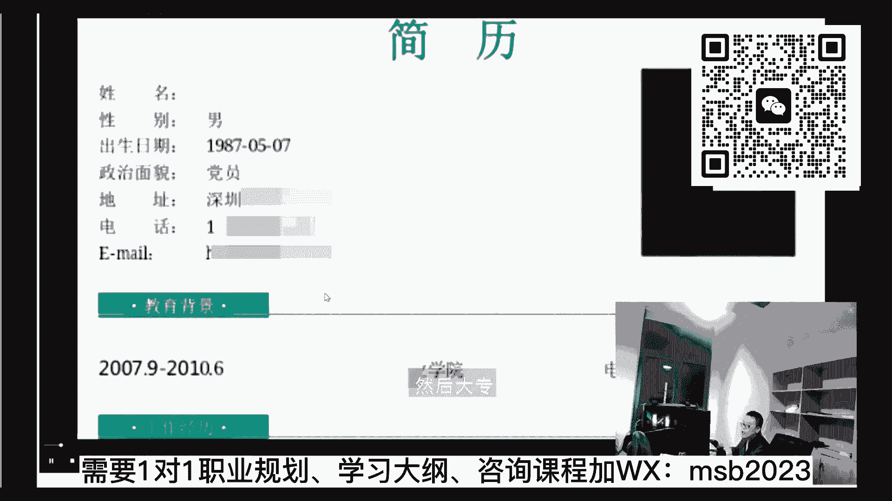

然后一直是在做运维这方面，可不像咱们现在的制定都是这句话呀，这样的话我最后拿到结果还是很不错的好吧。

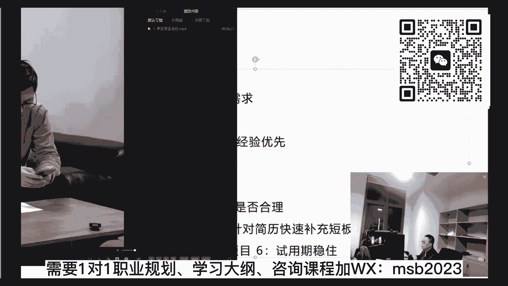

差不多这么一个过程呃，这个呢也是咱们的整体的知识体系了。

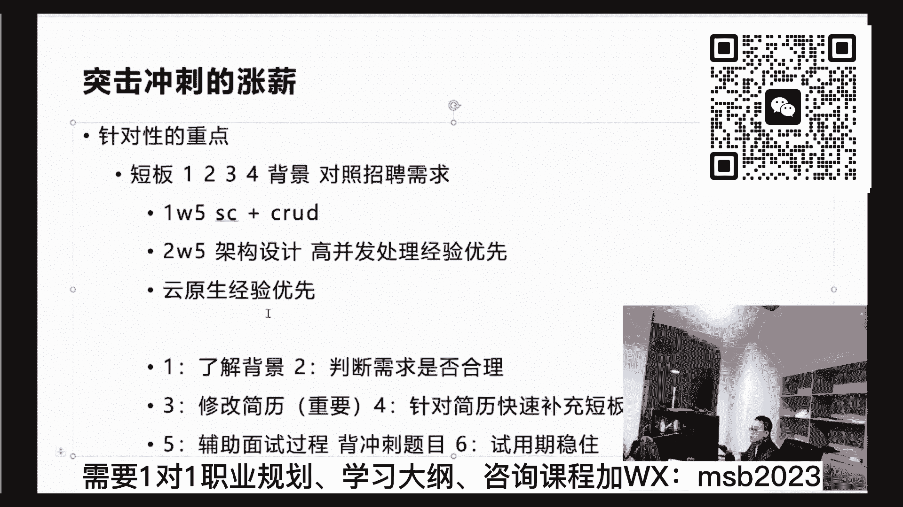

我就我就讲完了，也顺带着呢教了大家呢，你怎么样去做那个突击。

怎么样去做冲刺，怎么样去做入行等等，呃，关于这块儿，看看大家伙儿还有什么有疑问的地方没有，专家会诊断是的，下面我帮大家梳理梳理一下，就是不同的钱应该掌握哪些好不好，就说你不同的薪资应该学到什么程度。

这个可以吗，因为咱们的课呢差不多是从零从零啊，一步一步带大家呢到一个很高的薪资水平，百万左右啊，呃首先我会帮你判断你在哪个台阶上，然后再从课程体系里把，帮你梳理一份定制化的东西出来，这是咱们的特点。

好不好，在多少钱的，差不多掌握到什么程度，ok，讲到这，我就稍微给大家讲讲，这个我们自己不同的路线的事情，其实每个人啊，我我理解啊，就是我做培训以来，从最早的那种大班课嗯，到后面尝试小班教学。

但是一直没有做到一个点，就是一对一啊，就是一对一，就一对一这件事情，我认为那是效率最高的，为什么他是效率最高的呢，就是一个人同样是两个学生，这个学生呢他对spring已经比较熟了。

实际上是没有必要让他在spring spring上浪费时间的，而另外一个呢是什么都不熟，那他就得从头开始学呃，为什么做一份大而全的课，就是因为我想让你在这个大而全的课程里头，找到自己最快的那条路线。

而不是说非得从头到尾按部就班的全球案，不是这样子的啊，所以呢我们一般的呢是你入学之后呢，帮你了解你整个的知识背景，了解完知识背景之后呢，了解你短期的诉求，短期诉求的基础之上呢。

我再来帮你梳理你应该怎么样进行学习，然后我举个例子啊，这都是举例子的过这个呢是一个小例子，就比方说这个学员是一个零基础，它只是简单接触过java语法，没有系统深入过，想在半年之内找到工作啊。

那么这部分该怎么做，先让他第一阶段干嘛，第二阶段干嘛，帮他梳理好这份路线之后呢。

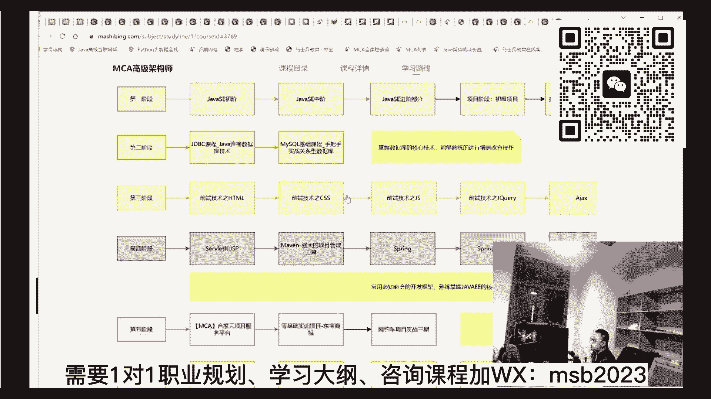

实际上他打开，比方说打开之后就可以学了，直接打开就可以选。

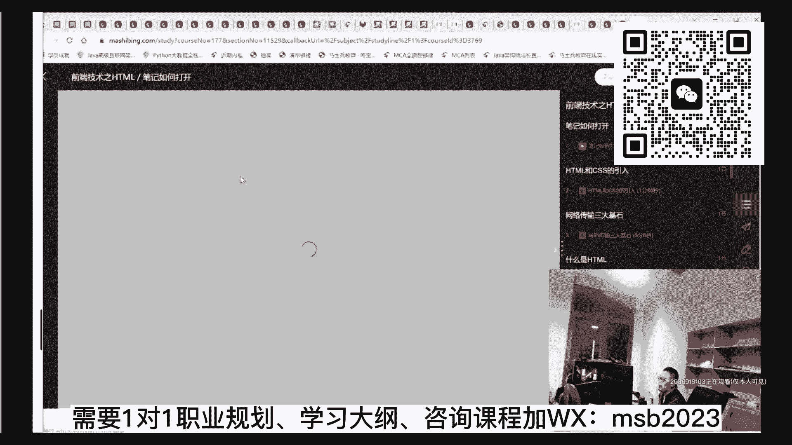

这样他会他会比较省力气，他就不用在那些特定的地方浪费时间，明白了，像这种嗯，我们再再打开一个看看吧，这里面举了几个小例子啊，我们拿这个体系大纲来说吧，就这个的话那就就比较深入了，就内容就比较多。

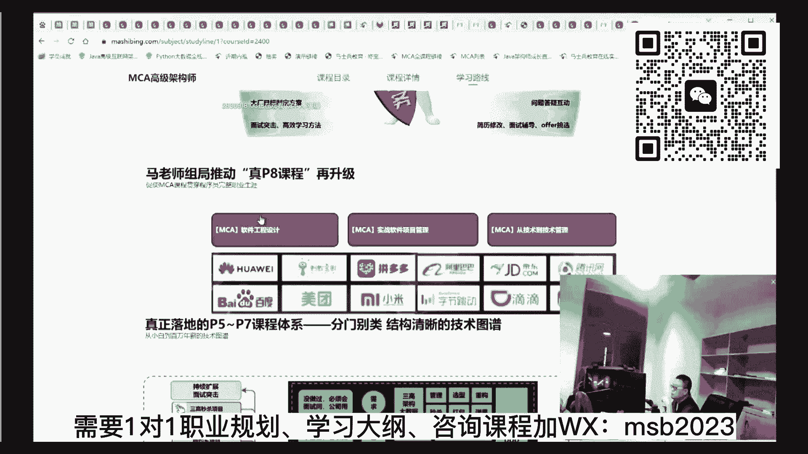

比方说嗯这个项目是吧，音乐数仓的项目。

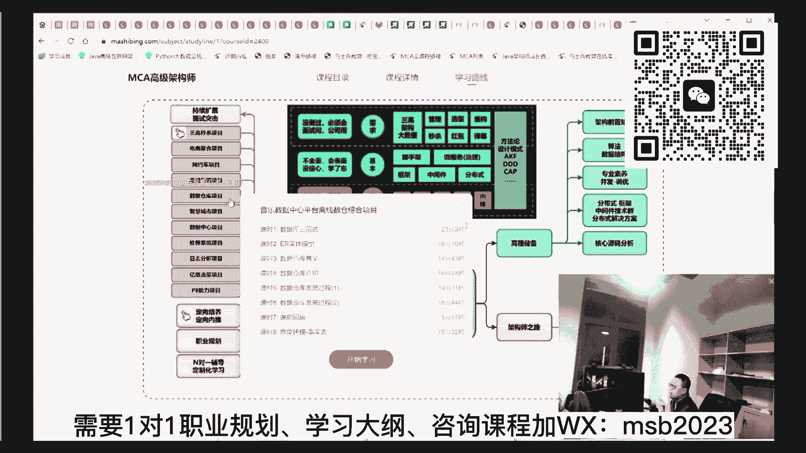

你应该去掌握哪些，再掌握哪些，直接打开看就行了，就是每个人呢给他们不同的路线。

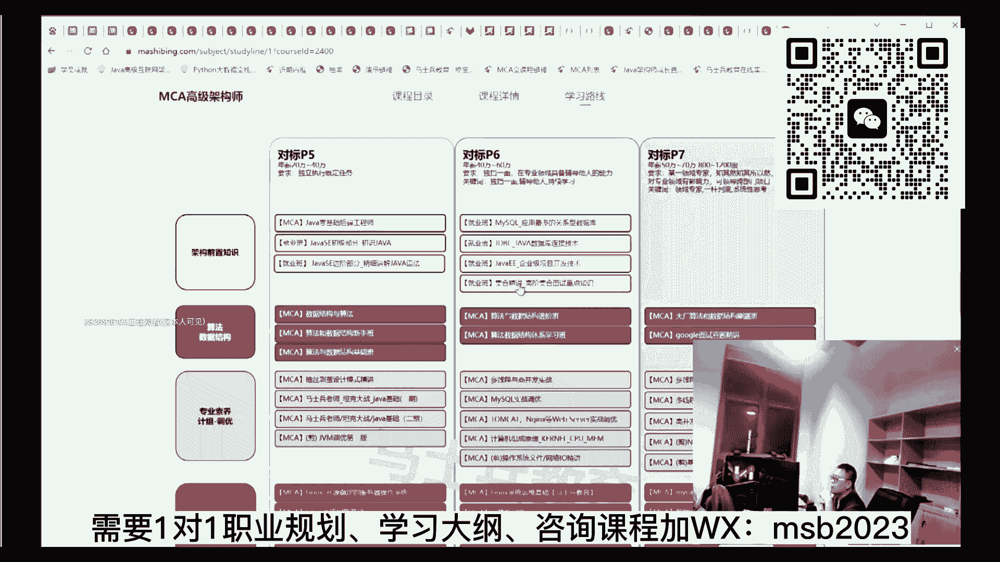

当然这会这是一个特别全的路线啊，就从头到尾特别全。

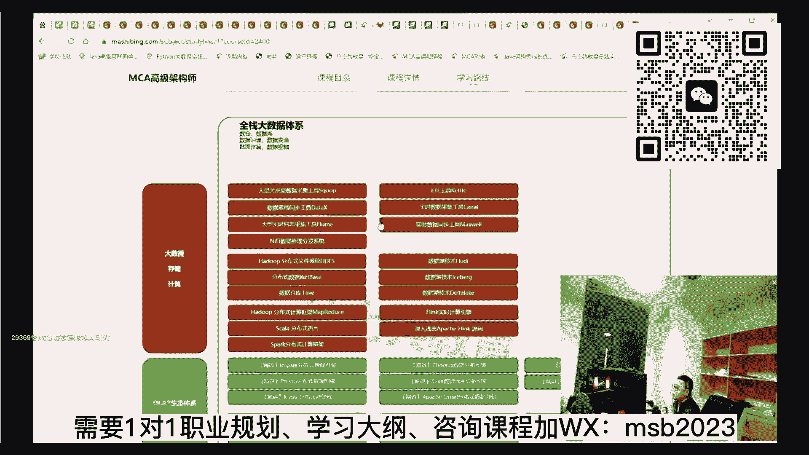

你们没必要搞这么多的好吧，刚才有同学问说大数据的，其实大数据在这里也全都有啊，因为从架构师的角度来讲呢，你这也是需要掌握大数据的呃，帮你从这里面梳理好整个路线之后呢。

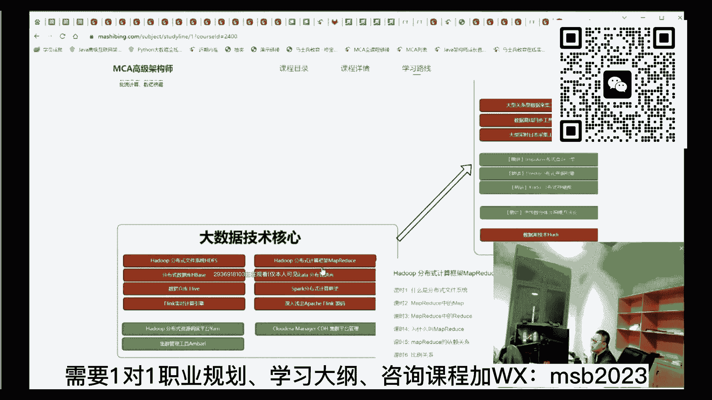

你其实有了这份大纲，你自己就能看见，打开就可以就可以直接学了，这是咱们的特点。

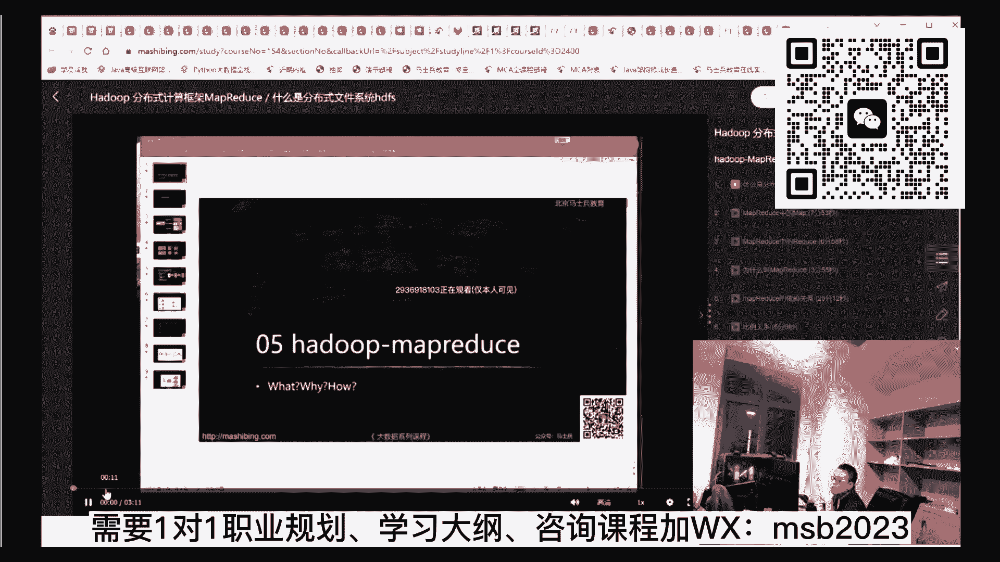

这个到目前为止，好像还很少有机构能够做到这一点的，好吧，就是我想做到真正的一对一，在这方面做出深入的尝试，这个苦心也希望大家能鼓励一下，好不好，没事啊，一会儿大家有什么特殊的问题。

我也会跟帮大家毫无保留的解决，好不好，得喝口水啊，那个。

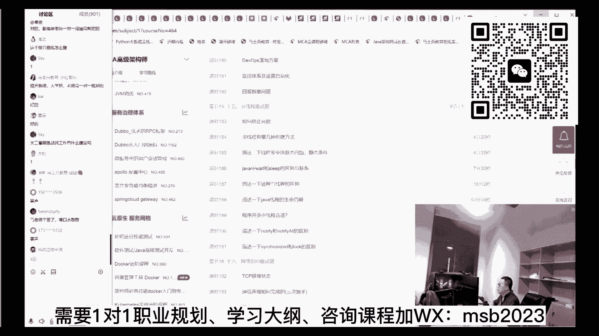

下面我跟大家简单聊啊，因为这个呢每个城市和每个城市也不太一样。

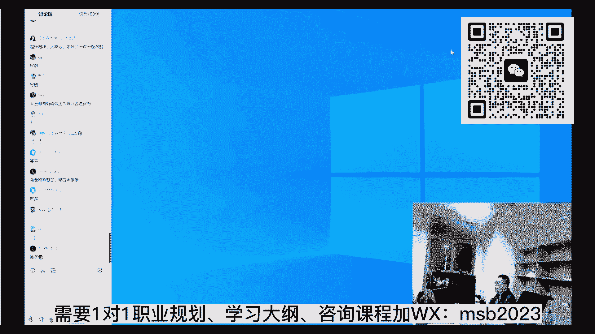

我跟大家简单的就是不同的钱，不同的钱应该掌握哪些好不好，我们就先以那个北京来举例子，因为这件事情呢，钱这件事情啊，他各种的那种那种，偶然因素比较多，他跟那个具体不同的那种地域也很有关系啊。

上海跟北京就不一样了，深圳和那个哪儿就又不一样，每个地域有每个地域的特点，我给大家描述一个粗浅的描述是吧，你就不要说太粗了，太笼统了，这个没办法太细致好吧，但是我大概的你你套用一下。

应该也能知道朝哪个方向去呃，我们就以北京来举例子啊，大家想了解多少钱呢，你了解一下你你说一下我们从低到高慢慢说吧，好不好，北京地域是不是有点高的，我们我们从低到高慢慢说，我们说6000左右吧，好不好。

六七千七八千好不好，我觉得6000~12000吧，这样这样一个薪资水平，这个其实啊就是咱们我我我前面讲的p4 ，这个其实就是我前面讲的p4 ，能听懂吗，我就不重复了。

ok就是那个spring cloud到那个加项目就够了啊，这个月薪其实就是那个批次的水平，ok那么我们说永远有二，到18000就这个水平啊，在北京来讲呢，就是比那个应届的时候强，比应届强的。

1年左右的那个水平不咋地的程序员，这个主要是你要有项目经验了，懂吗，就是你那个项目经验真正在企业中做过了啊，这时候呢哪种心思，然后再熟练一点，再熟练一点呃，spring cloud，什么中间键。

什么m q啊，什么这个缓存是吧，redis啊，什么数据，各种各样的数据存储啊，初步的大数据技术等等，好，这个时候呢项目经验差不多1万，18000~25000吧，因为每个人呢怎么说。

就是每个人他的那个学历也不太一样啊，有的学历的话呢可能到这种程度，没准他拿的就是2万多的薪资了，学历高嘛，嗯不好评估好吧，就快要太开放了，我无语了啊，其实有的时候一个岗位来讲呢，熟练的人和不熟练的人。

这个跨度它不不是很宽泛，好不好，熟练的人和不熟练的人好吧，有的那个学历好的人和不学学历不好的人，他跨度不要远远超过这个跨度，比想象中跨度要高得多，我们就拿入行来举例子入行如果你刚入行，大专生。

刚入行拿不到薪水，或者拿一个6000 8000的，8001万的太多了，但是你刚入行的那种特别优秀的应届生，985背景的进了大厂的，你说多少钱，腾讯去年给的白菜价年薪是40万以上。

外加每个月的4000的房补，你告诉我，你说你你告诉我怎么跟你跟你跟你说，这个你来你告诉我怎么给你给你列这个列列，列列列列列列列这个这个这个这个范围，这个跨度没法跨好不好。

所以最好的办法呢是老师帮看看你的背景，看看你现在的薪水是不是有差距，差在哪儿了，明白了，所以这玩意儿呢你说这个跨度大了，我还觉得这跨度小了啊，好我们说25000~4万，各位同学，所以听我说。

其实跨过25000是一道很重要的坎，就是2。5是从落地到设计的卡，初步的，你从那个落地开始，然后慢慢的转向设计，我跟你说，你要跨越这道坎，就超越超越了2。5~2。5的这道坎，就是相当于你原来的时候。

只是在那个项目组里面扎扎实实的给你任务，你就做的那个人变成了，你可以坐下来跟领导一起探讨，整个技术解决方案的人，这个时候是2。5，他是一个坎儿，在北京来讲，这个大家听懂了吗。

来这块听懂的同学给老师扣个一，对公司不同，我刚才就强调过，就是说这种东西他没真的不好不好谈啊，就是二代二代，就是你的背景不一样，运气不一样，公司不一样，学历不一样，他的薪资前后的跨度差太多了。

就是哪怕你同样的技术点都差都差很多啊，2。5是从落地落地到设计的这道这道这道坎，那么这道坎的话呢，差不多呢，你就开始慢慢的进入到一个可以进行，在换项目组里头有话语权。

那么这个时候是你你需要掌握哪些知识呢，其实就是原理源码，原理源码，然后初步的这种架构选型，呃初步的软件工程等等这些啊，那么再往高里，差不多年限要到50~100万了，就这种程度啊。

这时候需要你掌握的宽度就很高了，4万往上，对的给大家举个例子吧，举个小例子，我这个确实比较粗啊，你要是说那个你特别想评估，你自己的薪水是什么样子，把你的背景告诉我，这时候就能帮你评估出来。

不然的话真的很难评估啊，给大家举个小例子，那个，也是我特别爱举的一个例子，他非常典型，这是咱们就业学员里面的，曾经在腾讯啊拿过90万年薪的一个学员，就这个这个学员好，这是他的面试题。

大家可以可以可以感受一下啊，这个是他的面试题呃，当年在腾讯是90万年薪，这个是一个架构设计，做一个红包雨，30秒抢1亿，进行资源评估，进行那个架构的选型，这能看懂吗，这是他的答案，大家可以了解一下。

就是这道题的它的深度和难度到底在哪里，进行基础组件的选项，进行架构的选项，进行应用的架构的设计啊，进行高可用的接入层怎么做，应用层怎么做，网关层怎么做啊，数据和监控怎么做，日志怎么做等等，呃证实。

因为我们了解到这个深度的这个题之后呢，才为大家准备了架构设计专题，然后才为大家准备了，你像咱们的这个严选项目的，它的具体的内容，严选项目的白皮书呢，呃大家希望大家找找人去要啊，需要。

就是我们现在每一个项目本身，都有自己的白皮书，我看看我这里还有没有可以打开来，给大家伙大概看一眼，在这我们本身呢是要把这个项目给大家做成，大流量高并发电商领域的核心项目，我们的需求的分析到业务。

涉及到应用架构，到那个不同的那种服务的设计，到容器怎么做，怎么部署，到微服务怎么治理，怎么做链路追踪啊等等，这些全在这个一个项目里头把大家做了出来，就相当于呢这份架构不仅帮你设计了，还帮你落了地。

就是所以它是一个很具价值的项目，好吧嗯嗯你说有同学说了，老师你这一跨度就跨了好几10万，这我也没办法，因为你看看刚才那个招聘的时候，你也会发现这一点了，你说他一个跨度，它价格是35000~55000。

他本身跨度就很大，发现了没有，然后2万~4万本身就跨了2万，是不是3万~4万跨了1万啊，16薪55五六十万年薪嘛，所以其实当你跃升到设计这个阶段的时候，你的薪资薪资程度就打开了。

所以跃跃升到架构师的时候，跃升到百万级别高并发处理这样的东西的时候，你的薪资就打开了，听懂了吧，当一步一步来，因为今天听的同学呢可能好多是刚入行，他的他的好多疑问点还在于说。

我是选java还是选go on还是选什么，其实我跟你讲，无论是java还是go on，最后你的初级出路一定是架构师，再往上就是技术管理，要不然的话你的薪资也就停留在语言上，那么语言上的薪资永远是很低的。

他天花板是很低的好不好，那么你想想看，对于redis来讲，对于架构的选型来讲，它跟语言的关系有那么大关系吗，只不过java更适合往架构师走，go on稍微的差一点点就行了，这个意思好不好嗯，嗯行吧。

我这个只能说一个很粗的了，没有办法啊行，待一会儿看看还有什么具体的问题没有，明白了是吧，ok这样啊，现在是10：20，我十分钟，那待会聊一下我们最近的一个活动，然后大家会有什么具体问题我来回答好吧。

呃最近呢我们26号到31号，是咱们整个的m c a项目的这个组套餐，的一个庆典，周年庆典，我们是三周年，那么在这个三周年里面呢，第一你愿意跟老师学，老师就会让你很省精力，很省时间的让你涨薪或者入行。

同时呢我们对这今天开始报名的同学，有一些特殊的优惠，第一个优惠呢是咱们周年好礼的时候，是参与抽奖，由于咱们是三周年的，抽奖给的奖品比较重，一等奖呢是一个macbook pro，二等奖是两份iphone。

三等奖是三个ipad，四等奖是四个大疆的无人机，五等奖呢是哈曼卡顿的音响，五个阳光普照呢是500块钱的京东e卡，这个是会在这个月底31号的晚上开讲，那么开奖的同学前面从今天开始啊。

今天开始26号到31号，周五天报名的同学，前20名除了享受抽奖之外，享受咱们的六期免息，享受咱们的白金的vip卡，赠送咱们现有的全套书籍，另外呢抽奖第20名到第40名呢，是六期的免息参与咱们抽奖。

第四名到60名呢是我们的，你今天晚上因为听听课的同学啊，我发现了啊，就是那种感觉刚入行的同学，甚至还没有入行的同学比较多，本来我们这两门课就是入行的，这个java基础工程师p4 那个课就是p4 。

p5 那个课是单独收费的，p6 到p7 ，这个课呢是咱们架构师的课，是另外的单独收费的，这样今天呢如果你报名架构师课，老师会免费送你一份这个课啊，这个的话，那我就限今天报名的就行好吧。

只限今天报名可以吧，就是说你以后就不用java方向的，你也就不用再报任何课了啊，咱们课就全要了，从入行到架构，慢慢跟着老师学一个台阶，一个台阶往上走，别的不敢说，12年送你上个台阶。

12年送你上一个台阶，这个完全是可以办得到的，只限今天报名的各位小姐听好了啊，只限今天报名的马老师，这个课堂送的听懂了吧，其他的就不送了啊，嗯入行是从基础课开始，对啊每次都有都有同学问多久能学完。

不要太指望学完这件事，就说我还是那句话，就是以台阶为基础，比方说你想入行，其实刚才有同学问了，说我三个月不吃不喝的。

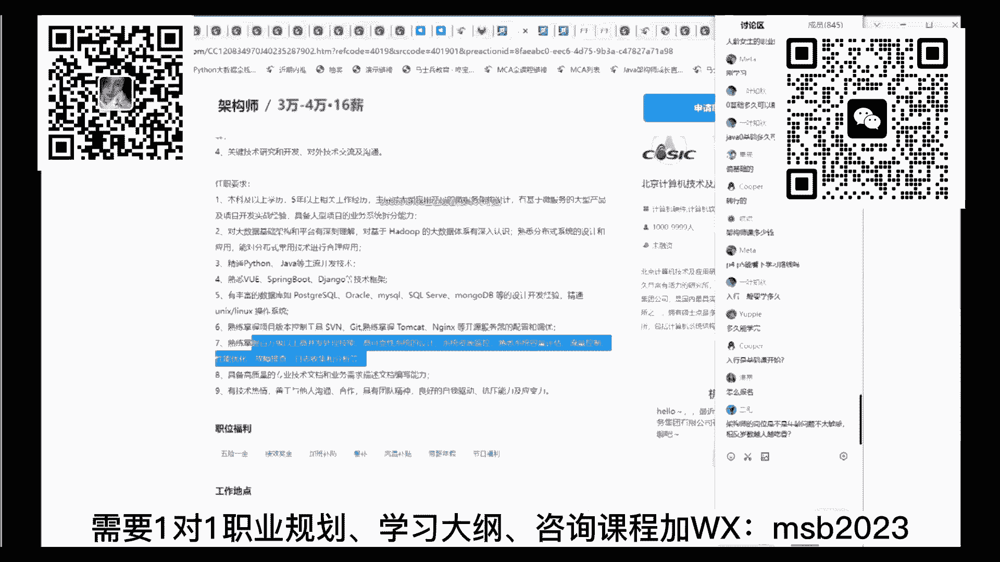

每天都在学，行不行不行，够不够够了啊，绝对够了，所以以目的为基础的学习，定制化的学习是咱们的特点。

希望大伙能慢慢接受这一点，你会发现要比那种对所有的人，课程的内容都一样的那种学习效率要高得多，好吧，这是咱们最近最新就业的一些同学学院的信息，这里面大概是1200位学员，无一例外，要么涨薪。

