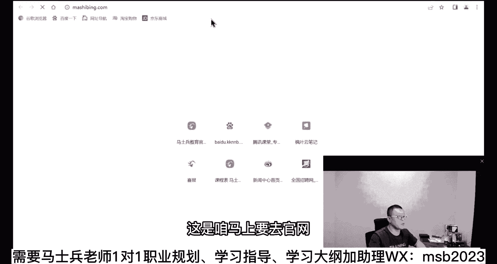
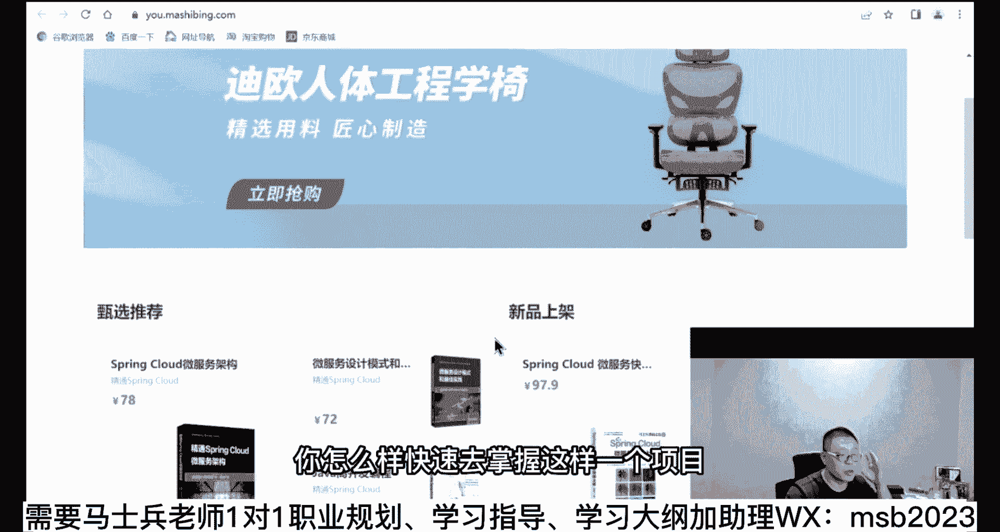
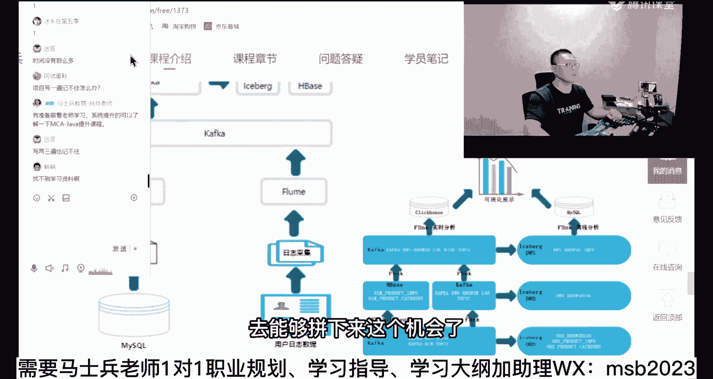
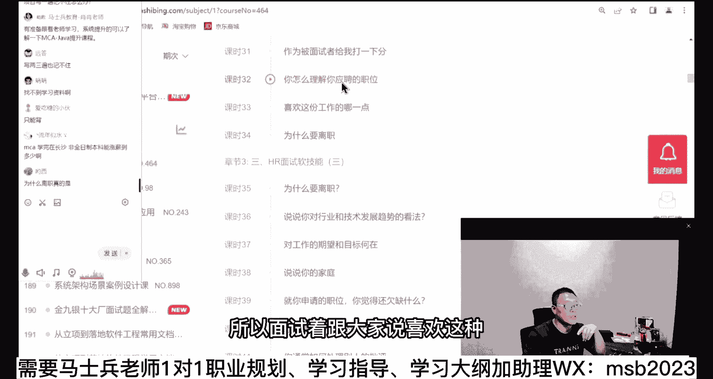
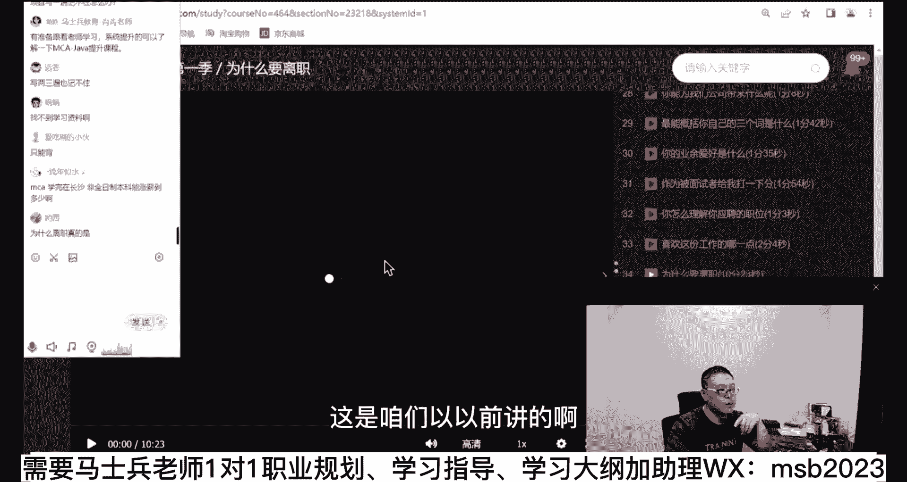
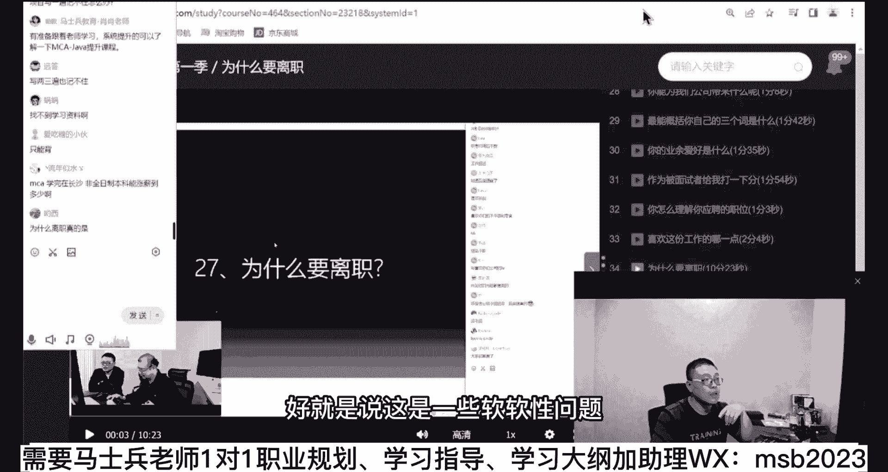
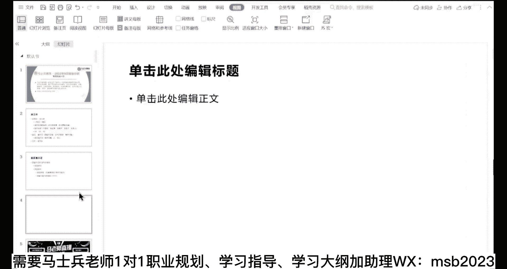

# 马士兵教育MCA架构师课程 - P50：【2023】你为什么面试通不过？从底层逻辑分析！ - 马士兵学堂 - BV1RY4y1Q7DL

下面我们来聊，面试通过的问题，呃首先大家说啊，大家真听，就是这个面试通不过呀，呃这件事情的本质是什么，技能不过关，小部分的原因呢越久越好，这概率不行，后面这个老师帮不了你啊，就你运气不够好。

老师这事儿真帮不了你啊，我我告诉你了，你说你学的这个差不多90%的概率，你能进到大厂里去，但运气不好，但是就是就问这10%，我也没脾气啊，但是我们下面来解决这个主要主要的问题，就是这个技能不过关的问题。

各位同学你们想一下啊，就是说你你写了一份特别牛逼的简历，然后你拿到面试机会了，然后人家问你分布式，人家问你高并发啊，人家问你互联网三高，你该怎么处理，你丁点都不会，你肯定是过不了关的嘛，你说是不是啊。

那这时候该怎么办呢，就是你第一次的面试，你一定是被被灭了，10000%的被灭了，那这该怎么办好，该怎么办，突击恶补，这个是短期的解决方案，正常的解决方案呢，正常的是系统学习，按部就班呢，你如果时间够。

比如说你今年大三研二这一类的，我建议你永远都是系统学习，这成功的概率就高多了，系统学习完了就不展开了，大家都明白什么意思吧，按部就班的，按照你可以你你要愿意找找我们老师，要一下课程大纲。

你按照课程大纲一步一步来，时间够，这是最好的好，这是系统学习，那么第二个事呢叫突击恶补，我下面教大家怎么突击恶补好不好，来准备好的同学，老师扣个一，我下面教大家怎么突击恶补，就是学东西的有些技巧。

有一些非常快速的技巧，教大家，好多同学听我说，我我我们就用，我们我教大家几个学习的技巧啊，这突击我不该怎么补，按照不同，其实不同的方向都有不同的恶补的方法啊，这个你要是愿意找我们老师来带。

你是最最合适的好吧，我们带来的学生也太多了，你们就可以去人家的，不不不蒙你们，你们仔细去看看我们的案例就知道呃，突击恶补该怎么补，这么来补，我们我们就用那个java来举例子啊，适合其他所有的语言啊。

但是有一些那种不适合的呢，可能是这种什么测试的方向啊，然后晚安的方向啊，这种就不太熟，但我教你啊，呃最快速的方式叫项目驱动，请大家一定记住这一点，今天有多少人，今天有多少人是根本就不懂什么叫高并发的。

什么叫分布式的，什么叫那个互联网三高的，有多少人，你给老师扣分，我看有多少，应该挺多的啊，那真的你们差的有点多，不过没关系啊，举个例子啊，这是咱把这个教育官网。

然后往往下拉打下来之后呢，有一个叫马士兵严选。

看上去呢这个东西呢是一个是一个网网站。

然后是一个电电商平台，还是一个网站往外卖东西的是吧啊，你买了买了这个之后呢，你也可以暂无库存，你也可以那个进行相关的一些下单啊，只要并发编程啊，假如购物车立即购买好，你进行登录等等。

你可以去自己自己去试好吧。

这是咱们呃，是这样的，这是咱们开发的一个教学项目啊，一个教学项目好，我教大家呢就是说在你什么都不懂的情况下呢，你怎么样快速去掌握这样一个项目。

你连你连什么分布式什么都不懂啊，如果你打开这个项目的一些个呃细节。

因为这个项目呢，嗯大概啊呃就是我们是二三十个开发人员，大概开发了好长时间，第一版才出来，就是它不是一个那种那种demo级别的项目，呃，他前面看上去比较简单，但它的后端呢其实比较复杂啊。

我给大家列个前面去，我们看它后台的这个架构，看到了吗，比如说我现在就想要一份，对于离怎么怎么怎么去去，我要在我的简历上要写出来，我这个我要了我要了我，我要理解这个后面架构的这样这样一个东西啊。

我简历上我要写啊，说我我我是理解这个架构的，然后我才能有面试机会，对吧好，那么你这时候你怎么去做呢，实际上你应该这么来做，首先去大体理解啊，咱们整个的架构包括哪些东西啊，这是咱们的运营。

这个这个这个这个不同的用户是吧，然后他们管理的是接触到的是哪哪些东西，然后呢，好下面是一些具体的一些呃这种技术的名词啊，技术的组件啊，包括remyself l rocket o s s短信。

e s lock sth开头，然后你像这种那么在后端的这些个支持高并发，高扩展弹性的这个架构里面会包括呢呃网关，包括我们的微微服务设置，包括我们的技术平台，包括服务的治理是吧。

服务制里可能又有一大堆名词，这个名词你可能一个都不知道，that vigate jenkins，docker k8 s吗，这些我就假设你现在连名词一个都不知道，好不好。

那么你该怎么样快速学习这样一个项目，大家听我说，你们的学习，应该首先是快速浏览整个项目的开发过程，如果有的话，你说的是我们vip快速浏览整个项目的开发过程，里面的好多名词你听不懂都没关系。

我需要我需要你建立的是一个这是一棵树，一棵树的概念，就是你掌握一个知识的时候，有两种学习方式，第一种学习方式呢，就是我们从小到大一直在用的，我们必须把这个树枝树叶的树杈。

树上的那点小蚂蚁学完了之后学特别深，最后呢，我们才能够把这个东西组合成一个，最终想要的结果，或者叫项目粗浅的例子，就是我们平时的学习，是我们一定要去深入的学习，e s e s网安装有哪些语法。

然后又该怎么样要去进行调优，怎么样去配置，配置的细节，有什么，这个参数是什么，那个参数是什么，把这个学完，然后接下来呢我要是用c塔，同样的再来一遍叉叉job，好不好意思，再来一遍redis，不好意思。

从头到尾再来一遍，正常的学习方式是这么来学的啊，这个这个大家能理解吗，就你们从小到大的学习方式，基本都是都是这种学习方式，我们摁着一个点，一定要把它学学细致了，学到位了，各种的细节全都掌握住一个点。

掌握不住我这个焦虑啊，哎呀我掌握的不踏实啊，心里有一种不踏实的感觉，来这块能听明白，老师扣个一不知道，我说我说我表达我表述的有没有问题啊，就是这种这是一种学习方式。

我们其实呢是作为一个知识术数知识体系来讲，我们讲一个知识数上，实际上他每一个这些东西都叫做一个树杈，或者叫一个叶子，我们以往的学习方式都是从叶子开始学，但我今天告诉你，最快速的效率最高的学习方式是什么。

听我说，如果你从叶子开始了解整棵树，这个效率一定是非常低的，你得爬遍每一个叶子，最后才能对这个数产生一一个总体的感觉，当然我不是说这种学习方式不好，他会很扎实，让你走的，让你让你早早。

我刚说让你走的很安详啊，这不合不合适，就是让你往前走的很踏实，你心里头不会慌，但是下面我推荐你的是另外一种方式，如果你想快反过来，这些东西全给我略过，说怎么安装，怎么配置，配置细节是个啥。

扔一边啥都不要管，首先去顺着这棵树，把最粗的树干给我捋一遍，怎么与，如果你要听我们课上来，就是教你怎么把它跑起来，怎么安装好，然后呢会告诉你会涉及到哪些组件，每个组件干什么。

我告诉你spring gateway大概是处理什么问题的哦，原来全面来了嗯，流量之后后面有一大堆服务给他服务啊，他需要路由到哪个服务上，这服务之间的又是怎么样进行耦合，怎么样进行调用的啊。

我们压测怎么样进行链路追踪的等等，查他是干这个事的，好，我大概大概明白了，就用那种形象化的思维，一定不要去追求，说我每一个细节都了解特别到位，就是你这种学习方式一定要反过来。

那么这个时候呢你做出完第一步的学习之后，这个速度会很快，你会初步的建立什么概念呢，每一个组件大概都是干嘛使的，gateway，干嘛的，微服务干嘛呢，据中台里面所涉及到的这些sea是个什么玩意。

它处理什么什么什么问题的，就是它是什么，解决什么问题，首先把这件事儿大体你就可以搞定了，哎大家还在听吗，啊这有点有点那个其实很枯燥啊，我就给大家讲这个还是还是有点枯燥啊，不知道大家能不能停进去。

但我告诉你这个速度是最快的好，接下来接下来你用这种反向的方式，首先去了解整个知识体系，知识架构，首先把这辆车你先学会怎么开，然后再去研究什么齿轮是什么，什么样的一个构造，为什么是这样的一个构造。

它的细节参数什么弧度是什么，切切入角是什么什么这个离离离开角是什么，再去研究这些深入的技术问题，而这些问题叫做，叫做非常的繁琐，特别多，成百上千，所有的技术细节。

你想追求百分百掌握这件事情是完全不存在的，我劝大家也不要追求这个，而你们平时的所谓的这个在地铁上的一些学习，看篇文章，基本上就是说我掌握了叶子上的某一颗小蚂蚁，小脉络，看上去每天都在进步啊。

战略战战术上非常的勤奋，但实际上这个效率极低，非常的低，我希望大家呢今天用以后的学习，我建议大家用项目驱动的方式，为什么要用项目驱动啊，很简单，因为我们最终的目标是要做项目，所以我们要用项目驱动。

用项目驱动的方式反过来学，大家你想想看，作为gateway或者说作为security，或者作为promifs或者graph fa这些东西，它里面的细节千千万，我碎片化的知识时间就可以去掌握它了。

上个厕所蹲一会儿，我可以看看cq里一些东西，一些简单的配置是什么，我记住也好，记不住也好，关系并不是那么的大，因为我知道这是一个概率问题，我记住了，我可以拼，那个60%概率我记不住。

我就拼那30%概率没有什么的，反过来学你就没那么焦虑了，反过来学还有一个巨大的好处，就是当你跨越到架构师的时候，你会发现反过来学的时候，天生就具备架构思维，因为你了解了这些架构架构的图。

它大概位于什么位置，每一个是处理什么的，虽然说细节这样东西还不知道什么，怎么拖过来的等等，当然你想我们的话就整合了很多很多东西吧，就是基本上这一个项目下来，所谓的互联网通讯级别的这种项目就有了。

我想这项目重不重要，这种方式学习好像很难找到资料，找什么资料啊，是不是我们老师们讲的基本上都是这么讲啊，我告诉你效率是最高的好吧，来关于这个这种学习方式，如果还有同学有疑问的，你就直接问，没有问题的。

你给老师扣个一，我们就继续好吧，你像作为我们这个项目来说呢，我就教了大家，不仅教大家怎么做那个分布式高并发，互联网三高高弹性，这些还教了大家呢大数据系列的知识是吧，数据多了之后。

哎你该怎么样进行相关的一些处理，这些这些名词你可能都不知道，什么叫互相一体啊，什么叫可怜house floo，什么叫做blog是吧，什么叫flink，你可能都不知道，但是没有关系。

你只要粗略的把整个项目的构建过程，了解完了之后，然后呢再去找对应的细节课啊，我们这些细节课也都有，前两节课一听你就知道了哦，原来这个东西是处理这个的啊，flink原来是实时实时处理数据，一个数据流过来。

我实时对待进行处理，好了你大概大题就知道了，好你这个时候哪怕你这个时候去面试，兄弟们，你们想一下，你跟那个面试官是不是也可以侃侃而谈谈什么，谈大体的时候我接触了接触过哪些东西，各位能听懂吗。

你是不是就有一定的概率去能够拼下来，这个机会了。

我可以负责任的跟你讲，很多很多很多的这种面试，他其实就问一个大概一个粗略的大概知道吧，我不知道有多少同学参加过面试，有很多要求不是那么高的工作岗位，他的面试过程大概就问问你诶。

你们这个用的用了哪些东西啊，呃你们这里是用到了什么位置啊，你在你在这个项目里面是哪个业务点上啊，用到了哪哪哪些技哪些技术框架呀，基本就问问这个，还有这块大，你这时候就已经的概率能拼进去了。

只能背背也是很好的方式啊，同学们就是作为突击这件事情，请同学们记住我，我教大家背还是狼的小伙，我教大家背，就是背是一种很好的方式，你千万不要小看这个背，我跟你讲，你面试的时候背过的东西，噼里啪啦。

把它把它跟面试官讲出来，你的成功的概率是不是就有了，你好好琢磨嘛，这是面试中很重要的一款和一个部分，讲着呢就说我就拿我们课举例子，目前在讲的是咱们的金九银十的突击班啊，突击课。

我们拿以前讲过的突击课来给大家举例子啊，什么叫突击呃，这是那个呃34月份的时候突击课啊，你你可以看一下这个突击课我们讲什么，这突击课呢，大概首先教大家呢hr的面试软技能啊，这个很多人可能不知道。

就一般来讲呢，如果你是一个hr嗯，他上来灭你的时候，很可能会面临一些软的东西啊，比如说你为什么辞职啊，你对心理有什么要求啊，平啊有什么问题还要问我吗等等，这个好同学也答不好，所以我们首先我会教大家。

你怎么去背这些问题，背这些什么问题呢，就是别人问你这个时候应该怎么答，问那个时候应该怎么答，我问这个时候该怎么打好吧，嗯擅长的技术方向是什么，最能概括你的业余爱好是什么，作为面试和大家分喜欢任务。

为什么要离职啊等等这些，这是咱们以以以前讲的啊。

好就说这是一些软软性问题。

这就是让你背的，你突击吗，你突击不背，怎么可能好，接下来还要背什么呀，背什么，教你怎么写简历对吧，然后呢教你怎么写项目，因为现在所有的简历都离不开项目，然后你就开始背了，基础面试题给我背背。

这个就是基础的面试题，那个呃，多线程呢就是并发的面试题给我背一背是吧，这把面给我背一背，没没关系啊，我就我就这么跟你说，你可以不会啊，可以大体就了解一点点，但是你给我背题就行了，还是那句话。

哼我们原来的呢是讲不过大概400多道题吧，包括软的啊，其实硬硬的题大概有300多刀，这个不用太大家太焦虑，因为这个东西呢叫做比方这400多道题啊，你你掌握了你掌握了四道。

你的概率是不是比什么都没掌握要好得多，这题你掌握了100道，你肯定比那个只掌握20道的，是不是概率要高得多，能理解吧，所定越多越好，你可以在没有完全掌握的情况下去面去拼嘛，你用我前面教你的方式。

拿到了很多面试的机会，你这剩下的不就是拼的过程吗，最多的同学灭了32次成功的，但是没关系，你只要解决了心理问题，你就算面320层，你因为你知道你一定会成，怎么突交这么多，我跟你说了，你完全可以突击。

少一些去拼你概率，你一边这叫以，我们叫以战养战，我今儿有一面试，然后我今天来不及了，我只背了五道题，没关系啊，先去面，回来了之后诶，积攒了一下，他问了我一些新的问题，好我们加上新的问题。

加上再背一些新的问题，明天呢我就是15到后天呢就是25的大，后天就是40~50兆，你在一边找工作的过程之中，你这个概率就缓缓步在提升了，我一般不背八股文，直接改源码啊，你牛逼，各各各位这块能理解吗。

能理解吗，所以面试的这个过程啊，就说嗯背是需要你背一些题的，你可以快速的先掌握某一些框架的东西，然后呢别人问你这个框架的时候，你先去背一些这个框架对应的题，你甚至都没有搭搭建过，甚至都没有上过。

手都没有关系，笔试了怎么办，笔试一样吗，笔试除了算法之外，我可以说其他的跟面试，你跟背题有什么区别，除了算法之外，我就问你对不对，好所以突击恶补项目驱动，如果你你大块知识没掌握的项目驱动的方式。

先掌握大块细节知识没掌握的怎么办，玩命背就行了，背题啊，你要有时间去搭搭搭环境，去实验大环境实现一个小问题，能卡你两天，那个是需要时间的，好，我一会儿讲算法，别急，好，这块大家能理解吗，同学们好。

接下来啊，我看有同学问说老师啊，项目问题怎么办，项目问题问的很细啊，这个我很了解项目问题为什么会问的很细啊，他是不会这么问，一般会这么问，那个你们项目给我做个介绍好，你做了一个简简简短介绍。

你们现在用了多少人啊，哪些人都在干什么呢，你在其中的角色是什么，你们项目用开发了多长时间，你开发的是哪个模块，你用到的技术是什么，你做这个技术的时候有没有遇见过一些痛点，难点难以解决的问题。

你们上线之后有没有遇到一些bug之类的，你们怎么处理的，你们这个地儿是怎么设置的，那个地儿是怎么设置的，如果我说这个量突然大了之后，你们又是怎么处理的，同学们，你们想想看，是不是又问这些问题。

我告诉你大概18个，大概18个啊，这些呢老师早就帮你总结的非常到位了，就是每一个项目围绕着，总共大概基本上有18个左右的问题，这个很简单，提前准备，我对学生的要求，就是你最近新做的两个项目。

你要针对这18个问题写在本子上，给我写下来，然后把它背过，背的时候怎么背，对着镜子，前面有一镜子，你要看着你自己的表情，你什么地方该挠下头，什么地方该打下扣，你给我干这件事，以前有一个专科的同学。

就靠我教的这套方案，第一次面直接定汉王，就是当时那个那个时间时间有点久了啊，汉王现在好像也不在了，你知道他们整个班找不着工作，那是忘了就真没法给你列了，我得给你打开，我的我的我的我的那个那个那个教案。

这个这个没法给你列啊，围绕一些新的，你像我们那个比如说啊，跟我们学的这个严选项目，别人问你该怎么答呃，给我们学网约车项目，你别人问你，你该你又改怎么打啊等等，这一节我们都在我们突击班里教大家。

就是一个一个的教啊，别人问你这个你该怎么答，别人问你那个你该怎么答，你的简历该怎么写，所以你排练一下，还是那句话，你不下苦功夫，你不可能得到一个很好的结果，因为你们的找工作是很粗糙的。

随便网上考个简单的模板，噼里啪啦的往上一堆，好多人连错别字都不改，然后就开始海投，投了一大堆，说老师没有人找我面试，那不废话吗，那不可能有人找你面试，你让我这个他不可能他不可能没人找你面试好。

我还是那句话，用的概率，你比方说你第一次不行，第二次第二次不行，第三次你的面试机会只要有，你就可以一直这么试下去，一定有一次你成了大多数人，基本就在十次以内就搞定了，为什么。

因为每一次的面试会间隔开时间，中间的过程你可以找老师来聊，我这次面试哪哪哪编的不好，我需要有哪些新问题需要总结，有哪个问题我答，我认为答得不太好，老师该怎么回答，这是面试陪宝听懂了吗。

好这个时候你一定有一次你成了，但是马上下一次，下一个更加更加难的问题就又来了，马上下一个更加难的问题又来了，好我我我讲到这里，关于我以前下面讲过的这个这个步骤，还有没有谁有疑问呢，有疑问你提没有问题。

我讲下一个步骤更加难的一个问题是什么，待不住，你面过了，面过了，呆不住吗，面试间隔多久比较好，这个无所谓，这个没有一定之规的，你只要间隔开啊，别让他们俩重叠了就行了好吧，上午10。1桌面试。

结果你又安排一个，上午11点昌平面试，那你不完蛋了吗，好下面我们解决下一个问题。

