# 马士兵教育MCA架构师课程 - P52：【2023】大龄程序员应该怎么在当下的环境下生存于发展？ - 马士兵学堂 - BV1RY4y1Q7DL

或者说所有的中年危机的核心点，其实就在于你没有匹配这个年龄，应该匹配的素质，年龄匹配能力的，我们拿i t的技术人员来讲，有n多人我是见过的，他在32 三岁，34 五岁的时候，他干的活还是c r u d。

他和那些个23岁，23岁的人的区别就在于都能干，他更熟练一点，无他为手，熟尔干了10年的cd还是cr v，你豆芽子长一梵高，他还是个菜，他脱离不了豆芽的本质，所以你必须具备。

这个要和年龄有对应匹配的能力，下面我告诉大家年龄匹配的能力长什么样，听我说年龄匹配能力长什么样，一般来说就是由精到宽，我们我们我们先聊技术啊，技术呃，一般来说就是由经。

到宽如果你在30岁的时候还意识不到这一点，孩子呢追求各种各样的技术，细节线到里头拔不出来，我跟你讲，你再牛逼牛逼牛逼不到哪儿去了，我们讲我们学的技术叫工程技术，没有那种说只有你会，别人不能会的。

也就是说你不具备那种不可替代性，你就是把那个linux底层的源码，你全给他背过，你也不是说不可替代的，甚至说你好多时候都是用不上的，就说这是你的能力，但是你能力未必能够发挥的了，你还是用不上。

你也是浪费，这时候要由经到宽，就什么叫由经到宽呢，刚当你最开始的时候，你入行，你可能做的呢其实就是1米宽，但是你做的特别深，你要能落地吗，1百米深你就专门做这个齿轮了，我就找一个车厂专门去做这个齿轮。

我就能进去，但是你这一辈子如果只做了一个齿轮，你在这个车厢里头，也就只能像一个螺丝钉那样钉在那，如果你想追求更好的发展，更高的职位，更好的收入怎么办，让你的技能站慢慢变宽，不能变得宽的，可能没那么深了。

慢慢可能会变成1百米宽，23米深，深的可能78米深，ok大多数23米深其实就可以了，你认为一个架构师他会懂各种各样的语言吗，所有的语言全知道，所有的框架全精通，并不是他只是了解大体的大概的。

然后有一些特殊精通的地方，原来做过的，但是呢它能够综合运用，把它消化掉，另外呢能够和业务结合，也就是他的沟通能力上来了，我不知道大家发现了没有沟通业务，然后技术呢由精到宽。

也许在你最开始找一份工作的时候，我只会一个前端js我就能找到工作，但是当你慢慢的要想出人头地，要想成为那个护士长，要想成为那个车车间主任，你说该怎么办，你懂得要比那个简单的车工，铣工罢工要多一些好。

你该你该你该怎么去做，你可能要你就算没有做过大数据，你大概要了解你没有做过ai，你至少要大概了解他他是个什么东西，大概用什么干，干一些什么样的事情，跟别人聊天的时候能聊得出来，然后呢，你没有做过前端。

你可能不是主做前端的，但是你至少要知道前端断定跟哪些框架，一般来说做什么样的东西，当用多少时间等等，没有做过ui，没有做过设计，没有做过产品，但是没关系啊，你是不是打过交道啊，多了解一些，多了解一些。

只有这样，然后你才能带领手下方方面面的小组合到一起，完成一个完整的产品，能理解吧，说我只懂这一块，反正我只感兴趣这一块，我只留在我自己的舒适区，我我我不出来，我反正现在感觉自己素质很好。

只当你一抬头看路的时候，突然间发现哦，原来其实我差很多了，多了解一些宽度，多一些，你才能够慢慢的走向技术加管理的岗位，我这么跟大家说，所有的稿如果只存留在纯技术，纯工程技术，其实到头呢薪资也高不到哪去。

最后一定是要技术加管理的，大家千万千万不要对管理这个词，抱嗤之以鼻的态度，或者是报那种无所谓的，或者说对自己一个定义，我就是和人打不了交道，我就天天我就喜欢天天和机器打交道，那你没办法。

那你就只能把自己作茧自缚，缚在那，好多人说技术的岗位，慢慢的啊，我要成为初级程序员，中级程序员，高级程序员，架构师，中级架构师，高级架构师，产品架构师，业务架构师和我的解决方案，s solution。

architect，解决方案架构师等等，产品经理呃，项目项目经理，技术经理啊，c t o等等，但是你想过没有，其实到项目经理到产品经理，到呃我们的这种c t o这种级别，它实际上已经结合管理了。

发现没有，所以就是技术加管理这条路，你要你要走啊，有好多人不爱跟人打交道的，你要走出那个舒适区呃，以前有同学说，老师啊，我那个原来搞技术的，现在有一个机会让我带一个团队二三十位，但是我有点费劲。

我不知道该怎么搞，没有人天生会美国，没关系去干，都是在打仗之中慢慢学会的去干就是了，他带给我的挑战，有可能拿到更好的薪资，甚至有或者是有可能我拿不到原来的薪资了，都听我说，所有的收益都带有一定的风险。

管技术是一个特别确定的事情，他非常确定我给他一，他一定输出一，给他二，他一定输出二，这就是好好多技术人呢，他到最后呢他他他就喜欢搞这个了，因为他听我的，你知道我能把控，但是你管理会是和人打交道。

人可不一定听你的，ok表面听你的，背地里未必听，就算听你的，你做的决策是不是对，是不是合理，能不能配合好，也不一定，所以呢它带来的是一种不确定性，请大家给我记住一句话，确定性给你带来的有可能是不可替代。

在这个位置上，你们公司就这么就这么一个人，就会就你会的技术比较精啊，你就研究特别多啊，你就一定程度上的不可替代，但是同时也带来的是不可提升，说这个人不能替代，我能不能够提升他，兄弟们。

你们好好想想这件事，这个人坐在这个位置不可替代，我会不会提升他，10000%不会，所以一定程度上你保稳稳了就没有收益了，就没有风险了，你你怕风险就也也就没有收益了，所以走出舒适区去迎接，去拥抱那个风险。

就为什么我们在课程到最后的时候，给大家讲一些管理性的东西，就在于这，我希望大家会展开自己的视野，走出自己的舒适区，舒适区去拥抱那个不确定性，这时候带来的才是更大的收益，管理到一定程度。

我离那个公司的赚钱业务逻辑，最近c t o我离得很近，我赚的钱一定比那个离得远的人赚的多，当一颗螺丝的人，我肯定比他赚的多，如果说我自己对这个业务都了解了，你了解怎么技术怎么实现的，也了解生产了。

也了解，运营运营了也了解市场了好，但这个时候呢我觉得这个平台已经控制不住了，那下一步你就去创业，你的人生就打开一个更新的空间了，是不是啊，同学们嗯，所以呢你的年龄要匹配你的能力呃，各位年龄大的同学呢。

也不要太过于就是过去的事情让它过去啊。

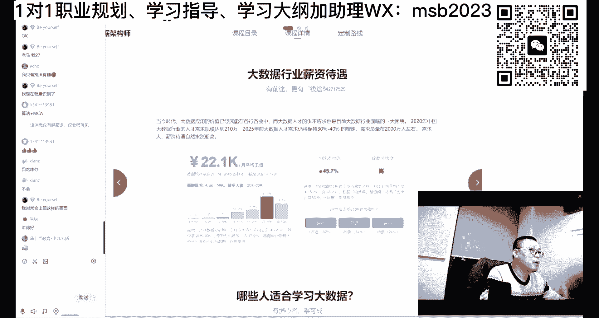

也现在呢也不要太太太太自豪啊，太说我我纠结啊，说我过去我没有努力过，我现在努力还来不来得及，我跟你说任何时候的努力都来得及，褚时健是80多岁创建的出城，ok呃，任正非44岁才创建华为好吧。

你们比他年轻多了吧，好多啊，这种案例非常非常多。

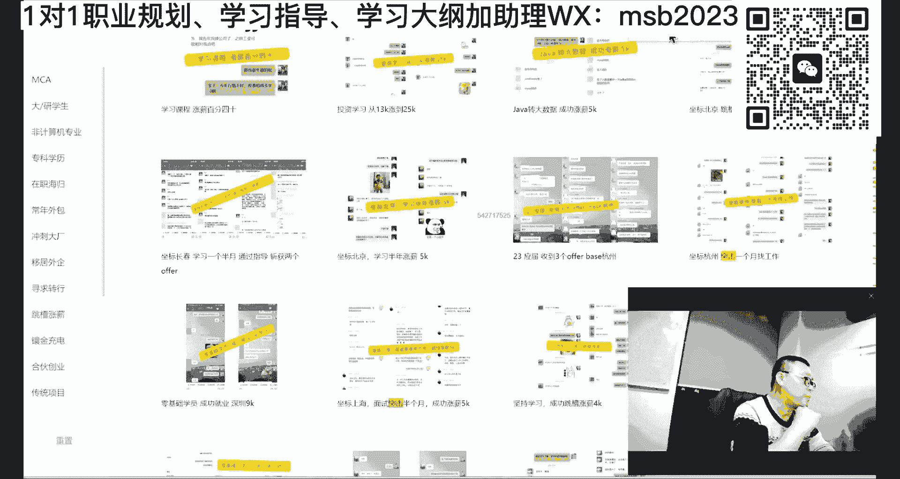

去干去干就是了，所以不要老跟我聊，说我35岁了就怎么怎么样，35岁还年轻的很，我我给你看几个我们年龄年龄的案例。

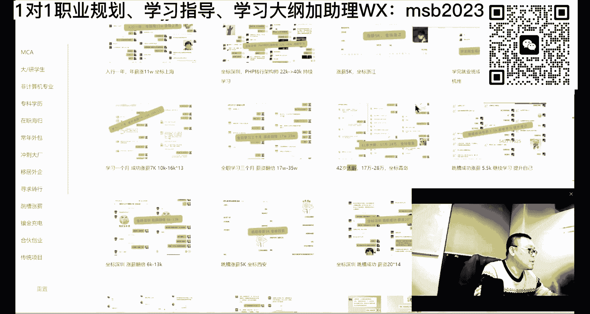

这是42，42岁的41岁，ok他通过一段系统的提升之后呢，他为他原来还是c r u d啊，就是就是就是那个啥好多视野都没打开，通过我们的提升之后，你自己看值不值好不好，17万，现在28万。

老师给给的任何的案例都是实实在在，真真正正这里头没有任何一个是给你屁股。

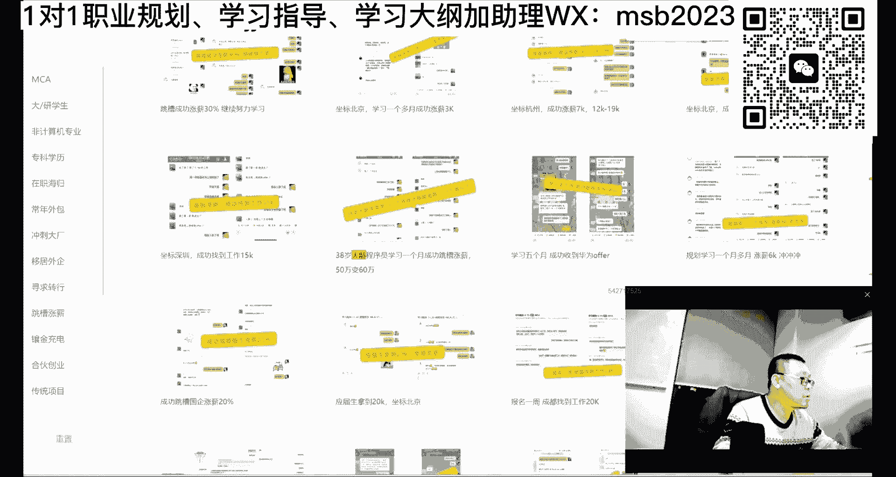

或者给你给你干嘛的啊，38岁50万变60万。

百尺竿头更进一步啊，你得去拼拼才有机会。

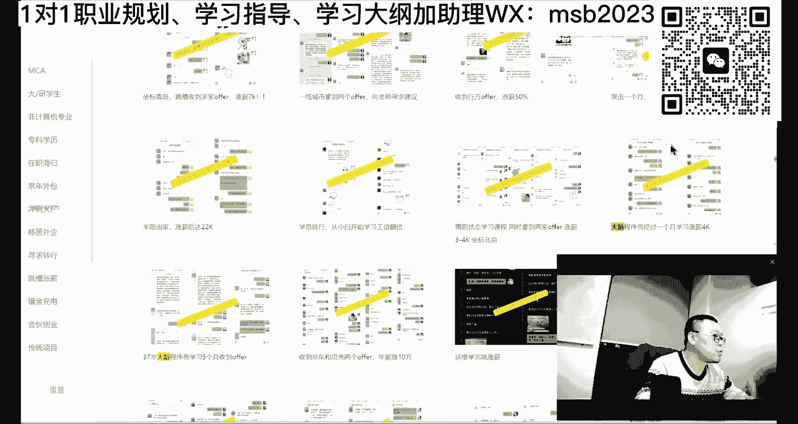

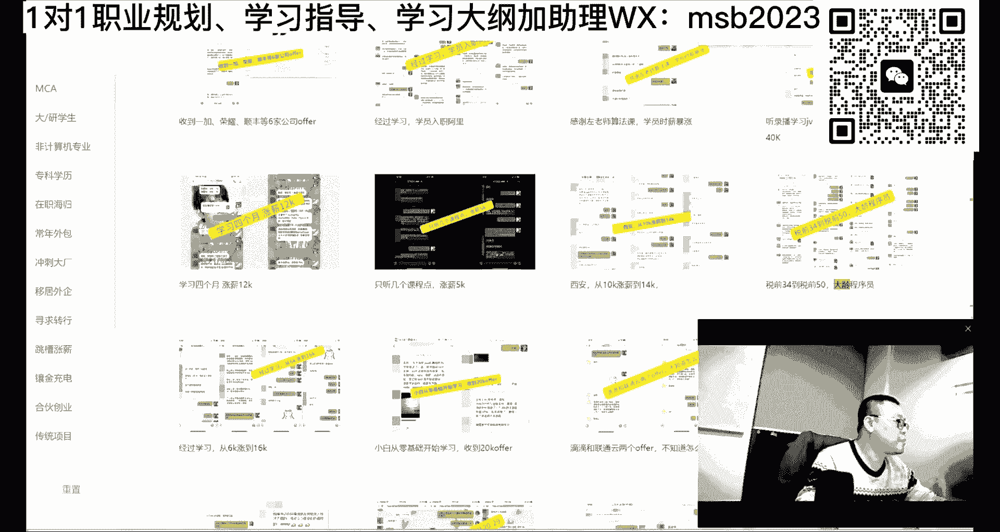

这是咱们的一个女程序，印象很深刻啊。

我们周老师为她服务，可以这么说，就特别费老师啊，特别特别费老师，就有好多时候啊，这点学费其实就是老师的单独辅导，就已经很直了，特别特别费老师，就是但是他到最后的时候，你要知道一点，他原来是搞不定工作的。

38岁的大龄的女成员，最后原来是搞不定的，到后面开始挑工作，拿了40万offer之后，后来我们了解到的是还不太满意，又跳了又涨了，就这么牛逼，干就是了，这就是他的肺腑之言，有的时候呢我们见到这的学生。

我们也很开心，虽然说费了很多心血。

虽然说费了很多心血，但是还是很开心的啊。

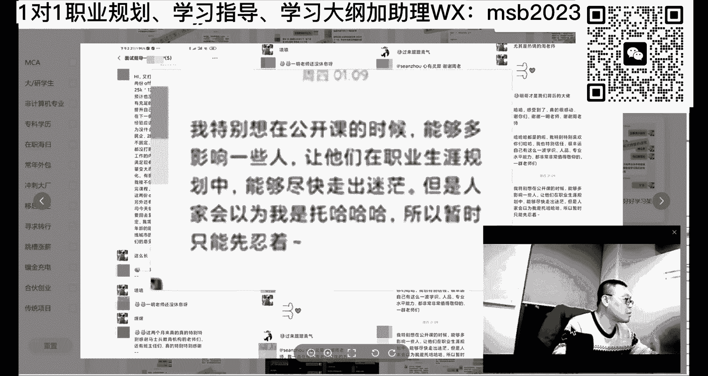

嗯还有你像女成员里头有那个32岁。

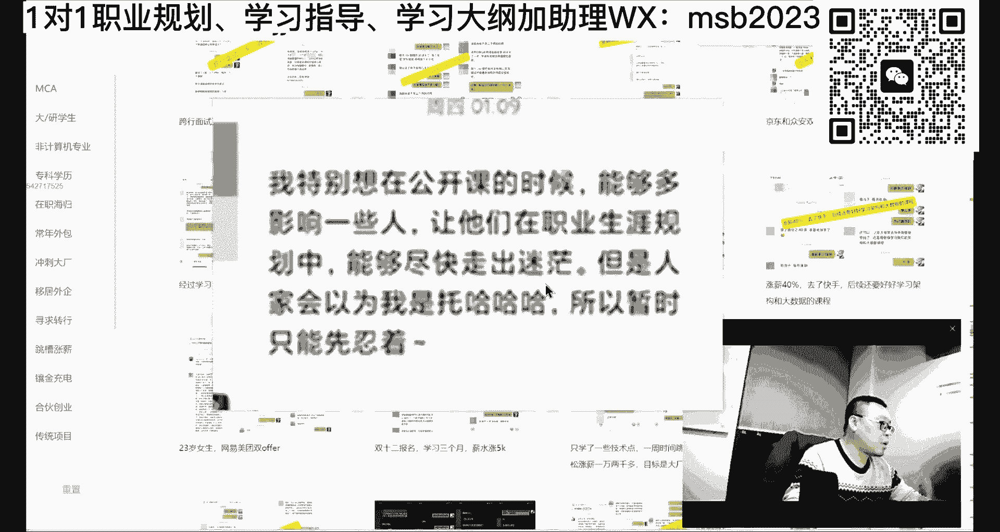

带带带娃的宝妈，两个娃2年没工作了，出来之后我让他拿了30万还是多少，忘了啊，2年没有参加工作，每天学习什么时间学，娃睡着了，他自己学，学到后半夜，想有点想有点成就出来拼好吧，怎么三，虽然说我才想明白。

其实我跟你讲，我想明白这件事情啊，年龄也很大了，所以大家也不要纠结，我年轻的时候也跟大家一样啊，傻帽愣头青都一样好不好，也希望大家伙能够早点认识到这个问题之后，你的路会比我所的通畅通顺啊。

但是我能做到一点，就是我不管年龄多大，出来做事出来拼，ok我也希望你们能做到能做到这一点，提升自己永远在路上好吧，学英语是不是对计算机特别有帮助啊，不是啊，英语其实要的要求的东西并不是。

就是要求的英语并不是很多啊，你是浮起来，很多人其实能浮起来就就很好了是吧，都是一个缘分，ok那个关于大理这件事，我们就聊到这里好不好看的呢，关于其他方面的层面的问题呃。

关于女生这件事还需要我单独聊一下吗，各位女同学，咱们考研是吧，行我先跟大家聊一聊考研的问题啊，行考研，然后女同学好吧，呃我先来聊考研这个问题，就是考研这件事情，对于计算机这个方向上，我是这么来理解。

第一个呢就是好多人考研是为了推迟就业，因为他就不了业，所以赶紧来考研，但是你考完研究生之后，发现还是就不了业，有的是啊，所以最重要的你要一定要提前针对就业，要做准备，针对就业这件事要做准备。

你要愿意过来，老师带你教你，该实际当中怎么用呢，该怎么做，你早点过来，越早越好，早一点能让你进大厂，晚一点，只能这样让你进中场啊，因为他需要时间吗，尤其是算法需要时间，好多人是推迟为了推迟就业。

那推迟完了之后呢，又开始醉生梦死，如果是这样的话，你读完研究生呢还是救不了研，第二个呢对于研究生这件事情，它的本质上是比较你的3年工作经验和赚的钱，能不能抵上3年读研，以及它它的后续长远发展。

大概本质上你是实时做这个比较，你在脑子里一定要有要有这个想法，听懂了吧，就是我如果现在不去考研，我争取参加工作，然后我工作3年，我赚了60万块钱，假如然后呢我读3年研究生，大概我花了10万吧。

假如嗯然后呢，但是我出来之后呢，我很可能嗯工作3年我能赚100万，明白吧，就是你你你你需要比较这个比较这个啊，就是我现在3年赚60万，或3年能不能再赚100，我们单纯从钱的角度考虑。

当然一般来讲我是这么想的，就是嗯不错学校的研究生，研究学校学校挺不错的，在业界也比较受认可，这个呢我真心建议你好好读研，这个出来之后呢，往往会超过你3年的工作经验，听懂了吧。

但是有一些不太好学校的研究生，其实读或者不读它的区别并不太大，所以这个呢具体问题具体分析啊，你说哪个学校的研究生值不值得读，你先能考上再说啊，另外呢考研和你学习技能并不冲突，考研也要玩算法计组。

操作系统，网络面大厂，这个是第一梯队的，权重是第一的啊，在这我也教大家一个大厂模型，大厂模型教大家一下所有的大厂，第一权重是算法，第二权重是基础知识，我们叫他面试，八股文大概有12门课，四门考研的。

然后再加上一些个特定的一些语言语言，特定的jvm多线程，并发了redis了卡夫卡租机，p本设计模式等等，准备源码，他们好，第三个才是应用级别，spring spring cloud，分布式微服务做项目。

第四个呢是流行的大数据了，ai了云原生了这些，这个是这四个权重，听明白了吧，这是进大厂的权重，那如果说你只是想拿一份工作，把第三权重提到最，提到第一去，算法扔一边，其他顺序不变好，这块大概能听懂的。

老师扣个一就是不同的目标要走不同的路，就是为什么我们这里呢是老师要针对你的特性，给你指一条路出来，是因为每个人他确实有不同的路呃，马老师设计整体的课程叫做全，因为我一定要特别全。

我才能够在里面给你进行各种各样的路线组合，有的人需要a快速的需要a，有的人需要b，有的人马上需要的是c，他将来才需要a，我们只能慢慢来，就是你看我的客人，为什么他课室量这么大，三四千个小时，为什么。

原因就在这儿啊，就是想让大家伙呢针对不同的人，不同的学习方式，效率会更高，这个呢大概就是考研的一个一个大概的建议啊，呃关于考研这块，看看大家伙有没有什么问题，只是我个人见解啊。

你们根据自己的实际情况来采纳好吧，好我们下面来聊关于女同学这个话题，其实我也不知道为什么，每一次都要把女同学给单独列出来聊，我们很多女生很优秀的，你像腾讯，你们可能不知道，至少有一半就是至少1/3吧。

就是往往一个项目组里面七八个人，才有一个女生，但是呢在腾讯里面，你像这种优秀的公司，好多都是女生，好多领导都是女的，知道吧，水有很多都非常的有水平，所以首先第一点，各位女同学一定不能妄自菲薄。

有很多女同学和男同学的区别就在于这里，她怕丢人，怕得更厉害，他不敢拼，不敢拼的更厉害，大概有一个机会，男生可能有58%，我就冲上去了，概率嘛还是那个概率，但是女生很多时候得需要百分之百的把握。

才敢往上冲，才敢表现自己，我觉得这个是女生优先，第一要解决的最大问题，我原来手把手带过一个女同学，我手把手的教他怎么样去做徒弟，怎么样去做面试，但是他就过不了心里这关，我也没脾气。

所以我希望你们女同学应该突破这一点，人生啊你就记住了你个人的人生，没有那么多观众，没有多少人去关注别人的人生到底长什么样，没那么多观众，你放松一点，该拼使劲去拼，拼不了，下次再接着拼。

呃就是原来在电子厂做女工呃，机缘巧合到了美国练了半年算法，面进谷歌，牛不牛逼，突突破，很牛叉啊，所以本质上来讲啊，就是我们搞技术的女同学和我们搞技术男同学，本质上没有区别，你在技术上跟他拼就是了。

其实好多时候，好多女生的细致程度还要超过男生的，ok好多女生的架构师，好多女生的高级成员，有的是ok你既然进了这个行业，该拼继续拼，该学的技术和男生没有区别，该掌握的能力和男生也没有区别。

你该掌握的视野了和其他人也没有区别，唯一区别的就是性别有点区别，你说其他的还有啥没有没没有什么区别，有同学说了，那都是大多数女生的想法，是我那个我回去，要不我照顾家庭吧，然后那个照顾娃吧，这个没有办法。

这是性别的差异，但是当你照顾玩娃，然后家庭这件事情是双方共同有责任的，不是说只有你一个人留，对不对。

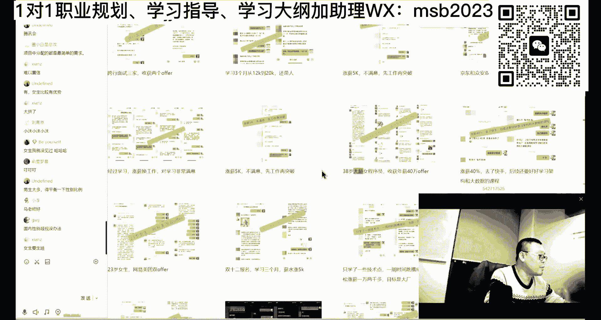

叫个娃娃，你的事业该起也要起，我奉劝大家一句话呃，目前封封建社会的女生没有事业，所以只能做男人的附庸，但是现在不是封建社会，你自己的努力能够养活你自己，哪怕你赚的钱比你老公要要少得多。

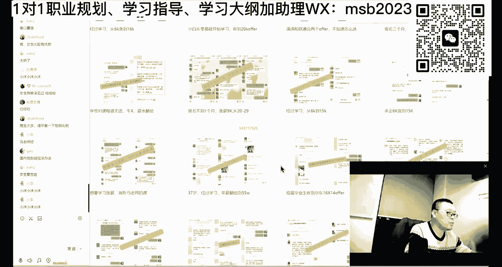

比你男朋友要少得多，但是你是一个独立完整的人格，不然你只能依附于别人，所以不要去做，想着说去去去做那个那个那个家庭主妇啊，不要去那个说有机会我不拼，反正难受的事在前面顶着，该是你的，该怎么拼怎么拼。

其实就是了啊，就是还是那个那个那个例子，你你我就这个这个印象太深刻了啊，他是做了2年家庭主妇，后来实在受不了了是吧，但是出来之后发现什么什么都不会，原来会的是现在人人人人人人家都不要了，对不对。

那怎么办好，我们带他40万，ok比她老公赚的还多，家庭地位杠杠的，现在面试全是外包，脑袋疼，外包这件事情，你过度过渡期嘛也没有什么关系了，四struts jsp的公司能进吗，如果没有其他选择。

什么公司都可以进，至少这个公司每个月给你提供12000的薪资，15000的薪资，你每个月有钱赚先进去，并且呢在你有钱赚的情况下，用业余时间再去提升和努力，说这家公司不太好，没关系啊，我业余时间。

因为咱们的课都是业余时间学的吗，晚上的时间ok碎片化的时间线，掌握了框架之后，你就可以用碎片化的时间去掌握了，业余时间再有提升了，然后再去找更好的公司不就行了吗，对不对，所以说其他的方面，比如说女生啊。

可以说大数据做起来，要比那个程序要稍微轻松一些啊，呃但是如果你想后期的要想拿更好的薪资，那也要成为架构师，也要懂后端，对不对，也要懂前端，要懂懂管理，懂懂业务等等啊，其实大概差不多呃，做去做产品经理。

ok这个会相对来说轻松一些，但是也并不是就任何的各行各业，不是说你看上去的想象之中的那么容易，产品经理的薪资好多都比那个成员差远了，对不对，然后呢，产品经理，如果你没有过一些开发或者测试相关的经验。

你想做好产品经理也不容易，还有呢最终呢我们的综合素质，那我们去了解业务，了解市场，了解这些，你不了解的话，你的产品经理也做不好。

就是所有的所有的所有，到最后我们都是一个综合素质的竞争，具体问题具体分析好吧，学生会有前途，比如oracle oracle，我认为没什么前途了，oracle现在在国内都被替代了。

现在好多oracle都已经被国产的数据库给替代了，比如我们在里面讲的o o b，我们课程里讲的ob oa是mx 4 coa，这些个都是用了国产替代的，为什么国产替代啊，国家安全问题，这东西是趋势啊。

这这没什么可以改变的，明白吧，pg pg和mysql基本上是一个量级啊，pg mysql基本一个量级，就是说你们说的这种专门的数据库呢，其实有一个工作岗位叫d b a d b a这种的呢。

他就是小动脑啊，目前要求目前人并不多，竞争的也没那么激烈，但他薪资也没那么高，反正你就是愿意的话，可以朝这方向走，但是你一辈子只能干这个，记住了，他某种程度上就是专门的大数据。

专门的某一种某一种数据库的运维岗，就是你可以入行的时候，1米宽1百米深，还是那句话，你用oracle，用pg，用mysql来入行，这个没有关系，但是长远发展一定是要慢慢走向更宽广的方向，好了。

双非一本想进微软有机会吗，双非一本，双非一本，这个要看你们历史上有没有微软去你们那面试，这我感觉够呛啊，我感觉够呛，实际上国产和数据库的性能都有点问题，没有关系啊。

你要知道oracle最开始的时候他也有问题，慢慢演进呀，你不演进的话，怎么可能会没有问题，淘宝刚上线的时候，2000个人就能把他干崩了，你现在呢别说2000个人，两个亿都干不崩，但是史蒂文不断演进的。

用发展的眼光去看问题好不好，国产数据库再有性的问题，那也是自己国家的，是不是我就是一直不强，那也是保护我的啊，你就是那边再牛逼，你就是b two特别牛逼，那是打我的，对不对。

所以不要在这个城维维度上考虑问题啊，双非一本说的社招，双非一本社招的话呃，据我所知啊，就是筋道微软的多数的学历都还是不错的，我觉得你就别考虑这个问题去试，你投简历，投过去，你做好了准备之后就投，对不对。

你只要我靠，我还有算法基础知识，然后架构啊，实际当中的设计能力对吧，你准备好了之后就投就是了，微软能接受就接受，接受不了的话，看淡啊，不就不就完事了吗，二不是因为什么现在被替代，我不跟你说了吗。

国产替代吗，国产替代oracle，美国的没准有后门的，能理解吧，去rush好吗，明显不太好，rush现在并没有太流行，去微软需要啥条件嗯，你打开微软的招聘，然后仔细去读，这就是他的条件。

每个岗位每个岗位不一样，一般来说学历稍微好一些，算法务必要给我，啊这是必考的，我们小姐提醒喂，哈喽哈喽，又断掉了，太他妈讨厌了。

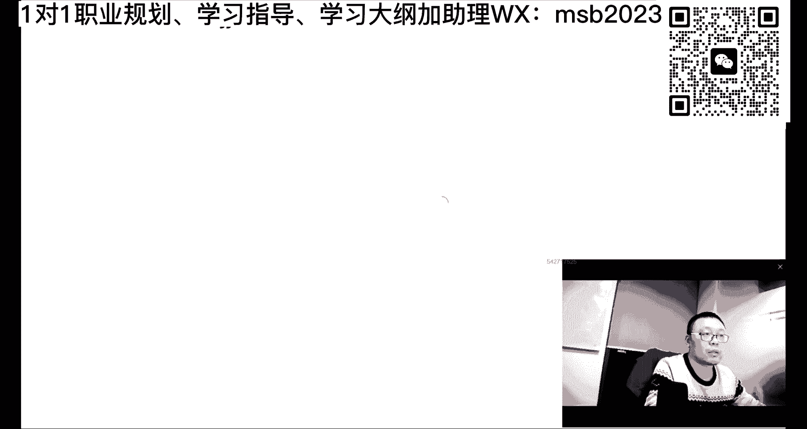

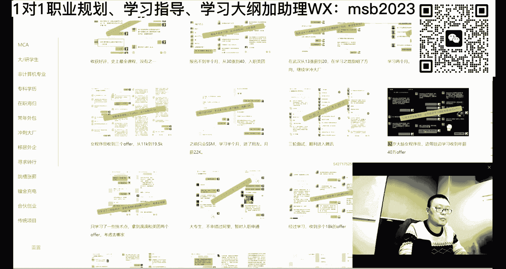