# 系列 6：P54：【2023】转行Java后端如何快速入行、通过面试并稳定工作？ - 马士兵学堂 - BV1RY4y1Q7DL

我教大家用一个系统化的方法去看它，各位同学日常接触到的很多知识都是碎片片化，碎片化的知识会增加焦虑，系统化的知识会让你看到问题的解决方案呃，看这里，而且碎片化的知识对你做决策其实用处并不大，看这里。

我首先帮大家呢说找工作的问题，就是入行的问题啊，入不了行这个问题怎么解决，其实我们讲呃找工作这件事情就两步就能搞定，第一步就，写简历投第二步叫去面试过，只要你写简历投出去。

然后呢得到机会去面试过了就拿到工作了，就这么简单，就这么简单，千万不要想太多，但是呢这里面呢其实大多数人遇见入行的问题，有两大问题，第一个问题是你投出简历去，没人理你来，这是第一个问题，叫投简历没人理。

第二个问题是什么，有人理你，面试通不过，好这是第一个问题，这是第二个问题，我们再重新投一遍票，所有的人入不了行的人告诉我，你是第一个问题还是第二个问题，二二嗯1212，2g多一也不少。

我快速把一帮大家解决，这里面呢跟你的面试，跟你的什么都有关系啊，他前前后后都是一个一个体系的，同学们听我说呃，当你写简历投出去没人理的时候，你想想看这是什么原因，在这里呢，我给大家呢，呃，就是纠正一个。

你们日常中经常会遇到的一个错误的观念，就是不重视简历这件事，好多人写简历是什么样子的，网上找一份模板，然后呢自己会什么往上一写一填改吧改吧，往外一扔ok了，这就是一份简历，这个说起来挺好玩的啊。

我给大家讲一个最近的事，就是刚刚的，就是我太太那边在招聘一个他们的工作岗位，这个工作岗位呢基本上要招985的博士生，然后就比较好玩的是什么什么呢，有一个条件非常好的学生，然后就投了简历，投完简历之后呢。

里边那个写的东西呢叫驴唇不对马嘴，就是招的工种是a，他实际当中写了一大堆关于b的技能，然后为什么呢，实际上后来分析一下才发现他在网站上选，我到底要选投哪个岗位的时候，他选错了。

就是那个下拉条里面他选选错了一个，非常非常的不认真，各位同学，你们平时我不知道你们干什么事还认真啊，就是说这件事这件事是关系到你一辈子的事情，可以说这件事是关系到你一辈子的事情。

你如果一点都不认真投简历，还能投错，里边还有什么错别字，格式不好看，我跟你讲这些都是重大问题，所以第一件事你要重视你要写的格式，要写好了，错别字不要有一个错别字，让你的印象直接从100分就掉到20了。

你在里面还有错别字，还有那种，尤其是特别好玩的，是你投技术工种啊，还能把那个这就把那个，把那个技术名词给拼错了，ok这个就太搞笑了啊，javascript写少写个s是吧，嗯少写个j，少写个a啊。

然后大小写不统一等等，所以这件事情我一说大家应该都能做到，我今天讲完，请各位回去润色自己简历，先把最简单的那问题给我解决掉，格式问题，好看问题好不好，这个这个不难，但重点的呢是不是说你好看了。

简历你投出去就会有人理你好，简历里面呢有各种各样的那种细节的技巧啊，比如说呃字斟句酌的什么样子该说什么样子，不该说什么样的东西该写，什么样的东西不该写呃，然后那个照片该不该贴贴多大的拍照的。

应该是大头照还是半身照还是全身照等等，这些问题呢都是细枝末节，在这我希望纠正大家伙一个观念，就是简历，很多人把它当成一份作业去写，当成一份作文去写，完全错了，简历是一个广告，请大家记住简历是一份广告。

我再强调一遍，简历是一份广告，你投简历其实就是投你自己的广告出去，这个广告的产品是谁，宣传的产品是谁，就是你自己，所以你要做的一件事叫做一定在你的广告里面，突出你个人的呃吸引力，我这么说。

大家能不能理解，如果有很多的那种应届生写的写的简历啊，然后我又会ps，又会ai，又会photoshop p s服的时候吧，然后又会后端啊，有参加过什么团团委会活动，又又又又做过各方面的组织活动等等。

一大堆列上去，完全就没有看这份广告的客户是谁，广告最重要的一点是什么呀，让客户认可，我们都不认可，各位同学们，我们客户是谁，是不是那些个企业呀，兄弟们好在哪些企业里面，怎么认可我们。

就是你一定要投其所好，找到他的需求点，这点没问题吧，投其所好，什么意思，对方要什么，我往上面写什么，对方不要什么，不看重什么，我就把它去，各位同学，请你记住了，简历是一份广告。

我下面教大家一个特别牛逼的，基本上肯定能拿到面试机会的方法，就是我们第一步写简历，第二步呢怎么写才能投出去，才能拿到面试机会啊，略过这些投的技巧，投其实也有技巧，但是呢在这儿我教大家一个特别牛逼的。

只要是你正常写，就一定能够拿到面试机会的，这样的写法，认真听就是很简单，就这四个字，投其所好，我们可以这么来理解它，具体做法怎么做啊，具体做法这么做，每职位易简历。

我一会儿一会儿我给大家打开那个招聘网站，给大家举个例子啊，每职位的简历，这不是，哎呦我勒个去，美职位建立，这是什么意思啊，我们随便找一个职位吧，打比方说今天来的前端多，后端多啊，应该前后端都有啊。

我们随便找一个啊，我们就就拿java来举例子，搜一个java好，同同学们看啊，随便随便打开一个啊，因为我这里是长沙，我们调到北京，薪水看上去稍微高一点点是吧，15000~2万，高级工程师。

我们看看这个呃，当当你仔细阅读他的这种招聘描述的时候，实际上你能读出很多很多东西来，就是你能够是很明确的，能够看出来它的重点放在了什么地方啊，有这个的优先看到了吧，唉也要求你熟悉这个啊，熟悉这个。

ok下面是一些岗位的职责，当你仔细去阅读的时候，你至少能从这里面找出来，你有哪些东西匹配不上，你有哪些东西能够匹配，这一点应该都能理解吧，兄弟们好，那你如果同样的还是这个java工程师啊。

我们换一个和薪水和他差不多的12000~2万，我们打开来看这两份呢你做一个比较，我相信呢，很多同学应该能看出这其中的一个区别来啊，我们再找一个找这个15000~2万的，ok你会你你看看啊，这是我。

我们来截一下，这是岗位要求，ok关于技术上的一些东西，然后呃刚才这个我们看的是这个啊，我们和他对比一下好不好，好这是这是这份工作的，同样的都是15000~2万，同样都是java工程师。

你看看上面这些要求，跟下面这些要求有没有区别，有没有区别，嗯有这个是要求什么呀，设计模式在o多线程分布式，分布式系统设计，应用缓存负载，负载均衡恢复服务等等，这个要求是什么。

tom cat web logic struts，spring hibernd，w r t web等等，有没有区别，兄弟们能看出来吗，呃我我们讲就算是对面有两个小姐姐啊，对面要求呢就是那个是相个亲啊。

都找个男朋友，但是即便是对方这两个人的条件差不多，给的钱都差不多，但是他们对于男朋友的要求，也一定有细微的区别，兄弟们这个能不能认可，应该没问题，所以如果当你你你手头你打开你的简历。

你发现你熟悉的是weblogic ssh，那么你投我刚才的第一份成功的概率又高，但是你投刚才的第二份，你成功的概率就极低，我这么说能不能理解吗，兄弟们，这是第一个，对不对，但是呢你简历里头写的啊。

比方说高并发分布式微服务，你投第二个概率就高，投第一个建立这个概率就低，来这会我讲到这儿，各位能理解的，给老师扣个一，老技术嗯，oracle都是银行，没关系，我们现在是找工作。

当你没有其他工作机会的时候，我觉得这个也不是说不能选k，所以各位兄弟们，如果在这里你自己写了一份简历，在想象之中呢，你写了就是你你觉得企业要什么，你都往上写，什么p s了什么，写了一堆。

你扔两扔这两个工作岗位，你扔哪个都不行，所以你最想你，如果非常非常想拿到这个这个面试机会，你怎么办啊，针对第一个，针对第一个职位润色，你现在的简历，突出你的ssh with logic。

oracle p r c o，针对你的第二份简历，突出你的jvm多线程并发io缓存，我讲清楚了没有，这种是成功概率最高的，当然这种也是最麻烦的，我讲到这儿，一定有同学会说。

老师我那个s s s也不会哈哈，什么并发的分布式缓存什么的都不会，我咋办，没有关系，你先写上，各位兄弟们，你先写上，就是对方想要什么呢，你先写上，写上东西不会，写上东西不会怎么办。

这个如果让我给你一个最简单的解决方案，就是学嘛，最简单的就是学我们课程3000多个小时，涵盖了上面所提到的所有东西，学就是了，而且学怎么这个，我这个也先先先不说这个问题啊。

就是很多同学呢就是写简历的时候，他有一个特别特别非常严重的误区，就是我现在会什么，我就往上写什么，我不会的东西他不敢往上写呃，它是一个静态的看问题的这种概念，就是我今天不会，那明天能不能会。

后天能不能会大，后天下周能不能会，他没没想过这些事，他只是说我现在不会，所以我不我网上写，但我个人的建议你啊听我的，你写上去写上东西，怎么这个不会怎么办，学就是了，有同学说了，说老师啊。

这个缓存我从来没有接触过，我是给他写上去了，可是对方问我，我能答得出来吗，没关系，我下面来解决，其实对方问你答不出来，这件事就面试通不过的问题，我下面就来解决这个问题，就说你写上去了，但是你不太会好。

我教你不太会的东西去面试怎么过，这个够牛逼了吧，我前面讲完的，我前面讲完的能听明白的，给老师扣个一，就是你大胆要往上写，因为你不往上写，兄弟们记住了，你不往上写会后果是什么。

不往上写的后果是没有面试机会，就好像说你现在要找一个女朋友，你你这份简历写出去，人家那个女生那边要求身高一米七五，你身高一米七四，那完蛋了，人家直直接这些系统给你刷了，能理解吧。

你先把1米75这件事写上去，至于后面你是用这个呃增高鞋垫啊，还是有什么其他办法，这个随你，但是你先写上去，你先写上去才有见面的机会，见完面才有可能成我这么讲，能不能理解，所以这件事一定要想清楚。

还是这句话，你你你你你如果写出去投出去简历没人理你，没有面试机会，那你怎么可能会得到面会，会入行，怎么可能会得到得到工作机会，你好好琢磨琢磨这件事，所以不管你会或者不会写上去，另外我讲过不会的东西。

学就是了，学就会，你哪怕只学一个问题，好给你举个例子，我们用缓存这件事来举例子，我知道很多同学可能缓存没有用过，不知道该用什么好呃，举个最直接的例子，你今天投出去简历，然后明明天上午九点钟。

人家要求你去面试，听懂了吧，好，你今天上午九点投出去的简历，上面写了缓存，我会，然后接下来明天上午九点钟，人家邀请你面试，你有一天时间干什么，学学什么，学缓存，一天有同学说了，老师你跟我这扯淡呢。

一天时间学会能能能能能学成什么样，一般来讲，下面我们就来聊这个面试的问题，面试的问题的核心是什么东西啊，简历的核心是广告啊，本质上它是个广告，这点你一定要知道，那么面试的问题的核心是什么东西啊。

面试的问题的核心是概率，这里面呢很多同学的认知呢，就是面试是一场考试，我需要拿100分，如果你这么认识问题，那你办这件事就难了，面试的问题是一个概率，再说一遍，面试的问题是个概率问题呃。

举个最简单的例子，如果缓存，你想要你想百分百拿到这种关于缓存的这样的，面试的这个全全部都通过，那么假设你需要掌握100个知识点，100个知识点，但是呢由于你的时间比较短，你做了一份突击，就学了一天。

在老师的指导之下，告诉你这种的某某一方面的一两个知识，他考的可能性是最高的，然后你就开始晚一晚上猛背，背了五个，很差吧，对了五个，告诉我有没有概率能通面试，想一下，琢磨一下，有没有概率，5%的概率。

我们简单说就是5%的概率，但是5%的概率就意味着，如果你能得到20个面试机会，那么就其中有一家就成了，我们讲入行有一间长了就可以了就够了，你没必要说你一二十点五，20加加加成。

那么如果你想得到那样的那样的选择机会，等于二前面20个小姐姐让你让你随便挑，如果你想得到那个机会，那就得成体系化的锻炼，把各种知识点全掌握住，但是你没那么多时间怎么办，没关系，拼就是了。

拼本身就是个概率问题，正好就是那那那五个，对不对好，我讲到这里，呃再跟大家伙说一个颠覆大家认知的问题，就是当你写简历的时候，你写上了不会的东西，然后呢有的呢是写有有的，因为他害怕通不过啊。

因为有的人呢他脸皮比较薄，他害怕通不过，他一般只写上他自己会的东西，而且这东西比较好玩，我以前接触的同学们呢，越是学历比较好的，呃，实际上他本身水平也还是挺高的，他越不敢写，你懂吗。

呃我理解的是越是学历比较好，学习比较好的同学，他这种呢，就是越认为他接触到的不会的东西就越多，他就会越认为呃我应该谦虚一点，我在写简历上呢应该谦虚一点好各位同学，下面我就问你一个问题。

简历是谦虚一点点好还是不谦虚一点好，你你你你，你怎么认为简历是谦虚点，好像不谦虚点好，其实我给我给我，我给大家举一个最浅显的例子，你自己选啊，谦虚有谦虚的好处，不谦虚有不谦虚的好处呃。

有一位同学我们假设他的水平是100，但是他写简历写了80，有一个同学他的水平是60，但是他写的简历也写了80，好注意面试官没有见过你，没有见过你的情况下，我怎么认识你这个人到底牛不牛，会不会啊。

你写会我就认为你会，你写不会，我就认为你不会，对不对，所以在面试官的眼睛里，这两个100和60他是看不见的，他只看到了，他只看到了这80，只看到这80就认为是两个人是等价的，是一样的，能理解吧。

兄弟们在他就在他眼睛里是一样的，ok然后最后的结结果大概是什么样子呢，由于他写的就是第一，第一个同学，他写的比较保守，所以他成功面试成功的概率就会非常的高，高到什么程度呢，他灭了十家。

很可能成了八点支撑吧，那么第二个同学呢，由于他写的太夸张了，有好多他还没有完全掌握住，他就是靠这种使劲拼，然后拼概率，呃呃呃拼出来的大概练了十家，那就成了两件好，我就想问你这俩这俩哥们有啥区别。

没有注意，在面试官的眼睛里，你俩都都是80分，那就意味着原来这哥们儿能够拿4万块钱的，由于你只写了80分，所以不好意思，你只能拿3万，然后原来这哥们是拿应该正常拿2万的，但是他比较吹牛逼。

吹吹完了之后呢，正好用一定的概率呢去把这个牛逼给cover住了，他拿的到了3万，你告诉我，你想做第一个人还是想做第二个人，你自己选，这里面我们再说一个性别问题，各位女同学，今天今天有没有人。

今天有没有女同学，这里面涉及到其实其实我讲起来简单，涉及到很多这种关于关于呃，心理上的一些问题啊，各位女同学，今天女女同学在的扣个一啊，应该也有你，你要知道就是各位女同学们啊，那个，各位女同学们。

就是是，你们平时是非常不乐意展现自己的成果的，而且呢基本上干什么事情都要求有百分百把握，然后才去干的，以至于你们丧失了职场上的很多机会，这是女同学的一位通病，在这儿我告诫各位女同学不要这样干，麻烦呢。

你干了什么牛，在什么地方把它说出来，甚至吹出来，只要有50%左右的机会，赶紧去争取，内部要提拔一个去争，不要等着说我一定比旁边的人强，我才怎么样怎样的，听懂了吧，然后呢你要做第一个还是做第二个。

麻烦你们自己选好呃，在这儿呢我看看啊，我想想那个书名给大家顺带着推荐两本书吧，呃，就是第一本书呢叫叫，地方是叫这个名字啊，那为什么越无知的人，月支线，呵呵这本书没事，大家可以去读一读，嗯比较好玩嗯。

孙子兵法，你那那那个不要吹的太玄了，那个你你一定得到一个月里我才能推荐给你啊，孙子兵法，这些都是你到了一定阅历之后，可以考虑读的东西，呃，什么易经啊，什么这这些啊，但是一般人读起来没有。

能够对你现实当中的认知又有提升，那个为什么越无知的人越自信，你们可以去读读这本书，就就就挺好玩的，就是说了这里面就揭示了就是说为什么呢，有好多好多人他其实水平挺高的，但是他不他不敢。

他不敢把自己的3万的水平说成4万，他也不敢把自己2万的水平说成3万，以至于他最后实际上是亏了，看上去他成功的概率很高，10x8概率很高了吧，但实际上他亏了，就相当于呢这个如果说我们简单的说说a a a。

a a a b c d这个男女四四个水平是吧，呃你这个作为呃呃a的这个人呢，你总是去找这个c的，那确实你的成功概率会非常的高，但是如果你是c的人，你想找这个b的，你也可能有一定的概率能成功。

你要去拼这个概率，那么你就赚到了，对知道的自我就发现不是自己，自己不知道更多了，没错，它就跟这个小圆圈是一样的，井底之蛙，他能看到的天，井底之蛙能看到天就这么点，对不对，当它窜出这个井口之后呢。

他突然间发现外面的世界很很大，以至于外面这些未知的东西就更多了，所以它会变得比较谦虚，但是呢经理的话认为天就这么大个，所以他就会不谦虚啊，在这我就不说了，不多说了好不好，我就讲到这里。

这个下面我们来讲这个概率问题，就说我们怎么提升这个概率，提升概率最好的方法是什么样子的，我们还用这个缓存来举例子，最好的方法当然是进行系统化，系统化学习，提升概率最好的方法当然是系统化学习。

这个没什么可说的，你从头到尾扎扎实实的呢，把它把它学好了，这个肯定是嗯概率概率最高的，但是我很可惜的是，我们大多数人并不具备，第一很好的学习习惯和方法，第二足够的学习时间，我教大家怎么解决这两个问题。

第一个呢就是很好的学习惯和方法，呃，各位想进行系统化学习的，一个比较好的学习方式到底长什么样，我在这简单给大家推荐好不好，那个大家听我说学习学习这件事情呢，在我看来有两种啊，尤其是以以以以我们参加工作。

以我们做项目为目标的这种学习，它一般有两有两种方式来学，第一种是我们从小学到大的方式，就是从细节开始学到整体，细节到整体，这这种是什么意思呢，呃就是我们从小，字体变一下啊，就是我们从从小啊。

呃你回想我们从小学到初中到高中到大学，这种学习方式啊，我们一定是按着某一个方向上的细节，先学到头啊，然后我们上学学高数学，数学学的很深，然后呢呃就计算机器来讲呢，我们可以学硬件啊。

学到底电路学到这个电路怎么设计啊，弱电强电，然后呃这个这个呃数字电路，模拟电路全写到这里呃，但是我们在学习这些的时候，老师其实并不会告诉你，当然高校的老师很多没有参加工作，所以他有这方面的局限。

他不会告诉你说我学完这个之后，我能干什么，我能完成哪些东西，不会不会告诉你这些事儿，呃，以至于我们学起来会第一时间花的很长，第二呢很痛苦啊，我这种学习方式是我我也是从小学到大的，我就会让你比较痛苦。

那么第二种学习方式叫做从整体到细节来学，那么这种方式呢完全反过来，这种方式指的什么意思，我给大家举个形象点的例子呃，在大家伙学怎么，你比方说你现在要学习怎么造一辆车啊，机械系的我们学习怎么造一辆车。

当你学习怎么造一辆车的时候，你上来会去淹研究什么呢，会去研究这个车的一个齿轮的某一个细节吗，就是你的，你现在面临的目标是我做一个完整的项目，或者叫完做一辆完整的整车，你的第一步研究会从哪开始下手。

你会不会把车上的一个齿轮给拆下来，好好的去研究这个齿轮的应力，什么样硬度，怎么样弧度是什么样子的，怎么给它加工出来，你会你会不会这么研究，同学们一定不会再给大家举这个前面两个例子，你要看一座山。

它长什么样，你要去山里头去研究研究研究一些一些东西啊，不说庐山真面目，你要研究这座庐山的时候，一种方法是你钻到庐山里面一个山沟，沟里面一个树底下去，扒开这个树根，去好好看蚂蚁窝。

你觉得你能认识整个庐山吗，你肯定不能，当然有同学就抬杠说，老师我把那个庐山所有的细节弄完了之后，我再形成一个整体，没错，这种是可以的，也是我们比较熟，这个学习方式，也是我们比较认可的学习方式。

这么学我们不别扭，因为我们碎片化的东西，这种就是从碎片化到整体化吗，从碎片化的地方，我们碎片的东西我们时常就是这么学的吗，我们学的很开心，我们很认可，我们很熟悉，但是效果不好，时间很长。

形成一个整体的时候，可能都过去2年了，ok另外一种是你坐着飞机在整个山上掠过，看清楚山有哪些主要的脉络，把它画下来，然后如果需要的话，我再去钻研这个脉络上面有什么样的树，有什么样的动物去做去再去下去。

哪种方式更好，更省钱更省时间，你好好琢磨，省经理能理解吗，所以第二种呢叫做整体到细节，我永远推荐是先整体后细节，先框架脉络，然后再细节，具体一点，我们将回到我们的a it行业，我们具体一点。

不管你是前端项目，后端项目，你应该做的一件事情是从项以项目驱动学习，项目群众学习就是我们在我们的教学体系里面，我们有很牛叉的项目，大概有十个左右，我推荐大家伙的学习方式呢，是你在建立一一简单的基础之后。

能够理解项目的讲法之后，就可以去听项目课，因为一个项目学下来之后呢，突然突然间你你你可能会发现，一个项目所涉及到的各种各样的框架，你大致就能理解了哦，你理解这个项目是由前端团队，ui团队，设计团队。

然后呢产品团队，运运维团队，测试团队，开发团队全部来构成，开发里面有前端和后端来构成前端，ok它用到了主要用到了哪些东西，后端又用到了哪些个框架，是分布式还是分分布式，如果是分布式的话。

又用到了哪些个具体的1234567，当你建立起来这个整体感之后，实际上就对这辆车呢，你大概了解就大概成了这样了，这辆车是由车身的底盘，发动机三部分来构成，然后这个时候呢在驱动着你。

我下一步要去研究哪一个更小的单位，是我是驱动驱动组件，转向组件，还是说其他的这种什么电路，当我去了解啊，我要转向组件，我要去了解好，当我了解完转向之后，转向会涉及到了哪些个轴，哪些个万向节。

哪些个传动传动机制，我再这么一步一步深入研究下去，我是从整体到细节，这种学习方式速度最快，效率最高，当你熟悉了之后，你就会发现，如果用这种方式学习十天，可能顶这种方式学习一个月，移动端的，卧槽哈哈哈。

先有上帝视角，是的来各位也不知道我说清楚没有啊，呃来这块大概能听明白的，老师扣个一当，这种方法论的问题，我尽量给大家举例子，不举例子，光说那个理论说不清楚啊，ok呃然后听我说。

我再给大家举现实中的一个例子啊，你比如说啊我们拿刚才那个招聘网站来举例子，你看这里啊，看这里同学们呃有呼叫中心等项目，电子优先，假设你前面的呃都知道都差不多，先简历投出去呢，人家那个面试官看完了之后啊。

就说哦大概有100份简历差不多都能匹配，但是如果说你能够在你的简历上写上呼叫，呼叫中心，了解呼叫中心，甚至你只要加这一句话，了解呼叫中心，ok熟悉呼叫中心业务，兄弟们，你说你的面试机会会不会多很多。

会不会一定会吧，那好下面我就教大家呢一个投机取巧的方式啊，我们讲系统化学习是最好的，但是前提是你得有足够的时间，下面我就教大家呢，就是当你时间不足的时候，时间不足的时候，听懂了吧，说我现在时间很紧张。

我遇到很多同学是刚被开掉的，遇到很多同学是开到了之后已经在外面找工作，找了好几个月，就是回回不来的，遇见了很多同学是我毕完业考完研研，研究生没考上，我现在着急找工作，我再不找工作，我都没钱了。

家里条件也不好，我现在第一件事要干嘛，我一定是要解决，我先入了行，赚上钱再说别的，如果你是这样的，你认真听，那时间不足的问题该怎么解决啊，兄弟们，各位你们认为找一份工作，大多数人的认知是这样的。

我一定呢呃要有这份这这项工作的经验啊，这个人家招呼叫中心，我一定要了解呼叫中心，所以我才能去干呼叫中心啊，我如果没干过，以前干的是电商，那我觉得这机会我就拿不着了，我就干不了了，实际当中是这样的吗。

我们现在假设我们的目标就是要拿到这份工作，领了这份薪水，我们就干这件事，他的薪水2万，我就要领着2万的薪水，那么你会怎么办，你会玩了命的想办法去领着2万薪水，怎么想办法在你的简历上写，我会这个。

但是你不会呀，我教大家怎么在时间不足的情况下恶补好不好，一般我们把这个称之为叫冲刺好吧，我们冲刺的目标是什么，首先你这个这件事一定要搞清楚啊，呃以前有同学认为我们冲刺的目标呢，是赶紧的学会该怎么去做啊。

说我原来没做过分布式，我原来没做过微服务，我现在要赶紧学会，我现在要赶紧做好各种各样的调调调试啊，各种各样的bug，遇见了我能解决，no，完全错了，如果你是这么想事的话，就完全错了，我再重复一遍。

比方说人家招的是分布式微服务，人家招的是呼叫中心，呃我现在的目标啊，我觉得我的冲刺的目标是什么，我冲刺目标是赶紧，我得快速掌握呼叫中心怎么做，赶紧快速掌握呃分呃，分布式的东西该怎么样进行搭建。

怎么样进行开发，怎样进行调试，你如果这么想，你的时间永远不足，因为你们在学开发或者学别的，或者学习别的技术工种，其实都一样，我告诉你，你们大量的时间是花在调试上，90bug，同学们。

你们学一个知识点其实挺快的游戏，你去看看，有好多人看，看完一篇文章，一个知识点就掌握了，但是让他亲儿子开始动手做的时候，才是最费时间的时候，一个bug能卡你三天，当你时间不足的时候，从哪里把时间挤出来。

很简单，不挑十bug就行了，不听是bug，哈哈你这个时间就出来了，有同学还说这个这个我讲的都能理解吧，就是你们回想你们学习的时候啊，你们大量的时间是花在什么地方，是不是花在调环境。

调bug去想办法纠错了，你好好想想，你大概基本上，80%的时间都花在这个上面，如果你把这部不干，你的时间就一定很充裕，就不不能说很充裕，就是你的时间一定是比那个要好得多，你的你的时间的利用率。

所以你现在要搞清楚这个冲刺的目目的是什么，注意冲刺的目的是通过面试，这是我们冲冲刺的目的，你不要想着说我，我现在冲冲刺的目的是干嘛，我马上会做精通，你这个想想多了，冲刺的目的是通过面试，各位兄弟们。

因为为什么，因为你通过面试之后，是不是你就拿到了这个岗位，你是不是就开始赚钱了，你告诉我，你说linux我不会没关系，我听完一遍之后，我大概知道linux系统是干嘛的了，我就记住了一个命令fs。

其他什么都没记住，k可不可以呢，也可以，他面试的时候很有可能就考的这一个命令，其他命令没考，你说好玩不好玩，运气运气真好好听，我说我知道一定有同学说，那试用期有挑战，没错是的。

我一会帮你解决试用期挑战的问题，ok听我说行，我再强调一遍，我冲刺的目的是什么啊，一定要给我记住了，这里面我我我给大家纠正了好几个，你们日常上的这种观点，这个观点很重要，是能帮助你快速的能够进入行业的。

第一个简历是一份广广告，要给我好好写，怎么写，吸引力怎么写，最理想的是美职位简历不太理想的是美，不同分类岗位一点力，比方说有的人能干技术岗，有的人能干管理岗，那么你技术岗写一份管理岗，写一份听懂了吧。

那么最不好的那就是一份简历打天下，当然你一份简历写的比较通用，也能打天下也并不是不行，但是如果你一份简历不能够打天下的时候，就一定按照我说的每职位简历怎么来，听懂了吧，这个时候你的效果就会比较好好。

这是第一，这是第一个，你的认知的问题，就是简历是一份广告，那这份广告我是打得谦虚一点好，还是打的夸大夸张一点好，这个取决于你自己的认知，有的人喜欢我，我80就是写80，有的人喜欢80写100。

有的人喜欢80写60，但是我个人推荐大家呢是稍微往上提一点，这个对你来说你的收益率是最高的，具体问题具体分析啊，有的人说我那个呃，内部推荐已经肯定能拿到面试机会，那你稍微谦虚一点，别人问你问题的时候。

你还能拿得出，对不对，所以具体问题具体分析，但是普通情况下，我个人永远推荐是这种往上提一点点，因为这个时候你本来拿2万的油，真的有可能拿到3万，而且你会很开心的拿到3万，这方面的案例比比皆是。

我手底下的学生，超越他自己预期的情况比比皆是啊，你去干，当然这个时候就会牵扯到你写的东西呢，呃你你你面试的时候通不过，所以这时候我们要认识面试通通过是怎么回事，面试通过是一个概率问题。

概率问题你怎么提高概率，最理想的情况是系统化学习，这是我永远推荐的，如果在你时间不足的情况下，我推荐你冲刺，冲刺完了之后，然后再进行系统化学习，这一步是永远绕不过的，这步是永远绕不过的。

你必须你早晚得得走这步，全体是先走还是后走的问题，我推荐你冲刺，先拿了钱，拿了工作，拿了薪水，然后再去进行系统化学习，这个也也也可以去，这个我不用我说了吧，应该比较简单的道理，就是如果你在这个节点上。

你是2万，现在你要充3万，一种方式是我一定要学到3万人，然后学学，大概比方说六个月，我学到了3万的水平，然后在投简历拿到3万，注意在这六个月期间，你拿拿到的是2万每个月，另外一种方式是我冲刺，我突击。

我玩了命的冲，然后呢我用一定的概率去拼，我用一个月的时间我冲下来了，这3万那么就相当于你你后面的每个月，你每个月都拿3万，能理解吧，虽然说最后效果都是一样，我都拿到了3万，当然这种不牢固。

所以你翻回头来还要进行系统化的补充，能让你这个3万给他稳固下来，这两种方式，我这么说来听明白的同学，给老师扣一两万的本事，干不了3万的活，别着急啊，我一会教你好不好，看这里啊，我再说一遍。

如果你现在比较着急，要拿到钱，要拿到岗位，我已经入不敷出了，这个时候怎么办，你记住了，你的冲刺是通过面试，只要通过面试，你就得到工作岗位了，面试完了，你人家已经发offer了，对不对，你就可以去工作了。

有工作就一定会领到薪水，ok这时候你就有钱了，至少是好，那怎么样去冲刺呢，你就记住通过面试需要你现场调程序吗，需不需要你调bug，需不需要不需要，绝大多数不需要，所以你是不是在学习的时候。

就把这件事可以先省下来，学习的时候呢，你就先听老师讲了一个项目，还里边涉及到了方方面面的调试配置，我的天太细节了，我跟不上没关系，囫囵吞枣的先给我听一遍，听完了之后哦，我知道了，原来这里面会涉及到前端。

后端缓存，分布式并发，ok然后我再去玩命的去背里面的题就可以了，我们拿缓存来举例，子，缓存最常用的redis，redis最常问的问题，12345，我给他背过，背过背就可以，ok当你背过了之后。

别人问你缓存问题，是不是就有可能有一定的概率来通过呀，兄弟们，而且当你的面试越来越多的时候，你会发现一个很好玩的现象，这个现象呢是这样的，要面试的问题我换一敲吧，就干什么事呢，你总结好规律啊。

就就就好干，听我说啊，就是说呃你会发现好玩的现象，这个现象是面试的问题都差不多，我说的这个意思呢是说，同一种类的公司面试的问题基本都差不多，问的问题都差不多，比方说第一个公司你问到redis问题的时候。

他基本上问了12345，第二个公司问的，你会发现呢，他可能问的是1245，第三个公司可能是1234，也就是说问来问去，很多时候起，其实最常问的就这么多问题，那么你第一家答不好，翻回头来要不要好好总结。

那一定要对不对，就算是我哪个问题没有答好的，我们的学员他会把问题录音录下来，我们老师会帮他听你哪个问题到底没有打好，下次同样的问题不要再犯错了，那么当你的面试机会够多的时候。

哪怕你只是通过面试总结来学习，你通过面试，后面面试的概率就一定会变高，你第一份面试通过概率1%，那么你第二份很可能就到5%，第三份很可能就3% 8%，第四份很可能就10% 12%，录音会不会违法。

不知道，你查一下，你找个律师咨询一下，很可爱啊，我们的这个这个同学们，有的时候问的问题真的是很可爱，好你会发现面试问题都差不多，所以当你面子足够多，我们以前有学员30多次面试，最终才成了一个。

当然我以前的记录呢大概是十天，用了十天时间培养这个同学，他原来只会html css，任何编程语言不会十天，然后让他入行，采用的方式差不多也都这样，你要收起你的自尊心，你要把我讲的这一要深入地理解到位。

其实你会发现呢你开始拼这份工作的时候，你会发现，这个工作呢并不是想象中的那么难拼啊，不是说我一点工资都拼不下来，听懂了吧，我看这里，这是这是我们经常会遇到的问题，就是面试问题差不多，所以你通过积累。

通过总结，往越往后你的概率就会越高，ok所以你你再想想看，你今天呀你就上午面了一家，下午面了一件，那么你晚上的时间用来干嘛，用来总结，用来继续学习和冲刺，当你总结和继续学习和冲刺的时间，越来越多的时候。

牵扯的东西越来越多的时候，你的成功后面成功的概率就一定会越来越高，ok听懂听明白了吗，在这儿呢我在给大家调整另外一个问题，就是心态问题，这个问题呢比我想的要严重的多，我以前觉得这个问题不是大问题。

但后来才发现这个问题才是最根儿上的，很严重很严重的问题，这心态是什么意思呢，总体来说呢就是有的人呢不敢这么写，简历60写成80，有的人呢也不敢手上东西，也也也不敢往上写，也不敢往上写。

有有的人的时候我写上去了，我不太会，我就不太熟，我就背了一个题，我都不敢去面试，然后有的人呢说我面试了之后呢，我怕通不过别人把我给开了，好这个心态问题总体来说就一个事情，就是怕丢人，这是核心的自尊心强。

其实我觉得吧还有一种可能性就是没有，我受过社会的毒打了，当你真的在这个社会上混了一段时间，你连饭都吃不下去的时候，你的自尊心你会发现叫一文不值呃，举个以前很早以前那个小例子啊。

那会儿呢有一个学生他去面试，面试三星准备了很充分，然后呢三星的面试呢给了他很大压力，当时呢那会三星啊在中国发展还可以，他面试的时候是别人面试，就是一个面试官在这问你各种各样的问题。

三星的面试就是三个面试官，然后坐在前面让你在黑板上答题，然后他一下呢心态一慌，结果就是答了半天，什么都没答出来，原来会的问题也都忘了，满头大汗呃，后然后回来了之后，这个郁闷郁闷了好长时间啊。

躲躲在屋里不出来了，后来呢没办法，还得我去拉他啊，把他拉出来，然后好好的给他讲解释这个道理，其实呢他就是他就干嘛了，他就是丢了人了，丢了人了之后呢，结果呢嗯把自己给打怕了，再也不敢出来了。

我不知道有多少人是有这样的心理的，这样心理的人大概大概大概长这样，你你你反思一下，是你你是不是有这个问题呃，你喜欢一个女孩，但是从来不敢去表白，只能暗恋，那么你看中一个机会。

但是呢我总觉得我自己就是不行啊，我怕这个别人别人别人给我拒了啊，所以我连试都不敢试，就是说我怕结果不行，怕到我连尝试都不有，没有这样的兄弟们，有没有，有的话也老是扣个一，如果真有这样的嗯没有。

ok应该有啊，各位同学，麻烦你把你们的自尊心真心的告诫一下，给我收起来，包括各位女生把你们自尊心给我收起来，因为年轻人的自尊心是最不值钱的，年轻人自尊心只有自己，只有自己这么说，只有自己看着看着特别重。

但别人根本把你没有把你放在眼里，所以你也不要太把自己当回事啊，你的生活也没有那么多观众丢人好，我们分析一下他三星3星这件事，他丢人丢到哪了，他丢到了三星，丢了多长时间，半条顶多半天。

我不相信三星3个面试官还会记着说，今天有一哥们过来面试，他的名字叫卡尔萨斯，答题答的贼烂贼烂的，他的名字叫大贤是吧，能不能看到能不能看到弹幕肯定能看到啊，但是我没有办法停下来打每一个人的问题。

他丢了半天，好丢人的范围，三个人，也就是说这三个人半圈，记得有一个哥们儿叫大贤，来了之后满头大汗，什么都没答出来，最多也就这样，第二天你再问这三个人中任何一个说。

昨天那哥们不这满出满头大汗的哥们儿叫什么，他一定10000%忘了，是不是这样的，所以就因为这半天三个人的丢人，你把自己卡在家卡了七天，然后还影响你后面干事，连干都不敢干，连尝试都不敢尝试，各位兄弟们。

你们去尝试个面试，会损失钱吗，会损失色吗，会损失财吗，你们什么都不会损失，为什么不去试，你一定要去试，好不好，别的不说，这个心态问题以后大家不要有能做到吗，能做到的，给老师扣个一ok。

一面试就考试说不出话去面，所以后面你喜欢哪个女孩给我去表白，对不对，你喜欢哪个男孩给我去表白啊，给我去勾引去干，面多了自然就就好了，面试口吃没有关系，面多自然就好，是这样的，什么东西，你不是啊。

你你不就是没有人，任何一个人到了一个新的这种呃，就做一件新的事情的时候，他不遇不遇见点困难，不紧张呢，没有啊，那成神仙了，去世好吧，所以呢我们就大概解决了啊，听我说我再说一遍。

我们就大概解决了什么问题呢，第一个是写好怎么写好几份简历，美职位，看看看人家要什么，网上写什么，ok这是最好的方式，当然也有一些普适性的啊，这个我现在没办法教大家啊，这是第二个呢，就是你这种简历。

你投出去，你刚才有同学还说呢，说我33了啊，我投了100份简历，只有一个面试通知，是不是我刚才有同学看到了，应该有一同学说说说过，我翻一翻，我刚才没理他，大数据入行年薪，想规划一下未来，这个一会再说啊。

我们先先解决单的层面的问题，找不着了，刚才有同学我记得他说了，他说我30，我记得他他他这么说的，我33了，投了100份简历啊，只有一个面试面试通知，那么你想想看，为什么你想过没有，我你听我讲完这个。

你你都没想过是为什么吗，你为什么投出去100份简历，只有一个人找你面试，why想过没有，有没有同学能够告诉他，对啊，你简历写的不好吗，你广告打的不好吗，你广告肯定是打的不好啊。

哪怕就是说你我再跟你说一遍，哪怕你就用一份简历海投也没有关系，你把这份简历给我写牛一点行不行，需要需要我给大家看几分简历吗，找几份简历给大家看看，这个简历是年薪120万的啊，大家愿意看也可以看一看。

这个是年薪120万，有同学说我我我我我那个里边这里边写东西，我好多都不知道啊，先写上去，先写上去，按照我说的方法，自然会驱动你去学习这些东西，比方说你我们拿第四条来举例子，我随便找一条。

拿第四条来举例子，精通分布式事物，阅读过two p c tcc相关组件源码设计，可靠消息，最终一定有方案，最大努力通知方案，saga好，各位同学有多少不了解第四条的，有没有。

了解不了解这四条得老师扣个二来，我看看，franklin，ok嗯，有应该有，对不对，好你你自己评估一下，如果是让你来，同学们，我问你们一个问题，你们自己评估一下，如果你能够在简历上把这第四。

第四条给我写上去，你大概要花多少时间，忘记了没有关系，你们觉得应该能能你们觉得把这条写上去，把这条写上去，用一定的概率去拼机会，你们大概要花了多少时间，十秒十秒，就是说你一定的概率，一定的概率去拼。

我觉得30，我觉得30，我觉得30给的给的比较比较到位，就是半天到一天，我再强调一遍，其实你了解分布式事物，你一篇文章很可能就把这里面所涉及到的东西，全读过了，全全就全了解过了，但是呢你很可能落不了地。

你懂吗，但是对于你来说，去通过一定的概率，通过面试，半天到一天时间肯定够了，能不能理解，我再说一遍，不要想着你现在就啊什么写源码或者干嘛的，你只需要通过面试，用一的概率去拼的话，半天到一天肯定够了。

是不是这样的，所以没有大家想象中的那么的难，ok比如说两天时间，不管你多长时间吧，我们讲我们假设每每一个大概需要1~2天，这18条18条30多天，是不是也就30多天，这可是年薪120万的简历啊，兄弟们。

你要是能30多天，然后就有一定哪怕5%的概率，3%的概率，1%的概率去拼一个120万年薪的，你愿不愿意去尝试一下啊，面试背了记不住，没关系，多背啊，第一次没记住，没说上来，第二次会不会记住，说上来啊。

当然这个有点夸张了，我突然间那个那个什么了，这个简历就就就不带不带大家那什么，看了24岁的简历哦，sorry，这是我们一个一个对不起啊，这是一个学生的简历啊，这是一个学生的简历。

我们来找我们自己的简历模板啊，这是我们简历模板，这是二，这是24岁的，当时这是真正真实的简历，啊啊667 10万当时拿了ok，这个吧，我们比方说这个京东常见io模型和优化策略，来各位同学们，各位同学。

如果让你简历上写这么一条呃，你需要花多长时间写上去，并且以20%的概率能够能够拼下来，你到底要花多长时间，一天两天呃，周老师就是我们周老师在讲这个io模型的时候，他公开课讲过。

他讲完这个io模型和基本的优化策略，大概需要花两个小时到四个小时，也就是说你听完一天公开课之后，你基本上呢就能够有基本的了解，然后再通过复习，再加两个小时复习，大概需要六个小时，六个小时。

ok 6个小时，差不多，你就能以20%左右的概率能够通过这条，当然有同学说精通啊，这个我可不敢写，你们就是你写精通，然后你你你了解你精通了其中的10%，他有没有可能正好问到这10%。

你表现出来的就是精通，就算你不敢写镜头，你可以写熟悉，对不对，可以写了解，难吗还还还还那么难吗，我给大家讲完，这个大家伙还真觉得，这个简历写出来稍微牛逼一点，还那么难吗，兄弟们，几个人敢写精通，对对对。

你是不敢啊，你为什么不敢啊，不是你写精通会死是吗，京东确实不敢写，你京东不敢写的原因是什么，是不是别怕别人呃，我使使着劲的刨根问底的问你，对不对，你不就是这个这个这个这个想法吗。

就是你我们就拿精通这件事来说，说到这儿了，你随便聊会儿天儿，就是你写完精通，你害怕什么，你害怕什么啊，因为不精通对你其实最怕有人刨根问底的问你，问你你答不上来，对不对，好听我说如果你答不上来。

那么他问到了，你说a，如果我们按照问题的深度，分成a b c d e f g7 的问题，g是最深的问题，一般来说呢面试官会从a问题开始问，发现你答上来a顺着在问你b顺势再问你c好，我们假设你第一次面试。

第一次面试呢，他问到b的时候，你就已经答不出来了，你答不出来，他不会杀了你啊，你放心，这一点他最多认为你写精通了，你这么破小子，明明是啥都不懂，就了解一点浅呢，你就敢敢跟我说精通，对不对，你扯淡呢。

对不对，好币，你不会了，那么翻回头来你回来有半天时间，你恶补了一下b好，第二次面试官问到你b你不会了，问到你c你不会了，再回来你又恶补了一下c，然后第四次第五次你恶补了一下gf。

就是你们老用静态的看问题，我现在确实不精通，所以我不敢写，但是你发现没有，也许你用几次面试加总结，大概几十个小时的时间，别人在问你问题的时候，他问的你是那些所谓精通的问题，你就能答出个123来了。

哪有这么多面试机会，我往这儿写啊，当然我推荐啊，我再我再说一遍，我再说一遍，我推荐大家进行系统化学习，一定时间的准备之后，那你这时候的面试机会也多，成功概率也高，我现在讲的是当你比较着急。

时间不够的时候，听懂了吧啊一看精通，就是培训机构写出来的，没过没关系关系就是各种不同的简历，各种不同的简历是不是不一样的，就是说你不同的这种呃，不同等级的简历写的是不一样的，你要了解这一点呃。

应届生写的简历和30多岁，40多岁写的这种简历，他应该是长得不一样才对，呃现在还有一个问题，这说起来有点太远了，就是简历的技巧呢n多n多，我们有一个服务就是帮大家优化简历，呃，经过我们优化的简历。

有一些案例大家可以到我们的网站上去看，随便给大家搜一搜，做个小广告。

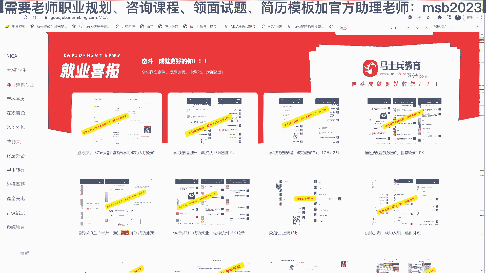

就是我们的呃，专业的专业在什么地方啊，简历指导成功涨薪。

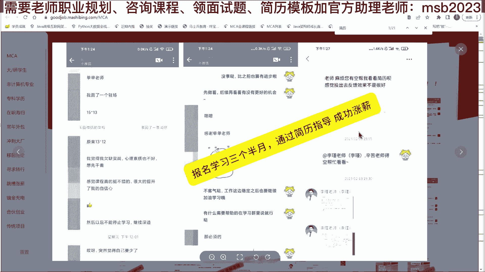

对这个只是涨了薪而已，我给你找那个，就是只修改了简历啊，就别的什么都没干，建立涨30%成功跳槽面试突击简历指导。

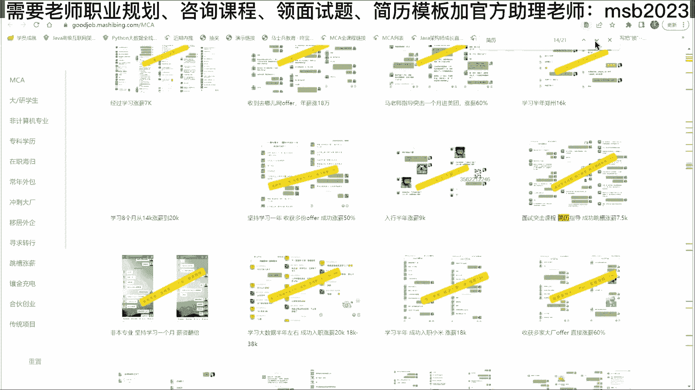

就是突击加简历啊。

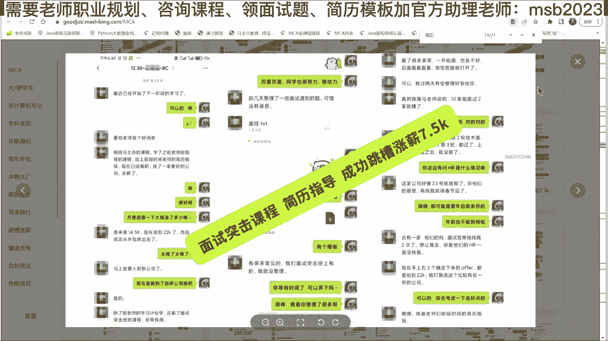

这是涨薪的概概念。

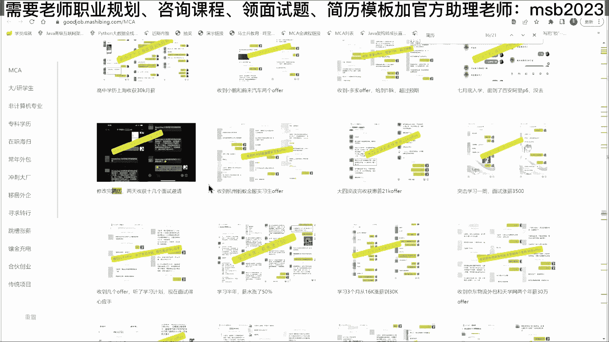

这个比较典型，就修改完简历两天收获十几个面试邀请，这是咱们周老师给修改完的简历啊，呃效果特别好，按简历按照您的指导改完了，当天有一个大胆猎头给出30~40到一国企。

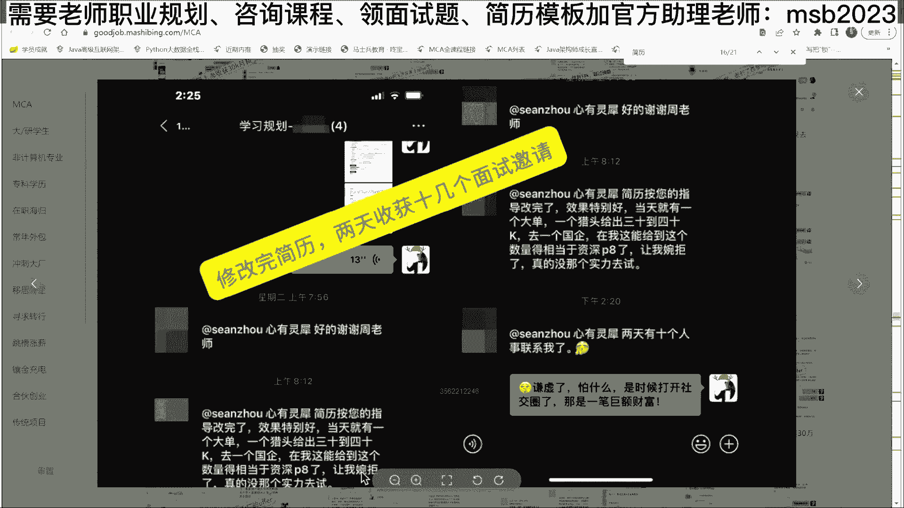

你们提出的很多问题呢，跟你们特定的这种这种条件都有关系，所以我没有办法有一个通用的答案给大家解决，但是通用的原则我给大家讲清楚就行了，就是呃简历这件事情呢，其实不同的我们说不同的阶段的人。

他的写法是不同的，你如果说都是用那种应届生式的写法啊，什么精通了了解了熟悉了，这是最普通的写法，这是年轻人的写法呃，如果待会儿想看一些年龄大人的，应该应该什么样的写法，想看吗，想看给大家打打开看看啊。

稍等我给大家找一找，就是说其实你会发现简历的写法呢方方面面啊，不一，不是说就一种写法，稍等啊，刚才我们简历模板给大家打开几分呃，这是一份大专生的简历，他大概是32岁，32岁。

然后拿了是60万~70万之间，因为他有一些股股票的激励，所以这个具体数额大概在60万~70万之间，呃，你再看看这里还有精通吗，仔仔仔仔细看，你仔细看还有精通，还有还有没有精通，看看老程序员怎么怎么写的。

对，这就是老程序员吗，你还有精通吗，一个精通都没有，一一个精通都没有，ok还有精通吗，我没看到，ok不是说一定要写精通，也不是说要一定不写，你这点一定要理解，就是说不同的写法适合不同的人，不同的层次啊。

面试要面子，你写镜头我一定会恶补，他是不是就逼着你，你就真正的精通了，你灭几回你就真精通了，所以你写个精通又能怎么样呢，死不了人试试嘛，对不对，这是30多岁，我们看一个40多岁的，不对啊，40多岁的。

这是那个40多岁的，他是呃要当时要求的是月薪8万到13万月薪，还有还有精通吗，有啊啊，还而且还强调真正精通，这肯定是特别精通了，对不对，但是你还有说我还有还有那种列表式的。

说我精通这个精通那个各种专业名词吗，没有了，你发现了没有没有了，ok，啊jvm调优一般人就不会，我如果告诉你，用两天时间就可以把jvm调优写上去七吗，这个我们试过没问题啊，你背就行了，你不要不要干别的。

你不要真正去调，你只要不真正调十几天的学习，你可以压缩到两天，ok，好了我讲到这儿差不多能解决了吧，差不多能解决了啊，嗯我看看还有没有我我上面讲完的这些问题，还有没有同学有那种大的层面的疑问的。

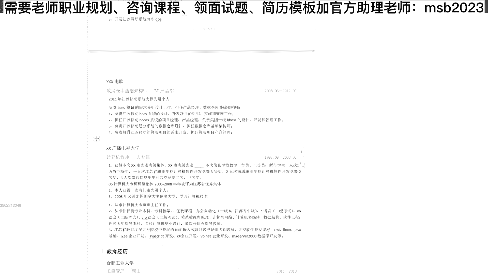

有没有。

有吗没有了是吧，没有了，下面我们就我们解决下一个问题，突然感觉又行了，对你只要肯试，你是真正的行啊，你去试就行了，就怕那个就怕就怕你们，我其实最害怕的是什么呢，就是你们不敢上战场，你们实际上是被吓死的。

这是最害怕的呃，这方面要学多久，不需要学多久，这玩m的话，如果你想通过面试一定的概率去通过面试，比方说50%的概率通过面试，你大概需要学两天，但是你想真正的去进行操作，去进行方方面面的调优，搭环境。

这个大概要十几天，肯定肯定要十几天啊，35岁有人要吗，换了吗，不是那个各位兄弟们，你们有多少人是35岁以上的，35岁以上，给你给你看几个案例吧，好不好，我就说大龄的这帮人，我们找几个大龄的。

这是大龄成员，但是没写多少岁啊，呃38女生那个原来搞不定工作啊，我们后来压着他搞了一份40万的，这是老师们带他的过程。

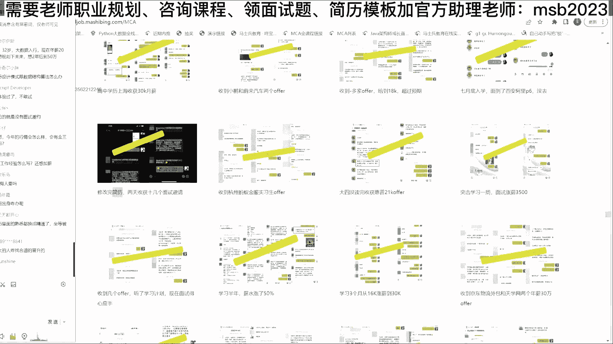

当然戴起来很费劲，我就直接告诉你啊，39岁的ok杂七杂八的翻了一倍，44岁的这个我印象也特别深刻，被外企给裁了，裁完之后呢，我们帮他规划好了该怎么学习，学完了之后最后达到的效果。

最后他原来被裁之前是33万的年薪，他想达到45万，被裁了，44岁的女生，想达到40 45万能不能达到，最后问他的时候说薪资是不是达到预期了，答案是达到预期了，ok但是这是他的肺腑之言。

我也希望能给大家以警醒，不会在温水煮青蛙，就说你要进步啊，简单说就是你不能够只闷头干活。

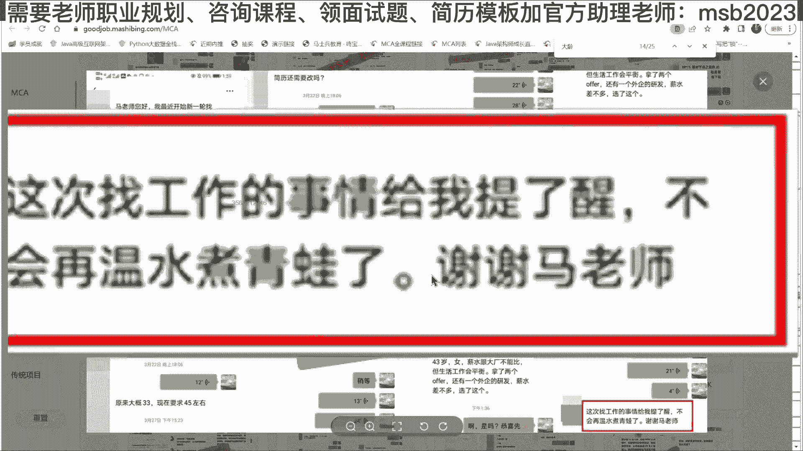

不抬头看路啊，不抬头看看我到底还缺什么，对。

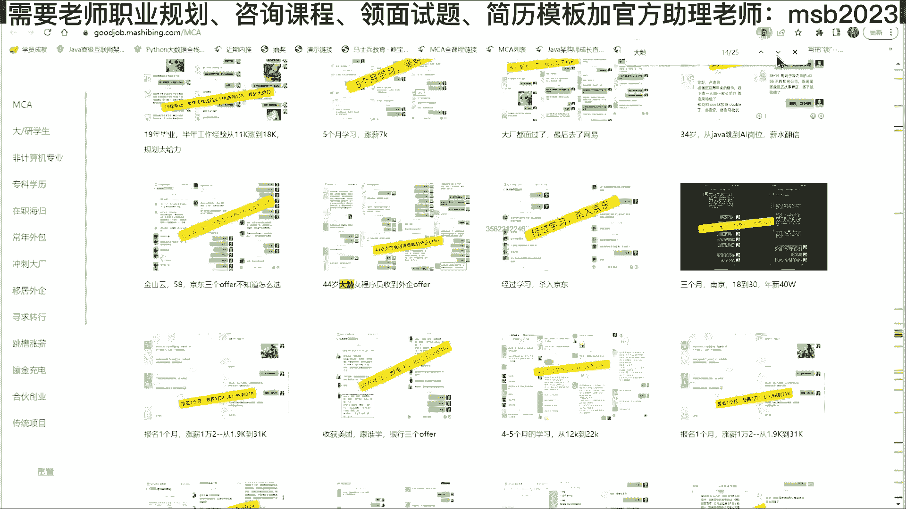

这个我也印象极为深刻，32岁的女程玉儿，他是两个娃，在家里大概当家庭主妇待了当了2年，后来实在受不了了，想出来工作，学习时间没有怎么办，每天两个娃睡着了，学到后半夜出来。

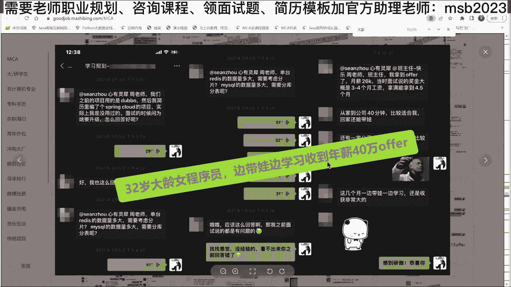

40万年薪，嗯怎么说呢，每一个人都有自己不同的人生和具体具体情况，但是我觉得其中一个你是应该必不可少的，就是提提升自己好不好，你可以不跟着老师学，可以不交钱学，你免费学也无所谓，提升自己这件事。

麻烦你持一个空杯状态，其实你会发现有好多好多的机会，在你慢慢的努力之中，一点点的努力之中，他就出来了，呃还是那句话，不怕战场上战死，就怕你在战场下面被吓死，ok，一会儿我我我我我给大家系统性的讲。

就是大连的问题怎么解决好不好，我们现在下面解决下一个问题，就是当我们写了一份好的广告，当我们呃以一定的概率通过了面试，因为我背题通过的嘛，背题通过的，我通过冲刺，通过突击冲冲这个这个通过的。

那这个时候我们有一个很大的担心，是面试进步，面试机构不了，sorry，试用期过不了，呃各位同学是不是那个也有担心，有有有有有这方面问题是肯定有，是不是试用期过不了，为什么会那么大家，你想一下试用期啊。

为什么会过不了试用期，过不了的一个主要原因是什么，就是当你开始真正上手干活，不出活，你肯定你已经面面过了，你过了之后呢，人家认为你很牛逼，但实际上呢你是通过冲刺嗯，冲上去的，冲上去之后呢。

现在你上手干活，然后不出活，你不就这个原因吗，只要你出魂，你面试机会，不过我不信，就你不出活，所以他不过好，为什么不出活，因为你不熟，为什么不熟，因为你没操作过，所以你面试期想通过该干件什么事。

第一个了解，真正，工作环境呃，所设计我说的这种工作环境是指具体的环境啊，用什么服务器用，用哪个框架，用什么开发工具，用哪个数据库，能理解我说的意思吧，就了解你这个真正的工作环境呃。

我们作为作为我们马士兵教育来讲，我们给大家采用的呢大概是，3000多个小时，接近4000个小时的课，一共229门，不敢说百分之百都包括了你们所遇到的环境，但基本主流环境在这里都有，我得登录一下。

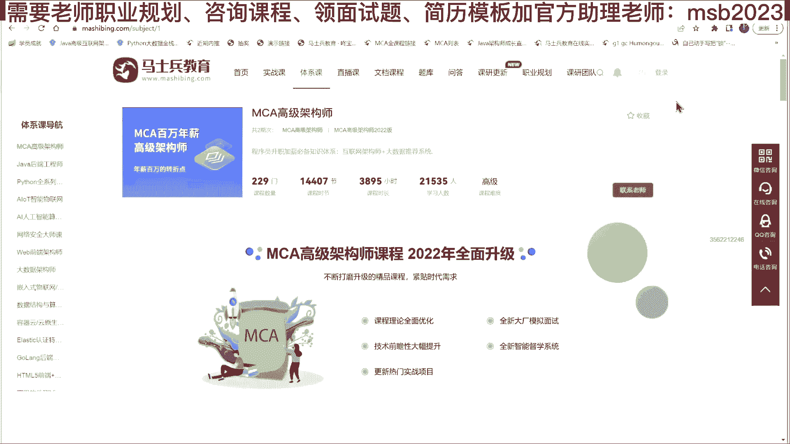

我记得我登录了，刷新一下，我登录一下啊，登录完之后呢。

就会看到咱们具体的课程啊，大概从第一门开始，一直下面呢有229门课呃，从项目课到基础的那个那个，那个不同的这种框架课啊，怎么说呢，别的不敢说市面上最全的，我觉得这个应该没有问题啊。

你应该找不到比我们更全的课程，因为老师大概怼了20多位老师讲一门课，然后呢再加上十几个项目，还有一个呢，就是尽量的为大家还原，实际工作环境是什么样子的，呃，所以如果你说我们学员就很简单了。

当你了解完真正的工作环境之后，去找到咱们和你真正工作环境对应的操作课程，晚上偷偷摸摸努力，晚上偷偷摸摸努力就行了，听明白我说的意思了吗，白天不要在那里学课，你已经上手干活了，人家在盯着你呢。

晚上偷偷摸摸努力，然后白天呢好好的调bug，然后去去去去出，是努力的去出你这个活，然后呢还有一个好处呢，是你如果真的有思路上的问题，老师不会帮你帮你调你，实际当中代码这个没有没有这个时间。

但是你如果真有思路上的问题提给我们老师，老师来帮你解决，这个会大大的帮助你通过试用期的概率，我不能说百分百帮你通过，但是会大大的帮助你通过，这个没有问题吧，那好啊，那么还有呃第二个问题啊，就是说。

不论你怎么努力了，因为我们知道我们学过学过技术的人都知道，有的时候一个技术点卡，你可能卡好长好长好长好长时间啊，呃就是你无论如何都搞搞不定，他也许在你睡了睡一睡一觉之后，没准他他才能搞得定。

但是呢已经时间已经过去很多了，呃没准领导让要是你出的活，你不出不来，但这时候我们面临的最严重的后果是什么，就是试用期，不过就是我们面临最严重的后果，就是大不了试用期，不过没有过去，好我先问你。

剩下没过这个严重的后果会严重到什么程度，你们能不能承受，其实有的有很多人害怕结果，害怕结果就是他没想明白，这个结果最严重会是什么样子，我能不能承受，我向一个小姐姐去表白，我最严重的后果是什么。

为什么我就我会害怕她，她去向她表白，为什么，因为我最严重的后果是被他锯掉，这是最严重最严重的，应该没有严重，他不会打你一顿，那除非那太变态了，ok他也不会把你抓起来，好像我们讲试用期没过，试用期没过。

最严重的后果是什么，你能不能承受，想清楚能不能承受最严重后果，拆掉好在你开掉之前大概会经历这么几几几，大概会经历这么几个阶段，第一个阶段是近来的熟悉阶段，这个阶段呢叫做就是你进来之后呢。

他不会第一天马上上手，你就开始写代码，第二天就得给我交，结果不是这样的，你上来会进行一个呃业务上的熟悉，环境上的熟悉，一定会有这这么一个过程，入职培训等等这么一个过程，这个阶段呢短则两三天。

长则好几个月啊，大概我们就我们以一周来举例子啊，我们就拿七天来举例子，好不好，就一周五天吧，五个工作日我们大概说这个熟悉阶段，其实这个熟悉阶段你就完完全全可以放手，去努力的玩了命的去学。

你们真正的工作环境应该怎么样去操作，晚上好好认真的练，你白天成功的概率就会增加很多，然后呢接下来他怎么才能看出来哥们儿你不行，这个也是要经过一个阶段的，我们假设快一点，假设又又一周啊。

一周说这哥们儿真不行，没出活，好接下来这个时候领导的脑子里就想，我要把你干掉，不让你过适应期，能听懂吗，兄弟们，有同学说，晚上我要熬夜废话，你现在是投机取巧，我再跟你说一遍，你是系统化学习的话。

你应该六个月之后才拿3万，你现在经过一个冲刺呢，一个月就拿了3万，你现在投机取巧，你晚上再再不努力，你没走过的弯路，没踩的坑一定都得踩一遍，这个这个少不了只是先踩还是后踩的问题。

但是我现在起码让你入了行了，拿上钱了，这个没有问题，对不对，一周没出活，这个领导就开始脑子里要想了，这哥们儿我得干掉这哥们儿，这个应该是不行啊，把我给懵了，ok遇上一渣男没有关系，同学们。

你这一周是白过的吗，你这一周至少应该熟悉了哦，我我我原来的工作环境大概长什么样，同事们是什么样子的，部门怎么配置，办公桌椅长什么样，我以前从来没就没入过行，对不对，我们假设你这个时候啊。

就是你什么和别人打好关系了，就各种技巧了，什么都都没用啊，直接就把你干掉了，也就是说你经过了两周时间，两周被干掉好，这是最严重的后果，这基本是最严重的后果了，ok那我那我想问你两bia。

你的损失是什么呢，损失了一个工作机会，两周后面你简历上连写都要写啊，无所谓的事，然后那个你的收获是什么，我们想想你的收获是什么，熟悉了真正的环境，就是你你以前那个没吃过猪肉是吧，这次起码见过猪跑了。

那以后再跟别人说，我是在哪哪工作，什么中国这些日常上的事情是吧，哎跟跟同事怎么交流，六的座位是什么样子的，你起码不会出问题了，对不对，注意了，这种环境锻炼了动手能力，更重要的是半个月的工资，没问题吧。

现在还有没有一个单位敢不付试用期工资的，ok，这是你的收获，那么在这种收获的前提之下，你原来这种情况下，这种情况下都能拿到这第一点机会，你现在在又有进步的情况下，ok又升了级了啊，又打了boss了。

又增加了buff了，你现在能不能拿到第二家面试机会，可不可以，那你拿到了第二家之后，你能不能给我坚持一个月啊，原来是坚持两周，这次坚持一个月行不行，坚持一个月又被踢了，再下一下第三件的时候。

能不能坚持三个月，坚持三个月还没提，那就一定不是技术问题，那就一定是你人品问题了，心理素质得多强大，这个世界上呢心理素质强的人赚钱，心理素质弱的人陪跑，还有一个呢是我现在教你的是快速回来。

你的心理素质呢，大概很多人的心理素质是被逼出来的，呃原来我们志愿军上战场的时候，有好多小战士上战场都都都吓尿了，然后整个战一个战场逼下来，打下来之后成为老战士，那心理素质杠杠的。

其实很多人的心理素质不行，主要的原因是没有逼到这个份上，如果真的有一天你吃不上饭，一周饿了3111，一周饿了三天，我我不相信你的心理素质过过不了这一关，听明白了吗，好这是突击的方式，当然我再说一遍。

如果你想真真正正的踏踏实实的说，我不需要多强大的心理素质，我就能能那什么的话，进行系统化学习，这个系统化学习如果按照我们的内容，那就比较多了，稍微打开稍作展示，但需要的时间也会尽量多，我个人推荐啊。

还是以阶段化的目标驱动来驱动学习啊，你不要老想着从0~100，就跟你的老老搞瀑布式开发是吧，一定是把那个100个功能全做完了啊，一一百个知识点全学完了，然后我再我再去面试或者干嘛的，那如果是这样的话。

那你肯定是那个那个那个那个呃，先是花的时间就就就太长了，而是我我建议你们也是迭代式的，就以我现在是2万，我的下一个目标是3万，我3万，我应该学什么，我该怎么办，就以这个为目标就行了，ok。

所以对学了前面后面忘前面的，因为你一一下搞太多了嘛，嗯这是我们系统化的东西，这份大纲你从头到尾读下来，我相信你就对庐山就初步的具有了印象，这份大纲永远值得你从头到尾读一遍，你跟不跟跟我学无所谓。

麻烦你把这份大纲从头到尾读一遍，你就连自学该在哪里下手，你就知道了，入门开始到架构师的进阶呃，不念了好不好，底层知识性能调优架构的设计，service mesh云原生嗯，服务保障。

这是咱们那个那个那个后端的课啊，前端的课呢去找前端的老师，要前端的课一样的，在这里呢给大家规划出了一步一步，怎么从零逐步的我迈一个台阶，我下一阶段目标，我现在是零，我要入行好，以1万多来入行。

该走到什么程度，这是第一步，入行之后呢，我下一步要达到3万，该达到什么程度，下一步达到年薪60万以上，该到什么程度，年薪百万以上应该掌握哪些，一步一步地由老师来带着你做规划规划出来。

这样的话呢你你学起来也不用说学，学了后面忘了前面的一步一步一脚印踏着走，你不要从头一下子把百万的全部都学完了之后，然后出去面没有这个必要，好不好，嗯大概有八个模块，这八个模块呢，这是专门的突击啊。

就是我刚才讲的突击的办法，大家不要小看突击这件事，突击是让你快速的赚到你以后呢系统化学习，然后赚到了钱，但是你你你你提前好几个月就把他赚到了呃，我们突击的效果呀还是很好很好的。

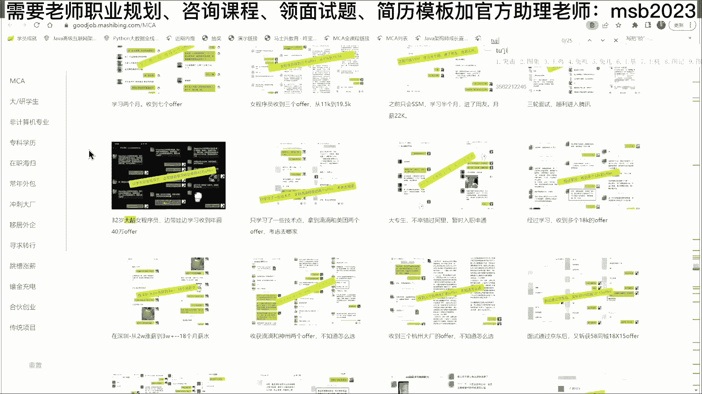

这个是你看啊，这是这是咱们几个突击的效果，给大家举几个例子就行了，这是面试突击，大概拖了15天，从1万涨到了10055天左右，ok超市我这边面试成功入58k 15薪，试用期全额工资可以吧。

第三件就面试成功了，ok突击完了再搞吗，没有没有什么关系，应届专科七天面试突击12k。

100多个突击的案例啊，我随便随便随便给你找几个就行了，面试突击26涨35k继续再往后规划。

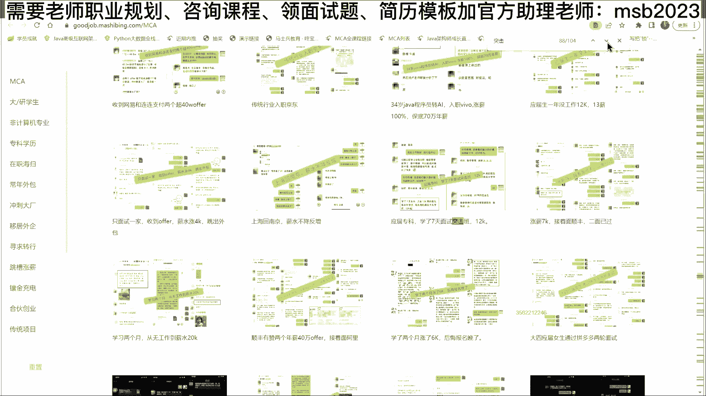

35以后该怎么做的，报名四天突击学习，涨了7k突击有突击的神奇之处，系统化学习有系统化学习的优势所在。

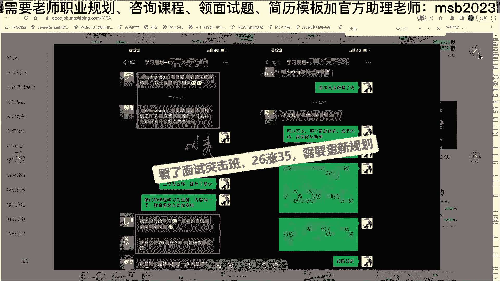

不同的阶段采用不同的方式，传统企业1。5个月突，其实111个半月左右的业余时间啊。

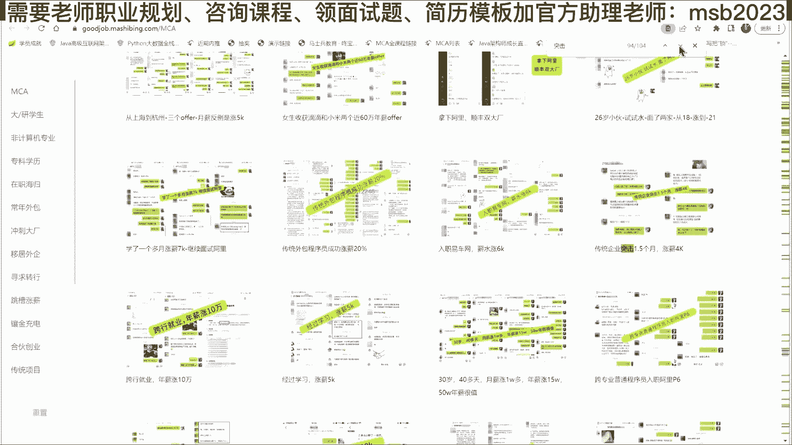

涨了4000，1年5万万还可以吧，案例比比皆是。

就在这儿不给大家一一看了，呃这个网页是对外公开的，大家呢打开这个网页，1000多位学员的案例啊，总有一款跟你差不多，还没有说你付出了努力，在老师的带领之下拿不到效果的，ok呃这里面的任何一个呢。

没有任何一个马老师可以拍胸脯向你保证，没有任何一个是p的，没有任何一个是假的，嗯你找出一个来，马上这课就可以送你了，好吧，好我大概给大家大致解决，入系统化入行和那个快速入行的问题。

我个人推荐快速和系统化相结合，就你一边系统化一边进行快速入行，毕竟你早入行一个月。

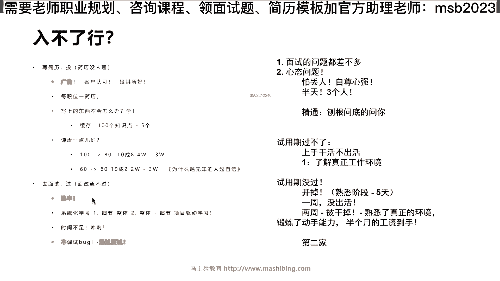