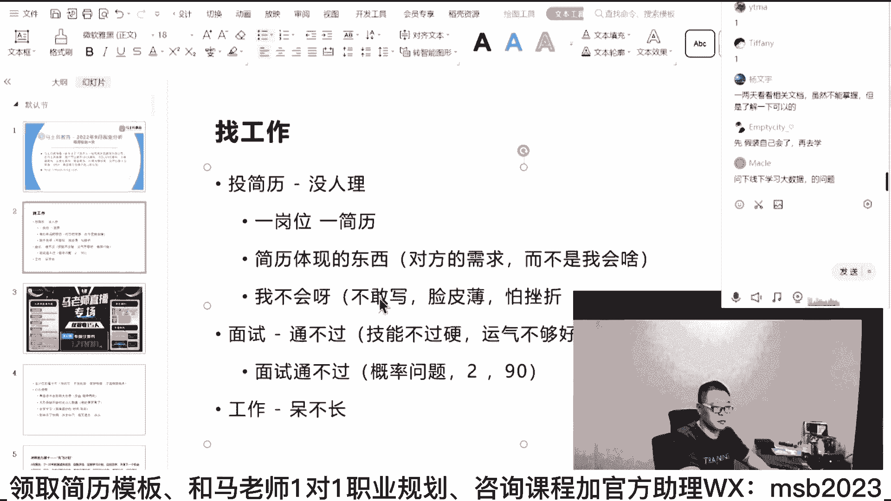

# 马士兵教育MCA架构师课程 - P55：【2023】如何短期快速找到工作？ - 马士兵学堂 - BV1RY4y1Q7DL

呃今天我们就聚焦找工作，然后呢我先教大家呢，怎么就是怎么怎么怎么分析，怎么去具体的找找这份工作啊，呃我今天讲完，你一定会有收获，你呢，这么来做，我会先讲那个普适性的，假如说普适性的不适合你的。

咱们找咱们的老师来帮你一对一的做分析，目前这个服务是不收费的，好吧。

我们能帮一个是一个好，各位同学认真听。

今天我们就聚焦找工作这件事，呃，其实找工作这件事啊。

本质上是非常简单的事情，这个它基本上要分成两部，由两部构成，第一步呢就是投简历，第二步呢面试，当然面试呢可能会有好几轮嗯，有有什么技术面了，有什么项目面了，有什么那个hr的。

这个这个交易类hr的面试了等等啊，这个可能会有好几轮，但无所谓，大的过程上来讲呢，就是就这两步，第一个条件里，第二个面试呃，你们记住一点，就是一个困难给你们带来焦虑的时候，如果你只是聚焦于焦虑本身。

这个困难是解决不了的，但是当你开始认真分析这个困难的时候，我可以负责任告诉你，这个困难就已经解决一半了，好下面我们就来拆解大家伙遇到的困难，不就找工作这件事情吗，有的人可能是刚毕业找不着，对不对。

有的人可跳槽，找不到合适的，对不对，有的人是转行转不了，有的是遇到职业瓶颈了，不知道下一步该怎么发展吗，不就这点事吗，你下一步职业发展，你你总是还是要找一份自己更愿意找的，薪水更高的，不就这样吗。

所以我们聚焦在这上面，同学们，你们仔细考虑找工作这件事就两步，第一个叫投简历，第二家面试，那我想问你的第一有多少人啊，这里面会遇到两大问题啊，其实投简历呃，假如说你投的不好。

你遇到的是第一第一类问题就是没人理，没人理，这是第一第一类问题，没有人理你，伟大堆人理，你有十个面试，但是你没通过这个呢就通不过，那我想问你啊，我们先看这个通不过这件事，通过我问问他句。

面试通不过你说这是什么问题啊，是不是叫技能不过硬啊，运气不够好，基本上是由这两部分构成，因为你的技能不过关，人家问的，你不知道第二个呢运气不够好，什么叫运气不够好。

a b c d e f g7 个知识点我会ab，但他问的就是f和g是不是这里头呢，记住无论你通过或者通不过，这本质上是个概率问题，解释一下，面试，通不过是概率问题好，喂hello，我还在吗。

电脑刷了一下，喂，hello，我还在不在，嗯嗯在在ok ok好，那我们继续啊，我们一点，我会一点点把这个细分的步骤给你，给你给你拆分清楚啊，因为通报是一个概率问题，为什么叫它概率问题，同学们。

你们想一下啊，假如说你整个的我们要找一份工作啊，他大概需要的知识点啊，大概我们说说100个，然后这里头呢你只掌握了两个知识点，两个知识点你只掌握了两个，那如果说正好面试的时候问的就是这俩来。

你告诉我你能不能通得过，能听明白吗，同学们是不是正好问你这俩，你如果这俩就答对了，是不是你就能通过了，当然问你这俩的概率呢，就看有多少人去问了，你能不能蒙蒙的对了，这是运气问题，概率问题啊。

那么有的人呃，他因为知识点非常琐碎，没有人能掌握百分百的啊，包括我包括我们所有的老师，我们所老师加起来可能都未必能掌握百分百，那么这时候有人掌握了90%，够牛逼够牛逼的吧。

但是有没有可能人家问的正好是那10%，这个叫运气不好啊，虽然你概率很高，但是你运气不好，ok那我同学说了，老师我如果概率上通过了，我会不会面临下一个问题，所以下面其实还有一个问题叫做面试七。

试用期待不住，或者我们简单说一下，工作待不住或者叫待不长，大概所有人遇到的基本就这三个问题啊，我们一个一个来说啊，概率问题能够理解的给老师扣个一，概率问题能够理解的给老师扣一啊，一定要理解它的本质呃。

有同学因为以前有同学特别轴，你知道吗，找老师说，老师那个你能不能教教我怎么去搞定一份工作，我的目标就是进华为，那我告诉你，你这么着这么着这么着，他就问我，你老师我这么着了之后，我一定能进华为吗。

我我我实在没想到啊，咱们这个成年人会问出这种问题了，到现在为止，如果有人告诉你一定能干某件事，同学们，你们琢磨琢磨，这不是这不是骗子，是什么，有什么东西，它会是一定的吗，没有都是一个概率问题，好吧。

就是我告诉你这么走的话概率会非常的高啊，那么走的话概率会比较低啊，就这个意思一定要理解这一点，好吧好吧，先先解决第一个问题，第一个问题是最容易解决的，就投简历，没人理呃，有多少人正在遭遇。

或者说以前遇到过这个问题的，你给老师扣个一，我看有多少正在遭遇的或者以前遇到过的投资，投资就剪进去一定大堆mi，现在正在对好，大家听我说，虽然说啊投简历是一定一定技巧啊，比方比方说我给你举个举个例子。

你是在早上八九点钟投，还是说是晚上投，是海投还是怎么样投这些技巧呢，我在我们vip课里都有教，但是呢这个不是最核心的一个点啊，嗯比方说我再教你一个小技巧，我给你讲讲，你说一份简有有有的人是这样的。

就一份简历打天下，兄弟们，有没有人这样，我给你，我给你举个举个最简单例子，有哥们儿42岁了，找到我老师，我下一步想去找什么样是什么样的工作，我说你把简历给我发过来，我看看他简历大概是这样的啊。

项目很丰富，然后技术占了一半，管理占了一半，我给他的建议非常的简单，就是你一定要打那个有有针对性的仗，如果你要找的目标是架构师，只写技术，不写管理，如果你的目标是带头人，项目项目经理，多写管理。

少写技术好，这点大家能听懂吗，就是当你的目标是多多种岗位，你都可以去cover的时候，分开写，这都是小技巧，最牛逼的分开写的技术，我教大家叫做一个岗位简历，一对一，好，1号位简历，我这么说。

不知道能不能理解，这样我我我打开招聘网站吧，打开招聘网站啊。

我就打开这个招聘北京站，然后我们就随便搜一个这样吧。

搜一个我们打开这个随便打开就是第一个。

好的，我们听我说啊，大家注意看呃，我不知道有多少同学有人细致的去读过，人家这些招聘网站的需求的啊，呃因为这里面呢有很多同学，他的习惯是我写了一份简历，这份简历上写着我会啥，我叫我叫什么，我几岁了。

我会啥a b c d夸夸夸往上一写，然后呢看着简历哎，这这边在招等人发出去耍，好听我说那种的成功率是最低的，成功率最高的是我下面讲的这种，就是你你你你看上这个了，对不对，你打开来看看看人家要什么好岗位。

职责是要求sars的，那首先第一点你想一下，你想一下，如果我的简历上体现出sars来，是不是会更有优势，那这两家能听懂吗，给各位老师扣一，所以说你要看人家专门需要的是什么，你看啊，人家看的是sars的。

对业务快速了解基础上保持一定的前瞻性，如果你能了解一些前瞻性的技术，会不会有优势，比如说于原生大数据，大量数据的处理，ai的入门等等，你琢磨琢磨会不会优势好，只能说3~5年可能无所谓，你投的时候。

这个你可以忽略掉，你，哪怕就只有0~3年，我水平够了，我就可以投啊，你放心还是有机会好，你看看人家看中了io泛型多线程并发的知识，对不对，j v m的调优的经验，spring rainbow。

my bad is a pc好，mysql，redis eh base等等，好高并发多线程分布式系统合理嗯，加技术架构啊，这这个有点强，强调架构的，对不对。

寻访的时候重点强调spring sql是数据接口。

多线程是个数量，看到了吗，人都给你说得非常清楚。

如果你当看到你这份简历，这个东西的一个需求的时候，你的简历上该体现什么，心里有数了吗，有谱没有，做一个非常粗浅的道理。

叫做你写你的简历啊，这是这是最理想的以岗为简历，当然有同学可能跟跟跟我抬杠，说老善的，我以岗位简历的肯定是太太太累了吗，确实有点累，如果你一件事情想要效果好，然后还不累，你觉得这他他本身就矛盾。

本身你要干一件事情就得把它干细了，效果才会更好，当然这个确实有点累，那么至少你要干一件事情呢，就是通过我刚才讲的这个，你要你要理解一点，就是你的简历体现什么，你简历体现的东西是什么东西呢。

对方的需求这个很重要，就是人家厂子要什么就业单位要什么，而不是我会啥，你知道有同学，尤其是那个应届生，同学们写简历，我会打乒乓球，我会ui，我会photoshop，写一对，人家要求的是java的后端好。

我跟那写c sharp，写python写一个，你有意义吗，同学们，我们面前100个小姐姐，我每一位小姐姐都提出了自己的明确的需求啊，有小姐姐1米75以上，有乔小姐姐1米80以上，你非得跟简历上写。

我身高一米五八，我就问你有没有人会去找你面试，所以我们讲的第一条原则叫做，你写简历体现的东西叫对方的需求，你这份简历是个广告企业，就是你的客户，你的客户想要什么，你要在广告里体现什么，而不是说我想说啥。

你别你们你们那个那个厂子必须听我的，那这块能理解到位的，给老师扣一，当然我讲完这个东西马上就会跟有人跟我抬杠，说老师我不会呀，对吧，这这一堆我一个都不会。

那我咋写啊，不会能不能学，就算我长期掌握不了，我短期能不能冲刺一下，比如说我现在我只会ssm，对不对，我什么这个什么什么高并发呀，什么分布式啊，我啥都不会，但是我可不可以短期冲刺去囫囵吞枣。

大致了解一下好了，这就回到概率问题了，只要你有一部分的冲刺，哪怕你冲刺两个小时，做一个粗浅的了解，你的概率会不会提升。

好好自己想一下这件事儿，好接下来再讲一个更粗浅的兄弟们，前面100位小姐姐要求1米75以上，1米80以上，体重多少多少斤，你1658体重300斤，但是你现在要的是一个什么东西啊。

兄弟们是不是一个相亲的机会啊。

这是你所担心的。

前面一大堆漂亮的小姐姐，然后呢，人家要求挺高，我一看我明显明显不行啊，这玩意儿咋呀，不行不行，我还是自己在家焦虑吧，躺着吧，那个焦虑一下，多多舒服呀，嗯跟别人出去喝顿闷酒，整天在家里跟着焦虑焦虑。

你们的核心的思想不就是说脸皮特别薄，怕挫折，丢面子，怕丢人，是不是这样的，我想问你，你现在是1米58，然后你在简历上啊，你在跟小姐姐的这个信上讲，我是1米7吧，可可不可以可以吗，那你写1米78身高吧。

身这个身高一米七八，然后体重80kg，诶小姐姐是不是会给你一个相亲的机会，面试的机会我们就有了，来这会儿能听明白，老师扣一，就这块我要求你的你的第一步啊，简历这件事情解决了什么东西叫面试机会。

你就给我记住，只要你有面试机会，你这个概率就一定比没有要强得多，而且他跟具体的这种相亲还不太一样，1米58，在实际当中你不可能长成1米78，但是即便这样，你只要见到小姐姐，你就非常你就有一定的概率啊。

哪怕1%，你跟他好好讲，好好沟通是吧，好好聊，你们有一定的概率会成功的，但是你见不着他永远成功不了，这个能理解吧，但是我们实践当中技术呢技术不是这么回事，技术你现在是1米58，但是你通过一段时间的恶补。

你完全可以补到1米7，1米72，1米73，1米74，在垫点增高鞋垫，你就是1米78了，所以不会敢不敢写，解决这个问题，先我讲完这个，请大家呢对自己说不会的东西，我如果真啊你你的前提是你你投你的简历。

没人理你，那么你就要考虑到，现在你不会的东西也要往上写，这怎么还在这儿跟我这儿要不到面试机会呢，我现在不就教你怎么样才能要到面试机会吗，那这块能听能听明白，老师扣个一，就是你怎么样要到面试机会。

还还还听不懂，我刚刚进来，先慢慢听好吧，现在我们解决了就是要到面试机会的这个问题，这个东西也适合什么东，西，也适合那些想提升的提高薪的忽悠，你赢了哈，你以后一定不要忽悠啊，做一个乖乖的好孩子啊。

嗯啊各位同学，嗯在这儿那个我我我对，就看你忽悠这个词，那我就有点感触较深啊，哎呀有的人那个研究生的自述，或者是你去做任何的面试，考研的面试，以及那个有一些大学的这种自主招生之后，他有一个面试环节。

嗯那你要尽力的表现你自己啊，那个那个东西你认为是忽悠吗，所有的人你在不管你在工作中学习之中，你最终还是要把你自己的东西给大家秀出来，那都叫忽悠吗，你如果那人认为那叫都叫忽悠，那就算了啊，好大家听我说呃。

现在呢我们解决了第一个问题，就是说我们怎么样去呃，拿到了一个机会，这个东西记住记住，这个东西还有它非也也适合于所有的高端保，而且高越是高端的岗，对这个的依赖度越高，那个有不少同学找到老师说，老师啊。

我现在已经是年薪50万，老师，我想拿到年薪80万，那这时候我该怎么办，我教他就很简单，你先给我写一份年薪80万的简历，先给我写出来，老师帮你判断值88万，然后照着这份简历，你什么地方有短板。

恶补恶补的差不多了，拿一定的概率去外面拼就行了，这是大家能听懂吗，因为有很多人他其实不敢去拼，他自己没有信心，最核心的是他怕丢面子，怕丢人，他不敢去拼，呃所有的人，我建议你们把你们的自尊心看得。

不要看得那么重要，年轻人的自尊心一文不值，我可以这么跟你说，但是年轻人的脸皮儿反而是最薄的，你们好好想一下，在你们20多岁，20多年到40多年的成长的过程之中，你们所谓的这个自尊心对给你们带来过什么。

没有，有的时候你拉下脸来去追一下你们班的班花，没准儿那个机会就是你的了，就算不是你的，你也尝试过了，你尝试过了，你就不会后悔啊，你不会想说，哎呀当年我要是尝试一下，没准半块就是我，因为你怕挫折。

怕被人拒好，我们翻过的时候来说找工作，你说你找工作，你写了一份简历，你去了，然后没练过你，你你的损失是什么，兄弟们，我想问你，假如说你你你到了一个一个一个一个企业这里，然后有一个面试官啊。

上来噼里啪啦把你diss了一顿好，你的损失是什么，你的损失啊很简单，没有什么，就是有一个面试官觉得你很差，而且呢你们是第一次遇见，以后，在这辈子遇不上，但是你的收获是什么呀。

你的收获是增加了一次很不错的面试经验，你会知道对方会问你哪方面的问题，哪方面的问题我没答好，而且如果你要愿意找到我，把你的面试录音发给我们，老师还会给你给你进行分析，这叫面试的陪跑。

是咱们冲刺里面的一部分服务，只有收获啊，只有收获，没有任何损失，这点大家能听懂吗，所以我建议大家带你去试，没有问题吧，你不会也可以写，写了之后拿到机会，你就算没有任何的冲刺去补这些技术，你可以去试。

试完了，哪怕他今天问你的三个问题，a b c，你把a b c下来背过了，你再去试下一件，很有可能问的还是a b c，这块大概能听明白的，老师扣个一小北说大厂半年不能灭这个岗。

现在我讲的是找一份工作是特别差的，如果你想大厂，我会提前告诉你，你该准备到什么程度再去大厂，是这样的，你原来你用2%的概率去拼，还是用50%的概率去拼，还是用90%的概率去拼。

嗯老师会告诉你学到什么程度，你可以到90%的概率听懂了吗，但是我前提是你你不要把你自尊心看看太强，脸皮稍微厚点，我希望大家后面的整个人生的过程中，都能做到这一点，有工作的机会去争取。

有好的带头的机会去争取，有有喜欢的姑娘去争取，去表白，不就是被这被拒嘛，对不对，最严重的后果就是被拒，你不会被抓进去了，不就ok了吗。

我们解决这个问题好吧，所以这个时候你再投出去简历去，如果再没人理，那就说明整个就业市场全完的，百分之100%的一片黑，到目前为止远远离这个情况还远着呢啊，不可能好吧，国家最近的刺激政策一大堆呃减税的。

然后呃那个那个那个呃的专项债了是吧，然后那个呃汇率贬值，利率利于出口，出口行业的等等一大堆啊，我就不信，现在没人招聘，如果没人招聘，为什么我们这边还有一大堆的同学们跟着就业，还涨薪啊。

所以去争取去争取去争取就有机会，哪怕1%的机会，你试一下，有可能得到，你不是永远得不到，这里就要求你要做好什么样的心理准备啊，悲剧我要原来我是八次能找到一份工作，现在我要是可有可能我要试20次。

我要做好这方面准备，比如说你的心情淡一点，再淡一点，做出那种平淡的，不影响自己心情的正常的一个努力，一个争取就行了，看淡结果，注重过程，好吧，我们就到这o这部分我们就到这儿啊，听进去啊。

好可以继续的给老师扣个一，我一会给大家解决那种什么详细的问题，什么简历烂了呀什么的这些啊，别着急啊，就是这种特殊的问题，我一会帮你们解决啊，哪怕你非常特殊的问题，老师已经帮能帮你找出路来。

那个我先先解决普遍性的问题，就是找找工作，投简历，没人理，对不对，这个这个我们解决了啊，投简历出去，你按照我的方法来，他就一定有人理好，我们下面马上遇到的第二个问题，就是我写了一大堆我不会的。

我们假设说我写了一大堆我不会的，其实讲到这儿，我要再稍微问问大家一个小小的问题，我假设你的真实水平是40，假设你的真实水平是40，那你这个写写简历的时候，你写成你这份简历看起来是是写成60合适。

还是写成50合适呀，还是写成30合适呀，好兄弟们，这个你们想过没有，如果你的真实水平是40，你的简历上是写50合适，还是写30和十，写50，为什么呀，why为什么，还是个概率问题啊，兄弟们，你们记住。

如果你的水平是40，你在简历上写50，那么只是你的通过相对概率会比会变低，你可能只有20%的通过概率，十家灭了十件，只成了两件，听懂了吗，如果你的水平是40，你写了30。

那么这时候你的概率很可能是面了十家，成了八家，我就想问你，你面十家乘两家跟面十加乘八家，本质上有没有太大的区别，假如你对，不是说非得去灭那个特别高的一些互联网的，这种大厂啊，特别心仪的这种企业。

我需要达到90%以上概率，我才感觉我才需要去灭，我才重视他了，如果不是这样的话呢，其实两个没区别，因为我们只能二里面取一个或者八里面取一个，我们最终只能有一个，是不是这样，同学们好。

这两个的区别还有一个区别点在什么，40你正常应该我们假设你拿4万的月薪，你正常应该拿4万的，当你写成50，这两件里头，你给你的是按照50给的，是40给的，按50给的，你是不是拿的是5万，兄弟们。

而另外一个呢拿了是3万，所以你们记住，永远不要说我面试的时候一点难度没有，然后我就给进去了，我是特别开心的一件事，我告诉你亏了，好吧，人家给你的是按照30给的，你亏了1万。

你本来正常跟俩哥们都是40写50，那人挣了5万，你写你写了30，你挣了3万，然后大概每个月差2万，我就问你亏还是不亏，你亏飞了，所以一定要往上写往上写往上写，这个本质上也是说我不会的，我也可以写。

好吧好，那下面呢我们就来聊说我面试通不过的问题，ok好我们现在假设你你你呢就就是一个冲刺吧，给大家看几个冲刺的例子。

我水平特别烂吗，我水平特别烂，然后我就想快速的。

我都玩了命的，就像短期内就能搞定，那怎么办，就是冲刺突击啊。

我们叫突击，那这里就是突击了，一个月涨了6万。

1年涨了6万以后，年年有6万涨，你就问你开不开心好吧。

突击我们找一下啊，突击的，因为我们突击的这个这个案例特别多，这里八八十二项专科学历突击了半个月，新增超级贝斯伤害，这就是突击做了做了一个突击，突击的学习好。

我下面讲你突击什么东西好不好，这是快速突击了一个月，这个长得不算高，这是最近的情况啊，要搁以前的话，那肯定比这个涨幅高，是1k到13k啊，贝斯带技能。

然后这是突击三个月，其实三个月的学习就算是比较系统。

就不算突击了啊，当然但这个的话呢薪资就高多了，就翻倍翻倍了嘛。

这是突击了半个月涨两涨2k啊，嗯这个这个一般般跳出外包了。

突击不到三个月涨了3k啊，突击了，这是面试突击，突了三个月，薪资翻了三倍啊，这个这个也比较牛逼的，这是咱们这位兄弟的最好的说法啊。

就是我看到这种消息，我就特别开心，29岁可以吧，还。

就是我教你怎么突击，突击重点是什么，我下面教你啊。

