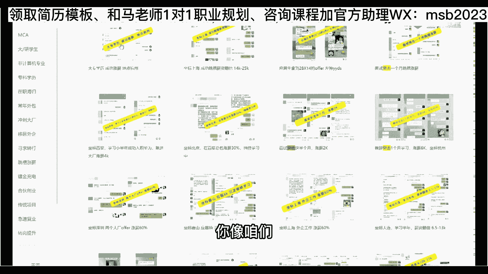
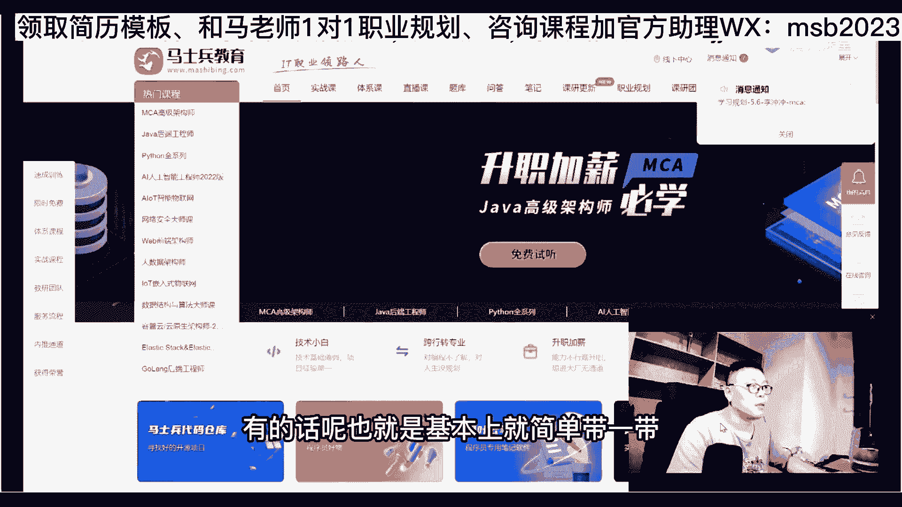
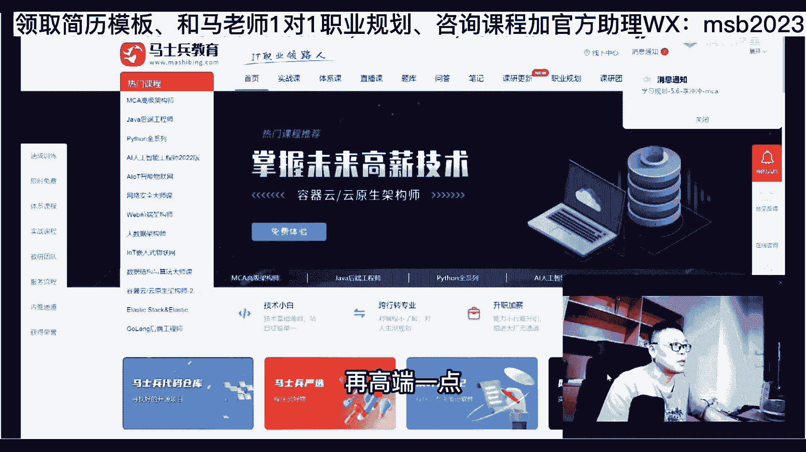
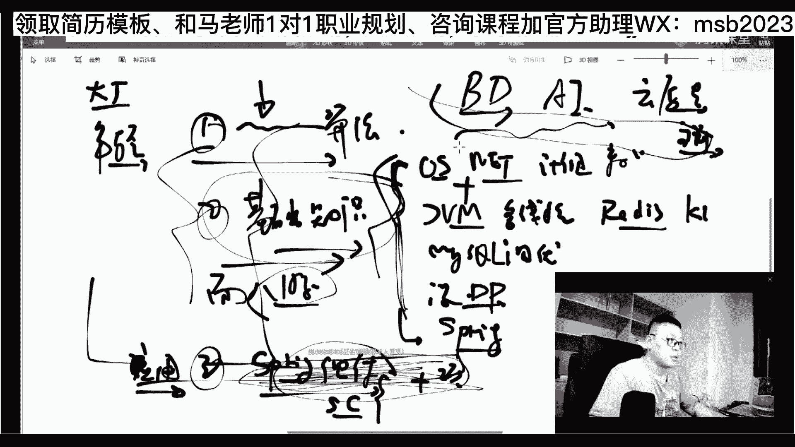
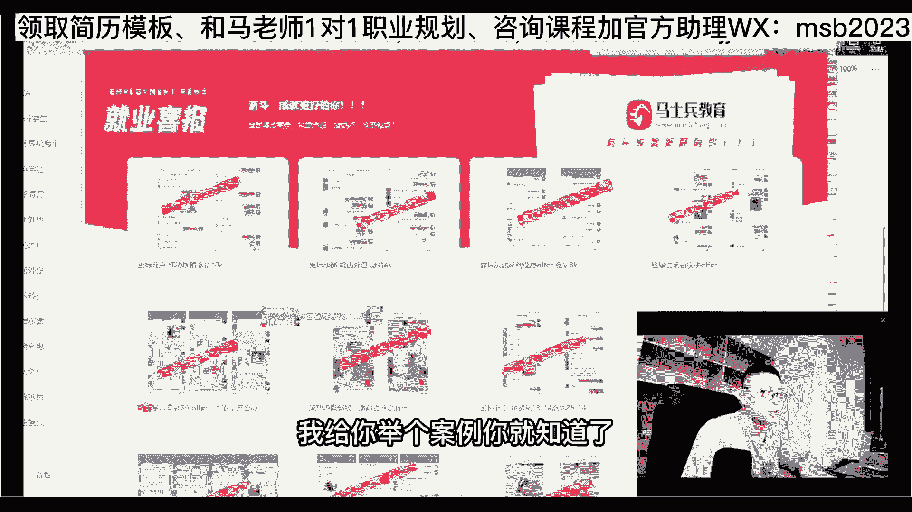
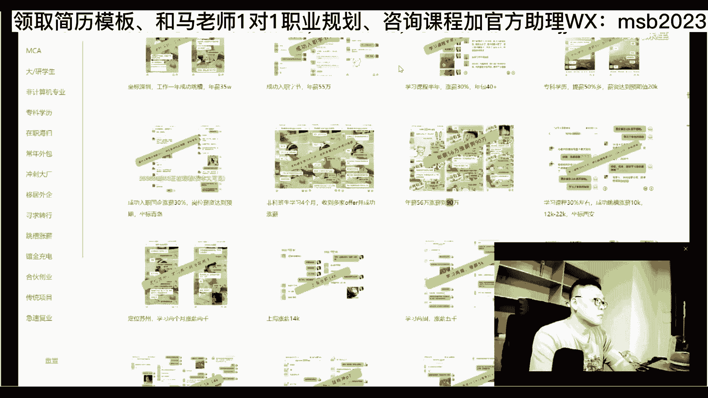
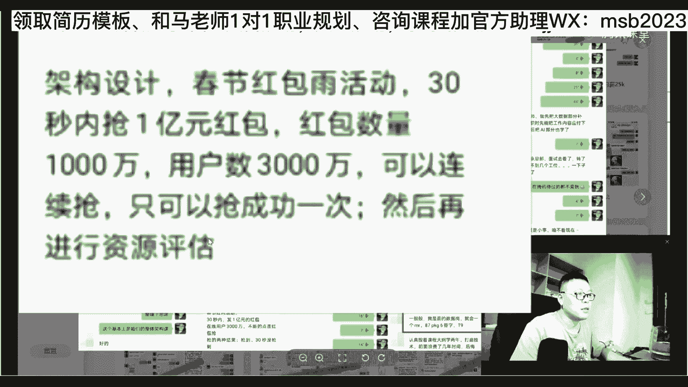
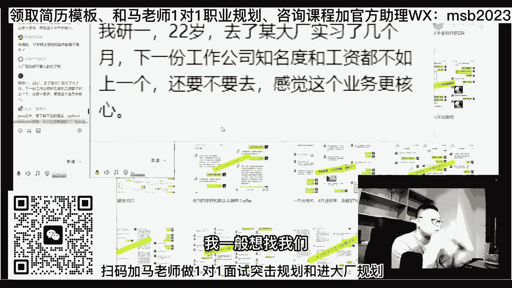

# 马士兵教育MCA架构师课程 - P56：【2023】如何从外包进到大厂？ - 马士兵学堂 - BV1RY4y1Q7DL

这是快速，那么有有一部分有一部分工作是不适合快速的，这个我不知道大家知不知道，下面我们来聊一个就是不适合快速突击的快速，只能解决是快餐，快餐都不好吃，只有你在走投无路的时候，我建议你吃快餐。

但是当你的时间比较充裕，你应该去吃点那个好吃的米其林餐厅的好不好，就不要吃快餐了，那么什么地方不适合走这条，走这条路呢，有一个是极其不适合的，就是进大厂好，有多少同学自己想进大厂的，给老师扣个一。

我们来简单聊一下，就这个是没有办法走快餐的啊，除非你原来基础够，只是欠缺某其中的某一两个部分，这个可以，其他都不行，好我们来聊进大厂这件事情，进大厂这件事情，大概不同的年龄，不同的策略。

如果你是小孩儿应届生，那么你的策略是第一种，如果你是32岁到35岁，那么可能是另外一种，如果你是35岁到更大一些，这可能是另外一种，再说一遍，不同的人，不同的背景，不同的策略，我们一步一步来讲，首先。

呃首先第一个，我假设你是应届生或者是相对比较年轻的啊，几几年工作经验的这种这种小朋友，呃，我我有一个意愿，我想杀进一线互联网大厂，我想进阿里，我想进腾讯啊，快手字节，甚至我想啊进谷歌进微软。

那这时候怎么办呢，首先第一点，我刚才所说的那个无限复活那件事情，无限复活策略是不好使的，为什么，因为全国的大厂就那么几家不，他不会给你来来回回的复活机会，这个大家能不能听懂啊，你不能拿它去练手，你练手。

你只能去找那个呃那个广大的中小企业去练啊，你不能拿大厂去练手，那是你的最终目标，你把他当当练手的，你过不了，你不很亏吗，你亏死了，是不是，所以这个时候呢就需要你非常详尽的准备，你的各种的策略，呃。

我们先讲应届生怎么进，应届生呢，仔细听这个嗯，关于乐队生来说呢，又分好几种情况，我先说就是比较普遍的啊，你需要准备什么知识，听懂了吧，这个知识的第一第一权重，这个很多人可能不太知道，第一权重是算法。

兄弟们有好多应届生，我看到那猛学呃，学那个各种应用的知识啊，学js啊，学甚至学photoshop，学ui哇，哦跟那稀里哗啦稀里哗啦学了半天，结果学的全都全都是不重要的啊，人家要求胸肌发达啊。

你搁那练了半天，就跟那狂练肱二头肌啊，搁那狂练那个后后后背肌没有用，所以就是老师的作用是什么，你就是能起码能告诉你，你的重点该放在什么地方，深度应该放在什么地方，这第一个呢是是算法第一，这是第一权重啊。

仔细定制，这是最重要的，算法课是一个非常硬核的课，这个课是非常硬核的，这也是为什么大厂喜欢考他的原因，你做不了弊，你知道吗，华为想进三道算法大题，其中一个必然涉及到图，字节你想进，不好意思，你算法的话。

可能动态规划都是那个都是相对不太难，不太难的那个题目，明白吗，所以这是非常硬核的，你根本是做不了b的，你要知道在整个国际上，北美微软，谷歌亚马逊这些他们考应届生只考算法，他不会考你，jvm是个啥。

县城是个什么东东，那个操作系统是个什么玩意儿，他不会考这些，他只会考你算法听懂了吗，呃江湖上流传着一个故事，一个真实的故事，东莞电子厂的一位女工，阴差阳错到了美国之后，大概自己在那边学算法，学了半年。

你猜怎么着进谷歌了，这是真实的故事，你们在百度上还能搜到，不信你自己去搜，有他的名字，能听懂吗，所以这个是你们的第一权重，所有的包括这些应届的，包括你们小年轻，32岁以下这个东西啊，是你避不开去的。

避不开的一道坎儿啊，这是没有办法走快速的，就是其他所有的课都能都能都能走快速路线，唯一的是算法，算法为什么难，也为什么值钱，嗯难其实也谈不上你这样子。

我原来呢其实大多数的讲讲基础课的机构啊，不太会讲算法的，有的话呢也就是基本上就简单带一带。

目前成体系的讲算法的，咱们肯定是讲的讲的是最多的呃，这个主要的原因呢，是我想让我们的学生呢再高端一点啊，就是说拿到拿到拿到拿到工作机会啊，再高端一点，再高端一点。

当然这个课就会比较硬核。

那么这节课的老师呢叫左老师，请宗老师过来也很也很不容易呃，朱老师是本科的时候，是华中科大，研究生呢是那个芝加哥大学，在美国那边的ibm待过啊，在亚马逊待过，那么在中国这边呢在百度啊呆过呃，到现在呢。

嗯全全程好评，那个上网课的内容呢当然也会比较多，大概是这么多，尤其是那些个对于非计算机系的同学啊，你一定要认真听，就说你想补计算机系的专业的知识，算法是第一位的，因为所有的不管是软件还是硬件。

不管是设计还是编码，其实最终的最核心的它就是算法，那么我们会一般会首先给大家讲那个新手，就是你对算法什么都不了解的时候啊，这个这个新手班的内容呢倒不会特别多，主要是讲什么呢，讲一些链表啊。

讲一些简单的题目，讲一些二叉树啊，讲一些排序这些，国内国际的大厂，那么这个体系班的内容就会非常的多呃大概会，比方说各种的深入性的排序问题呃，堆的问题加强堆的问题，前缀数的问题，二叉树的一系列的问题。

贪心的算法啊，贪心算法也比较重要，并查集，这个应该考的也是蛮多的，就是那个字节特别喜欢考并查集的问题，那导问题是字节经常考的，华为必考，经典的递归，然后暴力递归到动态规划，动态规划的话呢。

其实我们编程很少遇遇见动态规划的问题啊，这这都是学术上的一些东西了，但是呢呃很多大厂是要考考这个，考这个内容的啊，然后呢再到什么呢，窗口的最大值就是呃就是滑动窗口的问题啊，单调站的问题。

然后k m p的，当时那个自己考个手写k m p啊，嗯mannature是吧，莫里斯便利啊，蓄水池p p r t等等，然后呢线段数就是各种数的问题，ac自动机哈希函数啊，这是红黑树啊，有序表。

卡特兰数啊，sb数等等啊，我就不一一念了好吧，就是这部分呢大概是帮大家总结了，各种各样不同的问题，用一系列什么样的规律去理解它，当你遇见一道题的时候，那么你的脑子里就能浮现出来，对应的那个规律是什么。

这是左老师给大家解决的最大的问题啊，看不懂就对了嘛，大厂要是考的考的东西，你你很容易就能看懂，那就没意思了，呃在这个基础之上呢，基本上我们每周都会把大厂的面面的题，哈哈给大家讲一遍，这是以往的录播呃。

这个是下面的下面的直播，new的来自网易的面试题啊，来自字节的面试题，来自京东的，来自学员的问题，大概讲算法课，我觉得讲到什么这种深度的呢，基本上我我我在市面上调查了一下，没有啊，嗯咱们跟京东呢。

也曾经就前两天刚刚举办完，那个全全国算法大赛，呃，以前跟搜狐举办过那个算法大赛呃，就这么跟大家说，如果大家伙现在还在大一大二嗯，大三还来得及，还还来得及，让老师来训练。

你其实最好的进大厂的方式是参加一些个呃，常见的这种面试，这种算法的竞赛，然后拿一个小的名次，哪怕就是一个鼓励奖，对你的简，这就是你简历上特别特别增光添彩的地方，这是进大厂。

当然你你说老师我我那个学历不太好，我现在还没有办法进到大厂里去，没有关系，你的第一步先拿份工作入行，入行之后再进大厂的办法，也有的是听懂了吧，这是第一，这是第一权重，这时候下这个我们我们梳理一下啊。

就是说我们现在是讲的进大厂的问题，进大厂里面的三类人群里面是比较年轻的，这批人，好年轻的这批人进到大厂，那么怎么这个时候是什么什么样子的呢，第一权重是算法，记住了吗，这是你的第一权重。

那么第二权重是什么呢，第二权重是基础知识，国外不考，但是国内就会考基础的底层知识，那么这部分包括什么东西呢，这部分主要包括的是，如果是在校生操作系统网络，祭祖数据库大概这四门，其他的什么什么。

你要是软件的话呢，什么电电路了呃，集成电路数电模电了，这个肯定是不需要的，然后参加工作的同学，这vm注意这是加相加的关系啊，前面也是需要的，jvm多线程就是并发的问题嘛。

然后比较常见的redis be one卡夫卡或者rocket是吧，然后mysql调优还有设计模式dp啊，设计模式design patterns，还有，部分源码就是说我源码我建议是读spring。

spring是最经典的源码，没有之一，常见源码就源码原理基础知识，这是你的第二权重，好的我们讲第三权重是什么，第三权重是spring系列组件的运用。

直接从spring boot到spring cloud的七八个组件的综合运用，加项目，这部分叫应用，所以第一权重是算法，第二权重呢面试八股文，我们简单把它称之为叫八股文，背面试八股啊，了解原理。

背第三部分叫应用，就是你日常开发，每天敲代码干的事，这是你的第三部分，剩下的是加分项，加分项有大数据，big data ai，有云原声，有高并发架构的设计与处理，好这些全是加分项，来这块能听明白的。

给老师扣一，所以你们大多数在校的很多学生，使劲玩了命的学这块，那不好意思，这块对进大厂的帮助并不大，ok最大的是在前面呃，越年轻进大厂就越容易，年龄越大，进大厂的要求就越高，那么下面我们讲进到大厂。

如果我年龄稍大了一些，32 35啊，30~35吧，差不多这个这个水平，那这个时候我想进大厂的时候是什么样子的呢，其实非常的简单，就是大厂对你的要求和这批人是不一样的，首先呢很多大厂依然会要求这部分内容。

也有部分会依然会要求这部分内容，另外呢除了这些之外，因为这你到30岁，你干了好长时间了，像这种内容应该早早就早就搞定了啊，早就搞定了应该，所以第三项内容你应该早就搞定了，那么还需要一些什么样的东西。

因为30岁往上进，大厂往往要求的是设计能力，它可能不是落地明白吧，他并不是你要求你去落地，要求你去敲个代码，只是要求你这点能力的话是不够的，他这时候往往要求的是一个设计能力。

那设计能力要求的什么样，我给你举个案例你就知道了。

找一个案例。

这个案例我比较喜欢举，因为它比较典型，这个是小伙，大概是34岁，我忘了啊，大概我依稀记得，要么就是33 34左右，这是那个进腾讯的时候，腾讯考的面试题，那么你自己看，他就已经和年轻的时候考的就不一样了。

进行一个架构设计，春节抢红包雨30秒抢1亿，数量1000万，用户3000万，连续抢只能成功一次就给方案，然后再进行资源评估，这是骗方案，你牛啊，你你你真值得，你真值得别人骗方案，那你下次别面试官问你。

你不跟他说啊，娘的骗我方案不跟你说嗯，我跟你讲，我跟你讲，我送你四个字，送你四个大字，叫就是你什么东西都往特别不积极的看看问题，叫敝帚自珍，写错了啊，你们你们自己想去吧，就是拿个破扫帚还当宝贝。

就你那破方案，有人有人有有人愿意要吗，有人愿意要，你得高兴才行，大哥哎呀，别这样啊，什么片代码片方案怎么了，你就给他，你就给他，你有没有进行练习。

历史上再一个这就是态度问题啊，这个多多扯两句，我想起来了，就跟大家多扯两句，因为今天就随便跟大家聊会天，我们讲那个一个公司里面能够得到提升的，提升速度最快的人会是谁，是多干活的人还是少干活的人。

是愿意主动承担责任的人，还是不愿意主动主动承担责任的人，是给我多少钱，我就干多少活的人，还是我先把活干好了之后，我再下一个钱，是下一步问题的人，你们自己琢磨去好不好，因为有一批人所处的自己的处事态度。

大概就是这样子的啊，就是说你给我多少钱，我就干多少活，有一个人有一个成语呢叫能能者多劳，那么还有一个呢叫劳者多能，ok，好然后腾讯骗了他的方案，然后他把方案给腾讯了，腾讯给了他90万年薪，然后他就去了。

嗯你你腾讯下次问你，你千万不要告诉他方案，这个不能告诉他啊，那么大概会会加到这种程度，就是架构设计，关于架构的设计呢，主要包括这这些方面的东西啊，咱们年龄稍微大一些的，我多说两句呃。

关于架构的设计主要包括的是什么呢，第一个是大并发量的设计，大并发量，ok第二个是大数据量的处理，这是这两大块，并发来的时候要求稳定性，要求效率高，呃这种内容呢其实还是还是蛮多的。

就是这种设计上的内容还蛮多的，设计上内容呢其实要求你掌握了哪些个常见的，各种各样的中间件之后，就是你常掌握了那个常见的那种，那种各种的中间点之后啊，呃然后呢还要去了解，他的选型问题吗。

这是咱们的一个课程大纲啊，你可以通通读完课程大纲之后，其实你会知道你的那个整个的知识体系差哪些，嗯大概从理论讲理论角度讲的话呢，有这有这些方面的设计需要你考虑，就是高性能的架构怎么做分流设计。

怎么做服务的并行与并发，缓存的设计，存储的设计，可靠性的设计，应用保护性的设计啊，就这个设计原理懂了之后呢，尽量多做一些案例，就是各种各样的案例，比方说12306的，比方说那种那种互不互关于点赞的啊。

比方说秒杀的，抢红包的，微博互关的，把你那些个原则性的东西用起来，这样的话呢，别人在问你这些问题的时候，你就答得出来了，听懂了吧，当然不是说，我不是说你所有人都能拿到腾讯的90万年薪，但是从架构师角度。

刚才给大家搜的那种五六十万，你信你就需要这些内容了，嗯大概是这部分，那么我们说年龄再大一些的呢，其实年龄再大一些的时候，很有可能算法就他就他就不会再问你了啊，我们有一位兄弟是37岁吧，杀杀到美团。

他就不会再问他算法了，为什么哪些方面内容呢，有可能会涉及部分管理内容，ok有可能会涉及设计的内容，架构的内容，这些都是需要你掌握的了，但是管理上的内容，有可能有可能会涉及涉及到一些了。

但是他的要求会非常的高呃，因为由于我手头案例比较多，但是我不想再举了，因为大多数人到不了这个这个层次上，我先就不给大家举这种案例了好吧，你有需求的再再问我好吧，我讲了怎么拿入行性的工作。

我讲了怎么杀到大上去呃，是大厂的训练，正常的情况下呢需要半年到1年，那么这个时候嗯是比较容易进的，会大大的增加你的概率，嗯那个你肯定要付出一些自己的劳动好吧，我集中上几点就这样说，我我集中再问一下。

就是说其他方面的一些问题，大家比较典型的呃，有管理团队的课吗，呃首先大家大家那个管理团管理这个课，有有有有有感兴趣的，给老师扣个一，就管理这件事情，我也顺带跟大家讲。

就是说年龄越大之后该怎么样进行进行发展，好不好，举举举一个案例啊，还是举例子吧，举例你就明白了，因为我刚刚刚光跟你讲肝体系，你是不理解的，呃，看一个简历的模板，我的简历模板呢，我手头就这几分啊。

但实际上很多的44岁的这个大专生的，百万年薪的这个简历，我们不是看他年薪有多高，他这年薪也是在前几年行情比较好的时候，拿到的，其实近几年再拿的话，很可能用新手到不了这么高，要降低一点点，不过没有关系啊。

我们主要看他的那个整个的发展过程，他写的是硕士，但他实际上是一个大专的同学呃，我们看他的这个这个这个教育经历，往这看就行了啊，呃它是原来扬州大学的，热加工工艺设备的专科生，然后第二专业计算机。

我不知道他大专是怎么读第二专业的，这个不太了解，这个不管他啊，高等学校高等数学成绩名列第一啊，数学生大赛竟获得一等奖，好各位同学呃，我讲到这儿，稍微的那个偏离主题一点点。

我想问你就这玩意儿写出来有没有用，这有用吗，这10000%有用，但是对于大多数那个应届生写的里面的像什么，呃，我是团员啊，我是学生会学生会会员呃，我组织过什么时候活动，我喜欢打乒乓球，那个有用吗。

屁用没有，这是和专业有关的东西，你那个是和专业无关的，能理解吗，好这个东西呢是说呃，就是说你比方说我什么，刚才讲就是大家伙可以去参加某一些比赛，然后呢，你说我我我竞赛我得过奖，你实在不行。

你们学校举办的比赛，你说2021年啊，陕西理工大学，然后那个全校是吧，计算机算法大赛啊，我得了二等奖，有人会去会去会去会去做这个背调吗，好什么优秀毕业生对，没理你啊，什么东西叫做简历技巧。

简历的技巧有好多，这是其中一种啊，因为这种简历呢我一看就能看出来，但是呢hr不一定能看得出来那个这种技巧，那还有一些什么样的技巧啊，比方说我学历不好，因为今天学历不好的同学应该也蛮多的。

我刚开始还没讲课的时候，就一直说我学历卡，卡学历怎么办是吧，这个卡学历哎呀娘的卡死我了，我就找不到工作呀，我是一破大专网络大专自考大自考的大专，来对学历有疑问，能给老师扣个一，各位同学认真听啊。

要对卡学历卡专业，就是说现在呢嗯你搁以前的话对吧，你学历你随便找一个完事儿啊，现在呢你学历都是学信网直接可以查的，对不对，所以你学历是什么样子就是什么样子，所以现在我认为现在是正常的啊。

以前呢真的是各种的那个手段，花活多的是，那现在呢不要去不要去玩各种手段，花花大家认真听，第一个麻烦你提学历，他是大专生，但是他是自考的本科，看了吗，南京大学的自考本科生，ok自学考试，好吧。

所以麻烦你把提学历这件事放到日程上来，我这么跟大家说，学历呢会变得越来越不值钱，有同学说老师不值钱，我还考啊，那没办法，那只能说就是越往上越值多多值钱那么一点点，比如说举举举个例，举个案例。

那个最近有什么北大博士，什么清华的研究生什么的去去呃，去什么保安的，去什么去应聘这个应聘那个的，对不对呃，全中国的博士生1年的毕业大概12万呃，所有的科研机构加起来大概的需求是4万人。

剩下8万人是需要自己去搞定一些自己想干的，干的活，干的工作的，以前有个计算机系的博士生，然后还是挺不错，学校的计算机系的博士生啊，在北京的话呢，他已经30多岁了，差不多才拿30万年薪，我看了也挺可惜的。

就是路没路没走，对，非常可惜啊，其实稍微点拨点拨乘以二总是不成问题啊，呃有些人呢总是自以为是，觉得老师你就骗我钱的，你什么都不懂，你就是割韭菜的，所以呢就是好多话你老师讲给你听，你也不听。

这课程课程没什么价值，我走了没什么关系，就是说咱们只只度有缘人好吧，那个，当博士变得越来越不太值钱的时候，你就想研究生会值钱吗，本科生会值钱吗，更不要提你专科生，那这时候怎么办呢，麻烦你往上提一提啊。

你反而是应该提一提，因为很多很多的人在招聘招聘人的时候，他有可能第一个就给你限制，必须是本科对吧，然后有同学说老师我提学历好不好提，能不能提得上去，提学率办法有的是啊，你要是我们小姐姐。

我们自己也有合作的院校，他提起来呢，其实这真真心不难，你不需要花太多的那种精力进去啊，几千块钱差不多就搞定了，大概但是时间比较长，这个是没有办法的，你提一个学历，从专科到本科，那你肯定得23年左右。

所以你一定一定要提前把这件事放到日程上，兄弟们，你千万不要在35 六岁的时候写出简历来，还在那写着，我是个专科生，你想想看你的竞争力会会会好到哪去吗，10000%好不到哪去好吧，所以这件事要提到日程上。

提到日程上来，职业生涯也可以，也没有问题，就说你的学历往上能往上提，往上提一提，所以老有同学问我说在直言值不值得读，我说时间精力，经济条和条件允许你能读，完全可以读，而且呢油它一定比没有强。

最简单的其实就是这么回事，当你是一个专科的时候，那么能接受你的人就这么多，十家里头三家，当你是一个本科生，十家里头五家，当你是研究生，没准十家里头七家大概是这么一个概率，这么只是这个意思。

就是你的选择面会更宽，来这会儿能能听懂的，能听进去的，苦口婆心的给老师扣个一，好不好啊，至于说专业不对口，各位兄弟们这个关系不大的，我跟你讲，你学历比较差的人，我以前也教过一些写简历的技巧啊。

今天免费公开，你看看看看这里，那是什么叫什么叫给自己，什么叫给自己那个那个那个贴贴金是吧是吧，诶给自己吹牛逼看了吗，不就是个大专的学校的，一个大大专学校的一个计算机系吗，哎吹牛逼，看到没有。

录取率仅为10%，牛不牛逼，你最差最差的可以这么写，当然你不你可以不写，你可以那个跟hr讲啊，见不到hr的时候，你可以写在简历上，对不对，你说哎呀，我高考的时候啊，哎呀我本来能上985的娘的。

当时发了一阵子高烧啊，只发挥了20%的水平，不好意思，进了大专，家里又穷，不想再重新考1年了，唉大专就大专吧，但是我在大专里面奋发图强，拿了哪个哪年哪年的奖学金，拿了哪年哪年竞赛的奖啊。

在我们大专里面仅有一个人，百分之几的人能够得到这种奖，你猜那hr会不会高看你一眼，也许以前没有的机会，没准你就争取到，就是看你争取还是不争取，我都讲到这里了，你就不要跟我讲这种话了，说这个难搞啊。

那个难搞啊，想原因想办法，你刚搁那儿发感慨，那有屁用，发牢骚，谁不会拿解决方案，想原因，想想解决方案，想办法，这个也是你干的事儿，所以这篇这篇简历里其实有各种各样的技巧，当然人家是除了技巧。

只有是硬硬的玩，不过你的时候才会玩软技巧，如果硬记能够谁跟你玩软技巧，所以你往这儿看，他在提学历好，我们下面看他的下一个学历，这个学历是工商管理硕士，就是俗称的m b a来。

有没有了解过nba读一个mba要多少钱，有没有了解过的，对于nba要多少钱啊，这个大家知道吗，便宜的十几万对，像中欧清华北大三四十万到百万之间，唉好各位同学，他读的是合肥工大的nba，我不知道多少钱。

哎你就说这这兄弟他妈的哎呀，这提升自己简直是是吧，那个那个太太舍得花血本了对吧，我一个月才赚2万，我1年才24万，我读一nba 180000，哎呦，我可要我，我肯定不多，我亏死了，我，是吧。

我一个月才赚了3000，买马老师一个课是吧，1万多块钱娘的亏死了，绝对不能买，来我们看它的收益，他为什么要去读nba，这是上海的架构师呃，大数据方向，大叔就是一会我给大家讲一下，架构师分好几个层。

好几个不同的方向和层次呃，这是他是8万到13万的月薪呃，你自己算的年薪是什么，麻烦你对自己的认知上的投资，一定要舍得花钱，那么一点点好不好，就是说这这份收益啊，就是远远超过你所有的投入呃。

学员的这个数值来讲，大概平均是三个月左右涨5000块钱，这是在疫情之前发生疫情之后呢，这数字稍微降低一些啊，三个月左右涨了三四千块钱，大概1年的涨幅5万是起步价，投入是，1万块钱多一点。

因为我们课非常的多嘛，然后呃每年至少多赚回5万，注意这只是1年的，10年就是50万，你怎么也得工作20年吧，我们说假设你以后再也不涨钱了，你就涨了这么多，以后再也不涨钱了，20年也是100万。

这就是你的投资收益，其实，在大家举个小案例，也是一个大专生，这是我的那个10年以前的学生，10年以前他杀进阿里的时候，3000块每月听懂了吧，现在多少百万以上大赚，呃那么这个小小伙子。

当然他不只是我的学生，他也学了好多好多课程，那个他当年我记得最搞笑的是，自己不会谈恋爱啊，报了一副一报，报了一个谈恋爱的课，然后报了一个指导怎么样去学习的课，打台球，找了一个台球的专业教练来教他。

后来我推荐他又去读了nba，40万读的，我们便宜的多，也实惠的多，m b a呢，其实在我看来，当你去算这种成本的时候，你永远都不会觉得说值这个值，这个就三四十万块钱啊，我认为那可能也不值。

但是他换回来的收益，如果你运用的好，那就是这么高，就这个意思讲到这里呢，我个人推荐啊，我们不讲nba，我们不讲管理上就是专业管理课啊，因为管理是一个特别大的学科，那么但是我个人推荐。

所有的超过32岁的同学，如果你愿意有经济上，经济上允许眼界也能够打开，愿意把自己的眼界打开，可以考虑nba，有同学说老老问我说读m em呀，在职研呀，还是ba，我跟你说，一分钱一分货。

nba为什么说我推荐大家，原因就是打开你的整个的大的适应，这个要稍微的往上拔一拔啊，刚入行的同学，你就听个热闹就行了，就是说所有咱们我们，我我们举一个最简单的案例，就讲这是公司的核心的业务。

比方说你们公司呢就是靠电商呃，来支撑支撑的是吧，就是卖卖货，网上卖货，那好我就想问你啊，离这个业务越近的人更容易赚钱，还是离这个业务越远的人更容易赚钱，各位兄弟们，一定是离你的核心业务越近。

你赚钱就越容易，那什么样的人离核心业务越近呢，想方设法往这里靠好，我问你啊，我们跳出技术来看技术，就是我跳出这个纯技术人的层次来看这个技术，你会发现，技术往往在整个公司里头是最不重要的，在很多公司里啊。

我不是说在所有公司里说我们公司就是核心，就是靠一个专利的高科技，那你技术就是最牛逼的，好好吧，但是跳出技术来看技术的时候，你会发现在整个一个公司的运转体系里面，技术往往不是那个起码不是那个。

起码不是那个最重要的，但是技术人往往认为自己是最重要的，我我搞技术的时候，我也这么认为，我搞技术的时候说妈的我要辞职，你的这个这个他们公司离了我，他还能赚几天，结果你会发现离了你人家做得更好。

来有过这种感觉的，给老师扣个一，然后就觉得我他妈就是最牛逼的，谁要谁要离了我那个就赚的更好啊，我相信有好多好多好多人有这种感觉，因为我年轻时也有这种感觉，我根本根本根本就不行。

但实质上你发现优秀的公司就离了，谁都行，记住了吗，如果你要有有朝一日去创个业，你慢慢的你就会发现你你们公司的核心竞争力，其实只有一个就叫管理，当然能领悟到这一点的同学，就已经层次比较高了。

但我希望你保持一个空杯心态，听老师多唠叨两句啊，往这方向去一去，你就知道了，好不好，就年龄越大的时候，所以我们说年龄越越大的同学，技术沟通业务管理叫好几条腿同步发展，你会发现你的职业空间突然间打开了。

o就不再局限在某一个狭窄的面儿上了，你的人生的广阔空间也就开了啊，你就不会再担心什么35岁问题啊，40岁问题，什么50岁问题，60岁的问题，褚时健80多岁创建的出城怎么样，几年时间干到几个亿。

唉所以说年龄不是你想的那么的重要，就是你要匹配跟你年龄对应的，你的水平跟跟你整个的格局的打开好吧，软考的项目经理和p mp怎么样，挺好的啊，这个比没有强，各种证书啊，呃你你有机会有精力有时间考一份。

总比没有强啊，比如说那个es elastic search，你知道我们靠e s e s这个认证，中国也很少嘛，大概几百个人，100个人，200个人才有吧，然后拿到了之后就涨薪，拿到了之后就涨薪，爽不爽。

其实非常爽啊，对excel认证没错，不要想你一会儿工作了，我得叮嘱一下我们的，没什么工作，这刚才啰里吧嗦的讲到讲到什么地方了，嗯讲这个学历的问题了是吧，嗯我们讲了怎么入场，怎么杀大厂啊。

这个是学历的问题啊，我看看大家会有一些什么样的典型的问题，如果没有典型问题，我下一步打算给大家讲一点什么东西呢，就是关于语言的问题，这也是大家伙最容易困惑的点，关于语言哎。

我到底是搞这种语言好还是搞那种语言好，这个是不是大家伙比较困惑的点，如果是你给老师扣个一，我是搞java好，我是搞go on好，搞c加java好，搞什么好，我要我从这个语言要不要转向。

另外一种报道这种问题啊，好我们我们把前面的讲的内容答小小答一个疑，或者打个一给大家看看，大家伙有什么有什么什么典型的问题，没有啊，双非研究生应届生想和本科生搞点不同的，找到自己的定位和对标对标岗位呃。

没有什么特别不同的，因为不会有说专门针对研究生，应届生和本科生应届生的不同的岗，没有这个岗可能急招研究生，应届生，也也可以招本科生应届生，但是呢呃举个最简单的案例吧，那么就这个同学啊。

就是我们刚才我看有同学想要说，那个面试的资料是吧，面经里面呢有一个非常经典的啊，稍等就这个我们的面经里面有一个非常经典的，就这个面经，这是阿里七面的面筋，就是这个点这个同学帮他们总结的。

他呢是那个念了在阿里那边练了七次，一共练了七次，进了阿里淘系，叫阿里国际啊，阿里阿alexpress，那那那那个港那个在阿里内部，应该算是比较重要的一个岗位吧，一个部门吧，好像是啊。

这个有今天有没有阿里的同学，也可以也可以求证一下，大概的话呢练了七面才进得去，他是一个研究生的呃，应这个应届生，然后天津的一个学校，然后呢，进去之后在杭州工作，差不多毕业的年薪在30万左右，可能高一点。

可能低一点啊，具体我不太记得了，那么如果是本科生的应届生呢，这个薪水会低，听懂了吧，这就是它最主要的区别啊，所以同样的岗比研究生过去呢，很可能你的薪水薪水会高一些，你的本科生过去呢可能薪水会低一些。

即便是同样的岗，理解了吧，同学们很简单啊，所以但是他没有没有那个那个那个是专门的，我就抄研究生应届的或者什么样的，除非除非各种特殊的公司啊，这不去管它嗯，看看还有一些什么典型的没有啊，甲骨文数据库。

阿里云，华为云这种呃，这种含金量怎么样，比没有强，挺好的，就是说遇上专门做这些的，他会他会很看重这一点，像阿里云，华为云这种认证呢，比如说你在三四线城市，二三线城市那个杀伤杀伤力更大啊，就是云原生。

到目前为什么说建议大家去要去，要去了解我们课程体系里为什么要加云原生，就是很简单，就是在呃那个那个和一一线城市，都是都是有要求的，那个好多二三线城市呢你可以吊打别人，可以降维打击啊。

你会你能体验体体体会到那种优越感，我研一22岁去了某大厂实习了几个月，下一份工作知名度和工资都不如上一个，还要不要去，感觉这个业务更核心，嗯哦你呢问这种问题呢，其实本质上没有意义，看这里啊。

那个以前老有同学问我说，老师我面临一个公司要不要去呃，如果你只有一个选择，你你如果你只有一个选择，你认真听，你有不去的这种资格吗，我就想问问你能不去吗，你不去就没工作呀。

所以你应该去争取更多的offer，我一般想找我们。

我们自己学生问我的时候，我一般都会建议他，就说你如果有多个offer，你怎么办，你给我一个列表，要我有两个offer。

一个是这个，一个是那个用的技术是什么，做的业务是什么，公司的规模怎么样了，老师我下一步的发展是想干什么，这个对我下一步的发展是哪个。

