# 系列 6：P58：【2023】面试蒙进去了，呆不住怎么办？ - 马士兵学堂 - BV1RY4y1Q7DL

好了当你理解了这件事之后呢，我们下面来聊，就是中间插播了一下这个算法问题啊，我下面我们来聊什么呢，蒙进去了，待不住，露馅丢人，少年们这个呃有的人是遇到过的啊，就是呃蒙进去了之后，然后真正让你开始操作了。

说你来吧，你给我配置一下，配马上傻眼了，好好听我说，一般来讲你进到一个新的公司之后，优秀的公司大概会给你，前面一段时间的培训时间，这是优秀的公司，你要去到银行的话呢，他这段时间会给你到一个月左右。

你知道吗，这是最理想的最美好的啊，你想想看你白天呢他就培训你日常的业务啊，我们日常的环境，他告诉你我的项目作业环境是什么啊，我们现在面临的情况到底是什么，他培训你这些，你晚上啥也别说。

现在所有的东西背的东西全都不要背了，干什么就看老师怎么操作的，好好跟着跟着老师，晚上偷偷摸摸的操作，白天正常上班啊，该怎么拍怎么拍，能理解的意思，这是理想的情况，说比较差的情况是什么样的，比较差的情况。

大概是给你个两三天时间就让你上手，对上来就干活儿，一点缓冲都没有好，这时候该怎么办，好认真听我讲，你一旦进去了，首先坚持一个原则，不敢不出来，这个是需要脸皮的，你知道有些有些人是给你白养，知道吧。

然后不要问同事，技术问题为什么呀，一问就知道你就露馅了，这么简单的问题，怎么你都不知道，不要问技术问题，但是你可以问业务问题啊，说这个业务是长什么样，他的这这这这这个呃到底是怎么怎么处理的，先进行审批。

还是还还是先进行报告等等啊，听明白了吧，这个你可以问，但是你不要问技术问题，说这东西哎呀该怎么配呀，我配不出来，你帮我配配行不行，这不行，一问就露馅啊，你一定会露馅10000%的，那问谁找老师来问。

听明白了吧，你就晚上偷偷摸摸问老师就可以了，你说老师我现在遇到了这么一个问题呃，然后呢他的大概思路，我我我不知道你能不能告诉我，大概思路该怎么办，ok好了，你这时候找老师问，老师会告诉你思路应该是什么。

晚上告诉你第二天再再再再去再去练就行了好，也就是说你晚上偷偷摸摸做操作，你就别睡了好吧，因为你是那个三步并作两步走进去的，人家别人是扎扎实实学了1年2年，然后杀进去的，你呢一个月突进去的。

你能跟别人比那个扎实劲吗，你肯定比不了，怎么办，晚上你就别睡，你赶紧给我秃就行了，突击做操作，而且做什么操作，就是我现在用到什么，我就操作什么，就是为什么我我给我们给大家提供的课程，我大概200门课。

为什么这么多，其实就是你用到了什么，我们基本上大多数都涵盖，就是你哪怕你没有涵盖的类似的东西，也涵盖明白吧，就是你晚上偷偷摸摸赶紧做操作，能能操作多少是多少，理想的情况是你晚上每天熬熬的黑眼圈。

但是呢你慢慢的站住了脚，因为你突然间发现，只要你把环境问题大概解决了之后，剩下的是敲代码的问题，就方便就方便多了，你至少不会说那个hello world什么的，这些敲不出来，对不对，你不会有这种问题。

好到你慢慢的熟悉了之后，你突然就会发现你每天敲的代码大概都差不多，c r u d好，你就慢慢能够站稳脚跟，这是理想的情况，好，各位同学，我们说不理想的情况，我们主要解决不理想的情况。

不理想的情况是什么样，不理想情况是给你个简单的问题啊，你这不错啊，简历写的很牛逼啊，面的时候也也也能通过，行了行了，这个模块啊，大概一周时间你帮我搞出来，然后别说一周时间了，给你一个月。

我都没搞定一个模块开始的卡到位的问题，我跟这搞了一周都没搞定，这是最不理想的情况，是不是啊，同学们，丢不丢人，估计面试官都后悔死了，他娘的怎么招来这么一个二货，啥都不会，跟我这待了一周。

还得领我一周的工资，别不好意思啊，那个该该领工资，领工资好不好，试用期都得有，都得有工资，国家规定啊啊这个必须必须得给好吧，最差的是自己走人，最差最差，但是自己做，所以这时候你不要怕丢人，还是那句话。

你丢人丢了一周，丢到了某个公司，这对方记住你的话，他除非对你对你有意思，他才会长时间的记住你，哎呀这哥们不错，我想跟他处对象，我才会长长时间记住他，否则的话说我手底下有一哥们儿，跟我这儿了一招。

他走人了，我天天记着他，我不有毛病吗，所以不要怕丢人，给我扛住，赶你再走，不赶不走好，我假设你扛了半天，使劲扛，厚脸皮，玩命扛，也就扛了一周左右，一周实在扛不住了，再说滚滚蛋吧，行你就滚了。

ok你就滚蛋了，惨不惨太惨了，但是你发现什么规律没有，你发现我第一次面，我面了18家，然后面长了一点，然后我带了一周，在这一周里头呢，我至少了解了一些事情，就是我们我们还没吃过，没怎么吃过猪肉。

但是我已经见过猪跑了，企业到底长什么样，工作环境什么样，上级是什么样子的，每天应该怎么开会，环境是什么样子的，大概至少了解了这些好，你下次再练十家，能不能成第二家，可以可以可以可以不可以。

你给我扛住就行了，能不能成第二家应该可以，第二家能不能坚持一个月啊，争取吧，一个月被人轰出来了，能不能成第三家，第三家能不能三个月，三个月还被人轰出来，那一定不是技术问题，各位听听，明白了吗。

这是最差的情况，但实际我们遇到的百分之八九十的同学，第一家就能扛住，有老师做你的后盾，有咱们的问答来帮你解决实际当中的问题，有那个那个那个那个晚上，你偷偷摸摸的各种操作的东西，这都很很齐全。

那有之前的记录简历是不是就花了呀，你担心花的问题，还是担心找不着工作，赚不着钱的问题，这是这是你要考虑的，你要担心花，你就扎扎实实学，从头到尾细节里头攒了三够了之后好好学，学个半年1年，ok然后呢。

你再出去找，这就不划了，听不听，明白了吧，我现在教你的不是突击吗，不就现在你找不着工作，连个投出去简历写，连柳人理没人理的问题吗，所以不同的方式解决不同的问题啊，你不要用那个解决其他问题。

其他的问题来怼这种解决这个问题的方式，这个没有意义好不好，有的人他是眼前就要吃饭的，你要知道好多年轻人是这样的啊，我今天这个月再挣不着钱，我还不上贷款了，好多年轻人是这样的，是不是这样的。

这是最简单的找到工作的突击的，大概的一个方法啊，说里边各种各样的细节或者简历，该怎么样进行细化呀，问到我项目的时候，人家问的会常见哪些问题啊，我该怎么回答呀，这就太幸我今天没有办法跟大家说。

感兴趣就找报一个我们的课，我跟你说报马老师的课啊，他不亏，因为你就听我讲一个公开课。

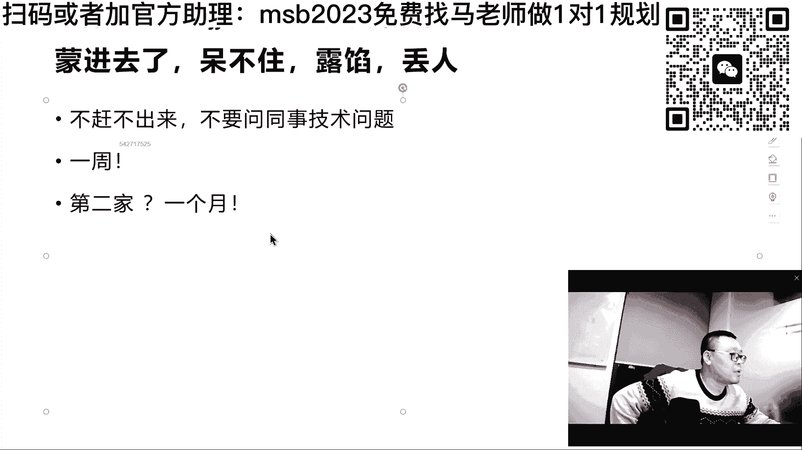

你可能就少走好多弯路，跟我们的课程少少走弯路的多了去了，哪怕你少走个三五个月的弯路，你每个月多挣出来个三五千块钱，你是不是就赚了很多很多，你好好琢磨琢磨，你自学没人带，1年12个月，你学12个月。

你可能找到的工资12一一万二，你要是有人带学三个月。

老师帮你找到工资，可能是18000 九个月，剩下九个月就是你纯赚的，而且这几个月每个月都要多赚出来6000块钱，你自己好好琢磨。

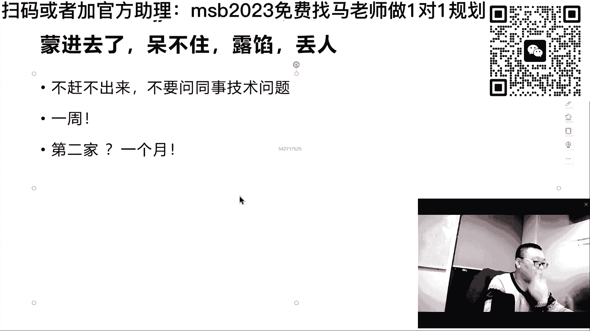

这个能理解吧。

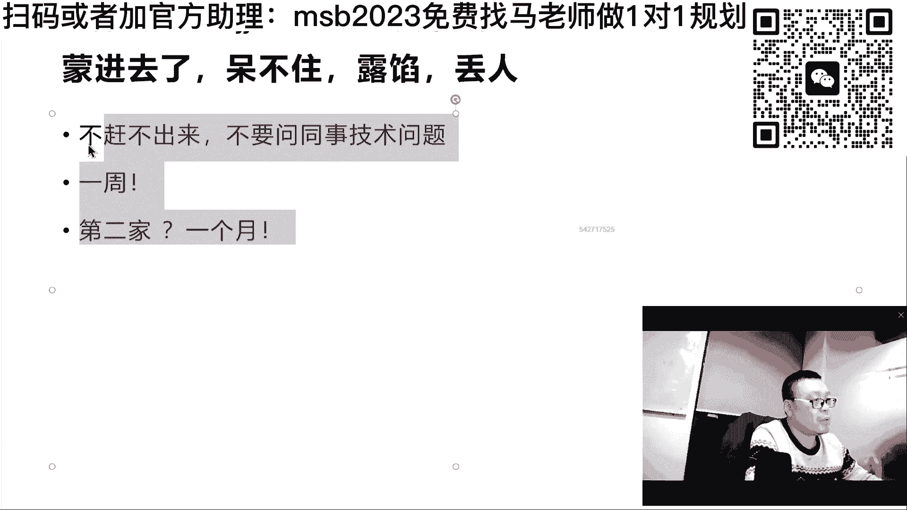

所以多听听过来人，从山顶上下来的人，知道怎么带你去山顶，这个路你是走走不坏的啊，ok，大概的这个突击的方法我就教大家了，来关于突击这块还有些什么样的问题没有，如果有你提出来啊，如果没问题的话。

我们去解决其他的问题好不好，突击课程都是新的，实时更新啊，最新的遇到了哪些，都会总结出来，这个必须得更新，不更新的话，我不可能给你讲几年之前的东西，人家都不问了，我讲他干嘛。

老比我这网络播的时候总是时不时的卡，明天把这事给我解决掉，呃课程有期限吗，2年如果以后还想要更新的话，交100多块钱再听1年，比如没有在企业实习过，不能编公司名吧，为什么不能。

好我先看看大家伙还有一些什么样的具体问题，没有啊，关于突击这块还有什么样的具体问题没有，如果有的话，你提啊，没有的话，我们准备冲击明年第三因素应该报哪个班呃，就是现在的我们mc的班，现在正在做活动呢。

就是我们g3104 的提前班啊，就是你通缉呃，让咱们老师来帮你做好，你差在哪，然后该该该学在哪啊，金三银四的先飞计划，活动时间10月21号到23号三天嗯，了解作为老师来讲呢，就是能帮你做的很重要的事情。

就是了解你的痛点在哪，你需要花多长时间做到一点的事情，做到做到之后，你应该先去学哪个，学哪个该涂哪个，不该涂哪个啊，呃大数据大数据这件事情需要我谈什么，突击是多少天，一般我们定义突击是一个月。

一般我们定义突击是一个月，但是呢呃大多数的如果你差的特别多啊，就是顶多就是三个月三学业余时间啊，不是说那个那个不是说那个呃你你你你你脱产，天天学，不是这样的啊，天天学的话，一个月之内肯定搞定。

就是突击来说，教师级别怎么突击，教师级别怎么突击，方式跟这个是差不多的，呃先先先z是吧，你想想看，作为架构师来讲，你首先要去总结，作为一个普通的架构师，我该具备哪些知识点，刚才你读那个那那个。

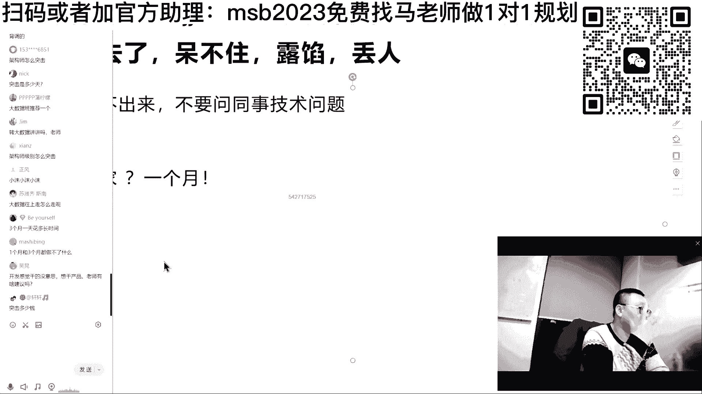

那那那刚才那个职位的那个那个。

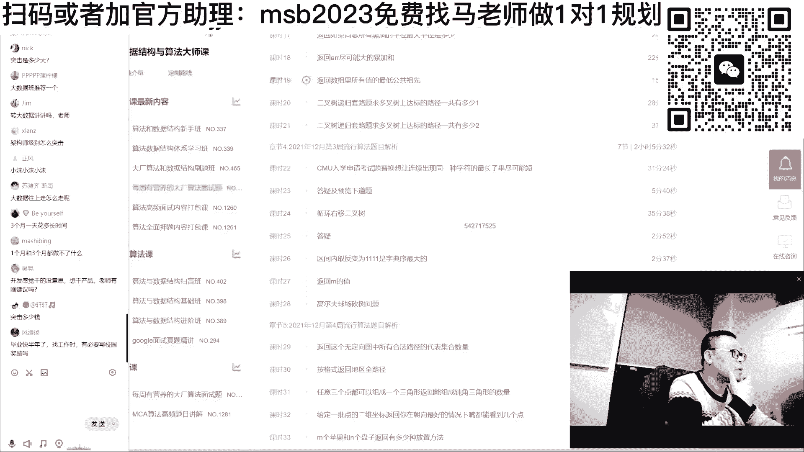

那个那个要求了吧，你刚才读完了吧，其实大多数的架构师，这就是这就是架构师的基本要求，这是长沙啊，所以不要看他新增很低，这是长沙，长沙的教师，薪资肯定要比那个一线要要要低不少，但一线比这个高高多了啊。

不就这些吗，高并发高可用稳定性，安全性，数据一致性，然后呢分分布式系统系统架构，底层平台架构经验，对不对啊，架构是一种存在的问题，给你一定的业务，然后善于捕捉业务需求，加我存在的问题。

给出有效的解决方案方法，ok这不就叫我是吗，所以你突击突哪些图。

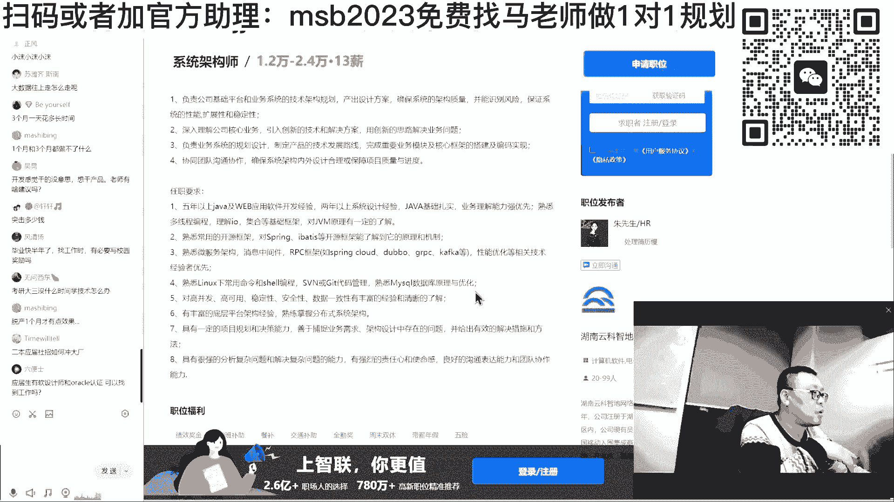

咱们课程里面的设计问题主要是图设计，何同学。

就是我们整个课程体系呢大概分好多啊，但是我告诉你。

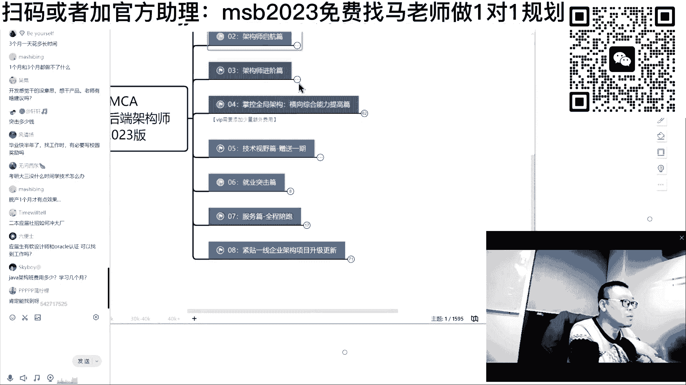

你要突架构师主要图那个图什么呢，图这个主要图设计。

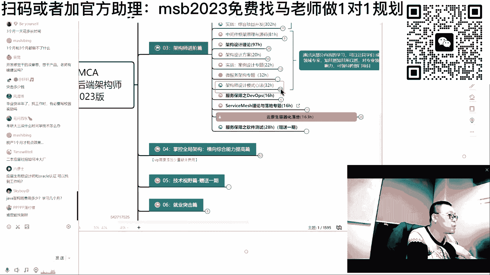

这是设计模式啊，不不这还不是设计模式。

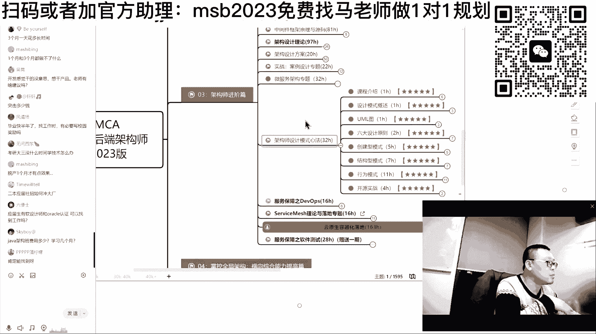

架构。

嗯原声。

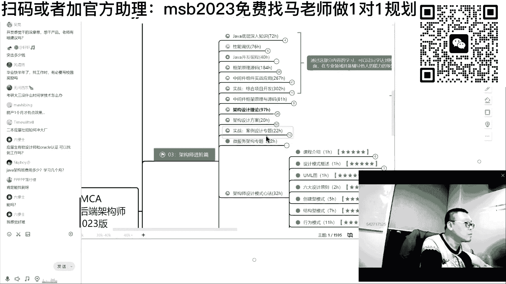

这个就是架构的设计理论。

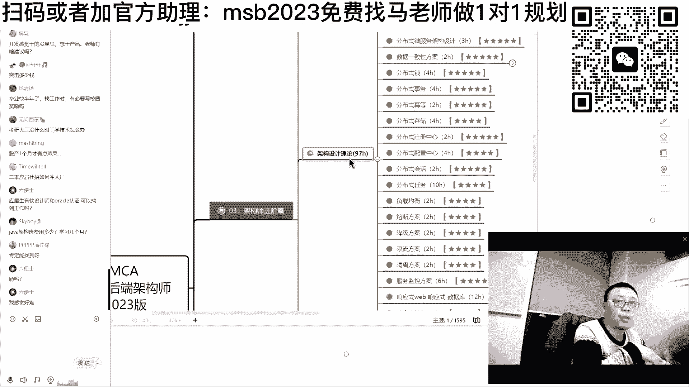

然后还图什么架构的设计的具体方案，架构设计的专题。

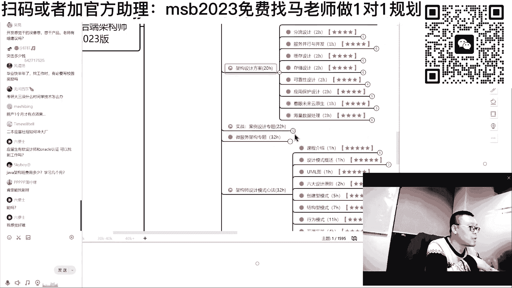

微服务的架构主题，主要图这些能能能理解吧，嗯这是架构师应该掌握的。

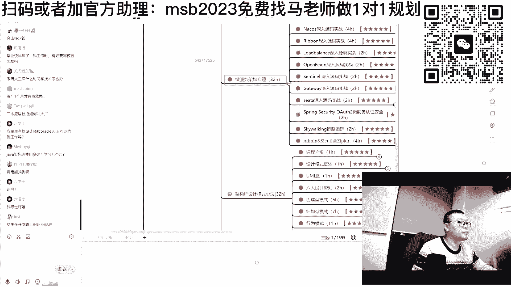

不同的点欠缺点需要偷东西呢不太一样。

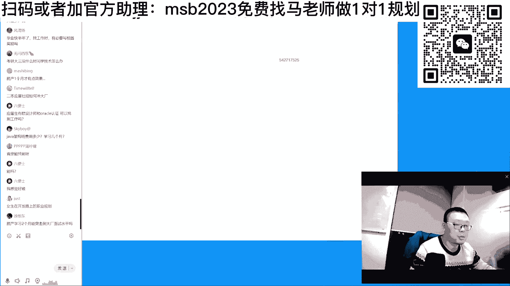