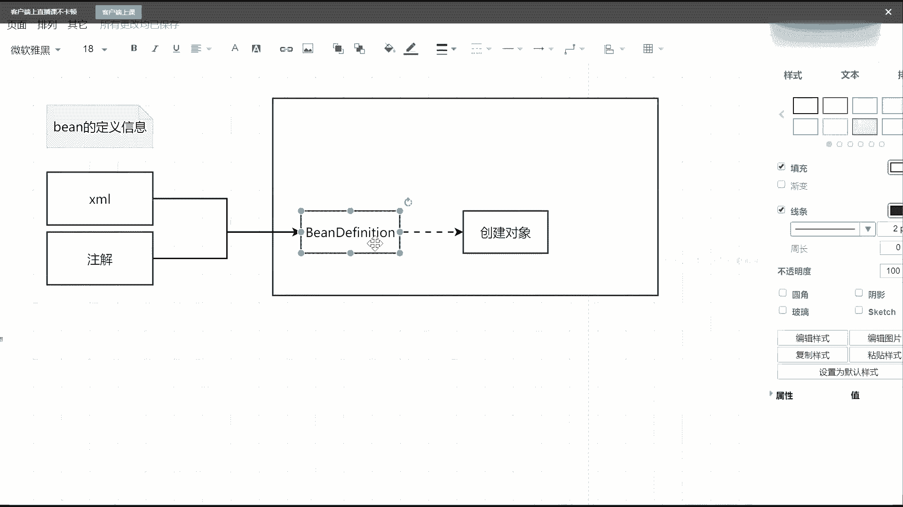
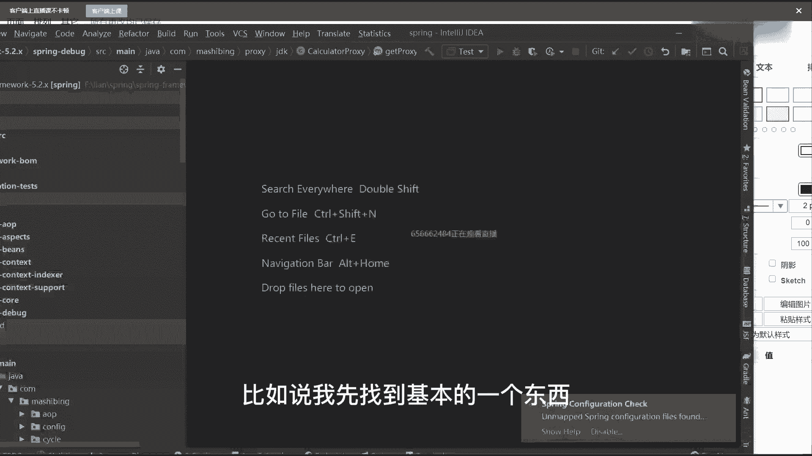
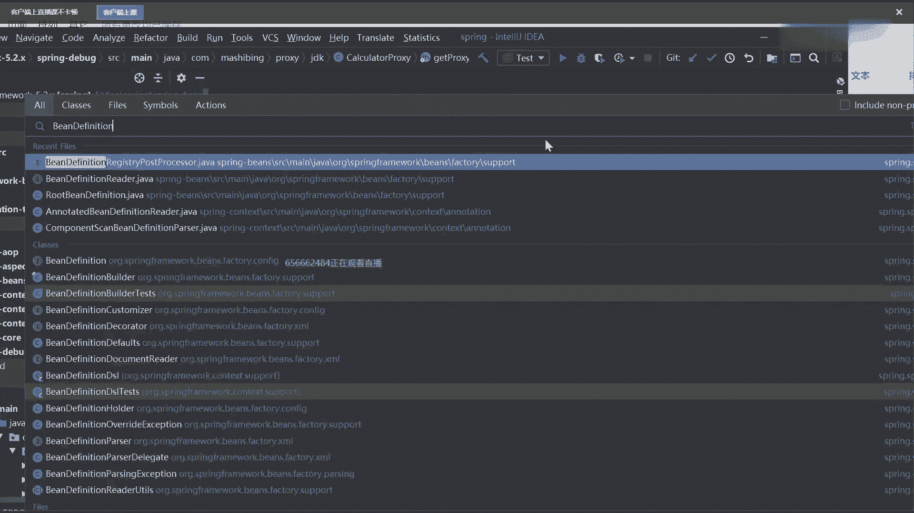
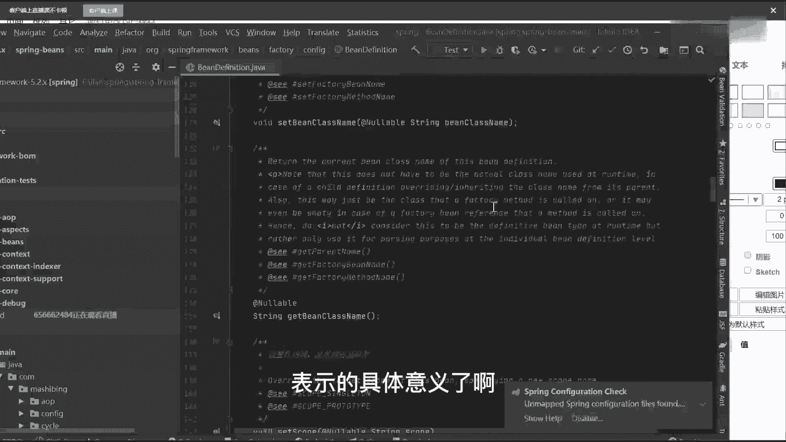
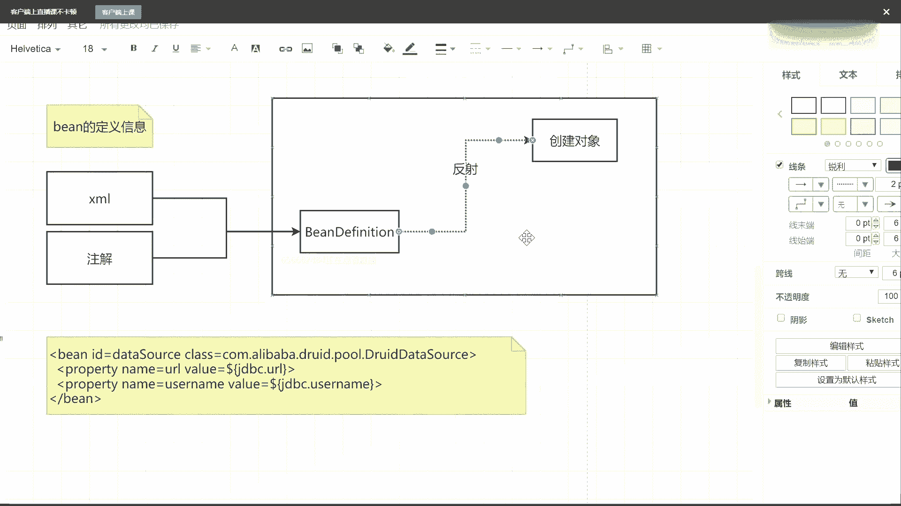

# 马士兵教育MCA架构师课程 - P61：Spring IOC容器的核心实现原理 - 马士兵学堂 - BV1RY4y1Q7DL

谁来告诉我spring到底是什么，谁来告诉我spring到底是什么，当然有很多同学会给出一些描述啊，比如说老师，首先第一点他是个框架啊，还有人说春天的好吧，第二点它是个什么容器吧。

我们一般都说spring容器对不对，第三个我希望大家能明确一点，什么叫生态，这是我给的一个知识，什么意思，因为你们现在在基本的呃工作中，要不然用spring，要不然用spring boot。

要不然用spring cloud，基本上都是spring这个全家桶里面的一体机东西，而这些东西里面spring就是最基本和最根本的基石，你把这块了解清楚了才可以，而在现在主流面试的时候。

他上来之后不会问你一些定向的问题，而问你一些什么，谈一下你对spring的理解，或者他一下你对病的理解，他一下你对病生命周期的理解，基本上是以这样的一个方式来问问题的，那遇到这样的一些理解性的问题。

或者说非常宽泛的问题的时候，我们到底应该如何去进行回答呢，谁能告诉我，如果一问到spring，你现在还是只说说一个ioc，说一个a op，我告诉大家，你别说了，这俩东西单打的话肯定是不够的。

肯定是不够的，你需要把里面的一些细节点都达清楚，把里面的每一个环节能知道能出多少，出多少，把这东西一定要完整进行一个转换，那怎么来聊呢，还是一样，spring我们用起来非常简单，为什么简单。

谁能告诉我最核心的点在于，spring帮我们把我们呃应用程序里面所需要的这些，并对象是帮我们管理起来了，而在进行管理的时候，首先它是个什么，是个容器吧，最后这先画一个大格子，它是一个容器。

容器的话是什么意思，里面应该是放东西的，比如说在程序里面放的是一个一个的并对象，对吧，一堆并对象你想放多少个，放多少个，当你了解到这个环节的时候，还不够还不够，还需要具备很多的知识，具备啥，你想嘛。

spring帮我们来管理人管管理并对象，那spring是怎么知道这些并对象是哪些呢，或者说我应该创建哪些基本的并对象呢，他怎么理解这件事情的啊，比如说反射，反射是创建对象的一种方式，战死的时候根据类型。

根据注解，其实这个时候我希望同学们在看源码的时候，先以应用入手，你把应用的点理解透了之后再说什么，这是什么原理，然后下一步再说源码，我们在用的时候怎么用啊，很简单啊，我如果想声明一个对象的话。

我一般会在类上面加一些注解，比如说and control对吧，at service对吧，at component，是不是这样的一些东西，除了这些东西之外，这是我们用注解的方式吧，除了用注解之外。

当然我还可以选择另外一种叫配置文件，那么对吧，当然现在在主流的开发环境里面啊，xml可能几乎已经不用了，我用的已经很少啊，但是我想问一下，插画也好，还是我们这些注解也好，它到底说的是什么东西。

或者说我们为什么要用这么，或者为什么要用注解，它到底代表什么意思，能给我解释一下，这config不就是一些configon吗，配置类吗，好了空白格说了一个非常重要的描述，叫病的描述信息。

也就是说不管我用插板文件的方式，还是我用注解的方式，在这两个里面定义的全部都是什，么叫ban的定义信息，写一下，病的定义信息，所以我希望你能够先把这个东西掌握了，为什么，因为在整个spring源码里面。

还有一个非常重要且核心的一个接口，叫做什么呢，叫做bean definition，是不是玩意儿必须要有这样的东西，它是一个接口好吧，当然接口里面会有一些具体的实现子类子类，我们先不管。

我们先把接口给写出来，那你就要思考过你，你就要想一件事，想什么事情，我用xm 2也好，用注解也好，当我定义好这些病的定义信息之后，我需要干嘛，是不是需要把它交给我们的容器。

容器在识别到这些病单分析肾之后，我才能够根据pdp是里面的一些相关信息，来把我需要的对象给创建出来，是不是这样一个逻辑啊，所以在这块它有一个最基本的环节，从这我写过来，我们的xm文件也好。

还是我们的being definition也好看，最终需要的是什么啊，还是我们注解也好，最终都会转成一个ban definition，而我有了ban definition之后可以干什么事，直接来点。

可以进行实例化操作，比如说或者换句话吗，叫创建，对象这没问题吧，从charm到bedition到创建对象，有人说老师这个插m我怎么解析啊，或者说我的注解我怎么解析啊，有人会吗，天猫怎么解析，谁能告诉我。

如果让你来做这件事情的话，你会怎么做，思考这件事情怎么做，啊咋做，读文献吧，首先我通过io流的方式对吧，把我们这个文件给读取回来，当我读取回来之后，说白了它就是一堆的字符串，字符串存在。

它本身是没意义的，我需要把这个字符串进行一些解析，而解析的时候，xml本身自己是自带格式的吧，是不是合适，所以我可以用一些现成的工具，比如说叫dm和j对吧，比如说s a x这样的方式。

来把我们这些读取到的字符串来转成一系列的，什么叫document对象，当有document对象之后，下一步它就变成了一堆具备父子节点关系的，node节点什么，然后我根据我能够节点循环遍历。

是不能取出里面具体的数据值，当我取到这些具体的数据值之后，是不是可以把我们这些数据值再给到我们的，并在分析成对象中，是这意思，那一样的注解是不是也一样的，注解怎么做。

注解我先获取到某个类上面的一些注解信息，当我有这个信息之后，我获取到对应的class，有了具体的class之后，我是不是就可以进行相关对象的一个创建了，而我这些class信息也好，name属性也好。

value属性也好，我是不是可以直接放到我们的病，该分析是一生里面去，也就是说不管你是xm还是我注解，我只是解析的方式不同而已，但最终殊途同归，都会合并到并单飞你肾中来，这句话能理解。

同学给老师扣一能听懂吗。

这没问题吧，如果你不信的话，我们可以看一些具体的代码，比如说我先找到基本的一个东西叫bean definition。

之前一直也理解不了老师这个病到底是个啥，好吧，你看到了它是一个interface，interface的话里面一定有对应的子类实现，往下找找它对应的属性值，比如说有这种属性叫pair的name。

可以设置父类的名称是吧，叫bin class，设置我们的class呃，那个完全限定名，比如说scope是单例的还是圆形的对吧，比如说late it是不是人家来的，比如depends on。

是不是我需要依赖其他的并对象，我是不是可以把这些属性值全部都设置进去了，当然这些东西是在子类里面进行相关实现了，但是我已经能看到当前接口里面，表示的具体意义了。

好吧，因为你们都写过这些东西啊，有点跟不上了，这就跟不上了，来我写一个，这有啥跟不上的，来写一下，最基本的，就差帽b那个注解，你们应该都会啊，cam可能很多人没写了，我写一个time out好吧。

id等于比如说data source，这玩意应该用的最多的，然后class等于写上com点阿里巴巴第二，有一点错，beta source不就写这样一套东西吗，对吧，当你写完这套东西之后啊，看不到。

能看到吗，刷新一下好吧，刷新一下啊，这真是命运多舛，想上个课就这么难吗，来喜欢一个并对象，然后里面我可以配置一些基本的属性信息，比如property，然后name等于u22 。

value等于dollar，大括号，jdbc打u22 ，然后下面再来一个，grad name等于user name，value等于多少，大括号jd dc。user name，有这样的东西吗。

这不就是我们定义好的一个配置文件吗，对吧，当我定好这些东西之后，我可以经过一系列的解析，把这些具体的属性值全部都放到b，带飞机身里面去，当我放到being，但是历史里面去之后，就意味着。

我已经知道我要创建哪些最基本的对象了，而我有了这些最基本对象之后，是不是可以进行对象创建了，那我问一下对象创建到底应该怎么创建，是用new的方式还是用反射的方式，另外还是反射反射吧。

几乎所有的框架用的都是反射，当然很多同学可能会看到一些帖子的描述，什么呢，说老师反射效率不是很低吗，有这样空过吗，反而效率低啊，为什么还要用反射呢啊，注意了，反射它是足够灵活的啊，足够灵活的好吧。

但是效率低，你注意了，我之前说过一个数量级，我也是从一个铁栏看的，这个没有自己没实际测过，当你创建10万个以上对象的时候，反射才可能会出现性能问题，当你创建少量对象的时候，是不会出现任何性能问题的。

明白这意思了吗，我有什么性能问题，所以大家不需要去考虑这件事情，反射足够灵活，当我获取到一个类的完全限定名的时候，就报名加类名好，回到报名家里面的时候，我就可以根据这个字符串来创建出来。

我们具体的一个对象就很简单啊，所以这是它整体的一个流程，当然如果我直接以这样的方式去创建，我们具体的一个对象的话，那spring就显得太简单了，而且如果这样的话，spring它不会有一个非常完整。

或者说并不会有这么完整的一个生态的，那我就想问一件事，如果这个过程不是这么简单，就意味着这条路线是不存在的，中间一定包含了其他对应的一些环节，什么环节，我举个例子，同学们，你觉得spring能活到现在。

或者他现在有一整个完整的心态，完整的生态。

它最根本和最核心的点是。