# 系列 6：P62：BeanFactoryPostProcessor接口详解 - 马士兵学堂 - BV1RY4y1Q7DL

也是因为啥，啊是因为什么，谁能告诉我好了，同学们基本都说到了，老师基本一个点就叫扩展性，其实这一点是你们在看源码的时候，最应该学习的知识，很多同学在写代码的时候，其实只是为了完成我们具体的一个业务。

逻辑功能，你压根不会考虑什么扩展性之类的点，可能就不会考虑这些东西不好的东西，但是你看原版的时候，发现原版里面很多地方都是可观的，留了一堆的口子，让我们能够随意对他进行扩展和优化，这么简单好吧。

而且你可以按照自己的需求来进行，相关的定义和具体的处理工作怎么做，一会儿我再来进行相关的一个描述，我们先放一放，你知道扩展性这点就够了，当扩展进来进入之后，这个时候你就要去思考一件事了。

现在我有了插m2 ，有了注解，有了病态finition，我可以进行对象创建了，比如老师不对，你这里面少了一个非常重要的东西，什么叫bean factor，基本上你们在学习spring的时候。

别人都告诉你，老师我们刚开始跟对象叫bean factory，这玩意怎么理解啊，这玩意怎么理解，有人把它翻译成叫并工程，还有其他理解方式吗，对象工程还有吗，其实我觉得如果你把它直接翻译成兵工厂。

这样的方式或这样的一些说法。

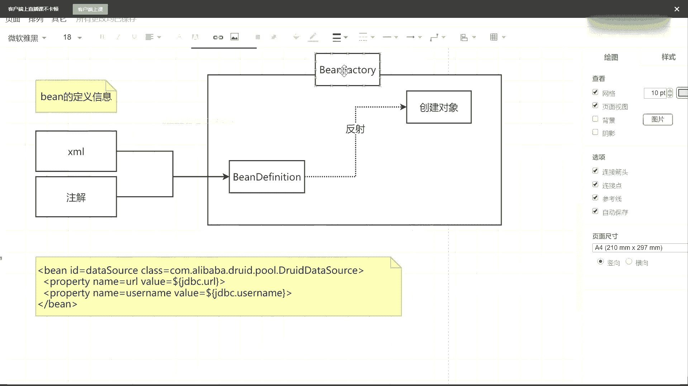

其实不太准确，为什么，为什么呢，你可以详细来看一下这个bean definition。

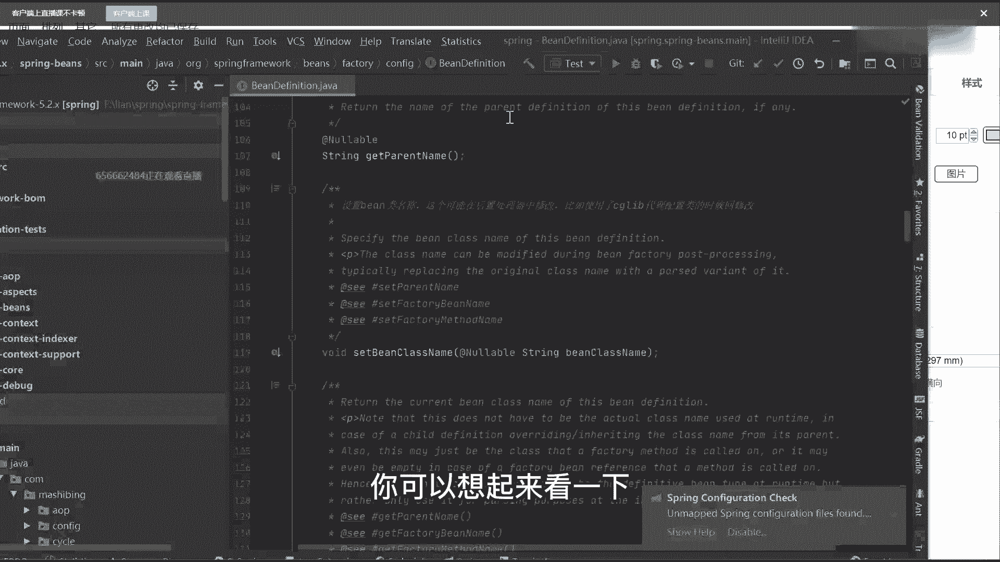

在源码里面啊，bean factory它到底是个啥玩意儿。

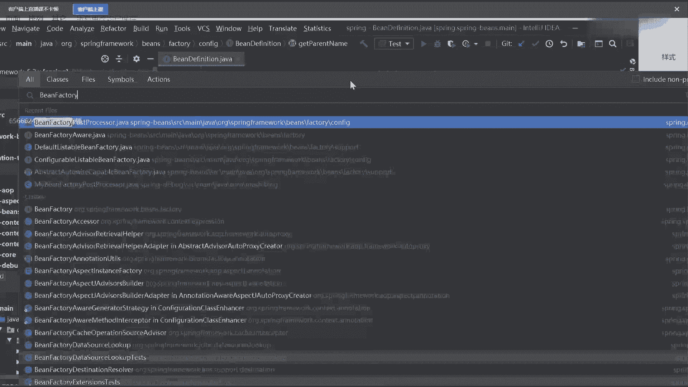

你看它是个什么，它是一个接口吧，首先这个接interface好吧，是个接口，这个接口用来干什么使的呢，里面有一堆的描述信息，我们可以来看第一句话叫the root interface。

for assessing of spring being container，什么意思，什么意思说它是一个跟接口对吧，干嘛呢，用来访问一个spring的电容器，刚刚我就说过了。

我们的spring本身它就是一个容器吧，容器里面可以放具体的一些并对象，而我们的并factory它更多是一个入口。

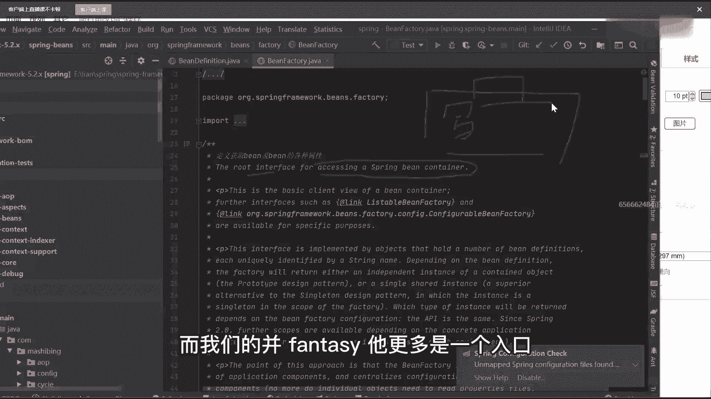

为什么把它称之为入口呢，你想一件事，你在用spring框架的时候，如果你想自己去获取某一个病对象，你会怎么来获取，你会怎么做，告诉我你怎么写代码，怎么写代码，比如说老师我是这么写的。

叫什么context，点get be对吧，里面可以写上我们具体的一些类别的，personal class，这时候我就能获取到我们这个person对象了，是不是这么干的。

那老师contest跟我们的bean factory好像没啥关系吧，如果你去面试面过的话，就应该知道面试官有时候可能会问你一个问题。

说来你告诉我application context和bean factory，他们两个到底是什么样的一个关系，这又涉及到两个接口，第一个叫bean factory，对吧。

还有一个叫application contest，这里面有关系吗，他们俩什么关系啊，负责注意了，application context，它继承了我们的bean factory。

提供了一系列更加完善的功能，听明白了吗，它提供一系列更加完善的功能啊，而并不是说他们两个完全就没有。

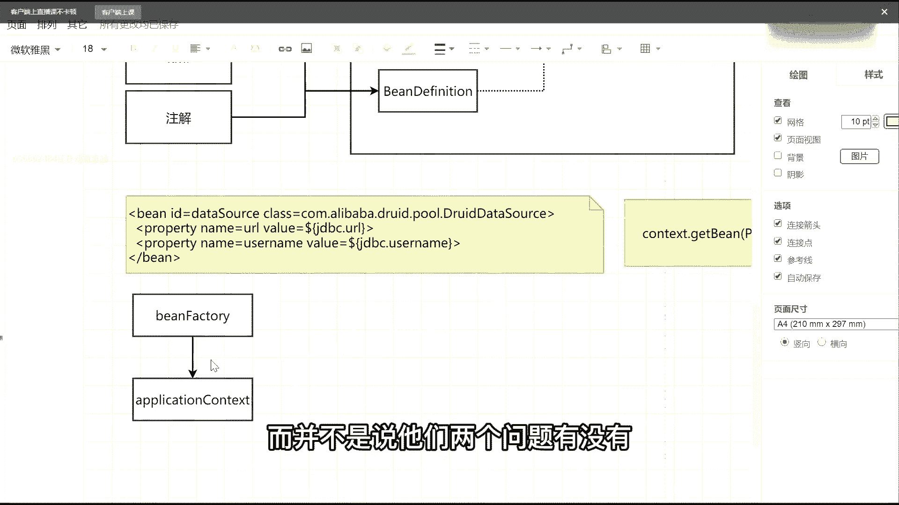

如果你可以打开源码的话，你可以看一下，这东西叫application。

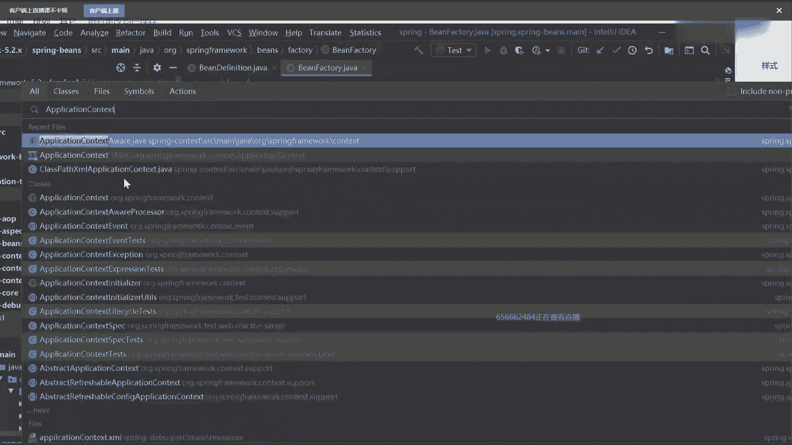

找到这个接口，然后呢选中右击soul gram，你可以看到它一系列的继承关系，好吧，往那看他这个接口吧，他是不是嗯不对，他是不是继承了bean factory这个接口，明白意思了吗，好吧。

那个老师他这样实现什么意义啊，它提供了in factor的啊，它比较单一，里面只提供了一堆一系列什么呢，叫get bean的方法，但get in方法可能不太够使不太够用。

所以application contest对他做了某些最基本的扩展功能，提供了更加完善的一些方法，明白意思吗啊，所以把这件事我希望他们能理解清楚了。

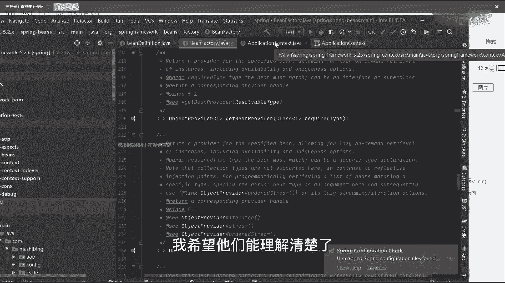

比如说你虽然用的是我们的ating confess，但说白了继承的还是be feat面的方法，所以这时候就问题来了，老师这个病发水到底怎么理解，到底怎么理解，你可以把它理解为是一个入口。

也可以直接把它就等同于我们对应的容器对象，能明白这句话吗，因为我们这些对象，不管你的bean definition也好，还是你实例化好之后存在对象也好，它都放在某一个容器里面。

而容器也是需要并翻出来进行访问的，这时候你可以把bean fighter的某一个实现子类，就当作我们整体的容器，比如说面试中问的比较多的是啥，有一个容器面试中几乎可能会提到，如果你回答比较多的话。

几乎提到有人知道这玩意儿吗，叫default，easible，being factory，有听这玩意儿吗，听过的扣一没听过扣二没见过，注意了，它就是我们所创建的整个spring容器。

也就是说我们所有的b类项，其实都在default libbean factory里面进行存放的，一会儿我可以带你们看一下，整体的流程和整体页码，好，我们先扔一边，所以这个东西我希望你能够先认识到了。

当把这东西扔到之后，你说它是我们的容器，它是bean factory的一个子类，我可以把bean factory就等同于我们对应的容器，当我需要访问的时候。

可以直接通过bean factory来访问容器里面的，一些对象值或者一些属性值了，那我问一下，我能不能通过bean factory来获取bean definition，能还是不能，看这个问题啊。

我能不能通过bean factory来获取我们的bean definition，能还是不能，能不能有人说能有人说不能，能不能取决于什么东西，你看一下它里面有没有具体的方法。

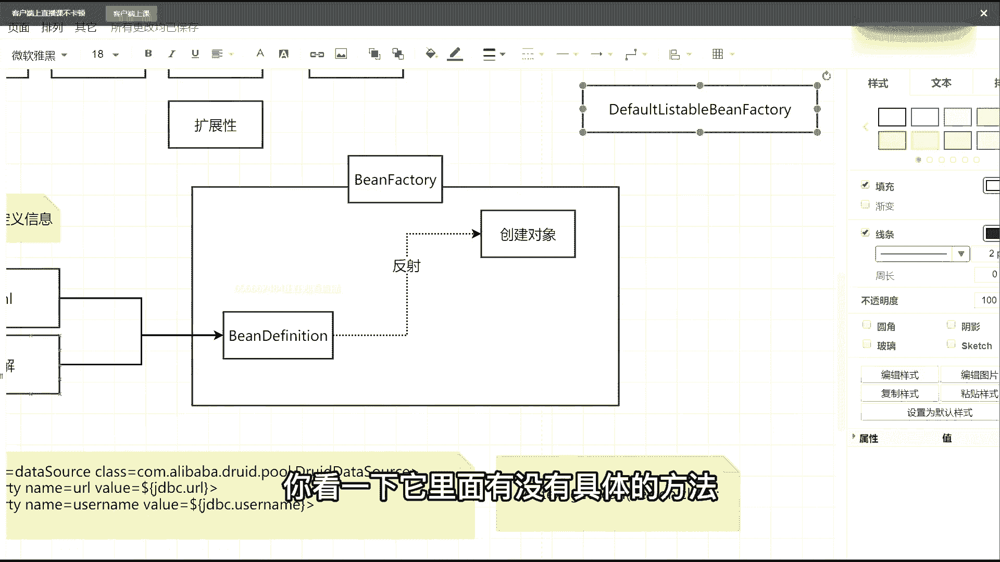

不就完了吗，东西我们没必要吵的，点开之后来看一下，有一个东西叫get并单分析式吗，有没有有对应调的方法吗，好像没有，对不对，没有你也没必要慌，为什么它是一个顶层接口，既然是一个顶级接口的话。

就意味着它一定包含了一堆，或者一线的实现子类，所以如果复制上面没有的话，我们可以去子类里面进行查找，好吧，来找个东西，懂这玩意儿有东西叫confiable，bba ba ban factory。

点它之后，我们可以来找个东西叫get，要去了，有get bean，class order，有get bean，express reserver，get depends是什么东西。

这里面是不是比我们刚刚那里面，包含更多的一些属性方法，你看啊，我刚刚是打开一个子类，当我打开子类之后，它里面是不是提供了更多的一些方法。

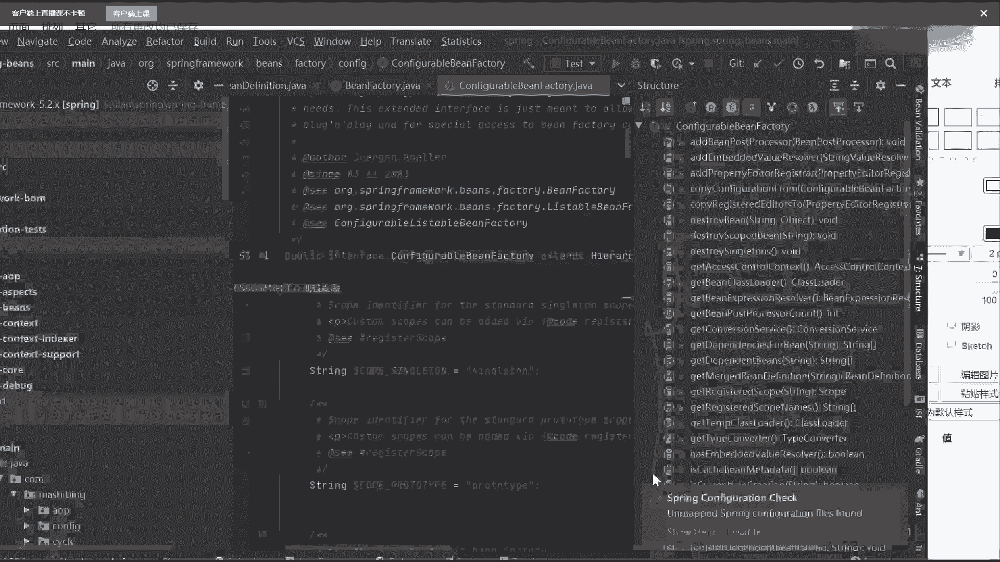

除此之外你还能看什么，还有团长，你通过它知道它在子类里面，一定包含了一堆的扩展实现，虽然我的父类接口里面没有，但是我子类接口里面有，比如说我带你们看一个对象，大家看一下啊。

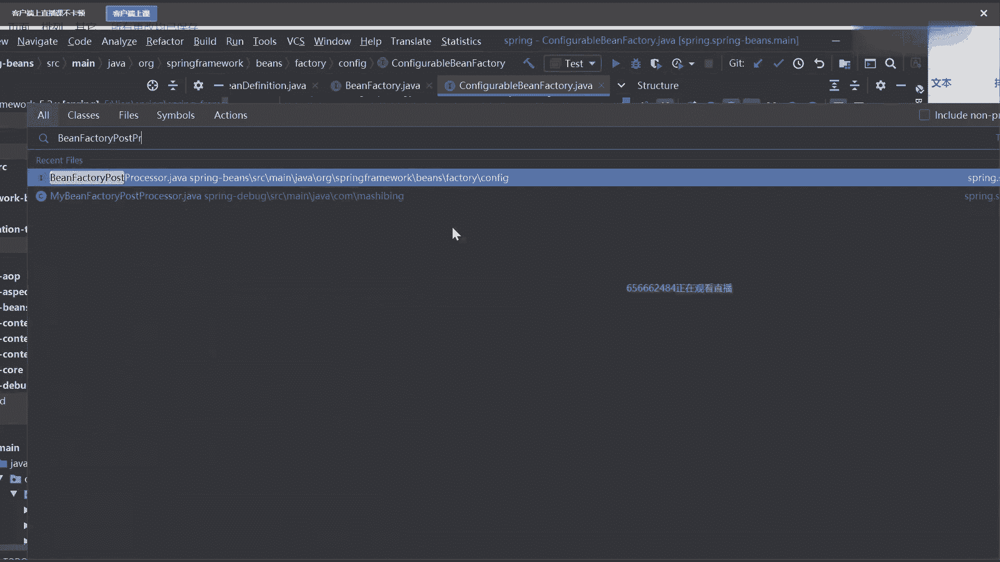

他来我现在点开的是当前这个词类，他的继承关系啊，它实现了离子able bean factory，然后离子保实现了configurable，bean factory，confiable并fetter。

上面有哪去了，叫继承的bean factory，再上翻有ban factory，就是它有一系列的继承关系，我们不管这集承关系了，打开它在里面找一个方法叫get，看到，你看到啥。

同学告诉我看到了什么叫get bean definition，能看到能看到吗，就说spring源码它为什么这么难，或者你们看起来感觉这么乱，最关键和最核心的点在于，它存在了一堆的接口或者一堆的抽象类。

这图章类的继承关系会变得非常复杂，你在找具体的实现的时候，你可能不太容易找，所以你需要一层一层去捋这玩意儿，像我刚刚说的bean factory没有get bedivision，但是我往延展子类往下找。

找到了吗，是不是有东西叫get be definitions，就是说我可以通过我们的bean factory对象来获取到，我们具体的bean definition对象，做完之后就可以直接获取到了。

明白意思吗，所以这是源码它比较难的地方，你需要一层一层去捋，如果你不去理这玩意儿，你压根理解不了里面的核心点，好，这东西我们先扔一边。

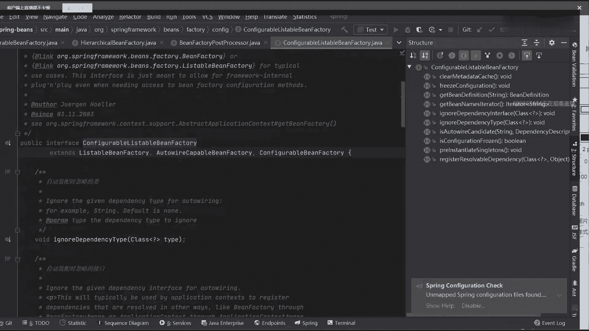

说完之后来回过头来，现在说了，我有了being an factory之后，我可以根据我们的bean factory来获取我们的bean dation，刚刚呢我也写好了一个配置文件，比如这个地方。

当我写好这个配置文件之后，问题就又来了，同学们什么问题，大家看一下里面的东西啊，我这定义了一个data source，有人这么定义过data source吗，这么写过的同学给老师扣个一。

有没有这么写过没有，你们现在不这么干了对吧，都用注解了，都用注解，对不对，那我问一下好吧，我们这样配置文件的方式，这里面我没写引号，我没写引号，但这里面存在一些占位符吧。

比如说叫dollar gdb c12 ，dollar j t b c，you name，这些占位符一般我们会写一个配置文件，叫db。properties对吧，然后从这个配置文件里面。

把我们需要值给拿过来，替换到我们这个value值里面去，一般情况下我们都是这么干的，是不是这意思啊，那我问题来了，我在这个步骤这个步骤来进行解析装，改成一个并单菲尼斯对象的时候。

我是否会把这个值也进行一个替换，是还会还是不会，会吗，不会对结论确实是不会不是应该不会就是不会，如果不会的话，同学们，你注意了，这个步骤，他只是把配置文件或者处理这样的方式。

装载成并单元dition对象了，它不会对里面的值进行处理，那下一个步骤，我就应该通过反射的方式来进行对象创建了，现在值还没有呢，那我怎么办，这还没有怎么办，我是不是一定在中间某个环节里面。

要把这个值给替换掉，因为我如果不替换的话，我没法进行对象属性赋值了，我肯定会进行替换的，那么在哪替换，有人说了，老师在ban viper里面进行听了，有人知道什么叫ban viper吗。

好像同学提到这东西了，并viper，它是个啥，什么b方法，它是病对象的一个包装类，是在我们创建完一个并对象之后，会把它装载或者包装成一个闭环派对象，你可以直接把它等同一个并对象。

那个时候对象已经创建好了，你还留他东西干嘛，不是在这注意了，会在哪进行操作，会在我们整个对象创建之前，记住叫之前把这些属性值全部都替换完成，如果我在对象创建之前，不把属性值替换完成的话。

它后面没办法进行属性赋值了，袁老师在popu类的并对象里面进行填充，不会的，popular对象里面只popular的方法里面，他只会去设置属性值，而不会把值进行替换。

所以在中间一定某一个还原节会对它进行扩充，哪扩充啊，所以这里面会涉及到几个东西，我要给大家说明一下，比如说第一个最简单的，有些东西你们应该见过叫bean post processor，有人见过吗。

或者我把并去掉，叫post processor，前缀不要了，叫post processor，有人见过吗，这个post processor是啥玩意儿，什么东西，前置处理器。

我第一次有人把它称之为前置处理器啊，有人把它称之为叫后置后置处理器好吧，也有人把它称之为叫增强器，我个人认为增强器说的是比较合适的啊，后置处理器这样翻译过来可能不那么合适，可能不那么合适。

明白意思吗好吧，那增加一什么意思啊，它就是用来完成某些具体的扩展功能实现的，比如说问的最多的两个东西，第一个叫b fey post processor，这是第一个好吧。

还有第二个叫b post processor，这应该是我们在日常工作中，或者说在我们那个面试中，问的最多的两个接口了，他们都是用来进行增强功能实现的，那么他们两个到底有什么样的区别呢，有什么区别吗。

区别是啥，很明显了吧，你通过类名就能分辨出来啥区别，针对的操作对象不同吗，一个针对的是ban对象，一个针对ban factory对象，所以你可以思考一件事儿，我如果去看这个接口的话。

我如果想对我们的bean factory进行扩展的话，我是不是可以通过我们的bean factory post processor进行扩展。

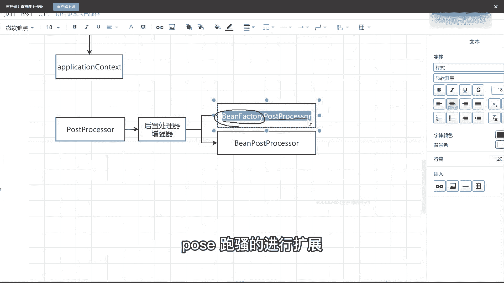

来，我不光吹，我给你打开这个接口，你们来看一下叫ban favorite post processor。

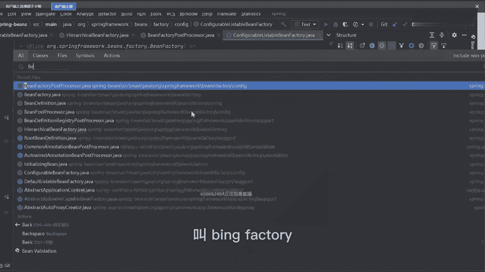

有这样的对象，就这样这样这样一个接口，好吧，他说了，他是一个hook，允许用户去自定义，我们上下文对象的bean definition，看后面那句话啊，翻译好吧。

允许for customer modification，自定义的修改吧好吧，of an application contest being definition。

某一个应用程序的并definitions对象吧，我是不是可以通过它来完成某些，带分析成对象的替换工作，而你打开这个接口之后，你发现这个接口很好玩。

它里面有且仅有一个方法叫post process bean factory，其实就把名字翻了个个儿，叫bean factory的一个后置处理，你看到了他传过来的对象是什么。

是一个bean factory对象，所以在里面我可以按照这样的方式来获取到，并带分析成对象，然后来对并单分析逆生对象进行修改操作，能这么干吗，可以啊，那怎么来看呀，很简单，找到这个接口。

我们依然找一个实现子类。

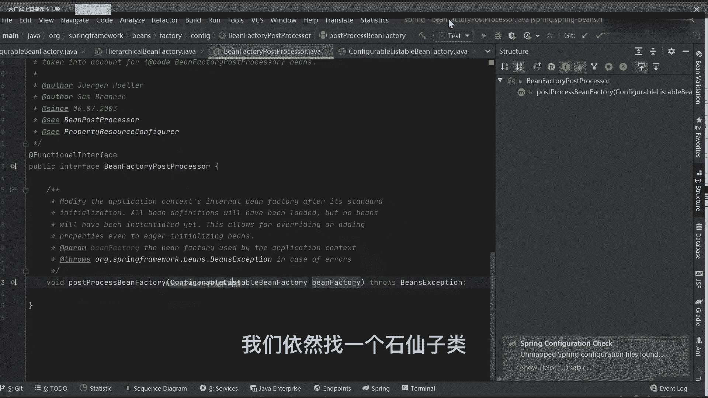

我这儿不让你们去找了，好，我来直接给你们找到。

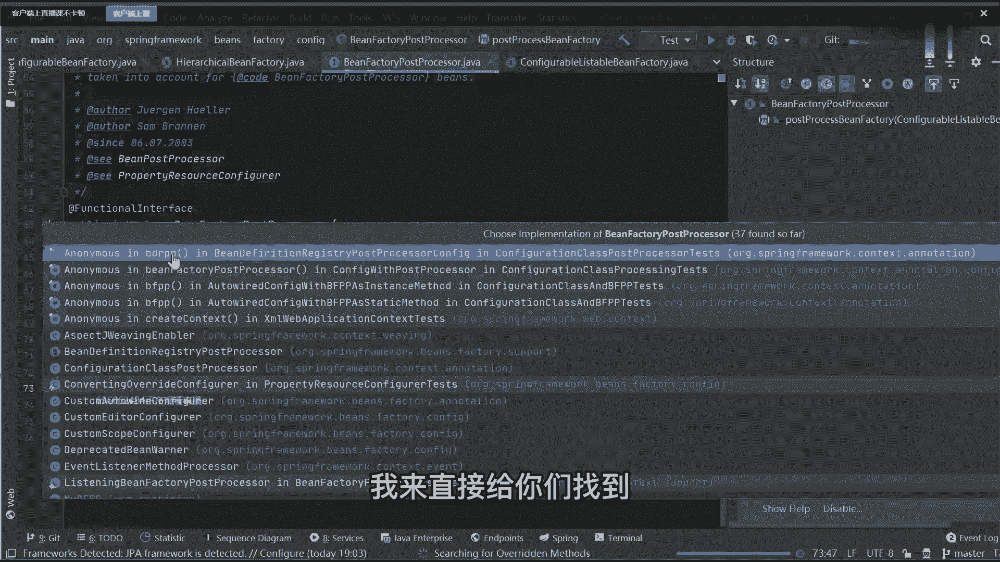

你往下翻，有一个东西叫，please holder configure support，有这样的一个实现子类，在当前实现子类的上还是看注释好吧，还是看注释，他说了没事，我们也找不到，来看看啊。

什么东西呢，看注释啊，第一个叫obstruct base class，说是一个抽象的基础类，对于什么呢，叫property resource，属性资源configures配置，也就是说它呢是一个基础类。

你干嘛呢，用来进行属性资源配置的一个基础类，那它来配置啥玩意儿啊，说了叫result处理处理，police holder，占位符，哪占位符啊，叫bean definition。

property values里面的占位符操作，明白意思吗，那翻译过来啥意思啊。

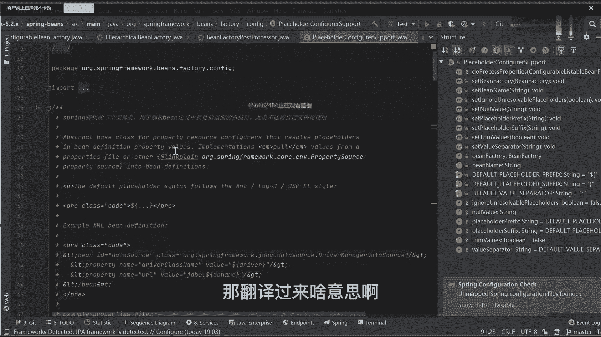

你想一下我刚刚定义的这个data source，它是不是一个转成一个bd对象了，bd对象里面是不是有个东西叫property，property里面是不是有一个value。

value里面是不是有一个占位符，你看我这思吗，那是不是意味着，我可以在当前的这个bd对象里面，不是这个bean post processor对象里面，来把这个值完成整体的替换工作，是不是意思啊。

来我刚刚讲的东西能听懂的同学给老师扣个一，能听明白吗，可以换张图，什么图，这是一个bd对象，但是这个bd对象都保留，就保留原始值，明白意思吧，然后在上面往上走的时候，它会变成一个叫最终的bd对象。

bd啊，指的就是我们的bedefinition，这没法写了，对八太小好吧，转成bd对象，再转成bd对象，中间这个过程里面，中间过程里面会有一堆的东西，能对它进行处理，什么处理呢。

就是我们刚刚说的叫bean factory，post，我在等，明白意思吗，比如说在这个环节，他可以对我们的bean definition，对它进行相关的一个处理。

当然这样的bean factory post post，我可以有一个，我也可以有n多个，这个根据你的实际项目需求来做就可以了，这可以完成一个替换。

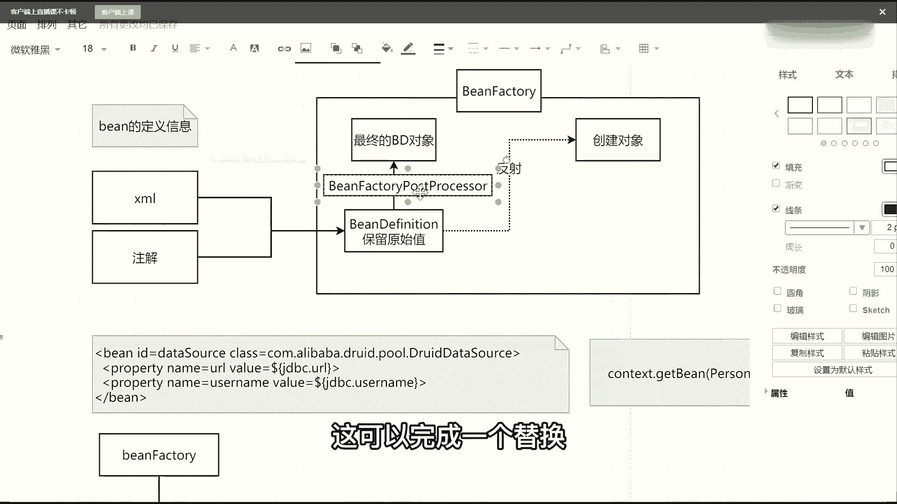

当然很多老师我不信啊，你信不信，来我们来验证一下，验证一下，你知道你信不信了，好吧，来举例子说明吧，我给你们演示，你们可能觉得都听不懂啊，来我找一个代码。

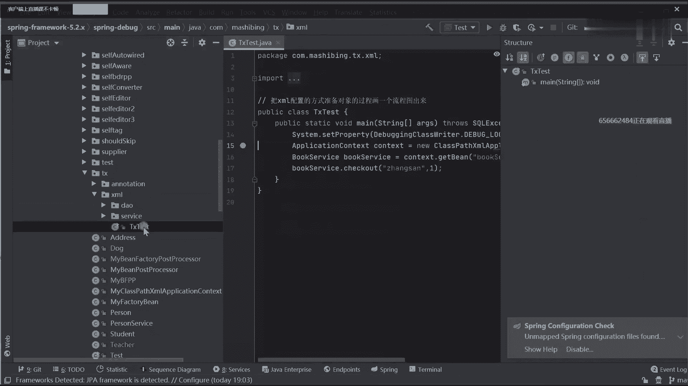

我打开一个配置文件来往上看，在当前配置文件里面，我这是不是占位符，是不是一符，同学们，没问题吧，全部都是占位符好吧，全部都占位符，我没有做任何值得替换工作，要在中间某个环节的时候。

我需要把这些值给进行替换，怎么替换来，我就提debug第八部的流程啊，同学们，你怎么还有这么老的项目呢，这是我在讲源码的时候重新编译的项目，5。2。9版本的，不是老项目好吧。

这讲原版是给大家留做的一些案例，不是老项目，那我们来看我刚提拔了一下，提拔之后我说了，刚开始spring一定先有一个容器。

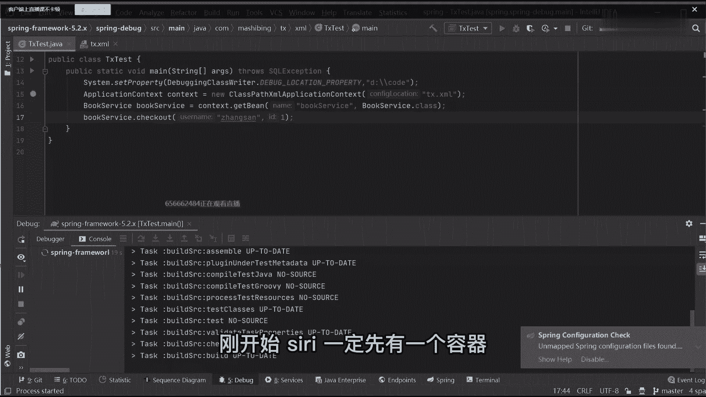

我刚给大家指出来了，这个容器是啥，是default visible bean factory，所以一会我带你看一下这个default lil bean factory。

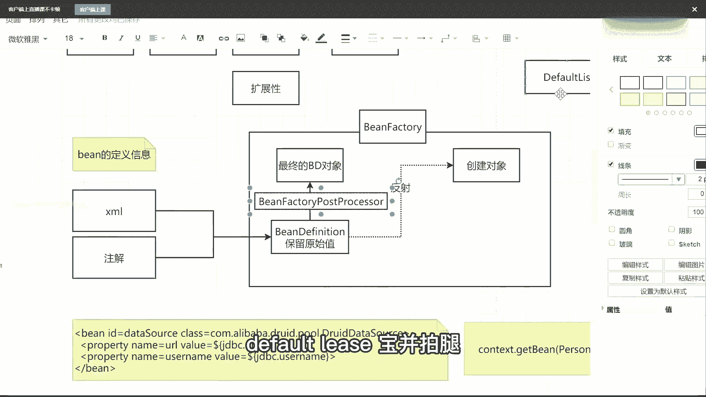

你们可以看看，好吧嗯，启动好了没，因为我是aa的，是源码这个环境啊，所以他可能每次启动的时候，会相对于比较慢一点，他每次都要重新进行相关的一个编译，而你们如果直接引用战报的话，是不会有这个问题的。

还是比较快的好吧，呃等一下，怎么这么难，好了进来吧，进来之后来往下走，直接new一个对象吧，好吧，往下走，进来之后，不管它这是一个bug，点进去有this。

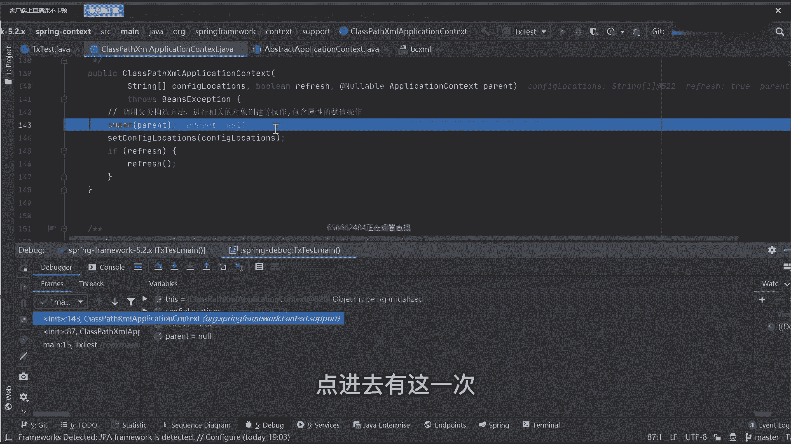

然后往这边走走走，点到reflesh，到reflash之后，我刚说过了，刚开始上课之前，我就强调了reflesh它很重要，里面包含了13个方法，如果你想把这个spring框架看连板。

那么这13方你是必须要懂的，如果这13话你不懂，很明显spring你就等于没学会好吧，前面几个步骤我们不看了，我只带你看关键步骤好吧，来到这来翻译一下这个名字是什么意思啊，现在我发一下，这什么意思啊。

不是什么意思啊，翻译一下获得吧，获得新鲜的bean factory对象，也就是说在这个步骤里面，我会创建一个bean factory，这个对象来装载我们具体后续的并对象。

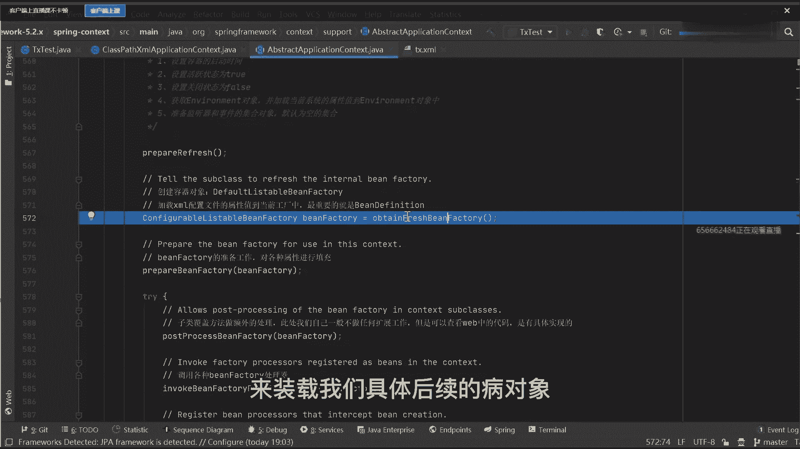

来点f7 进去进来之后有reflash进去进来之后。

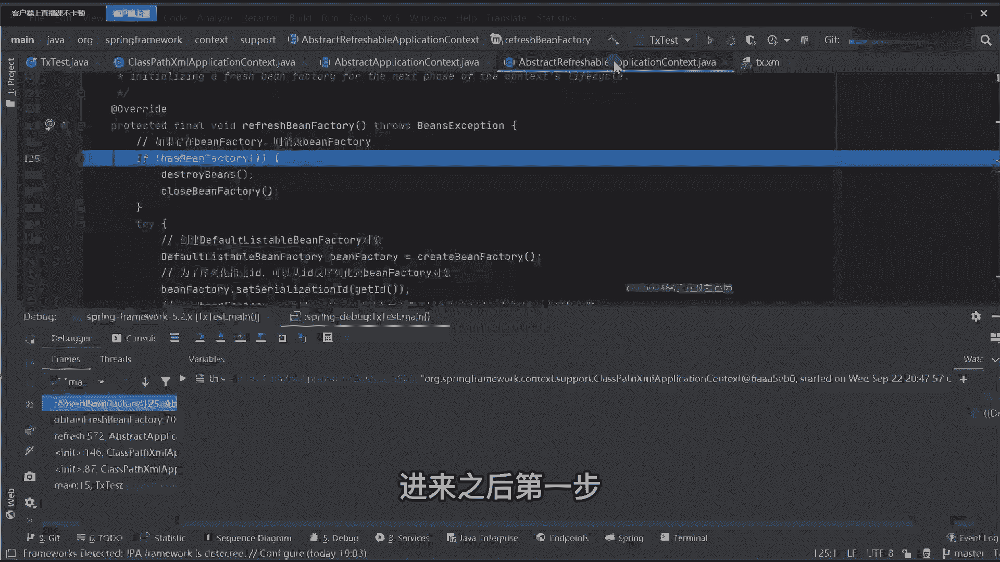

第一步先判断一下有没有工厂，没有的话跳过，跳过之后来看这个步骤，这啥意思，叫create bean factory吧，create bean factory是不是意思，我要创建了吗，你点开这个方法之后。

你发现了它里边干些什么事，来告诉我你有了一个什么对象，啥对象不是我刚写的吗，叫default libbean factory，也是我们后面跟我同学对象都叫default。

visible being factory，这玩意儿我刚说过了好吧，所以这你能看到看到之后，当我创建完对象之后。

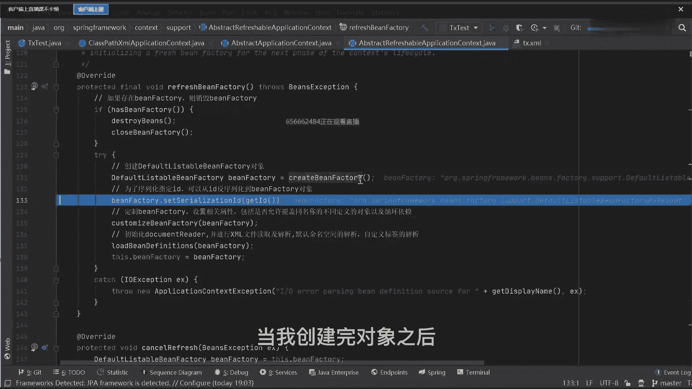

我希望你能注意一下这个bean factory，在这里面呢有两个属性值，我希望你能重点留意一下，第一个属性值叫什么呢，叫bean definition n。

第二个属性值叫bean definition ma，来告诉我，现在我刚刚把这个default list，more bean feder对象创建成功，他们的默认值都是什么，两个集合嘛，一个hashmap。

一个是release，默认都是什么零八，我现在什么值都没有。

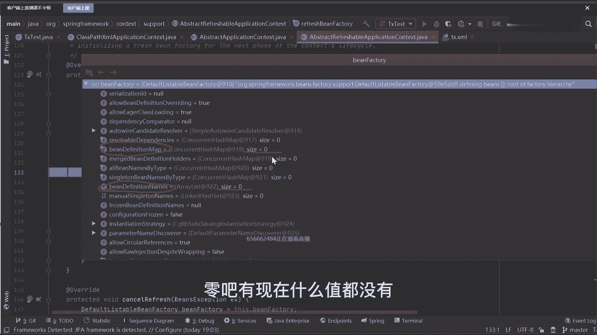

你把这东西记住了，什么值都没有，然后我往下走，走到这一步干嘛的，翻译一下load bean definitions，翻译过来叫什么，叫加载bean对象啊。

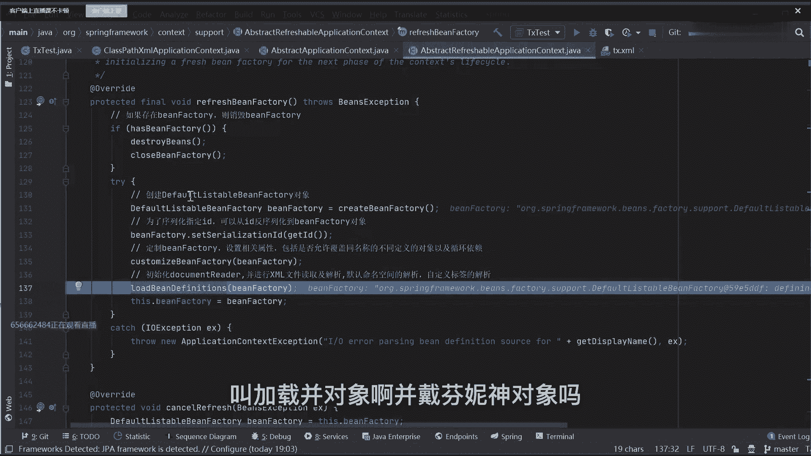

并单并对象吗，从这个环节到这儿加载并单分析成对象了。

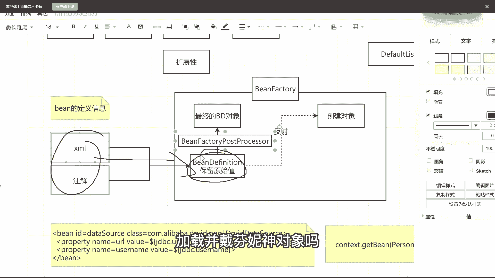

这里面有多少个并带分析意识对象，我也不知道，但我们可以往下走一步。

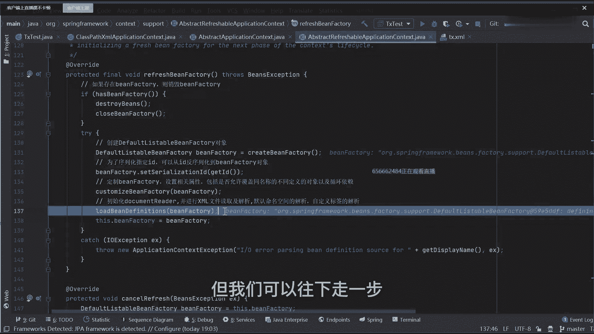

当我走完这个步骤之后，我们可以再打开我们的bean factory，再找到刚刚那两个属性值，你们现在有值了吗。

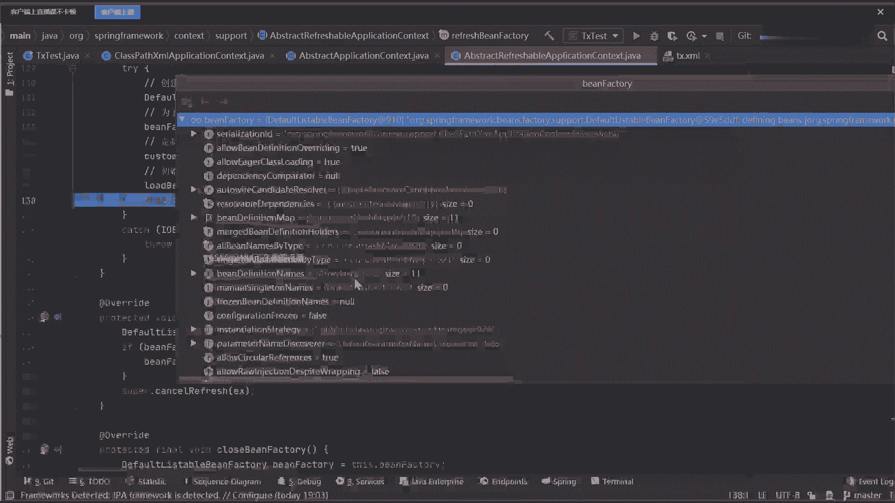

都是11个吧，是不是已经有值了对吧，那意味着我已经下载成功了，当我在成功之后，不重要，重要的是什么，我我需要看一下里面的data source。

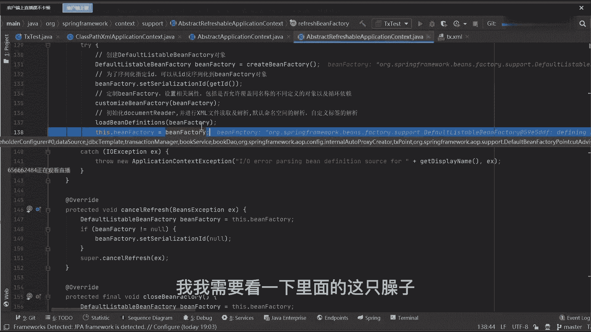

点开我们这个并单品是map，找到我们的data source，找到我们的value，找到我们的property values，找到我们的proper video list，找到我们的username来。

你告诉我现在的值是啥，这是什么。

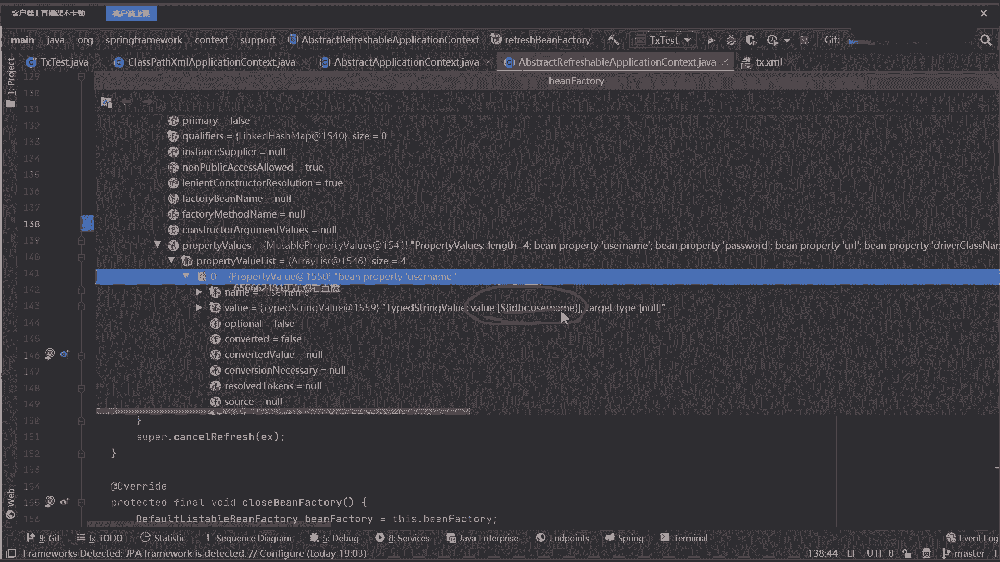

jdbc要用内容，为啥11个我定义了11个，为啥11个你就不要问这个问题，我定义了11个，所以是11个好吧，打这个sc我再从这看吧，那一定就能取消了，我问一下，现在这个值是不是。

就是我们从定制文件里面加载回来，这个值现在替换了吗，没替换啊，没做任何的替换工作，当我再往下走走走走走走，走到这个步骤，当我走到这个步骤之后，我为了验证我们这个中间过程里面有没有替换。

我来打开b factory，找到我们的value，找到我们的property values，找到我们的这个值，of your name，我问一下现在值替换了吗，有没有听吗，没有啊，没有做任何的替换工作。

没有做任何的替换工作，从来没替换过好吧，然后你翻译一下这个方法叫什么，释放什么意思，别的你可以都不理解，invoke中间分开，invoke什么意思，叫执行或者叫调用，听明白吗。

然后bean factory post processor什么意思，不就是我们刚刚说的那个扩展几点吗。

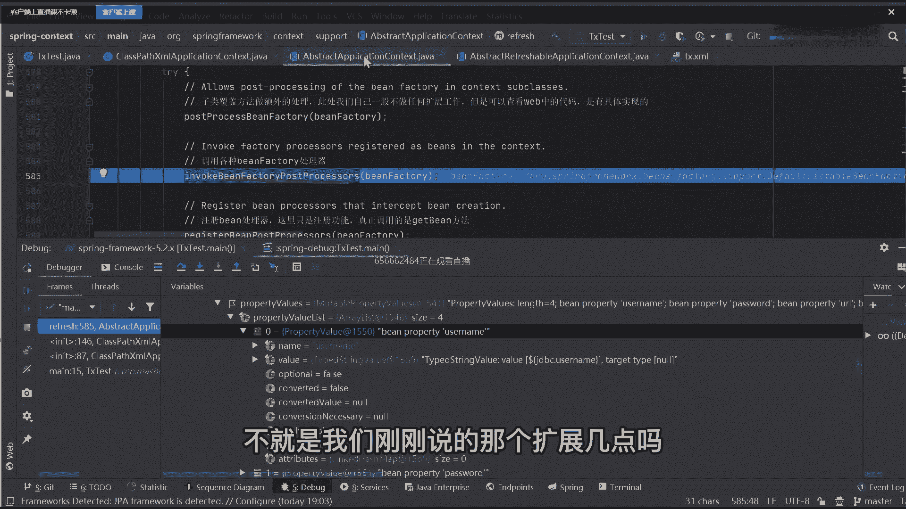

叫bean factory post processor，也就是说我现在要开始调用执行并factory post processor，那我们就要看一下。

在这个步骤我执行完成之后，我这个值有没有完成替换，来往下走一步好，走完之后来看一下，听完了没，听过吗，换了吧，已经换成root了，好吧，下面得判多了，你换成123456了，12000也替换了。

是不是全部都完成替换工作了。

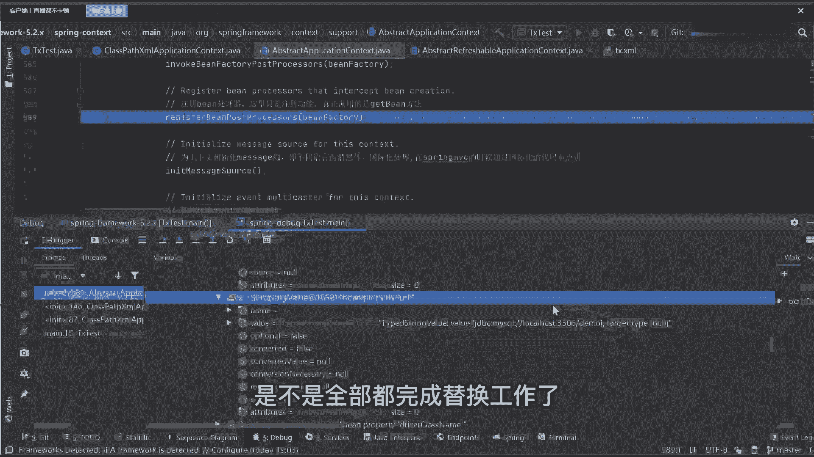

那是不是意味着在这个环节，这我可以完成他的替换工作，来这块听明白，同学老师扣一能听懂吗，所以这时候问题来了，如果你自己需要去替换某一个病，你可以替换吗，听好你自己，如果想做这件事能做吗，能不能做。

可以吧，怎么做，它是一个接口，你想要去实现这个接口完整，你具体的功能不就完了吗，是不是这意思啊，来试一个。

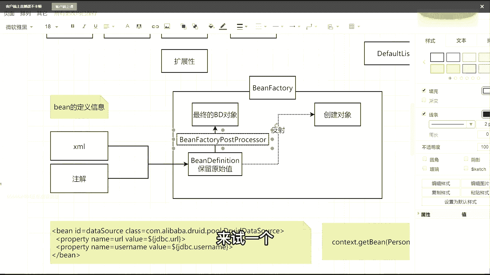

随便写一个，右击又一个class，my bf pp，诶有这个东西了，那重新建一个吧，无所谓，再右键my bf p p2 对吧，在里面实现一下in，post processor实践里面的几个接口。

实验方法之后可以干什么事，有一个bean factory的，我可以being factory，第二get beaition，但是我们有一个person的对象对吧，那这个时候你告诉我。

我能不能获取到现在这个person对象的，bean definition，能啊，那我获取对象之后可以干什么事了，person。set，我能不能往里面试试试，我是不是想怎么设计，怎么搜，我随便设置吧。

只要它里面有的这些方法，我都可以进行属性值的一个基本的设置的工作，这不就完成了吗，对不对，我们现在没需求，没关系，我就想在这儿打印一句话，比如说s o t，应该是09r大于这样东西也可以吧，我问一下。

当我定义好一个这玩意儿之后，我们现在容器能够识别到它吗，容器能不能识别到它，不能你需要把它告诉容器吧，怎么告诉容器啊，第一种方式，你上面加一个at component，声明好，它是一个并对象对吧。

除了这样方式之外，你可以在我们的配置文件里面，我诶不是这个我加一个，删掉，并对象，然后打印一个class等于mb f p p2 ，我是上个对象，可以的，帮我设置好对象之后好了，不用管了。

我可以直接来启动我们当前用程序，我们来看一下它到底会不会打印，又接撞，我这运行了不带debug了，你加注解也可以好吧，注解配置文件两种方式，说什么lock怎么lock了，停掉重来走，唉。

还有些锁定的文件get到，5。6。3execution history删掉，这里删掉，ag ru，这要是没打印出来会不会很尴尬，那肯定会啊，没打印出来肯定会很尴尬啊，肯定会很尴尬很尴尬的。

但是不可能打印不出来，好吧，来试试好不好，来我来看0922打印出来吗，对不对，就这玩意儿吗，好吧红红来一问，说spring中b f p p是怎么来实现出来的，注意了，你所需要创建的所有的对象。

所有的对象都会被声明成b definition d对象，所以我可以根据我们bd的类型，来进行一个查找工作，看看工作，这个不是我们一个重点，我不说了好吧，好好好哄哄你，记住了。

我可以根据我们的类型来识别出我有哪些对象，根据我们的bd来进行对象的创建工作。

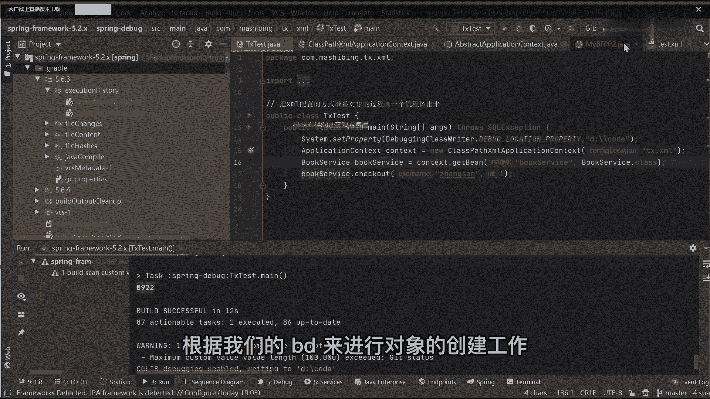

所以这块就完成这件事情了，就完成这件事情了，这样我们也想，但是只能定义一个，还还还是可以定义很多个呀，这个bean factory post processor，一个还是很多个很多搞好，你想定义多少个。

定义多少个，那么这么多个怎么执行啊，怎么执行，能执行吗，对它是通过看心情，它是通过for循环来进行执行的，那for循环的时候，我怎么能强调它的优先级呢，比如说我就想让某个先执行怎么办，怎么办。

加锁不用加锁，对adorder就可以了，adorder好，可以指明在当前这样的一个顺序，可以根据我们的顺序来进行相关的一个，执行操作，就这块好吧，当然这是其中的一个步骤，除了这个步骤之外，还有什么。

我这儿再额外补充一些知识，在唉刚刚的东西tm白同学给老师扣个一。

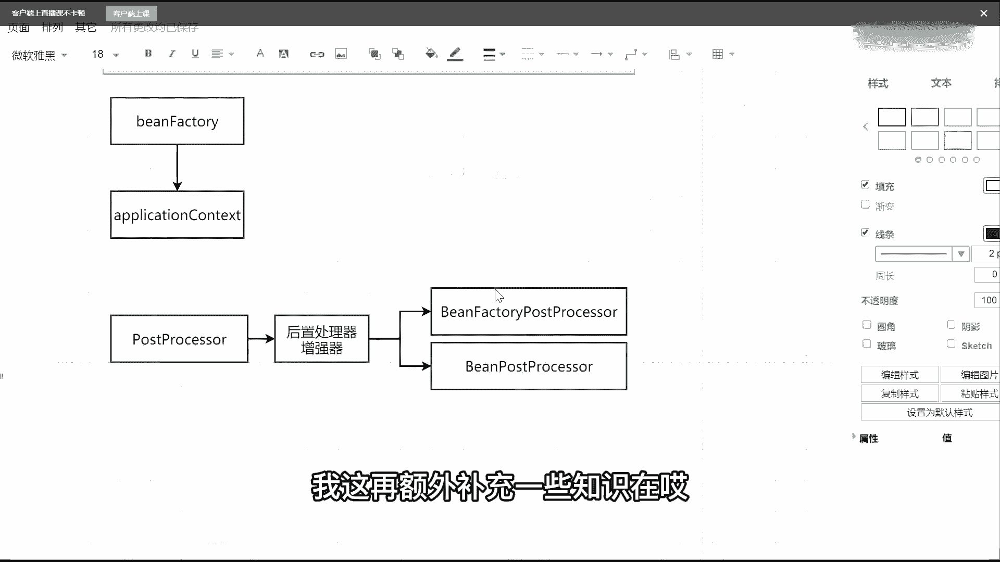