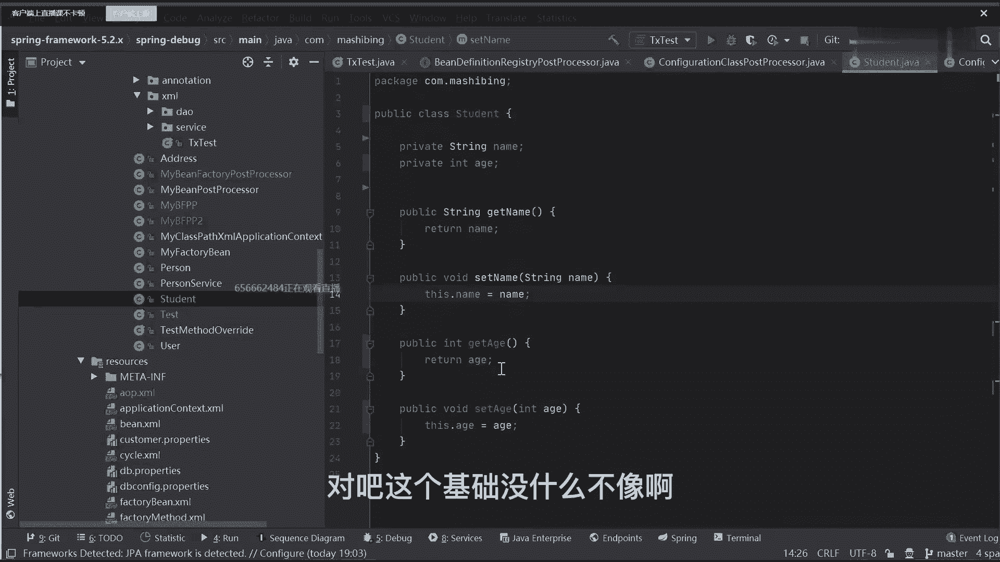
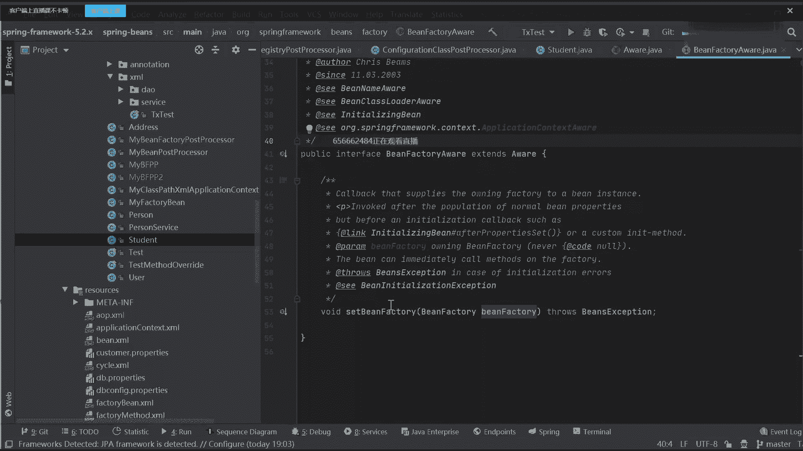
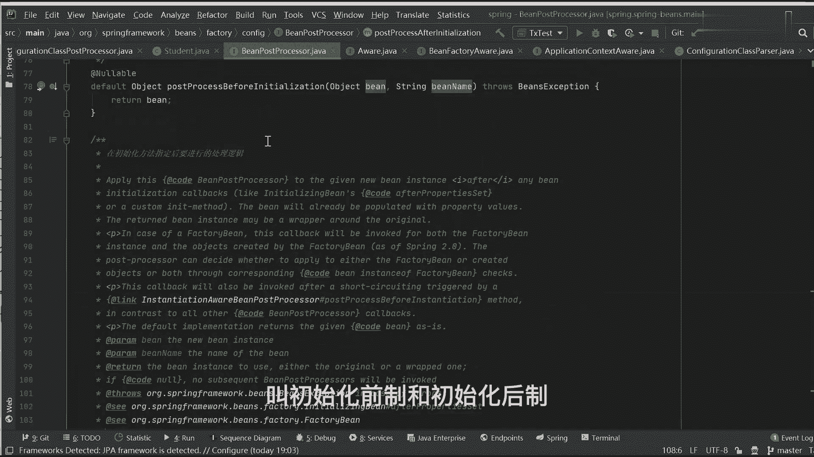

# 马士兵教育MCA架构师课程 - P63：BeanPostProcessor接口详解 - 马士兵学堂 - BV1RY4y1Q7DL

唉刚刚东西tm麦同学给老师扣个一，你听明白了吗，听完之后我就再补充一个东西啊，在当前这玩意儿在下面它还有一个子接口，我也希望你能够稍微留意一下这个子接口，它其实也非常重要，什么子接口呢，我写一下叫b。

有人见过这东西吗，可可同学没见过这玩意儿啊，但其实我还是那句话，你通过名字应该能猜出来他到底干嘛的，叫been definition registic，不就是注册bd吗，注册bd的一个增强处理器。

增强处理器它有作用吗，它有用吗，有它的用处非常非常大，它有什么用，把being definition装到某某map中，不太对，看什么用，在它的下面有一个很重要的实现子类，叫这个东西，有专用的这个吗。

有人知道这东西吗，卡了的话，重新刷新一下好不好，我不知道你们那儿为啥总卡，有人掉过这东西吗，叫competition class，post processor，它是干嘛的，配置类不太准确，他干嘛呢。

同学们注意了，这玩意儿你要不知道，那么，spring boot自动装配原理，你就别学了，这东西都不知道，three bot自动装表里就别学了，真别学了，因为分布的自动装配原理。

实现核心点就在于它的一个扩展，明白意思吗，就在这玩意儿它很重要，好吧，你能看到一堆的注解的解析过程，看一眼好，不带你们看一眼啊。

我心有不甘，来b再分一次。

registry post processor，这边有一个方法点开来实现此类，找到configuration class post processor，在这里面找他，然后我点快点好吧。

你不用管这个步骤了，点它点它点它，找他来往，那看看这个主注释，a process any at property，source annotation，处理这个主题，第二个处理这个注意点。

第三个处理import注解，第四个处理import resource注解，第五个处理at并注解，看明白了吗，都是在这以入口能够进来的，如果这东西你搞不明白。

那别的东西你就甭学了，所以说美元理永远说不清楚，明白意思吗，所以这是这一块的一个核心点，我们不说这东西了啊，这个这块扯的有点远了，你先把这东西搞清楚了，也就是说我们这儿完成很重要的一个基本功能。

那这其实我可以留一个疑问，有什么疑问，大家想一个问题啊，你们去你们自己去思考啊，我今天晚上先布答案，这玩意儿他继承了definition being condition。

reject post processor，那么它里面需不需要实现bean factory，post processor里面的方法需要实现吗，看这个继承关系啊，他继承了他，他又继承了他。

他是否需要实现这个里面那个post process be factory，这个方法需不需要，一定需要吧，肯定需要，对不对，来公开课同学需要吗，要吧，如果要的话，我们可以点开这个东西来看看。

confusion，can conversion，class，post post，点点开post process，并factory，这块儿有这样的一个实现功能，但里面有一堆的判断逻辑，衣服不管它。

但这块做了这样一件事，叫enhancer configuration classes是啥意思，别的东西你都可以不了解，已经hener了解银行家叫什么叫增强，它有什么意义，这里面其实引申出来一点点。

我们在写配置类的时候，pk的时候，配置类为什么需要生成代理对象，你看过电视剧吗，配置类，配置类里面你们是那个配置类是否需要带对象，需要吗，怎么突然开车没开车呀，需要吗，啊我开车了，没有啊，大家看啊。

这个你们是不是应该艾特configuration，销售过这些类，at configuration修饰类，它是否需要at confuration里面，你们一般会配置一个叫艾特定。

然后创建之后我们具体对象对不对，就是我问一下，这个配置类是否需要动态代理来创建出来，代理对象需要还是不需要，需要吗，要吧为什么，有人想过为什么吗，是什么原因导致我必须要这么做的，核心点就在于这块，好吧。

这也告诉你了，enhancer configuration，classes inhaer，创建带对象的incancer，你点进去之后，你会发现里面有具体的逻辑处理构成，就你自己看吧好吧。

讲这个东西自己看吧，就里面逻辑里面有这样的一个包含逻辑关系，你可以自己来看一下好吧，增强肯定要代码吗，不对，这不是核心点，阿福说的靠点边了。

留个疑问下去之后好思考一下，我们先不管了好吧，有有兴趣的话，我们下次再聊，来回过头来看看上面那张图，所以这个图进到这个地方了，也就是说，我现在我现在要把它变成一个最终的bd对象了。

我的值也已经替换完成了，当我的值p完成之后往下走，走到这块是不是该创建对象了，创建对象我们说了，我可以直接通过反射的方式，来进行对象的一个创建，那我问一下对象创建完了之后，下一步干嘛，对象创建完了之后。

下面干嘛调用使用对该用了，使用使用完了之后呢，销毁，销毁这是不是就是我们整个b的一个生命周期，从创建开始到使用，从使用开始到销毁这一块儿，我如果把它框起来，框起来，这最后他是什么，有点变成什么东西吗。

是不是这个意思啊，但这个生命周期啊太粗糙了，真的太粗糙了，你这样说是不对的，或者说不严谨的，那这样我还要再普及一个最基本的知识，同学们，我们一般说的时候都口头说叫什么叫创建对象，没问题吧，就创建对象。

我问一下创建对象包含几个步骤，几个步骤啊，对敲黑板要考的，一般情况下包含两个环节，第一个环节叫实例化对吧，第二环节叫初始化，我先问一下实例化干什么事情，不就是分配内存吗，对吧，当我分配好内存之后。

我的问题是，此时这个对象里面的属性值是什么值，默认值什么问题吧，我们达成共识点，那么很明显，初始化我应该干的事是什么事，什么事属性赋值了，这大家所有人都想到，到此就为止了吗，到此为止了吗，二加属性复制。

这是其中一个功能，除了属性赋值之外，还有其他非常重要的核心点，什么点呢，比如说执行叫init方法，比如说叫扩展支线，还有这样的一些东西，这些东西说白了他很麻烦，但是这是spring里面最标准的一套流程。

你是必须要知道的，所以下面我们需要花时间来把整套环节来打通，到底什么叫病的生命周期，来，我问一下，有多少同学，现在能把病人的生命周期给完整的背下来有吗，我都不认你们理解啊，你们能背下来就就可以。

没有肯定有有很多同学可能会很聪明对吧，上网一搜变的生命周期对吧，点开网页里面有一堆深究spring中变生命周期好吧，大m spring生命周期了，那随便打开一个帖子好吧，一堆文字来开始干，开始背对吧。

然后呢还有一些同学比较聪明，老师这个图片我去把这张，没了，诶刚刚还有怎么没了，对了刚才看很多同学比较聪明，不能说老师我去背一张图片，把这个图片里面的关键步骤给背下来，对吧对呀，你背下来之后。

你可能每次面试之前你都要去瞅一眼，都要去看看，如果你不看的话，很明显忘了对，很快就忘了，所以这玩意儿你不需要背，写spring源码的作者，他也是个人，他只要是个人，他就一定会有自己的逻辑思路。

那我们能不能把这一套逻辑思路给背下来，如果能把这套逻辑思路给背下来，那还有问题吗，这没问题了吗，是不是意思好吧，时间跟他说应该是录播对，没问题，就是录播是录播，所以下面我们要详细剖析一下。

bean的生命周期到底是啥，不是人，别这么说好吧，刚刚我们详细说一下视频周期，从创新立项到使用到销毁，中间还应该包含很多sa过程，求道者，你说的加载验证准备解析，这东西属于某一某一个并对象。

某一个病对象的一个创建，但是这些东西是属于jd m里面的，我们不说那么细，我们只是说spring里面都是怎么用的好吧，n9 说开发中用不到，注意了，开发中是用不到，但如果你不会。

你可能连开发的机会都没有，所以把这事儿我希望你能想明白，不要说我学东西都是开发中用的，不要用好吧，它就是用来面试的，你说你面试的时候，有谁会问你说你来给我写个代码，不可能他只能问你这些逻辑上的东西。

或者理论原理上的东西，你必须要会，你不会了，你连出cp的机会都没有，所以不要再抱怨这件事情了，该学的你就要学，很重要，来我下面带你来梳理这个思路，梳理这个思路，不要再说你老师我是不是不用学。

必须要学好吧，第一个不要再说什么内卷啊，什么东西好，不要说这些东西没意义没意义好吧，来我们就学东西就可以了，第一个叫实例化，刚说了什么叫实例化来着，分配内存属性为默认值动作，大家都能理解好吧。

在实例化完成之后，下面有很大一块，还要完成一个最基本的初始化功能好吧，初始化到底是干什么事儿，怎么去理解，第一步你想一件事，我对象创建好了，下一步你告诉我应该干嘛，我们不看源码好吧。

就按照正常的逻辑思路，下一步干嘛，不就该赋值了吗，是不是对象属性赋值啊，随便来一个属性赋值，对不对，我想这个不用背吧，你对象创建好了，下一步直接进行属性赋值，我觉得这个东西作为一个正常人，你都能想象到。

那复制完了之后，前面干嘛呢，下面干嘛，很多同学可能会比较懵了，老师该干什么事了，该扩展了，没到那个环节，也没到那个步骤好吧，他在哪做这个事情呢，你如果看帖子的话，下一步有什么东西，第一个叫实例化变。

第二个叫设置对象属性，第三个叫检查aware相关接口，并设置相关依赖，很多同学对于这个偶尔接口理解的非常非常差，来谁能告诉我什么叫ova切口，这玩意干嘛的，没听过，你应该听到这啥东西啊，翻译过来叫什么。

接受翻译过来叫什么，就联想到要一直到晚啊，这东西很好理解。

我之前给大家讲过不止一遍这玩意儿了啊，讲过很多遍的东西了，它没那么难理解好吧，来随便打开一个对象，我们试一下，把这东西干掉啊，都是之前讲课的时候留个例子啊，删掉，删掉删掉之后，我们随便创建一个。

比如说叫student，没问题吧，穿上之后我可以往里面写一些属性，private string name，private int int id is，这没问题吧，你定义好一个对象之后。

我肯定要设置一些属性值，我把它设置成自由的，然后生成公有的set和get方法，这没问题吧，那我写这东西的理解的同学扣一，没有人说连这东西都不理解吧，在后续的时候，我肯定要调用我们的set方法。

这个方法往里面进行一个属性的复制操作，这个我觉得大部分人都能理解对吧，最基础面向不像好吧。

那下面问题就来了，什么问题，spring本身它是一个容器，它是一个框架，through里面有没有帮我们定义了很多很多，其他不需要我们用户自定义的对象，有没有，有没有9万。

比如说刚刚上面提到的bean factory，这是不是容器帮我们定义的，再比如说application context，是不是容器帮我们定义的，那这个时候问题就来了，同学们什么问题。

我这儿完全可以在里面写这个东西，还有，叫be factory in factory，private obligation contest，contest，是一些数值那一样的，你想吧。

我现在以及设置上流量属性值了，他也是自由的，我如果想往当前对象里面，注入对应的一个属性的话，我必须要生成公有的set和get的一个方法，是不是意思是什么了，那生成好了之后，问题就又来了，同学们什么问题。

什么问题啊，谁在什么时候调用此方法，来先看第一个问题，谁叫你觉得这个赛段话是我们去掉还是容器，帮我们去掉，谁去掉，容器吧，你叫对象创建，你都交给容器了，你自己还去调研方法，你怎么调，你调不了。

所以只能是容器帮我们去调用这个方法，断不断好吧，第二个问题在什么时候掉，什么时候讲，你想嘛这儿有一个set in factory，这儿有一个set gation contest，两个set方法。

可能还会有其他方法，我什么时候掉了，我怎么判断启动的时候，启动的时候，我怎么知道我要去调用这个set in factory呢，我怎么知道我要调用set application contest呢。

因为我是不知道它有几个set方法的，我也不知道里面有什么样的属性值，那我怎么能确定我去调用什么样的方法呢，听到了吗，所以怎么办，监听实例化没那么复杂，线下面向对象能不能做一件事，第一。

统一的规范接口来实现此功能，通过接口能实现这个功能吗，有点懵逼了，老师我通过接口怎么定义直线啊，很明显，来看一下我们的three sement里面有一个av接口。

你发现了这个接口跟single net一样，它里面有任何方法实现吗，没有办法。

没任何方法实现，但是此接口它要有子类实现。

比如说叫b family away，有些什么名字，什么名字叫set bean factory，你这时候看一下student里面的set in factory。

和我们这儿写的set in factory一样不一样，这两个方法一样还是不一样，你告诉我。

一样吧，没任何区别，对不对，再比如说再打开一个东西叫application context，aware。

这接口它也实现了aware接口，它也叫set application contest，是这玩意儿，那你想当我设置好这样一些东西之后，我有一样那不一样，138哪儿不一样，0879同学哪不一样一样吧。

那所以我在当前对象实践的时候，我可以怎么写了，怎么写，我能不能这么做，实现并factory aware逗号实现application contest w，看到了吗，我10年两节课之后，方法都没让我重写。

这直接向上向上指向，向上指向有了吗，有了吧，是不是这玩意儿不用指两个方法吗。

所以你告诉我外交干嘛的，刚刚说了一个东西叫属性赋值，没毛病，非常对，他就是叫属性赋值，但是它这个属性赋值赋值的是什么属性，什么属性，对象，能不能这么写，叫用户自定义属性赋值理解吗，这是第一个步骤。

容器自定义选项赋值，比如说我们的内容，比如说我们的h是不是意思，第二个这个东西叫容器对象是吧，是不是这意思好吧，所以这两个步骤合起来都可以称之为什么，这是什么，不就是土金扶持吗。

只不过一个是用户自定义对象属性赋值，一个是程序对象的负值吗，是不是这意思好，当然有人问了好多问题，有疑问，老师现在是不是都不需要wr了，直接out to word不就行了吗，哦加上艾特奥特尔也行啊。

对没问题，你可以加at out to word，但是如果人就是用插画文件写的呢，你用注解没问题，注解可以，前两件这件事情你加一个add owr的，如果我不用注解的，我可以不用注解吗，我没背怎么办。

听到了吗，它是一个标准流程，他不可能预估到说用户它会有什么样的方式，所以我只能说我尽可能的把我所有存在的，可以做事情，我都帮你去做了，就这么简单，你再帮帮不了你了，我没办法。

但我能想到的东西我一定帮你想到，这意思吗，来这块听班同学老师扣一能听懂吗，所以偶尔你还很难理解吗，不难理解了好吧，刚刚有人问啊，这是什么软件，这个软件名字叫枫叶云笔记，然后他叫m笔记，你们可以下载好吧。

你可以下载看，容器对象赋值指的是啥，就是指的我们spring整个容器里面，整个容器里面它需要的这些对象，比如说我刚刚写的bean family，比如写的application context。

再比如说environment，再比如说resource，loser吧，这东西全部都是容器，帮我们创建好对象，那这个时候如果我想用的话，我只能这么干了，我只能通过外接口来实现，明白意思吧。

哦process on，不香了，不是不相了，是那个有九张图片的限制，所以我不用了，好吧，这个y接口是空的，有啥用，不就是起一个标识作用吗，你synont也是空的，你怎么实现功能呢，是不是这意思好吧。

理解同学下去之后，自己好好感受一下，好好悟一下，哪不清楚的话再来问我行吗，来我们这儿画一道横道好了，当我们到这个步骤之后，同学们想一下我完成什么事儿，听好听好，我的思路好吧，同学们，当我们创建完对象了。

我也把对象里面的属性，我几乎都已经复制完成了，我这写个东西啊，我把它对应的那个方法给你们写出来，这个步骤放下，什么叫create b instance，就这个方法的名字好吧。

这个步骤它也有对应的一个方法，怎么显示出来了，放下什么叫populate，b，好下面这个步骤叫invoke awa method，好，它对应每一个步骤里面的方法名称，我给你写出来行吧，来到这个步骤。

当你到这个步骤之后，循环依赖明天讲好吧，循环依赖明天讲，大家思考这件事情，当我把这个环节我也做完了之后，下面你在想我该干嘛了，我问一下，当我到这个步骤，我做完之后，我现在是否获取到了一个完整的并对象。

是否获取到一个完整的bean对象，会到了吗，如果按照我们正常的一个创建对象的逻辑的话，我现在已经实例化完了，我也把属性复制复好了，那这个对象我是不是应该可以拿过来用了。

正常情况我们先不考spring好吧，我们先不考虑spring，就我们如果自己用创建一个对象的话，第一步先创建对象，第二步属性赋值，赋完值之后，我是不是已经拿到一个正常的对象了，这没问题吧。

就我们不考虑spring的东西啊，但是在spring里面他还没完，他需要做一堆的增强实现，所以下面做的所有事情都属于什么，都属于病的扩展，实现了都属于变的扩展，实现什么样的扩展实现。

比如说当你这个步骤执行完成之后，下面紧跟着会导入到会进入到一个环节，叫执行前置处理方法好吧，下面还有个东西叫执行后置处理方法，当然很多同学可能不太理解，这个前置和后置到底代表着什么意思。

很简单，我带你们看代码，打开一个东西叫b post processor。

终于找到这个接口了，当你打开这个接口之后，你发现了他是不是也是个post processor，什么什么增强器吧，它也是个增强器，只不过当前这个增强器它针对的对象是谁，b吧是不是变，所以往下走。

在这里面有两个方法，一个小post process before an insulation，下面这个东西叫post process after insulation，我问一下后面那个单词什么意思。

什么意思啊，叫初始化前置和初始化后置。

那意味着在中间这个环节里面，它必然包含了一个叫初始化的步骤，有点懵逼了，老师你这个大框不就是初始化吗，怎么这还有个初始化，这个初始化跟那个初始化不是同一个东西，一会儿我来解释它们到底是什么样的。

一个逻辑关系，但我们通过方法我们能判断出来这样的东西，而我们这儿说的前置也好，而说的后置也好，它们全部都归属于谁东西，什么东西，归属于啥，是不是叫bean post processor，是不是这样。

那么有人就会问了，老师这个being post processor，它有什么用处啊，它有什么意义啊，它存在的价值是什么呀，啊很简单，我为什么不上来直接讲a o p，为什么要讲l o c。

记住我这说的一句话，这句话给你写出来，lp是，l o c，一个扩展实现，这句话我不知道有多少同学能理解，但是我希望你把这句话给我记住，这句话很重要，其实我们可以来做这样一个判，断，什么判断先问a op。

它实现的原理是什么，ob现在认识啥，叫动态代理，动态代理两种实现方式分别是什么，jdk好吧或者cd吧，这没问题吧，这应该属于一个最最最基本的一个基础知识了，好吧，那我现在我已经获取到一个原始对象了。

并对象已经有了对吧，当我有了一个变速箱之后，我现在想试试他的代理代理对象，我是不是要把当前对象作为其中的一个引用，给它传递进去，让它来生成我们整个具体的代理对象了。

所以这个时候你如果想判断的话怎么办，找到我们的bean post processor，然后点开里面的实现类，其实你一看，你就能知道哪个是用来生成具体的代理项目，哪个是看累的，明早吧，哪个是第三个。

有没有说第二个呢，其实不管第二个和第三个，最终都会找到第三个，当找到第三个之后，我们可以点开这里面的方法，找到我们那个bean post processor里面两个对应的方法。

第一个叫post process before initialization，是不是方法点开来告诉我，这里面有做任何实践吗，或者说有做任何的额外处理工作吗，有没有做没有，就一个returd。

把变速箱连封不动的返回去，如果正面不做的话，我们要看谁了，要看after，你点开up after之后，你发现了它里面是有处理逻辑的，在这里面你找一个方法叫viper，if necessary。

那如果需要的话，我就去进行一个包装好吧，你点开这个viper if necessary，点进去，点开之后往下拉，拉拉拉拉这块来告诉我这个画名字叫什么，创建代理吧，好吧，来再点进去往下翻。

最后一行叫propercy favorite，get propercy，工厂模式，通过代理工厂来创建出来我们的代理对象，所以我还要再接着往里面点，点完之后告诉你了，我要创建a op的代理了。

然后获取我们的代理对象，再点进去，点击之后，你突然发现了它是一个接口里面的方法，那我一定要找谁找具体的子类实现了，所以我可以点一下子类实现来，你告诉我你看到了什么，什么熟吗，这俩你熟吗。

什么时候很熟了吧，不就是我通过我的条件判断，选择一种代理模式来进行对象的代理吗。

所以你想一件事，我们的a op是在中间的某一个环节里面，去做这样一件事。

