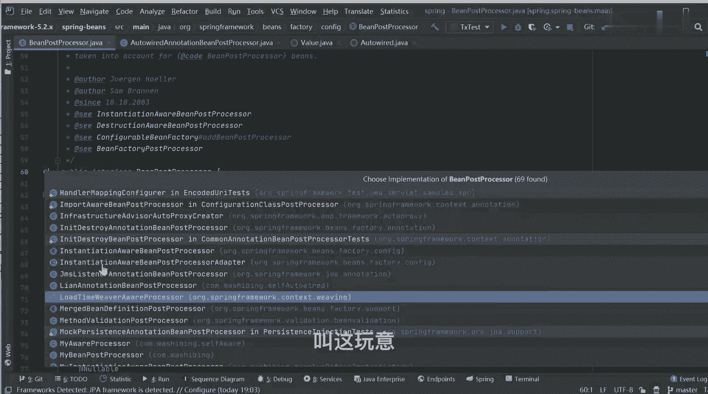
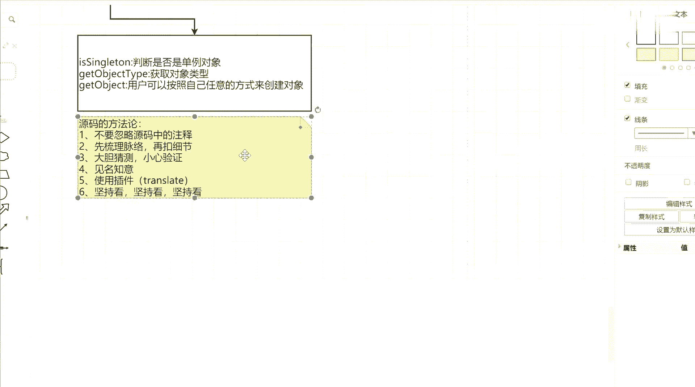

# 马士兵教育MCA架构师课程 - P64：必知必会的13个Bean生命周期处理机制 - 马士兵学堂 - BV1RY4y1Q7DL

病的生命周期里面有没有，右半，所以这时候你再想想我刚刚说的那句话，我说a op就是i o c的一个扩展实现，现在这句话能理解了吗，能理解吗，可以了吧，是不是计划，所以为什么不能先讲a a o p。

他讲不了，很多人问我老师a o p的入口在什么地方，你不把这个东西搞明白，你能治好入口，你找得到啊，这才是最核心和最关键的点，明白这意思吧好吧，所以这样你明白了，当然如果你想去研究的话。

你可以点开我们的b ba being post processor，在这个being post processor里面，它依然有一堆的子类实现，你可以详细去研究很多好，我们也可以自定义，你看你的需求。

明白意思吧，这里面都是子类，先把它关键的核心点先掌握到，找到之后再说别的好吧。

来接着往下走，再往下走的话到哪了，到这个初始化的步骤了，这块难理解了，老师这个最外层叫初始化，里面还有个初始化，这个其实翻译成初始化不太严谨，它更严格，应该叫什么叫执行初始化调用方法，这样能理解吗。

什么叫执行初始化调用方法。

比如说我随便打开一个配置文件有吗，我在定义好一个并对象之后好吧。

这后面可以加一个属性叫init method，见过这东西吧，当然这东西我们一般是不写的，一般是不写的，但如果你写了，我是不是要知道这些步骤是干嘛的，今天不是有意义吗。

没啥意义，在java语言里面其实没啥意义，如果你接触过python，你这东西应该比较熟，班子里面有两个很重要的方法，第一个叫下划线，下划线new，它相当于账号里面的构造方法。

还有一个叫相关性相关项链init，它是干嘛的，完成初始化方法，这里面是不是就完成了一个最基本的属性，复制工作，而我们的属性赋值，不好意思，我在上面环节我已经完成了，所以这个初始方法你可以调也可以不掉。

看你的心情明白了吗，k掉也可以不掉，没关系的，但是好吧，这它是有自己存在的意义和价值的，因为在当前这个方法名称叫什么呢，叫invoke init metho，在当前这个方法里面。

它有一个非常牛逼且神奇的判断逻辑，什么逻辑呢，他会检测一下你当前这个病对象什么叫是否，是否实现了，i l i z z b接口好了，又来了一个接口，我如果直接写这个接口，你知道是干嘛的吗。

你们知道不给介绍干嘛的，很多人可能没见过，可能不知道，但是你一定见过一个方法，你一定见过一个方法，什么方法叫after，property set明的方法吗，见过没，别告诉我，没见过啊。

你们你们如果在公司每年框架的话，别人代码里面一定写过这样的东西，不可能没写过，这样的东西是一定写过的，也写过了，这啥呀，很多同学懵逼了，老师这啥呀，我好像没怎么见过这玩意儿的，他干嘛呢，他干嘛使的。

有什么用处，尴尬一点都不尴尬。

忘了没事好吧，我知道你们会忘了，工作中不用嘛，肯定会忘了嘛，来你在这儿后面加一个接口，你是来自being，这里面需要实现一个after property set的方法，你告诉我在这个方法里面可以干嘛。

去干什么事，这里面我是这么理解的，叫给拥护最后一次机会，机会来进行赋值或调用操作，这边能干干这么一件事，this。name等于张三，可以这么写吗，可以吧，是不是在bean创建完成之后。

我是不是可以最后再执行这个词操作了，是不是给用户一个机会，因为你整个容器的框架的整个对象创建过程，全部都交给了spring来控制这个环节，我们是干预不了的，没事我可以干预，我给你留个口子。

在这儿我来干预一下，在最后一个步骤的时候，我来干预一下，行不行，可以吗，可以吧，这就是这个方法它存在的意义和价值啊。

所以他也相当于做这样一件事，当然这样做完之后，下面还有一个叫否，如果我这不做的话怎么办，开始调用小银invoke，init method，就开始调，我们最基本的这个初始化方法就可以了。

看前面我还可以在属性，对属性做最后一步的复制操作，这会连过来，明白意思吗，在这个环节里面，我要做的一些最基本的工作，接下来接下来，当这些步骤我全部都执行完了之后，告诉我现在干嘛了，干什么事儿。

下面就开始使用，对象吗对吧，当对象使用完了之后，下一个步骤不就是销毁对象吗，是不是这意思，现在理解了吗，来刚刚那个环节能理解，同学给老师扣个一吧，销毁一般是不会问的，为什么什么时候会销毁对象。

你在关闭容器的时候会销毁对象，你有自己关闭过容器吗，同学们，你有自己帮我荣幸吗。

从来没有，你们每次停怎么停啊，我点这个插口点了，你没关过农村东西，所以不用管它啊。

面试的时候这块也不会重点问的，也不是重点问的，明白意思吧，好吧，来这儿又会有一个问题，刚刚很多同学都提到了几个点，老师你在刚刚讲解过程中少环节了，少什么，有这个东西，post concert。

还有一个at pray destroy，对吧，有两个方法来我问一下，第一个注解，第二注解不看了好吧，第二注解不问第一个注解有什么意义，谁能告诉我，判断用处，没用过很多人，刚刚很多人刚刚跟我说。

老师这个注解是什么时候处理的，他相当于做的事情叫什么，就是执行，初始化方法，好吧，那么问题来了，他执行初始方法，大家好啊，我刚刚给你画的这张图是整个病的生命周期，叫整个病的生命周期。

那在整个bean的生命周期的时候，我用了这样一个注解之后，他那个对象是否要经历这样一个完整的，bean的生命周期，要还是不要，要么那如果我想加这样的功能，它应该在哪在哪实现啊，你告诉我哪实现。

哪能实现你猜你猜猜，哪能实现，每一个步骤都给你画出来，哪能实现，你告诉我，哪能，逆它你的留给你扩展点了吗，after process里面给留给你扩展点了吗，我就说你们听课就是听课。

你们不会去思考，来找一个东西，同学们看好啊，我带你们找关闭掉。

找到一个接口叫b，post processor来在这里面找算了。

我们换一个方式吧，我不用这个东西了，我先不问这个，我换一个注解，这样追在那实现的，这俩注解在哪实现的，这个用的多吧，你这俩用不多，我忍了，这东西用多吧，他在哪掉的，在哪掉，哪会掉，同学们想明白一件事。

初始化调用，你初始化这个步骤太多了好吧，同学们想明白一件事，先有的注解还是先有的插m，对不对，就是我刚开始使用框架，发明之初的时候，我现有插帽，当我只有拆包的时候，我一定已经开发出了一套标准的。

并到生命周期流程，对不对，现在我发明出来一个东西叫注解，我需要把注解的功能也怎么样完成注解的功能，那这就会有一个选择，什么选择上面已经是一套比较规范，比较完整的一个流程了。

那这块我是要推翻重来还是扩展实践，告诉我一定是扩展嘛，对不对，那你就要想到在整个生命周期这个环节里面，哪给我们预留了扩展的点，那快点了，不就是being post processor吗。

所以你打开这个接口。

找到它的实现类，找哪个，刚开始学，挨个去找，如果有经验的话，往这儿看这个东西叫什么，你翻译名字告诉我叫什么，叫out to world annotation，big post processor。

完成什么功能，你告诉我，是不是这样，往下走往下走，往下找找找找找来，你告诉我你看到了什么注解，什么弱点叫auto wear的value，这俩不就是注解吗，是不是注解，这不就是value这个注解吗。

看没意思了吗，是不是这意思啊，那一样的，我想实行主角那个post contract这个东西在哪找，也是找此类实现吧，整理子类实现，它完成了一个初始化的功能，以它配对的还有一个叫pray is try。

不就是初始化和销毁吗，那对应过来叫什么，不要找名字了，你如果找pray，你是找不到的啊，它叫什么呢，叫这玩意儿。

叫init destroy，annotation，being post processor，好往下找找它的一个实现，此类在这里面有一个对应的注解，来你告诉我你看到了什么。

post construct和pre destroy能看到东西吗，看到了吗，就这就这就是这些注解，来这块儿能看别的同学给老师扣一，能看懂吗，没问题吧，这是在实现的过程吗，就要尝试去找吗。

当然这一块在实现的时候，它还有点不一样，为啥不一样，这我知道这个接口叫extension aware，being post processor，它继承了being post processor。

明白意思吗，明白意思吗，也就是说他们调用的时机，跟我们刚刚说的不太一样，但是它一定归属于谁，叫being post positor，因为being post position下面它依然有一堆的接口。

子接口子类接口，比如我刚刚说的instance aware，being post posit的，除此之外还有什么。

有人见过那个叫smart，是smart，叫merge的bean definition post processor，还有东西叫smart extension aware post processor。

看完思吗，它里面的父子的继承关系依然是异常复杂的，你如果在子类里面找不到，就要去父类里面找好吧。

找到具体的一个逻辑实现，然后来进行相关方法的一个基本调研工作。

好吧，这东西不聊了，好吧好了，刚刚我把病的生命周期给大家讲完了，来听麦同学rever一看，看能懂吗，具体的实现逻辑，我需要一行代码，一行代码带你bug，咱没这时间了吧，我带你们过这东西了。

来回过头来打开我的ppt来，我们回顾一下这几个东西，第一个i o c的容器的核心学原理，这东西我刚带你画图了，能不能记下来，能记下来吗，没问题吧，还是一样，从应用去入手，然后去想它的脉络是什么样子的。

然后一步步去往下走，脉络很重要，第二个bean factory post processor接口详情详解，快点干嘛呢，你就记住它能完成对bd对象的扩展就完事了。

第三个叫ban post processor接口的详解，他应该对病对象来进行扩展，第四个叫13个病生命周期处理机制，13个哪来的，是我从图里面一共13个步骤，刚刚我已经把关键的这些步骤都给你们说掉了。

除了这东西没说，这后面两个东西没说，这是销毁的东西，我没聊，这是销毁环节要做的事情，我们给你们说其他关键步骤，我基本上都给大家讲到了，好这是你们应该进行相关的一个处理，或者说了解的一些核心点对吧。

然后再往下看，下面还有叫十分钟aware接口的意义，我觉得这东西会了吧，来最后还有一个叫bean factory和factory bean接口的对比，来先说这两东西，谁能告诉我病犯罪和犯罪并有什么区别。

面试中有人被问到过这个问题吗，被问我这个问题，同学对方扣个一人背诵过吗，没有啊，一次都没有啊，我觉得应该有人被骗到过，同学们注意一件事，他们俩的区别，想聊区别，先聊共同点，他们俩共同点是什么。

都是记住啊，都是用来创建对象的，我希望你能把这件事搞明白，都是用来创建对象的，这是最关键的一个核心点，好吧，那不同点是什么，不同点在于这东西bean factory不是factory bean。

它里面包含了三个方法，第一个方法叫is singleton，干嘛的，判断是否是单例对象，第二个get object，pap，要获取对象类型，第三个叫get object，是干嘛的。

用户可以按照自己任意的方式来创建，对象，不是什么特殊对象，没有特殊对象，可以说有相当于什么事，我们的bean factory，刚刚我在你看过没流程了，你们觉得bean factory那套流程麻烦不麻烦。

bean factory那个病的生命周期要完整，流程麻烦还是不麻烦，我只带你画了一个图，还没到细节呢，细节就更麻烦，它包含了非常非常多的一些异常琐碎的步骤，所以它是一个非常麻烦的东西。

但是它是一个标准化的东西，标准化流程明白了吗，要做对象创建的时候，如果你没做做什么特殊声明的话，它就是一个标准化流程，而下面这东西是什么意思，什么东西叫私人定制，我把上面称之为叫流水线，下面叫私人定制。

什么叫四定制，你在这个get哦，object这个方法里面，你可以使用new的方式创建对象，你可以使用动态代理的方式创建对象，你可以通过反射的方式创建对象，你自己开心就好，你想怎么创建就怎么创建。

最终我只要能够获取到一个对象可以了，他不需要经过spring定生命周期，这一系列非常异常麻烦的流程，就按照标准就按照你自定义方式就可以了，就他们两个之间的区别就这样，有什么区别，没啥区别，就这点好。

一个是有一个是四三进制，就这么简单这么简单好。

有说老师这东西怎么用啊，很简单来定义一个是不是写过这东西啊，找一下secretary be，我找一下，我忘了之前有写过的东西了，算了直接写一个吧，真的，可以吧，定义好之后。

实现一个接口factory bean，这个大，还有一个is single分的方法，三处，这样get到不太好就写dent，第二class这边可以怎么写。

servant x等于另一个student return s，可以不完了没了，同学们就这么简单，你可以这么干嘛，那么你也可以怎么办，应该怎么做pc，第二new propersistance对吧。

student。class，点get class，loader对吧，student，要class get interface，又一个以后，可是他能不能写，我在里面是不是也可以写，写逻辑，写逻辑之后。

我是不是获取到一个方法了，提高对象吧，我能买个对象，是不是你干对不对，刘老师，那我定义好这样一个东西之后，我怎么来让它进行一个识别呢，怎么识别能识别吗，能识别不，啊那是能不能识别啊。

at在哪有地方让你用at be，怎么做，同学们一看你就没看过核心，什么音破，不需要那么麻烦好吧，注意了，当你在生成每一个具体的对象的时候，它有一个标准的并对象的一个配置流程。

大家有reflex方法点开它，在这里面我会获取到当前的病要创建的名称，我开始循环遍历名称，获取它的bd对象，当我获取到bd对象之后，第一个步骤是什么意思，你告诉我，第一步是什么意思，告诉我，什么意思。

叫is factory be，判断一下你到底是否是3x变成一个子类实现，如果是的话，我用前缀加命名称来进行相关的一个获取，获取完成之后在里面进行相关的一个判断，在这里面的步骤里面。

有一个东西会调用到get object这个方法，然后我把我的对象直接就创建出来了，听到了吧，每一个步骤进行判断的时候，都会先判断一下你的病是不是一个factor be，都会挨个判断，因为这是一个循环。

每一个对象都会进行一个环节，所以你告诉我能不能识别，能不能，诶能不能啊，大哥们可以吧好吧，所以看一下这个流程，你看完流程之后，你就不用我讲，你自己熟悉了，所以这才是最关键且最最核心的点。

ok好了，这是今天晚上给大家分享东西来，有售后同学给老师扣波六，你说过吗，这个东西有收获了啊，你只是把这一点东西看完了，看出来了，可能你达到你的目的了，但是没达到我想要的目的，我刚刚带你看了一堆东西。

一堆东西，我想问一下，我们该总结了，首先什么源码的方法论，我还是那句话，我只带你看这种东西，你只是把这一个流程看清楚了不够，你要掌握看源码的方法，这才是我最想教给你的东西，你如果看二方法不懂的话。

这东西白扯换了，spring下来怎么办啊，明白意思了吗，好吧，怎么办，怎么学，刚刚我给你讲，那东西我怎么给你讲呢，过眼云烟，第一个很重要的核心点是什么，注意的，不要忽略源码中的注释。

我刚刚带你们看了多少注释，你不要把注释看了之后，当没看到直接跳过去了，不要这样，一定要看注释，原版里面并不是说我每一行我都给你写注释了，他不是这个样子的，它只在关键且核心的步骤里面帮你写注释了。

所以那个步注释不是我的中文注释。

好吧，我不是说我的中文注释，我说的这些英文注释，这英文注释不是这中文，中文是我自己配的，我说的是英文注释，这里面会给你很多的思路报道，刚刚那你看这里看街头的时候，很重要很重要好吧。

还有吗，第二个，我刚刚有提到设计模式吗，同学们，当老师提到的设计模式吗，说的好像我能看到英文注释一样，连英文注释你都不想看的话，那没辙了，不要在意细节，要先梳理脉络再扣细节，这事儿很重要，什么意思。

你不要上来之后，每一个方法都想点进去看一眼，手怎么那么欠呢，不要这样哦，你说每个方法都给你看一眼，一会儿你就焦虑了，甚至你都看到最后，你都不知道自己为什么进来看的，我为什么进来看，一脸懵逼，听到了吗。

所以你看到这个方法之后，大概能猜出什么意思就可以了，所以紧接着下一点是什么叫大胆猜测，小心验证，谁也不是源码的作者，谁也不知道他怎么想的，你管他怎么想的，跟你有什么关系啊，对不对，所以你去猜嘛。

我刚刚一直问你来告诉我这个方法什么意思，我是不是问过这句话，为什么你这话呀，因为在源码里面它都是见名知意的，你看见名字之后，你就能大概猜到这个方法要干什么事，要处理什么逻辑，它命名非常规范。

所以你根据这些规范的命名，你就能猜出来他到底是干什么事的，然后再猜再验证不就完了吗，如果猜错了，你又不会掉斤肉，猜对了，你是不是还很开心，是不是这意思好吧，来第五个，还有什么地理。

有人说老师我英文能力太差了，怎么怎么样，都21世纪了，英文差还叫事儿好吧，使用插件对吧，来，告诉你们他叫什么叫translate。

叫这玩意，translate，我我英文也不好，你看我读单词的时候不敢给你们读，我都怂，我都害怕，怎么样呢，我有插件翻译啊，实例化之前的单例，对不对，随便选一个over翻译在是不是这意思。

怎么这人还能被一个人给难住了，不存在好吧，ok所以扇形插件当然最最重要的是第六点，就坚持看，坚持看坚持看，所以咱们同学有很多同学，我问一下，有多少同学在我讲原版之前，看过原版给老师扣一有吗。

我觉得一定有很多人看过，但是一定有很多人没坚持下来，为什么，接下来就我说的方法不对，就是方法不对，你掌握方法的这事儿就很重要，找方法就能看下去，你现在看看学原因是什么，我一直给大家举个例子。

我说你想一件事，你想想你大学的时候，你考四六级的时候，你干什么事，你买了一本单词书，你背了4年，你告诉我，你还记得几个大学的英语四级单词，单词书，你记住几个，你告诉我啊，记住几个。

这就是一个单词叫abandon，其他东西都没记住，是不是意思，你每次都从头来从头来从头来，那还可行，每次都从第一个点开始来，第一个单词开始背，每次都从第一个单词开始背，你只记住第一个单词吗。

现在都记不住吗，而第一个单词还非常尴尬，告诉你要放弃，你放弃得了，是这意思，所以你记住了，你先捋出一个脉络图出来，当你把这条脉络图捋出来之后，你再去一步扣细节，我今天我就看xml文件的解析。

明天我就看注解的解析，后天我就看b对象怎么封装的，大后天我就看defeatory post processor，大大后天我就看他创建对象，再往后就可使用，再往后尽快销毁，你一天看见你往后走。

你中间理论一问能不能记下来，明白了吗，记下来不就完了吗，啊刚刚有人说老师这东西第七点叫天赋，你说看看源码需要啥天赋，他有啥天赋，他不需要天赋，他就看你能不能学下去，有啥天赋，你告诉我。

而且我说的一定对的吗，我说的只是我的理解，我的理解的不一定完全正确，但是我能够自圆其说，并且让你们理解他就这么干的，是这意思，另外怎么说来着，1000人心中有1000个哈姆雷特，就这意思。

每个人看想法的时候都能理解到不同的想法，你可能比我还优秀，但是你有没有去干这件事情，如果你去干这件事情了。

