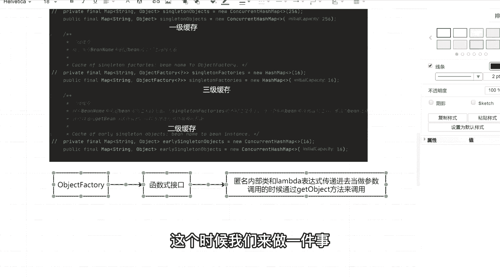
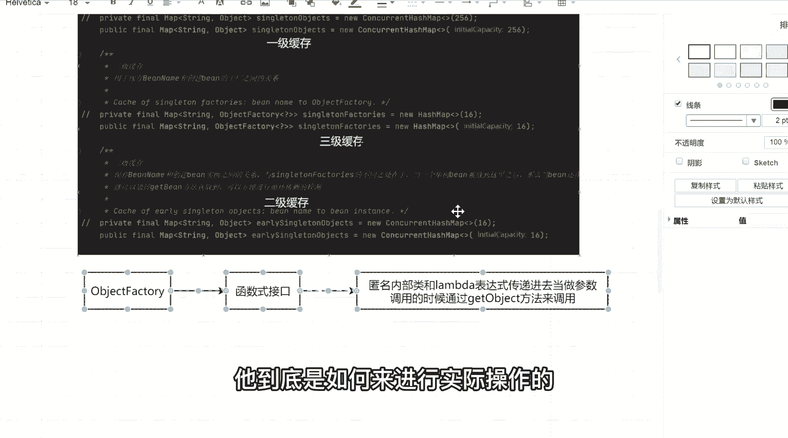
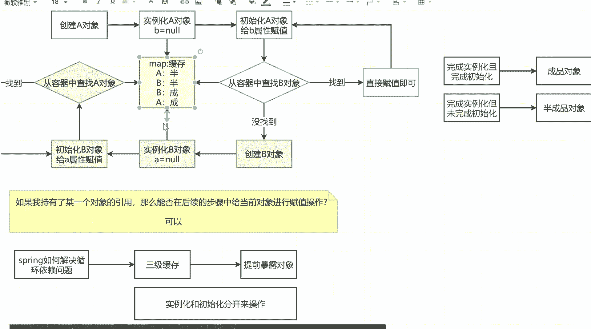
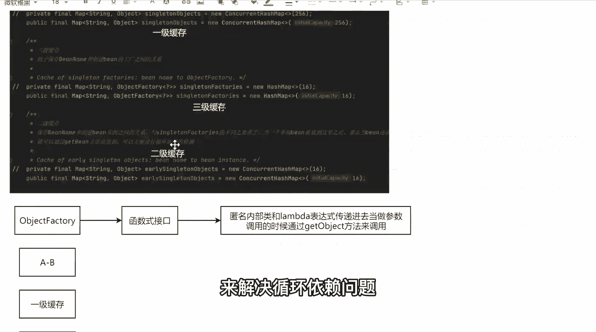

# 系列 6：P66：源码留心的6个方法 - 马士兵学堂 - BV1RY4y1Q7DL

调用到时候通过get object方法来调用，反正两句话，我希望你能够记住了，我希望能记住好吧，那光讲这东西，我觉得很多同学还是一脸懵逼的，我还是不知道他为什么使用这样一个东西，它存在的意义到底是什么。

或者说它到底有什么样的一个价值，那这个时候我们来做一件事。

做些什么事情，光说这些理论东西，光说这个图，我觉得你们都理解了好。

但是我们要看一下原版里面，它到底是如何来进行实际操作的。

我可以往这个地方放一些东西，什么东西，这定义好叫一级缓存，下面叫二级缓存，再往下叫三级缓存，我定义三个缓存对象，后面可以往三个缓存里面放东西，放对象好，我们来完整的模拟一下什么。

当a杠b存在循环引用的时候，它是如何往当前这些缓存对象里面设置，具体指导，我们把整个流程来进行一个优化，可以吗，可以吧，我现在已经把这个流程过一下，因为我不带你们这个这块东西啊。

我还是希望能够带你们debug下源码，因为如果不垫吧，呃不debug源码的话，这东西会显得非常非常麻烦，单说理论没意义，所以我们还是按照这样一个流程来，但是有的同学可能会说。

老师我之前自己从来没有debug源码，我diy源码的时候，我应该怎么debug，或者你debug太快的话，我跟不上怎么办，注意我让你跟上，所以在讲这些东西之前，我需要让同学们能够记住几个异常重要的方法。

原文里面的代码和步骤是非常非常多的，我也不会把每一行代码都给你，详详细进行一个讲解，这都不是最主要和最关键的，所以我们只说非常重要和核心的方法，到底有哪些，我希望你能给我记住六个方法。

记六个方法能记住吗，同学们记录方能记住吧，所以这应该没问题好吧，我先写一下，你好好记一下，第一个叫get be，他后面第二个叫do get，并看后面叫做create，看后面，叫做do create b。

再往下走，叫create bean instance，然后下面再来一个，populate b一共就这六个方法，我觉得这个方法大家不可能记不住，也不应该记不住，也就是说你在看源码的时候。

只需要留心这几个环节就可以了，别的东西我们都可以跳过，这没问题吧，就几个东西，然后我还需要再给大家提一个醒，在原版过程中，在debug，过程中会出现套娃操作，所以每一个步骤必须明确到底，在干什么事儿。

没问题吧，源码里面有很多套娃操作，或者有很多递归的操作，很多同学其实蒙就蒙在递归上面了，你发现刚调完一个方法，诶又重新调动了，诶又重新调动了，很麻烦，所以我把这些提前东西我都给你预先准备好，没问题吧。

我们先来走这样的一个流程，当我走完这些流程之后，我们再来解决这一块，这个map里面存在的问题，就是源码里面。

它到底为什么要使用三级缓存，来解决循环依赖问题。

好吧。