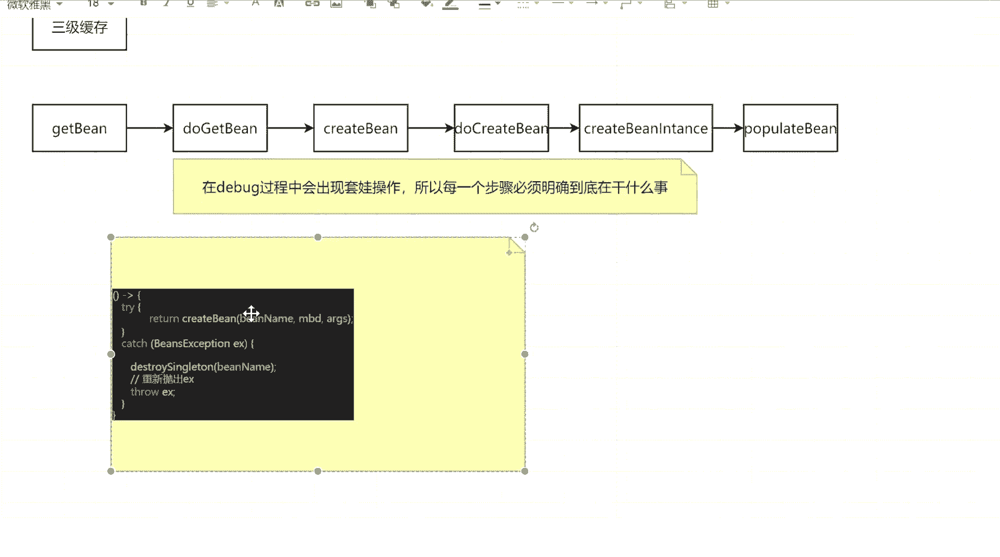
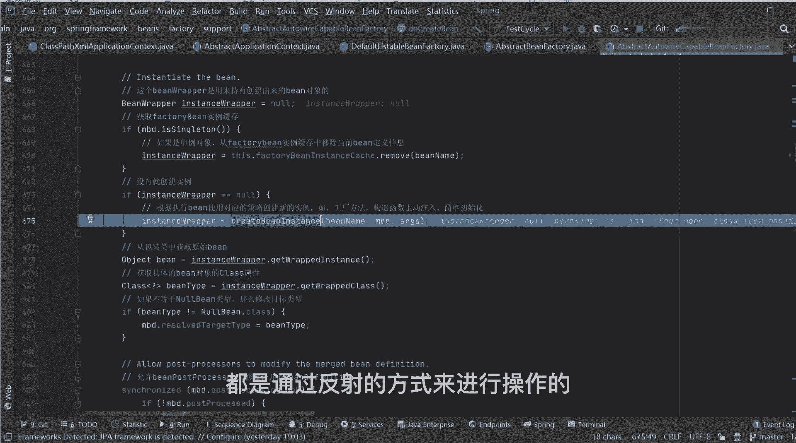

# 马士兵教育MCA架构师课程 - P67：a到b循环到缓存优化源码讲解 - 马士兵学堂 - BV1RY4y1Q7DL

来啊看好了，我这儿定义了一个a对象，我把这个name都干掉，不要name了，对吧，大家看到了，在a对象里面有一个b属性，明白了吗，有set方法，有get方法，然后这我定义了一个b对象。

b对象里面同样有一个a属性，这把它干掉，不要他，什么问题吧，比如说a现在里面有b了，b现在里面有a了，是不是这个过程，这是我基本定义的两个基本对象，当我定义好之后，我这用的是配置文件的方式。

因为我觉得配置文件的方式它更加好理解一点，所以打开我们配置文件，你可以看一下这个过程怎么做的，现在我定义了一个b对象，它是a的，然后看sql a里面有一个属性，一个b refb，这有一个b对象。

也是b对象，引用了refa refa，你告诉我这样的代码在进行debug过程中，它到底是否会出现循环依赖问题，这是代码会出现循环依赖问题吗，诶会不会啊，肯定会的吧，如果不会的话。

我们一会儿来测试一下好吧，来点个菜test，我这直接运行run，大家错了，不是这个啊，上面这找到我们的circular test，来这个概念表，右击，你先让一下吧，先跑一下，大家看一下这个问题好吧。

我错了，我这每次都要编译源码，所以这个过程是比较慢的，你们如果不是编译源码的话，这个过程不会这么慢，直接引用站包的话是非常快的，来看看这个过程，何同学刚说是会出现这样的问题的对吧，我们运行完之后。

你发现了b对象我也打印出来了，a对象我也打印出来了，他并没有出现循环依赖问题，而为什么又出现，原因点在于我们spring中内置的三级缓存，它帮我们解决了这个问题，所以下一步我要看一下它到底是如何解决的。

到底如何解决的，所以我们从debug开始看，我说过了，在debug的时候，这个过程是比较麻烦的，但是我直接带你们找到创建对象，是从哪一个步骤开始的，好吧，还记得昨天我讲课的时候。

我说了一个非常重要的方法，还有人记得叫什么名字吗，我说了一个非常非常重要的方法，还是记得叫什么名字吗，flash，这叫flash吗，reflesh吧，reflesh好吧，reflesh，所以这进来见之。

先点f7 跳过，这是一个static，是一个防止这个weblogic，8。1版本之后的一个小bug的东西，跳过它，不管它是什么，好吧，再点f7 进来，尽量做到方法里面再点mc进来。

这有一个reflesh方法，我们进去进去之后，这里面包含了13个非常重要的步骤，这些步骤你都可以跳过，但是到这行的时候，我希望你能听一下叫finish be factory好。

informalization，你翻译一下这句话，它上面的解释是什么意思，叫什么，这叫什么意思，实例化吧，实例化所有剩下的非懒加载的单例对象，要说在这个步骤里面我才开始进行实例化操作。

所以我直接跳到这个步骤里面，有东西都跳过断点超过好，直到变形到变形之后，为了验证一下，我们可以打开当前的bean factory来看一眼，并factory找到我们刚刚说的一级缓存，二级缓存和三级缓存。

来找一下那个叫什么来着，一级缓存叫single object吧，你可以找一下，看这，在这个一级缓存里面，他有ab对象吗，现在有没有ab对象，一级缓存里面没有没有，再来看这是二级缓存，有东西吗。

没有这三级缓存有东西吗，也没有，所以从这个步骤开始，我们才开始正儿八经进行实例化的关键步骤。

从这开始，我们点fc进去，进去之后，上面都是一些对象属性值的设置工作，你可以直接跳过，不管它好吧，再往下进行，进到对面，从这儿开始，重要点来了，我问一下，在当前整个应用程序里面，我需要创建几个对象。

几个告诉我两个吧，就俩一个a一个b，所以我刚开始我先获取一个东西，叫this。bean definition nes，昨天我带你看过这个属性了，除了这个属性之外，还有一个什么叫病戴芬尼斯matt吧。

里面放的就是我们要创建的并对象，的一些bd信息，那这里面可能有两个吧，所以你打开这个name之后往下走走，一步一个看到当前这个集合里面有两个值，一个a一个b a和b谁先创建谁后创建，无所谓好吧。

爱谁先谁先爱谁后谁后，没关系的，在下面我要开始循环取了，刚刚list里面看到了是ab开头的，所以一定是先创建a对象吧，是不是一定先看a对象，所以从这开始完之后，第一个我获取到的病名称是a。

比如说从这个步骤开始，我要创建a对象了啊，中间有一系列的判断步骤，第一步获取一下我们的bean definition，好吧，中间有一系列的判断，我们都管不管它，但最终我需要找到一个东西，啥玩意儿。

这个方法，能看到吗，吃饭干嘛的，我刚刚有没有在你说这个有没有说这个东西啊。

它叫做get bean，还记得第一个方法吗。

是不是get变，你告诉我这get的变成干嘛的，注意了，当你在创建对象的时候，我每次都要去我们当前的容器里面，判断一下我之前到底有没有创建过对象，所以我会先获取一下b根据a去创建并对象，那很明显。

你告诉我我之前有创建过吗，没有吧，所以紧接着听到一个方法叫do get in，这是我说的第二个方法，do get in，再点mc进去，进来之后转换一下名称，不管它来往这儿看叫get singleton。

你通过名的方法，你能猜到什么叫get singleton，叫获取单例对象吧，那很明显我刚刚说过了，我说现在有a的单例对象吗，有a的单对象吗，没有有啊，1800821有吗。

你程序运行到现在有创建对象这个环节吗，没有没有，所以这个值取出来之后，它一定是等于空的，等于n等于n了，怎么办，我是不是该去创建对象了对吧，我该创建对象了，因为没有对象，我肯定要创建嘛，你不创建。

你后面怎么用呢，所以往下走，下面有一堆的条件判断，我们直接跳过，不看这些步骤了，好吧，你拿走走到一个步骤里面，走到这行，说m b d sileton说，我们当前的a对象，是否是一个单位的默认单例吗。

我没做任何配置，默认就是单位的进来之后叫get singleton，好了，你看到了第一个方法叫get singleton，这个get singleton跟上面这个get singleton。

它方法名字是一样的，但是传递的参数不一样，第一个里面只需要传一个bin name就可以了，而第二个里面我除了传一个bname之外，我还传了一个什么玩意儿，看这段代码，这什么鬼。

是不是相当于我传了一个拉姆的表达式，把它拿出来，站出来，我把中间这些注释都干掉，不要浪费空间干掉，是不是一样东西，那这里面其实就指向了一个东西，叫create bean，可是这编码就调用这个方法。

我问一下。

当我们在进行具体调用的时候，现在我一进到或者我一调用get single方法的时候。

这里面东西会被调用执行吗，就这个拉法表达式它会被调用和执行吗，会不会，不会吧，不会调动执行的，我说过了，他什么时候掉，在执行get object方法的时候才会掉，所以它只是当成一个参数。

传递到了get新功能这个方法里面去，所以我点fc进去，进来之后，第一个断言，第二个加锁，不管它往下走，往下走，来往下走走走走，一堆的判断逻辑好吧，当我走完之后，走到下面那行，你看这块了吗。

叫singleton factory，什么叫singleton factory啊，往上翻，singleton factory指的是啥，你告诉我这个singleton factory指的是什么，啥东西。

拉姆达表达式吧，前面拉姆表达式对不对，也告诉你类型是什么，是object factory类型，所以当我这个地方我在调用get object的时候，你告诉我我实际执行的是什么方法，是一个什么啊。

叫做create b吧，所以点f7 我进去到create变了吧，所以这是我给你们说的第三个方法叫create bean，再点f7 进去，现在这上面一堆的赋值和其他操作，不管它好吧，再往下走走走。

走到这一行，你看到了什么，方法名称叫do create定吧，是不是do create in，明白意思吗，这时候我需要给大家提一个醒，同学们，你注意到在整个源码过程中。

研究过程中有很多方法名称前面是带着do的，当你看到do开头的方法的时候，我希望你能够给自己提个醒，为什么，因为在do的方法才是实际干活的方法，明白吗，你说我们实际真正的处理逻辑。

数据逻辑都是在do开头方法里面执行的，那你想一件事，这涉及到杜奎的，并能你下一步骤干嘛了，我是不是该真的去创建对象了，对不对，真传对象好吧，所以我再点f7 进到这个逻辑处理里面去，点f7 进来进来之后。

这儿有一个冰viper，昨天你说我这边viper是一个包装类，无所谓好吧，你可以把这个冰viper直接等同于我们的对象，往下走，往下走，往下走，到这个步骤，这啥玩意儿来着。

还记得不叫create bean instance，什么东西。

我给你说的第五第五个方法吧，叫create bean instance，你少一个s，是不是东西他要干嘛的。

这不是干嘛的，它是用来进行具体的实例化操作的，我带你们看一遍好吧，里面干什么事，其实我问一下，我们都知道对象里面的呃，容器里面的对象，都是通过反射的方式来进行操作的。

我问一下反射代码，大家还记得吗，我们写一下好吧，第一步骤获取class大写c，获取函数对象吧，啥玩意儿，第一步是获取砍函数对象，当我获取卡拉斯对象，第二步在这干嘛，是不是叫construct，or 2。

等于class。get decl啊，construct，什么意思，是不是要获根据我们当前的class对象，来获取到我具体的构造器了，当我获取到构造器之后，第三个步骤在干嘛。

是叫object o b j等于t o r。new instance吧，我是通过这个步骤能创建出来我们具体对象，这没问题吗，这个问题没，这个视频是录播吗，是的，这个反射我觉得应该会啊，我觉得过分了。

说明你的基础真的掌握的有问题，所以这个最基本的反射东西你要了解，所以我们在看那个create distance的时候。

我也要去找到具体的逻逻实现逻辑，怎么找点f7 进去，当然里面啊依然有一堆东西很多好吧，我们只看到往下走走走走走，跳过跳过跳过一堆好吧，跳过不看他不看他，走走走，再往走，走。

到这行叫instance ban。mc进去，进去之后往下走，到我们的实例化环节好吧，走走走走走走走，来看这行代码告诉我什么意思，看这行代码什么意思，class。

get declare contractor，不就是获取到我们对应的构造器吗，当我有了构造器之后，我是不是该用构造器来创建创建对象了，来了走走走，走到这一行，再点fc进去，进来之后上面一堆判断跳过去。

不管它不管它，不管它，到最后一步叫c t o r。new instance，你告诉我，我是不是通过反射的方式来创建出具体对象了，是还是不是，没问题吧，所以这个步骤里面干什么事。

就是通过反射创建对象，就这么简单，没别的意思。

没别的意思好吧，就这块处理的逻辑，我来我们返回去啊，返回去返回去返回去返回去返回去返回去之后，我们来看一下这个并对象，现在我的病对象已经有了。

这是不是有个a，是不是有对象叫aat。

1573吧，我们这儿记录一下，记住对象叫aat，1573，我的问题是同学们现在b属性有值吗，闭嘴有没有值，没有吧，b等于空记录下来对吧，现在我这玩意儿，我有往任何的1233个缓存里面放东西吗，啊。

我没往缓存里面放啊，我只是做了一个记录，表示说他是a对象了，但是我还没往我们的三级缓存里面扔东西了。

一点都没扔，所以接着往下走，往下走好吧，一直往下进行相关的一个处理吧，按道理说我第一波对象有了，下一步该进行实例化了，但是恰巧不巧的是什么，在整个实例化环节的时候，这里面有这样的一个判断逻辑。

有这样一行代码，这行代码其实就是三级缓存最主要的点，因为你往上看，这儿有一个东西好，early catch synonto be able resolve cooler reference。

说这个东西能够解决我们的循环依赖问题，就是原版里面写的注释，就这行代码都会变得很重要，来看这行代码，第一个参数是ban name，问一下现在的bin是谁，a吧b im是不是a没有b的事儿，还没到b呢。

好吧，就是a就是a后面这又是个啥东西啊，啥东西。

又一个long表达式好了，我把这个量表达式拿出来，所以这里面啊拉米亚是比较多，它有它非常重要的核心作用，我把它起到下来。

我要放这块儿啊，做一个标记，这张表达式，所以同学们想一下，当我开始执行的时候，他会直接掉档表达式吗，不会我们看一下这个adsingleton factory干什么事好吧，点f c进去。

进来之后往下走走走来，第一个步骤干什么事，第一个步骤，干什么事儿告诉我，叫this。singleton factories，点put bean name，加singleton factory。

把谁放到三级缓存了。

然key等于什么，等于a吧，value等于什么东西，value是a对象吗，不是啊，value放的是谁，放的是拉姆达表达式，value放的是拉姆达表达式，它不是半成品，也不是成品。

不管是我们的成品还是半成品，没往三级缓存连放吧。

我三级管子里面放了什么东西，c功能factory，所以他是谁，这个参数参数是谁，然后表示是不是这意思，所以这我只需要放量。

表示不可以了，没问题吧，来这个步骤没问题的，扣一，一定要跟上好吧，这些和弦不一定要跟上。

这放到三级缓存去了，放到三级缓存之后好了，往下走叫early single top remove，把二级缓存给移除掉，二级缓存本来没东西了，也不需要移除好吧。

再往下走叫registic singletons，我们这没关系，它不属于三级缓存，所以跳过去不管好了，也就是说刚刚这个步骤里面就干了一件事，把我们的lam表达式扔到三级缓存里面去了，当我扔完之后。

同学们，你告诉我紧跟着下一个步骤该干嘛了，我a对象是不是已经创建好了，听好a对象就创建好了，只不过它是一个半成品的对象，所以下一步我需要给a对象里面的b属性，来赋值了，那复制的方法叫什么。

叫populate bean嘛。

这就是我们说的第六个方法叫populate be，我现在已经在里面把这六个方法都过了一遍了，之后，你还会看到这六个方法的这个流程，我希望你能把这个方法给我记住。

所以这个步骤干嘛的，police啥意思啊，什么叫populate填充嘛，叫属性填充好，所以这里面我开始进行属性的赋值操作了，怎么复制啊，很简单好吧，点f7 进去进来之后。

上面一堆逻辑判断就跳过了好吧不重要，不管它，你们不用管它干嘛的好吧，往下走，直接到最后一行叫apply property values，叫应用属性值，也就是说这个步骤才是最关键的，属性赋值的步骤。

我只有走到这个步骤里面才会进行属性赋值，卡的同学刷新一下好不好，刷新一下好吧，自己刷新一下，我等一下卡的同学刷新一下，自己刷新一下，你们可能用的是浏览器看的，所以可能会卡一点，如果你用客户端的话。

就不会卡的，把自己刷新一下好了，那你们刷的，我抽根烟，好了吗，好了，我现在往下讲到这个步骤的时候，它是很重要的步骤，叫apply property value，这叫应用属性值。

也就是说往属性里面进行一个，最基本的赋值操作，好吧，我们点f7 进去，进来之后，我想问一下a对象里面有几个属性，一个吧，只有一个b，所以往下走走走，这些动作跳过了啊，不带你拿一个看了没意义好吧。

我带你们看到关键步骤里面，去带你们找关键步骤好了，唉挺好，第一步叫p v点，get value，pv叫什么叫property value，它封装了一个对象啊，叫属性value值，拼装一个对象。

第一个叫获取名称，我们的名字叫什么叫b叫b啊好吧，第二个叫获取value，获取一下我们b的value值，这时候当我获取完之后，我希望你把这个value值给我记下来，你看一下这个value是啥。

是啥叫wrong time being reference，啥玩意儿啊，什么叫wrong time been reference，这东西你可以不知道它是干嘛的，但是我希望你能先把这个词记下来。

我已经敲出来了，小long time been reference，你把这个单词给我记住，因为后面我们会用到这个wrong time being reference，往下走。

跳过在这一行叫resolve value，if necessary说如果必要的话，我需要去处理当前值了，我们这个wrong time be reference，它不是b类型对象。

所以我是一定要把这个值进行相关的一个，处理工作的，所以点f7 进去，当我进来之后，来同学们告诉我，我们的value是不是wrong time being reference，是还是不是，是吧。

所以这时候不谋而合，正好匹配上了，既然我匹配上了，我就一定能进到我的if判断里面去，所以先进行一个类型的强制转换，转完之后叫resolve reference，叫处理引用。

我需要把这个long time been reference，转成我需要的b对象的，所以点f7 进去，进来之后获取类型，判断有没有复工厂好吧，往里面进行一堆操作，不重要。

来往这看这处理的东西也叫result name，获选名称名称是b没问题吧，看这行代码套娃，从此开始叫this，点been factory，点get be，这是你第几次见盖的电脑，同学们告诉我。

第二次刚刚创建a对象的时候，我见过一次get变了，现在我又建了一次get变的方法，是不是意思好吧，所以现在我见到两次了，这是干嘛的，我说了，每次我在创建对象的时候，我需要先从容器里面去获取。

或者判断一下有没有b对象，我现在在b类模块是谁了，发生b了吧，是不是就相当有干一件事，我要判断一下容器里面到底是否有b对象，来到这为止，能听懂的扣一，问题吧，所以呢我点进去点f7 ，进来。

进来之后你看到了什么，第二个方法叫do get be，我再点f7 进去好吧，往下走，从容器里面获取，我们带对象，有b对象吗，现在现在有没有b对象啊，有啊，宋乾坤没嘛，没创建了，怎么会有呢，没有没创建过。

没有没有没有没有没有，所以这个对象依然是等于空的，电脑一空没创建的，所以肯定没有，你就严格按照我的标准那个步骤去走没有，那如果没有的话，你告诉我下一个步骤该干嘛了，下一步该干嘛了，创建b对象。

所以往下走走，跟刚刚的流程一模一样，一模一样一模一样，所以走到这行叫get singleton，我再点进去，get singleton，进来之后往下走，往下走，往下走，往下走，往下走，往下走，往下走。

找到我们的get object吧，来问一下这个get object，我要调谁了，我要到谁，create b方法吧，该调create bean方法了，所以点f7 进去到create bean。

再点f7 进去到create bean之后，我要找谁的，是不是该找do create变了，所以你发现了流程一模一样吧，你刚刚看别的流程，现在又是这面流程一模一样，所以原版为什么看起来比较难。

你如果真的把一遍捋通了的话，它并不难，你懂了吗，他一点都不难，它很容易，所以往下走走，我们找do cb走，do quin到这吧，终于到do魁的变了，然后当我到do魁的并之后，下一步在干嘛，点fc进去嘛。

进来之后往下走走走走就到这步了，叫create being sense，我这边不用不用带你们看了吗，它用来创建哪个对象，传递对象b对象，b对象，所以往下走完走完，我们来看一下当前b对象是谁。

叫b at 2171对吧。

我把对象留下来记一下，叫bat 2171，现在a等于那没问题吧，我现在ab对象全部都有了。

全都有了，全部有了之后，我再接着往下走，往下走，下一步啊，走走走走，下一步走走走走走走走走，走到这一步，你告诉我干嘛，这部也见过吧，这步是干啥的。

往三级缓存里放东西吧，放的是啥，来改了，待会k冒号是b value，冒号是谁，拉姆达表达式好吧，而我们这儿指的拉表达式就是下面的拉姆达式。

是放进去好了，放完之后结束了，回过头来我再接着往下执，行到populate b一模一样的逻辑，同学们还是找populate bgm c进去是吧，来走了走，跳到最后一行，跳过啊，跳过最后一行。

走到底行叫apply core devalue，再点进去，这时候问题来了，我的b对象里面有几个属性，一个吧只有一个a属性，只有一个a属性，所以往下走，我依然跳过这些无关紧要的步骤，好吧。

不管他走走走走走走走走走，来到这，第一个，我先获取属性名称名称是a，第二个我再获取属性的y6 值，来看一下当前的y6 值是谁，又是wrong time being reference吧，不是两个等式啊。

是wrong time been reference，叫装cab reference，运行时对象引用好，运行是一个变的引用，所以它是没有任何的一个变化。

叫long time been reference，还能搞清楚好吧，那一样的，我问一下，我们刚刚看的，创建b的过程跟创建a的过程一样不一样，一样的，所以我说什么叫流水线工作，他就是这样一个标准流程。

它没有任何区别，就这样一个流程，所以我们接着按这个流程往下走就可以了，好吧，往下跳一步到result being resolve value，if necessary dmc进去。

value是不是wrong time being reference是吧，y轴是不是也是这个类型类型，如果匹配的话，我进来进来之后，我要处理的引用了，要resureference，我再点f7 进去。

又回到这块往下走，往下走，往下走，获取到我们的属性值等于a，这是你第几次见到get病了，同学们第几次，第三次，那你告诉我，我现在的get bean是要get谁，是不是该改成a了，get a吧，一样。

我再进去点fc进来，又回到这了，读改变，我再点f c进去，是不是又来第三遍了，同学们，他是不是套娃，是吗，为什么很多学理不清楚，就算这玩意一遍一遍重复代码，重复代码重复，那重重复滚滚，一会儿学们就懵了。

所以别蒙，我就到目前为止，你们应该还能跟得上对吧，来能跟上同学扣波一，没问题吧，跟着我的节奏好吧，跟着我的思路去往下捋，往下捋啊，慢慢来啊，走完之后往下走，往下走来，现在我的问题来了。

这个时候我能不能获取到a对象，这这是个什么，能很多同学都告诉我，能如果能的话，那我们是不是要看一下这个get singleton，里面的处理逻辑了，我们看一下到底怎么过去的好，有人说不能不管能不能。

我们判断点逻辑好吧，总总没问题吧，我看一下到底怎么操作，这总没问题吧，我点f7 进去，再点f7 进去。

来看一下这一长串代码，很多套代码之后我蒙了，别蒙，我们挨个来捋，第一个，这是几级缓存，这几级缓存，三级你确定是三级吗，来吉吉。

signal vs吗，一级嘛先从一级里面取。

我问一下，按我们这个图里面画的一集里面有东西吗，一级里面有东西吗。

没有，所以这个值很明显，我取到一定等于空，mac不等于空，这个判断就很重要了，说single object如果等于空，并且叫is singleton curtly increation，什么意思。

说你当前对象是否在被创建过程中。

我问一下，我们的a和b现在是否都在创建过程中。

是吗是吧，所以这个等于处吗，所以这个条件能进来，进来之后我再从哪取，这是几级缓存，二级吧，我再从二级里面取那一样的，二级本身就等于空吗，他一定也取不到，如果取不到的话，我再往下走。

这儿有一个双重的一个星空，net的一个检查，检查的时候里面也是这样，先从一级里面取，取不到，再从二级里面取，二级里面取不到，再往这儿来叫this。singleton factories，点get。

我问一下，现在我是从哪儿取，到三级了吧，到三级缓存取哦，我从三级缓存取的话，我的问题就来了，同学们，我这个时候取出来的是某一个对象吗，听完问题啊，我取出来是某个对象吗，不是我取出来是什么。

是一个lambda表达式，所以当我取出来long表示之后，我需要通过什么方法来执行，get object是调理，get the project，当我这在调用get object方法的时候。

我实际执行的方法是哪个，是不是这玩意儿叫get early丙reference吧。

所以来我们点进去点f7 进去，你发现了，我跳到了get early been reference，跳到这块了，我再点f c进去好了，到这一段的处理逻辑了，这一段处理逻辑才是三级缓存它的精髓所在。

这个方法这个逻辑经费来，我们分析一下第一个步骤，并对象，我把当前的病对象是a把a at 1573，我赋值给了叫exposed object，什么叫exposed object呀，怎么翻译，怎么办呀。

叫对外暴露吗，这就是叫提前对外暴露对象暴对象暴露，谁暴露，是这里面的exposed obje好吧，然后中间这样的一个依据判断，既然是一个if判断的话，就涉及到一个问题，这个if可能进去，也可能不进去。

但是你返回值是什么东西，是不是excel object对吧，我刚刚如果我的衣服进不去的话，我返回什么东西告诉我听好啊，如果我的衣服进不去，我返回是谁，返回什么原始的a类项，这是对象。

如果我的if判断我能进去了，这个地方是不是会改变我们的exposed object，是不是改变怎么改的，我们先不管，但不管怎么样，我这个步骤到目前为止，我往下走跳过是不是直接返回了a，所以往下走往下走。

现在我取到a对象了吗，同学你好，我现在有没有取到对象，提到了取渠道了吧，a是a a是a at 1573吗，还是对象取到了，取到之后干什么事，看这个步骤，什么东西往哪放。

是不是该放到我们的二级缓存里面去了。

所以当这个步骤完了之后，我要往二级缓存里面移动了，这变成k冒号还是a但是value冒号变成谁了，叫a at有七三，但是现在的1573它是一个什么状态的，什么状态的成品，还是半成品，成品半成品，半成品吗。

是半成品，因为现在你你你这个snp里面b还是等于空嘛，所以还是半成品无所谓好吧，往下走，叫this。singleton fetories，点remove干嘛，我是要把三级缓存给移除掉了。

把三级缓存给移除掉，我们这儿不真的删，我把它标记为一个其他颜色，比如说这个色，这个色表示删除，我们不算三啊，我把这个表就这个色儿啊。

表表示删除，可以吧，好了，现在我也取到我们的a对象了，回过头来回头来回到这块，当我取到我的a对象之后，你告诉我，我还需要接着去创建a对象吗，需要吗，不用了吧，所以你再往下走的过程中走走。

直接返回b对象了，是不是，这时候我把a对象取到了，对不对，a b项提到了，我问一下啊，我问一下，现在我取到了a对象，我刚刚为什么要取a对象来着，我刚刚为什么要取对象，还记得吗，所以往下走往下走。

往下走往下走，再返回一直返回返回返回返回返回往下走啊，处理完处理完，处理完处理完处理处理完拿走到这步叫b w点，set property value给谁设置，给b设置，所以当这个步骤我走完之后。

现在我的b对象它是一个成品还是半成品，成明白a已经复制完了吗，所以你点开之后，你发现a对象已经有值了，但是a里面的b现在有值吗，a里面的b现在有值吗，没有吧好吧没有，不管它接着往下走，后面是初始化环节。

可以直接跳过，不重要好吧，咱们俩走拿走拿走，走完走完走完走完走完走完一直往回反好吧，这是刚刚创建b对线的过程，当我这块完了之后，来到这个方法里面，这还有一个方法很重要，是干嘛的。

叫adsingleton吧，你点mc进去进去之后往下看，叫singleton objects，点put snjs是几级缓存，极缓存，一级吧，b name等于b吧，snob等于谁。

b at 2171吧，所以现在我往我们的一级缓存里面放是谁了，k冒号等于b value，冒号等于b at 2171，它是一个什么状态的对象，商品对吧，成品对象好吧，成为对象。

成品完了之后往下看，叫this the snfactory that remove，这是几级缓存，这是几级缓存三级吧。

所以我把三级我再给它清空掉，移除掉对吧，然后回过头来再往下走，我再把二级给移除掉，二级完本来也没东西移除掉就可以。

就就就就移除掉了，无所谓好，所以走完走完走完走完，走完之后往回返往回反反反反，现在是反反到这个步骤之后，刚刚是不是去创建b对象去了，我问一下为什么要创建b对象来着，为什么要创建对象来着。

是为了给a对象里面的b属性来赋值，所以我去创建b对象了，所以现在我已经获取到我们的b对象了，那我剩下步骤干嘛，我是不是就该给a属性赋值了吧，再往上走走走走走走走，走，完到这个步骤叫bw点。

set property value，设置完成之后拿走这步骤，我问一下a对象里面，这是a吧，a现在里面是成品还是半成品，成品了吧，是不是这个过程了，所以现在a是不是也成了一个成品对象了。

成品完了之后往下走走走，返回好吧，直往下走，走完走完走完走完走完走完走完，走完之后到最下面到这块儿叫adsingleton。

也是往一级缓存里面放满，所以这我再往一级缓存里放对象，这是k冒号，a value value冒号，这写一个a at 1573，现在什么状态。

聪明的对象吧，完了之后把三级缓存移除掉。

把二级缓存移除掉，把它移除掉对吧。

当我移除完成之后好了，整个过程我就结束了对吧，a对象创建完成了，当a对象结束完成之后，回过头来，这时候该干嘛了，朋友们，刚刚别忘了我们有ab两个对象，我刚刚是为了创建a对象的时候。

我把b对象给创建出来了，但是实际情况下我b要不要创建了，b要不要创建了，一样吧，所以我接着取第二对象等于b，只不过b在进行创建的时候get get，这能获取到我们的b对象吗，能够获取到能吗。

因为一级好像没有了吗，还不能啊，大叔能吧，因为我已经放到一级缓存里面去了，所以说肯定能，所以当这部执行完成之后好了，我的b对象取到了，取到之后，我还有必要create吗，我是不是直接返回就可以了。

这个时候我的ab就结束了，这是我们刚刚ab已经结束这个流程。

所以刚刚我带你们debug过了一下这个流程，你现在还觉得模糊吗，有没有捋清楚一点，对吧，这个时候牛逼是不是该刷刷起来了，明白意思吗，你们为什么一直模糊，原因点就在于什么，你们从来没有像我一样。

跟着把这套流程给刷一下，梳理一下，如果你真的梳理清楚之后，他还难吗，你把每一个对象都放到这里面去，挨个步骤去迭代，它还难吗，它不难啊，最起码没你们想象中那么难，所以我一直给大家说，我说你注意了。

你一定要注意一件事，什么事注意思路和方法，这事儿比什么都重要。

懂了吗。