# 马士兵教育MCA架构师课程 - P69：为什么添加aop操作后需添加三级缓存来解决问题 - 马士兵学堂 - BV1RY4y1Q7DL

第四个问题，为什么动态为什么添加了op这操作之后，就需要添加三级缓存来解决这个，这个问题好吧，那还是一样，我告诉你怎么做。

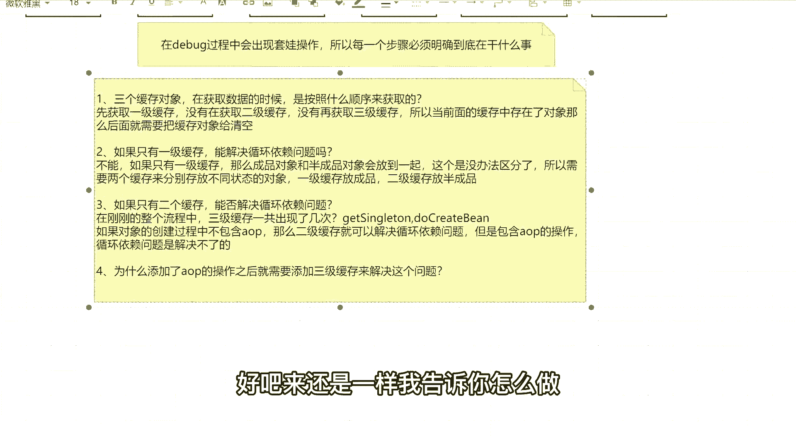

我们先试一下吧，我再把代码改回来啊，第一个把这个代码注释起来，我把上面解开，我们先看一下，当存在a op的时候，他能不能解决这个问题好吧，它解开，第二个我把这两个代码注释起来，我把它解开。

然后我们再重新测试一下，有机run看还会报错了好吧，结婚了给谁截胡了，好了有问题吗。

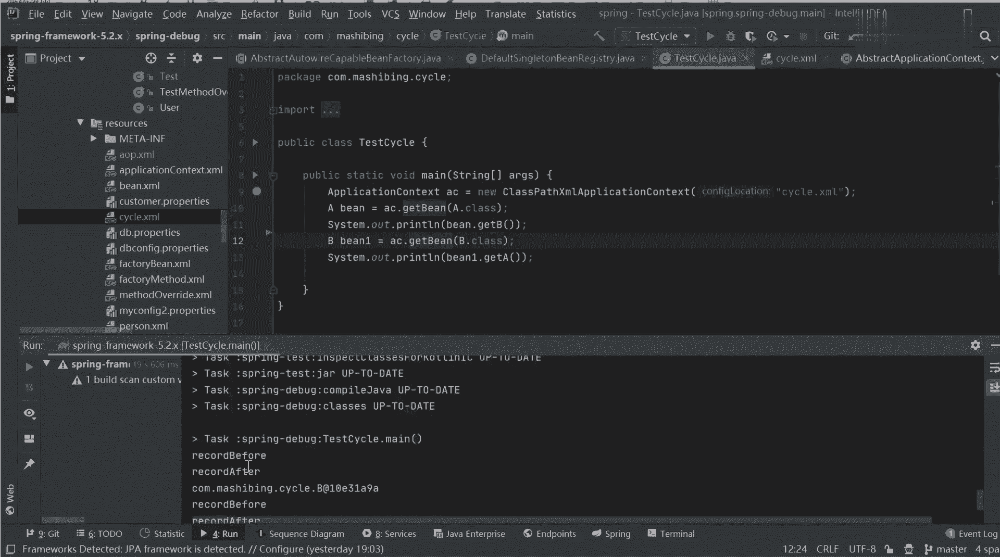

没问题吧，没搞错吧，就当我有了三级缓存之后，我a o p中存在侵权问题也可以解决了，这个时候很多同学能想明白到底是为什么，其实你在想为什么时候你就讲一件事，三级缓存它到底加了一个什么操作，三级缓存。

加了什么操作啊，同学们家长操作，创建代理对象不是，是不是只有一个添加，是一个get bean啊，get early，being reference，的方法还记得吗。

是不是只填了一个get ba的reference的方法，对不对，然后想搞明白这件事情，我想问一个问题，同学们在创建对象的来创建代理对象的时候，是否需要生成原始对象，需要还是不需要，需要吧。

有因为病的完整生命周期是这样的，我先创建出来原始对象之后，我再创建我们具体的一个代理对象，这个过程肯定是要的，对不对，那问题来了，当创建完成原始对象之后啊，后续又需要创建代理对象，代理对象。

那么对象在引用的时候应该使用哪一个，代理对象凭什么呀，换句话说就是一个宾name对应有两个对象啊，两个对象分别是原始对象和代理对象，那这个时候我在应用的时候，我怎么知道用哪个呀，凭什么你说代理的代理。

凭什么，你说原始有原始，凭什么程序是死的，它是不会像人一样，我去做一个智能的判断，说喂我刚才用代理了，诶，我感觉你延迟了，他没那么灵活，你想这件事怎么办怎么办，啊怎么办，缓存不是不是缓存在整个容器中。

有且仅能有一个同名的对象啊，当需要生成对象的时候，就要把代理对象覆盖原始对象，这句话能不能理解，覆盖吧，我是不是可以覆盖，我覆盖之后，我是不是就知道，是不是就可以指为对外暴露一个了，听懂理解吗。

啊来这句话能理解的扣个一，不理解的扣二，可以这么理解吧，你想嘛，我现在有一个代理对象，有一个原始对象，我原始对象是先创建的，带对象是后创建的，我在创建过程中，我是不是可以把我们的代理对象去覆盖掉。

原始对象，因为我覆盖之后就意味着我要对外暴露的时候，有且仅有一个对象，而不是两个对象都能对外暴露，能理解吗，就我不管我是否需要代理对象，我对象报告的时候，我只能有一个，我只能有一个。

但这个时候就又会又有另外的一个问题，什么问题，程序是怎么制造，在什么时候要进行代理对象的创建等等，所以怎么知道，我在进行这项复制的时候，我怎么知道我什么时候应该有这个东西呢。

所以这时候应该需要什么东西了，是不是需要一个类似于回调的接口判断，当需要第一次使用，第一次对外暴露使用的时候，来判断当前对象是否需要去创建代理对象，这样能理解吗，想想总结一下，想想。

当我第一次需要对外暴露使用的时候，我是不是可以判断对象是不是需要进行代理了，这个时候你再回想一下一件事，回想一下那个get early been reference，里面的那个if判断，这衣服判断。

还有东西吗，你想一下，你第三次在调用get in的时候，我是不是直接从三级缓存里面，我去我取出了我们的a b项，是从三句话里面取的，我是不是直接调用的是lambda表达式，里面的a对象。

能理解吗啊同学们想要这个想要这个过程，如果这个不理解，来我们看一下这个判断逻辑来找一下，完了电脑卡了，嘿嘿嘿，你们在吗，给我回个话好不好，没人说话了，来我们打开我们的代码，我们瞅一眼这个逻辑好吧。

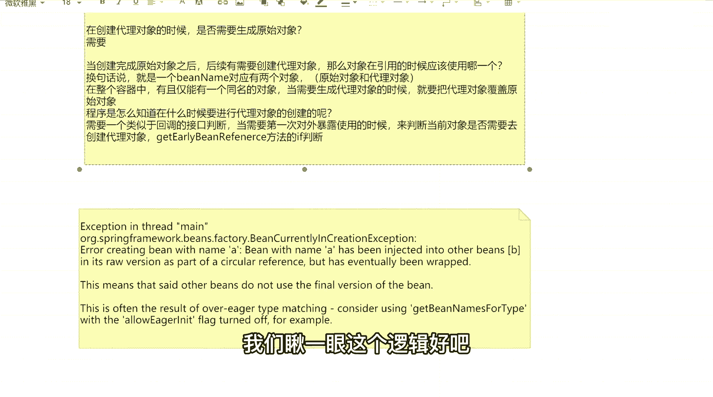

找到那个方法是在这里面。

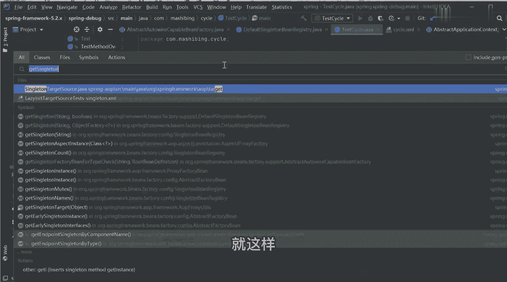

我们看一下这个get early be reference，点开点开之后我说了，中间这有一个if判断，在if判断里面，这个方法是可能去改变exposed object了。

那我们来看一下里面干什么事好不好，点开这个方法，找到它的实现子类只有一个吧，叫aboo abstract，auto corpse creator，你点进去，你再点开这个viper。

if necessary，你再点开下面的create property，你再点开里面的get policy，你再点开get policy，你再看实现类，你告诉我这里面干了什么事，什么事。

不就是创建代理对象吗，所以在刚刚这个方法里面，这个get early be reference这个方法里面，他干了什么事，就是用来判断，判断判怎么写，判断好吧，这个b在对外暴露，被其他对象引用的时候。

我到底暴露的是原始对象，还是暴露的是代理对象，但不管你是代理还是原始，我只能对外暴露一个。

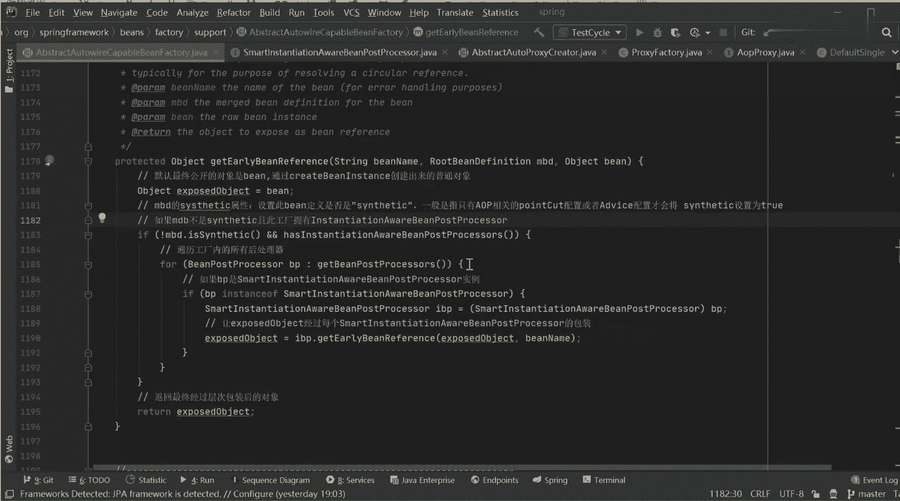

听明白了吗，是不是这个逻辑右判断，如果需要代理就返回代理对象，如果没有代理，就返回原始，对象吗，是不是逻辑来这块儿能听吗，同学扣个一，所以这就是为什么我需要三级缓存的意义，在这儿。

三级缓存里面他为什么不放一个object对象，他放一放一个object factory对象，就是为了里面放一个lam表达式，当我需要第一次对外暴露的时候，我要判断一下。

我暴露的对象到底是原始对象还是代理对象，而我对外报的时候，我就没法判断，所以我先放到三级缓存里面，每次在取的时候，我要遵循一个123的顺序，所以不管怎么找，我都会先找到三级缓存，三极管在正在使用的时候。

就会判断到底是原始还是在于，这就是三级缓存的核心，明白意思吗，啊这块我觉得你们下去之后，肯定是还要再悟一下，我肯定还是需要再琢磨一下的，你想明白我写的这一段话好吧，李弘扬说。

为什么生成带对象要先生成原始对象呢，这个这个问题我不解释了好吧，我不解释了好吧，这个这个太太太简单了好吧，来刚刚这段有点感觉，听的有点感觉，同学给老师扣个一，老师是三级缓存，是属于a o p的。

刚才您将从三级缓存会对象这块蒙圈了，注意一件事，同学们，spring是一个框架，跟业务无关，没办法预先感知，是否需要，代理对象，所以整体的执行流程，会把所有可能的情况都考虑进去。

因此在存储的时候先要三级缓存扔一份，明白意思吧，这就是为什么要把三角块扔一份原因，因为你用了拉表达式之后，它传递的是一个函数，你的方法并不会实际的执行，明白吗，当你具体调的时候，你才可以执行。

懂这意思吧，随时才是，这才是核心o直接把带变量发出这款方行不行，不行不行，没有没有没有没有这个逻辑好吧，注意啊，你要想把带流量放到二级缓存里面。

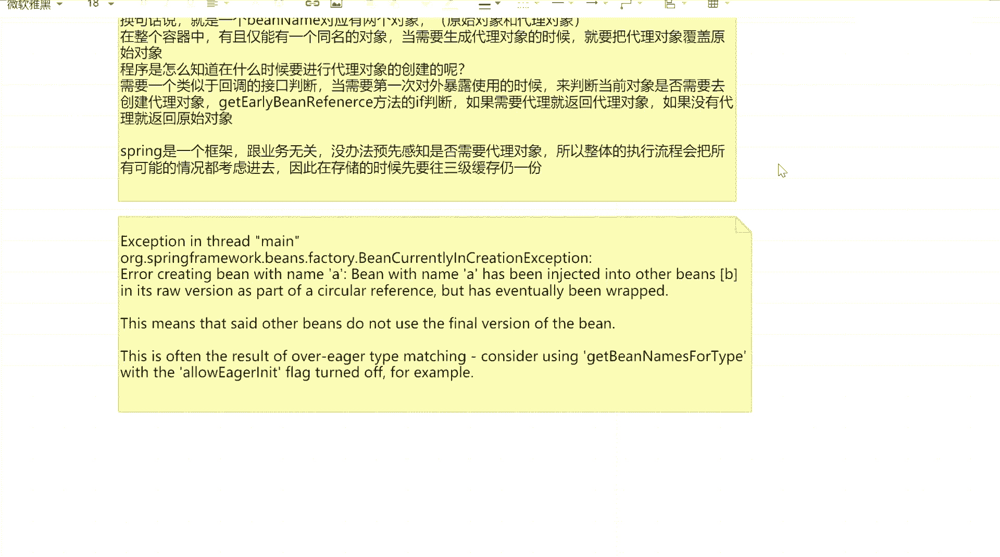

你要判断一件事干什么事，你下去之后可以带着我们a o p的代码，你重新把我刚刚那个流逻辑和那个流程。

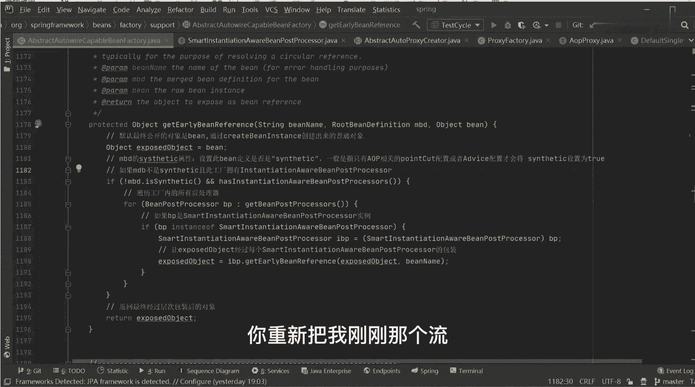

再整体的过一遍，过完之后你知道它到底行不行了，好吧，所以啊刚刚我写的这些东西，你要好好去琢磨一下，不是说我把这套逻辑捋清楚了，这东西就可以结束了，不是这样的，你要把它想明白，到底是因为啥。

他这样设计的好处到底是怎么样的，三级缓存放的是函数，怎么判断是不是代理，我说了三级缓存放的函数，你是不是代理，跟我没关系，但是我在获取对象的时候。

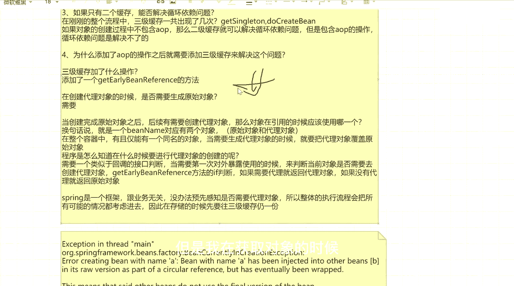

我是要进行判断的，刚刚那个if方法里面不就是判断吗，这一逻辑这一点会判断你是否需要进行代理，如果需要我会执行里面的东西，如果不需要我就不执行了嘛，明白意思吧啊所以把这个过程你要去想明白它。

它到底是怎么完成的，或者到底是怎么进行相关的一个操作的，好吧。

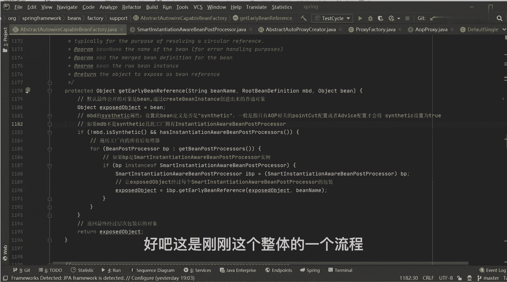

这是刚刚这个整体的一个流程好了，这东西我就聊这么多吧，为什么di注入的是原始对象，不是代理对象，你可以去看一下，你可以看一下di的逻辑吗，前面是你关注一下你，你把刚刚那个属性注入那个逻辑，你好好看一下。

你看一下这对象能否被注入进去，你试一下就知道了，好吧行了，别的东西啊，别的东西我们就不再聊了，所以我这节课，我重点讲的就是一个循环依赖问题，这种循环依赖问题很难吗，那我问一下他难吗，钢笔不错。

刚刚我改代码了，我把三级缓存给删掉，盖改成二级缓存了吗，只有二级缓存吗，我删了嘛，对不对，下方说这句话非常对啊，来看看下方说这句话，他说没有循环依赖的时候，创建的对象步骤应该放在填充属性之后。

初始化阶段创建代理对象，也就是说注意了，如果你有循环依赖，那么我会在get early been reference，里面进行代理对象创建，如果你没有循环依赖，那么这个时候我会在我们的bean。

post processor里面的after方法里面进行创建，它是两个环节，他互不干扰，明白意思吗，好spring它只是提供了一种机制，说我可以在一定程度上，解决你们的循环依赖问题。

但是你的循环依赖问题，我一定百分之百能解决掉吗，1388457同学，能面试逻辑吗，我只是说我有这样一种预防机制，它能预防一部分的错误，但不能预防全部的错误，懂了吗，所以你在写程序的时候。

有些情况下你还是会出现循环依赖的问题的，这时候你要找一下，你循环依赖是因为什么产生的，明白吗，需要什么产生的，然后你怎么继续解决当前这样的一个问题，那最简单的spring boot。

你在引用我们对应的那个叫什么那个data source，数据源的时候，是不是也会出现这样的问题，对不对，这个很正常好吧，他只能说我在一定程忘记，我不能说全部都解决掉，所以这个这个解决不了了。

所以他还问了，也就是说你这样的一个设计思想，他到底是干啥使的好吧，为什么网上看到三级缓存和二级缓存，可以互换的，从哪看的，把帖子发给我，我没见过怎么互换，换不了，好吧行了，这东西啊。

咱们大概就聊这么多吧，我呢花了一个半一个一小时。

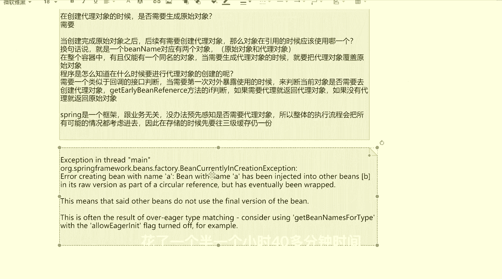

40多分钟时间给大家讲解一下，循环依赖相关的问题，我觉得我讲的够明白了。

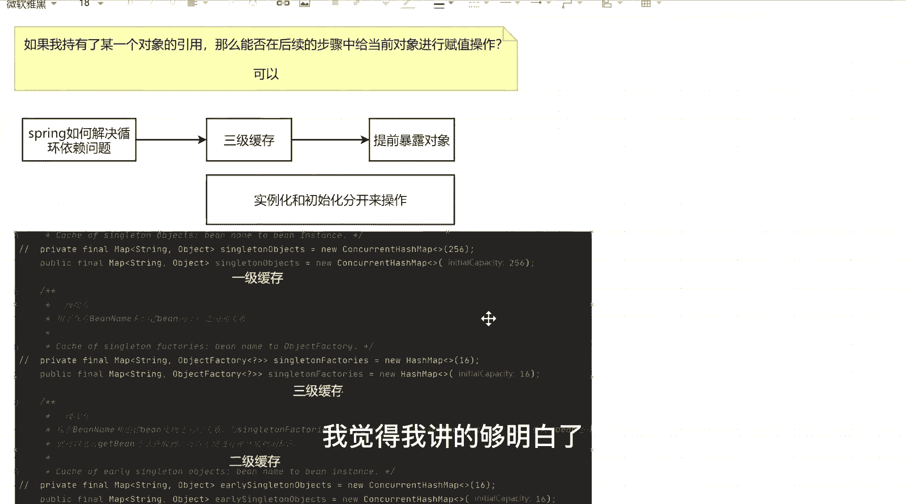

如果谁不清楚下去之后，你还是要把刚刚那个流程再整体去过一下，同学们记住了，我只能给你阐述思想，这个东西，你别指望说我一我我我讲一遍你就听懂了，如果我真的讲一遍，你就听懂了，那这东西也显得太容易了。

太简单了，它没那么容易，没那么简单，所以最关键和最核心的点在什么地方，你先听一个，大概有了整体的一个思路，当有了这个思路之后，你自己再去debug，再去过流程，再去捋，这个时候你的印象是非常深刻的。

而不是说你作为一个初学者，我压根儿没听过的一个状态，我就学这玩意儿，如果你是一个初学者，压根没学过两状态，一天的话肯定很难受，肯定很难受，明白意思吗好吧，所以把这个过程想清楚了，大叔能回答我的问题。

啥问题，刚才如果不加a o p的话，是不是就不会出现在对象了，直接选上，那肯定啊，你没有op的话，你串代象干嘛没意义了，6p本身就是因为加了一个代代理对象吗。

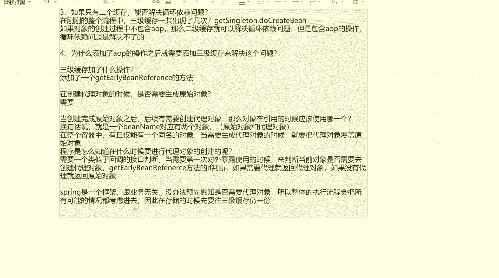