# 马士兵教育MCA架构师课程 - P6：三色标记算法 - 马士兵学堂 - BV1RY4y1Q7DL

但是算完我就讲一遍，你听不懂就听，听不懂就算了，可以吗，嗯好听，我说呃，刚才我说过这个三色标记算法，三色标记呢是找到那个漏标的常用的解决方案，这个三色标记算法什么样的呢，三色标记首先第一点啊。

就是我们刚才说这个标记标记是个啥呀，标记就是说这是我们的对象数格式，对象对象数它有一个引用会指向别的对象，指向一个list，这个list里面又有引用指向别的对象，质量比对象。

这个对象里面有引用指向别的对象好，就这么顺着找下来，这个叫叫做搜索，并且标记，那好这么找下来的时候，我们会把找到过的对象和标记了一半的对象，和已经确定这哥们儿是一个什么样的，一个确定好了的对象，用颜色。

当然这个颜色是一个逻辑概念，并不是说真正的把它染黑了，也不是说给他一个属性叫做black，no是一个逻辑概念，这个是什么意思呢，就是凡是标记完成的，自己已经标记完了，哎。

这哥们儿已经已经已经已经过滤过一遍了，它的成员变量也已经过滤过一遍了，这种叫黑色，这哥们儿已经访问到了，但是它的成员变量还没有进行便利，这种叫灰色叫gray，那么还没有遍历到的这种节点叫白色。

所以黑灰白的概念就是这么来的，好，你先那什么一下啊，ok你先你先你先稍微消化一下，我再说一遍，凡是访问到这个节点了，并且访问到这个节点的成员变量了，它的成员变量也都访问到了，好，这个时候这个叫黑色。

访问到这个节点，它成员变量指向的对象还没有来得及访问好，这个时候叫做灰色没有被访问到的节点，白色节点什么概念，就是对象，就是对象，科技续吗，科技去给老师扣也来，那么同学们你们要仔细考虑。

就是在什么情况下会产生错标，第一种情况就是，在我的垃圾回收器回收的过程之中，你会发现有一个什么线，有可能会反成什么现象呢，就是一个灰色对象指向白色对象的引用消失了，那这时候会产生什么。

本来你要顺着它的成员变量，能够找到这个对象的，你突然间发现你找不着他了，你扫描不到他了，好各位同学告诉我，这时候会产生的后果是什么，你垃圾回收器在工作的过程之中，垃圾回收机在工作。

本来你应该去扫描到这个地道，可是找不着它了，因为没有任何一种指向它了，它变成啥了，变成垃圾了，对不对，变成垃圾了，那这时候怎么办，他就不会被回收嘛，这他就会被回收，对不对，所以说这个无所谓的事情。

唉这种呢叫做浮动垃圾，有同学说，老师他这次整个我们这次的回收没有把它标记，找没找着他浮动垃圾没关系，下一次在访问的时候发现哦，这访问不到了，那就可以把它当成垃圾了，所以这个就无所谓啊。

就是回收是哪些回收找不到的，这种叫floating garbage，叫浮动垃圾，那这种情况下叫没关系，无所谓的事情好，但是最严重的是这样一种情况，注意看仔细看，b灰色对象指向白色对象的也消失了。

在你工作过程中，与此同时，黑色的对象产生了一个指向白色对象的引用，再看一遍嗯，我们的垃圾回收进行线程，跟我们的工作线程正在进行，垃圾回收线程还没有标记到d的时候，b指向d的已经消失了，找不着它了。

与此同时产生了一个a指向d的内容，a指向d的应用，那这时候会产生什么，站在垃圾回收的角度，垃圾回收器的角度，你会发现，这哥们儿本来被垃圾回收器当成垃圾了，可是事实上他不是垃圾，并且我已经遍历不到他了。

我已经搜索不到他了，我顺着歌已经找不到它了，为什么会找不到，因为黑色对象在我看来他已经标记完了，我不会再找他的成员成员孩子再找一遍，而与此同时，这灰色对象指向他的眼睛又没了，大哥，你说我还怎么找到他。

我找不到它就会产生一个什么现象，我会把它当成垃圾给它干掉，可是能干掉吗，不可以，这个就叫做错标，没懂，没懂就算了，怎么可能会发生，怎么不可能会发生啊，你引用变来变去啊，你这个引用b的引用指向空值吗。

a的引用指向他了不就完了吗，然后你在运行过程中，这个小b等于空了，a里面有个小小，a本来指向没有，没有指向任何东西，后来把它指向d了，不就指向了这几句话不就搞定了，这个很难想象吗，嗯为什么会在这里卡。

懂了吗，还有还有没懂的没有，对啊，你的工作线程在继续啊，你的垃圾回收线程也在继续啊，ok，那现在的问题是怎么解决这种落标的问题，怎么解决这种错标的问题，好吧，来你们想想看解决方案，这种叫错表啊。

好c m s解决方案，我们先说cm解决方案，c msg的方案是什么，cmsg的方案叫做incremental update，incremental update，增量更新，什么意思呢。

就是cmc解决方案是这样的，灰色对象指向d的引用不是没了吗，嗯黑色对象指向体内产生了一个指向，指向白色对象的引用，好这时候怎么办呢，这时候把a变成灰色就可以了，把a变成灰色，就代表着我下一次标记的时候。

在下一个标记过程之中，我会对它进行重新扫描，我就能找到这个d了，就不会漏掉它了，就不会产生漏标了，好，标记就是访问到了，标记就是啥意思，标记就是访问到啊，听懂这意思了吗，什么时候变成灰色，听我说。

这里面呢，实际上是涉及到一个叫做写屏障的概念啊，写屏障号主要讲起来就没没没完了，叫rberry a，就是你每一次的这种引用的变动，实际上它都要跟踪跟踪的过程之中，然后对它进行修改好吧。

发现新的就把根治为回，我什么时候说这是根啊，大哥，不是黑的，不跟踪过来，对啊，你把它变成灰的，下一次访问它已经不是黑的了，你不是要跟踪了吗，颜色是用什么标记内存一位吗，你可以这么认，为。

一位是标记不了的，得两位，我想辞职给你当老师去了，咋整来呗，你看我讲这么半天，还有人没听明白，你一讲肯定大家都听明白了，好还有谁吗，还有没有谁有疑问的，这个事儿很难理解吗，总而言之，它采用了一种方案。

就是当产生这种错标或者漏标的时候，把这个a变成灰色的，好，你这个要理解不了，我下一个就没法给你讲了已经，所以我就是不爱不爱给大家，在公开课上讲算法的原因，因为这算法是需要抠的，好好理解。

怎么知道d错标了，知道d坐标需要你跟踪，叫right barrier，你看你看阿格里，阿格里又催着赶紧实战了，这就叫叫什么叫叫很难满足所有人，对不对嗯，好吧你看你看你看实战实战是吧，好那那那还讲吗。

算法还继续讲吗，算法继续讲的，给老师扣一，你听实战的扣二，来继续讲吧讲吧讲完一半人半途而废，也不是老师的半途而废，也也也也也也不是老师的风格，好吧嗯，来听我说，所以你把它变成灰色就可以。

ok那这个变灰色的过程呢实际上叫rberry啊，听不懂听不懂，错过听，使劲听听听就懂了啊，那我看这里，我靠我要跟你讲这个你就更理解不了了，你刚才都没理解，这个就更难理解了，这是c m s的bug。

cm s increment add，有一个非常隐秘的问题，就是并发标记产生漏标，这是什么意思呢，你那个由于它是有多个啊，多个垃圾回收线程，比方说两个m1 m2 这m2 ，然后m一正在标记a的时候。

正在标记这个a已经标记完属性一了，正在标记属性二，那么m一在m一看来a是灰色的，然后这时候有另外一个线程，把那个属性一指向白色对象，把这个属性一指向白色的，然后m3 这个垃圾回收线程把a标成灰色的好。

它它标成灰色的了，然后m2 注意啊是还是m一啊，m一认为所有属性已经标完，又把a设成灰色了，所以他经历了中间一个黑灰，这种多个垃圾回收线程之间，有可能会产生的隐性的漏标问题，我们去这点有点累了啊。

下次你还是没有便利到，哈哈好吧，这个能理解的就理解，理解不了就算了，看一下啊，我再重新说一遍，b指向d的也消失了，a里面有一个成员变量一指向他了，这时候呢一个垃圾回收线程正在标记a。

然后正在这个过程之中，这个业务逻辑线程把一已经指向白色对象了，然后另外一个垃圾回收线程一看，你原来是个这个这个把它变成灰色的了吗，把你变成灰色的了，因为你你你原来是黑色的。

但是中间你产生了一指向了一个新的，这个要把你变成灰色，可是这个时候另外一个垃圾回收线程，认为所有属性已经标完了，这个二他已经标完了，标完的过程之中，把a直接给设成黑色了，那完蛋了，结果地位漏标了。

我跟你说，所以cm s remark阶段叫做必须从头到尾扫描一遍，但这个问题一般面试官没什么啊，所以你没听懂就没听懂好吧，我们刚才稍微回过一下，就是这个c m s啊，咱们不是有这么多个呃阶段了。

你看啊这是cf 4主要阶段初始标记，并发标记，重新标记好，就在这个阶段，实际上他要从头到尾的再标记一遍好吧，但是由于他前面已经排列的比较好了，所以这个呢实际上也不是想象中的那么长。

但是这个sw有可能会非常长，这是他的算法设计上的bug毛病，所以这是避免不了的，因此cms你要想依赖它产生那种的非常老了，就是非常非常低的响应，我跟你说不太靠谱，这个你能听懂就听，没听懂就算了，好吧嗯。

总而言之，言而总之这是cms的bug，另外cm还有一bug啊，我讲给大家听，cs还有一bug是什么，还有一bug是在这，当cms撑不下的时候，来看这张图呃，这张图里面呢有一个非常隐蔽的一条线。

这条线在这c m s居然和sia serial old连在一起，啥意思呢，就是cm s一旦产生了满了它，这是它内存，注意cm叫什么叫mark sweep啊，大哥叫标记清除啊，标记清除最大的毛病是什么。

碎片吗，会产生一个一个的碎片，碎片占满了之后，有可能你心生成的对象，你在里边，你说我想占块空间，不好意思，站不下了，一旦站不下，我是不是得触发fdc，触发f g c会什么样的。

叫concurrent mode，肥良这种叫升级上来的对象，站不下了，站不下，会产生一种什么现象啊，他居然干了这么一件事儿，所有的县城都给我停，全都给我停止，派一个人serial。

派他一个人在那里默默的把所有的都清理一遍，就是这么的牛叉，当然这个清理过程是进行压缩的，好同学们，你们想想，这个会产生严重到什么样的一个后果呢，我有一个学生，他们在线上遇到过卡一天以上。

24小时以上的情况，就是因为产生了这个现象，就是这么个牛叉啊，所以你不要认为说人家那个游戏服务器啊，隔一段时间重启它就不是一种很好的方案，那不一定的啊，不影响不影响运营，不影响赚钱好吧。

为啥要变成单线程，我哪知道我哪知道他就是单线程的，用java写游戏服务器吗，这不废话吗，目前90%的加服务器是java写的好吗，当然现在有一些go语言，会慢慢的替替代一些了啊，为啥不用并行。

我哪知道人家不用，我哪知道你去问设计者，去，所以这种解决方案呢是呃有缺陷的好吧，所以cm increment update这种解决方案是有缺陷的啊，所以g one采用的解决方案是啥。

g one采用的方案叫做s a t v叫natural at the beginning，总而言之呢，其实一个是解决从这下手，一个是从这儿下手，刚才我们分析过，从这下手是有有有有呃，这个这个有bug的。

所以呢我们其实还可以从这下手，你不是消失了吗，你消失的时候，我给你记录一下，这是啥意思呢，就是当灰色引用，灰色的对象指向白色的引用消失的时候，把这个引用给记录下来。

所以这个snapchat the beginning指的是什么，就在起始的时候做个快照，当b和d的引用消失时，要把这个引用推到js的v站，这啥意思，其实就是在某一个站里面，记录着这些引消失的引用。

然后等我下一次要再进行扫描的时候，最终要进行一次扫描的时候，最终的最终的标记好，这个扫描的时候，我会把里面的引用单独拿出来，看到这个引用指向的这个对象目前是不是垃圾，如果是垃圾，我才能干掉。

如果不是垃圾就不干了，stand，snapchat the beginning，当然这里面的细节也会特别多，配合snatural at the beginning g one。

采用的方案叫做result set，sorry，叫做叫做rs这样的解决方案，它是在分析一个一个不同region，好，这个细节太多了，今天我们就来大大概大概大概算法就聊到这里，好吧。

卡表卡表是另外的东西啊，你别跟着混在一起，car table是老年代指向年轻代的引用，记在卡表里面，而rs叫做remembered set，是谁指向了我，而不是我指向了谁，好复杂呀，对算法就是这么复杂。

但是就就讲到这吧，算法我们就聊到这儿啊，给大家开个头，你们要是想了解更细的细节，报课听老师讲，或者你们自己琢磨去，开玩笑啊，好好那全懂了，说英语没听懂，然后我们开始聊这个实战啊。

我们实战的小优呢呃调优这件事啊，听我说它是包含很多很多的概念，ok其实呃调优啊，一般什么叫调优呢，其实在我看来它包括三种方式，就是三种三种不同的操作都都叫调优，第一种调优是根据需求进行。

这般的规划和预调优，这是什么意思，就是我要用多少内存，我要用什么样的cpu，我进行什么样的选型，怎么进行内存的划分好，这是需求进行预调，有的这一步也非常重要，你把这步做好了的话，你后面能省好多事。

那么第二种呢是你在运行环境之中，你有一个程序跑着跑着，他跑的越来越慢，或者产生卡顿好这样的情况，你怎么定位它，问题出在哪，问题你到底出在哪，以及我怎么对它进行调用调制，第二。

那么第三种也是在面试中问的最多的是这种，第三种就是说这三个运行中出现的各种问题，最常见的问题叫om叫out of mary error，o o m叫out of memory，内存耗尽，嗯时间关系呢。

我要教大家调优的话得得从哪开始玩啊，得从最基本的开始玩好吧，我先教大家呢最基本的你怎么样，就是使用命令行啊，认识一下最基本的命令行好吧，k。

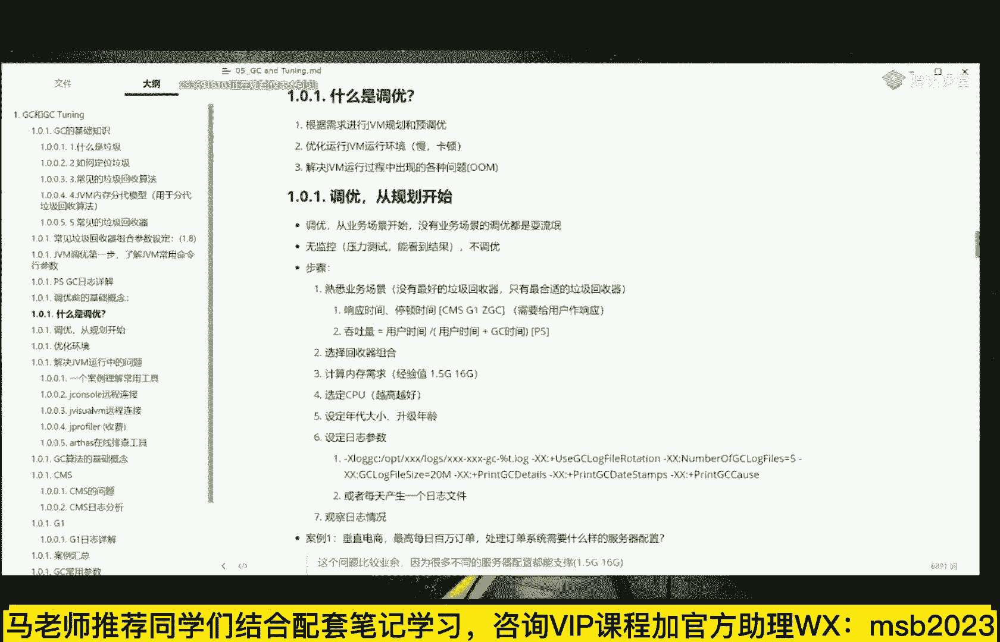

在linux上啊，你说你在windows上进行了调优，会让别人笑掉大牙，我有过jpm调优经验。

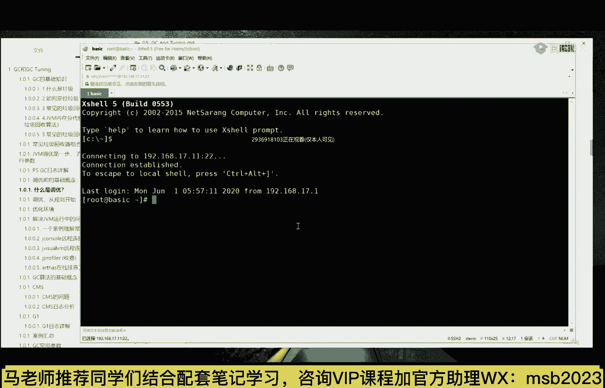

是在我们的windows一台服务器上，面试官一个大嘴巴子抽上来，滚出门，右转啊，肯定是不对的，好我先教大家一些最基本的一些呃java命令呃，第一个java命令呢，启虚拟机观察它的参数啊。

jumon version，这是它的参数是吧，clear是吧，没调音，你敢写吗。

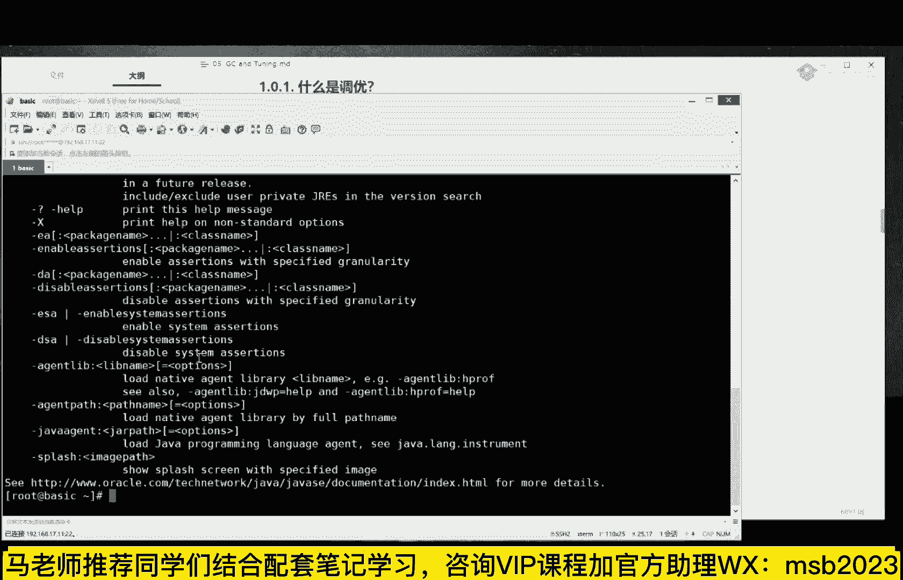

当然敢写了，老师是谁，老师这么贴心的人，没调音经验，我帮你总结了12345678 90 11。

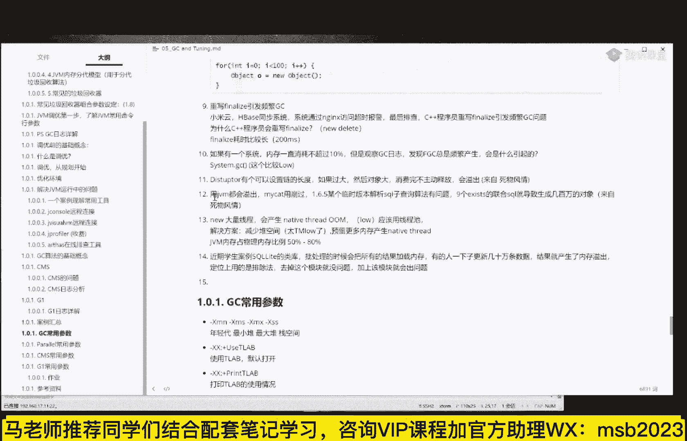

20 30 45，其实已经20多个案例了，你只要挑个案例哎。

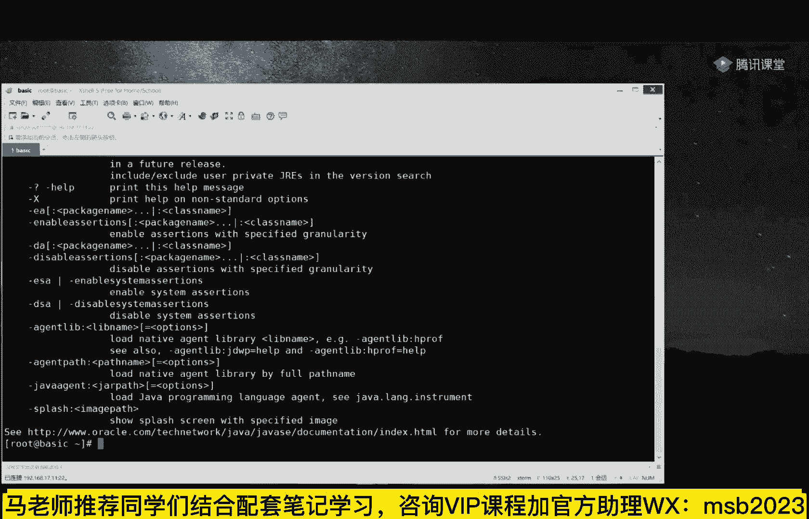

就说实际当中是这么遇到过的，不就ok了吗，一般gmp导出大哥，你小p公司可以这么干。

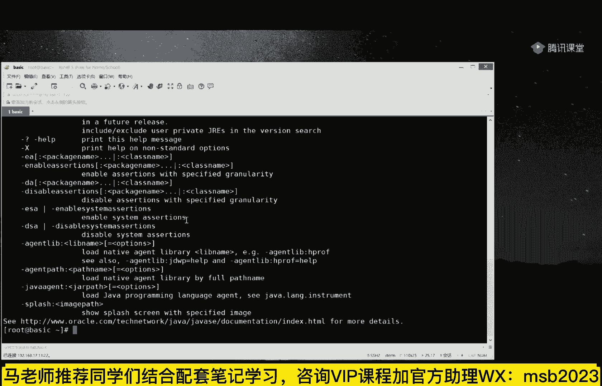

你这是要你这是造假呀，我没有造假，是你造假好吗，大哥，我啥时候造假了，我给你讲课而已。

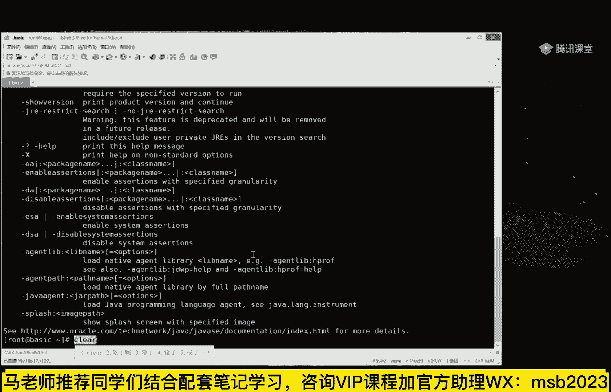

看这里啊，那个先叫大家一点，最基本的这个这个这个嗯，最基本的这些个命令行啊，该怎么操作，大家听我说啊，假如我们要起个jv拟机的话，你直接敲java就可以对吧。

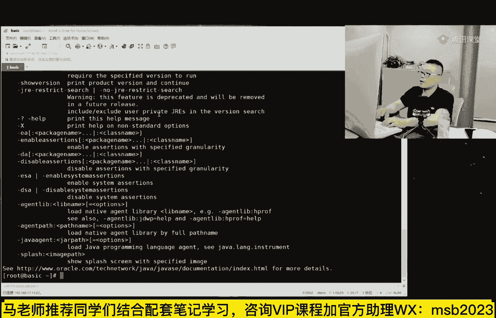

然后你敲到jv后呢，你会看到呃参数呢是进行各种各样的分类的。

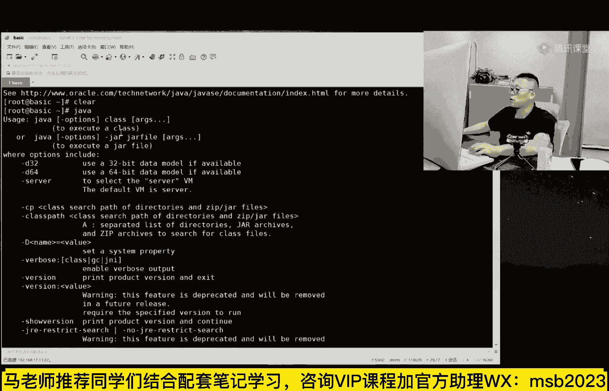

这个参数是什么样的呢，比如说以横杠开头的，这个大家都应该都遇到过什么杠cp啊，杠version啊，更roversion啊等等等，这些个都叫做标准参数，叫做标准参数。

叫standard and option，好看，这里比方说你经常使用的java version。

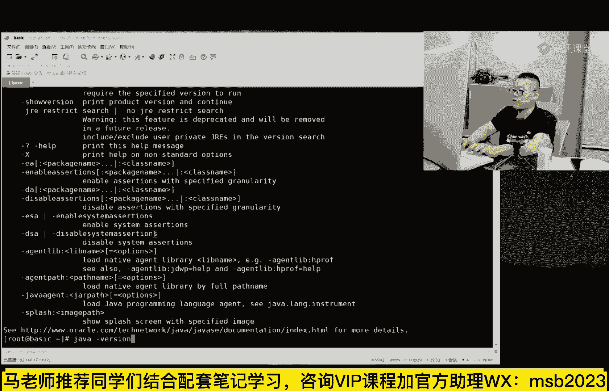

他就会把你嗯版本号给你给显示出来，那当然这其中有一项比较特殊的，这个叫非标参数，看到了吗，叫print help on non standard，非标options，非标参数，java杠x。

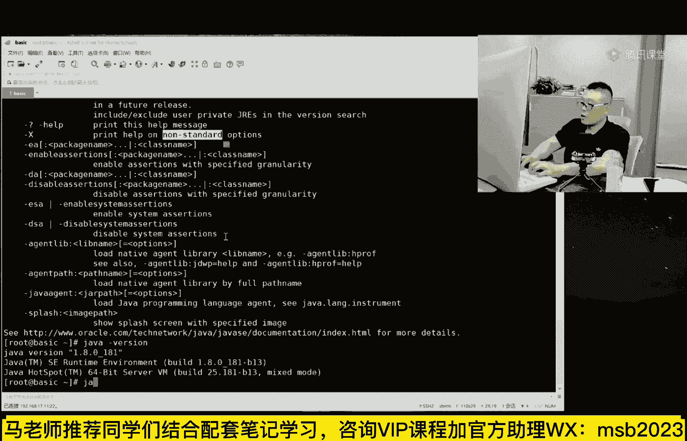

还有这叫非标参数，非标参数有这么多，我在vip里讲过，像什么mix啊，呃interpreter啊等等，像还有像比较常用的有一些啊，比如说log gc啊，这个这个是你在生产环境里头必须要配的。

xm s最小堆，xm x最大堆栈大小xx啊等等，但其实你看上去参数没那么多，但其实参数最多的是他没有写出来的这个，我在最开始的时候不是给大家讲过这个杠，xx什么print。

princeline flags等等这个参数吧，呃这里面参数非常多啊，而且呢没有一个特别详细的文档，如果你要看到杠x x开头的所有的参数，你采用这样的一个方案。

叫做当xx加print flag final，当然其实还有一些，像那个你如果要自己编译一个java虚拟机的话，我们黄老师不给大家讲那个hosport的源码吗，他需要编译一个这个虚拟机。

这里面还有一些参数，可以说布莱克呢这个有点就有点太那啥了啊，太细了，我们先不管他老板说这是什么意思呢，它会把这个所有的参数，杠xx开头的全都给你列出来，最终的值全给你列出来，数量非常多。

比方说这是a开头的，alliance level，alliance lecture啊，always prettouch等等一堆，像b开头的也是一堆是吧，best locking，这叫偏向锁吗。

我讲所升级的时候讲过这个概念，嗯这是那个对输出的，我的j j m的那个version的感觉啊，这不管继续啊，cc开头的cm看到了吗，这是和cm相关的，有可能你需要设置的这些个参数，cm参数相当多啊。

cm s的，cm s的。

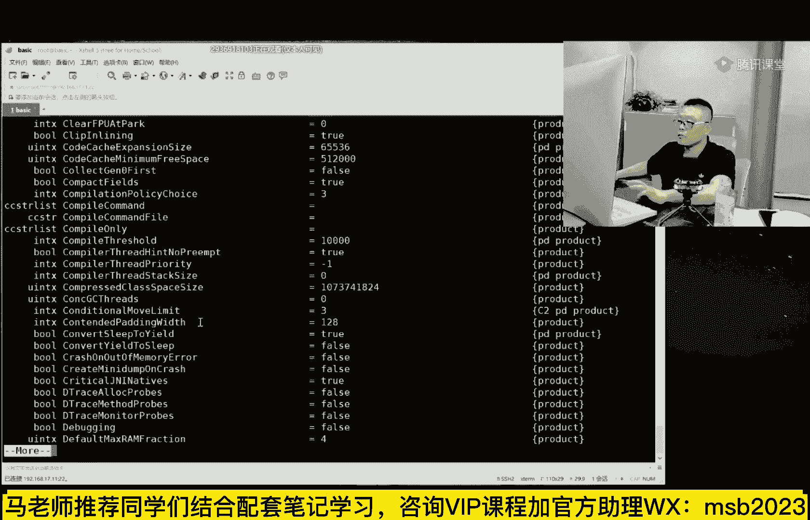

谁来了谁来了啊，ok结束了嗯。

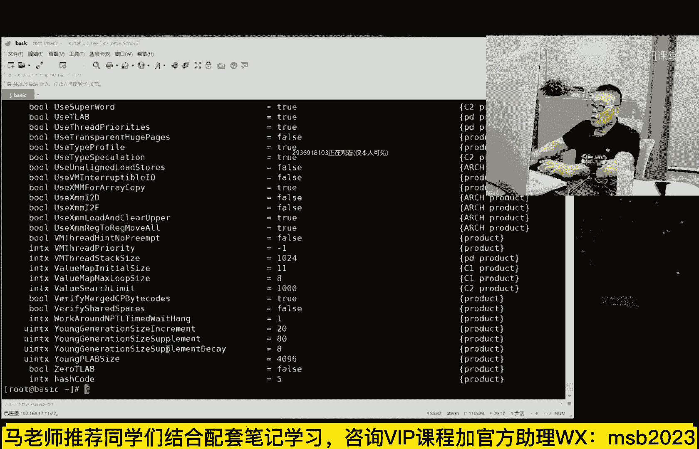

呃一共大概呃700 700个左右。

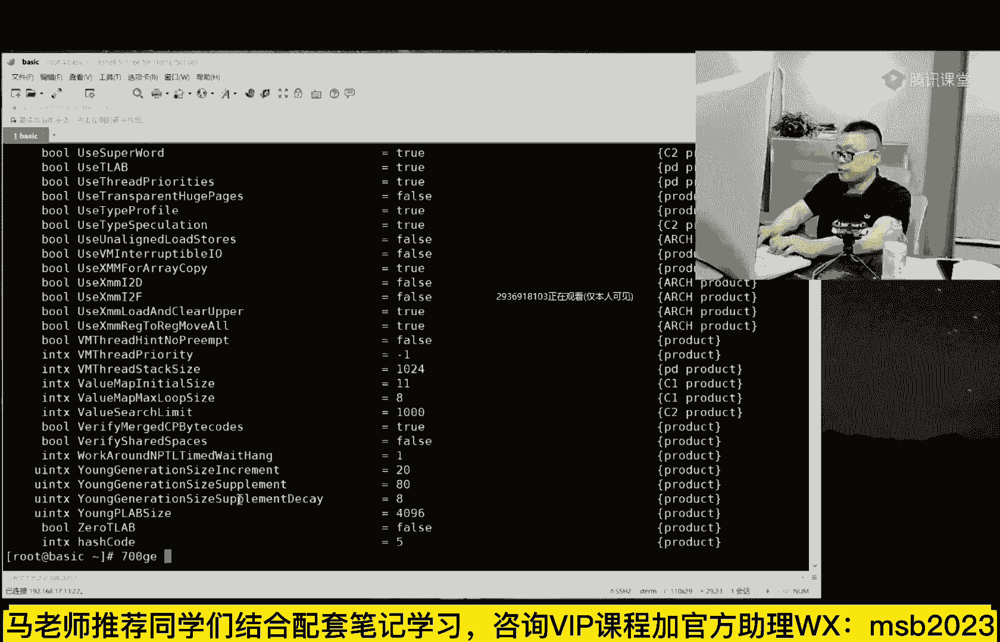

大概700个左右的参数，所以你们现在是不是理解了，那个jvm调优为什么值钱了，就是你你你只要在你的简历上写，说我有过jvm调优经验，ok面试官马上高看你一眼，ok当然真的有700个参数需要设置吗，no。

你只需要掌握老师给你列举的，jc的常用参数就可以了，比如说不管什么gc你都可以设这些，就是打开不打开t r a b啊等等，它的大小怎么打开dc dc的一些详细的内容等等。

而如果你用parallel常用的参数有哪些，如果你用cms常用的参数有哪些，如果你用g one常用的参数有哪些啊，当然cdc呢大家伙现在用的还非常少，所以现在没给大家总结出来好吧，所以没关系啊。

虽然你看上去很恐怖。

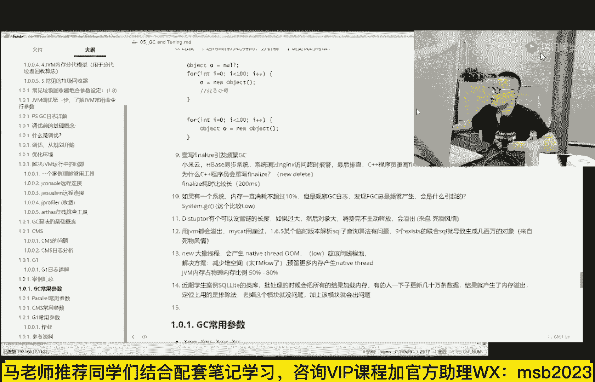

不过老师你总结完你就没那么多恐怖的地儿了。

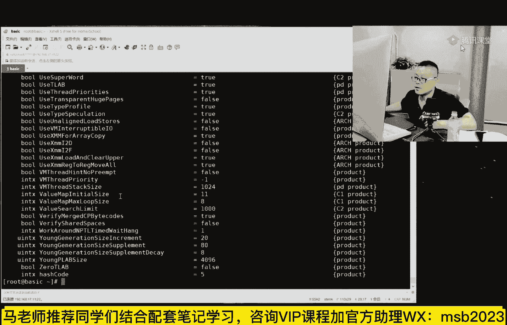

好吧。

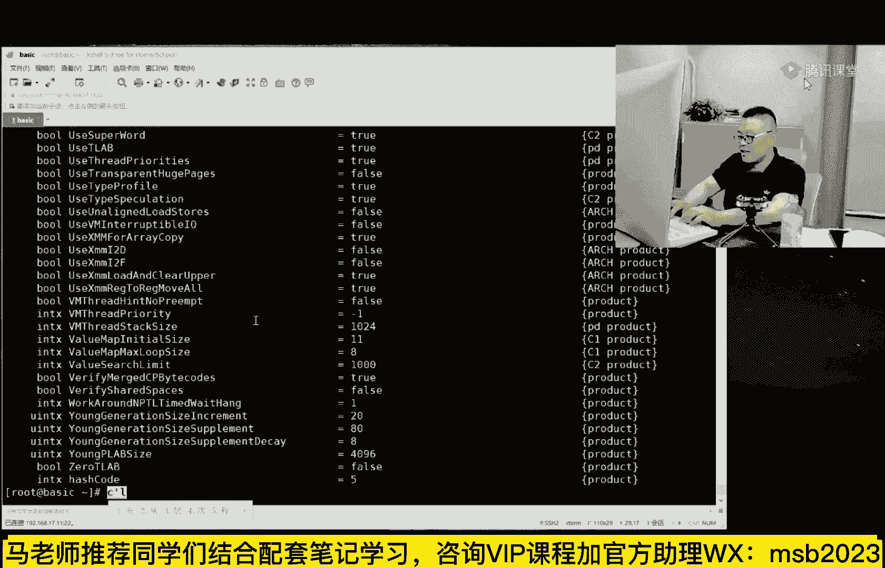

好，这个文档会发吗，会会会会，明天明天啊，明天发到每个人手里好不好，参数就别讲了吧，对不讲了，参数我要讲起来的话，每个参数都给你讲一遍，没完了啊，也没意思好吧，骗人看完更加恐怖了。

参数那个那个有好多常用的，你你想着有那么一参数，知道去哪查就完了好吧嗯，十，老师其实今天晚上来的可能是已经报名了个vip，因为今天晚上周日请假了，what招式跟跟谁也想家了，下面我们来举例子啊。

根据一个实例，然后来聊一聊真正的这种，在实际当中遇到问题之后，你怎么去定位啊，比如说面试官最喜欢最常用的说呃，我的cpu如果是百分百，这个时候你怎么去定位呃，我频繁f g c3 秒一次啊，你怎么去定位。

是不是嗯，那这时候怎么办呢，先教大家几个最基本的好不好，几个最基本的命令，比如说我们要起一个程序的时候，看这里。

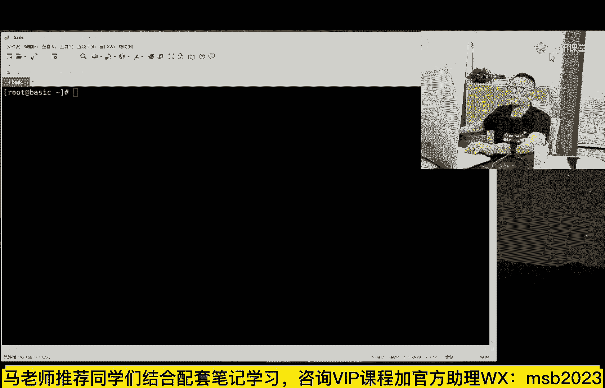

在我程序里头呢给了一个小小的案例啊，这个案例呢是有bug的，但是我不知道你bug在哪，就这个小程序。

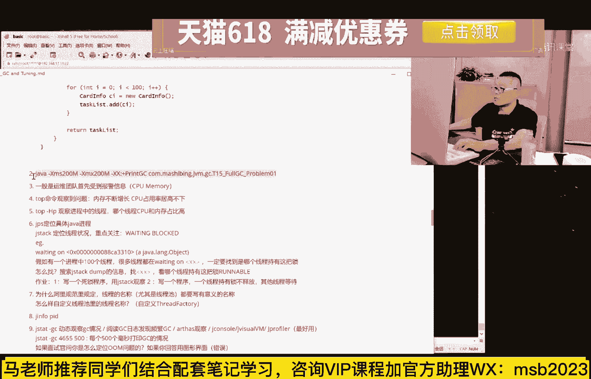

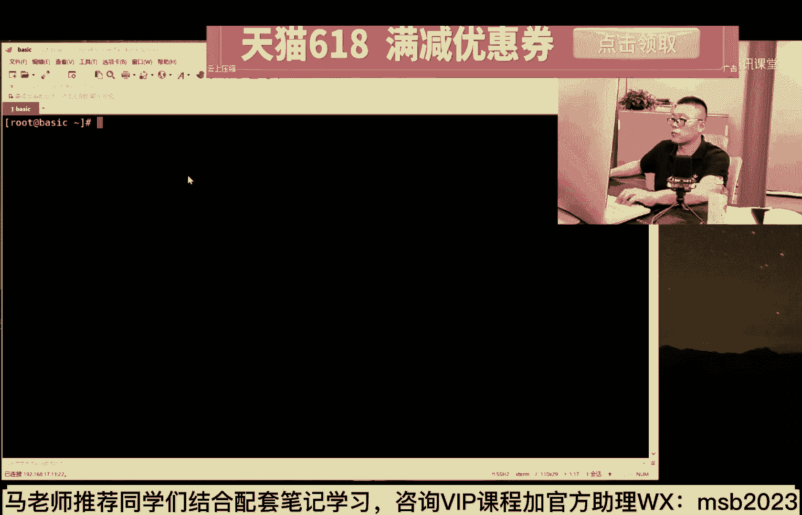

我们跑一下内存设的稍微小一点点啊，20兆不知道哦，我们来看这个参数，大家能不能看懂啊，java启动一个java程序，这个程序是这个程序呃，fdc problem，那然后呢最小堆设最小堆是20。

最大对是20来，同学们告诉我，为什么我把最小堆和最大堆设成一样，一般来说这是我们整个的内存呃，我如果想jvm让他用最大用到这，但是我可以比较开始的时候，我让他只用这么一点，不够使了再扩大。

不够使了再扩大，为什么我在这里我会把最大最小生成一样，为什么y，防止抖动没错，我有一个学生，我看还能找出他聊天记录吗，这聊天记录啊，忘了是qq上还是还是还是微信上了。

他就说老师我那个是我我们那个服务器啊，就特别搞笑，我说怎么搞笑了，他有的时候是只有只占1g内存的时候，它就产生了负dc，有的时候是2g会产生负率c，而且还特别有规律，只要占到3g马上就回到1g。

查了两天没查出来，我说大哥你你查一下你这个xm x跟x mx的值，他发现x m x一级x mx 3 g好吧，知道问题之所在了吗，它会弹来弹去弹来弹去抖动，就是如果他一级不够使了，它会往上弹，弹到两级。

两级不够使了，弹弹到3g有一些时间它是需要花在扩容上的，而且3g完了之后，整个内存清掉了之后，遗迹又够使了，他不是他又回到一级，他又往回缩，所以呢在你一个应用程序里头。

如果你确定我的java程序它占有非常主导的位置，他确定这些内存都给他使，那你就不要让它抖动，最大最小射程一样的，不要让cpu宝贵的资源浪费在这些地方，好你不知道我说清楚没有谈就谈呗，有啥影响。

浪费资源啊，你本来宝贵的资源，你不应该给客户服务吗，大帅说声音有点小，鲁尼大帅，你确定不是你功放放的声音有点小，好嘞好嘞好嘞好嘞，ok，呃这个程序呢你跑它就会运行，print c呢是打印一些gc的信息。

由于大家伙基础的关系啊，这个jc的那个日志什么的，我就暂时先给你略过，因为细节太多了，嗯在讲的时候我讲到了会会讲给你听好，你可以看到这个小程序会有一些毛病好吧，小程序会有毛病，读一下看能不能读懂。

它会不断的产生dc，那么这个小程序我们怎么去定位这个小程序呢，我我里边这么多java程序，我这个程序是哪个呢，我怎么找到它呢，叫一些常见的命令，第一个呢叫gps，gps，叫java process。

就是我当前整个系统里头跑着的，那些个java的进程号，1246，这就是我们那个正进程，第二个命令呢叫j inf 1246，这info的意思就是1246，这个进程关于java的一些信息，你打印出来。

他会帮你，你自己去读就行了啊，自己做个实验去读一读，他会帮你你当前的这个java程序呃。

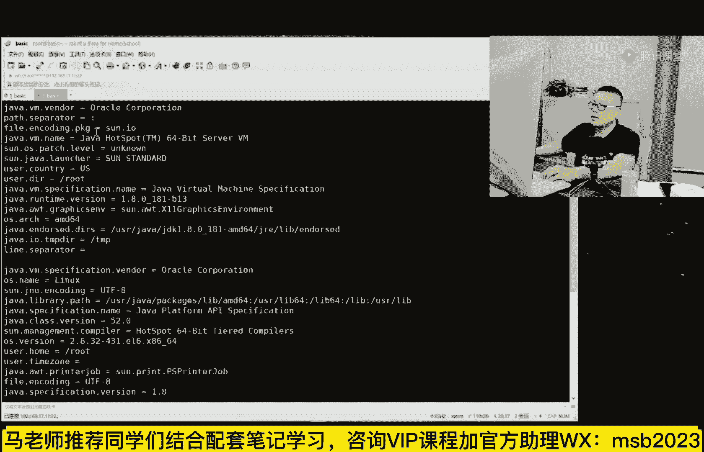

运行的一些个参数，一些默认的一些属性全新打印出来嗯，你的java home用的是哪个啊，你要是不知道你跑的是哪个哪个版本，java程序是在哪哪地方装着的，真infer就可以了，还有一些个呢，你比方说。

这次内杠gc 5或者1246，这是啥意思呢，它会把整个gc的内存空间的部分的内容。

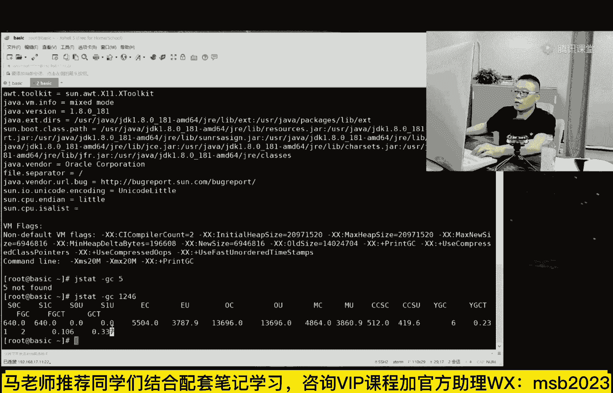

给你打印出来，当然这个看上去就非常的别扭，什么是ec eu啊等等等等等，这个看上去是非常非常的不不友好，呃，明天吧明天我教大家比较友好的好吧，比较友好的观察内存的方法，嗯比如说呢还有一些常见的命令。

jdk，jdk是什么意思啊，1246回车它能关成什么，jdg clear一下。

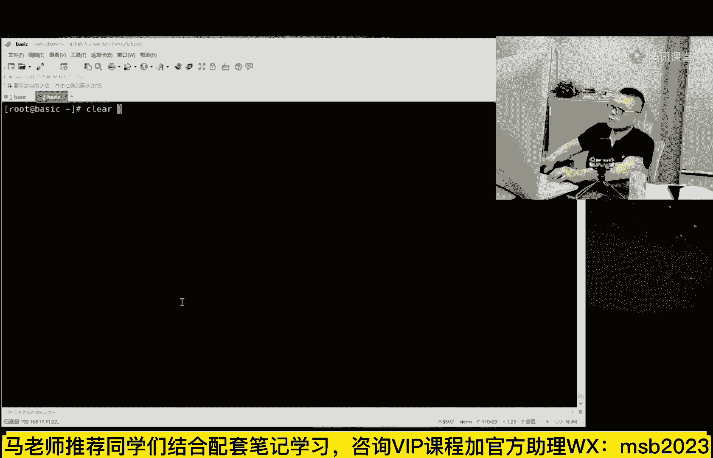

jdk能关成什么，jdk能观察你1246，这个进程里头有哪些个线程，每个线程的状态是什么，你看这里面有线程池，这个线程车状态是waiting，waiting on condition，什么意思。

正在等待吗，嗯还有一些这是这是waiting，还有一个呢，像这个demon现场，他是rino，等等，他会把里面那些线程全给你列出来，呃java还有一些常见的命令啊，还有一些找你的命令嗯。

这样我们明天再聊吧，好吧嗯，呃作为作为java来说呢，它还有一些那种常见的图形化的界面，呃我希望大家今天呢你大概听完之后呢，首先自己上手去玩一玩好吧，图形化的界面呢是java自带的啊，嗯大家找一下。

有人拿windows来说，你装完了java之后，program files知道这里可在他的binary里面，你会找到一个图形界面的东西，就是这个啊，这visual vm图形界面东西非常多。

有jconsole啊，这个是j visual vm是java自带的，呃，这个java自带的这种工具呢，呃你可以比方说你你你你你的你的你的你的，你的你的本地啊，你的windows本地它有一些个进程。

你可以通过它来观察这些竞争的情况，观察这些技能情况，这些技能呢有哪些个线程是吧，这就是不同的线程啊，还有呢你可以监视它它的内存使用情况，是不是在逐渐放大呀等等，好这些都是图形界面，我呢明天呢会教大家。

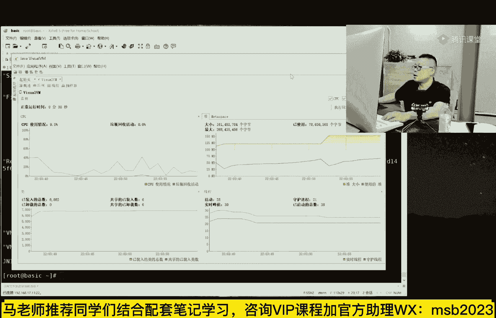

我会手把手的教大家，在你的实战的线上应该是怎么去定位这种问题，这种问题的定位呢嗯需要你准备内容比较多，我明天再讲好吧，怎么去定位这种问题，那么今天呢我留一个作业啊，线上问题，定位，能不能。

用图形界面工具，可以吗，可以不可以对嗯，嗯有的时候能，有的时候不能啊，这个没关系，我们留了一个思考题，好吧，呃稍微回顾一下今天的内容啊，今天由于多讲了一些理论，所以实战的东西我们放在明天。

也让它存在一些完整性，可，那么这个我们稍微回顾一下今天讲的内容，今天呢我们讲了这些个概念，讲了一些gc的基础知识。

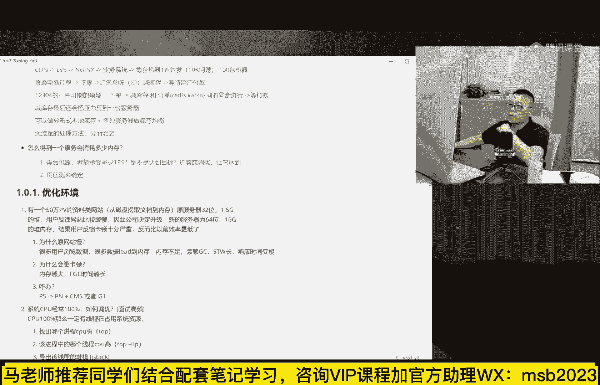

什么是垃圾啊，你脑子里跟跟跟着我一块儿动就行了，我们不不看那个什么了啊，跟着我一块动，回想一下我们今天讲的什么，什么是垃圾，想一下脑子里闭上眼睛小，什么垃圾，脑子里浮现一幅图，有一个对象孤零零的跑在那。

没有任何应用指向它，那就是垃圾怎么定位，一个垃圾怎么定位，想一下脑子里闭上眼睛小，两种方式，第一种叫reference country，记了个数有多少个应用指向它，差一个减一差一个减一减到零就是垃圾了。

这种的不能解决循环循环引用的问题，第二第二种方式叫什么，如certain，这是hosport所采用的根可达算法，怎么去回收这个了，第三种算法mark sweep，标记清除，还有呢拷贝，还有呢标记压缩。

market connect，根据这三种算法，然后呃jdk呢产生了各种各样的垃圾回收器，垃圾回收器有六种是分带的，g one其实是逻辑分带物理部分带，然后这六种什么样的一个组合，回想一下serial。

但单线程的年轻的老年代，多线程的年轻的老年代，多线程的年轻代，外加c m c m s特点是什么，回想一下c m s的特点就是并发执行，并发执行会产生什么问题，好好回想会产生漏标错标。

好产生这个问题之后是怎么解决的，cmc解决方案叫incremental update，把那个地儿，把那黑的变成灰的，脑子里那个图，但是他有bug有毛病，具体的详细的细节，这个地你可以忽略。

没有面试官问这么细的，今天应该没有面试官吧，谁要问这种问题，太无聊了啊，没意思，今天有有面试官在吗，嗯流行对，不要玩这个啊，没没没没没什么意思，总而言之，你知道c m s有毛病，有bug就行了。

但是他承上启下，他是一个一个一个继往开来，承上启下，后浪拍死前浪的这么一个拦截，v6 起由他开始了，他开始了对于并发标记的探索，gone相对就好很多，那么g one采用的解决方案叫s a t b。

它是配合g one的remember set来使用的，那当然z dc更牛逼一些，z dc连car table也没有了，这里三连呃，所谓逻辑上的分区也没有了好吧，所以cdc的比这个要要要要牛很多。

嗯将来我相信cdc应该在java里面会占主导地位，好吧，然后呢我讲了一点点的实战，这实战呢就是说你什么什么什么叫调用，你现在要理解一种叫预估，一种叫调那个曼卡顿，还有一种叫做出问题之后怎么定位。

这是面试的重灾区，出问题怎么定位这块呢，呃教了大家一点点，java的这种调参数的，基本的一些个小小小小问题啊，这小蚊子老师会嗡嗡嗡嗡嗡嗡嗡去，太讨厌了，那么这个包括什么呢，包括呃什么叫做标准参数。

横杠开头的，什么叫做非标杠x，什么叫做那种不稳定参数，杠x x特别多，但是我不需要你背过它，你只需要记住老师给你讲的这几个就ok了啊，哎呀这是今天我们讲的最主要的内容。

那有同学会说老师你列举你练的那个小程序，他真的会有毛病吗，嗯我在列的过程之中呢，你也看到了，你看啊，给大家复习的过程，其实就在等他出问题来，仔细看他出的问题，看能不能看，看得懂频繁f d c吗。

关键这哥们频繁f d c吧，他还不他还不o m我告诉你啊，这个小猛这个小程序是非常典型的，这个小程序呢呃有的时候会产生o o m，有的时候呢会产生负g c就频繁的f g c。

所以明天我来教大家怎么定位这种问题，这种问题一旦出现了之后，采用什么样的方式去给他揪出来，咱们，金针菇，see you tomorrow，今天就到这里，可以吧，嗯看看有没有同学有疑问的地方啊。

今天没广告，你想听，你想听广告，听广告，找我们报课程啊，我们课程还是很牛逼的，这广告我我我有时候也懒得讲啊，啊做个广告吧，我觉得是做广告最牛的是看效果吧，这这哎我这个这个漏漏了名字了啊。

这是我今天刚刚收到的，我其实最喜欢听到的就是这样的消息啊，老师我有两个offer是吧，老师你能不能帮我挑一个嗯，微盟20k 13薪，每个月补600，游走网络，17k 14薪也不600。

有的有大学同学在啊，原来工资是那个9000，看完六加明哥的小游戏就出去面试了，原来挺没底气的，现在除非是被面试官刁难，二线公司基本没问题，六是啥意思呢，这个六呢其实就包括了，我今天给大家聊到的jvm。

六呢是我们讲的一些，2019年面试的最频繁的课程，那就是设计模式，多线程，jvm，redis，zookeeper，mysql调优，他其实看的也还不多，嗯基本上扣完6万险公司就可以平仓了，好吧嗯。

讲讲行业大背景，这广告太秀了，这广告现实了，因为刚刚跟我说的这广告可以吧，呵9000直接就可以这么猛，咋了不行啊，9000直接20k这么猛的原因，你知道是啥吗，就是因为你简历你敢写上精通jvm调优。

放心听完我课，你就可以写，30岁没睡着了，曹老师31岁还是32岁才进的阿里啊，大哥别别那么小的，30岁没事成，30岁你还小年轻呢，30岁我记得我刚创业嗯，有的是市场默认c m s。

老年代能多少进行folic，应该是70%吧，如果没记错的话，你查一下啊，这值不是70%，就是90%，因为他前后调过了，调过200，但是你肯定不建议，90%到90%的时候，你卡顿就基本上逃脱不了了。

那个叫破蚊子，jc root包括哪些，看了好多都看不太懂，这个这些root我刚才不是说过了吗，你的main线程的线程站里，你的那个native，你你如果用到了那个native。

你才你你你你程序都要调成g ni的，对不对，native的线程代理的对象，你的那个常量池里面的那些静态静态的那些呃，那那些对象呃，呃你的比如说你漏漏进来那些class对象，那些都是那些个都是root啊。

ji是什么，ji是javative interface，今晚报名还有优惠吗，我们618的活动已经开始了，老师给个课件，明天一块给好吧，cfs初始标记完了之后，能单买你的课吗，不行这个温老师很牛逼的。

你那个光光买我的，可其实有好多比真的比我牛逼啊，我们，有这么跟你说吧，嗯p6 给你讲的课，p7 给你讲的课，p8 给你讲的课，课程里全有，而且老师的p6 p7 。

p班的老师都是可以知道花名去阿里随便查的，那都不是假的，不是虚的嗯，cpu百分百怎么定位来着，首先cpu不可能到百分百，首先cpu不可能到百分百，其次cpu百分百的定位主要是在。

你怎么揪出来哪个线程消耗的最多，p6 也能讲科德隆p6 的了，p6 是干活的一线的，知道吗，p8 是那个做指挥的，他讲的东西他比较虚，你先到p6 水平再说，你到得了吗，一般都是死循环啊。

上个礼拜cpu 300%的，你要这么抬杠，我也没磨，也没脾气啊，你四个cpu有可能是300%啊，但是你平均到每个cpu 75%吗，北京有新病例了，你说的太对了，你真是哪壶不开提哪壶啊，p6 干活。

p7 管理，p8 管理，p7 干啥。