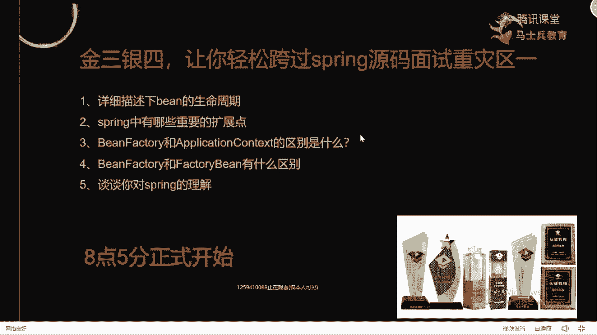
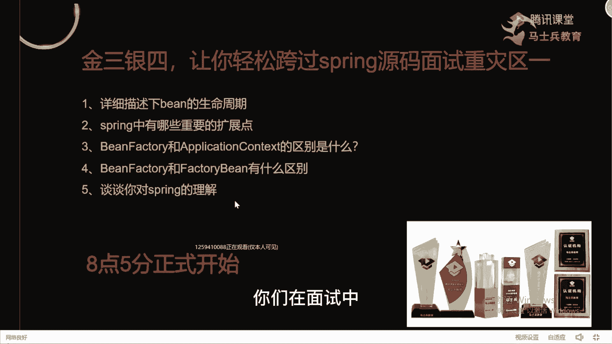
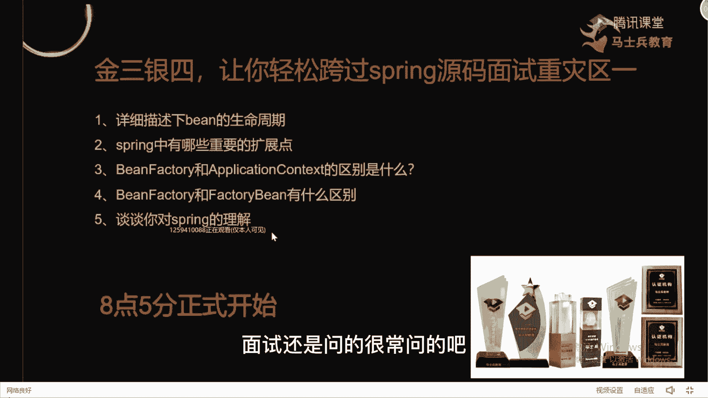
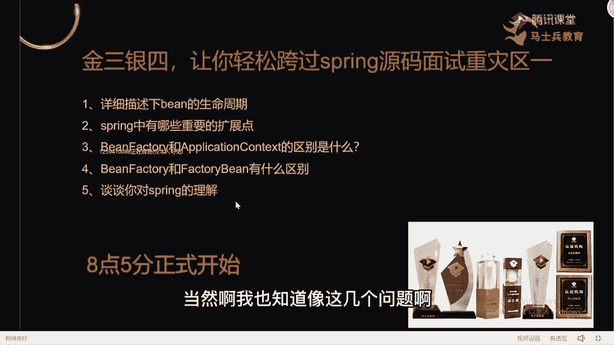
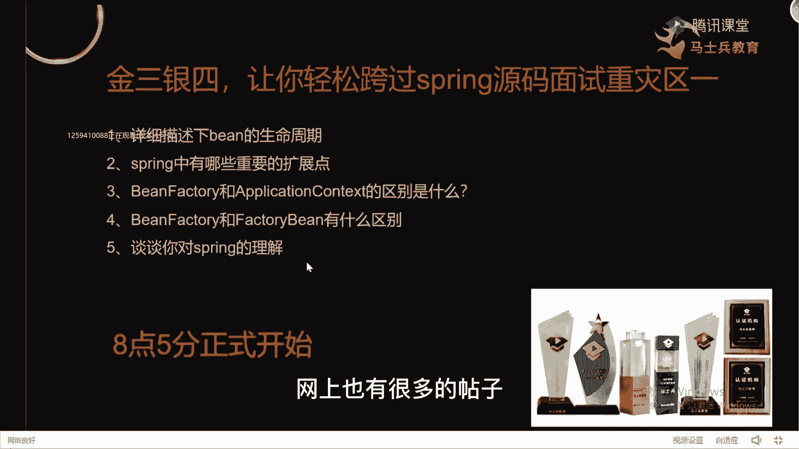
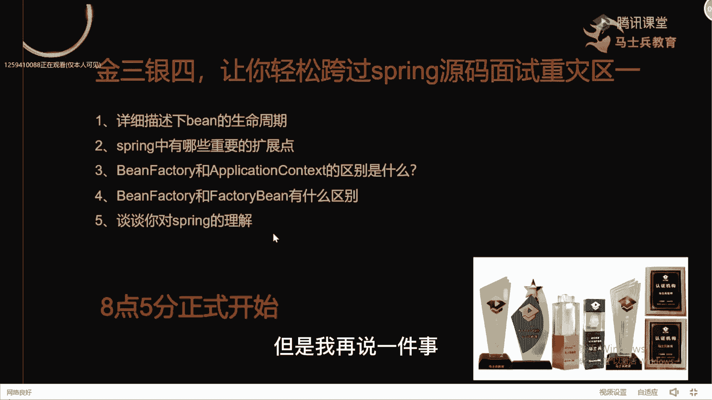
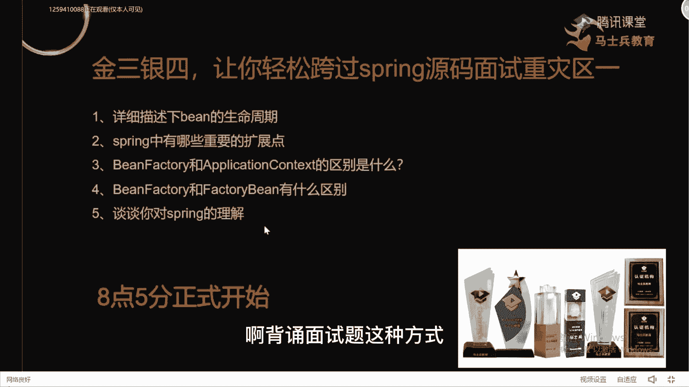
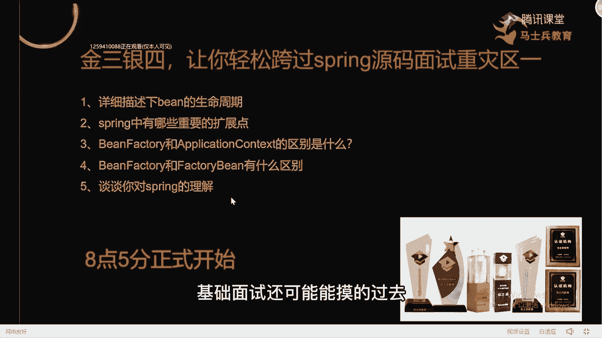
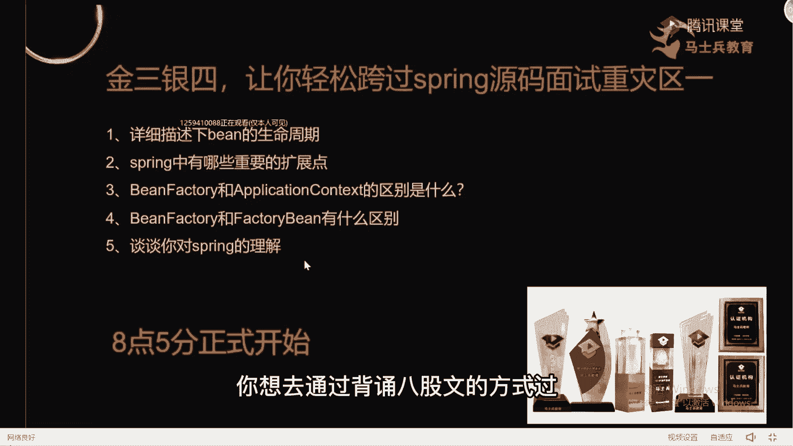
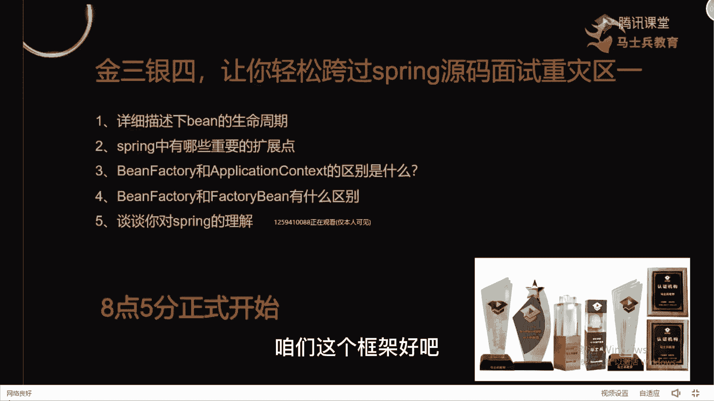

# 马士兵教育MCA架构师课程 - P70：Spring源码基础讲解 - 马士兵学堂 - BV1RY4y1Q7DL

在ppt上面我大概列了几个五个问题啊，大家看一下这五个问题，你们在面试中有没有被面试中面试官问到过。

好吧，我觉得这几个问题啊，面试还是问的很常问的吧。

那么你们对于这些问题的回答是什么样子的，当然我也知道像这几个问题啊。

是我们的同学面试反问回答的问题，网上也有很多的帖子。

去给你整理一套文字性的表述，让你进行回答，但是我再说一件事。

如果你现在纯靠啊背诵面试题这种方式。

你基本上是过不了面试的，过不了面试的好吧，固定面试他可能蒙的过去就背八股文。

但如果到中高级的话，你想去通过背诵八股文的方式过面试梅西好吧。

所以重点是什么，你要对它的理解。

那今天我们来统一的讲一下怎么里面的框架啊，咱们这个框架好吧。

讲课的时候一样啊，呃我这人喜欢画图，我们直接画图来给大家进行描述，一会我会在课程里面穿插到，我们刚刚涉及到的五个问题，都会给大家讲清楚的啊，你好好听课，ok来先说第一个吧，spring spring啊。

我就所有人在用吧，在公司里面你们可能会用spring boot，可能会用spring cover，无所谓什么技术，但是它最终的底层基础支撑都是我们的spring吧，而且每个学生在刚接触框架的时候。

基本上都是一spring开始的，那面试的时候经常会问到一个问题，说来你给我谈一下你对spring的理解，当问到这样问题的时候，告诉我怎么回答，有思路吗，我们还是一样，我们我们围绕着面试来说好吧。

谈一下你对spring的理解，这个怎么说，怎么表达呀，很多同学啊其实是非常害怕，或者说惧怕这种宽泛性这种问题的，在我看来，我觉得这东西啊它是非常容易的一件事，为什么。

因为你答的东西只要跟spring沾边，都不能说你错，那个同学在面试的时候经常会怎么表述，基本上会提到两个名词，第一个是l c我们叫控制控制反转，第二个叫什么叫l o p叫面向切面编程，然后呢。

你们可能会描述一下，l o k好解决什么样的一个问题，a o p解决了什么问题，然后到这个环节的时候，基本上戛然而止了，我告诉大家，你们以这样的方式去表述，百分之百是不对的，对有同学老师。

我在i o c的时候还会提另外一个东西，叫d i对吧，提到一些名词，这些名词告诉大家谁都会，你要凸显的是什么，你与别人不一样的地方，所以你在你这个问题的里面，你要贯穿进去。

你对于整个spring体系的理解，那么在回答问题的时候要怎么去回答，告诉大家一定要回答一种方式叫总分，什么叫总分，既然说明清楚好吧，总的spring理解是什么样子的。

你可以说spring是一个轻量级的框架啊，简化我们的开发，明天重点包含两个模块，一个啊两个功能，一个叫l o c，一个叫a o p，l o c叫控制反转，原来我们在使用对象的时候，必须要自己去new。

然后才能进行雕啊，现在使用l o c之后可以干嘛呢，由容器帮我们来创建对象，并且由容器来帮我们管理对象对吧，减去我们很多的一些呃，开发代码上面的一个成本，好提高我们对应开发的一个效率。

lp叫什么叫面向切面编程指标，面向切面编程呢，我们在使用的时候，需要嵌入一些跟业务无关的一些核心代码的时，候，可以在a op里面进行操作，比如说日式权限的增加，都可以在a op里面进行操作。

很多同学基本上这样描述，你聊完之后就结束了啊，这样说我不能说你错，但我只觉得这样说不是特别完整，那么下一步你要紧跟着说什么，这上面是对i o c和a o p的解释。

那么紧跟着我希望你能说出对于spring的理解，那服装是什么，说完这些点之后，你可以加一句话，其实在我看来，spring的本质是什么，是一个容器，虽然我们把它当成框架来用，但是呢基本上是容器好吧。

除了容器之外呢，我c还有一点是我自己的理解叫生态，因为我们现在在公司里面用的主流的框架，基本上都是在spring的基础之上，上层框架，比如说spring boot，spring color。

spring data，jpa，spring security等等一系列相关的点好，这是它对应的东西，那么我们要了解的是什么，在整个spring里面，最关键和最核心的就是我们整个ioc容器里面。

如何帮我们去创建好吧，以及管理对象的，那么这里面必不可少的，要涉及到我们的什么ban的生命周期问题吧，你是不是可以把病的生命周期带出来，再带到b的生命周期的时候，你可以提到spring源码里面。

它有哪些具体的扩展点，提到扩展点之后，你必然会提到一个东西叫being post processor，提到being post processor之后，必然会提到a o p。

提到l o p之后再解释a op的详细功能，能理解我刚刚说的这个思路吗，能力的来给老师扣个一，能听懂吗，就是什么叫体系性回答，你要给别人展示出你自己不一样的地方，怎么去展示。

因为一般同学基本上回答完这个东西结束了，你不会有自己的理解，那后面你要去贯穿上你的理解，什么病的生命周期了对吧，a o p的一些简单的应用了的实现原理了，这些东西啊，包括动态代理对象啊。

这些东西你是可以能输进去的，你要把它揉到一块儿去，给面给面试官的感觉是什么，这个人还了解过源码，或者说看过源码，或者说对这个技术框架是有深入理解的，要给人这样一个感受，明白意思吧好吧。

这样的话你的薪水能高上去，但如果说老师我对这东西不理解啊，我到现在对于spring也简简单单的就是一个会用，哪怕我对应面，就是面试中问到我那个病人生命周期问题，我都是提前一天去网上搜一个帖子。

我背下来了，我把它背完之后对吧，我这边正好给你算出，至于你说的那个扩展点，我压根不知道是啥，这个别慌，今天这节课我们第一个点，我先帮你去把整体的思路给你贯穿起来，好不好，从下面哈好好听课啊。

来我刚刚啊已经做了一个范本了好吧，有兴趣的同学下去之后，可以把我刚刚说的那套东西好吧，整理成一个文字描述，然后自己往里面填肉啊，把各种细节都填充完整了，那下面我要说的是什么。

是整体的spring框架的实现原理，l o k的整体的实现机制好吧，spring怎么解决循环依赖问题，这个是一个比较大的问题，明天我会专门拿出一节课来表述，别着急好吧，什么画图软件叫枫叶云笔记好吧。

这个画图软件大家如果想要的话，可以去下载一下好吧，枫叶云笔记。