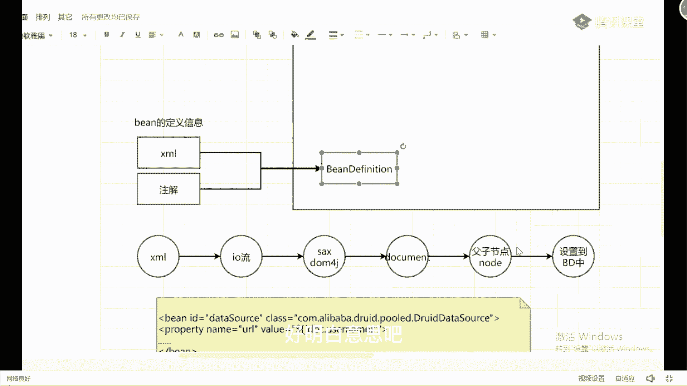
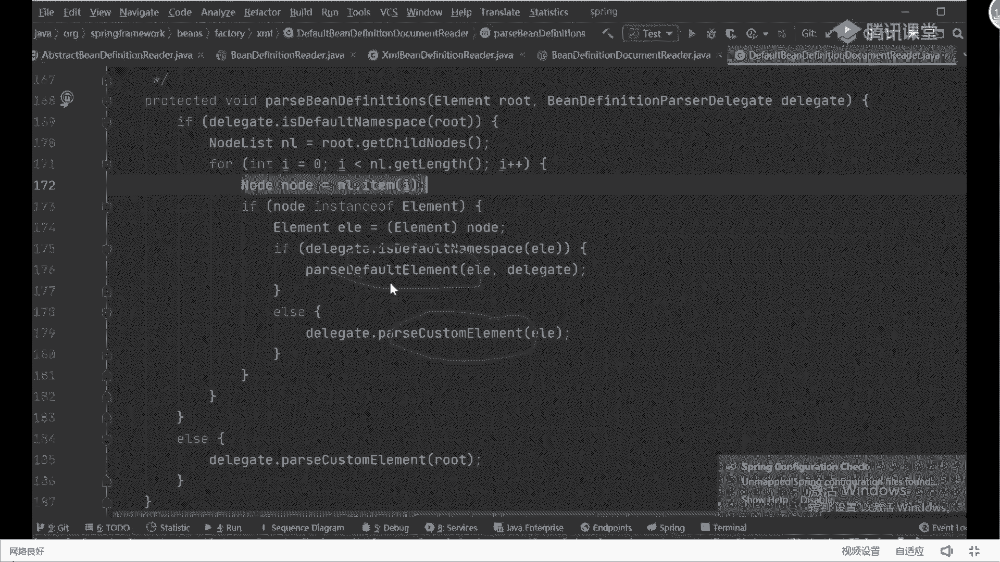
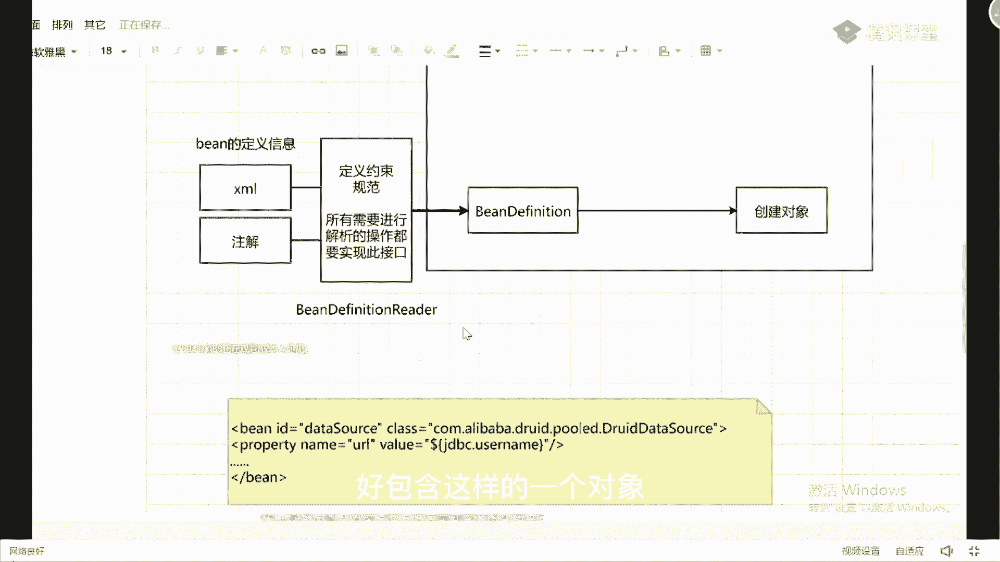
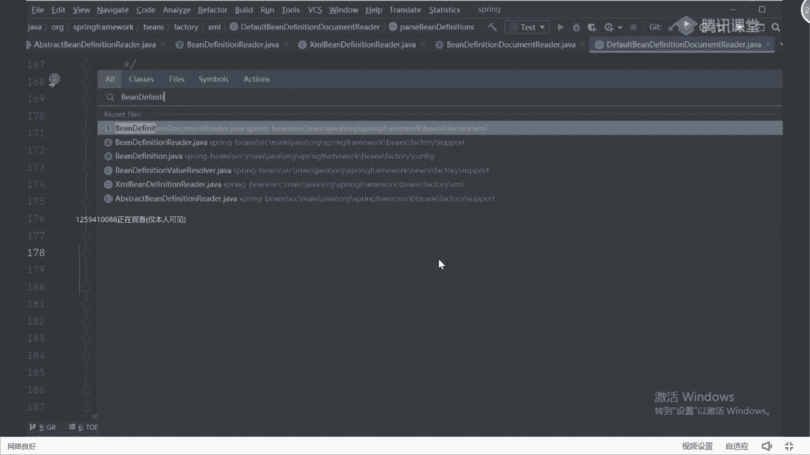
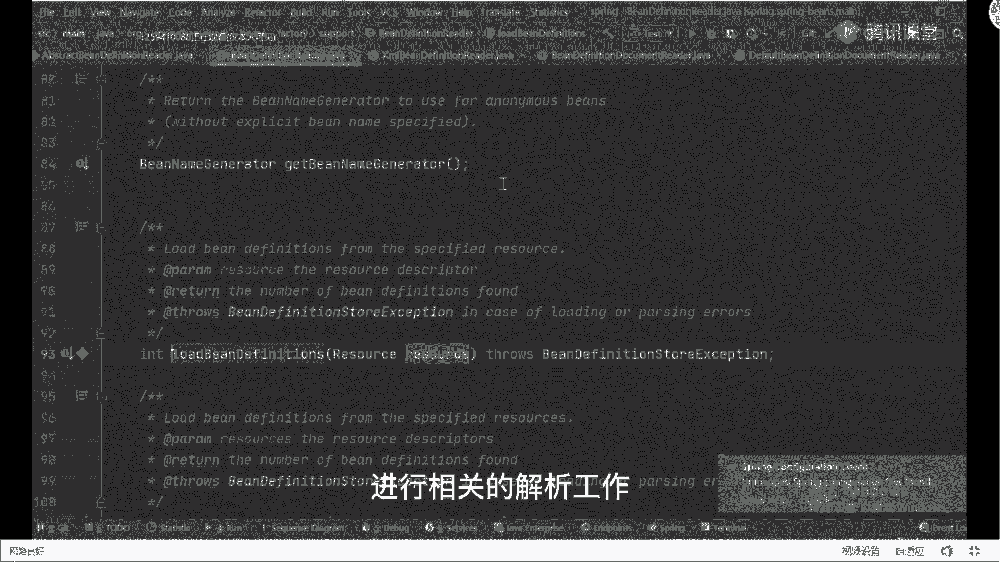
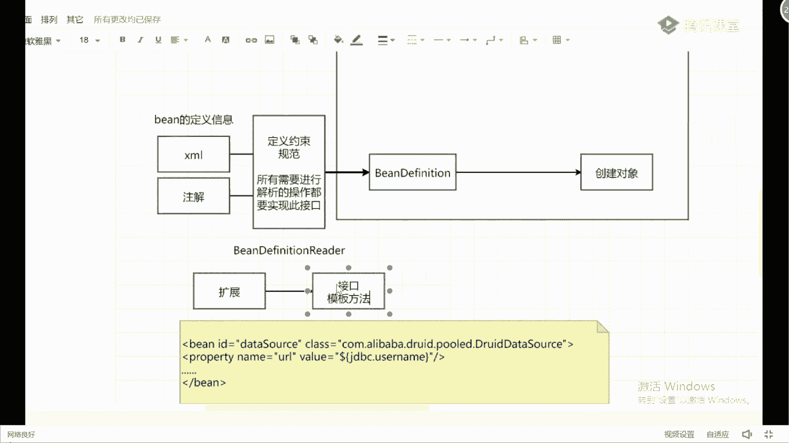
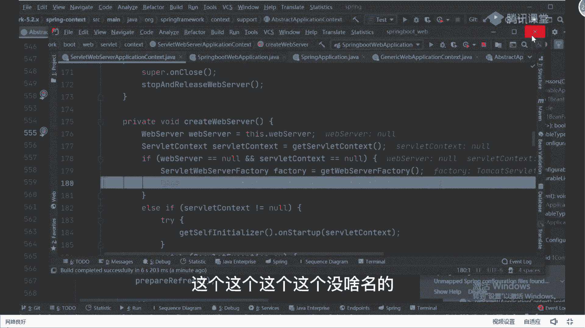
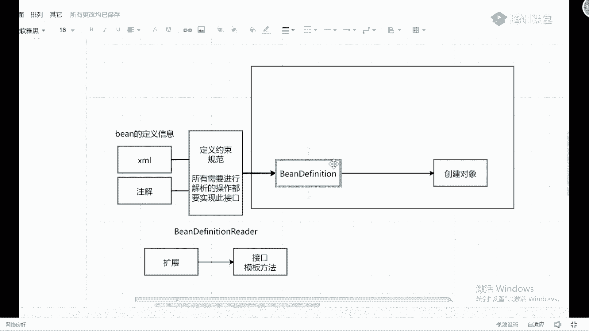

# 马士兵教育MCA架构师课程 - P71：spring加载bean的过程及框架的扩展 - 马士兵学堂 - BV1RY4y1Q7DL

来接着来讲我们的spring spring，最开始提到之后，第一点他一定是个什么容器吗，好吧，容器干嘛的，用来装载东西的，比如说我们的水杯水壶水缸对吧，对于我们的应用程序而言，它用来放什么。

放我们的定对象，当然里面可以放一堆的，并对象不只是一个n多个好看，你个人的一个需要钱吗，多少个放多少个，那这个时候你想我们如何去把i o c给它，融融融融融到一块呢，ioc是个容器。

我们可以把整体这个框框认为i o c容器里面，b对象它是如何帮我们去创建的，或者换一句话说，谁能告诉我，spring是怎么知道你要去创建哪些对象的，怎么创建，先不管他怎么知道我要创建这些对象啊。

通过什么来知道好，同学们通过什么看，也就是说我们其实是有些方式，可以让死人感知的，比如说最开始学习的时候，很多人接触的时候用的是xm 2，上面配置文件嘛对吧，然后后来呢大家可能为了简简简化操作。

我们更多用的是注解，不管是ta也好，还是我们的注解也好，包括我们的配置类也好，这些方式里面它都是定义好了，预先存在的并对象，帮我把那些并对象定义好之后，然后我就要容器来帮我们管理。

那这里面定义的到底是个啥呀，对像零零后的程序员可能都没有写过xm，因为现在很多机构讲课的时候，基本上都是直接以配置文件，直接以这个注解的方式来讲，但是坦白说我要提一件事。

我还是希望大家能够好好的把插m文件，这种方式理解一下的，因为它是根，但是本质，如果你能把xml文件的方式理解得很透彻的话，对于注解的方式更容易理解，好吧，我问一下上面文件也好，数据也好。

它里面定义的是啥啊，比如说老师定义的类定义的病吗，其实这里面定义的应该怎么说，他叫病的定义信息，我希望你们这么去描述它叫bean的定义信息，比如老师什么叫病的定义信息啊，我们想创建出一个对象的时候。

如果用反射的方式的话，我必须要知道他的一些内心期望，写一个案例吧好吧，比如说我这随便写一个配置文件，对于很多零零后没见过小孩，我给你们写一下好吧，写有很多零零后程序啊，你不要觉得这事很难啊。

比如说写一个叫beta source对吧，class，等于com点回味一下这种方式，动力的报，第二个一data，boss可以这么干嘛对吧，然后加上之后里面会有我们对应的property属性。

name等于写一个，写一会儿，然后呢value给一个the dollar，大括号b d b c点，user name，当然里面还可能包含一些其他的一些属性值，对啊我这不写了好吧。

然后最后再来一个闭合标签，这不就是我们病的一个定义吗，像这样的一些定义，什么叫病的定义信息，比如说里面的什么id的属性了，class的属性了，name的属性了，y的属性了。

这些这种东西都可以成为定义信息，我这获取到这些完整的定义信息之后，我才能够去创建出一个具体的并对象，在这里面会涉及到ta也好，注解也好，就是定义的都是这样的，b b信息，有了这些b信息之后，我会干嘛。

我要预先把这些bean的信息，加载到我们整个容器里面去吧，因为加载完成之后，在容器里面我才能够去把对象给充电出来，如果不在不加载进去的话，在外面放着，我是识别不到的，对。

我是必须要有这样当前这样的一个加载过程的，因此在这个地方你可以这么写，在评论里面，它提供了一个默认的接口，用来承载这些具体的信息，比如说叫b，所以你看这个单词的名字。

你能猜出来它翻译过来不就叫病的定义信息吗，是不是意思注解也一样的，注解最终在解析的时候也要把它转换成一个，然后我通过各种方式可以把我们叉m2 加进来，可以把我们的注解加进来，最终都组装成这样一个对象。

这没问题吧，来到这块能听明白的同学给老师扣一，能听懂吗，没问题吧，那有没有同学会好奇啊，老师我这样pr文件是如何组装成这对对象的，如果是你让你来实现，你现在有一个xml文件，你怎么把它组装成这样的对象。

能做吗，可不可以做，可以吧，第一步，刚开始我是开发文件，下发文件，有了之后可以干嘛，是不是可以把这些读物文件给读过来，你告诉我读文件用什么方式，无文件用什么方式，io流io流的方式把它给读取过来。

好读取回来之后，先把它放到我们对应的内存里面，放内存之后别忘了它是内存里面的一个数据了，顶着要干嘛，说白了上面文件里面放的东西，在我看来就是一堆字符串，那这些字符串。

我如果想把这些字符串给充分的利用起来的话，我要怎么做，说好的对象，那你们别忘了，ta文件是一种非常独特的具备特殊格式的文件，所以在这里面我可以通过什么，比如说f a x对吧，比如说到我方c，这样的方式。

我是不是能把插m文件转换成什么东西，document文档类型吗，当我有了这样一个文档类型对象之后，我是不是意味着里面就包含了对应的父子节点，对吧。

里面有堆的什么note note note note对象有了note之后，我能不能通过循环的方式，把note里面的每一个属性值，属性名称把它取出来，取出来之后我能不能设置到我们对象里面去，设置到bp中。

可以这么做吗，可以吧，这个流程能听懂吗，如果让我们自己操作的话，我们一定会这么干，于是源码里面也是这么做的，跟我们想的东西是一模一样的，只不过很多同学没看过这些原版，所以感觉这东西好像很难的样子。

其实不难，你就按照你传播的手段做操作就可以了，bd是啥，bd不是ban definition吗，我这儿我这儿写不下了，所以我写了个bd叫bean definition，好明白意思吧。

如果大家不信这公司的话，我们可以来验证好吧，在验证呃，我问一下有多少同学在私下里边自己看过源码，给老师扣个一，就自己尝试看到过这个东西，不是让你在项目中用的，是帮你帮你把这个流程梳理清楚。

你面试的时候能跟面试官去吹牛逼，懂我意思了吗，不是让你自己在项目里面用的，一般人接触不到，好吧，如果你看过源码的话，你应该会知道啊，在源码里面很多人在看的时候，基本上会提到一个非常重要的类。

叫obstruct，application contents，在这个类里面会包含一个非常重要的方法，叫什么呢，叫reflesh，之前有人说过一句话说，如果你把reflesh的流程看明白了。

那么你对spring框架理解到位了，我们不带你看这东西啊，我带你看到处理那个配置文件的那个地方，他是在哪做的，回答，你看这个东西叫load bean definition，叫加载bean的定义信息。

点开里面我们一直往这边看啊，选它tm，然后选择这个选择这个选择这个，然后走选择，你不用跟上我的速度啊，无所谓，我对这东西很熟了，所以打的很快，你们可能跟不上啊，跟着往下听就行了。

我带你们找到具体的地方来，往这看到这行的时候，你告诉我你看到什么东西，这行代码能看到吗，比如说我们写在外面的cheml文件，会把它变成一个resource的一个对象，然后我通过这个result对象。

可以读取我们对应的数据，所以这样获取到result之后，第一步获取到我们的input stream是吧，引流了，当完引流之后，我开始对这些流进行相关的一个处理了吧，不要把数据进行处理的那么点进去。

在这一刻它有个东西，把刚刚的input source，input source里面是个input stream工作rap拿出来之后，把它组装成一个什么东西，啥是我们刚说的document的。

不管你通过xx也好，还是通过我们的端口pg也行，把它转换成一个document文档，没问题吧，那我有了文档之后在干嘛，文档是包含了父子节点关系的，就在这里面我会干嘛呢，解析出我们具体的父子节点关系。

是不是可以通过循环点进去看这块儿诶，哪去了啊，看到我开始获取到它所有的子节点，有了对应的子节点之后，我可以把他们每一个节点取出来，取出来之后我看一下，我是把它当成一个默认元素进行解析。

还是把它当成一个用户自定义的元素进行解析，是不是数据流程跟我刚刚写的一样吗。

一样吗，所以你们在看源码的时候，同学们注意了，为什么很多同学看源码看不懂原在什么地方，你看源码，你就真的是在看源码，而不是说我在不考虑东西，如果是我的话，我会怎么来考虑这件事情，或者我会怎么来创建对吧。

别人写的方式比我写的方式到底好在什么地方，这是你需要去对比思考的事情，你带着思考去学习，和你直接跟着学习，效果是完全不一样的，明白意思吗，来这块儿能听的同学被老师会议，问题吧，那中学怎么做注解一样吗。

我识别到你的类上面加了一个at component，at service，好吧，at reporitory好吧，at control，这样注解的时候把具体的类对象给你识别到，识别到了之后。

把它装成一个bd对象之后，我把这些b对象来生成我们的具体对象，不就完了吗，一样的流程一模一样好吧，但是你还要去做一件事情，同学们大mod转完之后，看起来我们好像已经把这个流程给结束了。

技术完之后紧跟着我们干嘛，叫创建对象对吧，我问一下，在框架里面创建对象一般怎么创建啊，怎么创建，能创建吗，反反射吧，基本上都是反射，很少有人用new的方式来创建我们这个对象，基本上反射也反射。

它足够灵活，能满足我们各种各样的一些需要，好看完对象之后，我可以拿过来直接用了，看起来就说好像很简单，那这个时候你就要思考了，为什么这个地方在写的这个配置文件好吧，它定义成xml文件，俗话说。

如果我把它定义成一个properties文件行不行，就我定义一个配置文件格式，这个配置文件格式呢叫properties，我在properties里面能不能也把它装成一个理对象，男孩们呢，可以吧。

那你告诉我propose和吃个包，那么区别在什么地方，不就是两种文件的解析方式是不一样的吗，我只要配置好对应的purpose，它的解析方式不就可以了吗，用解析properties文件方式解析它。

用trap文件的方式解析它是不是可以，那同样的刚刚说的用压毛是不是也可以对吧，我能不能用json是不是也可以，我只要能解析好它对应的关系不就完了吗，这个很简单，那你在这块你要去思考什么东西。

同学们想好了，不同的定义方式，需要有不同的什么解析方式吧，我要不要给它形成一个统一的规范，因为在我没读取之前，我其实并不知道我的配置文件是哪一个，是不是这意思啊，我在这块我是不是可以定义规范。

写东西叫定义，约束规范对吧，所有啊需要进行解析的操作都要实现是接口，可以不，那这样的话，不管怎么样，我后面如果有其他，如果有了其他新的配置文件，我是不是也可以实现这个接口，然后实现好接口了。

我匹配到对应的类了，我是不是可以把对应的实现类或者解析类，给它充进去，我是不是就可以解析对应的配置文件了，这块能理解吗，能理解来给老师扣个一，能不能理解，所以这就是，为什么源码里面要提供这么多的接口。

这么多的抽象类里面的原因，我要定义好对应的约束和规范，那同样的在源码里面这块会有一个东西叫什么，叫be definition，reer，好包含这样的一个对象。

当你有这样的一个对象之后，我们可以来看一下表b 10%规则。

它是不是一个接口，你接口之后我定义好对应的方法，我只需要去实现具体的子类就可以了，那这样的话我根据我不同的子类，我就可以进行配置进行识别，并且对不同的配置文件进行相关的解析工作了。

这块意思呢是吧，所以这个地方其实在源码里面，你在看的时候注意到，像spring里面有7000多个杂完类，里面有很多的接口，很多抽象类，其实都是为了方便我们进行扩展栏使用的。

只不过我们平常在做业务开发的时候，你用不到这些扩展点，经此而已，但你不能不理解其中的扩展，因为一个框架能够流行起来，或者说能够被绝大部分人认可，最关键和最核心点就在于它什么，它的扩展性，你懂我意思吧。

好，所以我希望大家时时刻刻把这两个字留意起来，我问一下，如果你们需要在框架里面做扩展的话，可以用哪些扩展方式，或者我们自己在写我们自己的业务逻辑，代码的时候，可以用哪些扩展点啊，有吗，没想到吧。

刚刚我说的接口是一个还有吗，不要说bpp和bmp可以看，听过课的同学，听过的同学，可能知道什么叫b b b和b b f p p，没听过的同学，可能不知道什么叫b b b b和b f p p。

比如说模板方法这种东西知道吗，设计模式吗。

设计模式里面不是可以扩展，像spring里面它有很多这样的扩展点，我给你看一个再找一个吧，看这里面我们找到我们刚刚说的那个，reflect方法，在瑞负债方法里面一共包含了13个方法。

你点开这个方法里面有任何子类实现吗，没死的时间吗，所以他这个东西干嘛的，就是留给子类进行扩展的，再比如说往下看这个unreflesh，这直接告诉我名字叫dostop class。

do nothing by default，我留好这个口，你说这个口之后，我就可以在这里面实现我具体的业务逻辑了，那这样我问一个问题，你们都是有经验的开发程序员对吧，你知道的，有人知道吗。

哪些地方用到这个on reflash方法了，有没有知道，啊对在spring boot里面内嵌泡沫cut的时候，是不是就是在on reflash里面进行操作的，是不是你要发现这些东西的关联性。

我为什么说spring是基础，是生态，因为很多上层的建筑和上层那些框架，都是在spring的基础之上做了一些额外的扩展功能，你下去之后可以自己看在什么boot框架里面好吧。

这一块就是用来创建我们对应的tomcat server，我们开的server就在这个步骤里面完成的，就扩展点吗，默认的时候它是dj，什么都没实现，就这意思好，听懂了吗，来这块听懂的同学给老师扣个一。

能不理解，我需要我带你们看一下spring book里面怎么扩展了吗，有需要的吗，我打开一个项目好吧，扯远了，随便打开一下午啊，我带你快速快速看一下，这个这个这个这个这个这个东西好吧，呃登子怎么看。

大概你的启动类改完成之后，这有一个run涨多少，我就直接带你们找过去了，好吧，不一行带你们看了银行再看，太浪费时间了，reflex reflesh，看到吗，从这里面reflesh一行一行点的时候。

就能点到这个refresh方法里面去，依然是这个abstract object contest，然后在里面找什么，找on reflash方法，点击之后，这默认实验没有，你点开里面太快了，冲不出来啊。

那你6g给bug启动起来好不好，我把它启动起来，好了进来之后点mc进去好吧，找到new run方法进去，再点击run方法，然后听到它核心的启动流程里面去，在启动流程里面。

下面有一个东西叫reflesh contest，找到我们的reflesh contest，这行代码好，然后点f7 进去，再点f7 进去往下走，点f7 进到refresh里面去。

super reflash里面再点f7 进去，我咱们这节课不讲spring bot好吧，我带你看看流程，你看一下这有reflesh，我刚刚在你们看的时候，这里面是不是也是reflesh。

re是reflash，两个地方是不是一模一样的，都是这个abstract application contest，好，后面这也是不算的，是刚才的类是一样的，只不过我在找的时候找的具体子类实现不一样。

我们往下走走走走走走走，准备一下走走，走到on refs这行代码里面去，然后点fc进去，这有一个super reflash对吧，再减去往下走，就是个create web server，点不进去往下走。

往下走，可填空吧，等一空之后开始获取我们的web server factory，这一获取下一步告诉你了，当前的factory是什么，这tom cat sweb server factory。

有了这个feat对象之后，我就可以根据这个工厂来创建出，我们具体的什么，他们看到server了吧，是不是东西，所以我给大家讲这么多意思是什么，一有时间我给你们讲，能报个源码好吧。

这个这个这个这个没啥难的。

我想给大家说的是什么，你要知道它其中的扩展点在什么地方，你要知道这东西啊，而且你在看源码的时候，你要时刻留意这东西，就这东西你掌握好了，才是你自己的实力提升的点，明白了吧好吧，听了废话不多说了啊。

还是一样，跟着我学学的是什么，不是说简单把这流程学会了，我希望大家学会的是什么方法，方法很重要，ok好了，我们这涉及到接口，了解到接口之后，问一个比较low的问题啊，特别low的问题。

谁能告诉我这个接口和抽象类的区别啊，讲到接口了，我说了源码里面spring源码有7000多个类，里面一定有很多的接口和抽象类，接口和抽象类有区别吗，谁能说一下，单集成多实现，这个蜡笔没了。

小心你居然听过我的课是吗啊，我要是在bw带过bw什么，很多同学啊听过我的课，应该会知道我强调过这件事情，这样的接口有什么，你们换成刚告诉什么单继承多实现什么，不能写具体的方法，代码什么之类的。

这东西没问题，但我认为你们所说的这些点统一的称为什么，叫语法上的区别点，你在面试的时候，如果只去跟别人说语法上的区别点的话，不好意思，这东西谁都会，哪怕一个小白，刚学完之后。

老师也一定给他总结了很多具体的东西，这东西不重要好吧，重要是什么，你要体会其中的设计思想，什么叫设计思想，第二口和扩展类最主要的缺区别，能在什么地方写一下，接口它本身是一种叫自上，第二下的思维模式。

而中药类，叫做就这样，向上来，这样东西能理解的扣一，不能理解的扣二，什么叫自称在下，什么叫自相上乘，之前说过乔尔同学比较多，我解释一下这件事情，你们之前在面试的时候，如果去给别人说语法上的区别。

我觉得没问题好吧，因为他这样区别没问题，但如果你想凸显的自己跟别人不一样，你要说这玩意儿什么叫自向上上，什么叫自向向上，这两种东西怎么理解，很简单，接口我们叫什么叫定义的，叫约束和规范，就意味着什么事。

我定好了规则，你的子类必须要按照我的规则实现来，没个意外好吧，推荐你什么意思，抽象类是因为你有了很多具体的子类实现，你把很多公共的特性拿出来了，变成了一个抽象类，能听懂这意思吗。

比如说我们动物动物有什么眼睛的颜色了，名字了好了，把这个属性拿出来，拿出来之后，我变成一个抽象类，其他的具体实现子类我直接继承就完事了，那接口呢我定义好了，具体的方法实现，你就必须要按照我的方法规范来。

你可以自己加，你自己加没问题，但是我我写东西你必须要有，所以这个时候你理解什么叫自上向下，什么叫自向向向上了吗，来理解的扣一，所以你面试的时候你要给别人说这东西，不是说你们说那些语法上的区别。

你说语法上的区别没有意义，好吧，显示不出你自己的技术史实力，谁说不理解，下课之后你私聊我录像，问你什么意思，sel你怎么定义的，你先定义了一个interface，里面有a方法，b方法，有三方法。

我的实现子类在实现了这个接口之后，我必须要把a b c3 个方法去重写，我可以自己再扩展一个地方法，但是我必须要按照接口里面的a b c这个方法，来对他是自上向下的一种模式，我定义好约束你来实现就完了。

而冲向类呢什么意思，我有猫对吧，有狗有肚子，这里面有一些公共的属性，比如说毛化对吧，比如眼睛，比如内蒙这样的一些名字，每个里面都有，我为了简化操作，我把这些公共的属性拿出来，变成了一个抽象类。

我的子类只需要写自己独特的属性就可以了，它是什么，它是共性的东西，它并不是定义了约束和规范，所以它是自下向上了，而接口是自上向下的，理解了吗，这东西啊你们学基础的时候，老师应该告诉我们。

那你们很多人基础的老师不讲这玩意儿，你讲完之后之后，很多人不理解，但你写这本写多了，你就理解了，明白意思吧，好吧行了，不多说了不多说了，这东西讲讲讲，扯的有点远，真没告诉我，你要你要去思考什么叫思考。

对不对，好吧好了，内部之后，我们来接着往下讲，回到我们spring来中，回到spring这块好吧，老实说背背就行。

背会你体现不了别人的差距啊，我还是那句话。