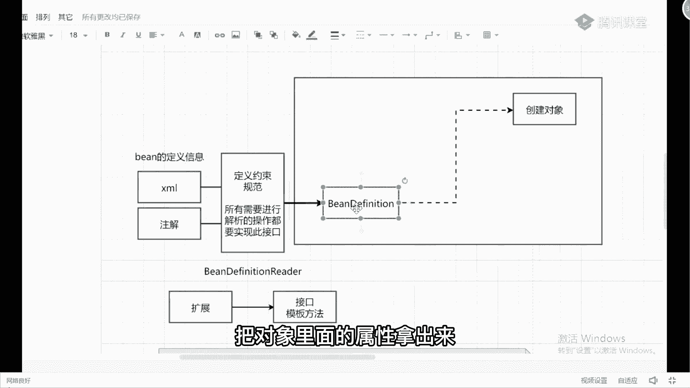
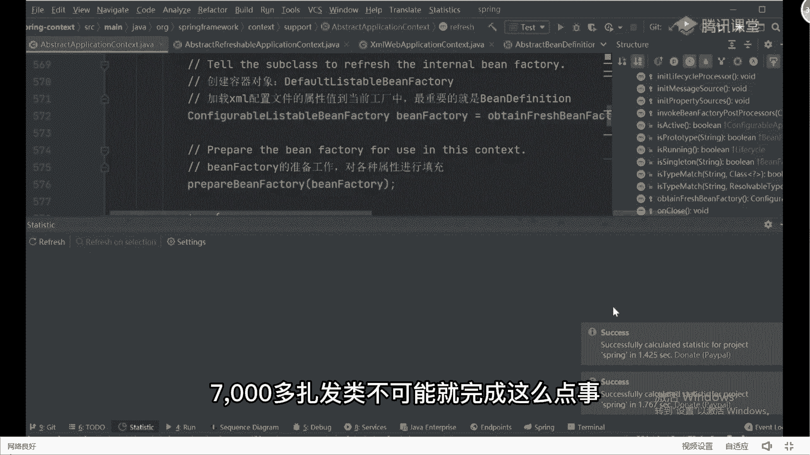
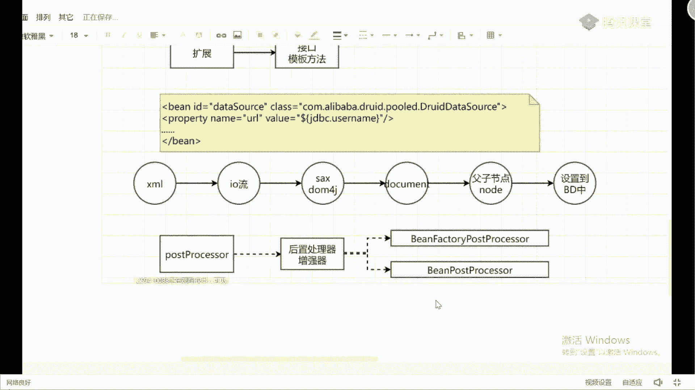
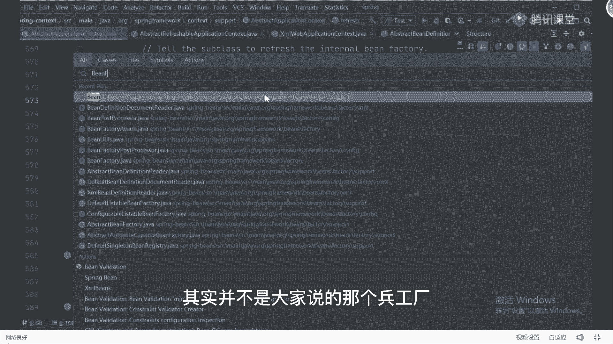
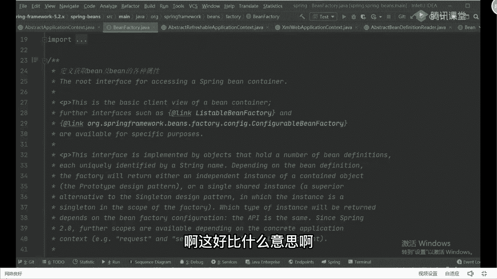
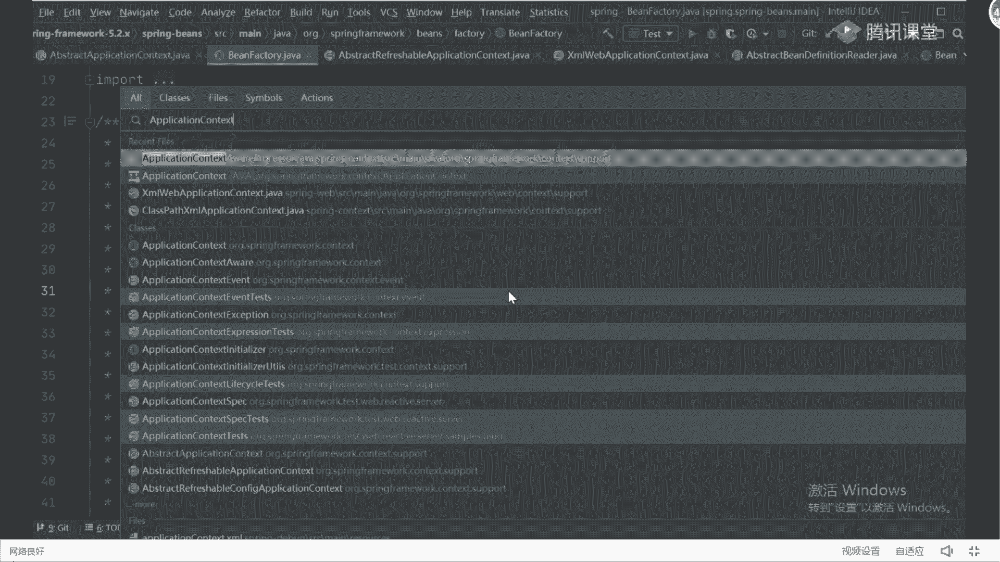
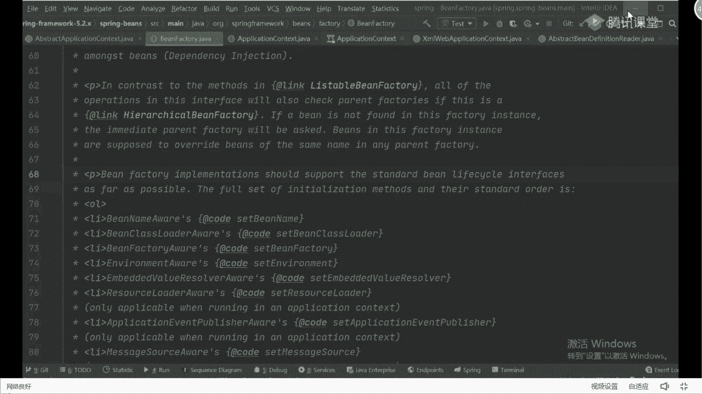
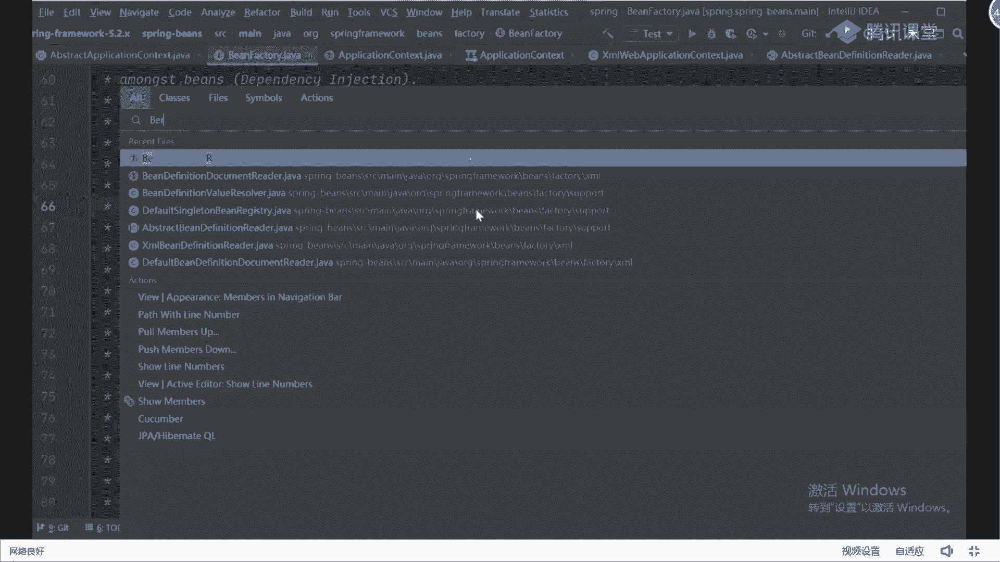
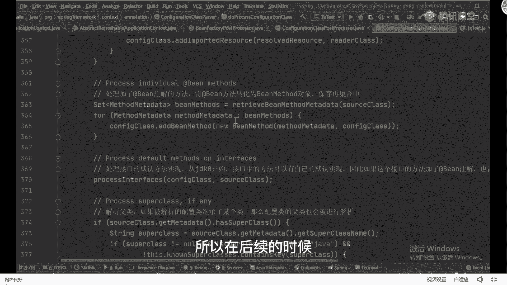

# 马士兵教育MCA架构师课程 - P72：spring的增强器的处理postProcessor讲解 - 马士兵学堂 - BV1RY4y1Q7DL

好不好好了，再往上收啊，回来之后来紧接着往上写，来往这来，我们刚才说了，刚刚经过我刚刚的讲解之后，我们其实已经把我们对应的插画文件和注解，里面定义的这些bean的定义信息，把它转换成我们的bd对象了。

有了编辑对象之后很简单，我可以把对象里面的属性拿出来。

通过反射的方式，我可以创建出具体对象，当我把对象创建出来之后，好紧跟着下一步我是不是可以去使用对象了，对吧，当我的对象使用完成之后，那简哥呢，我是不是可以去销毁对象了，对啊，这是我们大概的一个流程嘛。

基本流程都要这么定了好吧，从我们的创建到使用到销毁这个流程，这个环节能理解吗，你如果这样看起来的话，spring里面的东西其实还是比较简单的，但是你想这不可能这么简单吗，如果你真的看过源码的话。

你可以点开它里面的统计，我刷新一下，你可以看一下它里面一共包含多少呢，包含了7000多个类，同学们，7000多扎完类不可能就完成这么点事儿啊。

他完成的工作一定很多，我们找一下扎拉费，你搜一下扎了1412的内这么多类，对这么多对象，这么多代码，我不可能完成这么简单的事情，所以在框架里面还是那句话，最主要和最核心的是什么。

你要体会的是它里面的扩展性，这个东西，我今天啊不止一次的说过扩展性这东西了，我希望你能把这三个字给我记到心里面去，因为这东西才是框架，或者说你自研框架的一些核心点，那这样我有什么需要进行扩展的地方吗。

或者我需要进行什么扩展吗，注意但我们的spring框架它是跟我们的业务无关的，每个人拿到辅助框架之后，你可能做比如金融方面的业务，银行方面的业务，保险方面的业务好吧，医疗方面的业务各又有点不一样。

那意味着不同的项目里面会产生不同的需要，我作为一个跟业务不仅无关的一个框架，我如何能够适配到那些所有商品里面去呢，因为我在框架的某些点里面，我要把它加进去，非常非常多的一些什么扩展点。

让用户可以按照自己的需要去随意地进行扩展，把其随意的进行扩展，这些哪是很重要的，那这有什么扩展点呢，来听我讲，我相信很多同学在看源码的时候，多多少少见到过一些一些类似于这样的描述。

叫post processor，我们叫这个东西吗，什么叫post processor，见过吧，这东西怎么理解啊，有人把它称之为叫后置处理器，没问题，后置处理器更多是什么，是直接翻译过来的。

我上课时给我们的vs前杠过，我说这东西啊，你最好把它称之为叫增强器，它是用来完成某些扩展功能存在，那在这个扩展功能里面有两个非常重要，或者说比较著名的接口，哪两个呢。

第一个接口叫be factory post processor，这是第一个，我们只说接口好吧，此类有很多，比如说接口，第二个叫b post processor，这两个是大家见的比较多的。

同时给大家用的比较多的两个接口，那这两个键有什么意义啊，或者说他们两个接口有什么区别呀。

其实你通过名字你能够发现两个东西的区别，区分点在于什么，那么针对的操作对象是不一样的，这个东西它真的操作对象是谁啊，是不是bbruary，好吧，那同样的这个东西呢，看看这是谁，是我们的并对象。

是不是他们两个针对的对象是不一样的，但是不管你针对的东西是什么，最主要的是什么，都是为了完成某些具体的扩展功能而存在的，这点是不变的，当然在这个里面，还会有很多对应的扩展子类实现。

比如说他依然会有一些子类，什么子类，我写一下，里面有一个叫b，也会包含一些子类接口实现，对此类接口实现我们就不说了啊，因为这个子类里面有东西有很多好吧，我们只说这些最关键的，所以你要知道什么。

这两个东西一个叫bean factory，post processor，一叫bean post processor，这东西我会挨个来给大家聊一下，跟大家聊一下好吧，来先说第一个。

谁能给我解释一下什么叫b factory啊，什么叫bean factory，你们对于bean factory的理解是什么样子的，谁能告诉我叫兵工厂嘛对吧，大家一般人都是这么理解的，叫兵工厂啊，告诉大家。

你翻译成兵工厂没问题，没毛病好吧，但是我希望大家看一下源码里面，对于bean factory的一个核心解释，到底什么叫并factory，其实并不是大家说的那个兵工厂。

可以来看看，它也是一个接口，再往上翻，然后翻翻翻翻到这条来翻译一下，the root interface for assessing a spring being container，什么意思。

root interface吗，跟接口干嘛的，跟接口呢用来访问一个spring定容器的根接口，也就是说我如果想访问一个容器的话，必须要通过我们的什么bean factory来进行操作啊，这好比什么意思。

很简单，看好了，我这刚刚画了一个大框，这个大框我说的就是我们的容器，就跟你家的门一样，你加个防线影，你家有个房间，你如果想进到这个房间里面去，必须要个门吧，没有门，是不是要有个窗户，你才能进得去。

那这块是一个封闭的框的，我是不是也要提到一个对应的出入口，能方便我们对里面的属性进行相关的操作，所以这东西可以理解为什么叫bb，这能理解吗，来能理解了，给老师扣一，好在这个朋友就会问老师不对。

我在平常自己进行使用的时候，我很少会用到并facer，我用的更多叫什么叫application contest，因为我在写代码的时候，我基本上是这么干的，怎么干的呢，叫contest，第二get是病。

比如说里面有个命令叫person，我写一个person加class，我是这么做的，我通过这样的方式来获取我们并对象的，注意了，这个context是谁，他翻译过来叫什么。

叫application context，它也是一个接口，那这个接口和我们的bean final有什么区别呢，你看一张类图，你知道了，application，你可以把它翻译成上下文，没关系。

i这个接口，你可以看一下这个接口，它给它的内存是ram，这个东西它继承次定factory，所以并出来的叫什么叫根接口，所有东西，如果你想去获取到容器里面的一些属性也好，方法也好，属性也好，干嘛也好。

你属性值也好，你必须要通过并better类实现，只不过我在这些具体子类的时候，我提供了一些更加强大，或者说更加完善的一些功能而已，明白了吗，所以如果我想去操作容器的话，我最应该操作的是谁。

是我们的bean factory，来关于这个bean factory能理解吗，所以我会干干什么事，可以这么来形，in factory，其实完全可以把它等同于我们当下的这个容器，因为我操作的时候。

容器里面包含了bedation，包含了我们对象，所以这个东西可以等同于我们的容器，但其实它只是一个访问的根接口而已啊，如果你把这件事理解了，那么紧跟着你再看这个接口的下面的这些注释。

和下面这些翻译的时候，你就会体会到这样一个东西，往上看，说being battery employments，说being bat子类实现好吧。

素的sport应该支持叫the standard bean，levecle interface，叫标准的bean的生命周期接口，什么意思啊，我的此类实现，必须要尽可能多的支持我的生命周期的接口，好吧。

他们the first set of information method，那their standard orders的意思，他们这些初始化的方法结合和他们的标准顺序，如下所示。

你告诉我这块里面描述的是啥，描述什么东西，这图描述啥不就是病的生命周期吗，明白了吗，所以你们很多人都去网上，搜一些生命周期的东西，用搜吗，原文里面给你写的很详细，你有本事你把这些东西搞清楚。

你自然就搞明白了，明白意思吧，所以去看那些注释的注释很有意义。

明白意思吗，所以你要把你可以搞明白了，ok当然对面出这事，一会我会敞开给你聊，不着急啊，我们先回到这块，当下这个问题之后好了，下面我就要思考了，那对于being fx的扩展，我要怎么去扩展呢，很简单。

举个例子，我刚刚在写了一个对象，写对象的大家应该觉得很特殊，很奇怪，用在什么地方啊，我这里面的这个property value，我用了一个东西叫dollar gdb c ular name。

实际上我们知道我们在进行配置的时候，一般会引入一个外部的配置文件，叫dd叫tm这配置文件对吧，这个db点，coerce文件里面，包含了我们连接数据库的四个属性，是不是这意思，那我问个问题啊。

我们前面从tm文件解析完这些东西之后，组装到bin dbs里面去之后，注意啊，躲到里面去之后，这里面的这个属性值会修改吗，会不会改，你们想想到底会不会改，肯定不敢骂你，这没必要去改它。

你这只是把原来我们写的插画文件也好，处理也好，满只能把它解决过就可以了，那下一步我明明就应该开始创建对象了，你告诉我我要在哪去修改，我要从哪个地方去修改，所以在这块的时候，就会包含了一个非常重要的接口。

刚刚说的，post吧，我在这是不是在这干什么，是不是我们可以来做一个验证，好吧，来自爆这个接口叫b。

batter dot processor，对接口好，在接口里面上面有一定的解释啊，不管它好，然后点开它有一堆的实现子类，子类是非常多的，我这不带你拿一个看了好吧，我们直接点进去。

它里面有这样一个实现子类，叫holder configure sport对吧，往上翻上面里面做一件事，看这句话还是看注释好吧，看注释怎么怎么怎么去解释这个类的，跟这个接口，他说这是一个不像的基础类。

没问题吧，这个抽象基础费用来干什么事呢，叫属性资源配置，也就是说它是应用来进行属性资源配置的，一个基础图像类啊，那进行什么属性资源配置呢，大家看叫resolve police，holders。

in ban definition，property value，在b definition里面的，property里面的value里面的站位服务操作，你再看一下刚刚我写的东西，他是在bd里面的。

是在bd的property里面吗，是在bd prop里面的value里面吗，我是不是要把这个值进行替换了，刚刚有人问我说，老师为什么要替换你，下一步就该对象创建了，创建完对象之后，紧跟着干嘛呢。

该进行属性值的设置了，你不能把这个属性值设置进去啊，所以只能在那做，只能在bean factory post processor里面做，这能理解，同学给老师扣一能理解吗，当然这一块你可以写很多个。

按照你的业务需要，你可以写很多个，你想写多少写多少个，就有人会说老师说是真的吗，是不是真的，我们完全可以来做一个验证啊，我给你验证一下，这事儿为什么不在创建对象里面做，创建对象属于jvm里面的东西了。

你一个属性值得替换，要放到jvm里做吗，啊就跟你出去玩一样，你出去玩的时候，你告诉我你要不要提前做些准备工作，什么事再好对吧，医生一些吃的喝的带好，这不是一样的吗，我要提前把这些属性做好吗。

是不是这意思，你不做好这个准备工作，你怎么去做做事情呢，就这意思，所以非常简单啊，你要把这东西搞明白了，那我们可以来做一个验证，做一个验证，怎么验证来，我带你们看一个代码，着急了再往上看。

注意像这里面我就写了一个data source，没问题吧，这些data source里面出现的都是dollar吧，都是我们占位符，那会干什么事，我就接debug，debug之后，我们直接去跳过去。

好听好内行，我们看看是不是在哪儿，在我们的bean factory post processor里面完成这个工作了，我先来验证一下，这东西很好验证好吧，这里面有一堆断点，我把断点断掉，特殊搜索。

大家来看看这块要注意了，我每次因为我编译的是源码，因为编源码的时候比较浪费时间，这都要编译一下好吧，那dmc进去拿下走，点f7 f7 ，找到我们的reflesh方法，然后往下走，往下走往下走。

怎么进来拿走，这不用管他跳过去就行了，刚才点没削完，拿走拿走到这步好了，当你到这一步之后，我们打开我们的factory，然后呢打开它之后往下找，找到一个东西叫bean definition map。

这个bean definition map里面就是啥，就是我们说那个封装好的bg对象，所以我可以打开我们的gen source，里面有一个property value。

然后这个property value value里面有个property value list，找这个意思list你看到了吗，是username，password，122ja class name。

你点开之后，你看看这个值是啥，他这个只有进行替换吗，同学们有没有替换，没有吧，我配置文件里面写的啥，对面是不是还是啥，然后写着看往下一步做一个操作，谁能给我翻译一下这句话的意思是啥，这个叫什么。

叫invoke，bean，factory tos processor，invoke，什么意思，调用执行吧，要执行并factory post product来，我们往下执行一下，走好了，执行完了。

当我执行完成之后，你来看看值替换了吗，听完了没，听到了吗，不就是在这个步骤里面，完成了这些替换职的工作吗，就这个意思好，所以你要把这搞明白了，把这搞明白了，明白意思吧，好吧，来这块能听懂。

同学给他扣个一，能听懂吗，好了完成之后来再问一个问题，再问个问题啊，我们现在我们刚刚讲了拆包文件的方式，我问一下拆包和注解，xml和注解谁先有谁后，有的是先有的注解，还是先有xml文件，上文件吧。

比如说我现在上方文件这样的一个配置方式，我先有了xm文件配电方式方式之后，我一定我要写出一个叫标准的，是解析流程对吧，这没毛病吧，就是我在有刚开始有插盘文件吗，有拆包文件之后，我要有个标准解析流程啊。

后面我有了注解，我问一下，当我有了注解之后，我是把原来的这些标准的解析流程都干掉，他说我要在这个基础上做扩展，扩展啊，肯定是不是一个扩展点，对不对，在原有流程的基础上，原有流程基础之上多扩展。

那这种问题来了，我们之前写过什么叫at controller对吧，at compu能不能干，at import，有这样的一堆注解，我问一下，包括我们的at bean，一堆这样的注解，这些注解都是干嘛的。

注解是干嘛的，是不是用来生成我们具体的，或者说用来创建我们具体的并对象吧，是不是意思好吧，那在解创建变量之前，是不是先要有bd，那你告诉我bd在哪在哪，是不是在这个bean factory里面，对不对。

如果在bean factory里面的话，我现在想对它进行扩展，能扩展吗，可以怎么做，一样你找到我们刚刚说的叫bean factory post processor，这接口说它的一个实现子类叫什么。

叫这玩意儿，不知道没见过，叫configuration class post processor，在这里面会有一个方法来处理这块，就这个方法好，这个方法里面你可以往里边点点开它，然后往下走。

变成我们的pass好吧，找pass之后找到我们的pass找他，然后你往这看，还在下面这个东西，你看那有什么东西，它会判断一下你当前注解有没有实现这个类，如果有时间这个东西的话，ok好。

我就把它声明成一个具体的注解对吧，再往上走是什么意思，process处理任何at property source这个注解的处理，往下走，要处理任何网破的干注解的处理对吧。

往下走处理任何at import注解的处理对吧，往下走处理任何at import resource注解的处理，再往下走，adb注解的处理，我是不是可以在这个环境里面完成这件事，能听懂吗。

这是不是也是空难点，就因为我现在预留出来了很多具体的扩展点，所以在后续的时候我想增强某些功能的时候。

我可以按照我的需要去随意扩展，这玩意儿就出来这个东西的核心所在，你小白啊，如果你对这个源码没看过，同学你不需要听懂，你把我刚刚说的东西，什么扩展的那事儿给我记清楚就完事儿了，明白意思了吗，能听懂吧好吧。

所以他要经过这样一系列的一个处理过程，当这样的一系列处理过程处理完成之后，好往下走，诶诶诶诶诶诶发不过来了，一条线过来好吧，当然内部处理完了好了，我现在获取什么叫完整是吧，b d对象明白吗。

完整比对象有了这个完整的bd对象之后，紧跟着我就可以去创建我们的对象了，这个时候这个创建流程他应该是一个直线，所以说从这块开始才开始，涉及到我们具体对象的一个创建，明白意思了吧。

来到这儿能听懂的同学有点扣个一，能听懂吗，这这这我我看这些东西都是从官网里面看的，或者自己研究对象里面看的，又忘了bd是啥了，不就是病单分析肾吗，哦反正你搞清楚了好了，大家搞完了之后，那下一步很简单。

该干嘛了，来创建对象，使用对象，销毁对象对吧。