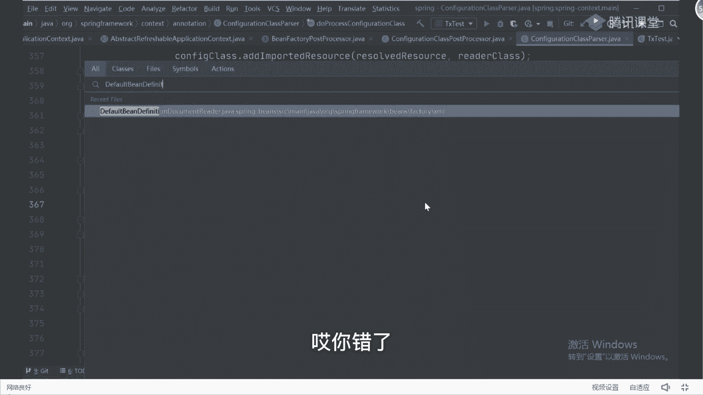

# 马士兵教育MCA架构师课程 - P73：详解spring的bean的生命周期 - 马士兵学堂 - BV1RY4y1Q7DL

呃说这三个步骤啊，说这三个步骤我觉得其实有点有点少，正常情况下，我们其实应该里面包含一些其他步骤的，这个创建对象其实是可以分为两个环节的，哪俩环节呢，一个叫磁力化，还有个东西叫什么呢，叫初始化。

我是希望大家把这两个步骤给分开的，一个叫实例化，一个初始化，比如说先有的我们的实例化，然后再整个我们的初始化，初始化完了之后，紧跟着才是对象，使用才是相互对象，所以当你把这块一起框起来的时候。

这是个什么东西，这就是我们面试中经常面试被问到的一个问题，不就是bean的生命周期吗，这种病的生命周期，所以你需要把这个病的生命周期好好理解一下，的bean的生命周期，能不能搞清楚了好吧。

那我这我在讲这个病的生命周期之前好吧，先说明一件事啊，什么叫实例化，什么叫初始化呀，我需要把这俩东西大家解释清楚啊，初始化实例化什么区别，注意啊，实例化只是，在内存中叫开辟空间好吧。

那初始化呢最容易理解的是什么叫属性赋值的，属性赋值，明白吗，这大家正常的理解，你也可以这样方式理解，只不过在through里面，它提供的初始化的环节会更多，或者在初始化里面做的东西会更多一点。

这东西我会放那一会给大家详细去进行描述，是打了东西哇，所以这个图我希望大家能够理解到了，这东西好好的搞清楚啊，来刚刚讲的这些东西，能理解或者能听懂的同学扣个一吧，好不好啊，不是说创建变量要创建对象。

在堆里面申请空间，是这意思，ok下面我们来解释一个问题吧，就是我们刚刚说的叫病的生命周期啊，那病的生命周期到底怎么去回答呀，这些并保存在什么地方，保存在我们的map里面去，在我们对象创建完成之后啊。

有这样一个东西，ub或者b a b音响，嗯defab这东西我这样的对象。

在这个对象里面呢，它里面包含了几个map结构，来找我们找一下看吧，这这三个东西这三东西就是什么，不在这往上翻是啥东西，这三个东西里面就用来干嘛，放我们具体的b类项目，这东西就是我们的一级缓存对吧。

这是我们的三级缓存对吧，这是我们的二级缓存，这东西明天我们详细讲了。

别着急别着急好吧，那你记住容器里面是有一定的map结构的，map结构里面放的是什么，放的是我们具体的一个对象啊，先不管它，ok我们先来把这个b的生命周期啊，啊生命周期好好去理解一下。

到底什么叫生命周期好吧，怎么理解东西啊，我相信啊，老同学之前都背过吧，啊不用截图好吧，这图我分享不用截图，没没必要截图好吧，你们就好好听课哦，保证我这个讲的东西你能消化一下，没必要去记笔记。

我这个图会分享出去的，好不好好听课，到这儿之后来，我们接着往下讲讲生命周期，我问一下生命周期你们是怎么背的呀，我相信很多同学肯定会搜索b的生命周期对吧，出来一堆帖子，非常详细，告诉你，啪一堆好了。

我背一下啊，背完之后面试去说对吧，当然有很多同学比较聪明对吧，图片看图片有一张图应该用的比较多的，就是这张图好，一共有13个步骤对吧，大家把这13个步骤给记住了，我问一下这13个步骤。

你记住了就真的能理解吗，这里面我就问一个问题，同学们，我就问一个问题，谁能给我详细的解释一下，这玩意儿是干啥的，要检查偶威尔相关接口，并设置相关依赖，就这一个步骤，首先我解释一下，理解不了是吧。

小心说对了吗，小心说是对的，除了小新，其他都不理解，好吧，我们来详细画一下这个流程好吧，画流程再次重申一件事，同学们记住了，病的生命周期不需要被听懂了吗，bean的生命周期不需要背。

你就按照正常的一个线性思维，去理解它就可以了哇，怎么理解很简单，第一个步骤，我们叫什么叫实例化，刚刚我已经解释过了，什么叫实例化，实例化干嘛了，谁要干嘛呢，就在堆空间中，申请内存，当你申请完内存之后。

我问一下那个对象的属性值是什么值啊，对象的属性值是什么，零现在还说零，现在苏联不合适吧，默认值吧，默认值好吧，你数据类型不一样，肯定是默认值嘛，对不对，然后呢，当你实例化完成之后，紧跟着第二个思维方式。

你肯定就想着老师，我实例化完成之后，紧跟着下一个步骤，我一定要开始进行，什么叫初始化，对吧，那初始化的时候还没想到第一件事干嘛，不用猜嘛，肯定是要设置属性吧，你肯定要说是属性，对不对。

那这块在描述的时候，你要怎么去描述这东西啊，你不要大人就说实例化，你说实际话是不对的或者不严谨的，你该怎么去说，你说变生命周期从对象的创建开始，第一步我们称之为叫实例化，实话是通过哪开始的呢。

通过一个非常重要的方法，那方法名字叫什么叫create叫b然后instance好吧，通过这个方法，可以完成我们具体的实例化的操作啊，那这里面怎么完成的呢。

这里面实现的核心逻辑是谁，是我们的反射，对吧，这个时候可以把你的反射技巧带一下吗，什么反射技巧，第一步我要获取到对应的class对象，第二步我获取到我们的构造器。

第三步我要开始new instance了，来创建对象，我问一下这个反射代码会吗，反正不会的，扣二反正会吗，会吗，看一下来简单写一下好吧，比如说我现在想创建一个对象，我怎么怎么写反馈呀，很简单，跪求百度。

简单写一下吧，好吧也写一下，第一步获取，对象有三种方式，第一种叫class。for name，对吧，你们在刚接触数据库的时候，下载驱动的时候都是这么干的，写一个字符串，对我来写一个class。

class等于第一种方式，第二种方式的class，等于什么东西等类名加class，没有第三个这样子，class等于对象名，点get class，这第二步对吧，第二步叫获取构造器怎么做。

ctrl c t o r等于class，点get excel，ctrl t，对不对啊，第三步叫创建，对象，然后我第二套o b j等于c t o r点，new means h就这样好了吧，这下代码啊。

谁如果反射不会的话，下去之后一定要看，好好看一下呃，反射这东西是呃基本功，我们叫童子功，这东西如果你都不会的话，我觉得你的基础知识，或者是你的技术储备是有问题的，是有问题的啊，啊为什么这么写很简单。

因为原文里面就是这么干的，我刚给大家说了，你如果看的话，可以找到这个方法，我们来看一下，说一下the creative in instance。

就这样，方法那里面第一步我先获取到我的cr c项，是获取到之后呢，我们下翻翻下面的中间都是判断逻辑，判断逻辑无所谓，还有个东西叫实例化，点开之后有一个实例化策略，选择实例化特别精确。

进来之后第一个步骤叫class class等于bd点，get in class获取到我们的卡的类对象，获取完成之后，第二步叫class get declared constructor。

获取到我们的构造器，当我有了具体的构造器之后，紧跟着通过编译tos来进行实例化，怎么说话呢，叫c t o2 点new yance好，他就完成了我们的反射，刚刚有同学提到优势啊，说老师反射不是效率低吗。

那为什么那个还要用反射呢，注意了，反射效率低，它是有数量级的控制的，你在100000加对象创建的时候，有一口气创建100000加对象的时候，才有可能效率低，就我们创建这零零星的。

对这些对象效率还是很高的啊，为啥要用being in tab，有跳是什么，是spring里面提供的一个封装类，网上提供服装类，方便我们进行相关的一些病的处理工作，你在公司里面是不是经常封装一些工具类啊。

这是一样的意思，在spring里面他帮我们提供了一个工具类，方便我们进行使用，就是一个反射，那这样能力的同学给老师扣一反射，不方便，举bug挺方便的，没啥不方便的，你不熟熟了就方便了啊，好了。

这第一个步骤，所以当这个步骤执行完成之后，我们第二步骤干嘛了，该叫设置属性，设置属性呢同样，也会包含一个非常重要的方法，发名字叫什么叫pul b，有这样方法，这个方法完成什么事情，就你们刚刚说的。

要给属性赋值，怎么赋值，要调用，set方法赋值里面就是这么干的，叫populate b，明白意思吧，啊popub，这没问题吧，这是我们正常的一个线性思维吧，紧跟着第一步，先实例化，实际完成之后。

我们该进行设置属性了，那这块能力的同学给老师扣一，这样能理解吧，我觉得这个应该方便大家理解啊，当这个步骤完了之后，紧跟着下一个步骤该干嘛了，如果你去看那张图的话，背那张图的话。

就告诉你叫什么叫检查aw相关依赖，并设置对应的一些属性，很多同学对于这个东西是模棱两可的，或者认知不清楚的，那什么叫检查并设置相关依赖呢，其实非常简单啊，先先来看一下这个接口吧。

play进入到什么叫awa这个接口接口干嘛呢，这个单词怎么翻译啊，谁能告诉我嗯，单词，感知对不对，联想到意识到通知对吧，是这个意思吧，你如果看源码的话，你可以打开这个接口看一下。

这个接口很好玩，他跟我们那个那个呃serializable接口一样，里面什么都没有，它是一个空的接口实现，那为什么要包含这么个玩意呢，或者这么个东西，它到底有什么样的意义和价值呢。

举个例子你就听明白了是吧，来举个例子有啥意思呢，写在哪，这块我写一个代码，在里面new一个class，比如叫dog，好吧，我定好dog类之后，我里面一定要干嘛，叫private int id，没问题吧。

private three name，我一定可以定义这样一些属性值，是不是这意思，当定好属性值之后，我必然要干嘛呢，写上它对应的set和get方法，然后呢，我在设置属性的时候。

我可以调用这些对应的set方法，来设置具体属性值，没问题，了解一下，我调用，公共的that的方法完成属性值的设置工作对吧，这能理解吧，一般都这么干啊，但是有一个问题。

同学们除了我们这样的一些自定义的属性之外，还可能包含一些额外的属性，什么属性呢。

很简单，也就是说在整个容器里面对象好吧。

如果按照使用者来分，可以分为几类，就是说啊按照使用出来的可分为几类，两类，第一类叫什么叫自定义属性，比如说我们写的什么person啦，dog啦，看到啦这个东西的定义属性就之外，还有个东西叫什么。

这叫容器属性，什么叫容器属性啊，叫自定义对象，就自定属性对象，还有什么叫容器对象，什么叫容器对象，就在容器里面使用的时候，或者容器在调用的时候需要对象，这有哪些啊，比如说很重要的。

我们说的叫bean factory对吧，再比如说叫application context对吧，再比如说这environment，对吧，这就是result lom，这些对象是你是我们自己创建的吗，不是吧。

都是容器，在整个运行过程中，它自己需要的对象是容器的吧，好吧，那假设我们自定义的对象里面，他如果包含了这样的属性怎么办，private b factory可以这么写吗。

private the application contest，你别说老师，我从我对象里面不需要包含这些属性，假设就需要吗，啊假设这种能怎么办，这两个都是自由的属性，这意味着一件事情。

我必须要通过公有的set和get方法，来把它给设置进去，对这里面会有一个问题，什么问题，这就是谁在什么时候调用词set方法，为什么需要举个例子啊，举个例子，你这有道对不对。

看啊你这有道道德对象到对象交给容器，调出去之后，我外面我写了一个测试类，在这里面可以怎么写呢，可以这么写，一个叫contest，第二get b dog，the class，当我设置好到对象之后。

跟对象之后，我突然就要把dog对象设置到某一个对象里面去，怎么办，或者说我需要对，只需要获取容器的其他对象来进行操作，怎么办，在dog对象中，在b对象中，啥意思呢，我报告里面我写了一个方法，写下来。

还有这个，bogo里面写一个并排骨，在这里面我需要翻译一件事，干什么事呢，叫b factory，点get b写一个，我这不传参数了，这么干，我这里面需要用这个东西，我就需要用这些pad对象怎么办。

你能保证你的容器里面严格不需要那玩意儿吗，你能保证吗，加我有这样一个代码，我我这个地方怎么办，怎么复制，你告诉我，你是不是需要把它设置成一个属性，你把它设置成一个属性之后，我是不是才能进行具体调动了。

是不是这个意思能听懂吗，啊能听懂不，为啥要设成私有属性，大哥咱们学面向对象三大特征的时候，属性不都是私有的吗，看看为啥把它设成私有属性，这就封装吗，所以这里面我就必须要干嘛。

把这个对象或者把这个属性给它赋值赋上，如果我想赋值赋上的话，我怎么赋值，我一定要调用我们的set方法，你tm病理的复制可以按你们说的来里面写，并对象class报告我写这样的东西，我里面提属性了。

property name in battery，你告诉我这写谁，你告诉我这写什么东西，我写啥，你要想水泵，你必须要干嘛，是不是有一个对象在这，你没对象，你写啥，你咋写，你写不了。

你喜欢那玩意儿就没法这么干，完了怎么办，所以我要把对象给他设置进去，设置进去之后就是一件事，我是需要调用我们的set方法，来给大家进行处理的，这有一个set back battery。

下面有一个set of pication contest，那这里就有个问题，就是谁在什么时候调回复方法，谁在什么时候掉，第一个问题，谁要告诉我，谁来教，是我们自己去掉吗，不是吧，肯定是容器。

第二个问题在什么时候的，啊什么时候初始化，你说这个初始化是不是太绿太太粗了，别忘了这还有个set factory，in factory，还有个set of context。

我如果在后面再加一个environment，我这可能还要再加一个这set in warm，什么表，所以你很难判断，因此怎么办，很简单，能否，这是一个统一的接口来作为标识好，当实现此接口。

到时候来统一的设置这些属性操作，什么意思，当你打开aware接口之后，你可以搜一个接口叫be，待会aw，它里面有一个框叫什么叫set bean factory。

当您打开这个叫application compass aware的时候。

它有一个方法叫什么叫set of application compass。

当你需要environment的时候，还有一个environment awa接口叫set environment。

看到了吧，所以我可以做什么事情，我只需要在当前这个类上面，加上一个东西就行了，加什么叫impliment，对吧，application context aw对吧，environment。

aw我里面是不是已经包含了这些测试方法了，那么我在进行这些属性值设置的时候，怎么判断，我只需要判断一下这个病对象，instance of aware不就完了吗，怎么做一个做成判断。

第一步括号并instance of w对吧，里面可以做什么设置，if，变instance叫bean factory aware，应该怎么调并点set bean factory，我是不可行设置啊。

能听懂这意思吗，我不可以这样逻辑判断，所以在这里面它也是一样的，在这个方法在里面的调用awa相关接口里面，都是说做什么事情，它所对应的方法也非常简单，就我刚刚说的叫inno。

嗯aware methods，这东西有这玩意儿，你可以打开我的钥匙看看，看到了吗，你能不能做这样设置工作啊，能同学们能吗，听懂了没，这儿听懂了没，这没问题吧。

所以你再反过头来想一下什么叫调用啊，vr相关接口并设置相关依赖，这句话怎么去理解，啊怎么理解，这一步是不是也是设置，属性上面设置什么属性叫自定义属性，下面呢找容器对象属性，听懂了吗。

所以他们两个包含在一块的时候，都属于什么操作，加上这个底，这个底，他俩统一叫做设置属性，懂了吗，啊明白意思吗，你现在你你想什么，叫检查偶尔相关接口并设置依赖，有这玩意吗，就调用这些方法吗。

完成这个工作吗，来听我的扣一，明白了吧好吧，所以把这东西理解清楚了，理解清楚了，当这一块搞明白之后，紧跟着下面再来注意了，现在实例化堆里面已经有内存了，点跟着我的属性设置完成了，属性设置完了之后。

紧跟着郭凤龙还在那说啊，威尔接口做什么用的，我讲了半天，我在讲啥，哪个在那个设置自定义属性，在前期属性在后好吧，明白了吗，所以当这个步骤做完之后，其实我这画一个大箭头，正常情况下。

在我们自己在创建对象的时候，你告诉我我自己创建对象的时候，是不是创建完之后就结束了，就这样可能划分一下，你要划分一下，很简单，当这个步骤，当上述方法调用完成之后，的对象能否直接拿过来进行使用，那么。

我告诉陈说了，要是自定义对象，这个时候还没在容器里面怎么办，你容器创建的时候已经把这些东西创建好了，明白了吗，他在前期的时候有很多对应的依赖，已经提前把对象创建好了，不会出现你说的那种情况。

压根不会出现，你想去看原版就知道了，别这样，天都准备好啊，这个地方能不能拿这些使用啊。

可以吧，是可以的，但这个时候你要思考一件事儿，什么事儿，还是我们之前说的什么，它是一个框架呀，我不可能拿过来就直接使用了呀，对不对，我发干嘛，比如老师是不是该纳入容器管理了，围绕这块拿什么操作。

判断是否需要对病对象进行，什么扩展又是扩展这个点，所以当这个步骤我结束完了之后，紧跟着会做什么工作，做一件事叫执行铺，叫前置处理方法是有前置，意味着一定有后置，叫执行，后置处理方法很多，很懵逼。

老师什么叫前，这是什么叫后置，这样东西到底怎么样去理解，好吧，它与生俱来对应的，是我们的另外一个对象，就是我在前面已经给大家做过普及的一个东西，什么叫being post procession。

这玩意儿如果你打开这个接口的话，你会看到看一下post统帅的。

但是里面两个方法，一个叫post process for insulation，后面还有一个post process after insulation，好吧，所以这两个对应过来之后。

就是前置和后置的处理方法来，这能理解同学给老师扣一，我不需要做扩展，无所谓，我如果不需要做扩展，没关系，你跳过就可以了，如果你需要做扩展，你是不是在这里完成对吧，有什么用，并对象需要做什么扩展呀。

需要吗，我问一下，在spring里面有一个非常重要的东西，除了ioc，还有个东西叫a op，是的vip，我问一个问题，aop的底层实现原理是啥，a op的底层实现原理是啥，动态代理。

动态代理的两种实现方式是什么，第一个叫ktk，第二个叫cdd，没毛病吧，所以假设我现在这个对象，我就需要被创建动态的对象，怎么办，是不是意味着我要在中间某个步骤里面去生成，我们代理项不可能生成。

我是一定要生成的。

那如果我想生成的话怎么办，我是一个接口，所以我要去找到这个接口，这个接口里面一样，你点开之后会发现有一堆的实现子类一堆，抓住一个，找一个东西，让他叫abstract。

auto property creator是吧，你这个东西吗，当你看到这个东西之后，你找谁找它的前置和后置处理方法，我们先看前置，等一下叫before insulation。

你告诉我这个前置处理方法里面有多多，有有有多的工作吗，有做任何工作吗，没有吧，你做没是录播吗，对是录播，没有吧，前置如果没有的话，那你找谁找后置嘛，对不对，点开后置，后者里面是有处理逻辑的，那好了。

我们来看一下它的处理逻辑，我们看啊找他的方法吗，有一个方叫什么叫viper，if necessary对吧，来点f7 ，进去，点了之后往下拉拉拉拉拉拉，我进行来告诉我这个方法叫什么，叫啥。

啊叫什么创建代理，对不对，看代理，然后再点进去，往下最后一行叫propose february，点get propose，我要获取我们代理工厂，我再点进去，是不是获取我们a o k代对象。

然后来获取代理点，mc进去，进来之后发现它是接口里面的某一个实现子类，那么这个时候你再点开它的实现，此类咱们你们看到了什么什么。

cj力量a op policy和jdk dynamic a o p propose，所以很多东西跟我老是动态代理，或者a o p的入口在什么地方，这不就是入口吗，什么意思。

这不是我们刚刚看到的两种代理的方式，明白意思了吗，就从而进来的吗。

对我可以干嘛，是在我们的后置方法里面，完成我们代理对象的创建，注意这不就是我们对应的一个扩展点吗，明白这意思了吧，所以你要把这个东西给理解了，刚才我说老师为什么a o b要存在两种代理，那你让我咋解释。

谁能解释一下为什么a op要存在两种代理啊，啊为啥他就是两种方式吗，他为啥他们为啥他又提供了两种实现的方式吗，对不对，好吧，你要想用的话，你只能用这两种方式来进行实现吗，不是这意思吗，好吧。

所以把东西搞清楚了，这中间是这块处理的一个逻辑，比如说前置处理方法和后置处理方法都有，你可以来进行自己的一个实现，选择在前置处理方法里面进行扩展，也可以选择在后置处理方法里面进行扩展，你随意来挑。

看你心情，你开心就好，这么简单能明白意思吧好吧，当你这儿搞明白了之后，所以扩展点就结束了。

但是你注意了这两个扩展点中间那个接口，它的名字叫什么，叫post process before，后面有个单词叫information，什么意思啊，翻译过来叫什么叫初始化，可能是懵逼的。

老师怎么又一个初始化呀，我们最外层这块不就是初始化吗，就是又一个初始化，这个初始化是什么，他表示叫什么叫调用初始化方法，什么叫调用初始化方法呢，也很好理解，同学们，等我把这圈画完，两条线好，什么意思呢。

我们在配置某一个具体的并对象的时候，你是可以在ban对象里面加一个操作属性的，什么属性，随便点开一个，这可以加一个叫init method，就是我们说的初始化方法，当然这个初始化方法一般是不用的。

一般是不用的好吧，所以我们也没人计较这事儿啊，它对应过来的一个方法处理逻辑叫什么，我写到这边吧，叫invoke体系上，messap的最大名字叫这玩意儿啊，其实这个方法它其实并不是特别重要。

并不是特别重要，关键点是什么，在当下这个方法里面，它也包含了一个相对比比较重要的处理逻辑，什么是逻辑呢，它会判断，当前的d啊是否实现了一个东西，叫是否实现了第一alien bein这个接口。

什么叫你来能定呢，这玩意怎么理解呢，在这里面如果你实现了，它在里面会调用，一个方法，你们很多人应该见过叫up，property set，方你实现的接口，ok我才能调这个方法，如果不实现，我就不调了。

明白意思了吗，所以这块能不能理解这咋中间这块得出逻辑，我调一下，哎好了吧，明白意思吗，很多同学在公司里面应该是用到，用到过这个方法的意思，所以这个need message并不重要。

重要的是这里面这个东西，你要把这东西给理解了，懂我意思了吧，好所以这就是这块的一个处理解，当你这些东西我都做完了之后，就像你们刚刚说的，那干嘛呢，要把对象交给容器来管理对吧，当我交给容器来管理之后。

紧跟着下一步是不是掉一个东西啦，叫对象啊，使用吧，我对象使用完了之后在干嘛，是不是叫对象销毁啊，你明白吗啊，怎么交给对象，对，我告诉你怎么交个对象好吧，当你创建完完整的对象之后好吧。

你可以看到一个方法叫do create being in方法，在多亏了bin方法里面好吧，就是我们刚刚说的一些完整的处理逻辑，比如说这块引用来自b，第一步要调用aware message。

第二步执行前置处理方法，第三步执行我们的message，第四步执行后置处理方法，当然这些方法我都执行完成之后，我往回翻红眼，上面这东西处理完了，我可以把对象返回回去了，一直返回把这注册一个要销毁对象。

把对象暴露出去，当暴露出去之后，你可以找一个东西叫get，另一部分，这一方法唉不是这个，叫get pul，是要在三部分吗，找一下呃，不叫盖伦盖的新闻，是这个是方法啊，这里面可以传一个东西。

在这个方法里面有一个操作逻辑，叫它叫at singleton，在这个at singleton里面看到的vs。single object，点put，把暴露的对象给他传回去，把它放到一级缓存里面去。

然后你把它放到一级缓存里面去了好了，容器就把我们给管理起来了，明白意思了吗，就这块处理逻辑好吧，所以你要把这些东西也清楚了，这是我们说的整个病的生命周期，那时候有人会问说老师这个对象销毁，你不讲吗。

我一般不怎么进行销毁，为什么不讲对象销毁，你们有自己的销毁过对象吗，同学们，你们有销毁过对象吗，我说什么时候会触发这个效果，对象是jc，jc是垃圾回收容器，里面是可以有一个关闭操作的。

也就是说我们定义好一个具体的容器之后，比如说我们写的application context，当你定义好它之后，在这里面你可以写一个contest close方法，让你调用close方法之后。

你才会受到销毁，但是你告诉我你们谁写过close方法，每次都是直接点这东西结束吧，谁写过没写过，所以面试没问，没人问销毁你感兴趣，你就看看，不给你就算了，无所谓。

好面试，我们到目前为止没人遇到过问销毁，所以你们也不需要在这上面浪费时间好吧，把销毁这个步骤记住就行了，所以这就是我们说的这个病的生命周期，能理解吗啊同学们，大家好不好，理解我就不难吧，我还说这句话。

这东西需要背吗，我觉得不需要背，我觉得不需要背，你就跟着去听好吧，理解这个东西好吧，按照流程去捋这样的一个思路，捋这样的一个逻辑，我都说了，不用截图，我发给你们这个图，这图我给你们，二维码有好吧。

加过咱们咨询老师同学好吧，扫描二维码啊，没加没加过同学，扫二维码加我同学直接找他要好吧，把这东西给大家，把这图给大家没问题啊，刚才说老师这个宝贝说老师太粗了，肯定太粗了吗，我说了第一个干嘛。

主要是帮你梳理你整个的逻辑线，我不是说我要一行一行带着你们去debug，如果一行一行带着你们debug，我告诉你几个小时搞不定，每个小时根本搞不定，明白意思吧，循环依赖那里是不是代理会提前，是的。

如果你出现了循环依赖，那么代理对象的创建是有可能会提前的，就是明天我们要讲的东西，我告诉大家，你不需要去了解这些细节，如果你面试的时候能够按照我这样的方式，把这些东西都给面试官说清楚，面试官不会再问了。

我之前专门讲过，我们面试突击班的源码，有spring源码，我如何让你在短期之内考虑这个东西，你不需要去看源码，配件没有意义，你也没那个时间，就这个源码课sram我大概讲了80个小时课。

那vip课我讲了八个小时，你马上要面试了，你有80个小时新时间去看这东西吗，纯视频八个小时，你自己消化消化160个小时，不过分吧，对不对，所以你不可能，所以会告诉大家什么，你要掌握的是什么。

是一整个就是这个表述的方式，你要怎么去回答这个问题，让面试官感觉ok够了，我不需要再问了，明白意思吗，所以我说我之前还讲过这个东西吗，我要找一下我在专门讲过这种面试，同学们当时上课的时候，大家手敲我说。

答题技巧看好了好吧，哪些知识点12345分开描述好，避重就轻，没有重点好吧，没问题能占我面试多长时间，问的越多，可能露出来越多，所以尽量拖时间，怎么去理解这个东西怎么解释好吧，奔着怎么去描述好吧。

传一下l o p的比赛实现，并且生命周期我要怎么去描述好吧，怎么解决循环依赖的问题，我要说什么东西，你把这个搞定，就按照我说的，里面会带很多的类接口方法的名字，你把这些名字借记住了。

然后面试的时候去面试官去说这东西，面试官会感觉到哦，原来你学过，我原来你看过这个源码，明白意思吗，内部房子给vip的吧，好吧。

我说了这个图给你们，但是我这些带中文注释的这个源码我是不发的，为什么不发，解释一下，因为这是给vip在讲vip课的时候好吧，分享出来的东西，我为了讲vip课，我辛苦苦写的，如果免费给到大家。

那对vip不太公平，所以非常抱歉好吧，所以买东西我希望大家能够记住了，ok直接图我可以给到大家，这个没问题，你把整体的思路捋出来。

捋出来之后按照你整体的东西，然后你整体逻辑自己下去之后。

好好去干一下，好好去跟一下，好好去debug一下啊，这事儿比什么都重要啊，不发说个话。