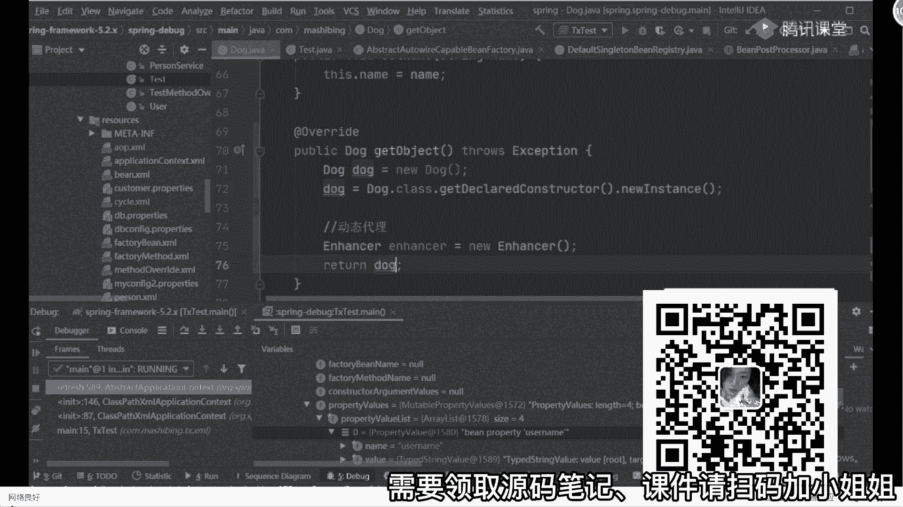

# 马士兵教育MCA架构师课程 - P74：BeanFactory和FactoryBean的区别 - 马士兵学堂 - BV1RY4y1Q7DL

不给了好了，来回到我们这节课上面，第一个变得生命周期能说清楚了吧，对不对，第二个重要的扩展点，第一个刚刚说的，你在执行post process里面post啊啊叫叫什么来着。

post in factory，post processor的时候，你可以有一个扩展点，那个模板方法，还有那个reflesh对吧，可以有模板方法的扩展点，除此之外，你的bb p p和你的b f p p。

是不是都是我们的扩展点对吧，这就是我们说的扩展点，你能把这三个东西给面试官说出来，足够使，因为一般人根本理解不到这个程度好吧，第三个。

bean factory和obligation context的区别不用说了吧，一个是它的子类实现而已好吧，第五个判断你对此的理解，看这个问题的时候，就按照我上课说的东西，这东西来来来来说就可以了好吧。

第四个问题刚刚没说叫bean factory和facing的区别。

有人没碰到过这个问题吗，就bean factory和factory bean的区别，有人问到过没，那我扣一这还有什么区别啊，其实区别点啊非常非常简单，大家说一下，in factory。

还有factor b，首先啊两个东西，两个东西他们都是用来创建对象的，明白了吧，都是常出现对象的，都完成这样的功能，但是我们在使用并better这种模式，来看看对象的时候，它类似于什么呀。

叫必须遵循完整的bean的生命周期，创建对象是不是意思，我问一下这个过程麻烦吗，复杂吗，你们觉得，不复杂啊，你第八下源码就试试了，你第八个下原版就知道了，很复杂，我刚刚带你看的时候，有很多逻辑判断。

跳过去的，没带你们看，如果你加上那些逻辑判断的话，它是非常复杂的好吧，所以我把它称之为什么呢，很简单，叫流水线式的创建对象，流水线式创建对象，然后就点个声音，改个能像没点烟好吧。

那第二个factory是什么意思，它更多是什么，也是创建对象，但是没有标准的流程啊，它更多类似于什么东西叫私人定制，什么叫私人定制呢，其实很简单，比如说这里面它这个接口里面会包含三个方法。

第一个方法叫什么呢，叫is singleton，什么叫tmt，很简单吧，判断是否是单例，这第一个一生都这样，还有第二个方法叫get object type，要返回对象的类型，还有第三个。

懂了要get obje，怎么着，要返回对象啊，它有这三个东西，它有这三个有什么用处呢，很简单，比如说我刚刚的报告打开我们的对，我如果在上面也实现了这个接口，这个实验在里面的方法。

这两个还有一个叫意思不分，这个如果是单位的话，返回true对吧，这不是太太保，可以返回dog。class对吧，第一个这个概率不变成，你可以怎么办，啊你怎么办，很简单，第一步。

dog dog等于又一个dog，可以不是6万，还有什么还有啥可怎么做，dog。class，点get deconstructed，点new instance，我是不是也可以返回一个到对象，对不对。

第三种我可以使用什么动态，代理嘛对吧，intensor enhancer等于又一个enhancer对象，然后在intel里面我可以设置一些set什么东西，设置一些东西，做完这些东西东西之后。

然后呢来进行进行创建，是不是也可以，然后最终我返回一个报告对象，是不是也可以，你是不是可以按照你自己的一个方式来进行，对象的一个创建，能明白意思吗，啊同学们是这意思。

所以就是他们两个之间的区别，来这块能听懂的同学给老师扣一听懂吗，所以把东西啊大家搞清楚了啊，这是这是我要讲的一些点，对于这几个问题，我希望你们在面试中，如果在面试被问到了啊，能够把这些东西啊搞清楚。

不要因为这些问题再被卡住，很难受啊。

同样的，刚刚我也带你们看了一下源码，一直在讲给大家捋思路，捋着思路。