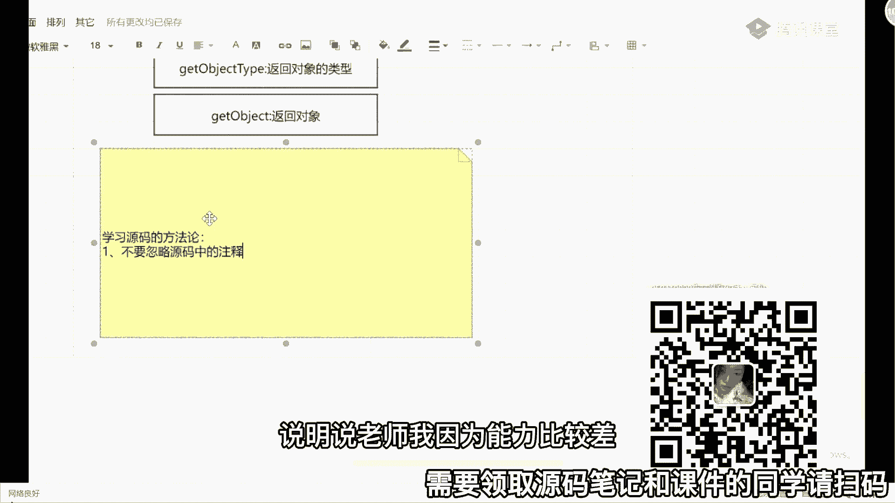
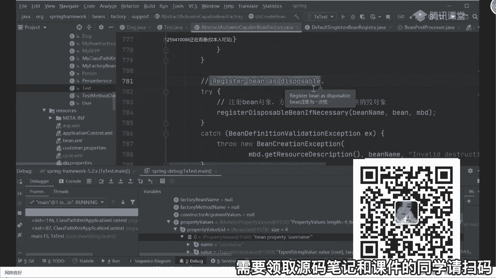
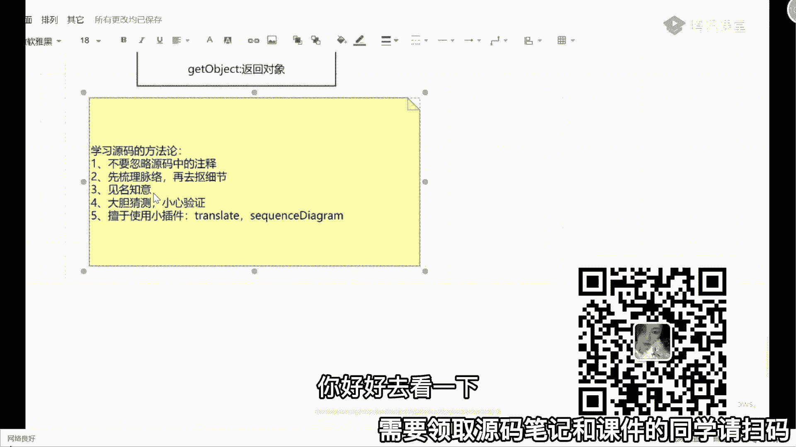

# 马士兵教育MCA架构师课程 - P75：源码学习方法论 - 马士兵学堂 - BV1RY4y1Q7DL

我问一下，听过我的讲解，你能不能总结出来说第一点啊，现在还有多同学觉得原版难的，给老师扣一，他多少同学原版难，不能的扣二好吧，按键怎么样，下面还不扣一哈哈哈哈哈哈哈，而那句话大家在看源码时。

为什么觉得难，是因为大家没入门或者没找到合适的方法，引导合适方法掌握好好学习技巧，你的学习效率会呈指数级增长好吧，所以呢下面我给大家分享个东西，要学习200的方盒，你们不要想着你们不要想着说老师。

你们有没有什么内部资料，我看完这些内部资料之后，我就能够就是把这些东西都理记得倍儿清楚，这不可能所有的技术啊，你记住，如果你觉得难的技术，他一定是所有人都觉得难，如果做完做简单的话。

他是一定要需要你去耗费时间和精力进去，然后能达到好的效果，如果你不耗费时间和精力进去，我告诉你根本学不会这玩意儿啊，它只能治标不治本，所以这里面有一些方法的东西，我需要给大家说一下，明白吗。

聪明人都是下笨功夫，这句话我非常认可，就不止一个人觉得难都难，但是你要反思一件事，就是越难的东西怎么样越值钱，把这事记心里面去好吧，学习开始哪些有哪些技巧，我不建议直接看书啊，看书会误导你的思路好吧。

看书会误导你的思路，另外有什么方法呀，第一个我要强调的，不要忽略编码中的注释，这一点很重要，很多东西啊，你们不善于看注释，源码里面，并不是说我每一行代码我都给你写注释了，并不是这样的。

而在关键性的地方我才会给你写注释，所以他写注释的地方，一定是他觉得这个东西可能会比较难理解，明白吗，所以你是必须要去看那些注释的，不要看着之后装没看到，你说老师我英文能力比较。

我看不懂注解怎么办，哎呀还有人问这样的问题，毒死人，你说这种东西它有什么看不懂的，你告诉我能不能这样啊，看到东西了吗，你能不能加一个翻译啊，大哥，怎么加翻译。

可以的，有很多插件，你翻译一下，就是这个第一点，第二点还有什么，叫仙督理脉络，好再去，抠细节，很多同学啊为什么看源码没有看进去，或者说为什么没有坚持下来，原因在于什么地方呢，原因在于很多同学手欠。

这个不是骂人的话，手欠什么叫手欠呢，就你在黑小马的时候，看到一个方法，总想点进去瞅一眼，看到一个方法点击瞅一眼，看到一个方法点击抽一等，你一直往里面点点，到最后之后懵逼了，诶我为什么要进来。

这个我干嘛来着，一脸懵，回过头来的时候也不知道自己从哪进来的对吧，这一看的时候也没看明白是个啥，就这样稀里糊涂的，你不要脸是吧，先输一场对应的脉络脉络，搞明白之后再去看里面的细节。

就比如我刚刚画了一张图，我今天我就看一个东西，就看xml文件的解析，明天就看具体的解析，后天就看being put process处理是吧，大后天就看实例化，大后天就看初始化，你一步步分开来看好。

先把脉络给他，一定要理清楚，懂我意思吧，不是这个事，第三点还有什么有建明之意，编码中的类接口好吧，方法它的名字起的还是相对于比较规范的，对你有时候看到那些方法名字之后。

你就足以猜测到他到底要表达什么意思，或者说这个到底干什么事，那这个时候你就不需要再点到里面去看了，没有意义没有意义，明白意思啊，这第三点第四点看什么东西叫大胆猜测，小新验证，你们听我bb了一晚上了。

感觉啊老师你讲的好牛逼啊，老师你讲的挺好的，但这东西是一定是对的吗，源码又不是我写的，只是我自己的理解而已，明白了吗，只是我自己的理解而已，好无力的，不一定对，只不过说能说得过去，或者说能自圆其说。

你们也是一样的，看到一个功能之后，不想去想它这么设计的原因在什么地方，他这么写的原因在什么地方，为什么这么写，去猜，猜完之后去看它的详细的逻辑处理过程，这么做到底是为了啥，搞清楚这些东西。

明白意思吧好吧，然后第五点，什么叫善于使用小插件，比如刚给大家说的翻译的translate对吧，比如说还有个东西叫sequence diagram，都可以用这些插件，你好好去看一下好吧。

理解一些东西，然后第六点很重要一点就是坚持，有点东西肯定是难，谁都知道难，我也知道，男好吧，你们所有听课的人都觉得这个东西难不难的话，你们就不会来听课了，好吧，难不怕，但是你要坚持下来。

别跟我之前讲课的时候举个例子，我说很多同学这个时候为了考四六级，背了4年就记住一个单词叫abandon，就放弃看东西都没记住，不要这样，你一天看一点点，一天看一点点，不要什么，每次都开始从头看。

你每次从头看，每次什么都记不住，明白了吗啊，所以一定要坚持走啊，搞明白这东西，你把这东西搞清楚，他会的就是会的，哪怕你忘了，你整体的逻辑思路线是不会断的，而如果你不看这东西，我告诉大家。

你以后可能会越来越难受，当有同学问我说老师源码是什么样的知识的，同学会问，你觉得沈阳这些同学会问，就是你拿多少薪水，可能会问源码，你们觉得，其实坦白说，原来的时候问原来的人其实并不是特别多，源码。

其实原来没没那么多人问，真的没那么多人问，好吧，大概就是问一下，变成生命周期，把你一背背完之后，ok结束了啊，你不用再问这东西了，但现在几乎你的薪水，如果想要到20k以上的话，基本上都会问到这东西。

问东西原因是啥，你说你工作能用吗，同学们，我问一下你工作能用吗，有很多同学都问我老师，我学学法的原因是啥，是因为我工作都要用吗，不是你工作中，我告诉你，就你们天天写一些c l o d业务逻辑代码。

