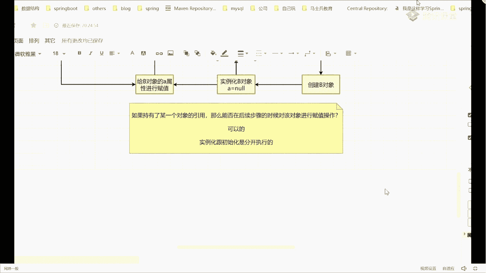
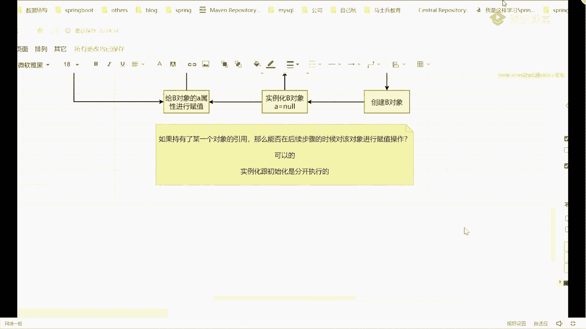
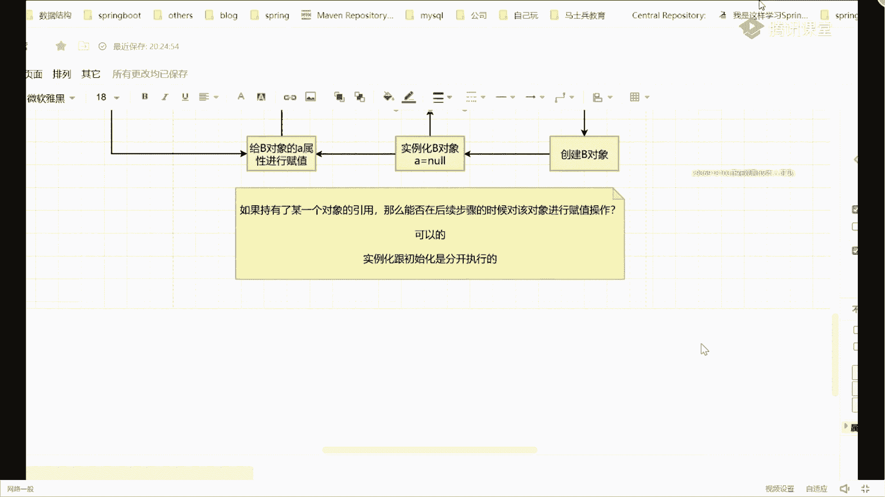
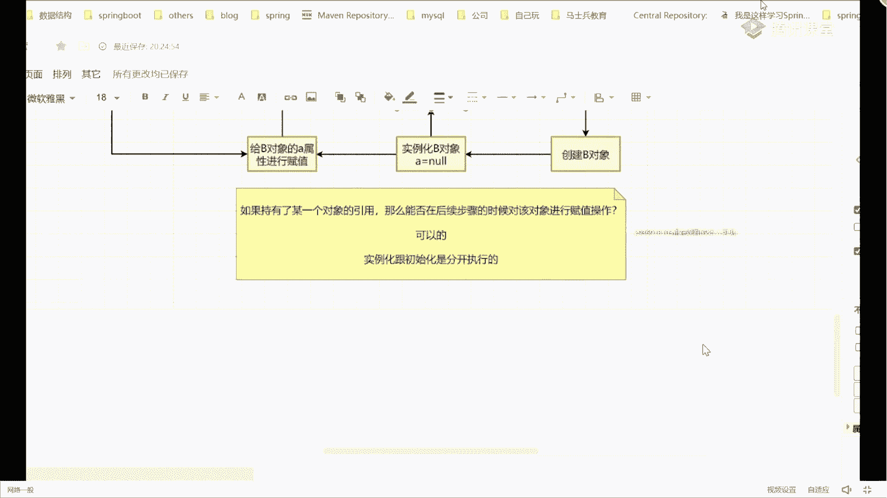
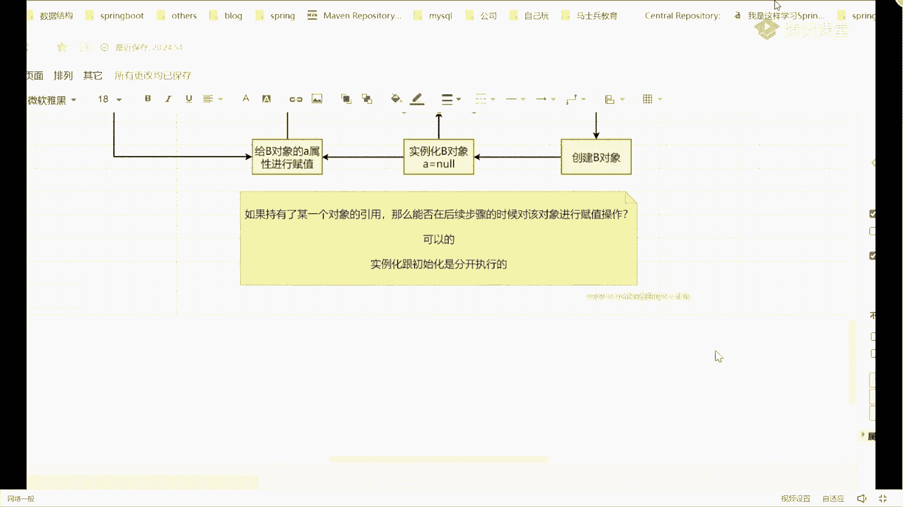

# 系列 6：P77：图解循环依赖 - 马士兵学堂 - BV1RY4y1Q7DL

好吧废话不要这么多，下面我们来模拟一下a b两个对象的创建过程，因为啊我现在有两个ab对象了，那我在创建之前就意味着一件事我怎么做呀，首先第一个步骤画一个图啊，看看这个图，第一个叫创建a对象。

这没问题吧好吧，我问一下创建a对象的时候，要包含几个步骤和环节，第一个是什么，第一个是啥反射实例化吧，我们还有我刚才说了啊，我们说的时候只说这几个步骤，实例化也就说对吧，实例化就是绿化a对象。

当我完成a对象的实例化操作之后，我的问题是这里面的b属性此时是等于什么值，b是什么值，默认值吧，等于空对吧，然后紧跟着第二个步骤要干嘛，是不是要给，a对象的b属性，变形赋值了，那么在进行赋值的时候。

大家应该知道容器里面的对象默认是单例的，也就是说有且仅有一个对象，这下面我会去判断一个东西，判断啥，判断我们其中是否有b对象，那是否有的话，就意味着一定有一个事，下面会有两个路径，有或者没有吧，好吧。

来往上写，如果没有，如果有有的话怎么办，如果有这个值，那ok我直接赋值即可吧，是不是接完成负值了，赋完值之后好了，把它给回去结束了对吧，那如果没有呢，没有没有，它意味着下面我干嘛叫创建b对象，什么意思。

而创建b对象的时候，因为你要遵循完整的bean的生命周期，所以整体的流程和步骤是一模一样的，所以第一个步骤干嘛叫实例化b对象，当我把b对象实例化完成之后，紧跟着里面的a属性等于什么值控制吧。

依然是默认值等于now，当闹完了之后，紧跟着再进行一个事，叫做给，b对象的a属性进行赋值，那赋值的时候，这上面一样必然要经过一个判断，判断一下你到底是判断一下，判断容器中是否有a对象和我电。

要进行判断一样，两个步骤，要不然有，要不然没有，如果没有，先写有吧，叫直接赋值即可，然后把条线连过来，写一下，有是这样的，如果没有，没有就这个步骤，这能理解吗，我刚刚画这个步骤没问题吧。

所以在我刚刚画的这个步骤里面，你能不能看到一个非常简单且直接的闭环操作，这么长吗，小一点，看这个你看到了吗，这就是我们说循环依赖吗，在整个整个执行过程里面，它形成了一个闭环嘛，是这意思，死循环吗。

那死循环其实就是我们要解决的这个，循环依赖的问题，这是为什么面试中经常问这个问题，好吧，那我们怎么样去解决这个问题啊，很多同学在遇到这样问题的时候，说老师完了形成闭环了，这个闭环我要怎么解开。

你记住所有的闭环不只是循环依赖啊，任何地方你在遇到闭环的时候，你要想解开这个闭环思考的维度是什么，在哪个地方是最后一个步骤落成了闭环，我们刚刚画这张图的时候，在这这个步骤是形成闭环。

假设这条路径如果没有的话，把删掉，如果没有的话，还会有这个闭环吗，不存在了吧，所以这个事你就要思考一件事，我能多把这条线给他干掉，比如说这个线发生存在，因为这条线只要不存在，ok我的闭环就没有了。

那这个时候你就要思考另外一件事，同学们什么事情呢，我这是要去查找我们容器里面是否有a对象，那你告诉我在整个容器的创建过程中，我在整个对象的创建过程中，到底有没有a对象就执行到这一步的时候。

有没有a对象有，有吧其实是有的吧，好吧，哪创建a了，在刚开始的时候，我们在执行前面这块的时候，其实我已经把a对象给创建出来了，只不过此时的a对象，它不是我们理解的那种完整对象，是一个非完整对象。

所以此时我来给大家一个描述，就是你们在很多帖子上看到的一个描述，第一个描述什么叫成品对象，第二个叫半成品，半成品，什么叫成品，什么叫半成品呢，很好理解，所谓的成品指的是完成实例化且完成初始化。

那什么叫半成品呢，也是一样的，叫完成什么实例化，但未完成初始化来这两个东西能理解的，同学给老师扣一能理解吗，什么问题吧，很简单的一个知识，所以当我拿过来这块之后，你会发现此时我在找a对象的时候。

a对象实际上是有的，那你告诉我a对象现在是成品还是半成品，层面上慢慢变半成品吧，我说了不是完整对象吗，所以是个半成品，那这个时候就会有一个问题，同学们听好了，我下面这段话的描述。

如果只有了某一个对象的引用，那么能否在后续步骤的时候，对该对象进行赋值操作，能还是不能最小吗，你们看这字儿再大一点，看的东西，这能理解吗，就如果我持有某个对象引用，能否在后续的时候给它进行赋值。

可不可以，可以吗，因为你在堆里面生存的空间，说白了就是一个地址，我只要有一个指向性的一个地址，那好了，我就可以干嘛，拿到b地址的引用来进行对象的一个复制操作，对完了吗，对这个步骤是可以的。

如果是可以的话好，那现在你要去想一件事了，想什么事，我们再把刚刚那个步骤重新去执行一遍，刚开始我先去创建a对象，创建完a对象之后，紧跟着叫实例化对象，b等于n，我现在把这个对象我放到一个结构里面去。

什么结构呢，在中间这块我放一个map结构，这可以吧，那分结构在结构里面段位是我放的时候，因为现在上创建出a对象了，对k的值就是我们的a没问题吧，我问一下现在的a是什么状态，成品还是半成品，啊。

成品还是半成品啊，半成品吧，我把这个半成品对象先记录到我们map里面去，或者说先放到我们map结构里面去，把这来连起来，紧跟着我开始给a对象里面的b属性，进行赋值操作，在赋值的时候。

紧跟着我要去判断容器里面有没有b对象，同时我判断一下当前的缓存里面，它有没有b对象，我们通过这个判断，你能判断出来，这里面我中间画了个map里面那包含了b对象吗，看有没有对象，对不上有吗，没有吧是吧。

没有没有的话好了，我紧跟着往下面走，到这步叫创建b对象，当我执行完实例化b对象之后，会紧跟着我往上，我也连一条线过去，那此时我可以把我们的b对象也放进来，b冒号它也是一个半成品，没问题吧。

我把b对象也放进去了，当我把b对象也放进去之后，紧跟着我开始给b对象的a属性赋值，那么我这块在进行查找的时候，我能否从这个容器里面去找到，我们当下的a对象，你告诉我能不能取到，真难对啊，算了不对了。

好吧能吧能吧，如果我这样可以取到这个对象的话，你告诉我我这条线还有必要存在吗，没了吧，我是不是把它给干掉了，这样说好了，我取出了我们的a对象，当我取出a对象之后好了，我把a的属性给它赋值。

当它赋完值之后，你告诉我现在我们的b是成品还是半成品，成大范成品什么什么，因为你实例化出来都完成了对吧，所以这时候有了一个b的，我们叫成品对象，注意思，然后呢再跟着往回走走走走，走到这块。

刚刚我为什么要创建pc向来着，我创建b对象的原因是什，么，是为了给a里面的b属性赋值，现在我的b对象已经创建完成了，并且变成了一个成品对象了，你告诉我，我能否给我们的a对象里面的b属性，进行赋值了。

能不能，可以吧，是不是可以，你先不要先不要管三个缓存里面放什么东西，你跟着我的思路去走，就这时候我可以给a对象里面的b属性赋值了，那赋完值之后，我现在的a它是成品还是半成品，a成品半成品，成品吧。

那我是不是可以把我们的a对象，我也放在这个地方，a冒号成品，那你告诉我，当现在这个步骤完成之后，我的ab对象是不是都已经创建完成了，我都创建完成之后，你告诉我，我还会出现我们刚刚说的闭环问题所在吗。

还有闭环吗，不会吧，是闭环就没有了，变化没有了，所以你来告诉我，我们在解决这个循环依赖问题的时候，它最本质的点在什么地方，在什么地方在o p跟op有什么关系，man哈中间有缓存吧。

所以为什么要使用缓存来解决这个东西，其实最关键的点并不在于这个mac map，只是为了帮我们把这些对象提前放到一个地方，这还不是最主要和最关键的，最关键的是什么，最关键的是叫实例化和初始化是分开执行的。

这才是最本质的东西，就像红桃六说的，红桃六说的叫实例化和初始化去分开，能懂能懂我意思吧好吧，所以它是分开执行的，所以他能够解决这个问题，当然这个东西啊，我只是画了一个简单的图示。

通过图的方式来给大家解决，图之后一定看到会有问题，老师你这个map里面a有成品有半成品，b有成品有半成品，这肯定是不对的，好吧，我们要怎么去解决这个问题，或者说我要去怎么来分割我们对这个缓存。

那这个时候你就想，我能不能把不同类型的对象去，放到不同的map结构里面去，可以吗，这是不是就可以做一个最最最基础的分类了，明白这意思了吗，所以这个下面我们要思考的一件事啊。

但是就算我要把这个东西按照类别来分类的话，你也会发现，其实我好像需要两个map就够了，一个map放半成品，一个map放成品是够了，我完全不需要用三级缓存啊，我为什么一定要说是使用三级缓存。

来解决我们的循环依赖问题呢，所以这是下面我们要探究的一个问题点，我把这些东西给大家标注个颜色，你可以看到一件事情，他们的执行步骤其实都是差不多的，这不就是断对象整体的一个创建过程吗，是差不多的啊。

把这东西好好搞清楚，那把这个图先说这个图能理解的，来给老师扣个一，能理解吗，图啊是我带着你们引导你们的思路，然后呢去进行一个解释，那这个实际上是不是这样的，我们来进行一个验证，好吧好吧，怎么验证。

我说了，我们一定要去看代码，如果你想把这东西理解透了。

你不看代码简直就是耍流氓，所以代表你是必须要看的好吧。

怎么看这东西，先问第一个问题，谁真正的见过三级缓存到底指的是哪。

三个mac结构，谁能告诉我。

都在说三级缓存哪哪三个满分，啥是半成品。

我上面不是解释了吗，成品表示什么叫完成实例化，写完成初始化，什么叫半成品，叫完成实例化，未完成初始化，不解释这东西了吗。

