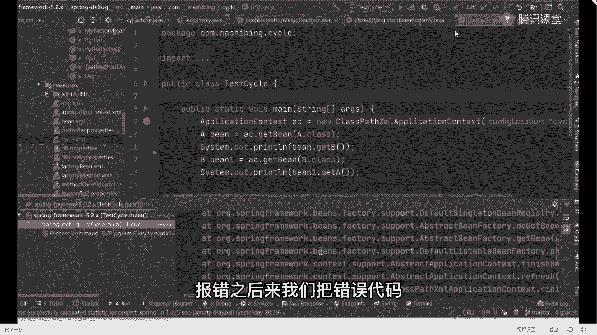

# 马士兵教育MCA架构师课程 - P80：金三银四循环依赖面试题总结与解答 - 马士兵学堂 - BV1RY4y1Q7DL

你只要把这几个思考的问题搞明白之后，我回来之后，你才能真正的理解循环依赖到底是如何解决的，好了，下面我们开始采用一问一答的方式，我来问，你来答，第一个，三个map结构中分别存储什么对象。

先说一级缓存放什么成品对象对吧，二级缓存放什么。

半成品对象好了，三级缓存放什么，long的表达式，哪个浪费达式叫get early，变reference，对吧，记住这个名字，好了，来第二个问题，三个缓存map缓存的查找对象的顺序是什么样的，嗯什么呀。

先查一级缓存，找不到，啊这二级缓存在找不到，找三级缓存问题吧，好了来第三个问题来了，听好了，三个问题，如果只有一个map，能否解决循环依赖的问题，不能为什么，你要说清楚为什么好吗。

你不能光说不能为什么为什么不能，无法解决闭环本质上不是这样的，如果，只有一个map，那么成品对象和半成品对象是必须要，都必须要放在同一个map中，而半成品的对象是不能够暴露给外部使用的啊，所以必须。

要做区分吧，否则就有可能造成什么，所以就有可能暴露半成品，对象能理解吗，能进来扣一，有人之前提出过解决方案，说老师那可以啊，我只需要在map的value值里面加一个标志位，就行了吗，如果是零表示半成品。

如果是一表示成品，这样不也不不不也可以吗，对吧是这样的，我给大家整加一标位吧，是不是可以，你疯了吧，明明两个map可以很轻松的解决这件事情，为什么你要加一个标志位，你要考虑是什么。

你如果加了一个标志费之后，意味着每次在判断的时候，都要去取一下这个value值，你麻烦不麻烦，是不是意思明白意思了吗，为啥不能暴露战平，你半成品里面的属性都是空的，你你你你你你告诉我，你报出去干啥。

那没用，用完之后你你报一个空指针，你何必呢，你要觉得不麻烦，你就加b加一个前端的后缀，行，你要想这么干就这么干，你自己来评估哪个效率高，哪个效率低好不好，你自己来评估这件事情就完事了啊。

这就是设计方面的原则，ok来紧跟着第四个点，第四个问题，如果只有两个map，能否解决循环依赖问题，那么，现在还在为成品和半成品的事，我解释过了吧，我不再解释了好吗，能吗，能但是有前提条件，什么条件呢。

写到一边，我问一下，在刚刚的整个debug的环节里面，你在哪些地方看到了三级缓存，哪个地方，本产品russip产品了，啊这个地方两个地方用到三级缓存吧，第一个方法叫什么。

叫都create b方法里面有3d缓存，第二个叫get singleton，这样画吧好吧，那我们先来做一件事情，把源码改了好吧，我们改下源码，看能不能行，平常心说，这是录播，真对，这是录播，是录播啊。

录播录播录播。

抢了一晚上的录播直播来找那方法叫do create be，好找这行。

我们在刚刚进行的时候，我是不是看到了三级缓存的存储，我把这行代码给干掉，注释起来，然后我把下面两行代码给打开，看到同学们下一行代码，三级这几集缓存，这几款三二级吧，我没往三级里面放这个东西。

把它改成二级三级缓存，注释掉了，不要了，注释掉不要了好吧，然后紧跟着第二个地方叫get singleton。

这个方法一样的，我把这个东西逻辑都改掉，直接注释，说完之后改成我自己写的，来看一下这一段的代码逻辑，它有没有三级缓存存在，没有吧，是没有好吧，所以我可以做这件事情，我可以做这件事情好吧。

然后我们来掌握我们的警卫，我把d盘的东西关掉，来找到我们的启动词类，然后右击run，我们来看一下它是否会报错好吧，如果没报错，是味着可以解决，我来看看这里能不能能能不能行，会报错吗，会报错吗，不会嗯嗯。

马洛卡，没软件了，换啥软件，这编译啊，等着编译，换电脑来，我来看，这是b对象，这是a对象，我的ab对象成功了吗，成功了吗，成功了吧，没报错吧，是不是报错，但是同学们，你注意一件事，我现在改点东西。

改点啥，打开我的配置文件，把这行解开，把这行解开，我加入进去我们a op的相关配置，然后我再来重新运行我们的代码，右击wrong，重新运行所存运行，看效果，好了已经报错了，报错之。

后来我们把错误代码错误的提示给大家翻出来。

大家要学会去看这样的错误提示，因为测试题库提示里面，给了我们很多的一些信息，来截一下好吧，盖帽是异常，好了，大概分成四段吧，换成四段之后，前面这个东西告诉你说是什么异常，解释一下a对象出现了什么问题。

告诉你说可能出现了循环引用是吧，但是看中间这一行是最主要的一句话说，this means that that other beans。

do not use the final version of the bean，这句话怎么翻译啊，这意味着好吧，其他的并对象并没有使用叫the final version of the bean。

叫最终版本的并对象，这里面怎么还会涉及到版本的问题呢，来看好下面的思考和解释，这个时候重头戏来了，就是为什么要使用三级缓存来往下看，最后来说说能不能解决循环依赖问题可以，但是有前条件，什么天气条件。

循环依赖中不包含好吧，a op的处理逻辑只要不包含a o p好了，你就可以用二级缓存来解决循环依赖问题，但是出现a o p问题之后，我们就必须要解决这个事了，好吧，那第五个问题，警力来了。

为什么三级缓存，就可以解决a op过程中的代理啊，关注解决，解决循环依赖中，代理对象的问题，为什么呀，这是录播吧，对是录播，是的，为什么呀，来同学们听好，不不不不要不要的，这些录播直播了好吧。

下面的东西来了好吧，下面的东西关键点的东西来了，这里面我会抛出几个问题，听好了，第一个，创建代理对象，这时候好是否需要创建出原始对象，需要吗，需要吗。

你想想我刚刚在你提拔的过程，想想我刚刚在一个debug的过程，需要不需要在没生成代理对象之前，是不是已经创建出原始对象了，为什么，因为我们在创建对象的时候。

主要是do create in这个方法，在这个方法的最上面就已经，是不是把原始对象给创建出来了，后面在这个里面，的being post processor里面的方法，里面是不是才会生成代理对象。

是不是一定需要，因为你的标准的病的生命周期，有这样的要求和规范，就必须要生成，所以这个地方是需要的，需要明白意思吗，需要是吧，紧跟着第二个问题，同一个容器中。

容器中能否出现同名的两个，不同的对象，能吗，不能是不是意思肯定不能吧，这不用我解释了吧，肯定不能好吧，点开了第三个问题，如果一个对象被代理好吧，那么代理对象跟原始对象应该如何去进行存储。

本来的对象和代理对象并不一样吗，一样啊，最后说了嘛，这同名的两个不同对象吗，同名的两个不同对象吗，因为你名字一样都叫a，但是a里面可能是原始对象，也可能是带对象嘛，两个可能同时存在嘛，这时候怎么办。

好了同学告诉我答案说存代理对象，为什么存代理对象啊，凭什么就存在对象，这没道理啊，不能说你存在，你就说你说存在就存在理吧，什么意思啊，所以应该怎么去做，怎么记住，如果需要代理对象，好吧。

那么代理对象创建完成之后应该干嘛，覆盖原始对象吗，这能理解吗，叫覆盖也是很强的理解吗，能理解来归一，真的不理解，可以吧，当你当我提到这个覆盖这样的一个名词的时候，你有没有点感受，有点感觉啊。

在之前的某个步骤中，好像出现了补钙的过程在哪儿，哪，get early，reference方法中会判断是否需要代理对象，如果创建出代理对象了是吧，那么就需要补钙，是不是一个更能理解来扣一，对吧。

再想一个问题，那在对象对外暴露的时候，我怎么知道，或者说容器怎么知道什么时候需要，呃被暴露了，比如说我在对外暴露的时候，我怎么对外暴露，我什么时候对外暴露啊，啊或者换句话说不要这样说了，这样说吧。

在对象对外暴露的时候，如何准确的给出原始对象或者代理对象，因为因为正常的代理对象的创建是在，b p p，后置处理方法中在，解决循环依赖问题的时候，还没有执行到那个地方，是不是意思怎么办，我该怎么操作。

明白不，啊所以此时需要拉姆达表达式的啊，类似于是一种回调机制，在确定要对外暴露的时候，就唯一性的确定到底，代理对象还是原始对象，这也是为什么啊不把对象直接放到二级缓存中，而通过三级缓存。

把lava表达式的方式来执行的原因来，这句话能看懂吗，能看出来扣一，看能不，因为我不知道什么时候都在暴露，我没办法去确定好当前这个时间好吧，所以我在设置的时候，我就直接只会把我们的哪去了。

所以我因为我没办法确定什么时候对外暴露，你app being post processor，昨天讲过了啊，因为我没办法确定他什么时候都要暴露，所以此时我干嘛，我放一个拉姆达表达式进去。

如果这个对象在整体的调用链的处理逻辑里面，我需要变成一个什么，变成一个属性给他引用出去的时候，那么好了，我就去执行拉姆达表达式，而在这个lambda表达式里面，这里面我可以预先的做一个if逻辑的判断。

来判断一下我是否需要进行代理对象的创建，那么在这儿创建出代理对象之后，我还需要去在b p p里面执行，我们对应的后置处理方法吗，还需要不需要了，还需要吗，不需要了吗，写错了，啊bpp，写全。

是不是这意思能听懂吗啊，如果如何，哪，找不着了啊，你们你们你们自己找吧啊，如何，能懂这意思吗，来刚刚这块能听明白，同学12q1 ，能听懂，不，来再说一遍啊，那么听好了，正常情况下。

如果我一个对象需要需要被对，需要进行代理的话，我怎么办，正常一个对象需要在一个在哪，你需要在哪进行处理，告诉我，正常的一个对象，如果需要生成代理对象，我在哪处理，我是不是要执行到我们这个方法之后的。

这个里面，这里面再进行处理吧，是不是在这这里面之后，我才能去这里的构成处理方法里面生成，我们再在理想，但是我们在进行处理这种循环依赖问题的时候，我有执行到这个步骤吗，同学们，你想想我有执行到这个步骤吗。

根本执行不到这，如果执行不到这的话，我就要在这里面进行处理，那在这里面处理的时候，其实我程序是写死的，程序其实没办法判断说你什么时候，这个对象需要被其他对象进行一个调用，或者需要变成某一个对象的属性。

我是没办法确定的，所以我把它干嘛，我把它放成一个拉姆达表达式，这个时候我并没有具体的执行，我换成拉姆表达式之后好了，我放到三级缓存里面去了，我刚刚在调用的时候，你想我先创建a对象，然后创建b对象。

在创建完b对象里面，我重新的去三级缓存里面，找到了这个拉姆达表达式，然后来执行判断说，我到底需要是否需要代理对象，是不是相当于把这个东西前置了，因为拉表示这是相当于一个回调机制，它并不会立刻执行。

就当你需要给这个属性进行赋值的时候，你才会执行，你不不值，你需要执行吗，需要执行吗，不需要吧，你懂我意思了吗，所以这就是这个拉表达式存在的一个意义，就为什么用拉普达式之后。

会用三级缓存之后就可以支持这个功能，就因为这个东西对我一直来说，我说你详细看这个逻辑，他的逻辑是什么样子的，刚开始有一个这个东西是吧，刚开始原始对象放给暴露，如果需要被代理好了，我把它变成代理对象。

我对外反馈的都是这个已经暴露的对象，这个东西明白意思了吗，你某一个对象的代理值可能是一个吗，对不对，如果你是多个代理的话，你就要看你代理对象创建了一个顺序了，你懂我意思了吗，来刚刚这块儿。

因为麦同学给老师扣个一，其实这题我跟你聊啥，不是聊一个时间问题，什么时候需要对外暴露，程序没办法确定，所以需要通过拉姆达表达式的方式，在确定需要对外暴露的时候才执行对象的确定。

确定啥也就是确定到底是原始还是代理，就这意思，好吧，和你说，那把la表达式放到二级缓存里面去，二级缓存里面执行不就不需要三级缓存了吗，那你告诉我你的成品对象和你的半成品对象，你要放哪，你怎么区分啊。

别忘了你的三个缓存里面，一级二级能放是object，而三级里面需要放拉姆达，是必须用object factory，他是没办法直接放对象的，6662阶段是没法直接放对象了，听明白了吗，明白意思吧。

哦所以下去之后自己再好好去debug，再好好去操作一下这个对象的一个操作，你大概就能够理解了，就是为什么，但在代代代理对象的时候，他必须要有这样的一个流程啊，他怎么知道哪些类需要被代理呢。

只是冲突就回去，还是集成某个类，某个接口类这种带对象，你什么时候需要配代理对象，你不知道吗，你城里面是配好了，这配置电车已经配置过了，面子，好吧这样搞清楚了，那这个时候就会突然有一个问题啊。

同学们想好了，就是什么里面提供了循环依赖的解决方案，你们在日常的实际的工作环境里面，有没有遇到过循环依赖的问题，6万为什么呀。

为什么它已经提供了循环依赖解决方案，为什么我们工作中还是会遇到呢，为什么，同学们注意一件事儿，spring是一个跟业务无关的技术框架，好业务在满足它只能是预先预防一些问题，而不是解决所有问题。

就跟我们写代码之后的异常处理一样，你能预先判断到一些问题，但是不是所有的异常情况，全部，都能解决掉的，能理解吗，同学们来这儿能记的东西多少扣一，他只是给了我们一个一种预防方案，如果你是这样的方式的话。

ok没问题，我可以解决，但是如果不是这种方式的话，不好意思，找人办不到，你写异常背也是一样的吗，你能保证你写的程序没办法是这意思，比如说你在用spring bot的时候，最基本的数据源那个异常循环依赖。

你在引入一些那个连接词的时候，数据这个问题最常见的吧，这个时候当你出现这种循环依赖问题的时候，你就要去排查了，什么时候出现这种循环依赖问题，我的循环它到底怎么解决的啊，到底怎么去做的。

应该怎么去排查这个应链的关系，这个时候你要根据你具体的代码逻辑，去进行具体的解解决了，而这句话他不是所有东西都可以解决掉的，好有同学说老师我可以加and lily来加载，可以几个一部分。

但也不是全部明白吗，所以根据实际情况来进行实际的一个解释好吧，终于讲完了，来什么感受，小伙伴们二表达你的感受，一个圆形，一个单例，两个循环依赖会报错吗，会，脑子不够用，我是谁，我在哪，哈哈哈哈对啊。

你就想一件事，同学们像这样逻辑，其实你应该去怎么办，大家都尽力了，大家尽力了，其实你应该怎么怎么做，其实非常简单，你可以去进行一个基本的操作，什么操作你可以去试一下，按照我刚刚的解决的方案。

你可以去调用一下好配置，上我们具体的理由逻辑，你可以琢磨一下这个事儿，如果你听到一件事啊，如果我现在我在带着你debug，你现在都听不懂，你在自己写的时候就会很很懵。

而你们现在很多同学都听不懂的原因是什么，是因为我刚刚带着你们过了一下思路，但是仅仅是过了一遍，你在脑海里面并没有形成那样的一套思维逻辑，懂我意思吗，其实我们可以画一个图出来，你就大概理解了。

来看看流程图，刚开始的时候我是创建a对象，听好了，a对象行了，直接写吧，叫实例化，对象嘛对吧，然后再开始叫初始化，要给a对象的b属性，赋值对不对，在赋值的时候你要干什么事儿，复制干嘛。

是不是到一个问题叫创建b对象，但这个时候中间会有一个环节，别忘了再给它实例化，完成之后。

在中间这块，把a对象，是拉达表达式，放到缓存中，单集中，缓存，这种地方同学们，这没问题吧好吧，然后下一步在干嘛，应该创建b对象了，刷新对象完成之后，紧跟着下一步是不是b对象的，然后表达式也放进去。

然后紧跟着干嘛，是不是该给，b对象的a属性变形赋值吧，那么在赋值的时候要干嘛，要查找a对象了，那么查找对象会去哪儿，会从哪取，那干嘛会从三级缓存中获取到谁是不是a对象。

好但是此时的a对象放的是拉姆达表达式，我问一下，在这个步骤里面，在我这个步骤里面，我现在因为要赋值了，我现在要不要给出一个确定的a对象，我要不要给a一个确定对象，这是不是一个明确好时间点了。

但在前面那个流程里面的时候，你是并不知道我什么时候用的，那你这个时候你确定需要一个a对象，你告诉我你怎么办，你不要不就需要通过那个lam表达式里面的，get in get，这里并。

reference方法来确定到底返回的是，原始对象还是，代理对象吧，你这是不是要联储决定好了，这不是训练好了，那你这个时候只能通过拉表达式里面的，什么叫get get方法，你只能在这里面通过get。

哦不对的方法去交通确定了吗，就这意思吗，好吧，这东西啊，我觉得我不要再讲，讲完之后你们脑海里面没有这样一个图，你没有这样的图，你脑海里面你是很难转过这个弯的，所以我觉得下去之后按照我说的那个思路。

把刚刚那个流程再重新的去进行一个debug操作，因为在整体这个创建链路里面，我是不知道什么时候确定的，但在这个步骤里面，我因为要赋值了，所以我必须要确定出一个具体的对象，然后才能够进行给它赋值。

明白意思吗好吧，所以这一定要搞清楚了好吧，这东西还是要明白呃，这东西我自己啊在学习的时候，自己在看的时候，我自己本身我也琢磨了很久，我也琢磨了很久，所以这东西你下一步你说你光听我讲一遍。

你就把这东西完全理解透了，我觉得不太不太现实，更多的是什么，你自己一定要去实操，实际的跟着这个逻辑好好捋一下，捋通一下，真的你自己不用多三遍提bug，你能提拔下来，基本就通了，但是你如何去debug。

我刚刚在刚上课的时候，我已经说过了，你就叫你先不要考虑三个四个带有象好不好，别考虑事，同学们，你先想把一个东西想明白，你先把一个东西想明白之后，你再说三个四个代理对象怎么处理，你一个都没搞明白。

你现在搞三四个，别给自己找事儿，憋着要找找麻烦，一步一步来好吧，好了，这东西我觉得就聊这么多吧，好吧对点了个蚊香，有蚊子咬，我点个蚊香是吧，呃这东西啊，咱们就聊这么多吧好吧，下去之后还是那句话。

一定要自己去实操，你不去思考这东西，我也不知道该以什么样的方式去给大家进行，讲解了，因为我在讲vip的时候，这块我也是一样，我讲了就讲了挺久的，就讲了特别久，就这东西我也讲了，给同学们讲了很多遍。

很多遍可能还是比较难理解一点，但其实最关键和最核心，还是你自己缺少这样一个逻辑思维，或者一个线性的一个贯穿过程，如果你真的能把这个贯穿过程给贯穿下来的话，其实真的还是相对比较好理解的，好吧。

来今天晚上的课，觉得有收获的同学给老师扣波六吧，好不好，啊你们扣六，我就我就我就我就放心了，我就放心了，那在面试的时候，你去回答这样的问题的时候，你就知道怎么去回答类似于这样的问题了啊，好好去回答。

而是那句话，原版的问题啊。