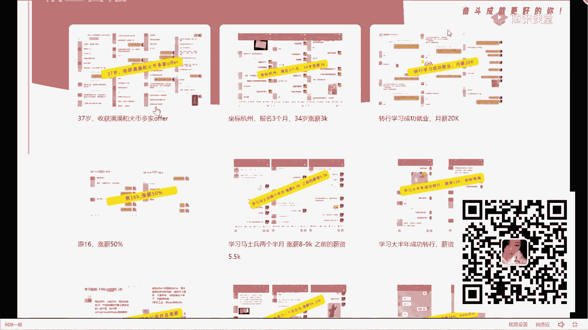

# 系列 6：P81：如果进行系统的学习提升？ - 马士兵学堂 - BV1RY4y1Q7DL

今天下午的时候也是一样，在咱们的一个群里面是有同学分享一个念经，我不知道有多少人在那个群里面给大家看一下，他分享的是面筋，但没经过他自然允许我发一下，这个同学如果介意的话，我给你道歉，非常抱歉。

我不知道这学们来上课，就是啊他分享一下他面试的一些面筋，就是这个东西啊，一会儿下课之后可以给大家分享出去，是他面临一些公司吧，什么小红书啊什么之类的，就是我分享的是吧，我我可以给大家看一下吗。

这同学大家看一下这个同学分享了好吧，这些同学分享了，我给大家看一下，好吧，就是大家很多人可能最近都在面试啊，我把这个东西收藏了一下，我觉得这个问题呃，这里面发这些问题，我觉得挺好的啊。

因为这个这个问题其实坦白说它是非常全面的，你们其实可以自己去看一下，他到底问了啥啥东西，诶怎么点不开了，诶，我收藏点离开吗，重开了吗，点开我找一下在哪个群里，知道了。

我想给大家发一下这个同学免费分享出来的，我觉得挺好的，大家其实也可以分享一些这样的一些面试题，就是然后他发的东西我觉得挺好，看这个大家自己总结的，那面试问什么，现在面试确实问的话难度会很高。

你们可以了解一下，比如说他们到了海内外工作原理，1。81。7的区别，卡卡的smap的原理，synt是并发编程的线程池，并发编程的ur卡是我们的注册与服务中心啊。

spring cloud zk是我们lukeeper，然后bean的加载原理，3d缓存，redis是我们的缓存吧，reaction log sync的区别，这东西是我们的并发编程里面的好吧。

masterc下次聊聊到了隔离级别怎么解决换图，然后索引sql优化对吧，下面有卡夫卡的东西对吧，有分区的一些配置，相信有居性啊，还有a q s也是并发编程里面的slocal对吧。

强化入侵引用cm s垃圾回收器的，包括像redis一些东西，mysql一些东西，什么m v c c标sher这些点，然后还有一些算法的题，rise的题对吧。

bean factory和factb的区别主要降低很多，看完这些东西吧，就是这些点都是面试中现在问的比较多，或者比较常用一些点，这是算法上面的问题对吧，都是算法的问题，所以现在的面试啊。

基本上考核的东西是比较多的，写一个什么缓存类的啊，去提交一下这样的问题啊之类的，你们可以看一下这些问题，真的就这些问题你可以自己浏览一下，你到底能解决多少，或者说到底自己能理解多少，这东西啊。

就是现在面试的难度，我自认为我觉得这东西挺好，为什么挺好，原因非常简单，我觉得这东西啊啊，这个面试如果是一个面试里面的，如果一个面试里面的，我觉得真的问的挺全面的，这个东西最起码是高开。

或者说初级架构师这个级别才会面试，问到的问题，明白意思吧，编制的问题啊，包括天下午我们一个学生也是一样，他也是给大家分享一下面试题啊，延时间面试题，你们下去自己看一下好吧，给大家看一下，就这个学生啊。

他最近在面试，你看这题会不会啊，你们你们看自己会不会啊，那聊了很多啊，你可以瞅一眼，往哪看用户如果有用户反馈进入个人中心好吧，个人时间很长怎么办，那怎么定位。

怎么通过sql语进行优化来看压制怎么排查问题，事故的问题告诉为什么回滚好吧，m q的百分百策略回表是什么，所以覆盖是什么几点存什么数据，masgo的匹配前列啊，匹匹配前缀好吧，什么时候导致索引失效。

省时间，藏品茶对吧，还有分布式的一些解决方案对吧，什么是双写release和macbook的双写一致性，怎么保证tp m的参数怎么设置，线上日志怎么定位对吧，大家看双击执行的m q的稳定性对吧。

参数设置o m的排查方案看了吗，c k的东西怎么去做，你看他问多少东西吗，这是他最近去面试的时候问到的问题，来告诉我你们会几个，你们会多少，零哈哈哈哈哈哈，别说零啊，嘿你觉得人问难吗。

就拿的扣一不难的扣二，告诉大家这个同学刚刚发的那些面试题，大概处于的水平是什么，是中级这个水平，中级好吧，他已经找到工作了，今天下午刚跟我说的，往上看，他说的，今天下午5。20老师面试了一些。

然后有一个19k的offer在纠结，距离太远了，然后呢两个小时地铁什么之类的，19k，比如说面19k需要面到这样的一个程度，北京在北京还是在北京的，然后你跟我说他金融公司什么之类的。

那我问我应该怎么去做好吧，那我怎么怎么怎么办，租房子什么之类的，他聊了很多，看了吗，这是持久k需要面试问的问题，所以你们可以看一下他大概面试的一个19，高级没到，高级好吧。

所以这里面会签到一个问题就变得越来越难，我今天这个训练营写的东西也是一样，叫精精三银四，带你轻松跨过这个词。

面试重灾区，为什么说面试要求问的比较高，这就是现在面试的一个难度。

就你必须要学会这样的问题，昨天我上课的时候也给大家解释过了，为什么说面试要问这些东西，你们理解吧，就在公司里面，公司里面我们更多的可侧重于是业务和需求，但技术其实已经荒废了，技术已经荒废了好吧。

但是但是在面试的时候问的更多是什么，是技术，连这也没办法了哦，所以你想想你自己到底要怎么样进行储备，怎么样进行相关的一个基础的学习吧好吧，今天的干货东西咱们就聊这么多了好吧，下面的开始进入到mc环节。

你们可以理解为麦克没关系的，我觉得更多是什么，给大家梳理一下，你到底要进行什么样的一个基础储备，好吧，呃什么对前面那个是30k的，可同学说了，前面是30k的好吧，呃所以呢这里面会受到一个点。

就是现在面试啊问的东西会越来越大，越来越全面，就他考核你的东西啊，不再是某一个具体的点，而是说你整体的系统性的东西，这些面试题刚刚我上课展示这些面试题，大家如果想要的话，包括我今天晚上画上课画那个笔记。

大家想要的话，如果已经加过咱们小弟的微信了，不需要重复加，没加过的话，扫码加一下，我会分享出来好吧，找他们消解药就可以了，ok所以下面我想说的是什么，就是大家在这个行业里面都想继续的走下去。

那其实最主要是什么，是你的学习思路和你对应的一个学习方案，这事儿其实是非常非常重要的，我也希望同学们在这行里面一定要记住，叫持续性学习哦，而且不断学习，如果你不学习，你很容易被淘汰，就直说吧。

这很容易被淘汰啊，但很多同学其实是不知道自己要学什么的，昨天我分享一下我们的大纲，我也给大家说，我说这个大纲是什么东西。

你可以把它理解为是我们对应的课程大纲，所以它更多的应该算是什么，是一个学习路线，就如果你想成为一个合格的程序员，或者说如果你想在这个行业里面走得更远的话，你应该去如何沉淀自己的技术。

你应该以什么样的方式去总结自己的技术，去学习自己的技术，这些都挺重要的，是你报不报名，先扔一边，你可以报，可以不报，没关系，你自己来自由选择，这也是无所谓的，但关键点是什么，你要知道我现在欠缺点是什么。

像刚刚我给你展示的，下午那个同学分享了一些面经，基本上咱们的技术里面全覆盖了，好吧，同学们，你们现在可以给我提供一些你自己的信息，什么信息呢，第一你的年龄，第二你的城市，第三你的薪水，在听课的同学。

你们都发一下，发这东西干嘛，你们可以来评估一下，你现在的年龄和你现在的城市对，和你对应拿到的这个薪水是否是匹配的，你可以自己去做一个验证好，大家可以去看一下，好吧，这个同学说老师我最近面试被问到了很多。

不知道怎么说难点和亮点，难点和亮点要围绕在什么地方去说呢，难点和亮点要不要到一些调度的点，重构的点，以这些维度去说明，包括你项目中的大数据量的点，可以看一下同学分享了，我们来看一下这个东西。

大家看一下他的薪水，南京25岁10k27 岁，27岁，北京22k，北京28 6年25k对吧，24北京18k，北京20 61k，大家可以看一下这个薪水，这个北京27岁22k，这个26岁11k。

其实大家是能够看到你们对应的差距的，这差距不用我多说，好，吸嘴高的同学，那自己一定有自己技术比较擅长的点，就比如同学说，老师，我到底应该怎么去凸显我的亮点和我的优势，我就拿一个东西来说。

我们先不聊路线点，你们在写简历的时候，同学们问一个问题，要不要写一个模块叫自我评价，有人写吗，写不写，你们，个人优势对吧，可以说个人优势，别个人评价，你们要写啊，你们告诉我你们写的什么，热爱学习好吧。

能忍受加班，性格比较好，热爱篮球，有人这么写吧，学习态度好，自学能力强，有人这么写吗，有吧，一定有一定有好吧，但是你知道我们要求我们的学生，是怎么写这个东西的吗，我也看几个例子好吧，来看这个东西。

你们可以截取，你们看看他怎么写的，5年开发经验，3年项目架构设计经验，3年团队管理经验，分布式高并发高可用大数据样本架构设计经验，研发经验，负责的项目什么样子的，什么效果。

对什么技术有什么原理理解来敢这么写的，扣一不敢这么写的，扣二，我相信很多人都不敢，为什么，因为你但凡写这样的东西，你一定会担心老师，我面试的时候，面试官问我，你怎么办，我不就垮了吗，我告诉你。

实际上这个学生他们也没有这么牛逼，他那个项目里面注册用户300万，好日活3万，没没没这么高，收入大概几10万，访问量一个亿，没有没这么多，真没这么多，但是他有自己的技术储备之后，他是敢写的。

面试如果被问盘问趴下了，没关系，问他问他呗，此书不留爷，自有留爷处，对不对，但你不能说，如果你连这种东西像你们写了些什么，热爱学习，自学能力强，什么态度，积极，团队协的能力强。

你想想这玩意你告诉我有什么意义，他真的没意义，所以你如果想写成这样，前提是什么，你要有对应的技术做支撑，明白意思吗，你要有这样的一些技术解决方案，或者有这样的一些技术背景，在那前提是什么。

前提就是你必须要对自己的技术有深切的把握，你刚刚给你们看了你们对应的城市薪水和年限，工作时间，你们其实能对比出大家的一个区别，那么你可以再反思一下，你自己的技术水平，到底是处于什么样的一个状态。

你自己去评估，我今天给大家展示过这张图了，我今天再给大家好好说一下这东西，如果你现在在公司里面，已经是一个最基本的开发程序员了，那么在我的在我们的课程体系里面，你大概属于什么叫p5 。

这个直接那么意味着什么，你具备了一些前的前置知识，就在今天下午，我们还有一个学生，今天下午刚刚找我聊天，我会给大家看，看情况分很简单，你看这学生情况，他是我们vip天下观察我的好吧，20年毕业生。

204月份马拉特好吧，跟着课程开始学习，然后120年7月的1~20年9月，南京加工工作，6月份看秋季班好吧，然后呢这和iphone找到了offer，9月份到阿里了，直接p51 直供到现在。

他问我后面怎么持续发展，他已经进到阿里拿p5 了，也就是说你可以做一个正常技术水平的开发了，那么你告诉我后面你要学什么，如果你掌握了s m spring boot好吧，能做一些基础开发了。

能做zo p了，ok你就是一个p5 开发工程师啊，那到屁股之后，你还要做晋升啊，你还要储备你的技术啊，你要储备什么东西，昨天我也给大家说过，这东西非常简单，第一个底层的技术，刚刚上课，我也问了很多同学。

都是非科班出身，你有多少同学是培训出来的，给老师扣个一，扣个一，我看看没事，你们破好吧，我看不到你的学习那个真实信息，哪怕你不是培训出身，在大学里面也很少有人是科班出身，所以呢会涉及到一些操作系统。

计算机组成原理，网络io啊，运维，数据结构和算法知识，这东西我相信大部分同学都不会，哪怕你是科班出身，可能也不会，这东西要不要学，而且你走的职级越高，这些东西都要获得，你们现在应该有感受。

现在面大厂算法要求吗，面大厂是不是叫算法，我问一下你们了解的必学必考，算法必考，这为什么，因为现在的公司就会发现，他越来越注重这些底层技术的一个什么支撑了，如果你没有这些底层基础支撑，那不好意思。

真的很难对吧，第二个吧，并发编程，刚刚看面试题里面有到的操作系统支持并发，并发支持队列的内存模型的，线程池的集合的c e s的，slocal的j u c g m h的character了。

是不是很多对吧，通信东西，现在大部分的项目只要不是传统行业，互联网行业里面基本上都是分布式架构，你要不要了解一下通信的东西，什么叫r p c，什么叫g r p c，什么叫rest。

你的craft包包括z k啊，和我们的double里面到底是怎么进行通信的是吧，nike怎么进行通信，你不是说你不会，你不会怎么办，对不对，包括中间件这块中间件比较多，什么ex mq，rock mq。

robmq，卡不卡拉什一堆，我们对学员要求是这样的，精通一个熟悉其他中间件，提供面试必问，你一定要有一个能拿出手的，不管你选择rocket还是选择卡夫卡都可以。

但是不要选择i s m q这东西已经淘汰了，包括rob hq也在被淘汰过程中，所以选择最新的技术，你要储备好，你要做到精通，不能说你只是会用，会用，这个层次太基础太简单了，更多是什么，了解其中的原理啊。

甚至你要去看源码，像咱们这边课程基本都讲源码这系列，好吧，包括中间件release，很多同学我相信公司里面还有五个版本吧，我们已经讲了六了对吧，像这个软件设计技术可能不太重要。

是敏捷开发了文档编写这类东西，这东西能了解一下就可以了对吧，分布式架构里面什么分布式锁，分布式事物，分布式绘画，分布式密度，分布式id，分布式权限控制，分布式预警监控，分布式链路追踪。

你要不要会分布式电台面试一样，你想进互联网公司就是逼问别再挑对吧，包括优化的tvm调优，mysql调优，tomcat调优，n g调优，项目调优，要并发的平a调优，你也要储备吗，是这意思存储的。

你不能说一涉及到存储，你想吧，就是msl浩克要不要回一下，对不对，太低b要不要会一下，好多次，要不要会一下，这都是新技术，银行会啊，你不能说手里的msl过一辈子是道理，搜索的e也不会。

如果你有一个e认证证书，是不是很值钱对吧，包括海量数据库里的数据里面的一些flink spark，那维持base这样的东西，那么rose这样的东西是不是也要接触一下对吧。

包括上运维的cd n t n s是啥对吧，在office里面的docker k8 s普罗米修斯grafal对吧，ex你要不要会啊，包括一些技术测试的东西，是不是要会所，这是一个基础级别的。

像p对我们的技术专家侧方式叫操作与落地，这个层面你需要掌握的技能来，觉得多的同学给老师扣一，多吗啊多吧很多吧，但是你要去思考一件事，如果你不去学这些东西，如果有人学了，你尴尬不动的。

就如果你没学别人学的这套东西了，你告诉我你跟别人的竞争力在什么地方，你拿什么跟别人去同台pk，拿什么跟别人去竞争，这东西就是面试中必问点，看这哥们说的，就像我那个哥们工作6年了，应该是工作6年了。

好基本面试都会问，就是这些常问点，比如你想拿到30k或者二维左右的薪水的话，那这一点就是基础的低分项，你说你不会这些技术，我都不好意思，真的很难，真的很难好吧，你以为到这就结束了吗，没有啊。

包括下面还会有p7 的原理与设计，你需要掌握一些理论基础，比如说c a p paths rap这些东西对吧，你需要掌握一下最关键的算法，令牌桶算法，漏斗算法，那选拔d对吧，分布式算法配置rank。

这东西特别会包括一些机器学习里面的，朴素贝叶斯协同过滤好吧，逻辑回归，线性回归，不要懂一下这东西好吧，包括源码，让我直接讲源码就其中一个章节吗，你以为只掌握密码就够了吗。

不是你要掌握spring spring vc，spring boot mybatis对吧，包括tom c，包括像我们的spring cloud，包括像m q的。

包括像net和spt e l k对不对好吧，再比如说你要懂一些架构设计，像刚刚那个面试题里面就给大家分享的东西，里面涉及到红包雨的设计，秒杀系统的设计，要不要会分流，怎么设计服务并行，没法怎么设计存储。

怎么设计缓存，怎么设计应用保护，怎么设计可靠性怎么设计，对不对，包括一些真实的案例可以看一下对吧，红秒杀专题，红包雨的微博互关的票务系统的弹幕的是吧，全力都压缩了啊，你如果真的把一个技术学得精通了。

或者学会了咱们的课，你看完了，你不用多看号的呀，我们的每一门课你看完之后，你掌握61%个点，涨1000块钱没问题，真的是这样，这个一点不开玩笑好吧，这是我们的这个技术点，这只是单纯的技术点。

除了这些技术点之外，项目要不要储备一下，我们有一个大型的东宝商城架构项目，web前端架构，后端架构用什么技术，你看到了吗，注册中心配置中心，网关服务调用限流认证认证，授权链路追踪的同步的数据。

同步的全文检索的缓存的，分布式锁的分是用调用调动的，都要学啊，大数据架构里面要学什么对吧，实时数仓离线数仓是分ai分析里面要学什么，怎么做任务，用户画像怎么做。

推荐系统是原生架构里面docker k8 s怎么上对吧，包括我们的网易车项目，网游服务器项目，好推荐系统这些东西都会有，包括我昨天给大家看了这个，我们马上，我马上就开始搞一个叫马士兵严选的项目，对不对。

这都是你要储备的必备的技术点，除此之外还有面试，你要学啥对吧，面试题的精讲，简历的指导对吧，包括你晋升的指南好吧，你面试的指南对吧，包括你如果说我职位比较高了，我想冲击更高的职位，加工时间掌握什么东西。

云原生的啊，我们专门有一种大厂bug处理专题的亮点，大家怎么写，能不能把这些点写上去，对不对，包括我们的架构设计方面的东西，架构师里面总结架构师掌握的管理的领域，驱动的啊，ai的产品管理的。

你是不是也不会明白意思吗，所以它是一个全方位全体系的一个课程，你工作确实就有一点告诉大家，工作确实就是硬的，但是但是你的面试会问的很多，所以我为你来说，我说你报不报名没关系。

但是我希望你能够把这个东西要走，为什么要，因为你要去梳理里面的知识体系，好吧，你要知道自己欠缺的点在什么地方，然后我要怎么去进行这样的一个储备啊，没有人会说老师你们这个课大概多长时间啊。

有人好奇多长时间吗，耗尽时间来，第二扣个一，有人好奇时间吗，就这个课大概要讲了多长时间。

我给你们看一下好吧，推销mc百万高级架构师好吧，这里面可以看一下165册，13685节，3256个小时，这只是已经讲完的视频课，我今天讲的这个源码东西，就是其中的一奶奶思维源码体系，看我讲多少。

你自己看啊，这是我们讲的源码的东西好吧，反正你以为这东西就完了吗，没完没完，还有什么，还有我们的科研更新，比如说我们每门课都可以进行课程更新，每天有我们对应课程的一个更新日志。

这更新日志你自己也可以看了，你可以自己去看吧对吧，比如说21号更新了什么课，20号更新什么课，19号更新什么课，18号更新什么课，更新多长时间，你自己去看看，所以你要按照这样的方式来进行技术的储备。

持续不断的把你的技术给提升起来，这样的话你才能够具备你自己的核心竞争力，这才是最主要的东西，明白什么，那有人会问老师，你们这3000个小时的课，我得花多久学习，如果你正常学。

你可能需要花2年甚至更长的时间啊，但是还是那句话，你每一个人在短期时间之内一定有自己的目标，那么老师会根据你个人的情况，给你规划出一条适合你自己的学习路线出来，什么叫适合你自己的学习路线。

可以给大家看一下，每个人报名之后，账号进去，说有个人中心在个人线，每个东西叫学习路线，老师会根据你个人的情况，给你规划出一条学习路线出来，比如这哥们呢啊，不需换工作，你可以根据这个路线来学习啊对吧。

这块点进去，你可以直接按照路线的节奏。

一步一步进行持续化的一个学习和沟通，都是有的，明白意思吗，学都可以看，老师会为你量身定制适合你自己的学习路线，你只需要把这些学习路线，按照老师的规划储备就行了，播完了老师，我当前这个阶段学完了。

我要学什么，k老师再给你规划下一个步骤，你要储备的技术都有的，看到没，看到了吗，你可以直接在平台里面进行学习，这才是你要做的基础上的一个提升，明白意思吧，刚同学老师课程报名之后能一直学吗。

你当下这个阶段，如果你报名的话，现在的课你可以全部来进行学习好吧，能学多久，课程有效期，这些课这些课有效期是永久，但是但是你注意了，我们的课程因为一直一直在更新，你能享受2年时间的更新的权益。

但是2年之后你如果还想享受我们的资金权益，每年你需要加一个188元，这是什么东西，一会儿我会给大家解释这件事情，解决大事情，当你们说会不会到时候找不到老师，我就给你从平台里面直接看一个例子好吧。

我把学生信息隐藏一下，给你看一个最基础的例子好吧，有一个学生，你看这个这是刚报名的一个学生，最近时间3月18号刚报名的名字，隐藏一下，看看这个学生你可以看一下，我当我给他规划路线之后好几天了。

你看一下我给你聊多久，看了吗，我们一直在聊天，在沟通，在沟通，他今天聊完之后，你看一下他的反馈好吧，同学们，这个你看看聊多少，这边有好几个老师，这老师看着他的笔记对吧，他的评价可以看一下，真的强。

直接讲通透了，无敌好吧，百度出来不值钱，老师牛逼，看了吗，看东西了吗，这是学生的反馈，你说老师有没有可能老老师到最后不管你了，你觉得可能吗，拿我个人来说，我现在还是没bb老师，你看到了吗，我现在上课。

今天晚上课44条消息，这次热搜里面有很多是之前很久之前老学员，我随便给你拿一个案例来说吧，好吧，看你会不会有学生，这个学生这哥们儿他最早的工作了，看看这个学生，看着老师这个东西好吧，要不要去打算接了。

25岁有点销，我说你是应届吗，应届毕业生年包40万，就是昨天不要着急，我给你看，我跟他聊多少好吧，你们自己去看，12 2020年11月份的，中间可能消息没同步啊，是2020年的，这是2021年的。

2020年开始，我就一直在给大家聊，你看10月份的你可以看我的学生做多少啊，20s k by 24号，我并不是说我随便拿出来一个案例，说给大家展示一下，说ok这选手多牛逼，看这个这些中，老师连走都走。

收到什么offer了，总包涨了80%好吧，你准确说连报36万好吧，我给你往上看看，我们沟通3月份的1月31号，12月份的，11月份看到了吗，你说我可能去不理他吗，啊你觉得还需要我给你看聊天记录吗。

还要多展示吗，不用了吧，你不需要在意这些事情，你随便打开一个东西，你找到个消息，需要老师有一堆的这种聊天就等着你，只要有问题，老师看到了一定会给你回，记住一定会给你回，当然会给你回，我如果解决不了。

我找其他老师解决，如果其他老师也解决不了，我们请我们大堂里面的一些建设老师给解决，如果见到老师也解决不了，那可能这个问题就真的成为一个问题了，但总之一定会想办法帮你解决，在我们能力允许的范围之内。

所以你过来跟着我们，他是学习就完事了，所以为什么很多同学跟着我们，在当下这个阶段，还有很多同学能够推导成功，为什么你们自己在找工作的时候觉得非常麻烦，来，原因也在这，它是由老师给他保驾护航的。

还有老师来帮助你进行对应的一个技术储备，同时做你的后盾，明白意思吗，所以你学起来没有后顾之忧吗，你就按照老师的规划，一步步踏踏实，正能量绝对没问题，我因为我们已经服务过成百上千的学生了，我就给你看。

我个人，我个人现在能出多少学生可以给大家看一下，好吧，这个我也不大牛逼，皱着群，你看一下你自己看多少钱，看了吗，学习规划的群，我们在给学生进行沟通好，再给学生做这个问题解答，你把心放肚子里面。

踏踏实实的跟着过来学，绝对让你的学习效果是事半功倍，明白意思吗，如果你对于这些教学效果不满意的话，你可以打开马士兵教育的官网，在马士兵教育的官网的上面对，再把人民教育的官网这块儿。

说出来了，等一下官网下面有一个模块叫做就业喜报。

你可以打开这个节约喜报。

随便去看，我能给大家做出的保证是什么，保证告诉大家这里面的每一个就业截图，记住每一个，我说不多了，每一个，如果你对这里面的任何一个就业截图有怀疑，是你报名之后，我可以把未打马赛克的完整的截图发给你看。

如果那个学生允许的话，我甚至可以拉你们两个前聊天都没问题，我因为什么我们保证这东西绝对真实，有一个假的，你报名之后，你发现老师这图是假的，ok告诉大家学费，我员工投资的退给你一分钱，不要我们不需要放假。

我们就凭我们的正确实学，我们就可以保证很多同学还有这个薪水，20给个建议，滴滴35x15，39x14，选哪一个，585年的，看了吗，36周岁了，其他款37的上下也需要钱啊，贝斯高选择了火币。

被人民币打败了对吧，你可以看这哥们儿30后面三个月，34岁涨了3000块钱是吧，转行的成功就业，月薪20k，原始6k涨到50%，看了吗，这是我们最真实的一个情况，你随便自己去查。

我把这个地址发在你随便去查，我说了，你需要任何的记住任何一张的位置，马赛克的真实聊天我都可以给到大家，有一个是假的，我把你的学费原封不动的退给你，就这么自信好吧。

包括女老师，我想要就业内推可以吗，可以我们有专门的就业内推，这把有一堆堆网站，那你可以自己去研究，自己去看啊，包括字节的有很多，你看这个这个这哥们发这个消息，我是自己通网直播平台的好吧。

研发负责人看到马老师的个人材料，觉得可能有不错的学员推给我，可以直接安排面试，明白意思吗，好吧，你可以自己去看看他的工牌身验证，懂我意思吧，所以你把心放肚子里面过来，认真地学。

踏踏实实的储备和完善你的技能，百分之百的认识，把这哥们说，求你们别去抖音做ad了，ad是这市场都在做啊，怎么了，有问题有啥问题吗，这同学米哈游不清楚啊，小公司一般不太多，大公司一般都有，小公司不太多。

米哈游，好像没有没听过这个东西，没有啊，这个没有，但是你说美团你搜一下肯定是有的好吧，所以啊踏实实的储备和完善一个技能，让咱们来进行学习就可以了，关于课程介绍，我大概就聊这么多啊，他要这么多。

大家如果有需要的话，踏踏实实的让老师来学习，你们能感受到，老师这边的教学水平是什么样子的，我在我们机构是最菜的，最菜的老师好吧，所以你可以相信好吧，马师傅教老师踏踏实实的跟着自己的路线。

跟自己目标来进行对应的一个技术储备好吧。

那么今天晚上我也要说一件事，就今天晚上报名同学，你会有什么样的一个优惠活动。

可以给大家简单看一下好吧，还是昨天的一些优惠啊，第一个点叫福利二选一好吧，今天晚上报名同学，你可以选择六期免息，12期免息呢，就是很多同学说老师你们学费比较贵，我拿不出钱来好吧，拿不出钱来。

所以呢呃需要呃分期来付款，没关系，我们支持很多个平台的分析，那么六期分期的话，我们可以给大家领到利息好吧，第二个你可以选择零元入学，什么留言入学，也就是说这个月开始报名法，那么3456789。

这几个月你都不需要进行交钱，后面12个月啊，后面从10月份开始，分12个月来补齐你的学费就ok了，明白意思吧好吧，同样的，今天晚上报名同学像我们的mc课程师，课程架构师，大数据的算法。

有一个要问号980的价格，同时进了还有一个京东满减的优惠券啊，这京东满减优惠券是一直有的啊，偶尔会有。

