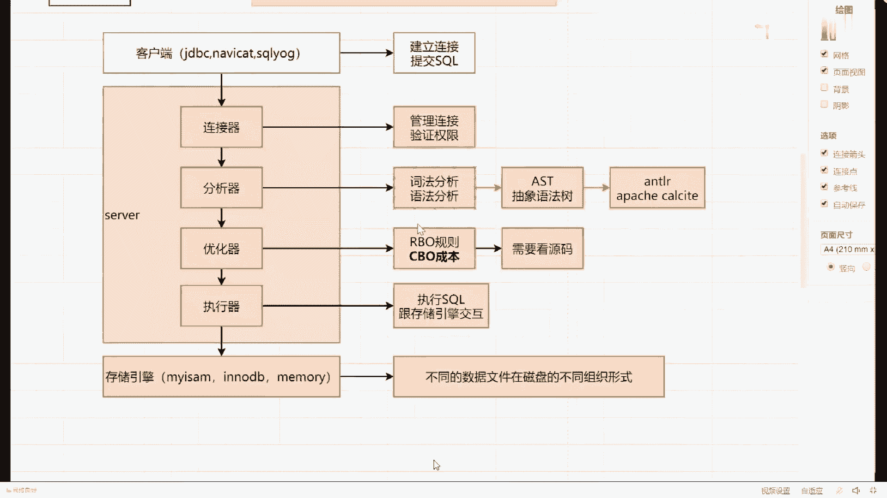
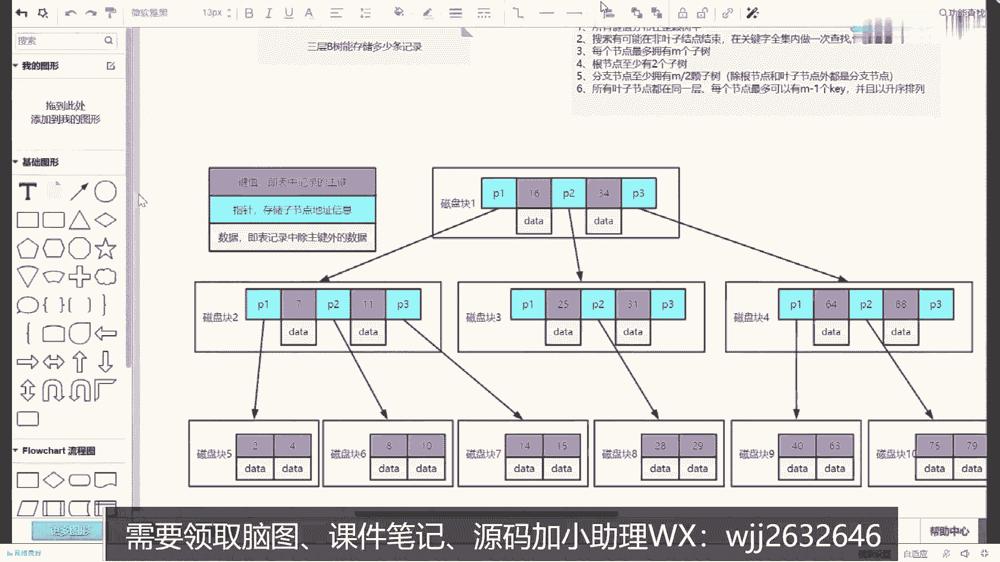
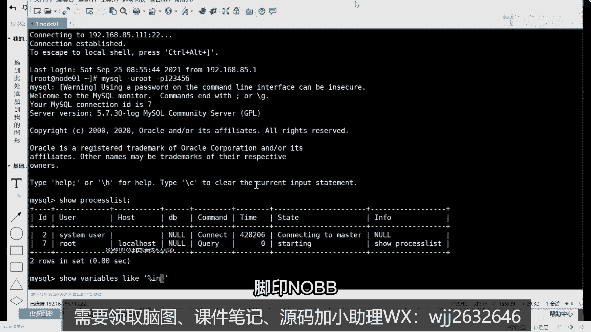
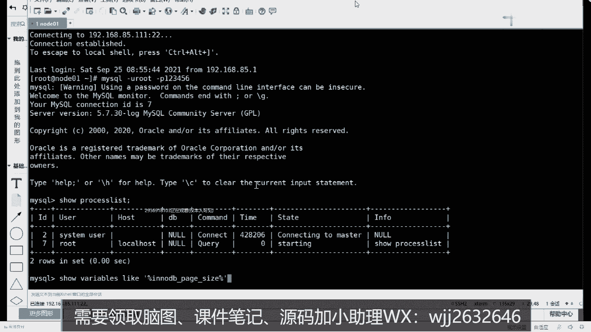
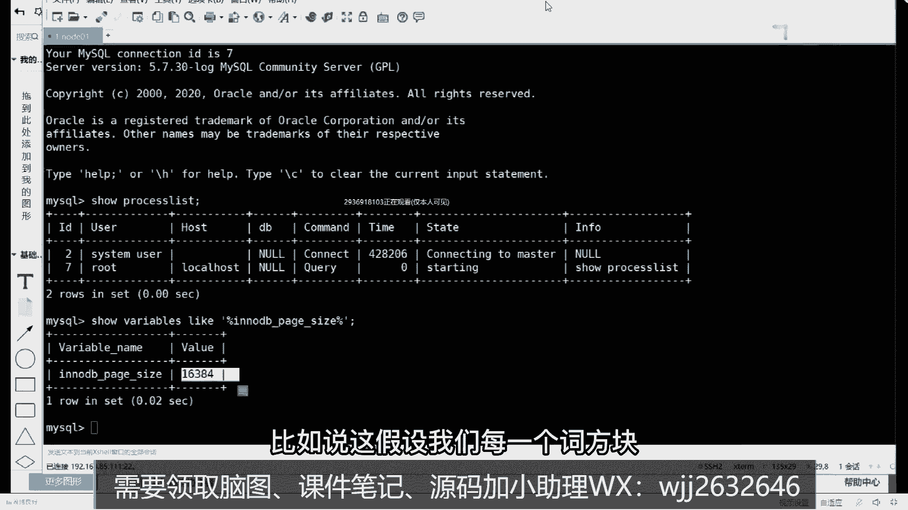

# 马士兵教育MCA架构师课程 - P83：MySQL的索引系统是如何设计的，为什么要使用B+树 - 马士兵学堂 - BV1RY4y1Q7DL

所以先把这个架构了解清楚了。

当把这东西搞清楚之后，下面我们来聊第二个问题，说mysql的索引系统是如何设计的，为什么要使用b加数。

下午的时候有一个同学在群里面也问到，这是逻辑架构吧，不会讲物理架构，不讲物理架构好吧，不讲物理架构，物理架构主要是它具体的一个搭建，比如分布式的时候，单机的要怎么搭建内容。

我想网盘里面就包含了这样的一些具体的组件，和完成具体的一个功能好吧，当你把这块东西搞明白之后，下面我们聊聊一下具体的索引，只要学的东西，我觉得所以他是一个老生常谈的一个话题了，基本上在面试过程中。

只要提到mysql，所以它会成为一个必备项，那么所以你们要考核的记录点其实非常非常多，就比如说我刚刚写的说，为什么要使用b加速这样的一个数据结构，当然很多同学可能在之前的时候，你看过一些帖子。

看过一些撕掉哦，你知道了他就要使用变压数，但我还是希望同学们能够系统地把它了解一下，那作为我们学习者，我应该怎么去学习，你可以来想一下，如果让你自己来设计一套mysql的索引系统，你会怎么来设计。

你要多几次这样的思考，你多这样思考之后，你后面看问题的角度是不同的，我来问一下吧，假如说让你自己来设计到索引系统，你会怎么来设计，告诉我你的思路是什么，你们咋设计啊，首先设计是什么，明确一件事啊。

所以你存在的意义是什么，你上来就用数据结构，你上来好好显明，你上来就说用数据结构树形结构是不对的，你刚开始不可能一口就想到这个地方，首先明确一件事，我在进行索引或添加索引的时候，你要考这件事。

索引的意义是什么，叫加快数据来加快，数据访问，对吧，哎房子提高查询项目，这都是我们随随便便说了两句话，那你要考虑一件事了，我们的数据最终存储在什么地方，刚刚我也问了，数据存储在磁盘，对不对。

但是你如果存在磁盘的话，你就要考虑一件事了，从磁盘里面读取数据，但效率是高还是低，比如内存和磁盘在进行数据交互的时候，它的效率是高还是低啊，对吧对吧，从c盘读取数据效率低，特别是你在读取大量数据的时候。

效率是不是依然很低，因为这些东西说白了它卡在瓶颈，是卡在软件层面吗，是平面，是卡在软件层面吗，不是这卡在硬件层面io，就我经常举个例子，我说同学们，如果你们买了新电脑之后，但凡家里有点条件。

是不是要把你的机械硬盘换成ssd固态硬盘，为什么速度快吗，是速度快了对吧，这是硬件方面的瓶颈，我们是没办法解决的，但是我在进行软件设计的时候，能不能在一定程度上对我们的ia操作，进行相关的优化。

可以在优化的时候，你是不是可以考虑两个层面，或者说两个维度，第一个维度我能不能去尽可能少的读取数据，也就是说减少i o亮可不可以，比如说本来我只需要实战数据，我需要实战，我就读十张，绝对不读11章。

可不可以，你多不同大小数据量，你的性能损耗一定是不一样的，对不对，第一个减少io量，除了减少io量之外，第二个能不能考虑一件事情，减少i o次数，什么叫减少io次数，你的数据是存储在磁盘的。

从磁盘里面读取数据的时候，是要涉及到词b的移动，或者说寻址的一个时间的，这都是太浪费时间的一个点，所以我能不能，如果说我能一次性读取来的数据，我就不要读两次，是这意思。

所以这是不是我们在进行软件设计的时候，会在进行一些基本操作的时候，我们应该尽可能考虑的一个点来，这些能听明白的，给老师扣个一，能听懂吗，好了，当你把这东西有了前提之后，下面我们就要开始进行思考了。

思考啥，所以要加快数据访问，同时要减少io量，减少io次数，那我要怎么去设计它，它存储io市场，io市场，input output，好吧，有时候我们要进行所有的设计来。

要考虑说我到底要怎么去存储我们数数据的，一个就是说哎和下面这些东西了解清楚后，我们要考虑，我们索引到底要存储什么样的数据文件吗，或者这样说索引，把数据格式是什么，什么叫数据格式。

比如说我应该用什么样的方式去存储，我们的索引，大家想一下，你的数据是放在一个非常非常大的文件里面的，在这个文件里面包含了一行一行的记录，不画了，可能有n多行，一行一行记录对吧，这么多行记录。

我如何去直接定位到我想要的数据，它在哪一个位置呢，并且如何能够把对应的数据位置给读取，得读取出来呢，那这时候我应该怎么考虑，比如说我应该选择什么的数据格式，来存储数据的，比如说一个表1000万。

我想读进六六百93条文要怎么存哈，希哈希能取吗，这样叫数据格式，大家想你们在创建索引的时候，是不是一定有一个k值，每次是不是根据那个k值，我找到了整行的value值，是这样做的。

所以我在实际的一个存储的时候，能做这样一个实现什么实现，我用kv格式的数据能不能完成这件事情，k是什么，k就是我们对应的字段信息对吧，那value是什么呢，value也非常简单。

我的数据是存储在文件里面的，我能不能指定好我具体在哪一个文件，有文件网名称以及还需要啥，别忘了你是需要读取我们对应数据文件的，你除了知道这个数据要放在哪个文件里面之外，还要知道什么。

磁盘地址我们换一个描述，天一亮，可以吧，纯纯说的我们能不能知道偏移量，当我知道我们对应的文件名称了，知道我的偏移量了，我是不是能把我们当前的数据给读取回来，与此同时，我还要还需要知道什么东西。

如果你想加的话，还需要知道读取的什么数据长度吧，当我明确好这些信息之后，我能不能把一条数据给定向的取回来，能还是不能，能同学们，如果我知道这样的信息，别自然信息就自带池，当我知道一个值之后。

我就可以定位到某某一个文件，然后定位到偏移量，定位到数据长度，我是不是就可以把整条数据给读回来了，好吧，但是我们之前说过了，mexico，他用的是b加数，而没有用这样的一种格式，为什么原因在什么地方。

他为什么不选择这样的结构呢，同学们，这样的方式会存在一个非常非常大的问题，是什么，当你的数据文件变得越来越大的时候，你当前存储索引的文件，有没有可能也会变得非常非常大，听描述啊。

当你的数据文件变得非常非常大的时候，你当前的索引文件，是不是有可能变得非常非常大，当你当前的索引文件也变得非常大的时候，那我是不是还有必要在索引文件的前面，我再给他建一个索引，我再给他建一个索引。

我再给建一个索引，这没有头了，这东西永远结束不了了，这明显是不合适的，对不对，所以这些东西它不适合什么意思，当数据原件变多，这时候索引文件也会变大，所以为什么会变大，大哥，你索引是字段的值。

你现在有原来是1000万条，1000万，现在变成一个亿了，你表里面的数据量增大了十倍，你所有的东西能不变吗，你所以不会跟着涨吗，这个green shadow绿眼混干面吗，当数据文件表多的时候。

表变多不是表多，变多的时候，你的所有文件也会与时俱进的跟着变大，那这样的话你当前你的数据结构就你这怎么说，但是将会变得越来越大，你在前面还要建索引，这很明显是不合适的，明白意思吧，原谅一个不是绿的吗。

是不是意思是就算你存一个指针也是一样的，你的所有文件是要一直与日俱增的，所以这种结构是不可以的吧，而且其实最关键的是是啥，你变大其实也没关系，也没关系，这里面涉及到一个核心概念或是两个东西。

我需要同学们了解一下第一个东西叫什么，叫o l a p，第二个东西，叫lol tp，我不知你的同学听过听过这样的东西，听过吗，听过的扣一，没听过的扣二，有没有听过这啥玩意儿，op叫联机。

分析处理l o l t名叫什么，叫连接事物，处理他们两个针对的应用场景是不一样的，像o r a p它有什么作用呢，它主要是对历史数据进行分析，产生决策影响啊，不要求短时间内返回结果。

而我们的联机事务处理是什么意思，叫支撑业务，系统的需要，需要在短时间内返回对应的数据结果，所以当我这个文件如果变大之后，注意了哈，无法在短时间之内返回我们对应的数据，所以它是会有问题的。

而第二个叫o r a p，它对应过来的应用场景是什么，有些东西叫数据仓库，而我们的连接事故处理，它对应过来是什么叫数据库，他们俩之间的一个区别，所以像我们讲的mexico它属于什么。

它属于关系型的数据库，然后刚刚说的have这玩意儿，它属于什么叫数据仓库，所以在ham里面，它确确实实的索引就是以这样的方式来存在的，但是没关系，我反正也不要求你，很快时间之内我返回对应的结果。

慢慢查了就行了，而mexico是没办法的，他必须要求在秒级别或者毫秒级别，给你返回对应的数据，所以这种写的时候他就不行了，能听懂吗，这些点能听明白的，给老师扣个一，能听懂，不，并不是说他不行他行。

只不过对于我们当前这种应用场景或这种需求，还用不到，或者没法用面试，既然是这样的方式不行的话，我们现在明确的说我要存储kv格式的数据，那我就要考虑下面一件事了，什么事存储k v格式的时候。

可以杠v格式数据的时候，需要使用什么数据结构，数据的存储形式我们确定下来了，那下面我们就要考虑对应的数据结构了，我问一下，你了解的有哪些数据结构，可以支持kv格式的数据存，储，哪些，换一个描述吧。

还细表好不好，传奇掉对吧，还有吗，能做到二叉树对吧，红黑树，对不对，看到吗，release你你mysql的索引用redis来实现，咋整啊，开头说的b数对吧，然后才知道b加数，我们都知道在最后环节的时候。

b加数胜出了，前面几个数都不行，下面我们来分析一下，为什么前面几个数它有问题或者他不行，你要把他们的原因搞清楚，为什么这些数据结构不行，为什么b加数就可以，其实通过上面的分析啊，通过这些分析的时候。

同学们能得到一个结论，什么结论，也就是说随着我们数据量的增长，你所有的数据量也是与日俱增的，也是与日俱增的，那同时你要考虑一件事，我有没有可能一口气把磁盘里面的，所有的数据文件。

全部都一口气读取到内存里面去听，有问题啊，随着你的数据量的增长，你的索引这数据量也在增长，我有没有可能把所有的书索引文件，一口气全部读取到内存里面，你懂了吗，不太可能对不对，或者没有可能对不对。

如果没有可能的话，基于这样的场景，我们要思考什么事情，如果我一口气读不下来，那我可以考虑怎么读，怎么读对，就是我想听你说，这东西分段也行，分块也行，叫分块，分块，读取，这也是mysql所有系统里面。

一个非常非常重要的东西，叫分块读取，分块读取，什么叫分块读取，这里面其实有一个设计思想，同学们听一下，叫孙而治之，很多大数据的设计里面都会用到这样的东西，叫分而治之，比如说我们在进行数据读取的时候。

也要保证它能够分块去读取数据，只要还能够分块读取了，那么你的效率是有可能会进行一个提升的，联合件提升的这东西我们形成一边，一会再详细聊分块这件事情，治疗综合这件事情，我们接下来解释这几个数据结构。

它到底有什么区别，以及为什么最终我们选择了b加数，这样数据结构，先看第一个哈希表哈，希表我们就不用我解释了哈，希表长什么样子啊，都知道吧，来画个图吧，来看看它里面长什么样子，上面是我们对应的一个数组吧。

下面是我们链表，然后这是有指针指向的，然后在输入里面我们可以写我们下标从零开始，1234567对吧，这里面可以存储我们具体的一个数据结果值，那这些东西搞清楚之后，我们先要思考一件事了，为什么哈希表不行。

或者说哈希表它到底存在什么样的一个问题，你把问题找到了，你才能定向的去解决我们这里面的一些疑惑啊，还有什么问题吗，有吧，第一个使用焊锡表，的意义是为了让数据尽可能尽可能的散列，因此在使用，哈希表的时候。

要选择合适的，什么叫哈希算法，避免哈希碰撞和哈希冲突吧，是不是意思，像我刚刚画了一张表，如果我这个都是一个完整的哈希表的话，你发现它的数据散列均匀吗，看数据产业就业吗，不均匀吧。

你看到了1号和3号里面有数据，但是024674567应该都没有数据，他浪费了很多的存储空间，是不是意思，而且如果你的数据都集中在，1号位和3号位置的话，链表它是需要按个遍历迭代的。

它的调音参数效率会降低好吧，所以这个哈希算法它是一个非常大的考验，这个其实还不是太重要的，最主要的一件事是什么，我问一下pc表在进行数据存储的时候，它里面的数据是有序的还是无序的，有序还是无序。

无序吧存储的数，有t吗，这同学是要点吗，还是表示这个同学还是表示有序的吗，无序啊哈希表存储的数据结构，它是无序的，当需要进行范围查询的时候怎么办，只能挨个进行便利，对比是效率极低，那这时候你想你工作中。

你工作中所对应的那个范围查询多吗，多吧是不是很多，如果你都是范围查询的话，你有话题表达行吗，不可以的不可以了好吧，还有第三个点是什么，对我问一下pc版在读取数据的时候，我能一块一块读吗。

他先表在读取数据的时候，我能一块一块去进行数据的读取吗，不能吧，这是不是也会存在对应的问题，是不是有病的问题，所以这些东西都不太适合我使用，我们的哈希表啊，但是我要说明的一件事是什么。

虽然说哈希表没有作为我们哈希索引的一个存，储索引的一个存储存储的数据结构，但是mysql里面它有没有哈希索引，有没有，有啊有啊，来说一下mysql中的memory存储引擎知识，哈希。

所以啊同时还有一部戏叫inno db存储引擎支持，叫自适应哈希什么叫自适应滑行啊，就这个这个这个过程它不是由人未来干预的，是由mysql的索引，是由mico的服务自己来断定的，而不是我们来判定好的。

明白意思吧，而不是我们来判定好的，所以这个东西你要考虑清楚了，这块也不是我说的是mysql官网里面来说的，我们来看一下，注意啊，你们在选择官网，选择这个资料学习的时候啊，官网就是最好的资料。

做一手资料里面都有相关的描述，对数量少就用花西，数量多的话就不用花西了，是他自己来操作的，人为是没办法去进行干预的，明白吗，人为干预不了的，来选择5。7吧，我们现在是5。7版本的，在5。7版本里面。

我们找一个mysql的索引的模块，找一下，就这样东西说了，most mexico index好吧，像primary ket，uniqual index，fda store in b杠tra。

这显示的是b数，但实际上指的是你能用什么是b加数好吧，然后往下看，下面有个东西，memory table outsport has seen index好吧。

memory but also smart hash index，百度搞清楚可以了好吧，把字搞清楚就可以了，所以一般情况下我们用的不加数，但是在memory存储引擎里面支持哈希索引。

同时intedv自持支持这个自适应刷新好吧，然后那个同学说对啊，那个建档的时候他会自己选择我们存储引擎，我问一下mysql现在默认的存储引擎是啥，默认的存储引擎是啥，pp移动db运动db，你懂db。

反正搞清楚行吗好吧，这是这个东西，来，下面来我们接着聊哈，希表不行了吧，他现在不行的话，我们下面就要换各种数的结构了吧，我这儿给大家列几个数，你看看好吧，某某人的什么意思，学会看官网好吧。

官网里面有很多对应的一些资料是标准答案，一定要看官网来，我们现在说几个数的东西好吧，刚才提到二叉树对吧，我让他再补充几个，比如说除了他之外，还有个东西叫b s t tra对吧，除了b s t税之外。

后面还有个东西叫a v l数，除了a v l数之外，下面还有一个东西叫红黑树，我先把这几个数据结构融入到一块啊，这几个数据结构，在常规的数据结构的一个考核中，应该问的是比较多的吧，面试中文的也比较多。

你需要对这些东西有所了解，有所掌握，很重要啊，谁说我这几个数据结构不清楚的话，这插播一个广告，谁如果对数据结构和算法东西不清楚的话，可以去学习一下左神左程云老师讲的，数据结构和算法的课程。

有人知道做什么，左晨宇老师，左晨曦老师啊，在马士兵教育，全职讲对应的数据结构和算法的课程，所以谁如果对数据结构，算法相关的东西有疑惑的话，直接导组成哇，贼牛逼对，确实很牛逼好吧，大家可以搜一下。

就成为那个人对，昨天晚上刚上完公开课好吧，所以差不多广告，呵呵好吧，我这儿啊不详细去讲这些对应的数据结构，它具体每个的特点是什么，我只给大家总结几个东西，首先先看这样，我罗列出来四个数，b数和b加数。

我是没写的，我先把这几个数罗列到这样看，那四个你告诉我有什么共同的特点，有特点吗，都是数你，你这话说还能再再再再那啥点啊，都是数，这最多只能有两个两个分支，没问题吧啊最多只能有两个分支。

是他们这四个数对应的特点，同时我会慢慢的缩小我们对应的范围，那后面这三个数是什么，这一个bs t tra啊，什么叫bs t tra啊，叫binary search tree，二叉搜索树好吧。

那后面这三个数它有什么特点，什么样，叫有序有序，后面一个数都是有顺序的好吧，左子数必须要小于根节点，右子数必须要大于根节点对吧，就是这个，那现在再来，还有下面这个东西，后面这两个它们具备什么特点。

对叫平衡平衡，这是他们对应的一系列的一个特性哦，我这儿给大家做一个简单的小总结，他们之间的一个区别以及对应的一些特点，那讲完这个东西之后，下面我们要聊什么，聊一个话题，所有人应该都知道二叉树长成的样子。

他们都有两个分支嘛，好吧都有序嘛，有可能会平衡嘛对吧，那什么叫二叉树啊，它怎么排列的，一个节点里面至多只能有两个字节点，我把这个东西补全，当我补全之后，大家其实可以看到当前数的一个样子，来放到这儿。

好了我连线我就不连了，假设这是我们对应三层的一个数吧，三层1233层三层的一个这样的数据结构，我问一下，存满之后至多能存储多少条数据，多少，是多啊是多，如果都存档的话，能吃几条数据，二三次方减一七条吧。

是不是纯白只能放弃上，你数一下都来得及，1234567嘛，这都不能放弃上数据，如果只能放七条数据的话，这里面会有一个问题，什么问题，如果我想存储更多的数据的话，应该怎么办。

比如说暗杀数在存满的情况下是制作制度，只能存储七条结果，如果想存储，更多的数据怎么办，只能将树的，的高度提高吧，提高变成四层，或者五层，或者更多层，那么层数变多了会有什么影响呢，刘老师，那变高就变高呗。

变高又怎么样，为什么不能让变高呢，变高会有什么影响，会有会有会有什么影响吗，有没有，速度慢，命中低好了，刚刚没有名字，这个同学说了一句话，叫io次数会变多，会涉及到一个数据结构工程。

不是涉及到一个操作系统里面相关的知识点，这样我要给大家说明一下什么东西，有没有人听过一个名词，什么意思呢，叫做磁盘预读，来听过的扣一，没听过的扣二，老师你怎么光讲这些新鲜名词啊，我都没听过这东西。

没听过，说明你技术有短板了，需要把这东西磨练起来，什么叫磁盘预读，注意一件事，就是内存跟磁盘进行数据交互的时候，有一个最基本的逻辑单位是称之为e或者叫做，你们能听过data配置能清过吗。

叫data page或者叫ye的大小是跟操作系统相关的，一般是四kb或者八kb好我们再进行，数据读取，这时候一般操作的都是列的整数倍，这个概念我希望大家能够理解，听到了吗，这是我需要你了解的一个。

最最最基础的一个基本概念，你把这个概念了解了，后面的东西才能往下聊，没问题吧，大家想一下，当我这儿已经有了一个页的东西了，也就是说内存和磁盘交互的时候，是有一个单位的。

这个时候你再把它跟我们前面讲的这个东西，能不能关联起来，我们先说了，这东西在进行数据读取的时候，要进行分块读取吧，既然诶怎么连不过来，是要进行分块读取，我现在要分块读取。

你想一下我们这个业的单位或页大小，不就天然已经分好块了吗，我能不能每次我就读四kb大小，能不能挺好，我能不能每次就读四kb大小，行不行，可以了，这不就天然就已经分好块了吗是吧，但是别忘了。

我们在进行数据的一个实际存储的时候，它是以页为单位进行交互的，像你这个地方，这是一个节点，一个节点是不是意味着我要读取一个月的数据，但是我们都知道，这里面明显我只能存放一个值吧，比如这是十，这是五。

这是15，这只能放三，再放八小七，这放12，这放19，是不是讲讲成这样的东西，因为每一块里面或者每一个节点里面，你是不是只能存放一个数据值，你这个节点里面我能存储更多的数据结果值吗，能吗，同学们，能啊。

你这里面能放多个值吗，你怎么放，看只有两个分支，要不然比他大小比他小，你能放多个分支吗，你是放不了的，如果你放不了的话，你就要考虑一件事，这里面有一页的一个单位了，那我如果有一页这样一个单位之后。

我如果存不满怎么办，存档会放其他东西吗，来举个例子来验证一下，打开我的电脑，这里面我新建一个文档，举个例子就知道了，这是一个文本文档里面现在什么都没有空的，我现在往里面随便复制一点东西，随便带点。

ctrl c ctrl v，你告诉我这里面有多少个字节，再加点多少字节告诉我，你知道吗，我也不知道多少字节好吧，你右击点击属性，你看到了多少字节，一共是1198个字节，但是它占用的空间是多少。

对4k b吧，你相当于你的磁盘，是不是都一个一个4k的小格子，如果我占不满的话，不好意思，占不满就占不满吗，这空着不就完了吗，是不是这意思啊，所以你想我们这里面每一个节点，如果我只能存储一个数据值的话。

我如果想让它存储更多数据的话，我是不是要加层，我如果加成的话，每一个层或者每一个节点里面读取的时候，我都是一页的话，你层数加多了，你层数加工了，你告诉我，你最后能会不会导致你的io量变多，会不会。

老同学们会不会，别关注壁纸好不好，关注壁纸干嘛，你们真的是，这壁纸我发给你了，好吧，这壁纸有什么可关注的，真的是绝了，你们也是，所以啊我们要考虑一件事，同学们什么事，为什么你的层数变高之后。

你的io次数是变多，这是产生最根本的一个原因，所以你要考虑一件事，什么事考虑什么，是不是要尽可能，多的存储数据还要减少i o的次数，换句话说是不是要减少io的，我会减少树的高度吧，是不是减少高速度高度。

这句话能理解吗，来能理解的同学给老师扣一，所以说不能越高，如果不能越高的话，你想这个数我们能变形吗，或者我们这个数能变种吗，可以吗，怎么变形，每一个阶里面我是放了一个值。

如果我的一个阶里面我如果能放多个值呢，颜值放一个十甲里面放十多号，20多号30，如果我放了三个值，你告诉我我下面的子节点，子节点会放几个，或者说会有几个孩子节点，这个六个，你哪来六个大哥这一层啊。

说这一层，两个我能犯这样的范围，第一个范围小于十可以吗，第二范围我能换成十，到20之间，可以吧，下一个我能放20~30，对吧，再下一个，我能放30，大于30的，可以吧。

我是不是可以存到我们对应四个区间了，比如说原来我现在是二叉树，我能不能让当前的这个结构，它变形或者变种一下，变成什么东西，叫多差数可以吗，可不可以，这没问题吧，当你变成多叉树之后。

是不是意味着你的孩子几点变多了，你的孩子几点变动之后，你的树是不是就变矮了，同时我这里面在进行数据存储的时候，该有序还有序对吧，该平衡你还平衡，把你之前那些二叉数这些特点我都保留下来。

所以在这个东西的基础之上慢慢变过渡之后，变成了一个什么东西，叫b数，叫b数，你是要把b数这玩意儿搞清楚了，b数是吧，来到目前为止还能跟上同学给老师扣一，能跟上吗，平衡板上的树高。

最最长指数和最短指数之差不能超过一，是那个a b l数的红黑数的话是两倍，这个不一样啊，这不一样好吧，现在把这些东西你要搞清楚了啊，这是b数，那我们现在来看一下b数的一个结构，它大概长什么样子。

很多学啊可能没见过b数长什么样子，没关系，我们一起来看一下，b数结构大概是这样一个东西，首先你在进行b数的一个实际数据存储的时候，需要搞明白一件事，什么事，它有一个最基本的概念叫做什么叫做degree。

这个diy怎么翻译呢，翻译过来叫做do，或者叫做接好do或者接什么叫do，什么叫接，表示每一个节点里面最多存放n多，n减一条数据来看一下，比如说选择四阶，四阶什么意思，每一个节点里面我可以放三条数据。

我们可以往里面插一下，你看看效果好吧，比上一走，这是一点点，我再插入二，它不会新增节点，而是往当前节点里面插入其他的一些数据值，再比如三看到往里面加每个里面因为选了四阶，最多能存放n减一个。

所以最多能放三个数据，当我再插入四这个数据的时候，它就要分裂了，看到了吗，这就进行分裂了，速度调快一点，我再往里面查看，比如说56x6 的时候，他遇到进行分裂了，再叉七差八分裂，那差一个九没事。

当我再插一个十之后，同学们告诉我什么效果，当我再插入一个十这个数据的时候，它有什么样一个效果啊，圆满了，你插20的时候，下面也要满吗，下面是不是要满了啊，它会变成一个三层的数，这是我们对应的一个b数。

对应倍数，看到了吗，这是最基础和最简单的一个数据结构吧，啊你把这东西搞清楚了，没完，还需要懂这件事什么，它只是一个最基本的数据结构的一个模型，它你知道它是没意义的，我需要把这个模型做一个过渡。

过渡是什么样子，我要存放我们数据库里面的表，里面的行记录了，所以这看起来好像是一个数值，那么我们在实际存储我们的行数据的时候，它不可能存存放一个数值，比如说这个节点往里面添换的时候。

这个值要变成几种类型的数据，首先第一个存放数据的时候，k值要有吧，k值不可能没有，k值是必须要有的，是不是意思，截图，来同学们听好了，我k值是不是要用，也是这里面我可以存储三个类型的数据。

第一个k值要什么，你需要根据你的k值来检索到我对应的数据啊，是不是在哪个地方ky要有吗，除了ky之外，你能告诉我你还需要别的数据吗，我说了啊，这是数据模型的图，我们要把它换成我们一张表。

还需要什么东西叫啥，字段信息行数据吧，行数据，还需要啥，还需要吗，value value不是行数据吗，还需要什么东西，同学们别忘了它是我们对应的数，下面是有对应的节点的。

我是不是要知道我下一个读取的数据，节点的地址是什么，下一个节点的地址，这样的东西如果你是六组利用小于六的，是不是读取五这块儿六和八之间的时候都是七，这个块大于八，读取这块这个地址。

这里面我们会包含三种类型的数据，所以你需要先把这东西搞清楚，你把这东西搞清楚之后，你就可以跟着他来画出一张图，什么图，关于我们索引的数据结构，一张图来给大家看一下。

这之前用process on的时候给大家画了一些图啊，我没挪啊，还在里边放着，找到我的msl，来你看这张图，你能不能看懂。

每一个磁盘块，就代表是我们读取的n个页的信息，我说了吗，每次在进行数据交互的时候，读取的是e的整数倍，把每个方块表示独一个页的整数倍，默认这读的是假设是16kb。

每个方块12345678 90是多少次方块，当我练好这个磁盘块之后，每个磁盘块里面是包含三种类型的数据，第一个16 34表示我们具体的k值对吧，data表示我们实际的行数据。

p1 p2 p3 表示我们实际的指针，我这啊只画了三个范围，但其实实际存储的时候，你的范围可能比这些东西要多得多，可能很多个，但是空间有限，所以我这只画了三个来，这个图能不能看懂，能看懂的扣一好不好。

没问题吧，这如果没问题之后，下面当你看到这样的一个三层的数之后，三层数之后我要问问题了，如果我要读取28这条数据的话，a a b等于28条数据的话，我要怎么去读取，记住啊，28怎么读。

我是不是先读取磁盘块一，把磁盘块一给读取回来，读取过来之后，我要把28和36和34做对比，我一对比发现诶正好在中间，是不是沿着p2 指针把磁方块三给读取回来，当我把磁盘块三读取回来之后。

我再把28和25和31度对比，但是又好正好在中间，我是不是再根据p2 指针把磁盘块八给读回来，当我读出来之后，我是不是能把28条数据给返回回去了，这里面它整体的一个查找过程，在整个查找过程中。

我一共读取了几个四方块，三个吧是不是三个同学们注意一件事，出现什么事情，在mysql in no db的存储引擎里面，它有一个变量受，角in no bb象限配置上限size。

你这样属性值g值多少，它默认读取的是16kb的数据，默认读取16频率的数据，也就是说这样假设我们每一个磁盘块。

每个磁盘块它占大小是16k，我在整体读取过程中，我一共读了多大的数据量，多大的数据量，一共，不大是不是一共是48kb的数据，这个48kb对于我们现在的操作系统而言，很小的数据量吗。

像你们的电脑基本上8g内存起步吧，我始终给内存起步吧对吧，有些更有钱的同学可能配上32g内存，64g内存，是不是意思，他应该是比较简单的哇，48k很少完了，这样对于我们的内存的四点而言并不是特别高。

那下面你就要考虑另外一件事了，同学们16级不算大好吧，我给你看我电脑内存多大，64g好吧，你这个大点没关系的，越大越快好吧，这也没关系的，来往上看，我们再往下看，我们接着往下走啊。

当你把这东西搞清楚之后，你下面就要思考一件事，思考一件事的思考什么事，我如果b加数对，不是这个b数，它只有三层，我存满了之后记住啊，存满了之后，我可以存多少条数据，存满之后存多少数据，你告诉我能计算吗。

八是什么意思，我们是不是可以大概算一下，我们为了方便计算，假设一个z我占了大小是一kb，我问一下，在当前这个磁盘块里面，我最多能有几个子节点，最多能有几个直接，三个我这换了三个，你一个大小是16kb。

一个date是一kb，我最多可以存多少个，你data是不是只能占一kb上面是不是占范围，也说你最多有15个date，15个date相当于16个范围吧，是不是六个范围，是不是，这意思。

就是说我这一层里面最多可以有16个子节点，那我第二层我可以有多少子节点，第二层多少个，也是16个吧，是不是也是16个，第一层16个子地点，第二层是不是也是16个子地点，大小是一样的吗，第三层多少个。

是不是也是16个，一个dt 1 k兵马，也就是说如果我这三层全部全部我都存满了，我的计算公式应该是什么样子，应该是16乘，16x16=4096条记录啊，这等于四是多少，那么我的问题是什么。

4000条数据多还是少，多还是少，说吧，你平常自己做个练习都不止4000条记录，那如果我想存储更多的结果的话，我应该怎么办，怎么办，我是不是只能去加我们的层次了，比如说把三层的一棵树变成四层。

是不是这意思，但是很明显的一件事，朋友们你要注意了，如果我要把三层变成四层的话，我的i o的次数会不会变多，会还是不会会不会会吧，那这跟我们的设计原则又相悖了，那这时候我们要找问题了，找出问题。

为什么这个三层的b数它只能存4000条数据，谁占用了大量的存储空间，谁，date吧，那下面我就要思考一件事，我能不能把data给干掉了，对不对，所以在b数的基础之上，有了另外一个东西叫b加数，来。

我们先看b加数的数据结构，我依然往里面插入一到十十个数据，你再对比一下区别好吧，一三还是三个，四的时候变了，然后56789，传输十十个数据之后，依然是底层三层吧，我把这个图拿过来放里边，当我放过来之后。

来告诉我他们之间的区别是什么，开始找不同有什么区别吗，什么区别，同学们，箭头哈哈哈哈，最下面一层有了一个指针，或者有一个链表的指针，能够相互指向，还有吗，这边最主要的看到没有，最下层的数据最多。

患者描述呢，看好相应的区别和特点，所有在b处的时候，我们的数据是12345678 90，看数据没有重复，但在b加速的时候，叶子烟里面是包含了全量的数据，而非页里面是包含了部分数据，那通过它的对比之后。

是不是相当于有了一定的数据的冗余，当有冗余之后，我们可以思考一件什么事儿，我能不能把刚刚这个图里面的所有的date，都放到叶子节点里面去，能还是不能，你能吧，所以我在变形之后。

我能不能有这样的一张图来看好了。

还是等，来这个图你们能看懂吗，什么意思，我的非叶子节点里面不再存储实际的数据，只有在夜间里面才会存储实际的数据，这么干行不行，行吗，可以吗，如果可以的话，一样道理，我们要进行计算了，我计算什么东西。

这样的一个三层的b加数，我如果存满的话，我可以支持多少数据量的存储，算一算吧，每一个三方块依然是16k 16 k 16 k，我读取的时候依然是读取了48kb的数据，对吧，假设我们的p一加28。

我占了十个字节，记住吧，假设你占十个字节，那相当于16x1024，再除以十，为了方便计算，24不要了，1000等于多少，1600吧，比如18号一，我可以有1600个子节点，第二层一样的算法。

是不是也是1600个子节点，第三层一个date 1 kb，是不是只能存16条，你这三层的一个b加数，如果我存满的话，我可以吃多少，1600x1600，再乘以16，等于4096万。

是不是意思我能知道多少范围是这样了，烂级别吧，是不是意思，来刚刚能听的过程能听明白，同学表示扣个一，问题吧，当你把这套东西看明白之后，与生俱来的就会面试官问出一个问题，mysqb加数的，所以一般是几层。

告诉我一般是几层，三层不问不问就不问呗，不问怎么办，那还能怎么办，你打面试官一顿问就不问呗，三层吧，四层吧，告诉大家，你说三层也好，说四层也好，个人认为都不是那么的严谨啊，都不是那么的严谨。

我这儿给大家一个统一的描述，听好了，听好了挺好，一般情况下，3~4层的b加数，足以支撑千万级别的数据量存储，来再来一遍，一般情况下，3~4层的b加数，足以支撑千万级别的数据量存储，能记住这句话吗。

面试官在问的时候，你就以这样的方式去给他进行表述，给他进行回答，没问题了，明白意思吧，因为在刚刚整个计算的公式里面，在计算的公式里面，你告诉我谁占了绝大的一个因素，或谁占了一个很大的因素，谁啊。

这吗是这吗，不要再理解为data了，好吧，是指针吗，大哥们别忘了我刚刚说的东西，我说假设p一和28占十个字节，指针的大小是不变的，而这个值是你选择的索引，只选索引列的值，这个值是有可能会变化的。

所以影响最大是谁是k这个值，假设我刚刚举个例子啊，如果我们的p和指针和p一和28，占了100个字节，你依然按照刚刚的公式算的话，变成多少了，是160x160x16，就变成了多少，409600，明白了吗。

所以谁在整个计算过程中，一对对这个这个意义非常重大，是k的值大小或者k所占用的存储空间大小，你告诉我k是大了好还是小了好，大号还是小号吗，小所以要保证一件事，保证什么k要尽可能少的占用存储空间。

明白意思吧，那这样就会有一个问题，我们在创建索引列的时候，我会用int类型好，还是用what串类型好，哪个好，int int占四个字节，但是vx所占用的字节是你自己指定的吧，如果往上站三个呢。

如果你写了三呢，但我们一般不写三了，如果你写了三呢，所以要判断什么，谁占用的空间小，我就要用哪个列作为索引，听明白了吗，就这样你要考虑清楚了，来我刚刚讲了点，听明白同学多少科目，一听白了吗，好吧。

当这个问题过了之后，面试官又会问一个问题，什么问题什么问题啊，我们的mysql的表在进行创建的时候，我的组件要不要自增，你看这张图来给我反馈，要不要自尊，你来告诉我，也说不要的，有说要你不管说要也好。

还是说不要也好，我希望你能搞明白一件事，什么事，原因是啥，你说要以前说不要以前你总要有个理由吧，占用空间小，那么我先说结论，结论是这样的，在满足业务系统的支撑的情况下，尽可能的自增。

尽可能自动叫满足业务系统情况自动自增，为什么这里面会涉及到另外的一个问题，叫什么叫索引的维护，这玩意儿很麻烦，什么叫所有的维护，举个例子来看，四八块五，15，假设18块五，我最多只能放四条记录。

比如现在我已经存满了，11 12 12 13 15，我存满了，当我存满了之后，我的问题是什么，现在我要插一条14的记录，我该怎么插，因为你底层的叶子节点之间它是有顺序对吧，有序的。

所以你的14只能插到这个里面去，那我需要干嘛，把当前的方块要拆分成两个磁盘块，11 12在这13 15在这，当你分开之后，同学们注意了，你不是单单分开就完事儿了，你上层是要有指针指下来的。

意味着上层我也需要增加一个指针，如果这个时候特别不巧，他也满了，他满了之后，他是不是也要分裂成两个，但是还要往上增，就说你在进行数据插入的时候，有可能会影响到上层的一个新增吧，业的分裂吧。

这东西是很麻烦的，而如果你递增之后会有什么效果，是往后面追加就可以了，前面会有影响吗，前面的东西会产生液分裂吗，不会了吧，是这意思啊，所以我说了，在满足业务系统的情况下，尽可能自增，刘老师。

我分配的环境里面没法自证，那就不自增了吗，对不对，能自成就自身不能自动算了，我放弃了好不好，来刚刚讲解听明白，同学给老师扣个一，神组是用分布式id嘛，小号算法吗，用小号算法都分布式id吗，rest好吧。

所以刚刚是用索引的这套知识，所以这时候再回过头来来，你告诉我为什么要使用b加数，能听明白了吗，能听明白了吗，我刚才讲了一堆。

你要搞明白这个逻辑过程吗，面试的时候把这些点给面试官去陈述清楚哦，这里面涉及的东西还是挺多的，数据结构的，操作系统的网都有涉及到，包括他数据读取的多了去了，这东西了解了。

才能展示出来你个人的一个技术实力啊，这才是你最应该学的明白了吧，好了。