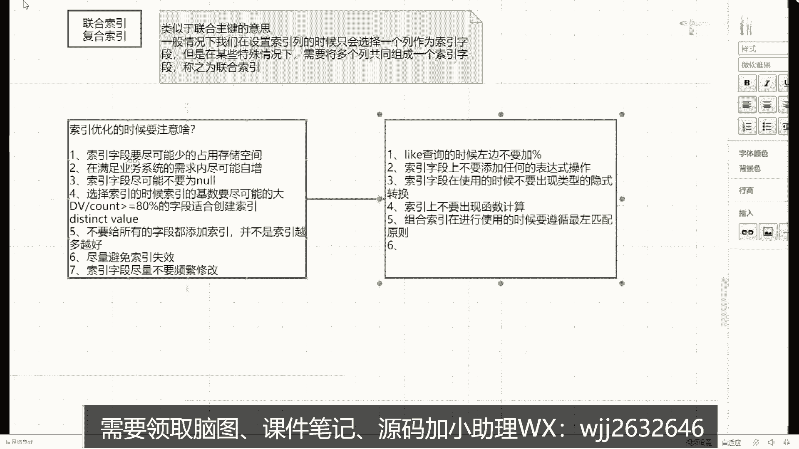
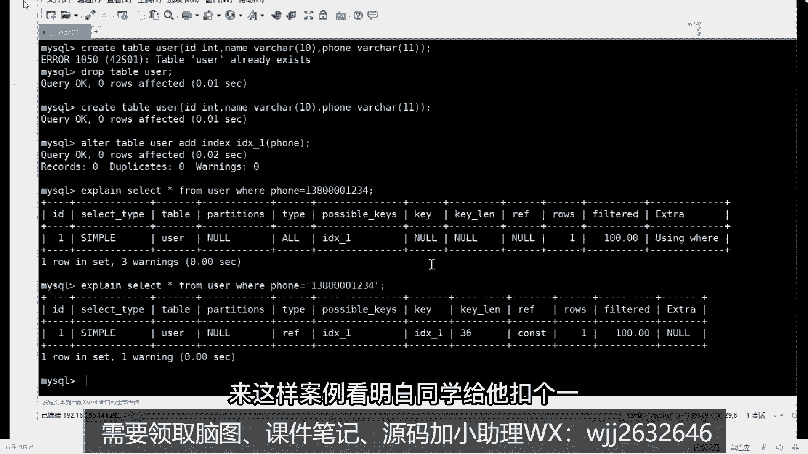

# 马士兵教育MCA架构师课程 - P85：在进行索引优化时应该注意什么问题？ - 马士兵学堂 - BV1RY4y1Q7DL

所以优化的时候，要注意啥，注意什么，同学知道了啊，第一个，所以占用的存储空间需要尽可能索引字段，要尽可能少的占用存储空间，还有吗，在满足业务系统的需求类，尽可能就这还有吗，还有啥，没了，所以在进行。

索引字段，我刚才没提这东西，hope说了就尽可能不要为空，我说的东西啊，呃空这玩意在数据库里面，它是一个非常非常特殊的存在，因为在很多情况下面，空都不等于空，对吧。

空调那叫is not for long呢对吧，但是尽量不要选择为空的字段，听明白意思吧好吧，这个东西啊，还有第四个选择索引的时候，索引，的基数要尽可能的，有人知道什么叫基数吗，你知道什么叫基数吗。

这里面有一个计算公式，什么计算公式，就是说我们在建索引的时候，到底给哪些列来建我们对应的索引，这边有计算公式，记住了，叫dv除以count，大于等于80%，这四段适合创建，所以明白意思吗。

刚刚那个同学恶龙咆哮说，假如给性别加字段，你给性别加索引一点意义都没有，一点意义都没有，dv是什么，不知道dv是啥吗，就这，distinct value，唯一值，唯一值除以count要大于等于80%。

明白了吗，性别这个字段你加索引一点意义都没有，就是要给你视频加作业没意义啊，你加作业干嘛，你性别只有男和女男女，你加缩减之后，你通过作业来查询没有意义啊，你加这玩意儿明白意思吧，这没理啊。

对你的不重复的值要尽可能的多好吧，充值多的话，这个长期的话要比较麻烦，ok那什么，看到了吗，查了也不会怎么样吗，你在另外一个字段查询的时候，查出来都是重复数据吗，那没意义，也不会怎么样，还有啥。

不要给所有的字段都添加索引，并不是索引越多越好，明白了吗，这点是很重要的，很多同学老师，我能不能给表里面的每一个字段都添加了，所以不要这样，你给人表里面的每一个字段都添加索引之后，效率不一定高。

效率不一定高，它会占用大量的存储空间，明白意思吧啊再往下看第六个还有什么，还有吗，尽量避免索引失效，尽量避免索引失效，尽量避免索引失效，那这里面就涉及到一个问题，老师索引失效会有哪些场景。

比如下一个我要聊的话题，什么情况下会导致索引失效，有人能说一下吗，所以那应该是很少修改的，这个是对的，下一个吧，这个我这我之前没准备啊，下一个，尽量选择的索引字段尽量不要频繁，修改，来第一种情况。

所以这种情况你们说的啥来着，查询的时候，左边时候，不要加百分号对吧，还有吗，意思呢all的情况我建议你不要说all的情况，不要说，看到吗，所以是这样的，好，所以字段上不要添加任何的表达式操作，明白吧。

不要加任何表达式操作啊，这是第二个，还有吗，第三个对，所以，字段在使用的时候不要出现类型的影视，也是，转换，看啥，所以，以上不要出现函数计算，说什么组合索引在进行使用的时候，要遵循最主匹配原则。

我还没说这东西啊，匹配原则，可作品原则我还没说，不知道电影是转换啥意思，来给你举个例子啊，等下我给你找个案例啊，找一个案例，我想想在哪放着，国家电营业一堆情况。

知道一下，你找一下这个东西，所以失效，嗯还有啥，你现在睡觉吗，不知道从哪讲，这玩意儿，等我找一下，忘了昨天咱俩讲的，所以失效的情况我这写了一堆啊，宋主要，什么算了，给大家举个例子啊。

就是这个东西是啥意思，什么叫影视转换，比如说我们在进行具体的数据库操作的时候，有一个叫做什么来着算，来看这个方式来演示这个这个这个这个案例啊，来打开我们的数据库，演示一个案例，柚子dem。

大概有点存在多少，这个user你看看表吧，表演单一几个字段，三个字段好吧，123id name和phone，只有且只有这三个字段好吧，当报完了三个字段之后，还有一件事。

我现在给我们的phone字段我添加一个索引，讲完了讲完之后查询语句，你在写的时候，比如说我随便写一个，大家看到这个sql语句吗，我问一下，我现在这种作文字段是什么类型的，什么类型，观察类型啊。

我现在写什么类型，数字是数字类型，你运行之后，你看一下你的执行计划，在执行计划里面k这页里面显示的就是n，如果现在我换一种操作，我把这个东西加上单引号引起来，这有值了吗，你知道吧，这就是我们对应的类型。

如果你的类型发生一种隐式转换的话，它可能会导致我们对应的索引失效，就这意思明白吧，看出来了吗，那这个案例看明白的同学给老师扣个一。

能看懂吗，就就这意思好吧，大家都懂的情况好吧，再往下看，还有一个东西我需要大家说一下，in或者，很多情况下会导致，所以失效，但是要根据实际的情况来进行判断，明白意思吗。

你不要上来就说印会失效或者懊悔失效，这种说法都是不对的，都是不对的，ok直播不是直播，是录播，所以啊把这几种情况给大家说清楚，说清之后，你随便哪个地方能举出一些案例就够了，能举出一些案例。

我记得我之前用过这东西，但是忘了好吧，来再看还有什么，第七个，在使用组合索引的时候，如果中间的某个索引列使用了范围查询，那么会导致后续的索引失效，这东西啊一会儿也是一样，我会给大家举个例子。

来说明这几种对应的一个情况，好吧，这我写了七个，我就差不多够了吧，你面试的时候，请给面试官说这些情况就可以了好了，这几个点能听吗，同学给我扣一，能看懂吗，这这个东西啊我来给大家一会，我来解释几个名词。

解释几个名词的时候，我们把对应的案例啊给大家做一个演示，做个演示好吧好了，这是刚刚上面讲的这些核心的一些知识，讲完核心知识之后，我们再讲几个关键名词吧，把几个关键名词讲完之后，基本上就结束了。

第一个名词刚才提到的这回表，来知道回表是啥意思的，给老师扣一，不知道扣二，你们知道什么叫回表吗，鬼表示这样一个意思啊，给大家解释一下，我们来列举一个场景，什么场景，比如说表里面有id逗号，name逗号。

认识多少，针对四个字段啊，先明确这四个字段，当我定好四个字段之后，我来规定一下，这里面有i d是组件好吧，name是普通，所以我写一个语句叫flat行，from people where name等于。

张三问一下，这条sql语句的查找过程是什么样子的，商用的，先根据，内部的值去name b加数，找到对应的叶子节点吧，我问一下这个叶子节点取得数据是什么数据啊，液在放什么，取出id值吧。

再根据id值去id，b加速攻找到查找全部的结果，这个过程称之为回表，是回表的意义，明白意思吧，那我问的是什么，回表的效率高还是低啊，回转的效率高还是低，怀表的效率比较低好吧，尽可能不要使用。

我尽可能避免回表的产生，明白意思吧，这些东西这是回表，那这个没问题的，扣一这个回答概念啊，他需要来回去回到原来表里面查询，我们对应的一个数据记录，是第一个来聊第二个东西，刚才要是讲的第二个叫索引覆盖。

什么叫索引覆盖啊，表示一模一样的数据一模一样，我把这个语句改一下，改成什么呢，加油id逗号name，大家问一下他的操作构成什么样子的，什么样子，是不是先根据name的值去name的b加数查找结果，能够。

直接获取到id和内容，还需要就不需要去a d的d加数，查找其他的查找数据了，这个过程，叫做索引覆盖，明白了吗，什么叫索引覆盖，也非常简单，就是说索引的叶子节点中，包含了要查询的全部数据啊，叫做索引覆盖。

能听懂吗，这效率高还是低啊，是高还是低高吗，这谁啊推荐使用，所以盖这些东西，看来再往下看下一个，他们叫什么叫最左匹配原则，这是什么东西啊，什么叫最左匹配原则呀，其实他也挺好理解的啊，它主要针对什么。

针对的是组合索引，一样改一下条件吧，id name和逗号位置是组合所有，组合专业就在查询，有时候必须要从左向右匹配这东西啊，就算我们呃去购物网站，你在购物网站里面写写写地址的时候一样，必须要先学省。

再选四，再选缺，缺一不可的，必须按照这样的这样的一个数据来，老师这里面会与生俱来对应几个语句啊，给大家查一下现在的行，from table，where name等于比如问号and edge等于问号。

这是第一个语句，下面还有几条，把它干一下，删掉，删掉，我问一下这四条语句里面哪个会用到组合索引，14134134，还是那句话，你记住，我刚刚说那个标准顺序，必须要从左向右挨个匹配，所以在匹配的时候。

我们先匹配第一个内部age是不是符合这个顺序，所以是没问题的，第二个edge能复合吗，必须要先匹配name再匹配edge，你这里面没有name，所以第二个是不行的，第三个可以吗，可以啊，虽然没有。

但是我能匹配到name也是可以使用的，第四个把name和age顺序换了一下，第四个行不行，第四个节目，这是比较有争议的地方，其实我问一个问题就行了，如果把name和age的顺序来回换一下。

会影响我们最终的查询结果吗，会影响吗，不会的，所以这块会有一个东西，就刚刚说的是优化系，会优化明白吧，会调整好我们对应的一个顺序就完了，这就是我们说的最左匹配原则对吧，除了最左匹配原则之外。

还有下面一个东西，什么原理是什么，没啥原理。