# 系列 6：P86：什么情况下会导致索引失效？ - 马士兵学堂 - BV1RY4y1Q7DL

在比较数据的时候，你要先比较第一个才能比较第二个，只有第一个相同的，我才会比较第二个，可能如果第一个不一样，第二就没必要比较了，就这么简单，来啊下面最后一个我们来讲一个索引，下推液化气后会不会走。

索引是不是优化气不会阻索引，它优化完成之后，会把你这两个条件的顺序换一下，换完之后不就符合内幕和a值了吗，它就会走啊，会走啊，汇总好吧，为什么内部一定要在前，因为你在创建对应的b加数的时候，大家看好了。

我们刚刚给大家展示的，找一下，刚给大家展示这个索引结构的时候，他这个key是不是只有一个值，当你是一个组合索引的时候，它就变成两个直道，比张三和28会放在一起，李四和39会放到一起，所以我在匹配的时候。

它相当于是一个二元组，明白吗，x y2 元组我必须要先比较x才能比较y，如果x不一样，我就连y比较的意义都没有了，y的永远不可能比到，只有x降头的时候，我才可能才可能会比到y就这意思好吧，是这意思啊。

你要最后面一个话题吧，叫三能行吗，三行啊，三可以不要说话吗，国木森可以的，虽然可以啊，虽然另外一只，但是name的符合那个顺序嘛，所以是可以用的，来聊最后一个东西叫索引下推，什么叫索引下推。

其实他也非常好理解啊，非常好理解什么意思，还是当前这样一个情况，我来写一个sl语句吧，flag行from k宝，where name等于根号，an值等于根号，就这样的一个普通字母语句，在没有。

所以下推之前他是怎么处理的呢，处理原则非常非常简，单，是先根据内部这值从存储，引擎中拿到符合条件的数据，然后什么在server中对age进行数据过滤，这没有索性下载之前有了，所以下推之后怎么做的，直接。

根据name和age，从存储引擎中筛选对应的数据返回给server，不需要，做数据过滤，明白意思吧，就这意思，必要的数据获利好吧，这叫回应下推，所以你把这东西想到之后，你再联想一下。

刚刚最上面我给你画了个图，他下推是相对哪了什么的，下推，这是神子下垂是吧，原来在server层，我要对age做的下推挪到了哪，挪到了存储引擎层，明白意思吧，从service层数多少，存储引擎层。

什么叫有了，什么叫没有，在mysql 5。6和5。7之前。

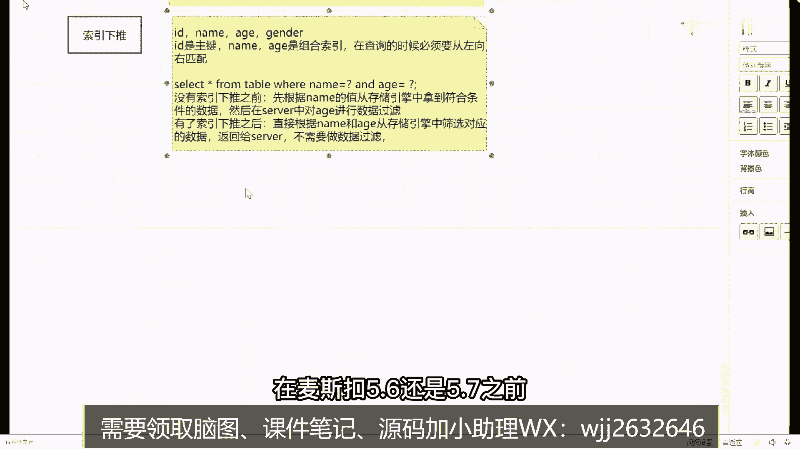

是不包含索引下推这个东西的，是5。6还是5。78，不忘的一个版本的啊，这个版本之后它才具备了索引下推这个功能，当然这个功能是不需要用户开启的，它默认是开启的，有一个属性15万吧。

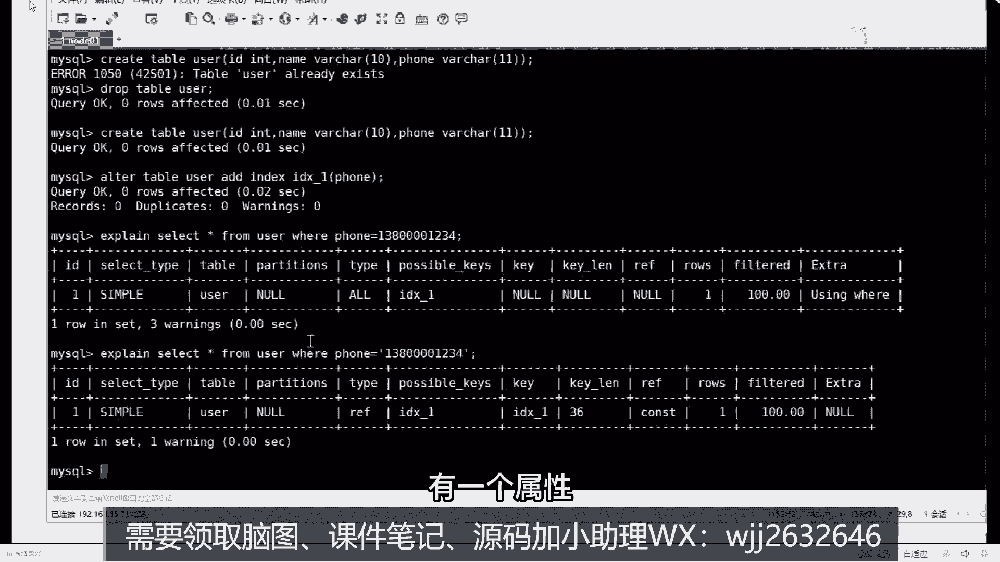

是那。

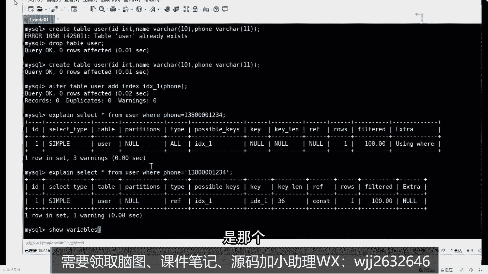

叫啥来着，叫。

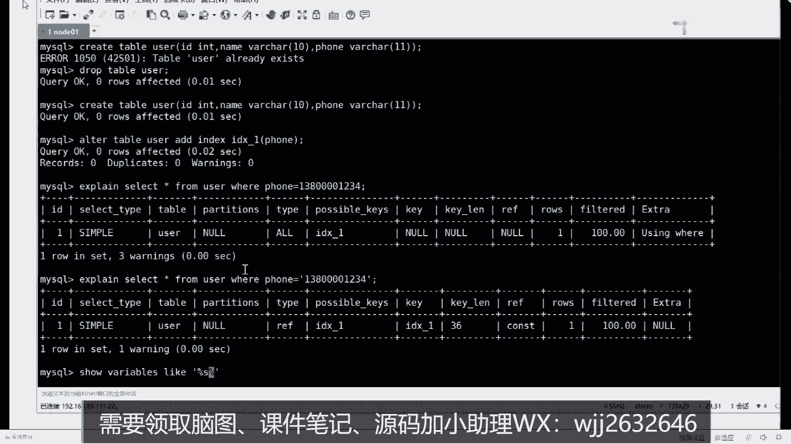

你一声，我来看啊，有一个东西叫索引下推，这个叫index，肯定是push down，它默认是开启的。

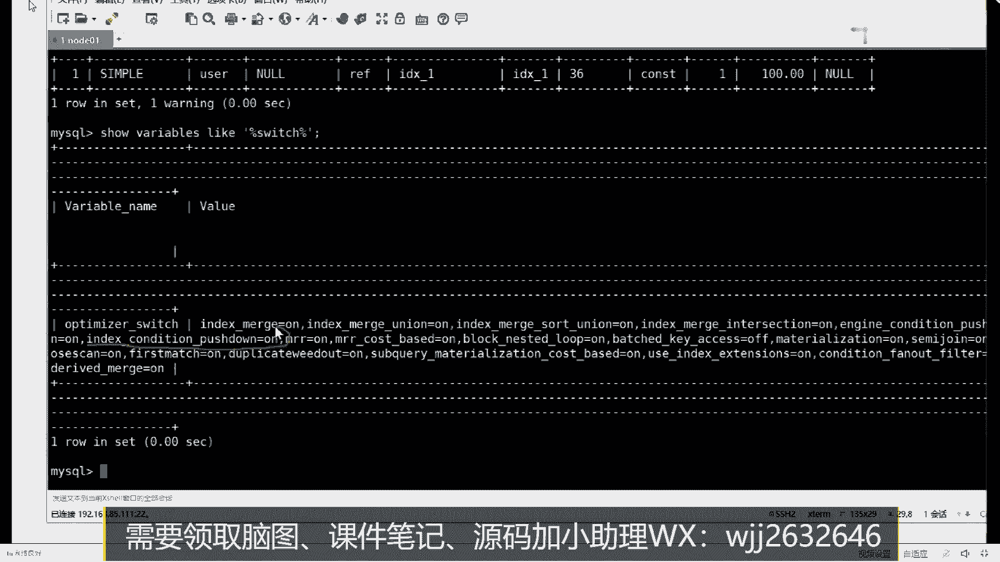

默认是开启的，在5。7之后默认就开启了，所以你不需要管这些东西。

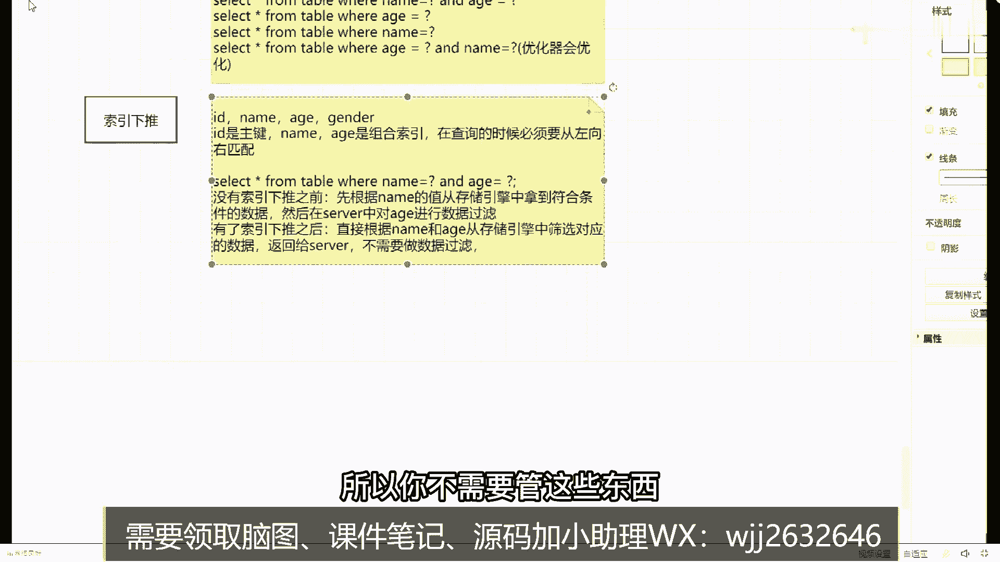

你大概知道，所以下跌是什么意思就可以了，明白意思了吧，这叫算下退，没别的意思，来这些点看学校同学给我扣个一，没看懂吗，没问题吧好吧，当这些东西都没问题之前都都没问题之后，下面我们要说一个东西了。

说啥最后一个问题，刚刚讲了这么多，讲这么多是吧，有有有啥用来告诉我。

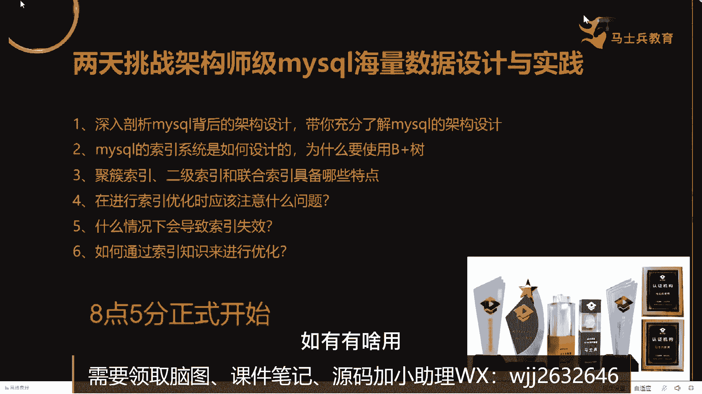

所以下载有用吗，所以下载有用吗，它的数据量是一个级别吗，你只匹配内幕，是把所有内幕匹配的数据反而回去了，age还没做数据筛选，你把mate和a这两个东西一起数据筛选，看筛选完数据是不是要少了。

你io量已经少少了吧，好吧，好了聊完这个东西之后，下面我们来聊最后一个东西，这个东西什么东西，所以优化我刚刚讲那么多东西了，讲那么多东西了，我们在回答索引优化问题的时候，我到底应该怎么去回答。

你不要上来之后，你不要上来之后就给面试官说，我通过判断之后发现我们的索引，我们的索引那个我没索引没有失效，所以我加了个索引字段，你这样去描述是没有意义的，你告诉我这个，所以这个优化问题我应该怎么去回答。

没有你所学的知识能回答吗，能回答，大院记住啊，你在回答优化问题的时候，你要给人的感觉是什么，是你真真正正的你做过优化，而不是说我从网上随便看了个帖子，我就能把优化的问题给大家说出来，不是这样的。

你要怎么去判断这件事情，非常简单，来听好了，这样的方式回答在之前，做叉叉项目的时候，我们有一个要数据量非常大哇，千万级别，千万级别好吧，写了一个非常简单的sql语句，就是一个条件，过滤好。

但是查询的效果非常差，花费了十几秒，哇通过分析之后，我发现通过查看执行计划后，也确实用到的索引是吧，而且查询条件非常简单，只有一个，怎么办，只有一个，怎么定义用法，能优化吗，啊怎么做。

利用前面所学的知识组合索引对覆盖话费，剃头说的非常对，现在可以说只有一个经过分析，发现我要查询的字段，字段用四个字段啊，但是这四个字段啊，而且这四个字段包含了查询的某一个查，包含了查询的。

还包含查询条件，因此不考虑减少回表，因此考虑在长安学过程中出现了大量的回表，好吧，此时将所有的查询表字段，和条件是组成了组合，所以好达到了优化效果好，执行完成之后，只需要，花费一秒左右就可以完成查询。

你这么说吗，拆开说绝对录播了，自己我看过对，是录播，我问你是录播吗，一直说录播吗，看到了吗，你能这样说吗，好同学们，你能能不能这样说，才说这能量扣一不能的，扣二能吗，不严谨，那不严谨吗。

我上课临时写的吗，你觉得哪儿不严谨，能不能自己学优化，能不能自己再编一下，能不能带上你自己的业务量，带上你自己的数据量可以吗，可以吧，我觉得没问题吧，嗯1000万数据加索引要dba来。

要dba以来没关系，你后面可以再加一个补充大量数据，添加索引字段信息的时候，可能会出现缩表情况，所以是跟那个那个，所以我提出建议使用什么，mysql提供的在线d d l操作，来完成天下索引的功能。

行不行，可以吗，这有漏洞对吧，给你补上了吧，有什么东西吗，粉丝都不知道这东西啊，在线b b r mysql，5。6版本之后出现一个在线地点啊，你可以给它进行索引的一个添加，没关系的。

这就是具体东西下去自己看明白了吗，这可以了吧对吧。

你黑马扎吗，我只是给到大家一个案例，我我并不是想把这个例子交给你们好吧，因为我既然公开课上讲到这玩意儿了，这玩意就烂大街了，明白吗，很多人都会抄走，很多人都会有这个东西，所以这东西不是你的加分项。

加分在什么地方，是这样的描述方式，你在写的时候一定要突出什么几个点，同学们记清楚了，第一个叫实际场景，你需要进行切换，第二个第21场景，第二个是什么，是问题的情况，第三个是优化的方式和你的思考。

思考的过程好吧，第四个是达到的效果，能懂这意思吗，这是你在回答对应的优化问题的时候，你整体的思路，你要以这样的方式去回答，而不是上来之后不要用三星，再用索引，不要这么去描述，能听到我想教给你的是啥吗。

来听白同学给我扣个一，能不能认懂，所以你把这种方式画出技巧，学会了，套用上你之前项目里面的案例不就完了吗，我不信你们项目里面没有对应的sql优化案例，不可能没有吧，光我现在学生问到我了。

我给你开一个实际的案例好吧，一个学生之前问我的，他实际公司里面的应用场景出现了问题，这数据量消耗比较慢，我给你看一下，太多了好吧，让我们来看你学生问我的，李老师打扰你一下，来看一下干什么事儿。

这个学生他的情况也非常简单，这是对应查询语句，sd什么cell number，cancel，什么什么chinese name，type of，type of product，这不多吧，这一句能看懂吗。

能看懂吧，我觉得这一句已经非常简单了，执行完成之后，他花费的时间是多少，0。104秒，我问一下这个0。104秒是快还是慢，快还是慢，大哥们负点责任，你们在说快再说慢的时候，能不能问一嘴数据量。

他过亿的数据量还还卖吗，别上来就慢跑快，你问一下数据量吗。

对不对，所以下次问了一个问题，他说打扰你一下，他说这个表总共才35万，数据category id等于6980，有20多万条好看的id，也要有索引字段了，好吧，我发完之后，他给我发了什么。

发现它对应的执行计划，杜老师，你看这个执行计划这样的，这个字段明显用到了索引，不是没用。

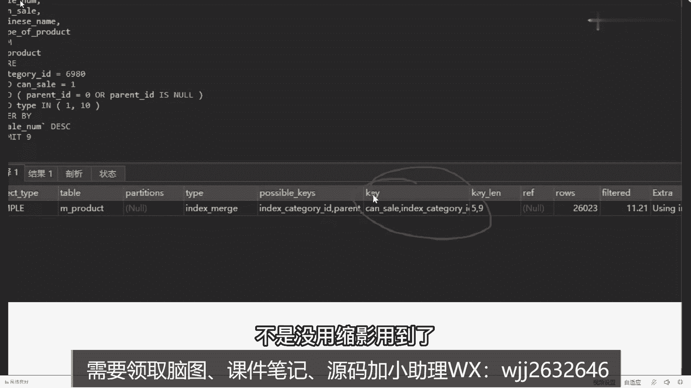

索引用到了听到索引了，但是效率依然很低，不太能满足我们的业务需要。

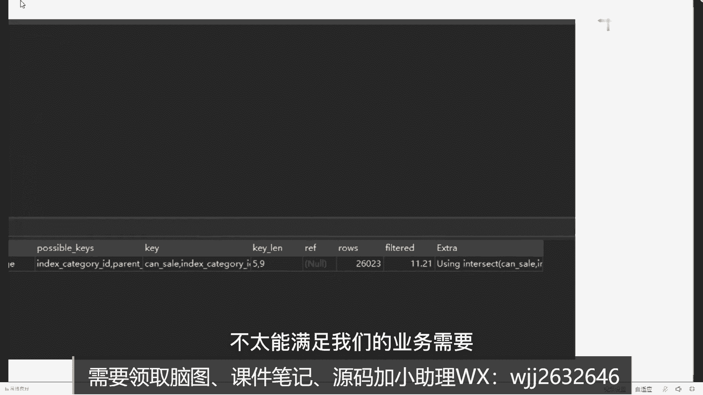

怎么办，我看完他之后，我说我可以ok，你可以考虑关闭一个属性叫index merge，我我刚开始怀疑啊，他可能触发了一些索引合并，所以导致了他出现了一些问题好吧，做完之后他说老师运行完了还是100多秒。

没有任何变化，0。106反而还慢了一点，我觉得这个那这东西肯定不行了对吧，再给它进行优化，我说这个有组合索引吗，可是没有组合索引，我说你串一个组合索引试试好吧，我串完之后他说还不行。

我说把排序再去掉试试看是不是排序的问题，是做了一堆，做了一堆检测完啊，都不行，还一样，这东西要慢慢去调整的，这次是0。1118秒好吧，再优化再优化，我说你加这个东西，再加上排序，加完之后。

这是它对应的结果，大家看看效果，谁叫我，我们出一下吧，0。106÷0。006，快了17倍。

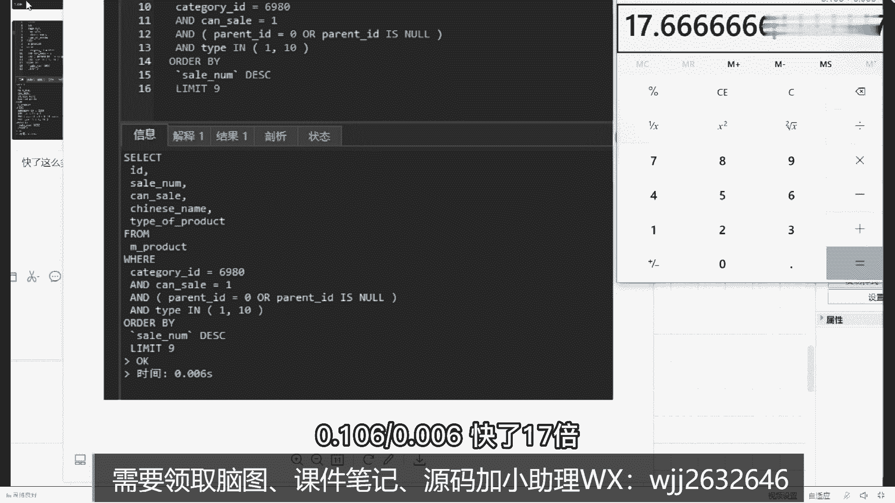

看明白了吗，就是快这么多，自己都自己都惊讶了，明白了吗，这是对应的数据吗，所以你要想明白说我要在哪些地方去进行优化，我要去调整哪些地方，你别两眼一抹黑，竞猜我最怕什么，你知道吗。

很多b i g同学找到我说，梁老师，你帮我看一下这个sl语怎么优化，你发给我，我也懵逼，真懵逼，我根本不知道怎么做，你想你发给我一个那么复杂的sql语句，然后你告诉我说老师你帮我优化一下。

我咋能给你优化了，我是个人，我又不是个神，能懂我意思吗，这经常说的一个一个很重要的一个问题，好吧，等下我给你找一下午一个同学，就今天下午一个学生刚给我发的，呃找一下，就这个。

我们等会儿等会儿我们看看这个sql语句啊，我跟你说，看完这个剧，我自己心态都崩了，嗯还没翻到，等一下，看这个，这是他给我发了一个sql语句，从select开始往下走走走走走，你去看这个sql语句。

你去看，这最后一句。

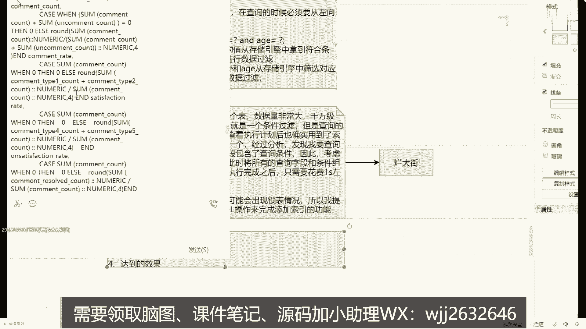

来你告诉我这样的语句，你告诉我，你让我去怎么优化，我我我我打优化，你告诉我怎么做，一条就一条没完，你告诉我能优化吗，我优化不了，我是个人，我不是个神，好不好，所以你们要搞清楚这个东西明白了。

所以不同的案例你要去分析他，说到底哪出现了问题，应该怎么去做，这些东西应该以什么方式进行优化，这才是最关键和最核心的点，明白了吗，噗都打结了，不是打结了，这个东西展开啊，微信里面可能看的比较长。

微信里面看的比较长，打开之后已经大概几十行几百行，但是依然很很麻烦啊，是不是，不是故意难为我，我在公司里面见过最长的一个，一个sql 145500行。

