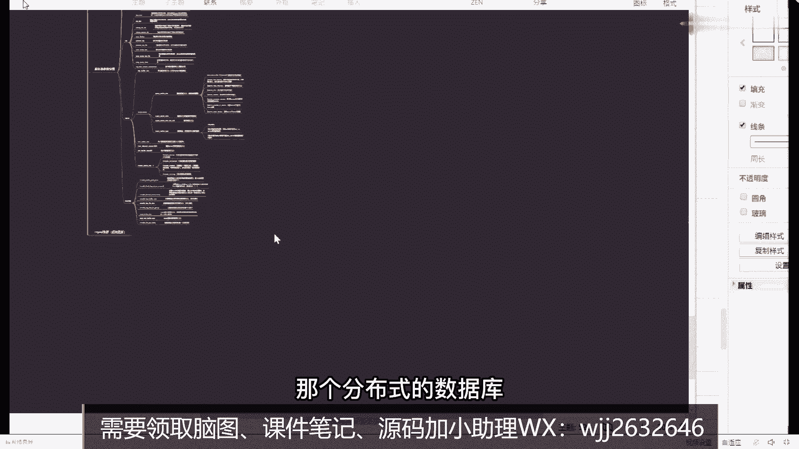

# 系列 6：P87：如果通过索引知识来进行优化？ - 马士兵学堂 - BV1RY4y1Q7DL

下次注意句，这很正常，所以你们需要说的是什么，我需要给你讲实啊，不是让你们去说这个思路语句长度的问题，而是说你们在进行优化的时候，不要2。18，黑，明白吗，最害怕的是这玩意儿啊，你要干嘛。

哪怕sql语句，sql语句再复杂，不管它多么复杂都没关系，你要学会去做拆分，你要自由就去拆分，你要一层一层的去迭代，一层一层的去搞这东西，把它理解错了，这才是最关键，最核心的，他是生病，铅笔干啥。

这很正常，但好多表在关里面就这死杂一点，复杂点也正常吧，明白意思吧，所以掌握合理的方式方法，这一点很重要啊，包括你们在提到这些优化问题的时候，再好好去思考，一定要按照我说的这个思路你去进行处理。

如果你按照这样的思路去解决的话，真的很麻烦，真的很麻烦，不要上来之后有老师你帮我调一下优，我咋调都调不了，好吧行了，这东西啊，咱们大概就聊这么多吧好吧，来这今天晚上有收获的同学给老师扣个一了，好不好。

讲了两个小时啊，我觉得我讲的已经够多了好吧，老师数据量过亿，增加索引会非常慢，有什么好的方式了，没办法，就是用在线d d l的方式来加索引，这个没别的招都能夸张，慢就慢，这个没没办法，我们打扰一下。

现在几位是不是应该分表了，举个例子，10万百万就比较合适，低于多少条加索引访问一下写系统，我觉得是这样哈，帮助听好你的问题，我们一般情况下数据量过千万级的时候，就要进行分部分表了，但这只是一个预估量。

它没有明显的一个数据统计，你过千万，你还要判断一件事，除了过千万这个级别之外，你还要判断什么东西，你要判断一个点，您每一行记录占用的空间是多大，每一行记录你一个一行业里面。

十个字段和50个字段和三个字段，效果一定是不一样的，所以不一定是说过千万，我就要重复分表，这东西是干什么，是根据你实际的需求来判定，当你发现你的表数据变多之后，你查询不管怎么优化都优化不了了。

这个时候可以考虑添加我们对应的啊，可以进入我们的错误分表，但不是说我一旦过千万之后，就一定要分出去秒，这也没什么说的，没什么说的好吧，如果my mysql中某个字，但是汉字的话。

在汉字键索引该b加数是汉字的话，怎么保持有序，奥斯干嘛吗，字典序吗，英文名字典序嘛，数字就是数值嘛，汉字的话你要干嘛嘛，但是建议不要用汉字，不要用汉字，汉字的话这个太麻烦了，好吧好吧行了，这东西啊。

咱们大概就聊这么多吧，这只是mysql里面的呃，一丢丢或者一奶奶，刚刚也给大家提到了相关的一些优化的问题啊，给大家看一个文档，就是之前我在讲这个mysql优化课的时候，大家看一下，这叫msl调优。

讲mysql调优的时候，给大家讲到的一些细节上的一些点，大家看一下，你调料里面包含的东西非常多，你不要上来之后就想着说我要加索引，所以优化的时候你可以分几个维度和几个细节。

比如说你关于mysql性能的一个监控是什么样子的，对吧，你对应mysql的一些呃spammer表结构是什么样子的，你的索引要怎么进行优化，包括你对应的sql语句要怎么调整，包括你的参数要怎么去优优化。

怎么去调整，包括你是不是要加分工那个分布式的数据库。

这东西都要合理判断好吧，沈阳马天志说看不到，我说话吗，对看不到的，因为是录播，所以看不到，开玩笑，画风有什么软件啊，我刚说了吗，分叶云笔记，枫叶云笔记，是直播是直播，哎呀是直播啊，那你不理我。

我没看到你发的消息啊，你发啥了，没看到吗，梁老师结束的时候，可以谈一下，不同的存储引擎对于事物的支持区别吗，可以另外给压缩了，来说一下它们的区别呃，我之前讲过这东西，我现在在哪儿讲，我找一下。

我记得之前讲过这玩意儿好像，四个，我，找一下，所以，太多了个旺，看这图吧，这是之前画的一张图啊，就是关于这个组合式九的msl，amex up和windodb的呃，首先第一个综艺类型masm面。

只有非技术索引性层地狱里面有剧组索引，也有非剧索引，第二个事物呃，my sm是不支持事物的，印度db是支持事务的，第二个第三个表所my sum支持表，所应当db也支持表锁行锁，my sum不支持。

但应当db支持外界maximism，不支持移动db支持全员索引masm支持，然后应用db五点之后支持操作，大量查询的时候用我们的my su，然后增删改查的时候就移动db，但这东西啊。

坦白说一般情况下移动db用的更多一点，其他用的并不是特别多，好你大概了解一下就够了，ok所东西啊，咱们明天讲吧，明天我讲一下事物相关的点，好，检查事物一些特性啊，检查事物特性的一些实现原理。

讲一下mv c c，咱们再到时再聊好吧，老师有主从知识吗，有主从的话，我讲过主从复制，然后讲过读写分离仪，讲过分部分表都都讲过，包括像mt这样东西我也讲过，好吧，就是你学生问你的那个，有学生问我。

那个为啥那个索引添加之后排序变坏了，就减少了回表嘛，就减少了回表，就是减少回表，我那个东西我没公开课那个那个那个不是主从，这东西我公开课没讲过啊，都是在vip里面讲的，公开课没讲过，来看一下吧。

嗯这里有一定的文档给大家看一下，就是比如说主动复制的原理，我之前写的什么主动复制原理是啥，怎么去复制的步骤是啥，形式有哪些，然后主动复制延时应该怎么去做，这是应该都提到过，都讲过这个东西好吧。

包括它的一些安装配置，你要怎么去配，搭建的时候要怎么去搭建详细的步骤，这些东西都有好吧，他那个也是减少了回表的产生，就这么干的是吧，然后包括像my cashing sphere，我都给讲过，没讲过。

ok笔记能发下吗，笔记不发了发吗，写这种东西要发吗，再说吧好吧，都发下来吧，那么多markdown想多了好吧，就发ok好了，今天的这个具体干货，咱们就聊这么多吧好吧，下面呢聊点更好玩的东西，聊聊什么啊。

不发怎么学，听我讲这些东西你就慢慢消化吧。

不发你那个那个那些段都发了，跟vip同学太太不公平了好吧，下面聊点好玩的东西吧，聊点好玩的啥啊，刚刚给大家讲了mico相关的东西，我刚刚给大家看了一下msl调的一个文档啊。

呃下面给大家说一些东西，就是你在学技术的时候，或者你在学习的时候到底要怎么去学习，接下广告，我不不打广告，我们就聊会儿天，我们不麦克，今天不卖课，不给大家打广告，里面点好玩的东西啊，就是聊到一个问题。

你们觉得我今天讲完这个课之后，你们都觉得收获比较大，我能学到很多东西，这样我想给大家说一件事是什么，希望大家在以后学习的时候，能有一个很重要的东西，叫什么叫方向性的东西，这东西我觉得是比较重要的。

什么意思啊，有很多同学听完我这个讲东西之后，你觉得我把索引讲完了吗，或者你觉得我把索引讲完整了吗，其实没有啊，这所有里面包含的东西还有很多，这只是其中的一些细节，或者一些比较重要的部分。

和面试中问的比较多的东西，我优先拿出来给你讲，但其实索里面包含的东西还很多，大家以后在学习的时候啊，你们既然晚上来听课了，意味着你们平常的时候，自己可能也会学点别的东西，包，或者以后琢磨点东西对吧。

一定要一直在不断的学习，那么我想说的是什么，你们在学习的时候一定要有一个方向，同时一定要注意一件事，什么事儿叫体系化学习，体系化学习这件事情是非常非常重要，什么叫体系化学习嗯，很多同学出去面试的时候。

应该收到过一些评价，比如说知识碎片化，比如知识不成体系，一定收到过这样的一些评价，这些评价都反映了你在学习技术的时候，你自己存在的一些短板，所以我希望同学们在学习的时候，一定要有一个体系化学习。

我就是不要说我今天学一点，每天学一点或者学一点，但学的东西都不一样，这是最可怕的一件事情，包括我们的vip也经常问我一个问题的老师，我在学技术的时候，我是多个技术并行着学，还是说我学完某一个点之后。

我再去学另外一个点，你们觉得哪个好一点，你们觉得病情好还是单独学一个好一发，一般都是看到什么学什么，告诉大家我个人的建议啊，大家学习的时候一个一个来，你千万不要同一时刻看三门新技术，或者看n门新技术。

或者看一门技术，千万不要这样，这边一定要一个一个来，因为11111堆东西堆到你那儿之后，你很麻烦，或者你看起来会很容易忘，或者说体育效果是非常非常差的，学习就是把某一个体系，某个体系学完了还有一个点。

还有一点也很重要，一定会用到自己的一些知识盲区，老师讲课的时候一定会提到一些点，当你提到了一些点之后，你会发现一件事，什么事，这东西我不会，那东西不会那么很多同学会干嘛呢，会从这个点里面离开。

把我要搞明白的东西，我搞明白之后，我再接着来学习，有多少人这么干的，有吗，就比如我学mysql，昨天讲了一个o l a p，我不知道是啥意思好了，我去学o l a p，我把o l p搞明白之后。

我再回过头来学mysql，这种方式，也是大家非常非常要就一定要摒弃掉的，我刚才有好的方式是什么，你在学习技术的时候，学习技术的时候，先去过一遍整体的知识的总体概括，概括完了之后，当你不会的点。

拿一个本或拿一个文档，在线文档把它给记录下来，你把它记录下来之后，接着往下学，等你有时间有一些零碎的时间，额外的时间之后再去补那些你不会的点，千万不要让自己跑偏了，也有可能有很多学生是学生是这样学习的。

他沿着一条主线去学习学学的翻译，有东西不会了好了，我从中间分一条叉出来对吧，从这分量差出来，然后又有同学说老师这个东西我也不会好吧，又分量差出来又被拿出来，有些同学还比较好，他能回归到主线上面去。

但有很多同学你是回归不到主线的，你学学学pp了，明白吗，你学篇之后就变得很麻烦，你懂我意思吧，所以这些东西才是你要摒弃一些点，这都是学习方法上面的一些小技巧，然后除了这个东西之外，约等于1米8。

说有详细的路线分享吗，呃想要路线，一会我可以给你，但是我在讲路线之前啊，我还想再说明一个东西，或者再说明一件事，你们有人对学习路线有疑惑吗，老师我现在想学学要学什么东西，有疑惑就要扣101或者扣二。

有疑惑吗，都有是吧，当你在有疑惑之前，或者说当你在要路线之前，出现之前，我需要你们先做一件事情，什么事情，这东西，叫定位，你们知道很多定位吗，什么叫定位啊，谁能给我解释一下，目标菜头师，目标是全站。

想搞全站同学，我建议你换一个换换换一个目标好吧，先生东西叫定位，什么叫定位啊，现在啊这个技术太太太多了，明白吗，就是你要学的话，你根本学不过，你根本学不过来，这学起来是非常非常吃力，而且他学习的时候。

他不一定能收到对应好的效果，所以我非常不建议说你真的说把所有剧都学了，但是你一定要有一个定位，定位什么意思，自己处于哪一个水平，之前我有一个vip学生报名了，报名之后让我做规划，规划的时候呢。

说老师我现在年薪14k，年轻时不是月薪14k，我想出明年冲击年薪50万，你觉得可能吗，挺好啊，现在月薪14k，明年冲击年薪50万，你觉得可能吗，太难了太难了，真的太难了，好吧，记住一句话。

叫饭要一口一口吃，路要一步一步走，技术要一个一个学，所以我为什么说你要定位第一任老师，那我现在到底处于初级，中级高级到底属于哪个哪个阶段，我没法去判断啊，很简单，现在国内或者说现在的市场。

市场上面没有一个明确的标准，说你掌握了什么技术，你就是一个初级的掌握了什么技术啊，就是高级的掌握什么技术，就是中级的没有障碍，拼标准，但是有一个标准是存在的，什么东西叫职级，你们知道吗。

当你们接到大考之后，一般情况下是都要有直接评级的哇，最简单的题节举例子，比如说阿里的我们从p5 到p8 ，对不对，这就是最基本的一个直接像你上网搜，你是能看到很多，对于不同职级的一些技术要求的。

进行更更更改的，当你掌握好这些东西之后，你可以对号入座，你自己现在大于位于某一个水平，同学们来方便同学，你可以给我发一下，你现在的工作年限加你的薪水，你能方便发一下吗，我觉得今天晚上大部分来听课的同学。

你们大部分人的就是薪水等级，或者你们大部分职级应该处于一个中级往上，稍微多那么一点点的一个阶段，就可能很少有那种高级这样，一个一个一个一个一个一个水平的学生，因为接下来我讲的东西其实并不是特别难。

它其实属于是一些基础的必备的常用知识，9年16x14，在合肥3年15 6年10万和6。5k实习，刚毕业10k哇，这80k合肥知道吗，是大家发现了，你们其实大部分人其实应该处于的是什么。

是p5 这个级级别什么意思，我能去做一些独立的开发了，我对我们基本的一些框架，比如说s s m对吧，比如说spring boot，比如说spring cod这些基本的应用我是没问题的啊。

基本应用是没问题的，那其实你当你了解完这些东西之后，下一步你就要考虑到我老师我要掌握p6 ，或者说我要达到p6 这个级别，如果你拿到p6 级别，那p6 我应该具备什么样的能力，或者我应该学什么样的技术。

当你聊到p6 这块之后，下一步才是聊什么，聊路线的事情，明白吗，所以不要把这个前后的顺序给颠倒了，很多同学就是因为把前后的顺序颠倒之后，导致你学起来一直处于一个迷茫的阶段，迷茫阶段哦，比较迷茫。

就一定是先搞清楚你自己的定位，就是我做事情一直是这样的，第一步先有一个定位或分析，分析完之后，第二步数据对应的目标，网站的目标是小目标，不是大目标，有老师，我要年薪百万，老师我要领取白富美，别扯淡。

我现在45k，下一份我就要20k，我就25k，这是比较现实的，一上来就我家构师，我年年纪大了，你舍不得我，财富恶龙咆哮，目标28岁，财富自由，这个梦做的有点大啊，并不是达不到好吧，但是比较难。

所以先输入一个小目标，比如先赚他一个亿，是这意思，现有目标，有了目标之后，下一步干什么事，变成这叫制定计划了吗，对吧，当计划完成之后，下一步才是什么东西，就像一件事就落实，张老师，当然这里面最关键。

什么叫定下一个目标，你还没干呢，就定下一个目标，等这东西实现之后实现了，然后再回过头来搞搞定位，搞目标是这样逻辑，你还没干呢，你就跟下一目标干嘛，一点意义都没有，听明白意思吗，你们以后在学习也好。

在干嘛也好，一定要遵循这样的一个路线，这东西我觉得是心理有效的啊，当然这里面最关键是什么，是这个步骤目标，你的目标不要太远大，不要太红的，这辈子都实现不了，不要带这个东西没意义没意义啊，最关键的是什么。

你要树立一个你能好吧，经过一段时间努力之后，你能够得着的一个目标，而不是一个痴人说梦的目标哇，这才是最重要，最最关键的是年龄不是问题吧，年龄又会有问题，但是你要结合你自己的情况。

在最短时间之内达到你想要的东西就完事了，就这么简单，所以把这个东西你要想明白了，不要去抱怨卷这件事情啊，卷是常态，明白吗，你是改变不了卷这件事情的，所以你能做的事情只有一件事，你去改变你自己。

而不是改变卷这个现现状，卷这个行业动态改变不了，明白了吗，你要改变的是你自己，所以当你把这套东西搞清楚之后好了，我们再来聊路线的事情，比如说这个计划的事情，比如老师那p6 应该学什么东西来。

有人好奇p6 要学什么吗，好奇给老师扣个一，有没有好奇，地址不是说年龄大了怎么办，好了，一会儿我们留出点时间，你们把你们的个人情况告诉我，咱们一会简单聊一下你们个人的规划，我先告诉大家路线是什么样子。

路线什么样子好吧，p6 年薪多少，p6 的年薪大概是40万~60万啊，当然前两天我听曹老师说，阿里出了一个p6 的顶薪，大概是90万，p6 的底薪90万，但这个很难了很难了好吧。

它不是一个短期内能实现的目标哦，所以你需要是什么，比如说这个地方p6 他看中的是什么，p心他看中的是什么，你要做到心里有数明白吗，p6 需要是啥呀，其实非常简单，给大家看一下。

这里面其实就对应路线注意了，p6 它针对的是什么叫操作与落地，明白吗，什么叫操作落地，这个操作流落地里面包含了非常多的东西，我们一块合一下，只能把你们吓到了，好吧，这是hero里面。

p6 里面要包含的相关的核心竞争点，和核心知识点，好吧，比如说现在你要想达到p6 的话，你要有一些自己的前置知识，什么叫全日知识，比如s m spring boot，我能做一些独立的开发对吧。

了解一些新特性什么之类的东西是前置知识，我觉得基本上你做开发了都要具备这样的能力，那再往下看，你还要掌握什么，掌握一些底层技术，比如说操作系统的，比如说计算机组成原理的，比如说网络的，比如说i o的。

比如说linux的，比如运维的以及数据结构和算法的东西，这都是你要掌握的必备的一些底层的技术，现在面试他就问这些，其实不单单是p6 ，你在面临一些上规模的公司的这些开发的时候。

中高级职位的时候基本上都会涉及到这些东西，好吧，再比如说并发编程，你要了解操作系统的并发知识队列的东西，内存模型的东西，线程池的并发集合的c s s y local的j u c的，gm i h的。

你都掌握，是华沙等，说掌握的话，要掌掌握到什么样的一个程度，你要能把这套东西形成自己的一套知识图谱，或者说知识体系，不知识体系什么意思，我一样可以给大家看一个东西，这是我们之前vip他自己做的一个笔记。

他在学jvm的时候，他做的一套东西，我给你看一下，你是能描述出来，当你学完一个东西之后，你如果能把笔记做成这样就ok了，在我的评估范围内，我觉得就ok了，在这个学生他学完jvm之后，他自己画的一套笔记。

我做了一个自己的j a m思维导图，如果你能做成这样子，我觉得你就学到位了，就这么简单，还是那句话，你要掌握是什么，同学们永远记住这两个字，叫体系，能懂吗，不是某一个点，不是问到垃圾回收器的。

我知道是个啥，那能不能把那些同学更好，知道是啥，不是这些东西，你要对各个细节你都要考明白，我可以给你放大看，每个地方都是他做的一些详细的东西，看了吗，做的很清楚啊，参数也好，调整也好。

什么东西啊都做的非常完善，非常完整，这才是你应该掌握的哇，你要能形成这样一套东西出来，所以就说当面试官问到你，不管问到你什么技术的时候，脑海里面啪能打开一张图，同年包含了非常多的东西。

他只要问到三观点了，你能侃侃而谈，这才是最主要的好吧，那现在应该很牛吧，确实很厉害确实很厉害哦，所以这才是你们需要学习的东西对吧，这是并发编程这一块，除了之外，你要掌握一些通信框架的一些东西。

比如说reaper里面通信double对吧，r p c的rust thrust和net这些东西都要掌握，用中间件也要掌握，rock mq卡不卡对吧，都是必备的基础，包括像中间件的应用mem catch。

还有这个redis对吧，包括你要掌握一些软件设计的，一些基础的理论知识，是设计模式，软件工程了对吧，敏捷开发了对吧，一些文档的案例编写的都有，包括你们的分布式架构实践，分布式架构时间。

不单单里面包含了什么分布式事务，分布式锁，分布式id了，不单单包含这些东西，还包含了一系列上分布式密度，分布式绘画，分布式任务，分布式权限控制，分布式预警系统，分布式链链追踪等等东西。

都是你要进行掌握的把，包括你要掌握到微服务对吧，注册发现了网关，路由了服务调用了负载，集成了nfx阿里巴巴的多少物对吧，以及性能调优的cfm调优mysql调用，他们看调用，但这个调用对吧。

海量数据存储的对吧，e的培根house messl news，太dd的，对不对，包括我们搜索e的，对不对，包括像海量数据处理的一些东西，flink还有很多东西，包括像运维的，你要了解一点啊。

di要了解一点，然后测试的你肯定要稍微了解一点对吧，service nt东西了解一下，所以这些东西都是你要进行储备的，明白意思吧，你说如果你想达到p6 这样的一个，技术实力的话。

那么这些核心点就是你要处理的东西，学校做的同学给老师扣个一东西多吗，那你们觉得多多多吧，很多吧，这些东西你都需要学习吗，你需要把所有的东西都一口气学完吗，需要不需要，我告诉大家。

如果谁想着我要一口气把这些东西学完，我觉得你肤浅，为什么技术这东西它是没有边界的，明白吗，你今天学完一个东西，明天可能出一些新的东西，你永远学不完，那你要学的是什么东西，学的是啥东西。

掌握你现在必备的基础，那么你可能会疑惑，老师我现在必备的是啥，这里面有你一点都不会的吗，有没有你现在一点都不会了，你能不能抓紧时间学，能不能从这些模块里面挑一些东西拿出来，优先去学习，能不能。

这是没问题的对吧，你能不能给自己规定一个时间轴，就我刚刚说的，我这一生的目标或这一个月的目标，我要把什么，我要把并发编程搞定，下一个目标，我要把中间键搞定，下一下这个目标，我要把什么东西搞定。

能不能做这样的东西，不怕你不干好吧，就怕你什么，就怕你们瞎干，盲目的干明白吗，所以当你这个东西给到你之后，你能不能有明显的一个路线或大纲，在当你有这样路线之后，你一块一块学不行吗，好吧，虽然说可以。

但是不知道选哪些，不知道选哪些，也非常简单，也非常简单，怎么做，我告诉你第一路线给到你了，你从这个路线里面诶，我问一下，有人想要这个路线吗，想给老师扣个一，有人想要的，谁如果想要的去找咱们的班主老师。

找他们去领取扫地的二维码和扫码器进行领取，能明白这意思吧，上面进行领取，如果你之前加过咱们任何一个咨询老师，找他领取，也是ok的，也是ok的，明白意思吗，好吧，我要说的是什么，当你有这东西之后。

你可以自己从里面选择一些你不会的点，但这是一个方式，除了这样的方式之外，还有什么方式，我再解释一下，还可以干一件事，你找一个领路人，找一个你的师哥师姐，找一下你的一个领导，让他来根据你个人的技术实力。

帮你从里面能不能提取出一些关键的点，你们这样的人，如果这样的人也没有的话，那我告诉你，你就需要报名马士兵教育的课，什么意思，你不知道没关系，老师知道我们会告诉你一步步你要怎么做，懂我意思吗。

啊拿到了和人最差了好多差就对了，人不怕自己说我现在混的差，而最怕什么，最怕不知不自知，明白吗，就我不知道学什么，所以你要掌握是什么东西，把这些关键的核心点，你要知道我哪儿缺乏了。

我要把什么技术给弥补起来，这才是最主要和最核心的关键点，听明白了吗，所以如果需要的话，整体设计领取好，详细看一下东西，我说的东西很多，但不需要你，你你每个挨个都选一下，有老师可以帮你。

慢慢的捋出一条适合你自己的独特的路线，而且每个人的目标是不一样的，所以你每个人需要储备的技术，也不是也是不一样的，如果你真的把这些点都学会了，在p6 级别里面，你真的可以拿到顶薪，明白了吗。

顶薪难度最高，这个东西完全不夸张好，这才是你要储备的，这只是p6 这个职级，这个级别你需要储备的，有人想看pc吗，想看pc的，给老师扣个一，想看吗，就pc我要掌握什么样的技术实力。

这是p6 的p6 强调的是什么叫操作与落地，pc小调，什么叫原理与设计，这里面我们依然包含了一系列的东西，好吧先合一下好吧，然后什么第一个叫分布式设计的理论基础。

这里面包含了一些像c a p的puzzles了，rap了啊，该s i p到这样的一些协议，第二个你要掌握一些核心的算法，分别是架构相关算法和机器学习算法，第三个你要掌握一些框架的原理，什么血压桶呢。

my best is对吧，他们看到这个cd m cute net hosports e l k，你都需要掌握这些东西啊，包括有一个高性能架构设计，什么叫高性能架构设计，比如说分流设计怎么做。

服务并行并发怎么做，缓存设计怎么做，存储设计怎么做，可靠性设计怎么做，并用保护设计怎么做，多位了解，再比如说下面还有一个案例驱动设计，我们这里面提供了一堆的项目设计的课程，比如说每秒数是每秒数10万。

超高并发通用设计专题，有一堆的案例告诉你怎么去设计好吧，应该有什么技术键技术站进行相关的一个搭建，比如说有n个九全链路，高可用通用设计专题对吧，有云集百万年薪好吧，案例驱动式架构设计专题对吧。

有我们的一级流量，多级缓存的架构设计专题，这里面我们更多承受，就不单单是那些比你基础的技术实力了，或基础的一些应用了，更多强调是什么，就是我们整体的架构设计能力了啊，这才是你能拿到pc这个级别。

最最最重要和最最最最核心的关键点，明白意思吗，除此之外，这只是p7 的，这边还给你搭配了一堆的项目的课程对吧，有一些用户中心的，有一些架构设计的，比如说我们有一堆项目课。

有一些网多人在线网游服务器的对吧，东方商城的有没有飞机出行的，有推推荐的，有刘诗云平台的对吧，这都是你要讲的相关的核心点，讲数据库连接池了吗，讲了数据连这最最基础的内容嘛，肯定要讲了。

包括有人说老师我现在技术学完了，我需要准备面试怎么办。

没关系。