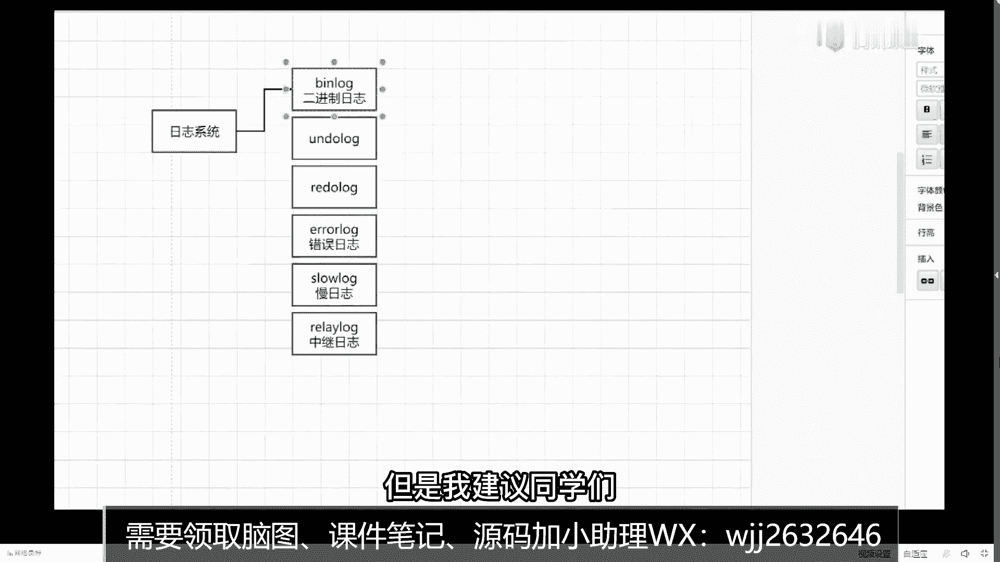

# 马士兵教育MCA架构师课程 - P88：事务的四个特点是什么？他们的实现原理是什么？ - 马士兵学堂 - BV1RY4y1Q7DL

来先聊第一个问题，mysql事务，mysql的事物它有几个特点，结合点，谁能告诉我，四个吧，我觉得所有人都能说出来，叫a c i d，对不对，它们分别对应过来的特性是什么特性，第一个叫做原子性对吧。

第二个把这个字调大一点，第二个叫做一致性，第三个叫做隔离性，第四个叫做持久性，这几个东西啊，我觉得大部分同学你只要在接触数据库的时候，都会学习这几个点，但是这个东西不是我之前想讲的重心。

我想讲的重心是什么，这四个特点，它们分别是用什么样的方式来进行实现的，也就是说实现方式是什么，好吧，一定要做到什么叫知其然还要知其所以然，这件事很重要，什么叫实现方式，也就是说我们的实现原理是什么呢。

他通过想要的方式来进行保证的好吧，那先说第一个吧，原子性啥叫原子性来着，什么叫原则性，就要么全部成功，要么全部失败，是不是这意思好吧，那我怎么保证它啊，其实成功的话非常简单，我数据直接更新成功就可以了。

如果失败的话，我是需要进行回滚的，那我怎么样能够把数据给回滚回去呢，这里面其实涉及到一个问题，什么问题，同一个事物里面可能会包含12345，n多条的sql语句，这n多条sql语句里面。

前三条我可能已经执行成功了，但第四条和第五条执行失败了，一旦失败之后，我前三条执行成功的sql语句，也要回滚到之前的历史版本里面，那我问一下，如果让你自己来实现这个东西，你会怎么实现。

就你自己会怎么实现，是吗，其实你可以做一些思考吗，我只要能做一件事就可以了，我保留着我之前的数据的历史状态，如果我没有提交，我的历史状态依然保持着，当我需要回滚的时候。

我是不是可以把我历史数据重新拿回来，回放进去不就完了吗，是不是这意思好吧，所以这里面是什么样的一个方式，注意了，我先说它底层的实现，基本原则性是通过什么来实现呢。

是通过一个东西叫undo log来进行实现的，来知道undo log的扣一，不知道undo log的扣二，好了，有很多同学不清楚这玩意儿，不清楚这玩意的话，我们来说明一下mysql里面的日志。

专门聊一下这个日志系统，你们在日常开发中啊，其实日志用的也是非常非常多的，在mexico这个图里面，或者msl这个竞争里面，它也包含了非常多的日志，比如说我们比较熟练的日志有哪些啊。

第一个比如说blog，你们是知道的对吧，这个用的是最多的对吧，除了blog之外，第二个刚刚提到的read on the log，除了on blog之外，还有什么，还有redo log对吧。

以及还有很多同学说老师还有这个东西叫error log，错误日志吗对吧，还有什么，slow log慢日志吗，对吧，还有什么，relay vlog r e l a y logo，有人在这里面。

它其实包含了屏幕不动了吗，hello，hello，屏幕不动吗，能看屏幕吗，应该是应该是用浏览器的同学卡了，你们把那个浏览器刷新一下，好不好，把浏览器刷新一下，刷新一下，你在这个地方我写了一堆的日志。

一堆的日志，这件事里面有些用的比较多，有些用的比较少，挨个给大家解释，第一个vlog，它叫什么呢，叫做中继日志，中介就是这个东西啊，是在主从复制的时候用到的，暂时你可以先不管它，或者先不了解他。

在主从复制或主从同步的时候，会用到这玩意儿是吧，这个叫slog，叫慢日志吧，也就是说你在你的数据库里面，经常会开启慢查询，当一个sql语句执行时间，超过某一个限定的范围的时候。

会在我的slog里面记录条日志，我可以根据这个日志来判断一下哪条思路，语句执行的比较慢，那么来进行相关的一个调整对吧，这个这个叫erroid，什么意思，错误日志吗，在整个mysql执行过程中。

如果某一个呃操作出错了，会进入到所有errolog里面去，就这几个，这个我觉得还是比较容易或者比较好理解的啊，上面这三个我需要重点给大家解释一下，这是我们今天要聊的比较多的东西，为啥删掉不删掉就留着嘛。

无所谓了，写写下错误日志，慢日志好吧，留着留着留着，你们说留着就留着，什么时候出现错误日志，你程序出错的时候就出现嘛，对吧，这有啥，下面我要聊出去聊这三个东西啊，这三个东西上面这三个给我们今天讲的课程。

关联度会比较高一点，第一个blog blog叫什么叫二进制日志文件好吧，他在mysql里面默认是不开启的，但是我建议同学们不管是你自己练习也好。

还是生产环境里面也好，最好把冰冻保存开启，因为它能够帮助我们进行数据同步以及恢复，这事很重要，也就是说当你有了blog之后，哪怕你的数据丢失掉了，我也can you。

可以根据我们的blog把数据给恢复回来，好吧，下一个叫undo log，什么叫undo log，它的名称叫做回滚日志，回滚日志是吧，还有一个relog，它叫什么叫前滚日志，这当做自己取的名字啊。

前滚这是一个回滚，一个前滚，他俩其实相相对应的，相对应的，那我想说的是什么，一会儿我会重点解释一下undo log和redo log，他们两个的实现机制是什么，但是我这要强调一件什么事。

同学们一定要注意了，我们的blog，昨天我给大家讲解过mysql相关的一些架构体系了，那这样我要说明的是一件什么事，情，注意blog它归属的层次是谁，是massive的server层。

而我们的undo log和我们的resulg，它并不是存储在masl server层里面的，它是属于哪个呢，它是属于in no db这种存储引擎里面去的，这是它们之间的区别。

一定要知道它在哪一个层次里面去生效，所以我们昨天今天我们讲事物吗，mason它是不支持事务的，但是inno db是支持事务的，所以这两个东西重点的时候就聊inno db相关的，合适点，能听明白吗。

来我现在讲的这些东西能理解的，给老师扣一，能理解吗，好了这些都能理解的好，我来回答出来，那它到底是怎么实现的呢，其实非常简单，我刚才已经说过了，如果我们想进行回滚的话。

我如果保留了我之前某一行记录的某一个，历史状态或历史版本的话，在我没有提交，或者说我失败之后，能不能恢复到我上一个历史版本的状态，能还是不能能不能，就我考的历史版本吗，有个历史版本之后好。

我回复回去不就完事了吗，就相当于你们在操作系统里面，或者你们在做一些呃备份的时候，是不是有一个时间，是不是有一个the time step的东西，你是不是不是tesp有个叫快到的东西。

是不是可以恢复到某一个历史时间状态，把数据恢复回去，特别是在虚拟机的时候，是不是快到，这东西就相当于是一个快照的一个组件点，当然很多东西啊还不太了解，underdog里面到底包含了什么样的一些信息。

一会儿我会通过画图的方式，给大家做一个完整的描述，你记住原子性是通过undo log来实现就够了，这是第一个好吧，那么第二个我们的一致性先扔一边，我先说隔离性，隔离性是通过什么实现，什么叫隔离性。

其实也非常好理解，比如说在并行运行的各个事物，它们之间相互独立，互不干扰啊，对不对，也就是说我一个事物在运行着，另一个事物，不能去影响我当前正在执行的这个事物，那这东西我要怎么来实现呢。

其实这里面涉及的更多的是并发相关的一些，基本操作吧，你想我该怎么做，让你自己来，实际上话你会怎么实现，好了松饼说了一个字，叫锁，确实是通过锁的机制来进行实现的，但是这有一个问题，同学们。

如果我给我们的事物加锁，会给我们的数据加锁之后，加锁之后的效率是高还是低，听到问题，加锁之后的效率是高还是低，低是不是要低，马老师之前讲事物的时候，经常讲述的时候，经常说，当你一个人上厕所之后。

他必须要等你出来之后，你才能接得上，是不是意思效率比较低，但是遇到我们这种大型的，或大量的并发处决的时候，如果我全部加锁的话，很明显效率是比较低的，因此在隔离性这块它除了用锁实现之外。

还会包含另外的一个技术点，叫做mv c c，什么叫mv cc，它的全称叫多版本并发控制好，music version control c control，这意思是叫mc s v cz啊。

有多少同学在之前面试过程中被笨到过，给老师扣，一有人面试中被问到过吗，你有没有啊，应该有吧，反正我们的vip问过我很多次这样的问题啊，所以我把这个mv c c给大家做了一个，非常非常详细的讲解。

你们之前可能有很多同学从网上搜过一些帖子，关于mc c的，但是啊我也看过一些帖子，我觉得里面说的东西并不是特别完善，所以一会儿我会拿出大量的时间来讲解mv c c，它对应的底层实现机制。

比如mv cc会成为我们这节课的重点，包括我昨天在留的那个作业里面，最后一道题想要了解的，会要讲解的也是mv c c相关的基础知识，好吧，它一会儿我们再放一边，一会再聊，它是最后一个。

还有一个东西叫什么叫持久性，这东西19年什么意思啊，19通过什么来实现，之前收到的一个名词叫做redo log，a good log，什么意思啊，这里面啊其实要保证一个机制啊，我问大家一个问题啊。

我觉得卖家问题之后，你们应该会引发大家的一些的思考好吧，首先我们的数据是存储在磁盘里面去的，当我需要去更新某一条记录的时候，这个更新的操作执行的效率是高还是低啊，听到这句话，我们现在数据是存储在磁盘的。

当我需要去磁盘里面更新某一个数据，结果值的时候，它效率是低还是高，第一把为什么低啊，这里面涉及到我们对应四川数据的一个，寻址过程吧，选址的时候他效率是非常非常慢的，非常非常慢的，但是你要去思考一件事。

同志们什么事考虑好了，我每次我在进行更新操作的时候，更新操作的时候，我需要把数据从磁盘读取到内存里面去，我现在内存里面发生对应的修改，内存里面先更新完成，更新完成之后，它会变成脏液，变成商业之后。

我需要把内存里面的数据，刷新到我们的磁盘里面来保证数据的一致性，假设我在进行寻址的过程中，突然mysql挂掉了挂了，如果mysql挂掉了，我问一下这条数据，他还没来得及写磁盘。

那么这条数据是成功了还是失败了，成功还是失败，失败了，那市面肯定不行啊，你说你msl换了老师，我重启，当你重启之后，你怎么样能够保证我能够把数据给恢复回来呢，能保证吗，不能我说过了。

这个往c盘里面更新数据是非常非常慢的，你没办法把它进行相关的一个恢复，所以此时就有了relog这样的一个东西啊，在讲主义log之前，我还是要说明一件事，什么叫有报告，它也是存在磁盘里面的一个日志文件。

比如说我每次在往磁盘里面写数据之前，我需要先往日志里面写一份，然后我再往我对应的磁盘的数据文件里面写，这就会有一个问题，你们会有疑问，老师我既然他也要写一份文磁盘，我的实际数据也要写一份磁盘。

那为什么我要它来保证我们对应的数据呢，我对应了我们数据的完整性呢，写数据不需要浪费时间吗，为什么呢，这里面一样的也涉及到了io的问题，什么io我们在进行读写操作的时候，其实分为两种基本操作的i o操作。

一个叫做听好了，随机，io还有一个东西，还有东西叫做顺序io，这个随机io和顺序啊到底代表什么意思啊，啊什么叫顺序，什么叫随机，比如说我有一个非常庞大的文件，是文件里面有11条记录。

现在我要去里面更新某一条记录，是不是相当于我在这些文件的某一行或某一个，位置里面进行修改，那此时我需要干嘛，我需要想找到这个位置，我才能够去写，光寻找这个过程就会浪费很多的时间哦，这东西叫什么叫随机。

l还有另外一种叫什么叫顺序l，什么叫顺序l，我直接不管你当前文件里面，我存储了多少数据了，我所有新增的数据都直接往后面进行啊，p的操作啊，碰到什么意思，什么叫分的追加吧，要是我直接往里面追加。

和我在中间某一个位置里面进行插入，你觉得哪个效率高，哪个效率低，那个那个b肯定是按p的高嘛，是不是这个意思好，可以这样看得到顺序的，它的效率是比我们随机要快很多的，之前也看过一个帖子。

帖子里面是这样描述的，revlog redo log，我觉得这个描述也非常准，非常准确啊，我给大家说一下，举个例子啊，vlog它相当于干了一件什么事情，举例来说明，听好了，假设啊你干了10年程序员。

到30岁之后，存点积蓄，有个一两百万是吧，一两百万之后感觉不想在北京混了，回老家了，回老家之后你也不知道干别的，不知道干啥，在你们村里面开了一个饭店，开饭店之后你要考虑一件事情。

村里的人呢都是左邻右舍好，或者说都是亲朋好友，这时候一般人来吃饭，他其实是不会干嘛，直接结账的，他一般会赊账，那3万的话，就意味着，你自己一定要有一个非常非常厚的账本。

账本里面一定记录了非常非常多的一些数据，当某一个人过来赊账，或者说比如说吃完饭了，他说哎小二来给我记一下账啊，我月月底的时候一块截给你，你如果去当前这个非常厚的账本里面，你去找到对应的这个人。

在进行对应的数据修改的话，你告诉我效率低还是高一汉高，肯定很低吧，因为你要找嘛，我说了很透的账本，很多很多肯定是非常低的对吧，那这个时候大家想，如果你是饭店里的生意比较惨淡。

一天可能就两个人来吃饭也没关系，我们玩转嘛，时间是来得及的，假设在中午或者晚上的时候，客流量非常大，来吃饭的人非常多，记账的人也非常非常多，这个时候你去账本里面找，你觉得还来得及吗，肯定来不及了。

一堆人等着排队买单，你肯定是来不及的，那这个时候怎么办，你能不能在你在前台上面，或者在你的柜台上面，你挂一个比较小的黑板，黑板是干什么意义的，当一个人需要来赊账的时候，你就让他赊市场所。

你并不是去账本里面进行相关的数据修改，而是把当前这个人的信息你进入到黑板里面，来一个人记录一条，来一个人记录一条，来一个人记录条，一直往黑板里面进行追加，当中午的客流量高峰过去了，你比较空闲了。

闲了没事干了，能不能再慢慢的把当前这个黑板上面的数据，再重新写到你自己的账本里面去，能不能可以吧，你觉得往黑板写和去账本里面找哪个效率高，哪个效率低，是不是肯定要往上面来写，效率高一点，明白意思吧。

所以relog就相当于做了这么这么做这么一件事，当我有数据来了之后，我先写到redo log里面去啊，哪怕我账本里面数据没有更新也没关系，将来有时间了，我把我revlog里面。

或者把黑板里面的数据慢慢进行一个誊写，而不需要花费大量的时间，去账本里面找具体的数据来进行数据的更新，这是我们revlog存在的一个意义和价值，来这个redo log听明白，同学给老师扣一，能听懂吗。

胡巴没听懂没听懂，说哪个没听懂，对呀，这是它存在的意义和价值，一定要把这个逻辑关系搞清楚了，一定要搞清楚，这点很重要很重要，因为在行进行实现的时候，里面有个东西叫clash safe。

它就是用来进行数据的一个存储的，对不对，就是为了解决我们class safe这样一个问题的哇，实时性咋办，他不需要什么实质性，还是那句话，我们为了房子是什么事情，如果你能找得过来，你当然是找了。

如果你找不过来怎么办，听到这个问题啊，如果你找不找得过来，没问题，你可以找，就这意思啊，你往磁盘里面写的时候，如果你能写进去，没关系，你就往里边写，如果你写不进去，突然断电宕机了，你怎么办。

你黑板在你的数据是不会进行丢失的对吗，是不定式的，并不是说我写到redo log里面去之后，我就不往我的账本里面写了，我依然往我的账本里面写，或者我依然进行数据的一个同步，只不过我是为了保证我中间。

这个过程出现问题之后，我能够进行数据恢复的，是这意思，明白了吗，哇放大说redo log会整理数据吗，它不会整理数据，redo log它有一个东西叫什么叫循环写，比如说vlog是什么。

是一个固定空间的文件，固定空间的文件，它固定空间，这意味着我一直往后面进行追加，假如说我追加完成了，这下完成了满了满了怎么办，会把我之前的数据给干掉，干掉之后我依然进行循环写，那这时候就不要问了老师。

如果我的relog我没写成功怎么办，如果relog是不是，如果你的redo log也没写成功，你实际的数据文件也没写成功，那数据丢了就真的丢了，就会产生数据丢失的问题，明白了吗，就产生数据丢失的问题。

这也是没办法的是吧，任何数据库，你不可能严格意义上，从任何一个维度解决他数据丢失的问题，是不可能的，所以他只是有这样的一种机制，明白吗啊那这时候有同学问老师，你刚刚提到了redo log和blog。

他们一个位于server层，一个位于的是印度db存储引擎层，他们两个位于层次不一样了，那我在记录了redo log之后，我的blog里面还是否会进行记录呢，挺好啊，如果我记住了redo log。

我的blog里面是否还会记录数据，会不会，会吗，会的会的，也就是说你的blog和你的redo log边都会记录数据，如果都会进入数据的话，那么会有什么问题吗，啊干饭魂，听好了，会员啊。

blog和redo log里面都会同时记录数据，当你同时记录数据之后，会有一个问题，什么问题，我是先写re redo log，还是先写blog，先说好，听到的和redo log都会同时记录数据。

好那么他们记录的顺序是什么样的，你告诉我，就是说我到底先写谁后写谁啊，现在blog啊，现在人都log，这个问题记住了，它是一个坑，不管你先写锐度还是写病都有问题，都有问题。

所以在这里面会涉及到另外一个问题点，在面试中问的也比较多，什么东西呢，这二两阶段提交这东西啊，不是分布式事物里面那个2000的提交，它就是2000的提交，比如说blog和成都log。

要保证他们两阶段提交这件事情，其实一个另一个没有写吗，注意了，你两个日志数据里面要不然都写，要不然都不写，如果说一个写了一个没写，你要判断一下它到底能否生效，或者你的数据到底是否最终是一致的。

这点很重要啊，所以这是刚刚我在ppt里面列的第二个问题，什么第三个问题说什么是二阶段提交，如何保证当机时数据的一致性。

我刚刚说过了，redo log，它是为了记录或者为了阻止，反而是safe的存在，你说我如果在中间的过程中断电了怎么办，我可以根据我们的工作log来进行数据的恢复，对吧，冰老师干嘛的。

它是为了进行主动复制或者进行数据恢复的，还有数据恢复的功能，他两个在进行操作的时候，两个日志会同时写，就意味着我在进行恢复的时候，要根据两个日志来判断，那这里面就会存在一个问题，我到底先写谁后写谁。

欢迎再打一张图给大家看一下啊，之前我讲过这个东西，来给我看一下，来看这张图，这是之前我在讲vip课的时候，给大家画一张图啊，大家看一下，比如说当我在进行数据更新的时候，它是包含这样一个更新流程的。

第一步我要先获取数据，获取数据的时候，要判断一下当前数据是否在内存中，如果没有的话，我需要把磁盘里面的数据加载到内存里面，然后我要去修改我们的数据，同时要写入新的数据，写写程序的时候一定是先写内存。

写完内存之后，我才会往磁盘里面投放在这里面，我在写这两个日志文件的时候，分为了三个步骤，就下面这三个步骤会变得很重要，第一个步骤他怎么做的，叫先写redo log，处于prepare状态。

然后再写blog，然后当你提交事务的时候，我再把我们刚刚的图片状态置为commit状态，所以这时候你就要考虑清楚一件事，他为什么要进行这样的设计，或者说这样的设计它到底有什么样的好处，他保证了什么事。

其实你可以做一个思考，其实你可以做一个思考，什么思考。