# 马士兵教育MCA架构师课程 - P92：MySQL中的幻读是什么？如何解决幻读问题？ - 马士兵学堂 - BV1RY4y1Q7DL

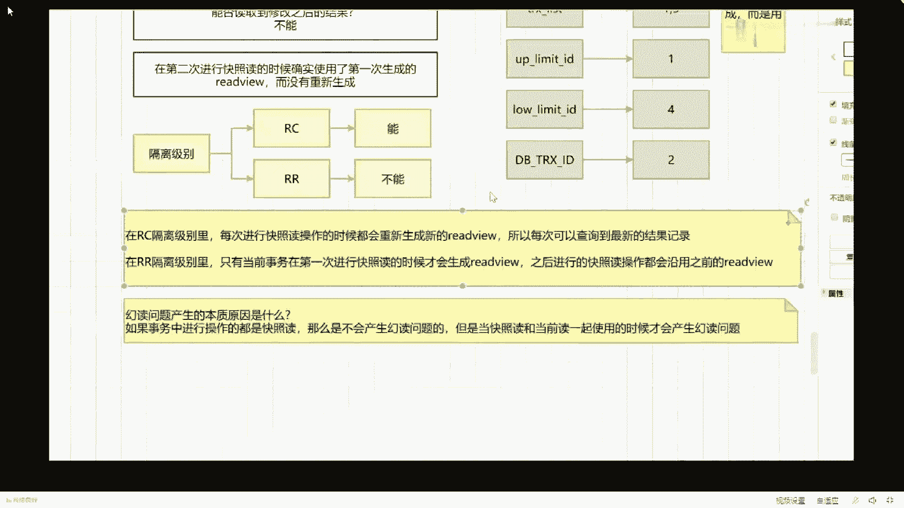

那个加的是加加的叫排他所叫排他锁，lock in share model，叫什么叫共享锁，好吧，你间隙锁和零件所讲一下什么叫间隙锁呀，比如说我在一个表里面插入对应的数据。

结果数据值我建索引了数据值是多少，是一逗号，三逗号，五逗号，五逗号七，如如果你再加电机锁，这时候它的构成是什么样子的，是负无穷无穷怎么打什么情，无穷到一，然后中间有一个一的记录所，一的记录所就行索。

然后有一个1~3是间隙所，然后有一个三的记录所，然后有一个3~5的电机锁，然后有一个五，还有一个5~7，间隙锁，还有一个还有一个括号c到正无穷，这是我们的间隙锁，那什么叫零件锁呢，零件锁也非常简单。

零件的所表示什么叫左开右闭区间，连接所是这样的样子，它表示什么意思，叫负无穷到一这样的逗号，然后一逗号，逗号，然后三根号五，然后五，根号七，然后括号七到正无穷，明白意思吗，什么叫零件锁。

零件所不就是把间隙锁和行锁合到一块了吗，这叫零件所，是他们之间的区别，就这玩意儿，就是我如果表演的记录是1357的话，我再进行加锁的时候，如果加零件锁区间就是负无穷到一，然后加一个记录锁。

然后1~3是间隙三，然后3~5是一个间隙，55~7，这个间隙七到正无穷是一个间隙啊，这哎中间这小的七，而如果你是零线索的话，就相当于左边是开区间，右边是闭区间，开区间闭区间，开区间，闭区间开区间闭区间。

就这些东西好吧，有啥不一样，你锁定的范围不一样吗，一个带具体值的，一个没带具体值，就这点区别，没别的区别了好吧行了，所有东西不讲了好吧，所有东西太复杂了，如果要单独讲所的话，我们要讲讲好走。

我觉得两个小时讲不完，讲不完，一个锁的东西，讲不一所东西啊，这东西不聊了啊，后面我有时间我们再详细聊具体的一个知识点，server锁是在server层还是给你填层，你要这个模板锁是给谁加的。

我是给数据加的还是给索引加的，我问一下锁是给数据加的还是给索引加的，对给索引加的好吧，给索引加的一定要搞清楚了，你要搞清楚，给索引给索引，给索引分数据封闭，给索引加好了，这锁这事啊，不聊了，好吧好了。

今天我花了差不多将近两个小时的时间，给大家进行了这些知识的一个讲解，下来之后，一定要把这些核心的知识给大家进行一个讲解，这两天我想了两天mysql相关的知识来，有收获的同学表示，q26 好不好。

我也辛辛苦讲两天了，有用过吗，好了讲完这东西之后，我最后面还是要强调一件事，同学们，这东西我只是把其中的某一块儿，的知识是拿出来做了，讲解下去之后好，还是要自己学会总结回顾整个体系给补充完整。

这事很重要，我昨天在上课的时候，咱们俩讲完干货之后，我就跟大家说过了，你们在学习的时候，一定要强调一个东西叫体系性，完整性，这玩意很重要啊，这些知识从哪来的，第一你可以看书，第二你可以看帖的。

第三你去学会上官网，很多东西在官网里面都有非常详尽，以及具体的一些描述，同时这套东西在咱们课程里面，我都进行了一个非常详尽且完善的讲解，你是需要把这些基础知识给掌握精通的，我昨天去说过了。

你把这套东西如果你真的理解了，掌握了，你去面试，我告诉大家，很容易很容易，包括你在你们公司里面去面试，这些东西都会变得很容易，我在公司里面如果遇到一些线上问题的时候，我觉得是可以解决这些问题的。

前两天我记得还有一个同学也是一样的，他通过mysql的东西就听完这节课之后好吧，它解决了它们的生长环境里面，所存在的一些对应的问题都是有的啊，所以你需要去了解这些关键的核心点。

把这些核心的知识你都要掌握清楚清楚，因为你只有掌握清楚这些东西之后，你才能够完整的知道怎么去解决问题，以及怎么样去描述这些对应的问题，明白了吗，这就是调控所带来的知识，你需要把东西搞得更明白好吧。

所以现在感觉了解的差不多了，现在感觉有点懵，还是那句话，那是因为你接收到了新的知识，所以你之前讲解接触的东西也是不完整的，所以导致会出现这样的一些错觉，明白了吧，还是要把这些东西做一个完整的体系的学习。

到把这东西都掌握好了，ok好了，聊完这些东西之后，我们聊点其他东西，昨天上课的时候，我也给大家说过一件事，我说同学们永远记住了，听我一句话，以后在做事情的时候，做些事情的时候。

我在学习的时候一定要保证一个完整性，同时我希望所有人能够去树立对应的目标，这件事情很重要，你学mysql就学mysql，不要今天学mysql，明天学院意思，后天学gbm，大连绝对服务，不要这样一个体系。

一个体系的去学习，一个块一个块去学对应的学习，因为只有进行这样的学习之后，你才能收获到对应的一个效果，才能达到对应的效果，明白吗，好吧，还是那句话，你永远不刚才同学问老师这些问题，你是怎么学的。

有人对学习方法好奇吗，不知道应该怎么去学啊，怎么去学这些东西啊，大学啊，怎么学习，非常简单，我刚才说了书官网论坛帖子，但是你在看这些东西的时候，同学们永远记住一件事，别人给你说的东西。

我希望你能够有一个最基本的判断力，明白吗，最基本的一个判断力，这点是很重要，你要能去判断，我要能要能去判断，要不然的话你借东西可能都是错的，特别是现在这个铁啊，或者现在很多东西它没那么规范。

所以导致很多东西可能会有一些错误的知识，会影响到你，所以你要具备对应的判断力啊，同时还有一件事，像这东西为什么，当你看到别人说的一些结论，或者一些对应的概念之后，我希望你能够搞明白，我希望你能去问。

说到底是为什么，别人到底是怎么实现的，这样实现的好处到底是啥，你要休息了，为什么啊，然后并且寻找到对应的答案，这件事情才是很重要的，选择太乱了，现在水平优势无法区分，就就这意思。

所以啊找到一些关键的核心东西，或者说正确东西经常去学去看一下，你要有这样的判断力啊，你不能说他说错了，你还觉得是对，我觉得你所以基本这方面判断力你应该是有的，好吧行了，这东西啊咱们就聊这么多吧好吧。

聊完这些东西之后呢，阿白说时间成本，所以这里面就会有个问题啊，就是你要去花时间，我再说一句话啊，呃现在这个人啊不是不指你呢，现在社会上的人不止你们，包括我在内，其实大家都有点浮躁，我希望大家能做一件事。

或者你要认知到一件事情啊，技术这玩意儿是需要沉淀，需要花时间来琢磨了，我不知道你们自己私下的时候，有没有琢磨这件事情的，你也别想着说老师，别人3332，别人研究了好几年的东西，我能够在很短时间内搞清楚。

这事儿不太现实，就你一定要沉下心来，你知道吗，很多同学上来之后就考虑一件事，老师我想一个月之内找到什么工作，我想一个月怎么样，我觉得不对，是送错了，你要学会去慢慢沉淀，等你沉淀好了之后。

你的技术实力是能够储备上来的，如果你沉淀不好，你的技术实力，你就没办法储备的，能懂这意思吗，这沉淀这些很重要，别着急心急，吃不了热豆腐这么简单啊，你作为一个技术人，你应该掌握这东西，好吧行了。

这些东西啊，我们就不再给大家进行其他概述了，关于mysql相关的点干货的东西，咱们就聊这么多是吧，聊完这些东西之后呢，安排问说现在学明年金三银四跳槽合适吗，我问一下有多少同学想跳槽，给老师扣个一。

你想太多了吗，懂了，听我一句话，同学们跳槽这件事情，是没有合适不合适，跟时间点是无关的，很多业主老师我要等静态一个字，老师我要等进，有延时，没这必要，你所需要判断和衡量的只有一个东西是什么。

我现在的技术实力能否支撑我跳槽，或者说能否支撑拿到更高的薪水，你只需要去判断这么一件事就够了，你不用去在乎时间，年底的时候岗位是少，虽然岗位少，但是不代表没有招聘机会，计算一次机会是多。

但不代表能把你要到明白吗，他一样，你的技术实力能否具备足够的支撑，昨天晚上上课的时候，其实我说过这件事情，同学们我也强调过这件事情呢，昨天我问一下，昨天有多少人领过咱们的路线了，零嘴给老师扣一。

有多少人领过了，懂吗，昨天上课的时候给大家分享了很多，我们关于学习，或关于你自己定位相关的一些路线，就说你到底要怎么样去完成，自己的一个技术储备，永远记住页数明白，这件事技术是学习不凡的，你不可能。

真的把所有的技术都掌握精通，但是你要有自己的加分项和你自己的亮点，你只要有自己的加分项和自己亮点了，那我觉得就可以去试一试，昨天我在展示我们对应的课程路线，比我们课程大纲的时候，大家说过了。

你们现在做开发的同学，或者你们现在的同学，我不知道你们现在是什么样的一个水平，什么样的一个层次好吧，但是你现在最起码是一个基本的开发人员，那么我觉得你做一些最基本的开发功能，完成一些c l u的工作。

你是没问题的，如果你能够独立的去做一些开发了，那么下一步你的目标你就要去做，什么叫操作与落地，不单单是说我只会c l o d，你要掌握非常非常丰满的一些技术站，我也说过了，说这东西很难去评判，说我什么。

我现在是什么水平，以及我要达到对应的什么水平，这是很难去评判，但是阿里是有一些对应的职级的，你是可以把这些职级来匹配到你个人的身上，然后按照这样的一个职级的要求，去做一些对应的技术储备的，阿白说。

我昨天拿到之后，不知道从何下手，这样我一会儿把路线再给大家详细的描述一下，你到底应该怎么去学习，路线，应该怎么学习啊，如果你还有困惑，一会儿每个同学可以把你个人的情况说明一下，说明介绍之后。

我依靠我个人的经验，和我们现在收到学生的一个情况，给你做出一条合适的规划出来，我的个人情况里面，我希望你能突出的是啥，有以下几个信息，我需要知道，第一个是你的城市，第二个年龄，第三个薪水，第四个学历。

第五个基本情况，这是你工作的一个情况，特殊情况，第二个就是你的预期，你把这些东西告诉我，我一会给你一些针对性的建议啊，每个同学你可以发一下，那下面我来聊一下我们的这个路线，你到底要怎么学哇。

我们一步一步聊，先聊p6 的级别，如果你现在能做独立开发了，那么我认为你下一步应该冲击的目标就是p6 ，当前这样一个级别了，那po里面你需要掌握什么技术，其实没几块，第一块叫底层技术实力。

很多同学进入这个行业之后，都是培训进来的，你可能没有对应的计算机的底层技术的支撑，所以你需要储备一些像qq系统，计算机组成原理，网络io linux系统，数据结构和算法这样的一些基础知识。

像这块知识是属于什么，这属于啥，有人知道吗，他是你在上大学的时候，你科班应该学的东西，但是咱们有很多同学都是非本专业的吧，来有多少是非本专业的，或者说非计算机专业的，给老师扣个一，有没有，没有啊。

都是很专业的吗，不可能吧，就你是非非本专业的，所以你是需要把这些基本的技术和基本的技能，给弥补起来的，这东西它会影响你对于很多技术，底层的储备和学习，所以你是必须要看的明白吗，必须要看的好吧。

这是第一块底层知识，咱们都有对应的课程进行讲解，说这话之外，第二部分，像现在聊并发编程聊的比较多，聊多线程聊的比较多，所向复合系统被判之时，队列的知识，内存逻辑的东西，线程池的东西。

cs的虽然local的j u c的，你多少掌握这些东西，你在工作中可能用不到，压根用不到，国产来说可能用到的几率并不是特别大，但是面试中这是一个重灾区，为什么说面试这一层难题。

因为大部分同学因为工作中接触不到，所以他对这块知识的掌握是有失偏颇的，或者有欠缺的，所以导致他这块是个弱项，那面试官为了考验你个人的技术实力，他就会拿着你的弱项来问吗，所以你需要把这块当成你的一个强项。

来进行相关的技术储备，明白了吗，这是第二块并发编程相关的技术，我觉得这块是所有人都必须要学的，第一第二都是所有人必须要学的，第三话叫rpc通信框架原理，这里面包含什么，像ogier。

像double r b c t r p c rustle，rap和nike等一些东西这一块啊，我觉得你尽可能的去了解和掌握，为什么，因为现在这样都是分布式，微服务的一些交通框架。

它都是分布式要进行这些消息通信的，这里面一定会进行到一些通信框架的一些包装，和一些使用这块东西，它不是一个必备技能，但是它一定是一个加分技能，听好了，加分技能，如果面试中你提到的nt。

你能把底层那些nl这些东西，要么非常非常清楚的啊，对面试官而言，对你的评价一定很高，因为很多同学会一般的开发程序员，对这块知识是缺失的，而如果你了解了，你就是加分项。

你就能比别人多赚几千块钱的点不在这儿，是这部分好吧，第四部分中间件，这个不用说了吧，在公司里面，你除了在一些外包和传统行业里面，消息中间件几乎必用，现在现在运动比较火的两个周边，mp卡不卡。

这样东西你必须要掌握，像i tm q了好吧，robert mq这东西有些公司在用，有些公司没用，但我不要求你全部都会有选择性的看，最起码你要做到一个是精通的，其他几个懂我略懂明白吗。

你别提到中间建了是吧，谁都哪个都说不出来，哪个都不精通，完蛋了，好一个精通往其他的东西基本了解，构成了，面试的时候，有你自己的一个常数和你自己的一个加分项啊，这是中间线的这个级别。

然后再往下是缓存应用的级别对吧，像mcat是原来用的，现在几乎mecatch都已经被淘汰掉了，除map cat之外，下面的redis redis不再是那种单机的redis。

是分布式的或集群的release，现在到六了嗯，后面我们马上也会进行六版本的一个更新，你多少进行储备对吧，包括像科班要学的软件设计基础这东西啊，它属于一个怎么说基础技能吧，如果这块你不了解没关系。

时间紧的话，暂时可以先不了解，但有时间的话，最好还是看一下像敏捷开发这样的东西，我觉得你还是了解一下好吧，以便于你自己能做更高效的开发工作对吧，再往下就是分布式架构专题，分布式价格专题里面。

并不单单是包含，咱们之前了解的什么分布式事物了，分布式锁了分布式id了，不单是这些东西，还有很多其他技能，比如说分布式预警对吧，分布式链路追踪，分布式全员控制，分布式id，分布式密度，分布式任务。

分布式分化，这都这样了解的，对，你不要说老师，我拿个分式锁分式是不是就可以了，现在面试分布式事务控制所几乎必问，问的也很多了，几乎也烂大街了，所以啊掌握一些其他的核心点好吧。

再往下看微服务的什么配置中心了，注册服务也发现了网关路由了，服务端用了负载均衡了，熔断降级限流了，这东西好吧，包括现在主流的netflix和阿里巴巴，两套微服务的技术体系站。

能够了解他也是一个必备技能好吧，性能优化的还是加分项，便于勘测你对应的工作实例，像gb m采购mysql调优tomcat，调优n这个调用对吧，以及超大流量的一些项目，调优方面的点都有啊。

这句话也是一个重要的点，因为调多项能表示你具体的工作经验，和你的工作实力，这块如果答得非常好的话，它100%的是一个很好的加分项，好吧，再往下像一些海量数据存储的，现在比较好像e s了。

click house了，rmsl太低b了对吧，像这样mysql你们可能是最熟的，加上e s了，click house和带db也有所了解了，它表示的是最新的技术，很多同学在公司里面或在生产环境里面。

可能暂时用不到这些技术，但是我觉得你要储备，还是那句话，你要保证你技术的一个东西叫前瞻性，明白了吗，前瞻性虽然没用，但是我要会，如果公司要用了，我能够立马上手，而不至于说我所有的文重新开始学。

如果你所有东西都重新开始学的话，那这个效率就太低了，明白意思了好吧，再往下还有什么e l k相关的东西，就e s的对吧，还有海量数据存储的，像大数据的一些东西，i do和hbase。

还有flink这些东西，把以下面的像网络设施运维的知识，要了解一点对啊，运维这个东西它表示的是什么，你要具备运维的一些基础能力，最起码linux相关的东西要会吧，c d n d n s这些东西你要会吧。

把静态资源你要会吧，这东西都是基础知识啊，包括像dios的对吧，docker k8 s对吧，这东西你要你要了解到这边还有些武器的测试，相关的最基本的测试也要了解了，以及我们service mesh。

像epil相关的点多少了解，所以这就是p6 级别你要储备的点，这里面有重点有非重点，你可以把你自己的薄弱项先重点补起来，上面画的，比如说并发编程比较重要，中间件比较重要，缓存文件比较重要对吧。

性能优化比较重要对吧，你能不能先看这几块，看完这几块之后，如果你还有时间，我再看其他东西行不行，什么意思啊，这么多技术点，并不是说让你一口气，全部在很短时间之内我都补充完整，不是这个目标。

是为了让你能够有一个方向，有一个目标，我能够持续的学习下去，不至于像一个无头苍蝇一样随便乱转，今天看这个，明天看那个哪个都看不清楚，不要这样好吧，说不想看怎么办，不想看你就等着被社会淘汰，被行业淘汰。

如果你想在这个行业里面干的时间更久，必须要看，逼着自己看，也要看，不干怎么行呢，必看好吧，还不想看怎么办，想拿高工资吗，闲党心吗，人生在世总有很多你要逼自己做的事情，但是还是那句话，你想不想做。

其实说白了就是懒嘛，就是懒嘛，懒这玩意啊，有人天性，但是怎么说，当你遇到一些更加现实的一些情况的时候，你会为你之前来买单，像现在听课的学生啊，我不知道你们的年龄多大，特别是一些年龄大一点的学生。

人大点学生，他很多同学发现在出去找工作的时候，容易被行业淘汰掉，原因是什么，原因就在于他之前欠的债，其实你们现在感觉薪水要不上去，工作年限很久好吧，都要不上去，薪水其实都是站，那是出来混总是要还的。

你现之前年轻的时候欠下债，你现在就要还了吗，可能会很辛苦，可能会很疲惫，没办法哇，下风飞车老师这技术图能发一下吗，如果谁需要要当前的技术路线图，好不好，好的小姐，找你的班主老师。

去进行相关的一个允许把对应的资料领取过来，路线给免费发送给大家，这东西只是我们对应的p6 级别的相关技术，除了p6 级别的相关技术之外，我们还有什么呢，刘老师老师，我达到p6 了。

我现在要准备pg级的知识怎么办，咱们p7 也有pig叫什么叫落地以实战啊，还有p7 的，有人想看pc吗，啊有想看pc吗，想看扣个一吧，有没有，对吧对吧，你去看一眼，简单看一眼好吧，你可以不了解。

但是我觉得简单要看一眼好吧，pc里面主要包含什么，包含的是另外一块东西叫原理与设计，这里面呢其实我们也包含了几个重要的模块，第一个是分布式的一些理论基础，像什么c a p了，popucraft啊。

这些东西都要有啊，还有一些分布式算法的一些支撑的东西对吧，好从这算法支撑的一些东西，包括像我们有一些架构原理和源码的一些设计，这里面包含了像spring全家桶源码对吧，o r m相关的一些源码。

把他们看的源码，spring color源码，mq的源码对吧，net源码和spot源码，e l t的源码，几乎各个源码环节，我们都会给大家讲的比较详细，因为你想成为一个高开，会想成为一个组成。

想成为一个架构师的话，那么必须要储备这样的知识，明白吗，好吧，当然原版东西啊很难难是难，但是该储备的依旧要储备，你不能说因为它难，所以我就不学了，你如果因为难不学了，你告诉我。

你怎么样能保证更好的一个那个那个薪水呢，就一定注意啊，你如果想比别人要薪水更高，就意味着一件事，什么事你必须要会点别人不会的东西，如果别人会的东西你也会，那你告诉我凭什么凭什么你拿高薪，别人拿低薪。

没道理的对啊，除此之外还有我们的高性能架构设计的东西，比如说分流的线设置，服务并行并发的设置，缓存的设置，存储的设置，可靠性的设置对吧，应用保护层的设置都要有好吧，这块大家需要记住了。

ok下面还有最后面就是最关键的一些东西，如果你想成为一个高开或成为一个主城，还有一个最主要和最核心的一个点是，什么叫架构设计方案，什么叫架构设计方案，这东西怎么去理解它，记住了同学们所谓的加入设计案。

指的是里面放的几块，第一个叫每秒数10万超高并发通用设计专题，叫n个九全链路高可用通用设计专题，叫云集百万年薪案例驱动架构设计专题，以及我们的一级流量，多级缓存架构设计专题，现在啊。

你在面临一些大厂的比较高级别的职位的时候，基本上都会聊到架构设计相关的点，那么架构设计是啥，比如说红包雨怎么设置，怎么设计，你需要哪些技术，站在面试的时候，如果问你这样怎么怎么办。

你如果对于技术的储备是有问题的话，你很明显这东西达不到的好吧，这是p6 和p7 ，你要掌握相关的一些技术，除此之外，有些同学说老师我项目也比较薄弱，怎么办，没关系，咱们呢也有很多落地的项目。

网游服务器的都马上能单体版本的电商，单体单体电商，包括我们的分布式电商，包括我们的飞机出行，包括我们的推荐系统流失平台，我们都会有好吧，课程到底课程到p8 好，我们现在授课老师里面都有p8 。

老师来给我们进行授课，真p81 会来跟大家聊一下，是勇士好吧，这后面还有说老师如果想去面试的怎么办，没关系，我们有短期的这种面试，突击跳槽的东西，比如说难题的解析，简易的指导，面试指南。

晋升的指南都会有的，除此之外，还给了很多高级别的工程师，和高级别的开发人员，也准备了一些设计专题，比如说资深架构师应该掌握的技术体系，这里面有云原生相关的技术，有常见的大厂bug处理专题。

我们请了一堆的大厂的兼职老师，让他们把他们在生产环境里面遇到的问题，给大家进行复现，复习完成之后，上课给大家讲出来以后，你在面试的时候就能够游刃有余的去回答，这些线上事故，点了都会有。

包括我们有双11 618，对于一些架构设计的解决方案对吧，这些东西除此之外，我们还有cpu级别的一些架构专题，这里面涉及到的是什么团队的管理对吧，领域驱动的一些设计，包括像智能化信用的一些设计。

以及我们的产品管理都是比较完善的，这里面的东西也都是需要进行储备和学习的，所以如果是需要安全路线，扫描屏幕右上角二维码，或找咱们的班长老师领取，如果你之前已经加过咱们的小姐，班长老师了，好直接直接干啥。

我来领取对应的路线就完事了，是刚刚给你们看到的，只是说你们当下这个阶段里面，你们应该储备和学习的东西，其实除了这些东西之外，你觉得学技术的最应该保持什么东西，同学们，除了内容之外，还要还有啥。

同学们永远记住一件事，技术是不断的更新的，技术是不断的迭代的，技术是要不断的进行学习的，所以除了这些具体的技术点之外，咱们还推出了一定，每天每个月对应的一些课程更新的计划。

给大家看一下，我们在官网首页，你们自己可以点开我们的官网去访问一下。

在官网里面，我们上面有一个专门的专题叫做科研更新，这是我们在11月份要进行的相关的课程更新，大家可以看一下对吧，go web相关的课程，open cv的课程，鸿蒙系统的课程，type script课程。

三高项目课的课程，随便点开一个，里面都有对应的课程，好课程大纲以及对应的课程授课老师，以及对应的具体的时间安排，全部都有啊，光我们的科研更新每天都有，包括我们的flao对吧，包括我们的数据中台，对不对。

包括项目部署的领域驱动的，以及后面还有x tp 7的啊，开了一些设设计东西，游戏高级架构师长，网络安全的airflow的分布式那个任务调度的对吧，以及后面的jvm top k的源码，卡不卡的源码。

包括批判的三高项目商城的维京岛，罗米修斯的对吧，还有我们tdp的codis，es的nevis上科三门课的等等一系列科研更新啊，课程每天每天都在进行不停的直播，不停的更新，所以你过来之后。

你能享受到的是什，除了现有的知识体系，知识框架之外，你能一直跟着咱们的直播课程去学下去，我可以给大家展示一个东西，就是马士兵教育对应的直播课表，这个课表你们可以随便去看，随便去对比，没有人能比得过。

这是我们这一周的这一周的直播课程，今天晚上我给你们上完公开课之后，训练营之后，明天晚上接我的vip课，我明天晚上还要讲去vip对吧，每一周至少应该是十节课，加上vip课。

你可以跟着vip课进行不断的技术储备，看明白了吗，所以有很多的课程，你都是需要进行储备和学习的。

这才是能保证你长期在这个行业里面活下去的。

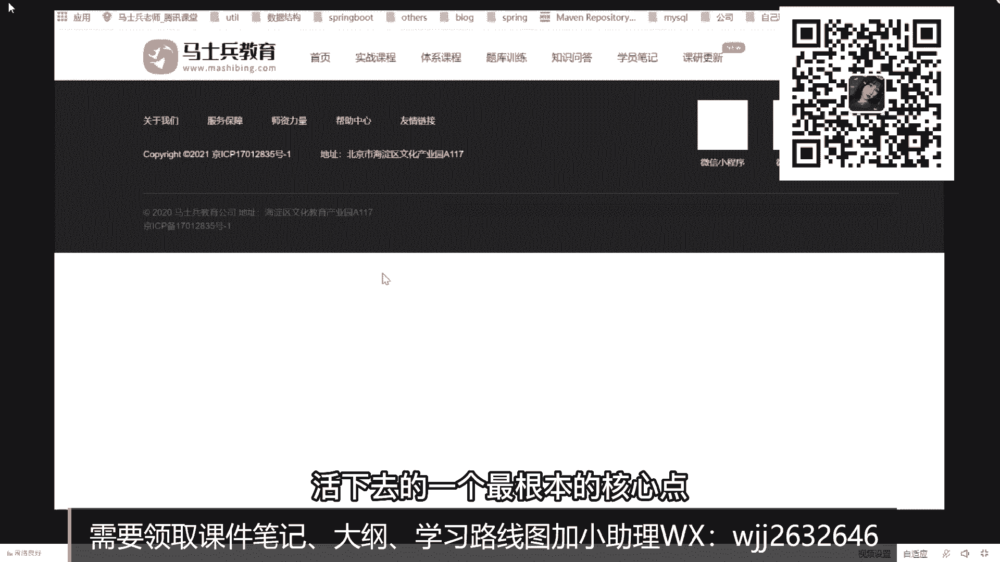

一个最根本的核心点，懂我意思吧，啊这是我们对应的科研中心是吧，那我们同学会问刚刚那个路线我解释清楚了吧，有没有同学好奇楚老师我到底应该怎么学的，有人好奇吗，朱老师，你刚刚展示大纲里面展示了那么多东西。

那么多东西我到底应该怎么去学习，或者我应该学习哪些点，我应该怎么办，这告诉大家，我们为了能够更好的服务和帮助我们的学生，我们对每一个报名的学生，会制定对应的课程学习计划，牛奶问说怎么成为vip。

说老师我想成为vip学员，他会告诉你你要进行什么样的一个操作，以及做什么样的操作，你能够成为对应的vip用户啊，就是购买我们对应的一个课程就完事了，就这么简单好过，我们对应课程就完事了是吧。

这个课程叫什么叫m c a，一会我来给你详细说一下mca课程体系，刚刚我展示的课程大纲猫那个路线，其实就是mca课程体系的一个路线对吧，而且我们要做的事情其实不止于此，我还在做什么。

我们给每一个报名的学生，其实都制定了我们对应的课程的路线，因为东西点很多嘛，同学们也知道很多点是非常非常多的，所以你可以免费注册码视频教育官网，说官网之后你会有对应的体系课程，你购买什么课。

什么课就有对应的讲解好吧，然后呢下面之后会有一个东西叫学习路线，当你报名之后，老师会根据你个人的情况，给你制定一条属于你自己的学习路线，这些路线也包含了很多的点，比如说这位同学的里面要包含。

它是一个年龄比啊，只需要技术提升，年龄比较大，不需要换工作，他需要做一个体系性的学习，那么里面就包含了这一堆东西，从技术计算机底层开发技能源码，补充分布式服务，微服务的中间件的，云原生的项目。

实操的等一些东西，他在搜到这样路线之后，可以干些什么事情。

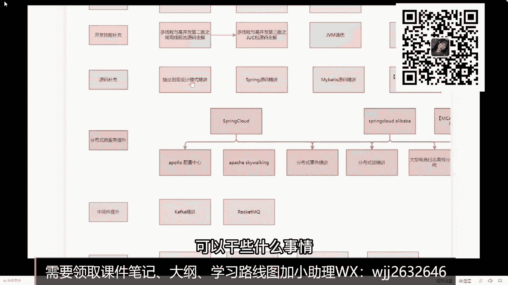

当你的鼠标放到每一门具体的课程之后，就可以直接去点击到对应的课程里面。

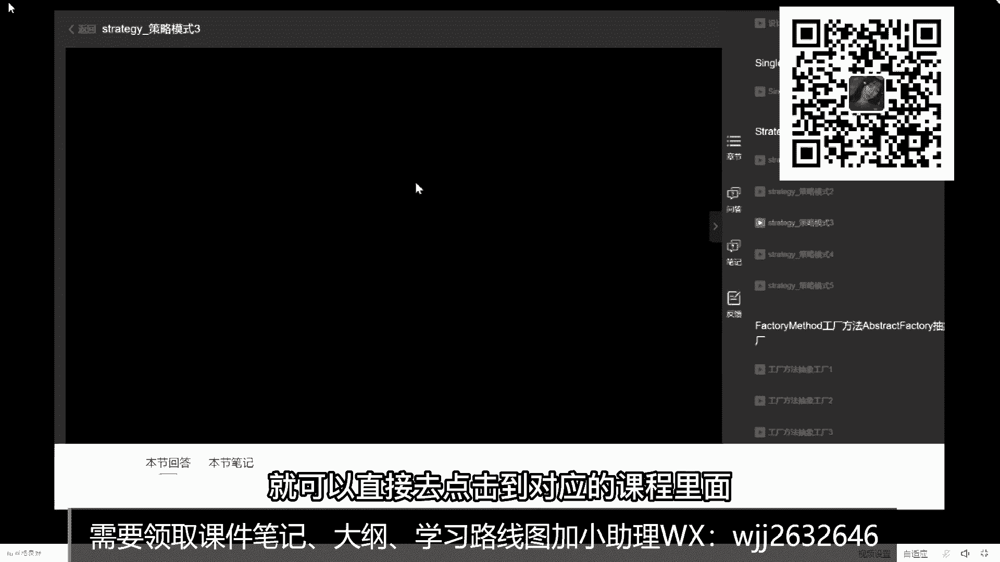

进行相关的技术学习了，而不需要你去找别的课课，老师已经给你排好了，你直接在这个地方进行查看和学习就可以了，而且你可以在当前这个平台里面好吧。

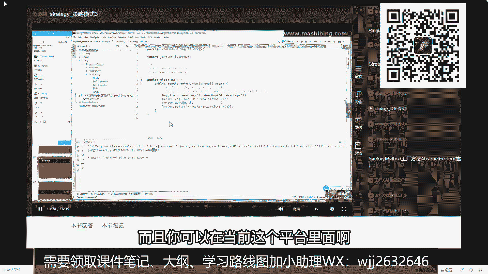

提问自己的问题啊。

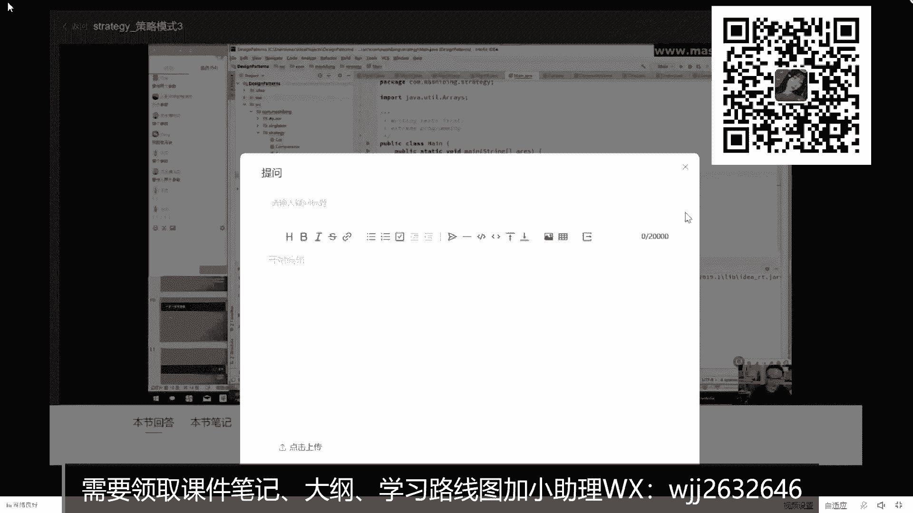

可以有问答对吧，提问题之后针对当前是这节课，老师我给你最后做对应的答疑，同时还有对应的笔记，我可以上传自己的笔记，做好对应的总结都会有，你在平台里面你可以学，直接就学了。

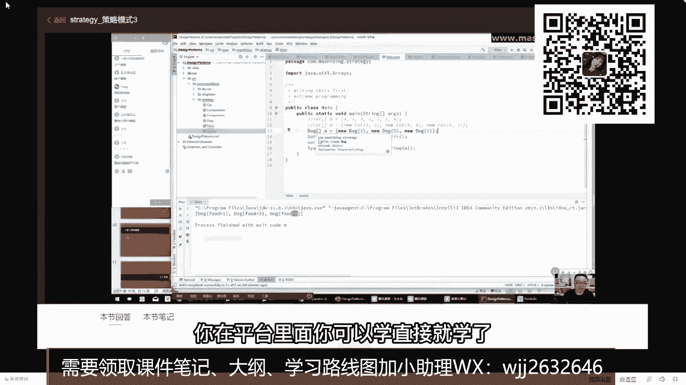

明白明白的意思吧，而且每一个学生跟每一个学生，我们真正的路线其实都是不一样的，他因为工作1年经验不太多，需要储备这样的一些技术，把面试或工作中常备的一些技能，像你要储备精精通，储备基础对吧。

包括下面还有存宝骏的对吧，这样的一些课程路线，当然有一些同学，他们的情况可能符合绝大部分的情况，那么我们也会给予对应的路线的一个讲解，或者对应路线的一个分配，而且每一个学生。

并不是说这个路线就一次就不变了，不是这样的好吧，你后面如果有需要，我们会把你的课程都进行一个更新，或者都进行路线了一个安排，循环一次再来一次，再来一次之后再来一次都是没关系的好吧。

所以在你整个学习过程中，老师会为你保驾护航，你在什么时候遇到什么问题，记者老师沟通，老师都会给你讲解对应的路线，点一些最适合你自己的一个安排，好吧，那么讲到这了，有人好奇这门课多少钱呢。

好奇的给老师扣个一，有人好奇吗，其实刚刚我还扫了一个很重要的环节，没有讲很重要环节没有讲什么东西，这些课都是有一些老师讲解的，有人好奇咱们机构老师吗，燕青要说，所以说有没有怎么学讲解，没听懂啥意思啊。

2万多嗯，嗯不需要2万多，不需要2万多，这里面啊我先跟大家说这些东西啊，先把咱们的老师给大家说一下吧，就是你看完这些老师之后，你就会知道这个课程里面，具备什么样的一个实力，好吧。

首先老师有哪些马士兵老师，我解释了吧，红同学可能都是看马老师的视频直接入行的吧，这两马仕明老师除了马思明老师之外，还有我们的周志磊，朱老师是吧，讲i o的，讲release啊，大牛老师。

我把这个视频关掉啊，声音大妮老师好吧，很多同学生评价周老师课跪着听周老师课，如果你见过周老师本人的话，你会发现周老师的发量也非常感人对吧。

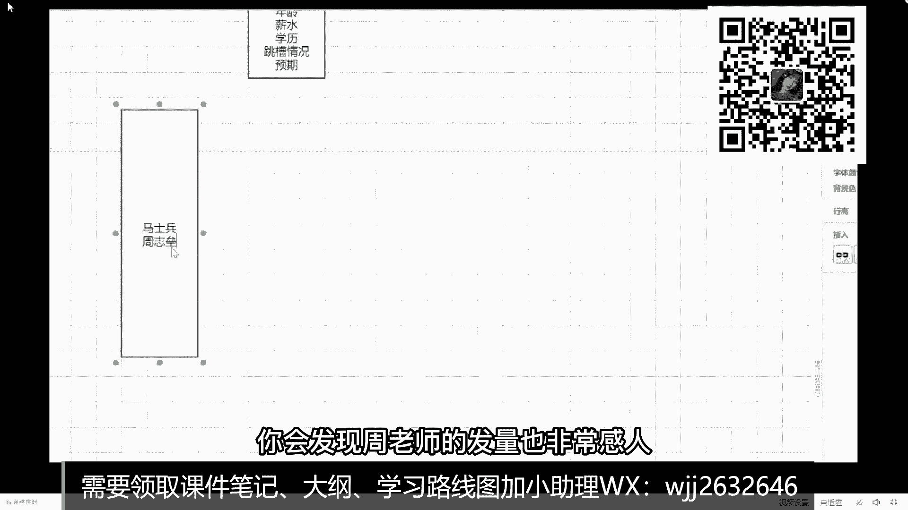

除重要之外，还有我们的超空杯曹老师，他是之前阿里的花名叫霍州，我们一样支持备调对吧，包括还有我们的徐克徐老师，他也是阿里的阿里的p8 花名良禽，营养知识被调好吧，还有还没写完，等会拖拖一下，对吧。

还有我们的黄金王俊，黄老师之前也是阿里的，发名叫博西，游戏是吧，包括还有我本人好吧，应该这个吧对吧，应该对我意思就有一定的了解了对吧，包括还有我们的左成云朱老师对吧，俗称左神嘛啊。

讲数据结构和算法的老师，包括我们还有一堆的张福刚，张老师主要是讲大数据的，国内第一第一批检查数据的呃，老师包括还有我们的肖斌啊，肖老师以及我们对应的杨淑娟，赵老师，赵珊珊，我都不相信姐姐介绍了啊。

赵珊珊老师对吧，还有还有谁啊，吴磊老师e的专家，还有我们的，陈瑞峰老师对吧，我们的邓洪波老师对吧，我们的严正涛老师，我们的呃谭老师对吧，包括我们从那个呃之前在京东，现在碰到新浪微博的孙老师。

给大家讲大厂15班的对吧，包括我们有呃录陈坤陆老师对吧，还有我们的毕老师李旺盛，毕老师对吧，一级点点点点点一堆啊，这个老师我给你数不完，马视频教育，光老师好，四五十位肯定是有的啊，这一点都不夸张。

所以你过来之后，你能收到各个老师详细的一个照顾，所以把心放肚里边过来看，他是跟着学就可以了，这些课程都是由这些老师来给大家进行讲解的，所以这么牛的课，这么完整的学习路线，加上这么多老师啊，对写错字了。

我对不起你啊对吧，这么多老师好吧，所以足以保证我们对应的课程质量，所以当我们提到了，我们说这个课门课多少钱，阿白说2万多，其实不需要2万多好吧，今天是咱们的训练营，那么我想说的是啥。

同学们今天训练营有一个专门的专享福利，可以给大家看一下什么专项福利呢，就这东西好吧，今天晚上训练营里面我们就要顺势而为，乘风而起，mysql调优专属直播间，mca架构课程，架构师课程。

今晚原价格是24980，今晚只有十个名额，可以领取一个121万2000元的大额优惠券，比如说今天晚上，你实际的成交价是12980好吧，这些优质的课程内容我就不说了，最关键是这边今晚报名之后。

你能够享受我们对应的课程更新是吧，同时再说明一件事，同学们一件事，什么事，仅限前五名赠送vip的黑卡服务，我们有一个vip的黑卡啊，这个vip黑卡我希望你领取一下，今天晚上仅限前五名黑卡是什么意思。

黑卡代表是你对应的福利保障，这图有点小啊，哪个小姐姐把这个黑卡图片给我发一下，那位小姐把这个黑卡图片给我发一下，我这没有这个黑卡图片，谁给我发一下，这个黑卡里面代表什么，代表你对应的福利啊。

代表你对应的福利啊，好了，来给大家看一下好吧，叫成定制，未来成就更好的你，这是我们的口号，说了第一你的vip黑卡会想到什么，第一叫个性化方案定制，第二个叫大厂的优先内推的机会，第三个叫以报名体系课一元。

每年的持续更新服务，什么意思，刚刚我给大家看到了，我们的课程一直在持续不断的更新的好吧，那么每年你只需要象征性的给我们交一块钱，那么我们就可以把这个课程更新，你可以永久的一直听下去，一直听下去。

但如果你不是vip黑卡的话，那不好意思，你能想出权限只有2年的时间啊，当然这个一元的这个权限给大家说，很快就没有了，前两天马老师做直播的时候已经说过了，之后我们的vip黑卡的权限。

如果想享受课程升级的话，每年是888元，今天这个训练营只有一元美元，所以如果需要的。

当然我也说过了，这个权益不是所有人都有的，仅限前五名，所以抓紧时间去抢就完了，同时今天在网上报考的同学可以享受白条，有钱花，信用卡，花呗等一系列的六期分期免息名额，当然这个名额也是只有十个哇。

多的也是没有的，所以需要的抓紧时间联系咱们的小姐姐，扫屏幕上的二维码就可以了，如果你之前加过任何一个咱们自己老师，不需要储物家告诉他，我是从连老师直播间过来的，我要去领取对应的优惠以及黑卡服务就完事了。

这么简单好吧，所以抓紧时间吧，龙帅说，都是网课，对咱们现在没有这种线下课，全部都是网上直播，因为现在我们的学生人群，重点的话是在职的学生，所以他不可能说我拖延多长时间，我来做一个完整的机器学习。

这是不可以的啊，所以我们工作室网课，每天晚上你只需要拿出两个小时的时间学习，几个月的机会，3~5个月涨个几千块钱，对这边而言是非常非常容易的啊，非常非常容易的，所以抓紧时间抓紧机会就可以了。

这边所有享受的课程更新都列到这儿了，如果你想要这个课程更新更新，今天一来就完了，就这么简单好吧，关于活动相关的点，不过大家要这么多好吧，我身边一个pc一个平方，一个p9 。

所以如果你想拿到更高的一个薪水，你是需要跟更牛的人一起服务的，好同学们永远注意一件事，如果你想让自己变得更牛逼，一定要认识比你牛逼的人，你在跟人做对比的时候，不要只看那些比你差的，你要看一些比你好的。

混的比你强的，这样的话你才有提升，你现在跟比你差的比你永远感很足，你平时意识不到自己存在的问题，你懂我意思了吗，好吧，有没有项目实战，我刚刚在展示大纲的时候已经给大家说过了，好吧，在最下面的时候。

我们有对应的项目实战，比如说我们的多人在线网游，服务器相关的一些课程，包括我们的东宝商城一个电商的单体版本，包括我们的东宝商城的一个，分布式微服务的一个版本，以及我们对应的网约车，飞机的出行。

网约车项目，还有我们的推荐系统的项目，和我们流失云平台的项目，这边全都有是吧，东宝商城里面包含什么，包含这些东西好吧，完整单元dios代码规范落地实践，包含了我们一系列的基础设施服务。

这里包含了我们对应的分布式id中心配置中心，分布式锁集群事务集群，缓存集群，网关服务集群，注册中心，监控中心，m q es任务调度，tx mysql哇，业务方面的话包含了用户中心，商品中心，库存中心。

订单中心，搜索中心，评价中心，客服中心，推荐中心等等，企业东西自己看好吧，网课遇到不会的，找谁问，你这个问题说的非常非常好，如果说老师，如果我在学习过程中遇到不会的问题，我应该怎么办好吧，来给你看。

我们看别的啊，看这东西，这些学生前两天就前两天刚给我发的这些学生，我讲完整东西好吧，再说了，老师这个注解会导致什么问题，好吧，这是我的问题，老师给我们解答一下好吧，两字要这么讲的。

这是跟这个人整体的一个答疑的过程，他发的信息，然后呢我来给大家做一些解释，给他进行相关的一个调整，听到了吗，你有问题，每一个学生报名之后，老师会给你做规划，除了做规划之外。

会给你拉一个独特与独属于你自己的一个群，你有任何问题可以直接在群里面跟老师进行沟，通，明白了吧啊，包括你相关的一些面试过程中，遇到一些面试题，也是跟老师自行沟通，包括我们在官网上面有自己专门的知识。

问答社区，就类似于是一个问答系统，你可以把你的问题都提上来，看一下已解决的问题，那每天我们有专门的老师，在专门的答疑团队在里面去解决，这些相关的问题，都是有回复的，听明白了吗，这啥玩意儿对吧。

theta t模式看到了吗，老师都会给予对应的回复，所以不管是情人也好，还是我们自己的问答也好，你都可以在里面进行提问，明白意思是他学生说，过去每个学生都是这么回回的过来的吗。

反正大部分同学遇到问题之后，老师都会给予回答，就比如说我今天晚上上课，我在上课，你们去看一下我个人微信，我都没退微信，这是我个人的微信，现在有44条消息没回，我下课之后。

我也要去给学生们做一些问题的答疑，问题的解答，这也没办法，因为学生们在学习过程中，一定会遇到各种各样的问题，那遇到问题的时候，你只能去回复吗，很大的工作量，咱们有老师。

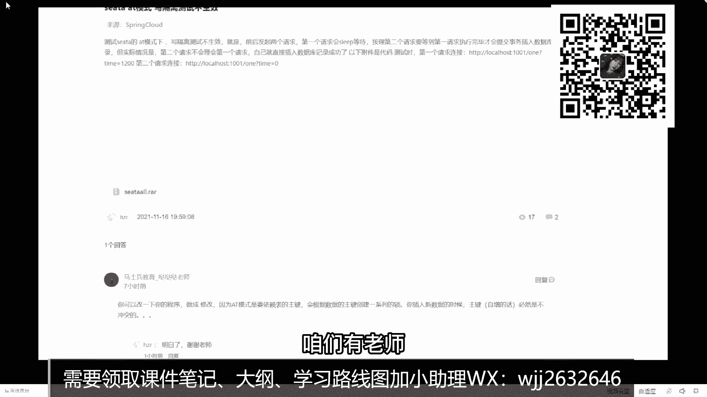

这你不用担心好吧，这不是你需要担心的问题，你需要担心的问题就直接就一点好吧，你能不能学会东西，能不能学到东西就这么简单，回到几点，老师上午的时候老师一般都在休息，但是像下午和晚上，老师一般都在回答问题。

昨天晚上我还在跟一个学生聊天，我可以给你看一下，是一个国外的学生，我们聊到差不多一点多，我给你看啊，这个学生我这给你看嘛，没关系的，能看到吗，看到吗，再跟大家聊天，回到起点，我这事不跟你不敢领保障。

但是我最终跟他聊天的时候，聊到00：46，0。46，这老师有问题的话，老师也一定会给你对应的回馈，而一定是对你给你给你回答是凌晨的时候。

今天凌晨看到了吗，这个你不需要担心好吧，主要这个东西我们做不到的是我们的问题，这里不需要不需要担心，ok这种问题可以直接问老师吗，那不问老师问谁啊，所以你过来之后，你不是说你单单买了一套课。

我们其实一直想打造的是一套东西，什么叫程序员，那一套在线职业提升的一个技术解决方案，所以从你开始学习开始，老师会在你整个职业生涯里面为你保驾护航哦，你只需要踏踏实实干就完了，所以我说了。

今天晚上在这个训练营期间之内，同学们报名的话，成交价只需要12980，前五名可以免费获得我们对应的黑卡服务，同时有个同学老师，我手里没钱，没关系，我们有六期分期的名额，但是依然只有前五名。

所以同学们有需要的话，干就完了，就这么简单，好吧行吧，多余的废话，我这就大家都说了吧，啊我觉得相关的点都解释清楚了，或者你们有什么问题的话，也可以直接抛出来问一下，如果没问题的话。

同学们可以仿照上面这样的格式，我会给大家做出一些对应的规划，或者给他做出一些对应的建议，当然有的同学可能会好奇一件事，老师我学完你们的课程之后，我最终能达到什么样的一个效果。

今天下午在群里面还有一个学生在问，说他有一个学生我忘了是谁说的啊，说他有一个朋友从8k涨到了25k，你觉得可能吗，那么我问一下，我忘了下午是在学在群里面聊这个话题了。

你觉得一个人有可能从8k涨到25k吗，有没有可能这有可能扣一，没可能的话半年吧，我们不拿多长时间就半年了，可能吗，说明一下这种情况有，但它不是它不是一个普遍情况，但是不意味着这件事情他做不到。

做不到那样吗，是挺离谱的，但是确确实实还有人做到这件事情，我一样，我可以给大家看一下，像我那同学说完之后，我给大家截了一个图，我手里面还确确实实确实有这样一个学员，给大家看一下。

这是去年的时候报名的一个学员，2022年11 11月13日说，梁老师，我阿里巴巴面试通过了啊，我说我说我手机在迁移数据，刚买了新手机再迁移数据对吧，没法给他打电话，说没事，微信跟您说，估值到p6 。

昨天谈到offer，下周应该offer被调了，上个月28号开始面试的，给了25k直接就接了，我说这算快的了，涨薪多少，所以说去了飞猪出行，原来是8k涨了三倍多，我说厉害了，他说我说我这个不能算招生。

我说我说必须可以国企出身，学了多久，学了应该半年多，20年4月份买的课，才看了课程的1/3，看了吗，迈进大门了，后续继续努力，感谢林老师，感谢机构，就知道报这个准没错，看这意思了吗，好吧，然后往下走。

他还干什么事，他自己成功之后，他说老师11月16号的时候说，老师我有个室友想报名，想了解咱们的课程，下车有空咱们电话沟通一下对吧，打电话，然后还有什么老师。

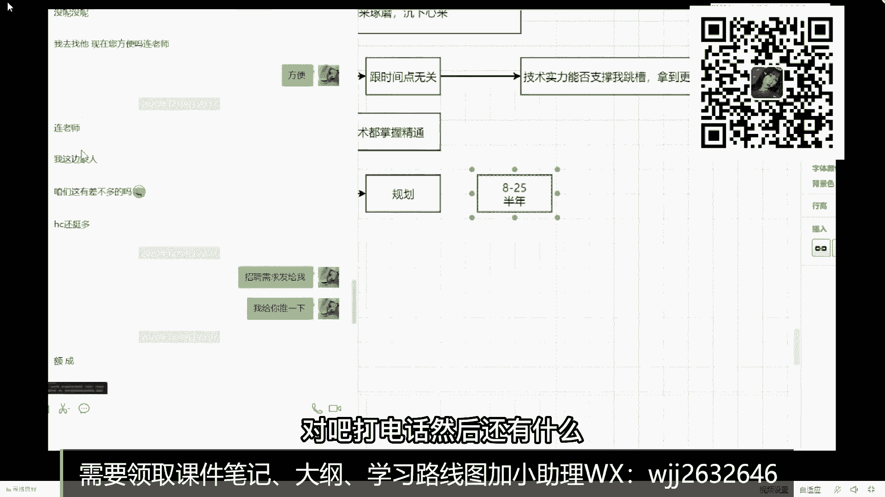

我这边缺人，咱们这有差不多的嘛，h c还挺多的，把他们的招聘要求发过来了。

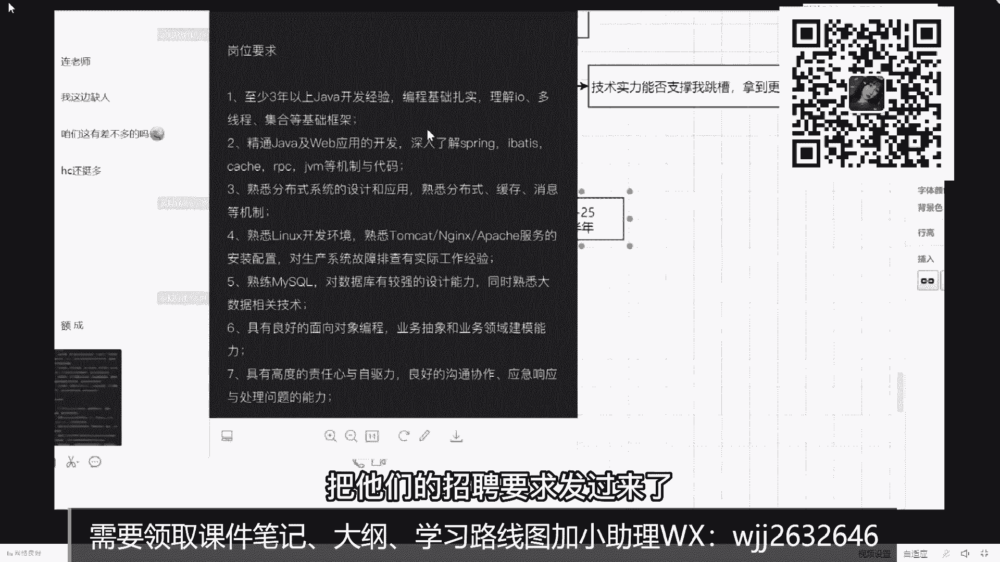

要求要要人，所以你只要跟着咱们的课程体系，踏踏实实地去进行学习，进行技术一个储备，掌心这件事情真的没有大家想象中的那么难，明白意思吗，啊我一直给大家说一句话，我说如果你想干一件事情，办法总比困难多。

而如果你不想干一件事情，那么困难总比办法多，就这么简单，所以你想不想，或者说你想达到什么样的一个目标，你想追求什么样的目标，如果你想，你就要动起来了啊，而且你要抓紧时间跟着干，加油干，你好意思吗。

如果你不跟着干啥的，就完犊子了吗，这么简单是懒，在如是说，妈耶妈耶咋了，别人达到目标还能拿到吗，这个也不是一个个例，我不是说拿一个个例情况给大家进行展示，呃我可以给大家看一个东西啊。

我之前记录过我手里边掌心学员的一些情况，做一下这个文档啊，我专门理了一个文档，然后文档里面就是我们掌心的学员的情况，怎么没了，这里面我把我们现在掌心的学员的情况，基本上都记录名字，基本上记录下来了。

我一会儿我可以可以看一下，对应学生的一个信息，诶，我没流到哪去了，说一下，找一下，等一下这个，那我给你看一下好吧，这时有一定的学员都找到对应的工作了，给你看几个吧，咱也别多看了好吧，3年正常性有多少。

这要看你在哪个城市啊，你城市不一样的话是不一定的，当时看这学生呢，在哪联想通过你的修改简历好吧，我已经拿到了20k的offer，给他发的东西如你所愿，17+2，17+3转正，就这学1号可以入职吗。

甲方好做的海外金融项目，我本来是去试水的，没想到就成了，谢谢联想，如果没有联想的，知道我没有没，不仅没这么快找到，把视频交给联想最好满分服务，看到了吗，拿了几个offer，17+3 k的，19x13的。

看到意思了吗，这学生基本情况，12说认真学四个月能涨多少，这要取决于你现在的贝斯多少，以及你对应的目标多少，这个没法统一给你概述啊，但是按照我们学生大部分的一个普遍情况来说，普遍情况来说。

如果你学四个月涨个5000块钱是问题不大的，张5000年问题不大好吧，这是一个学生了吧，还还想看自家学生资源案例吗，想看给老师扣个一，你想看的吗，我可以看我手里的有多少同学，他成功找到工作还有吗。

有很多是很离谱的，有很多也不太离谱，好吧，来给你看一下吧，看这个哥们儿，这哥们什么情况，我们来看，这是21年6月份找我的，说梁老师上次那个面试的，我学完了，可以给我制定一个新的技术提升方案吗。

已经规划过一次了，这是规划第二次，大家要重新规划，我涨薪了吗，说涨薪了到40了吗，这个学生我印象比较深，他年龄比较大，然后想从想一个月之内，从一从31可以涨到41k吧，应该是我没记错，好像是这样。

我到40了吗，我记得你7号40的都对到了，拿到了41k老婆说这是多久了，两个月吗，说是的，大家可以看一下这个时间，他找我汇报的时候是6月23号，你可以往上翻，我们整个规划服务里面给他做个答疑。

简易的批改，整个这个过程，他当时报名的时候可以给大家看一下，这是几号，2021年4月29号，从4月份到6月份好吧，它的期望其实也非常简单，慢慢看，目前心率是31k对吧，计划1~2个月之内期望40。

他真的成了这个什么，所以不要小潮说我能不能做到，你只要敢想就能做到安排，说有成都的吗，还真的有成都的呃，成都的我给你找一下啊，成都，不是这个，我从那搜吧，我从那里搜吧，这是我们对应的就业细胞强在里面。

一定有程度的，看这个，这儿有写吗，看一下有写成就吗，没写是吧，梅西换一个，看到他说已经入职了，看这学生情况啊，他说已经入职了好吧，然后呢，薪资多少涨多少，接近翻倍了，学多长时间，学了三个月啊。

他也是成都的，再来一个这个这有写吗，我没写到啊，收到几个offer，电力封了，然后叫能拥有的，然后两个公司好吧，去年的时候面12k都是比较虚的，袁老师好，哎，这个有，这是我的学员，我说一下这一封。

哎知道了，再往上看看，这哥们，我说了，我这有很多成功的一个案例啊，往哪走，看这个吧，我说的是拿几个offer便利蜂的好吧，然后呢创业公司然后拥有的给多少钱好吧，一个是外包面试官聊怎么怎么样，往下看。

这次去做工资拉项目，丰富经验对吧，涨薪了13k吗，对长期在不止还有两金和期权，以前的五险一金都是最低标准，还是全额对吧，以前1年15万，现在40万啊，差差点三倍了啊，今年沉淀学习了半年。

去年面12k的都很虚，今年各种大厂都不带怕了，看完意思吧，是个人的一个情况，我可以看一下它是不是成都的啊，中间被清理了，算了都被清理了，看不到了。

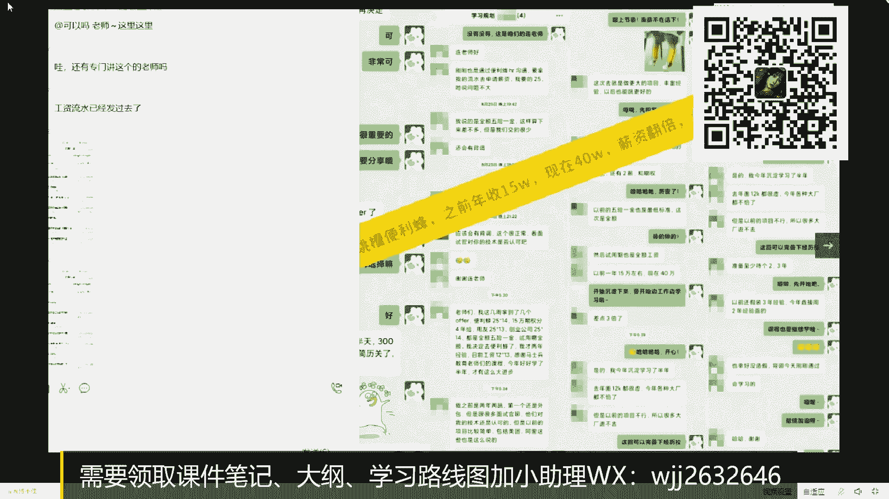

怎样程度的好吧，明显程度的保持个人的一个情况，所以呢掌声案例有很多，关山月说我没有自制力，没有自制力不可怕，没关系，咱们可以有班主老师督促你来学习，这个你不担心好吧，只是说没那么多时间来学习。

每天两个小时的时间，有没有，我要求不高，你每天只要拿出两个小时的时间，进行技术储备就够了，只要两个小时，明白了吗，梁老师辅以ok来看这个吧，刚刚有个学生发了一个规划的案例啊，来看一下微信昵称啊，问号。

然后呢哪的辽辽阳是哪，24岁男，目前就是2000。5年大专如火，如果体是啥意思啊，被生在吗，大家也可以把你们个人的情况，按照这样的方式发一下，发完之后给出一些个人的建议好吧，是如何储备技术吗。

你现在我不知道辽阳市，我不知道辽阳是哪个城市啊，有人知道吗，你不知道城市哪个城市啊，但是按照你现在的薪水，和你现在的工作年限的话，你的成长空间是非常非常大的，你需要把你现在具体的技术。

踏踏实实的储备完善起来好吧，什么技术，比如说像现在面试中必问的一些微服务的，一些分布式的好吧，一些关键的核心点都掌握好，把一些技术的底层实现掌握好，我觉得如果你在辽阳，我不清楚这个城市的薪水啊。

如果你去到北京的话，学到明年金三银四，你到北京至少保证你10k以上的薪水，挨着沈阳是吧，最起码保证你10k以上的薪水，如果达不到，我个人可以掏腰包退你学费，就这么简单啊，所以关于提升技术这块没问题。

好吧啊，这学生说我在，如果你现在只是想提升一下你个人的天才，学生啊，如果你现在只是想提升一下，你自己的一个技术的话，好没问题，放心在，然后建议你24岁还小，最好能去大城市里面冲一冲，拼一拼啊。

拿到更高的薪水，还是那句话，学到明年清算一次，到北京10k加的薪水，如果达不到，我退你学费，明白了吗，可以啊好吧，关山月说，武汉小姐姐跟我说，这个课程越早待会越划算，我目前准备突围，看工作需要多久时间。

如果突击的话，看一下你观察也听好了，你是否是想脱产学习，如果脱产的话，一个月一个月时间，一个月时间啊，把咱们对应的一些面试突击的关键的核心技术，看他身世的储备和完善一下，百分之百是没问题的，不脱产。

不脱产，每天两个小时，拿出两个月的时间，拿出两个月的时间，把你的技术做一个完整的提升，我现在还不知道说，你希望的薪水大概涨幅到什么样的一个地步，如果你只是说涨了几千块钱，那这事非常容易非常容易啊。

所以你最好把你的详细情况能给我说明一下，可以按照这个同学写的这个格式啊，可以说明你对应的一个呃这个核心点好吧，我们现在对于我们现在的学生也是一样的，我们并不要求你每天要学四五个小时，六七个小时，不需要。

我们只需要你每天拿出两个小时的时间，来进行对应的技术储备就完事了，就这么简单好吧，我们一直强调一件事是，什么叫零碎片化时间，系统化学习，你不需要一定要有说很多的一个整块的时间，来进行技术储备。

只要你不停的在学习，按照咱们老师给你规划好的路线，来进行技术储备就完了，就这么简单好吧。

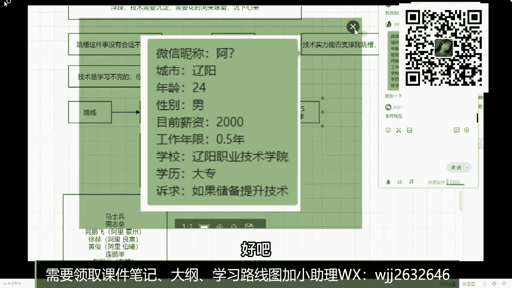

关山月明白了吗，所以如果你有需求的话，最好能给我详细的做一个描述，好详细的描述一下，ok，你的比如你的城市啊，你对于那些情况我就好好说一下啊，这样的话了解你情况更具体。

更具体的话能给你们的建议就是越完善的，反正我们拓展学习的同学，基本上就是一个月两个月左右时间，一个月两个月左右时间脱产啊，不是不是脱产了，突击的学生有短时间跳槽的，如果说你短期配合的话。

你还需要储备很长时间的话，你就没必要了，所以呢每一个学生在进行学习的时候，他大概其实分为两个维度，第一个维度，第一个维度我们叫突击学习，第二维度叫系统化学习，初期学习只是为了保证你在短期之内能涨薪。

但是最根本的和最核心的点，还是要进行系统化学习的，比如说我们会为每一个学生规划系统化的路线，然后你按照路线来进行技术储备，完了好吧，好了别的了，还有什么问题吧，哎呀你还在吗。

其实啊刚刚给大家展示我们的课程大纲，展示咱们的老师，然后展示了咱们的学习路线，然后展示这些东西的意义在什么地方，其实就是为了给大家显示说你过来学习之后，你需要把把心放肚子里面。

只要按照路线踏踏实实的去储备和完善，你的技术，不完事了，就这么简单好，最后再说一下吧，今天晚上咱们训练营期间有专门的专享名额，好吧，然后呢只有十个名额，前五名可以抢占对应的黑卡啊，过了这五名之后。

黑卡就不再赠送了，ok，那么这个优惠优惠打了，哪里领，我说了，扫描屏幕右上角的二维码，如果你已经加过马士兵教育，的任何一个咨询老师了，那么没关系，直接去找他，说我是从李老师直播间过来的就可以了，好吧。

我说了，你扫码吧，应该能找到吧，我试一下密码应该没整过吧，可以扫啊，你可以直接扫了哦，可以直接扫码，主要是学费太高了，有点压力，我说了，如果你觉得学费高的话，咱们这边有分期免息的名额，你分六期的话。

12000块钱，每个月大概还2000块钱吧，好吧，阿贝多，只能今天吗，对只能今天，因为我说了这些黑卡福利也好，还是六期免息服福利也好，只是当前这个训练营专享的，过了这个训练营营或过了。

今天晚上12点就没有了，没有了，ok我还要和媳妇商量一下，你商量吧，这个花这么多钱肯定是要商量一下的，你该商量就商量吧，还有什么，钱在他手上，真的我也结婚了，我深有同感，我的钱也都在我媳妇手上。

已婚男人的悲哀我可以理解好吧，但是啊你抓紧时间找你媳妇聊，还是那句话，今天现在的这些福利只有新版有过了，今晚就没有了，就很简单，好了，别再发什么问题吗，问这话我不聊了，我讲了两天了，我也挺累的。

昨天啊还有很多同学找我做规划，今天没了，我都交完了，虽然我觉得分析了好多同学最现实的一些情况，老师介绍的活动就是学流行的优惠是啥意思，什么叫老师介绍的活动，就是学习路线的优惠是什么意思。

这个活动啊是对应的学习路线的一个课程，那个学习路线的课程叫什么叫m c a马士兵，certified ark te，把sc课程体系里面包含了java整个体系里面，所有的技术点。

只要按照技术点去进行技术储备就完了，所以这个刚刚展示了一个优惠，也是mc架构师课程的一个优惠，猪鼻说你们有go on老师吗，有啊我们有张三老师又在讲go浪的，刚刚给大家看了一个东西啊。

就是去了后天更新里面有一个go web的一个实例，就这个美女老师给大家讲过了，好，我给大家看一下课吧。

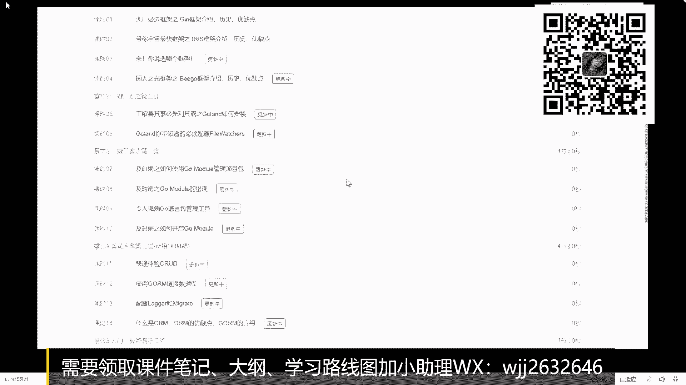

赵云的课好吧，各位吧，刚开始进行更新，还没上传吗。

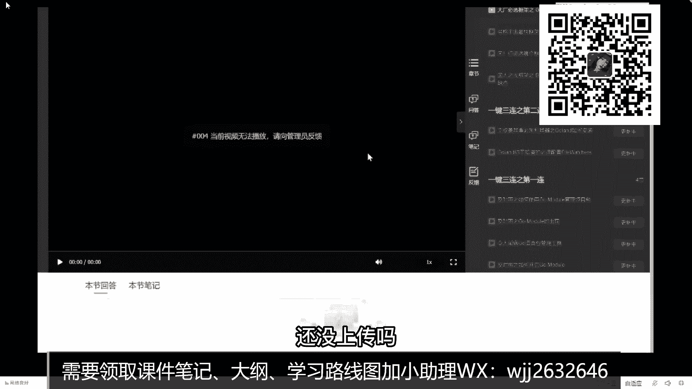

什么意思，无法播放，这有问题啊，明明还没上传上去啊，上去之后就都会有对应的课程了好吧，这个老师来讲了，找商山老师好吧，数学老师不是说有一个6+12的分期吗，那个是什么，那个是呃，有钱花一个学习。

优惠和细节方面的东西，我也不太了解啊，如果你需要的话，可以找咱们的那个小姐姐去问一下，具体系呢我也不太清楚好吧，老师现在我有一种现象，我是学钢管的，但是公司需要优异的前端，没办法啊。

这是小公司里面存在的一个通病啊。

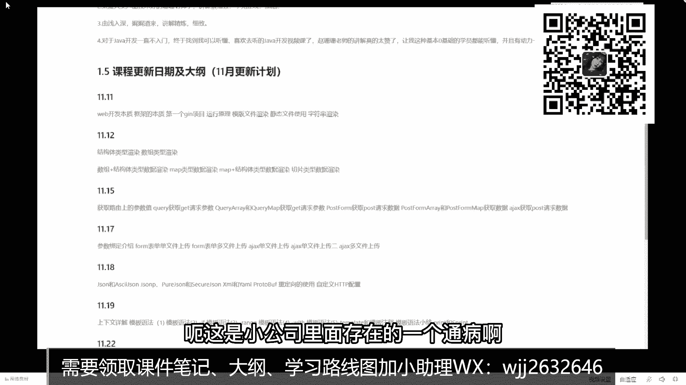

大家永远记住这件事，什么通病非常简单，就有多少同学想做全站的标志，扣个一有吗，有多少人想做全站，给老师扣个一，在正儿八经的大公司里面，其实是没有全站工程师这样的一个职位的，注意了。

小公司里面他想让一个人发挥多个人的价值，所以他会让你做前传，前后端什么东西你都要一个人接触，但其实蛋和生产规模的公司，基本上是专人做专事，明白吗，现在有专门的前端工程师，如果你把前端的职位的工作都办了。

那前端人干嘛呢，这是闲的没事干了吗，能明白这意思吗，所以这不是最主要也不是最关键的是，你需要的是干嘛，把你的技能里面的某一块做到极致或学到精通，这才是最主要的最主要的好吧，所以啊我不建议大家做旋转。

如果你是做后端的，做java的，就把java后面那条路线给储备扎实，储备扎实，高级工程师网架构发展不是还需要会前端吗，不需要你会前端，不需要会前端好吧，现在前端的体系也变得非常非常复杂。

你变得非常非常复杂，你不能说按照一个就是嗯怎么说，你把整个前端的架构也要搞得非常清楚，这个不需要这不需要好吧，专人做专事是最高效的开发方式，这个vip黑卡是干嘛的，哎呀刚才说了一堆都白说了。

我再来解释一下黑卡该干什么事了，好吧，这是我们黑卡的福利，黑卡里面享受的福利是什么，第一个叫个性化定制方案，第二个叫大厂优先内推，第三个是最值钱的，刚刚给大家展示了五个课程的更新，如果你没有黑卡的话。

你只能享受课程的权限，2年的时间，但是如果你有了黑卡之后，你可以享受一元的持续每年的升级更新服务，如果你没有黑卡的话，你想升级对应的课程服务的话，你需要花888块钱来进行购买，听明白意思吗。

所以这是最值钱的，包括你可以去手机上面的应用商店里面下载，码视频教学的a a p a p p里面有很多的课程，如果你是黑卡用户的话，可以享受最低的折扣价，这都是给予我们的vip学生的一个福利。

一个福利好吧。

是黑卡存在的意义，我说了，黑卡不是每个学期都有了，包括我们之前报名的v i p也一样，不是每个人都有，我们只是在不定时的时候会送出一些黑卡，福利啊，这个要多少钱买，今晚报名的话。

黑卡前五名是免费送给你的，但是我不知道现在还有没有前五名啊啊啊，今天晚上是免费送给你的，如果你正常情况买的话，我还是那句话嗯，黑卡现在我们不卖，黑卡现在是不卖，我们只会给我们定期的给一些vip福利。

不定期的给我们的一些多名学员进行赠送，今天晚上和当前训练营里面是前五，有只有前五名是有的，所以前五名是没有的好吧，vip能看go on的课程吗，我们会赠送一期go浪的课程，但都浪后续的课程更新就没有了。

布朗克斯克后续的课程那些就没有了好吧，呃内推有什么要求，还是直接就可以内推，我怕我到时候学了学了找不到满意工作，阿白把你的心放肚子里边儿，呃前两天我们有一个学生，他也是他自己的学历是有问题的。

所以导致他进不了京东，然后我们的老师帮他内推到了我们的京东，就这啊我说的是内推到京东了，什么写京东，他那些京东之后，他还给我们的那个呃陈老师还送了一面锦旗，我给大家看一下，这锦旗呢我又完了又没了。

来看一下这个，这是我们的曹老师好吧，金星培育传技能受益终身赶尸mc班白宏宇赠予。

看到了吧，就是内推这方面你可以放心，而且我给大家看一下咱们内推有多么有实力，好吧，嗯叫这个吧，应该，页面没了吗，我要看一下字节，给我们内推好吧，你看这张图片，他说我是字节跳动直播平台的研发负责人。

看到马老师的课程材料，觉得可能有不错的学员推给我，直接安排面试，就这个人工牌叫什么涛，你们如果有自己有朋友的话，自己有朋友的话，可以支持背调，看到吗，这个你放心是吧，包括这边我们一堆的企业内推。

如果你需要，你可以来看看好吧，都是给内推的，国内一线大厂里面。

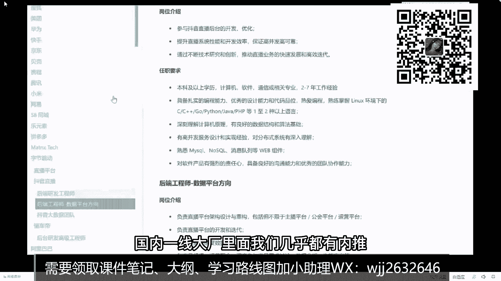

我们几乎都有内推机，都内推好吧，呃余墨发了一个人情况，我给大家看看好吧，21岁，吴西方行资15000半年，本科想走后端路线，学过java，没做什么项目，如果春招想进中小厂，是项目重要还是基础重要呃。

如果你是参加校招的话，我觉得技术实力比较重要，就是比较重要，这块我也可以给你看一个学生的情况好吧，也是之前的一个学生，他个人什么情况呢，可以给大家看一下，就昨天啊我给大家展示过这个相关的信息了。

这个学生呢他这个学生报名的时候是什么，报名呢，是2020年11月份报名的，其实就相当于是你的学长，上一届的一个学生，你可以看一下啊，这学生这是勾中间打印服务啊，他找我的时候是12月19号。

可能消息没同步啊，12月19号，然后找我的时候往下走，这个学生他也是想参加春招，感觉参加重装没希望了，后面给他改简历，告诉他你怎么进行储备，怎么去谈心，怎么去储备技术，做了一堆的工作，然后呢往下看。

在最后面的时候，他搜到对应的offer了，属哪了，入职是滴滴的，虽然薪水不是特别高，但他入职了，往下看，老师一那边已经确定下来了，也签好了，三方最低的白菜价，19x15+5 k的握手费啊。

今年6月份毕业，招的时候是21年，看到了吗，就相当于去年的时候。

他跟你一样，也是11月份来报名的，报完名之后收到b offer，所以这个余某把心放肚子里边，没问题的，你过来之后，老师会给你规划一个单独适合于你的，内推的服务，你根据这个服务好吧，内存单独适应你的路线。

你按照路线去储备你自己的一个技术就行了，还有握手费吗，握手费这东西啊，看公司，有的公司是有这个公司是没有的，好吧，呃这个要多少钱呢，请您赠送，还有一个令若先来看一下吧，运用心是什么城市。

3年南京29任信息工程培训出身，运营商项目中业务一直是919 11 六，c l o d刚离职多个offer方向，我们不确定怎么走到这未来方向，互联网有希望吗，如果不行，互联网架构有信号板吗，呃个人建议。

个人建议最好能进到互联网公司里面，这样的话对你之后的发展是比较有好处的，如果你进不到这种官网公司，还有这些传统企业，那么对你之后的发展可能会受限，最好还是进互联网金公司，你现在的话大概是9+3 k拆补。

然后期望是18k，南京拿18k我觉得没问题啊，南京有一个公司叫苏宁易购，你知道光苏宁易购有多少学生，咱们这报名吗，401构的学员至少有十几个，他们都是直接朋友推荐过来的，就很简单。

因为南京啊大厂相对也比较少一点，所以如果你想拿到更高的薪水的话，你的技术实力是一定要足够扎实的，所以拿18k这件事情可没那么难好吧，没那么难，给大家看一下，应该有南京的吧，南京的啊。

这哥们儿跳了涨了4000，南京好吧大但是还是在外包，然后再看这个这个学生涨了3000好吧，后面造造成上万再考虑跳槽，现在底气还不是很足对吧，这个呢从北京到南京这边好吧，你在北京收了多少14，然后说20。

他们说涨幅只能在20~30%之间，t3 这边给到24，南京有个t3 出行直接给了24k的月薪，主要看数学班的课程，mysql redis这边我们多线程好吧，其他的没时间看，今年3月份开始看的。

到后面还是想系统的进行一个技术储备，从南京拿到18k的薪水是没问题的对吧，这也是南京专科学生，今天涨停过吗，翻倍从8k到15k，南京看到了吗，同学魏若欣，你还在吗，这都是咱们南京的成功的案例。

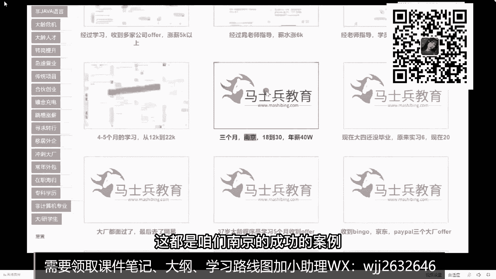

我们来看前两天面了，也给我发offer了，税前30k年薪大概40万，现在是一家创业公司，24。53星对吧。

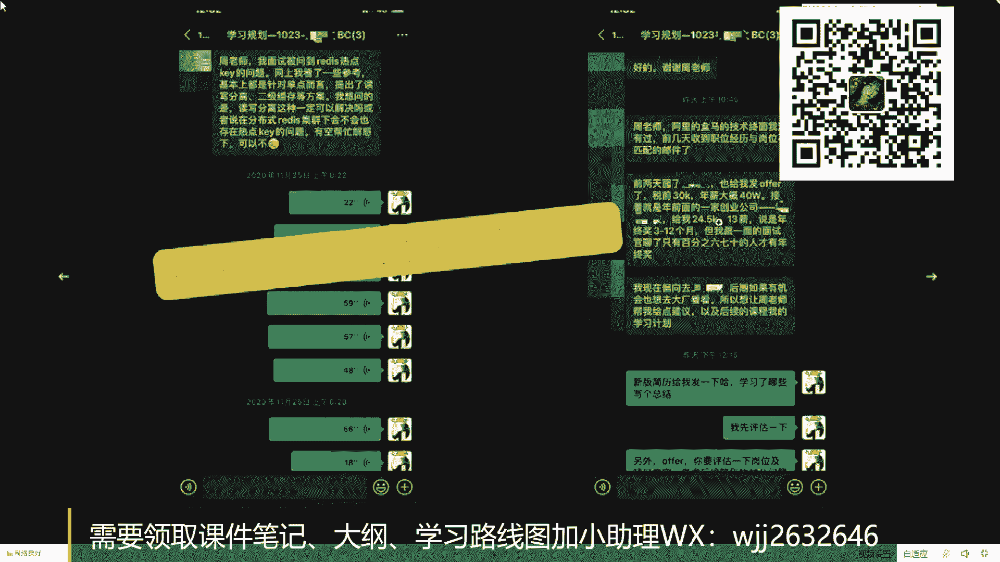

他也是南京的，你懂我意思吧，哇所以看这种情况，像cs double这件事情没那么难，ok完了我还在加班，老婆睡了，能不能给我留个名额，拜拜好吧，小明说有定向内推吗，听懂这些吗，呃有啊。

大家知道我们跟京东现在的合作是什么，有一个东西给大家找一下，我们现在啊跟京东那边是定向的合作，给大家看一下，这是我们马士兵教育，跟京东java互联课程的一个独家合作。

我们派曹老师和我们的老师去其中里面进行合，作一个谈判，并且签署了专业的一个合作协议啊，这里面包含了我们对应的一些架构师，课程的一个课程共研和人才的一个贡献体系，看到了吗，包括我们后面会给京东那边。

进行课程的一个宣讲，课程的一个授课，所以如果你想进京东这边，百分之百是没问题的，明白了吗，sn啊，你只要把技术储备扎实的，进京东还是很容易的，我给你搜一下京东吧，咱们进京的学生还真的很多啊。

看那个老李老师，我是京东了好吧，之前的offer没跟你说是吧，15x14，他是在武汉，他是在武汉，武汉入职京东了，然后这个形容也是感谢zm机构好吧，老师我这边最终还是决定入职京东了好吧，18号上班。

感谢咱们机构，10月到12月两个月的时间，能让我知识和技能提升到大厂水平，机构还是牛逼，看到了吗，这学生准备入职京东了好吧，叫b 17~25k涨了8000块钱好吧，8月20号到10月8号。

大概就一个月的时间对吧，这也是我大概写也刚过了京东页面，后续还有什么要注意的，好往下看啊，那走了涨了4000对吧，京东正金什么之类的，所以把先锋做点没问题的，ok繁华3000说2年开发经验。

在杭州上海能拿到多少钱的水平，如果你是2年的真实开发经验，上海我觉得15~20吧，最起码15~20，15~20，如果更高的话，这个上不封顶，看你个人的技术实力了，看你个人技术实力了，这个没法给你预估啊。

主要还是看你技术水平，但我觉得最低也要15~20，这个范围最低的，我只想跟你说保底的啊，上上面的话就不确定了好吧，所以还是看你个人的技术储备吧，所以说课程都是直播吗，怎么个模式。

上课时间加上自己的学习时间怎么分配，每天需要多久，两个小时课程有直播，直播完的课程会变成录播，所以你在过来学习的时候，是以直播加录播的方式来进行学习的，是你自己的时间，我要求不高。

每天晚上只要能拿出两个小时的时间来学习，就够了，这个孤冠每天只要两小时，要求不高，只要你能拿出两个小时时间，把你的技术踏踏实实的储备和完善一下。

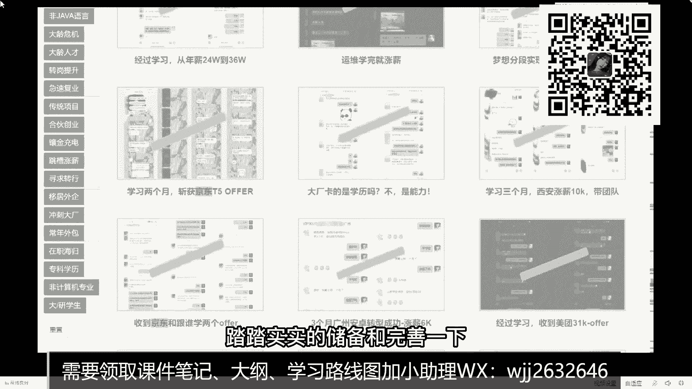

涨薪这件事情还是很容易的好吧，基本上3~5个月吧，3~5个月涨涨涨涨，涨一下薪水，刚刚给大家看了，我们给大家看了直播课表了，然后除了直播课表之外，已经掌握的直播课都录播了，录播课了好吧，墨丘尼。

成都27，目前九期望23年自考大专，目前专升本中，从事其他行业，17年转行培训六个月，18年工作3年，外包没有三个项目存储交地，我该怎样提升自己，你这样说的很清楚了，你没有三高经验，都是c o d原理。

源码都不了解，那你后面再进行学习的时候，就要把原理和源码当成一个重心，来进行技术储备了，你先记住啊，现在如果你想拿到更高的薪水，会在成都拿到20k的薪水，那么你需要做的事情就变得非常简单。

要把技术不但不仅仅停在应用层面，对很多底层的原理和对应源码的实现，你都要储备扎实，因为你只有储备扎实之后，你才能收获或者获取对应的薪水，如果只是那种技术应用的话，肯定不行。

像现在面试中主要问的我经常说的微服务，分布式中间件，数据库架构设计，这几块东西你都掌握好，当然哪个点先学，哪一点后学，我还是需要经过对你的技术做一个评估，评估完成之后。

才能告诉你说你的路线到底是什么样子的，明白了吗，没处理，所以你自己其实说的很清楚啊，你哪儿弱你就补哪就可以了好吧，珠海36岁，一本5年宁方项目13。5k现场，新天翼五开发还有希望不在珠海。

为什么会没希望呢，我你知道我在给我们的这个这个雨墨春晓同学，听好了，你知道我在给我们的vip做规划的时候，你知道我最害怕什么东西吗，我最害怕的就是学生给我说一句话，我给你搜一下。

这是这些学生们经常给我发的一句话，就这东西，看到了吗，这个这个这个东西真的是我我我，我最害怕同学们这么说，你知道吗，看到了吗。

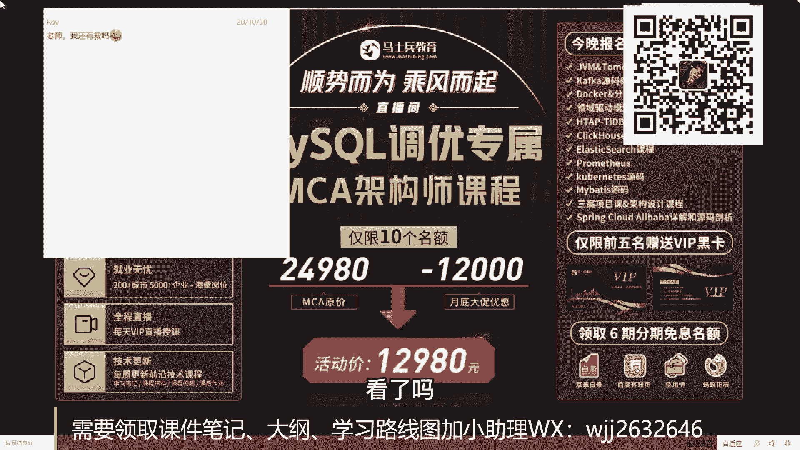

就很多同学我不知道你接受了什么，是接受了多么严重的社会的毒打对吧，让你感觉自己还有救吗，为什么没救，为什么没希望，我一直说一句话，你只要开始学了，你只要开始补充你的技能了，你只要开始完善你的技术储备了。

你的薪水一定会涨，这不长得不科学，明白吗，所以不存在有救没救，你想达到什么目标，我来评判评判你这件事情说能不能达到，不过达不到，我会给你调整出你最合适的一个目标，你按照对应的目标去进行技术储备就完事了。

怎么会有那么多有救没救，这种话题呢所有人都有救，只要开始学就不晚，这是我们一直秉承一个话题，所以不管什么学校来之后，一直没说老师有救吗，有希望没有，不可能没希望，有希望就要开始学，我最怕是什么。

你不学了，你不学就真的没救了，明白了吗，听明白了没，你没生小，所以有没有叫有涨薪这件事情很容易，你现在36岁进大厂可能希望不大吧，但是如果你只是想单纯的涨个薪水，我觉得是没问题的，好吧，太不自信也不好。

不是太不自信，是你们真的一点自信都没有，能懂我意思吗，所以跟着老师的路线，我们这边服务了成千上万名的学生，总结出了一系列的学习路线的规划，你只要按照路线去储备，他怎么可能没救，其实我们对于学生人群的。

就是这个这个这个这个分析，其实非常非常到位的，我给你看一个东西啊，我帮你问下在不在了，因为还在吗，在页面里面我们看一下，这是我们现在学生的一个情况，我们对我们现在所有报名的学生，做了非常详细的人群分类。

比如说你是大学生还是研究生，想进大厂吗，比如你是非计算机专业的吗，你还是专科学历的，你还是在职海归，你要常年外包，你还是想冲大厂，还是移居外企，还是想转行，想涨薪的，想镀金的，想创业的，想传统项目的。

还是想开发爱好的，非java语言的，大龄危机的，大龄人才的转岗提升的极速，副业的，只要你是这里的类别的人群，你放宽心过来，百分之百是没问题的，好一个人可能会覆盖里面的多种情况。

但是每一种情况其实我们都有对应的成功案例，听明白了吗，同学们每一个情况都有成功案例，我们服务的学生太多了，我们也见识了太多太多的情况，明白了吗，所以在老师这一块，他不存在说没救这一说不存在哦。

只要你想学，只要你肯学，就没有没救这一说啊，我们这个路线一定是最适合你的路线，你只要按照这个路线去进行技术的一个储备，百分之百成就简单，就刚刚那几个细胞强啊，多少个机构成管理了，你可以自己去打开看看。

你自己刷一下，你光看这个就业喜报，你要看一阵子，这都是成学生成功的案例，怎么可能到你这就突然没救了呢，为啥没救了，不可能没救好，不一定有救o，漫里风铃音，你们这名字都咋起了。

上海24拿23年大专通信技术跳两次槽，年6月份收到上海市资金融公司新的14k，之前在郊区做一家互联网医疗工作的，这些技术的话，但是目标还有很大，学以后路线该怎么发展呃，你现在学历不占优势好吧。

但是好在你的年龄还是比较小的，不知道你之前跳槽跳了多家公司呃，跳了两次槽啊，3年两次也还行吧，但不要再多了呃，建议其实非常非常简单，现在把你的技术踏踏实储备一下，你现在14k3 年。

坦白说这个薪水有点低了啊，或者换一句更加委婉的表达方式，你薪水的成长空间还是比较大，还是比较大的，所以把你现在的技术储备扎实，原来学技术有提升，但更多的可能还是停留在表面，或者说没有形成自己的知识体系。

所以你需要从现在开始进行技术储备，把你的基础体系给提升上来，不要再跳槽了，好从今年开始到明年6月份之前之前，都不要再跳槽了，下班之后要突破学习，养成长期学习的习惯，每天拿出两个小时的时间。

来进行技术的一个储备，把技术给成扎实了好吧，然后下一份找工作至少20加以上，记住啊，至少二加以上，就你记住了，永远永远记住一句话，你的技术主要储备扎实的，你想拿到这个薪水，他没那么难，最怕什么。

最怕你的技术不扎实，还想要勾心，懂我意思吧，所以你想你这次跳完之后，14k你之前的话可能更低，所以技术储备是一定需要了，6月份到现在五个月时间了，你技术成长多少，还是要进行系统化学习的这种单片的。

或者说单崩的那种碎片化学习，他真的对你的成长没那么大的好处，好了吗，这个漫里风铃音听漫话，给老师扣个一好吧，明白了吗，系统化学习储备你的技术，完善你的技术储备，把技术给成长起来，就这么简单。

呃半夏北京20 41，希望18+一点，5年本科1年研发经验该怎么提升，建议建议808呃，最合适你的班就是mca架构师课程，把mca架构师课程其实不需要多学啊，我不知道你之前有没有跳过跳过槽。

如果没跳过槽的话，从现在开始学，储备到明年金三银四，在北京城市里面拿一个18的薪水，如果明年金三银四达不到，我可以自己掏腰包，把学费退给你，这就是我的信心，明白了吗，班下这是我的信息。

你现在报名去到明年34月份好吧，拿出四五个月的时间来进行去储备，按照我给你指定的路线去学习，如果达不到18月的薪水，我可以退你学费，这么简单，怎么西安18家，你如果想回到西安拿18加。

它的难度还是比较大的，西安虽然现在发展也还挺好的，但是跟北京的城市的薪水还是有所区别的，明白这意思吧好吧，而且你现在年纪还小24岁，我建议你在一线城市里面多拼一拼，多搏一搏，为什么那么早回去呢。

你在北京过一段时间拿到更好的一个薪水，拿到更好的offer之后再回去，你的身价都不一样，它不香吗，是不是，何必这么早要回去呢，回去干啥，好吧，行了，差不多也十点多了吧，现在还有什么问题吗。

如果没问题的话，咱们今天晚上就聊这么多吧，好吧嗯，很多同学也说了个人的情况，我也把个人的一些经验或者一些建议，也分享给大家了，还是那句话，赛季之后把你的技术储备扎实，所以说定向内推有啥要求，没啥要求呃。

如果你想进哪个企业，我们会把你的简历给你，陈同学听好了，如果你想进到某个大厂和某个企业，我们会提前把你的简历给你润色好，复试做好完成之后，你就可以直接去，我们会把你的简历题给投递过去。

你就等着面试就行了，就这么简单，他没有啥要求，不需要说老师我一定要具备什么样的实力，什么之类的，当然你的技术啊一定要储备扎实的技术储备，不扎实的话，相当于白白浪费机会，不要浪费机会嗯，想去网易。

网易有啊，还是觉得有点贵，没关系，觉得贵你就再看看，还是那句话，你永远记住一个课程的价值，它在什么地方，而且我告诉大家，这个课这个价你可能觉得比较贵啊，但是这个价格其实也不是我们定的，不是我们定的。

是腾讯课堂要求我们这么定的，这样一套完善的课程体系，这样一套频繁化的学习，你觉得多少钱值，如果真的话，五六千块钱你会买吗，很没意义了好吧，而且如果你觉得贵，我说了。

今天晚上前五名同学他会有对应的免息补贴，所以需要的话找他们说年龄领一下，看看现在还有没有对应的名额。

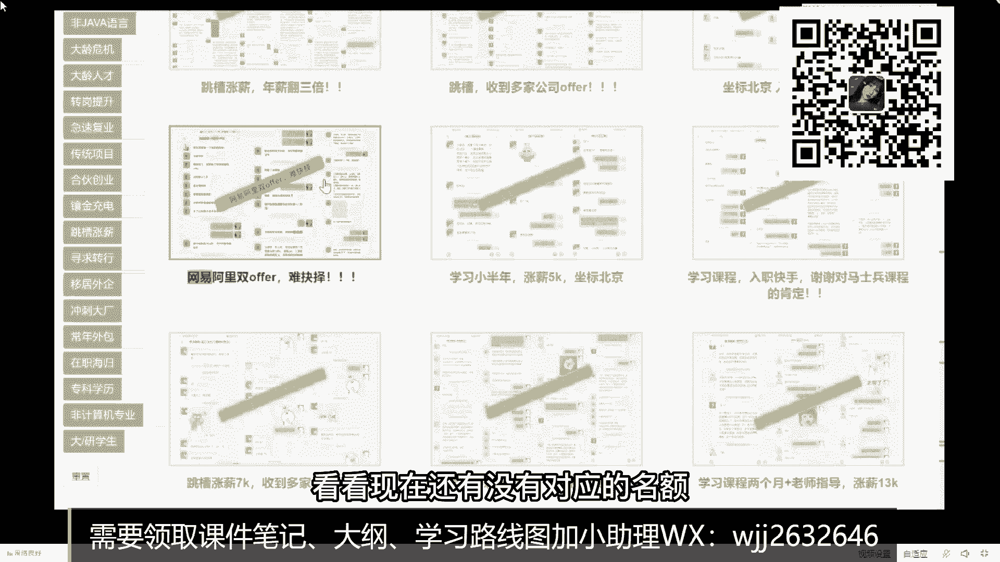