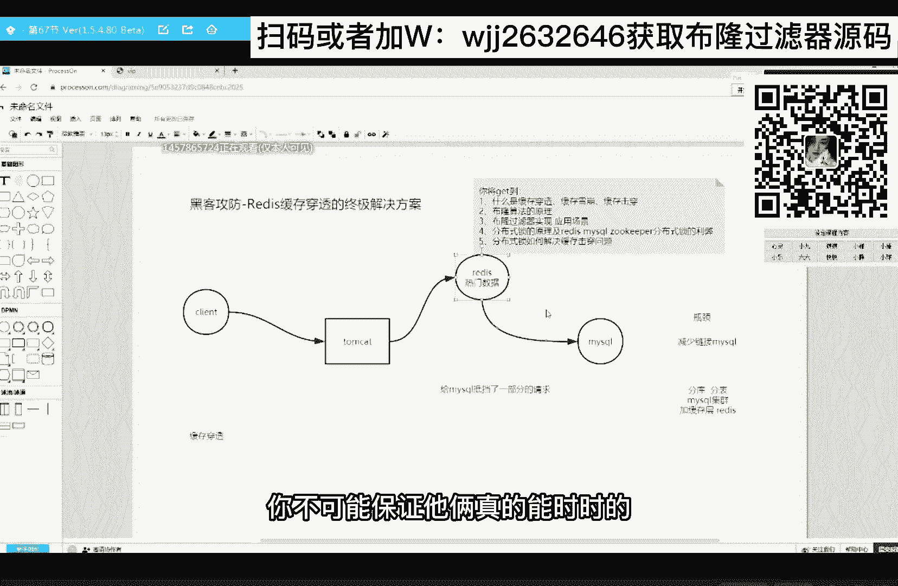
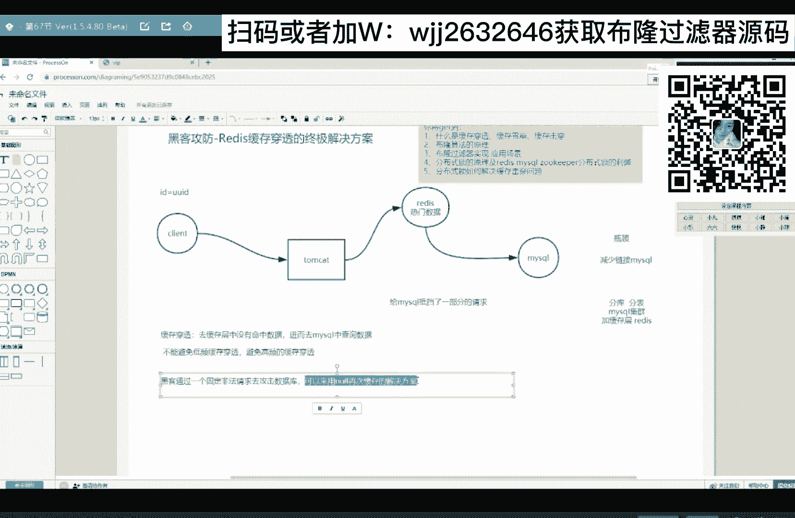
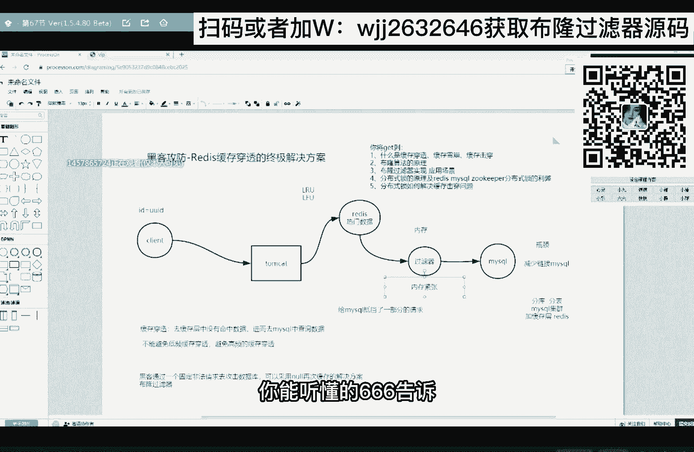

# 系列 6：P93：什么是缓存穿透？ - 马士兵学堂 - BV1RY4y1Q7DL

今晚的主题，黑客攻防redis缓存穿透的征集解决方案。

通过这节课你可以get到这五个知识点，这些都是你即将出去面试经常被问的好。

我们从一个非常简单的一个问题开始来了解啊。

大伙现在在公司里面做的开发，基本上都是b s架构是吧，来是b s架构，同学扣个一，我看看，ok现在基本大部分都是b s架构，那么b s架构我们大概画一下它的一个，我们站在一个上帝的视角。

画一下它的一个架构啊，这是我们的web服务器tom cat，那么tom cat服务器后面它又挂了文字数据库对吧，比如说挂的是mysql关系型数据库，那这个圈儿啊，这是我们的客户端，这是我们的客户端。

那我们用户啊发一个请求，肯定是发给我们的web服务器。

那么web服务器在处理这个请求的时候，在处理这个请求的时候，他会去我们的后台数据库中数据查数啊对吧，那么随着你客户端的增多，随着你客户端增多，那你tom cat这一侧和数据库这一侧，都有可能会发生瓶颈。

都有可能会发生瓶颈，我问大家一个问题，你觉得随着我们客户端的增多，是tom cat这一侧最先发生瓶颈，还是数据库，这一侧来是tom cat q一数据库的扣二来告诉我，好我告诉大家。

一般是数据库这一次它最容易发生一个瓶颈，一旦你数据库这一侧发生了瓶颈之后，差所带来的影响就是你的用户体验差对吧。

响应时间变长。

这是最直观的一个反馈，那怎么去解决你数据库的一个瓶颈问题。

其实解决瓶颈就一句话，解决瓶颈区就怕减少连接mysql，让连接mysql的链接变少。

它的平均不就解决了吗对吗，那么最开始我们最初的一个解决办法。

我们可以搞一个数据库连接池，网络是可以搞一个数据库连接池。

在这个连接池里面啊，我提前创建好一些数据库的连接，如果你需要联网的数据库。

直接去连接池里面去拿，用完了再还给我，防止频繁的去创建数据库连接。

这最开始的一个解决办法，但是一般我们在最初开发的时候。

把这个数据库连接池已经考虑进去了对吧，已经考虑进去了，如果你考虑进去之后还发生了瓶颈，怎么办呀，你数据库这一层还发生频率怎么办，那可能还有一个办法，就是我们可以进行一个分库分表。

把一张大表拆成一个个的小表，把一个大库拆成一个个的小库对吗，或者我们可以搞集群啊，数据库集群对吧，其实还有一种解决办法，我们可以加缓存层来，有同学这样去解决过数据库平静的扣个一。

我看看通过加缓存存来解决你数据库的瓶颈，来这样解决过的扣一，我看看没有这样解决过的扣二，ok啊来，一般目前啊，解决最常用的办法就是去加一个缓存层，加一个缓存层，那么一般我们会使用，什么技术做缓存啊。

首选就是redis，那么在之前啊可能是ready没有出来，之前选的是memory cash对吧，那么现在首选的是redis。

因为redis他的确是太牛逼了啊，有多牛逼。

我们慢慢来讲二，我们一般在common cat和数据库这个中间加一个redis，作为我们的缓存层，在我们的redis里边，它会去存放比较热门的一些数据，什么叫热门数据啊，一句话解释经常被访问的数据。

那我他妈看了，在查数据的时候。

这个时候他需要先去redis里面去查一下。

你听明白了吗，因为reis它是一个低于内存的数据库。

它的响应时间很快，我的查询速度也很快，并且它能支持海量的一个查询，如果去我的redis里边能够查到的话，我直接把数据返回回来，如果我去redis里边没有查到，这个时候再去数据库中查看。

我们的redis在tom cat和mysql的中间啊。

他给mysql是不是抵挡了一部分的请求啊。

对吧，这样就可以解决，所以再回到我刚开始说的那句话。

你想解决mysql的一个平均问题啊，其实就是减少去连接mysql，那我在这加了一个redis缓存层，是不是给他抵挡了一部分，来到此为止能听明白了，666告诉我，非常简单。

我们加了一个缓存层之后啊，其实它会引来一些问题。

他会引来一些问题。

比如就我刚才说的，我们先去redis里边去查数据。

如果redis里面没有的话，我是不是穿过了redis去找到的是mysql对吗。

其实这个现象啊，我们给它取个名字叫缓存穿透，这个现象要缓存穿透，在你的架构里边，你只要加上了redis缓存层。

缓存穿透一定会发生，如果我想避免发生缓存穿透。

我可以怎么办，大家告诉我，如果我想避免发生缓存穿透，我可以怎么办，就是我不想发生任何一次的划算传动，来告诉我主动刷新同步。

有同学说，还有一个解决办法是牛逼。

如果你想让你的架构里边。

没没有这个缓存穿透的问题，那你mysql里面的数据你得全部同步到redis里面去。

这就牵扯到了是不是数据的同步问题啊。

再说了，数据同步这是一个无解的问题，你不可能保证他俩真的能实时的去同步对吧。

如果你把mysql里面数据放全部放到redis中。

那缓存穿透的问题不严重了对吧。

因为我们的redis这是一个内存数据库啊，你全部放到这里边可能不太现实。

所以大家接下来记住这句话。

我们不能避免，缓存穿透，但是我们可以避免高频的缓存穿透。

来我们不能避免低频的缓存穿透。

但可以避免高频的缓存穿透，原因就是你不能把mysql中的数据全部放在redis，你没有那么大的内存来，这句话能听懂的，666告诉我，唉什么后果，我一会儿会说啊，别着急啊。

好好，再赘述一遍，一定要牢牢记着，我们不怕低频的缓存穿透，我们怕的是高频的缓存穿透对吗，如果我现在来了一个黑客，这个黑客啊是一个低级的黑客，假设比较low比较low，他现在做了一件这样的事。

他向我们的web服务器发起了一个请求，他请求的数据是i d等于-1的数据。

这里面有个前置条件，在我的数据库里边，压根就没有i d等于-1的数据。

那也就是说在你rise里边。

更没有i d等于-1的数据，听懂了吗，哎我现在黑客去请求这样一条数据。

那就是说他请求的每一次，是不是都会发生缓慢渗透啊，如果他请求的频率非常的高，是不是在快速的攻击我的数据库啊，这就有可能导致你的数据库宕机瘫痪啊，哎这个现象能听懂的，666告诉我。

对吧，如果发生这样一个现象，那你的数据库就有可能被攻击了。

那怎么办啊，怎么解决啊，怎么办，就如果你你你的黑客这样来攻击你。

你怎么办，怎么去解决，非常简单解决方案，解决方案非常的简单，就是把它查询出来的数据，我往raid里边再缓存一份啊。

你看啊，你第一次请求的时候去raid是不是没找到啊。

是不是接触了我mysql啊，那你去mysql里面查出来的数据，是不是也是个当值对吧。

查询出来的i d等于-1，y等于n，你再把这条数据再缓到这中，那么他接下来的请求啊，接下来的非法请求，去rise里边是不是都能拿到了，那你去除里边能拿到，是不是直接给你返回了，就不需要接触mysql了。

哎这个解决方案能听懂的。

6666告诉我，需不需要我给你们做个笔记，需不需要我给你们做个笔记，需要的同学扣一。

看来我给大伙花半分钟的时间做个笔记啊。

我怕了，你们只是盯着爽，结果听完之后忘的也差不多，什么时候缓存穿透，所谓的缓存穿透啊，就是虚拟的缓存从中，没有命中数据，没有命中数据接耳啊，进而，mysql中查询数据，这叫缓存穿透。

那。

如果现在有个黑客，黑客通过一个固定的。

非法请求，去非法请求去攻击你的数据库，我们可以采用，浪值再次缓存的解决方案来解决，来通过一个固定的，我们可以采用政治解决方案，但是黑客都没这么傻，黑客都没这么傻，那如果现在拿一个算一个征集的。

或者说已经达到入门级了啊，初级的黑客他每他每次发送请求的时候啊，这样发送id等于一个u u id。

他每次请求的是u u i d所对应的数据，那这样的话我们是防不胜防啊。

对不对，防不胜防。

比如一开始通过一个101111，这样一个i d来请求去ready之后没找到。

是不是接触了mysql，那么第二次他把尾号比如变成了二哎。

又进行一个缓存穿透，这就防不胜防了，如果这个时候你还采用第一种解决方案，就还采用这种解决方案，它会适得其反。

我不知道大伙能不能理解，他会适得其反，你想啊。

如果对于这样一个场景和攻击，我采用这种解决方案，你看来我去mysql中查询了一条数据，value是不是等于ni缓存进来，那么接下来人家换了短就去请求，是不是还是none。

最终你的rise里面存了一堆的n值，那么又因为你的redis它自带了一些内存淘汰策略，比如说l r u l f u等等内存淘汰策略，那么他就会把你曾经那些有价值的数据，直接给淘汰掉。

那么你rise里面存的都是一些某某id，对应的一个量值，所以会起到一个适得其反来，我给你推理的能听懂的66高数，我给你推理的，你能听懂的六个告诉我，给我看给我，ok好继续走。

那既然用这种解决方案，我解决不了。

怎么办啊，怎么办啊，哎我我看刚才有同学说了，我们可以采用布隆过滤器呀，布隆过滤器啊，为什么这个过滤器叫布隆过滤器，你先不用操心。

我现在从过滤器开始跟你聊，我先从过滤器开始跟你聊。

那么对于刚才这个场景，我们是不是可以在redis和mysql，中间加上这么一个过滤器，可不可以，这完全没问题啊，这个过滤器里边他得保存着，你mysql中经常被查询的那些字段的值，我再说一个大前提。

你记好了，比如说我现在的客户端啊，都是通过id这个字段来查数，不会通过其他的字段，那你说我的过滤器里面，得保存你mysql中所有数据的ip号，对不对，保存所有数据的id号在我的过滤器里边。

那么现在有了过滤器，我们再走一遍流程，来来了一个非法id，穿过了redis，到了到了过滤器，这发现你查询这条数据在我mysql里面根本没有，这时候过滤器过滤器是不是直接给你阻挡了。

稍等啊。

ok直接给你阻挡了，这样就可以来解决，而这个黑客场景下的是不是你的mysql攻击问题。

攻击的问题，但是我们要根据事实来说话。

那我们事实呢你去查询数据，又不可能说每次都通过ip，你还可能会通过其他的字段啊对吧，订单号，物流号啊等等，其他的资格，也就是说其他的资格，你是不是都要保存到过滤器里边去，我们一般来说过滤器里边的内容。

我们都要往内存中放，我们都要往内存中放，为什么呢。

快啊，如果你往磁盘上放，那它的过滤效率是不是降低了我的用户请求，这是一条链路啊，你中间某一个环节效率降低。

是不是影响到整个链路的一个效率啊，是不是。

所以我一般往内存中放，那么又因为我现实情况，不会通过这一个字段来查。

可能会通过其他的字段来查，也就是说会导致你的内存比较紧张对吧。

你mysql里面的数据量如果也很大的话。

是不是你内存紧张会更严重啊，那么现在。

进而我们这个过滤器出现了一个新的问题，就是内存紧张的问题。

来到此为止，能听明白我推理的666告诉我。

我给你推理，你能听得懂的666高速。

其实讲道理来说啊，我这个过滤器啊，它越前置越好，你发现了没。

我这个过滤器越前置越好，如果你的过滤器能够安装在每一个客户端上。

这是不是最好的，直接把非法请求扼杀在摇篮里，休想出来对吗，但是放到客户端上，这个可控性就非常的差了对吧。

可控性就非常差了。

来我们我们先不说过滤器的一个位置问题，我们先来说怎么去解决。

你过滤器的内存紧紧张问题，男性的问题转化了。

来如果你过滤器的内存紧张怎么办。

现在来解决这个问题，如果这个问题我能给你解决了。

那你说我采用这个过滤器，是不是就可以来解决。

我第二个场景下的黑客攻击问题，啊啊那么解决这个过滤器的内存紧张问题。

我们需要借助一个算法，这个算法叫不能算法。

我相信很多同学应该了解这个算法，来了解这个算法，同学扣一不了解的扣二，唉好多同学不了解啊，那你今天晚上来对了，听我来给你讲，非常的重要，这个算法面试的时候经常被问他问啊，他不是直接去问你不能算法的原理。

他会通过一些逻辑逻辑题来问你的。

好好听。

首先我先说一句话，你先好好记好了，这句话就是不能算法，它会通过一定的错率来换取空间。

