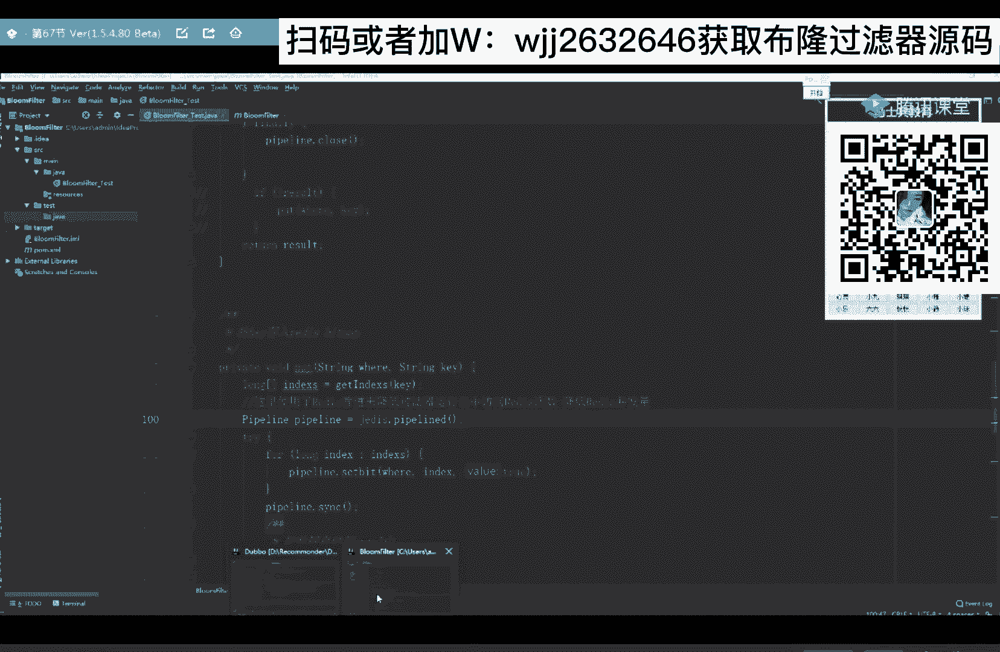
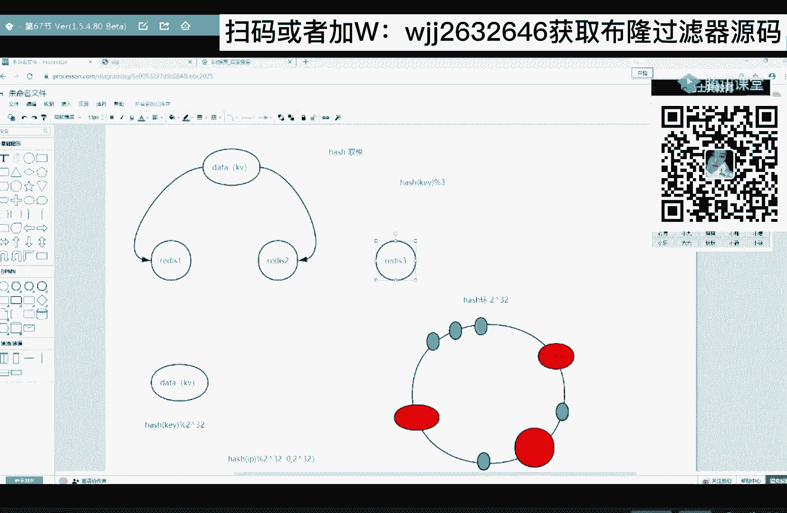

# 马士兵教育MCA架构师课程 - P95：布隆过滤器的实现 - 马士兵学堂 - BV1RY4y1Q7DL

代码有同学需要的，扫这个二维码，我会发给你来扫完，同学六六告诉我，唉老师肯定不止百万，扫完了66告诉我，我会发给你，后台的小姐姐会统计啊，后台的小姐姐会统计。

我说了给你一定会给你，并且是免费给你，好吧，放心，好，这是关于这个缓存穿透，关于这个缓存穿透，我们再给大家讲一个啊，就在你的架构里边引入了缓存层，其实他除了发生缓存穿透之外啊，可能还会发生缓存的雪崩。

知道什么是缓存雪崩吗，知道好的选择吗，知道的扣一不知道扣二，ok啊，有同学知道，有同学不知道，知道的同学，你再听一遍，我可能讲的跟你理解的不一样，请以我的为准，不理解的同学，你更要好好听。

什么是缓存雪崩啊，什么是缓存雪崩啊，就你缓存从中缓存的数据，在某一个时刻，突然失效啊，或者说无法访问，导致大量的请求打向mysql数据库，这叫缓存雪崩，那你可以想一下，就在那一刻。

你的数据库有可能受不了啊，太刺激了，对不对，那一刻突然失效了，太刺激了，这叫缓存雪崩，导致缓存雪崩的原因有这么几个，你仔细听，第一个原因，有可能是你redis中的数据，red中缓存的数据。

有效期一致导致的，导致缓存雪崩的第一个原因，有可能是你热中缓存的数据，它的有效期都是一致的，比如在你的rise里边，你一共缓存了100条数据，每一条数据的有效期啊都是一天，每条数据的有效期都是一天。

那就说一天之后啊，这100条数据会集中失效啊，那么就在那一刻，所有的请求是不是都会打向你的mysq，唉这是第一个原因导致的，那如果你的缓存血崩是由于第一个原因导致的，我可以怎么解决，我可以怎么解决。

唉刚才也听说了，可以搞随机有效期，啊可以搞随机计算器，来解决方案给大家做个笔记，可以给每一条数据加上一个随机的有效期，就是不要让他们一致，其实我们解决这个问题的思路啊，是这样的，不要，突然同时失效。

这是我们的思路啊，那你加上一个随机有效期了，那你的数据是是不是陆陆续续的失效啊，对吗，比如第一条数据你需要71天，第二条数据是0。75天，第三条数据是0。5天，依次类推，0。30。1。

那么这一条数据是不是对现实一个，然后这一条数据再再实现，你既然引入了你的缓存层，说明你的访问量已经很高了，那你一定对你的mysql是做过监控的对吧，有个motor肯定有个监控器来监控了它。

那么随着你数据陆陆续续的失效，你的监控器一定能够监控到，你的数据库的访问量在逐渐的增加，这个时候你要去查看一下，你是不是rise里边有一些热门数据失效了，听懂了吧，是不是有热门数据失效了。

如果发现有热门数据失效，这个时候再把这些数据再次缓存到redis中，那么还有一个情况就是我这条数据失效啊，并不会增加你mysql的访问量，那说明你这条数据已经不火了，是一个过气的数据啊。

跟过去的明星一样不火了，那这样的话就没必要关心了对吗，换句话说，我们这个解决方案，就是给我们的程序员一定的缓冲时间，不要突然失控，突然失效，这样我很难去解决的，那这个思路是最重要的，思路能听明白的。

扣一并不是这个解决方案啊，重要的是思路啊，好这是第一个原因导致的缓存雪崩，其实还有一个原因也会导致缓存雪崩，就是我的redis数据库挂掉了，我raid数据库挂掉了，那你挂掉的话，你肯定访问不了了对吗。

肯定访问不了了，这个时候怎么解决啊，我们可以搞分布式缓存吗，是不是可以搞备胎吗，你挂了他活着，他挂了，你活着，搞分布式缓存，比如说这这是您那些hot date热门数据。

那我把这个热门数据我不只是存在一台redis，我曾在多台，ready，二里边也有，rei 3里面也有，如果你这个rise集群啊，你采用的是这个切片模式啊，切片集群模式，如果你采用的是切片集权模式。

什么叫切片集权模式，就是把你这一堆数据切成一小堆一小堆的，一小块一小块一个切片，比如说一共有1万条数据，我切成了，我切成了切，切成了切成了十个小片，那每一个小片里面是不是包含的是1000条数据，对吧。

那这样的话你这里边存一部分，这里边存一部分，这里边再存一部分这切片集群模式，那这样的话我ready一挂了，我怕吗，不怕你，ready一里边只是存了你，hot date里边一部分数据。

release 23是不是还活着，你看这一种解决问题的思路，也是这个不要同时不要突然失效，要给我们程序员一定的缓冲时间，唉还是这个思路来能get到的，666告诉我，思路都是一样的，你看到了吧。

ok如果你的hot date这个数据量不大的话，你还可以采用副本集群模式，副本集群模式，也就是说你把这些数据啊在ready一里边存一份，ready 2里边全局存一份，ready 3里边也存一份。

里边的数据都一模一样的，并且存的都是全量数据，那这样的话你red一挂了怕吗，不怕它里边还有全量的，他挂了不怕，还有它呢，它还有一个全量，这不可以解决了吗，就你这一个场景下，这两个场景下导致的缓存雪崩。

解决思路是一样的，只不过具体的解决方案还有所区，有所区别，对吧，有所区别，老师雪崩和击穿是一样的吗，不一样，击穿和雪崩不一样，来给大家讲一下这个击穿吧，在讲击穿之前啊，我觉得还有一个知知识点比较重要。

还有一个知识点比较重要，我觉得需要捎带脚的给大家讲一下，什么知识点呢，是关于这个redis集群的哈，希一致性算法，就你出去面试的时候，其实这些问题啊，面试官肯定会问你，问的概率很高啊，就是问到这儿。

他可能会问你这个哈希一致性算法，因为这是redis集群的一个，非常非常重要的一个集权思想，咱这个算法知道的同学扣一，不知道的扣二，来想听的同学666，ok啊大部分同学都想听啊，绝大部分99。999%的。

给大给大伙讲一下，哈希一致性算法其实主要应用在redis集群里面，但是它不是把哈希一致性算法，原封不动搬过去的，他是借助了这个算法的一个思想，借助这个算法一个思想，我们先从一个小问题来一步步的来推理啊。

先从一个小问题来推理这个算法思想，比如说我现在有一些数据，有些data的数据，我要把这些数据啊存在两台服务器上，这是我们的redis 1，这是我们的redis 2，这是我们的reid 2。

如果我想把这个数据，平均分到这两个数据库里面去存储，我可以采用什么策略啊，我想把数据平均分到这两台数据库里面存储，可以采用什么策略啊，ok我们可以采用哈希取模，我们可以采用哈希取模。

我们都知道redis它是一个kv段数据库建设，对数据库，也就是说我要存储的这些数据啊，它也是一个kv段，对吧，也是一个kv段，我可以计算每一条数据的哈希值，然后在膜上二，如果它的哈希值模上2=0。

那我就把这条数据存在第一台redis，如果模上2=1，那么就存在这里面，因为你模上二，它的计算结果就两种，可能要么零，要么一，那这样我们可以相对比较平均的，把数据是不存在这两台数据库上。

我们现在先不考虑数据倾斜问题，听懂了吧，先不考虑数据倾斜，那如果现在我集群新增了一台，新增了一台数据库redis 3 ready分，那就说我这个数据分发策略不是在模上二了，需要模上三了，那怎么办啊。

那怎么办，我原先在rs一和rs 2里边，是不是存储了一部分应该存储在redis 3上的数据，如果你新增一台数据库的话，新增一台数据库的话，你需要把曾经存储的数据重新拿出来，是不是再走一遍这个策略啊。

再次分发，这是不是对于集权的扩展非常的麻烦，来能听懂我给你推理的666告诉我，ok就是如果我再新增一台服务器，它会增加我扩容的成本，那么哈希一致性算法，就是来解决你集群扩展问题的，听懂了吧。

这个这个算法的作用，那么这个算法是怎么解决集群扩展的呢，哎它有一个环，它是这样来解决的，好好听，它有一个环这个环儿啊，我们给它取了个名字叫哈希环，叫哈西花，比如你最开始还是有两台redis。

还是有两台red，那么每一台redis他们都是有ip或者house，是来区分哎，我们可以把啊，我们有两台，那接下来啊我们需要把这两台映射在这个环上，因为在这个环里，在这个环上面啊，它分布着一些点。

它分布一些点，假设一共有二的32次方这么多点，环上分布着这么多点，那么每一个点啊，它有一个编号，假设第一个编号是从零开始，最后一个编号就是二的32次方减一，懂了吧啊，有这么多点，我就把它删掉了。

密密麻麻的很多，我现在要把这两台数据库映射在这个环上，怎么映射，这边有个映射策略，我们可以拿到每一个数据库的ip值，或者它的host去计算它的一个哈希，然后膜上，模上二的32次方，听懂了吧。

模上三二的32次方，那么它的计算结果，是不是0~2的32次方是不是减一啊，我就不减一了，直接是个开区间计算结果，是这个范围对吧，那么既然是这个范围，那我redis一定能够映射在我怀的某一个点上。

比如说ready一映射在这个点，ready 2映射在这一点来，到此为止，能听懂的66告诉我，我在讲的时候你就好好听好吧，啊，我们分别用过不同的颜色来标识一下，来讽刺啊，马老师好，我不是马老师。

不好意思啊，我就说一下，这时候我们把数据库已经映射在这个环上了，那么接下来我们还要把我们要存储的数据，也要映射在这个环上，我们把要存储的数据也要映射在这个环上，怎么映射，还是采用刚才的映射策略。

因为我们的数据这是一个kv对啊，我们可以拿它的k计算它的哈希值，然后模上二的32次方，模上二的32次方，那计算结果肯定还是0~2的32次方，开区间是不是这么一个值，再说我要存储的数据。

它也能够映射到这个环上，一定能够映射在某一个点上，这是一定的，来这一点换个颜色来标绿色，ok那么到此为止，我们的数据库和要存储的数据，都映射在这个环上了，那么具体我哪些数据存在哪个数据库上。

哎它又又有一个存储的策略啊，我们就叫存储策略了，它会让每一个数据顺时针去找，最先找到哪一个数据库，那么你这条数据就存在哪一哪一台数据库上，你像这一条数据瞬间找，是不是存到软上。

那么这一条数据顺时针找是不是也存在red上，这一条数据顺时针找也存到这里面，那么这两条数据顺时针找，是不是找的都是redis 2唉，就这样来存，各找各妈，各回各家，啊就是这样一个策略来整体的听明白了。

666告诉我，那我们为什么说哈希一致性算法，就我们刚才讲这个算法，它能够解决你的集群扩容问题呢，来听我说，比如我现在新来一台数据库redis 3，听我说现在来一台数据库redis 3。

那么我们使用刚才的这个策略，是不是也能给它计算出一个哈希值，也能够映射在我环的某一个点上，比如它是在这个位置唉，映射在这个位置，ok那么现在数据就发生改变了，原本你这条数据是不存在redis 2上。

那么现在这条数据是不存在redis上对吗，也就是说我rise 2，要把这一条数据是不是给人家，这条数据需要动吗，不需要动，这一条数据需要动吗，不需要动对吧，也就是说我新增一台服务器，新增一台数据库。

我只需要两台数据库之间发生数据传输，就ok和red的音没关系，你不要动，但如果使用我们刚才这一种策略的话，是不是你的集群内部会泛红啊，对不对，你raid一需要哪一部分数据给redis 3。

redis 2需要哪一部分数据给redis，三来能听懂的。

