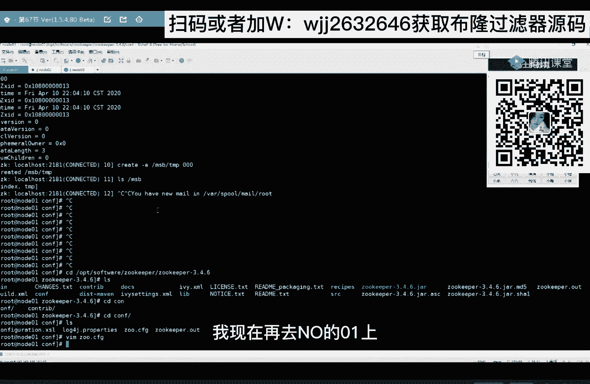

# 马士兵教育MCA架构师课程 - P99：redis锁和zookeeper有什么区别 - 马士兵学堂 - BV1RY4y1Q7DL

redis锁和组keeper有什么区别，来想听的666告诉我别刷屏啊，rise和组key有什么区别，想听的666，想听就讲呗，来加个钟啊，喜欢加装吧，首先我们选择redis去做一个分布式锁。

主要就是由于我们的redis，它里边的数据可以支持有效期，数据支持有效期，喝口水啊，你们稍等，稍等我20秒好不好，稍等我20秒，嗯嗯成功未立，回来了，没有没有没有没有，找了个瓶儿没去没去，直接找个瓶。

找了个口径合适的啊，我们使用redis做分布式锁，主要就是使用主要就是因为它有一个特性，可以支持这个数据，支持有效期，哎呀你们别说这没用了，好不好，来来来来来一波666，把这些闲言碎语顶上去。

呃这样讲这样讲，比如说这里这也是我们的gbm 1，这个呢是我们的jvm 2，然后这个呢是我们的gm 3，好不好，然后这时候我们也是那个火车票，我们现在使用redis来做分布式锁。

那么redis呢我们去抢所，抢到锁之后去买票，那么所谓的强所就是插入一条数据嘛对吧，那我现在往rise里边去插入一条数据，我可以去给他设置这把锁的一个有效期，我们去可以给这把锁去设置一个有效期对吗。

这同样你去设置一个有效期，同样还会存在这个问题，就你有效期设多长，设多短，那比如说我ride一搞了搞了搞了一把锁，他先抢到了锁，给大家设计学习一秒钟，那一秒钟呢他也有可能会存在。

他在买票的时候发生jc在窗口这睡着了，是不是也会存在两个人同时趴在一个窗口啊，是不是会存在一个线程安全问题啊对吗，其实使用redis去实现一把分布式锁，和我刚才给你讲的，使用mysql实现一个分布式锁。

其实它的原理是一样的，我在讲基于mysql分布式锁的时候，已经给你聊出来了，已经给你聊出来了，当然现在redis呢我们可以使用一个redition，去给这把锁去续这个有效期啊，给这把锁去续这个有效期。

这也是可以，那么组cp他怎么去实现这个分布式锁的呢，主要来讲这个读，你就能很好的发现这个redis和duper一个区别哈，首先组keeper呢，给大家介绍一下，既然是分布式。

那说明redis这个组keeper，它是可以部署在多个节点上的，对吧，它是可以部署在多个节点上的，比如说我现在有个高端，我这个高端啊往这个节点上插入一条数据，比如说k一就差一条这样的数据。

那么组keeper这个集群内部，它会把k一这条数据同步到其他的节点上，那么它的这种同步啊，他的这种一致性啊，我们叫弱一致性啊，我们叫最终一致性，最终一致性什么意思呢，就比如我这边还有一个口端。

这个客户端二，这是客户端，一个客户端一，这客户端二，那么客户端一往这里边写的，是往这个阶段上写一条数据，它是不是需要往这些节点去同步对吗，那这个时候有可能这个节点还没有同步过来。

我client 2就来读数据了，就来读数据了，那这样的话读这条数据我是不是就读不到啊，对不对，那我这个client 2它可以发送一个命令，让你这个节点先把数据同步，同步完之后再给我返回。

所以它是一个对称一致性，并不是一个强一致性，那所谓的强一致性，就是我往这个节点上写了一条数据，必须把所有的节点全部同步完之后，我才能去读来，我给你讲明白了，66告诉我，ok讲明白了。

那么组keeper呢，它还可以做数据的存储，它的存储啊，就类似于我们的文件系统那样去存，有目录，有层级，有目录有层级，我给大家演示一下啊。

我这边机器应该也打开了，稍等啊，我现在连接上了我note 01这台虚拟机啊，也连接上了note 02，也连接上了note 03，三台都连上了哦，g p s看一下，因为它是一个gv m进程嘛。

所以gp就能看到哎，这个这个这个就是读keeper进程，然后note 02这给大家看一下，也有啊，no no，零三的也有，不等了，主keer今天已经起来了，注意看，我现在执行一个脚本。

jk client。s h，这代表我在node 01上启动起来一个客户端，我现在组keeper是部署在三个节点上，分别note 01，note 2和note 03，我现在note 01上起了一个客户端。

是一个独立进程，它连接的是我的note 01，听懂了吧，是我的note 01来回车，之后执行一个命令l s杠了，这就能看到组k方，o的目录有个叫msb对吧，l s杠msd是不是没了，我还可以创建msd。

可以买sb回车，然后l s杠，然后发现没有啊，是不是没有创建成功啊，你要注意了，在组key里边创建一个节点，你必须给它一个初始值，初始值，比如说000回车，现在我在l s杠哎，是不是有了m s b。

我还可以在msb这个节点下，再去创建一个子节点，比如说在msb下面再去创建一个，index哎，不要忘了给它一个初始值也是零零来，我们去msb下看是不是有了。

我还可以去读这个index这个节点的内容怎么读啊，直接用get回车还是不能读到这个值啊，000它还有一些原数据，下边这些是一些原数据信息啊，就不一个个详细的去说了，这个大家都能看懂长度000v3 嘛。

然后有没有子节点没有啊，我还可以在组keeper里边去创建一个这样的节点，注意看我加上一个杠一，在我的m s b下创建了一个杠e这样一个节点，e代表的是infinal临时节点。

听懂了吧，回车来msb一下。

看一下是不是有俩节点了，这个节点是一个infe临时节点。

如果你不加杠一的话，这是一个持久节点，说一下它的节点类型，有两种，一种是持久的，还有一种是临时节点，那么临时节点有什么特点，临时节点有什么特点，它的特点就是你这个客户端连接它，创建一个临时节点。

如果你这个客户端跟他断开了连接，这个临时节点会自己删除。

ok吧，它会自动删除，我们来演示一下这个效果，我们在node 02上也启动一个code进来。

我们来看一下l s m s b下是不是这俩节点啊，对吧，一致性嘛，在这里边也能看到，刚才这个tm p是我node 01上这个客户端，是不是创建临时节点了。

我把它给干掉，我ctrl c把客户端给干掉。

然后在这看，还有是吧，来多刷几遍。

多刷几遍稍等，稍等啊，练手速的时候来了，来看这tp是不是没了，是不是t a p没了，那为什么我们等了这么长时间，t i p才删除，有同学能说吗。

能回答吗，因为那组cp里边，你这个客户端跟这个节点有没有连接，或者说它的长连接是通过心跳来维持的，就我这个集群怎么知道这个客户端没了，通过心跳，什么是心跳啊，就客户端会每隔一段时间。

向他发送一个很短的一个消息，代表这个客户端还活着，那么心跳是有心跳周期的，比如说他每隔五秒发送，每隔五秒发送，那我们刚才刷了那么长时间，tm p还在说明我们是在一个心跳周期内，听懂了吧。

最长最长它会存在一个心跳心跳周期，当他过这个心跳周期，哎我集权就可以知道他已经不在了，我就可以把临时节点给删除来，我给你解释清楚的，666告诉我，这个心跳周期可以设啊。

先设置怎么设置，有配置文件在这这一讲一讲又讲多了，哦看这儿啊，你通过这个参数可以设这个参数也可以设好吧，再讲再讲点。

我们刚才说它是支持这两种节点类型，一个是19，大伙晚上不着急了，不着急，我就加装哈，我倒无所谓，那就加重啊，马是边教育，一直玩的都是良心，绝不搞虚头巴脑的东西，想听我们就来，那么这个持久的节点啊。

它又分为有序的和无序的节点，临时节点的它又分为这两种。

有序和无序演示，在这我create杠s，杠了之后呢，后边接上m z b创建这样一个节点杠salt，不要忘了给它一个初始值，零点回车，大家看看是不是给我加一个序号，002再创建003，再创建004。

005006007008009对吧，他会依次递增给我一个序号，因为我之前啊在这个m，在这个msb下创建过一个，所以他序号给我从二开始，我之前创建过，所以从二开始，因为说这个序号是一次给我递增的。

我现在再去node 01上。

我再启动一个客户端，我同样还是执行刚才的命令，在我的m sb下创建一个salt来给它一个初始值，000和刚才这个命令是一模一样的。

那么现在请问各位，下一个节点的序号是从一六开始，还是从零一开始告诉我。

来回车看结果，从一六开始，通过我刚才给你这一波操作，我可以得到一个结论，可以得到一个结论组kep，它内部会给我维护一个全局有序，并且唯一的序号来，这句话能听懂的，666，没毛病吧，老铁们嗯。

我们一会基于组cp写个分布式锁，就是使用了他这个特点啊，最主要的就是实现它这个特点，那如果我创建创建一个节点，我加上了杠e，也加上了杠s，那么这个节点就叫临时有顺序节点，如果不加杠e。

这个叫持久有顺序节点，如果不加杠s，这就是持久无顺序节点哎这，四种类型我给你讲明白了吧。

