# 马士兵教育MCA架构师课程 - P9：解决JVM运行过程中出现的各种问题（OOM） - 马士兵学堂 - BV1RY4y1Q7DL

你说cpu暴增怎么办，你现在应该回答出来了，然后cpu暴增的两种情况，第一种是业务线程，第二种是gc线程，你发现gc线程是由于我的gc频繁，或者是他时间特别长，老是回收不掉你。

你读日志发现他回收不掉对吧，回收不掉，那这时候怎么办呢，这时候需要你去观察，到底是不是有哪个哪个对象在产生泄漏，怎么观察呀，gmf命令，好怎么观察呀，hip on dump on a。

hip dump on out of memory error，用这个参数指定，然后他们会产生堆转储文件，dp文件，怎么对这个弹幕文件进行分析，你可以用m a t，可以用jvo vm。

可以用g console，可以用jjj had命令等等都可以，最后你就查出来，到底是哪些个对象在占用我的内存，然后去找对应的业务逻辑搞定，这个过程，不知道大家听清楚没有，有没有谁对这块有疑问的。

我今天重点给大家讲的是assets，一会再教大家assets一些比较牛逼的命令，懂了吧，其实在我看来啊，呃面试里头相对比较难一些的内容是多线程，jvm呢是一层窗户纸，你你不知道你你你你自己不知道。

答不出来，多数情况下是没有人帮你捅破这层窗户纸啊，老师就是帮你捅破的那个人，再实操一遍，我就不感觉要要求重复要求的理直气壮啊，你十几分钟说的还不够清楚啊，这么简单的东西，对啊。

你自己要动手才可以啊啊我说的就是我自己哦，原来这样啊，你再实操好多遍，随便你，你才能捅破啊，好了，可以继续了吧，没问题了吧，哎起码你再遇上面试官说，om问你怎么定位，你应该就可以了。

asset开文档就可以了，assets线上能否使用，必须在线上使用，当然可以，好看，这里死锁问题还没讲，死锁问题，我刚才不是讲了吗，thrgb，一个命令就搞定了，你还要怎么讲，看这里啊，ctrl c。

我们重新再把这个环境搭起来，继续来聊我们的others，我觉得，作为阿粉丝来讲，呃，他的比较牛逼的点，不是说能替代你原来的这些个命令，如果只是这样的话，那阿萨就一般般了，我觉得阿特比较牛逼的点在于。

这教大家一个比较酷的others的这样的一个玩法。

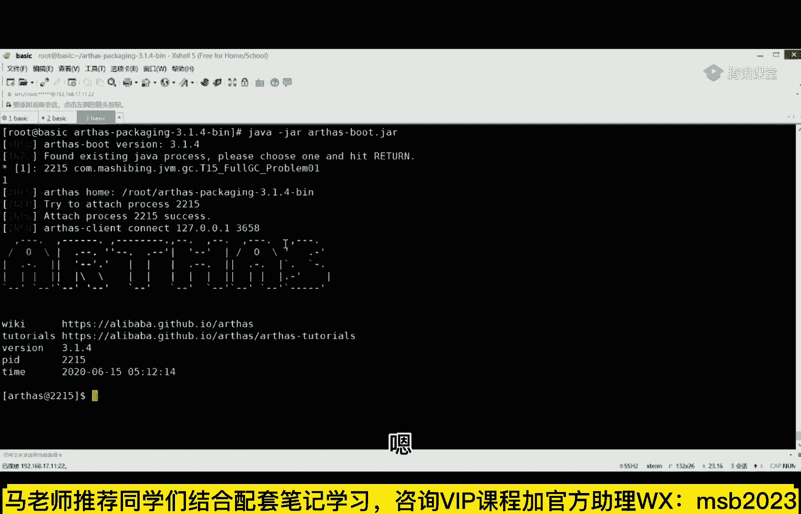

看这里help。

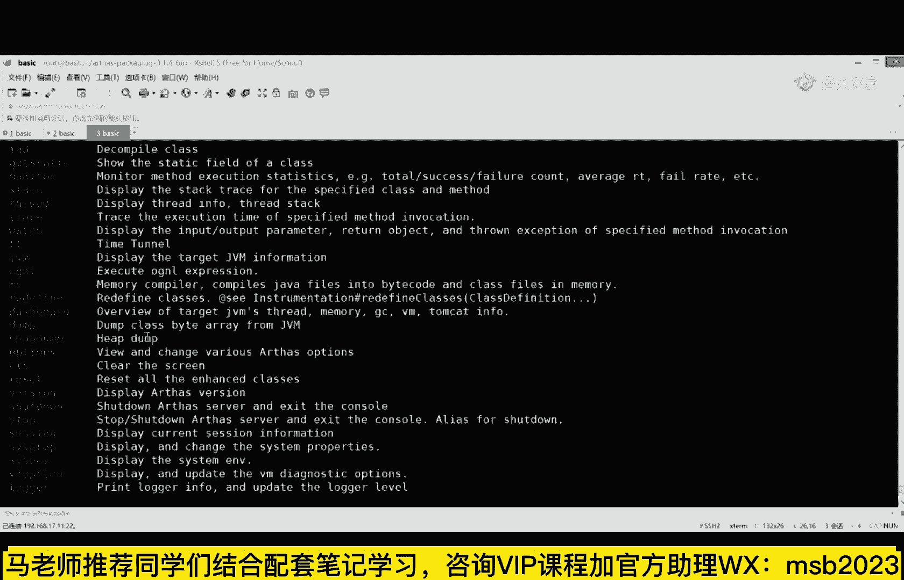

作为阿瑟来说呢，你看这个命令这个命令叫什么，叫jj a d。

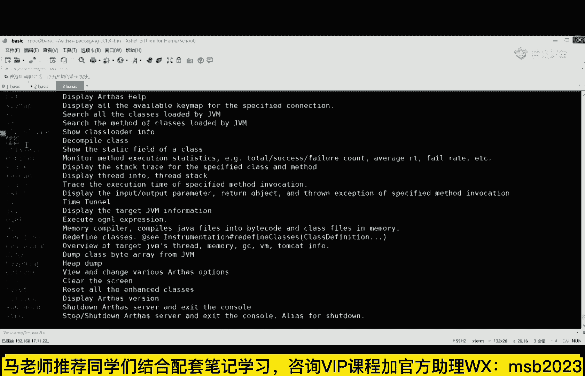

它叫the compel class，the compile class，打到这里啊，the compel class dd，这是什么意思呢，比如我敲这个命令的时候。

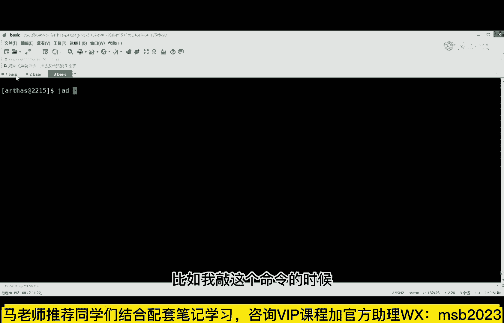

我们把我们那个类名给复制一下，我的类名。

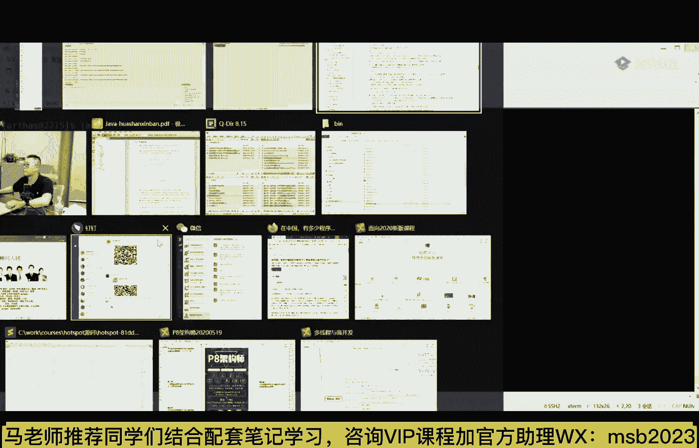

复制jd是什么意思。

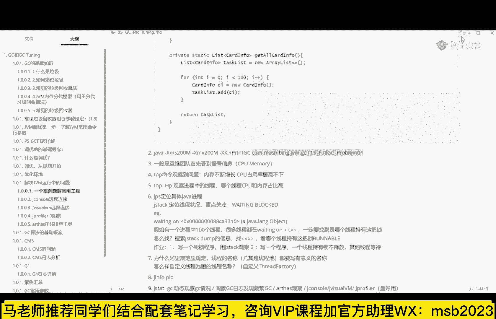

粘贴回车，诶你会看到他干了一件事，发现了吗，干了件啥事儿，他把我这个类的源代码诶给我反编译出来了，发现了没有，很便宜，有同学可能就会说了，老师这破玩意有啥用啊，我自己都有源代码，我开发的人。

我当然就有源代码了，你在在线给我翻译一下，又是什么意思，它有它有用吗，来认为有用的同学给老师扣一，认为没用的给老师扣二，是没有用的，对我看有不少扣二了，哎为什么有用啊，为什么没用啊，同学们。

同学们听我说，凡是q2 的一定是在小p公司呆着的，或者只做过小p项目的，作为大项目的人，一定是扣一的，为什么它有什么用呢，版本号，代理类好，同学们听我说，有的时候你会生成一些代理类。

它生成这个代理类的代码，对不对啊，jd翻译过来一读就你就知道了，他对不对，这是一种，还有一种是什么版本号，比如说做一个超级大的项目，下面是有一堆的小组，每个小组里面有好多的成员在里面。

写各种各样的不同版本的代码，然后最后集成到一起，我就想问你，你写了一个基础代码，你的基础代码可能会被利用，被c用，被利用被利用好，他们在用的过程中，你的版本还在不断更迭，谁能保证他帮你发布上去的。

这个版本就是所有人都能共用的，并且不会产生问题的，谁能保证他突然出了一些莫名其妙的问题，哥们儿，你第一件事应该干的，是不是得确定一下，你们给我上传的这个是不是我想要的，那个最新最稳定的版本。

来理解这一点，同学给老师扣一啊，按红说继续继续，别解释这里了，我偏不，你听懂了，你就不考虑别人的感受吗，需要老师解释，这里的给老师扣一，我就不信没有，对不对，哈哈暗黄跟那使劲扣二，然而被我选择无视啊。

看这里啊，除了版本号，还有代理类啊，还有代理类啊，你这个代理类生成的对还是不对，jd直接可以给你看出来，好了，同学们，在线啊，就直接看出来对啊，3/4不是说了吗，他们一直出现测试环境，不是最新代码。

对这个很有可能的，非常有可能，代理类听不懂啊，代理类听不懂，你能让我说啥，水平有点弯好看，这里，凡夫俗子对，经常出来部署了一晚，结果版本不对没错，你说它没有用吗，当然有用，但是他最牛逼的点还不在于这。

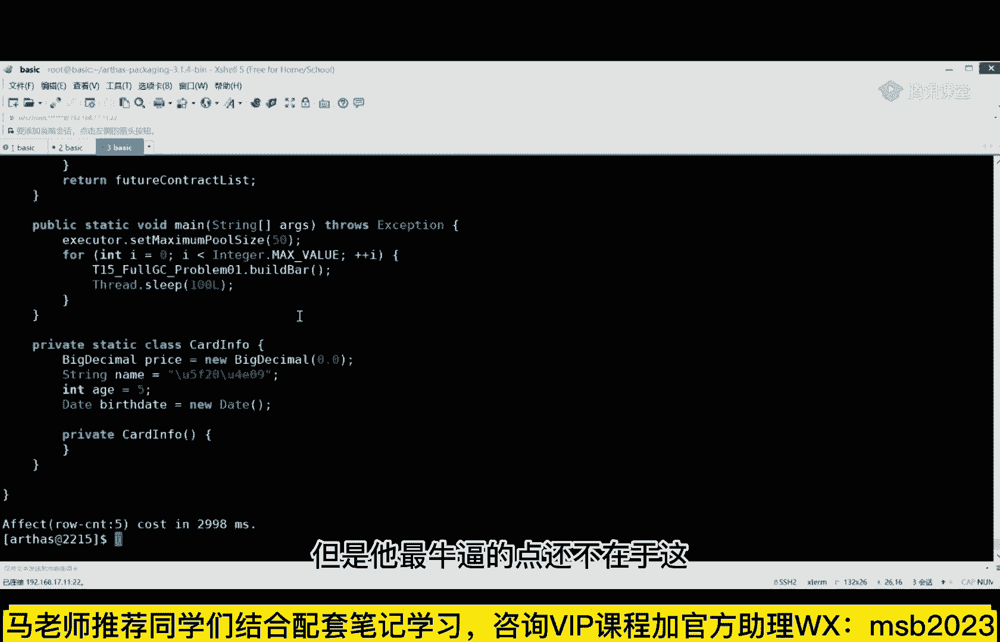

下面我给大家演示另外一个小程序，来看一眼。

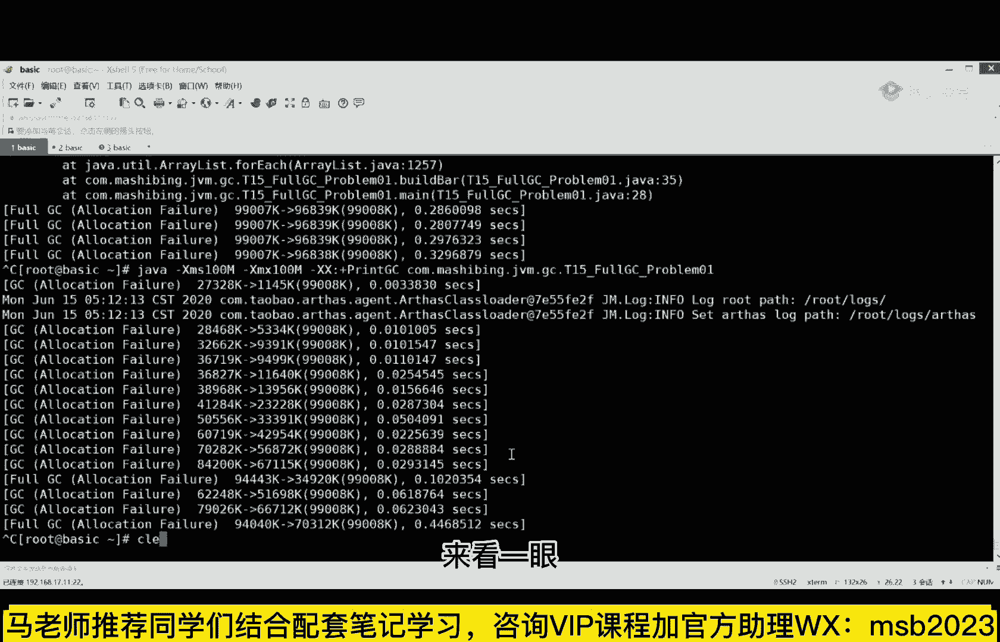

嗯要理解这个小例子呢。

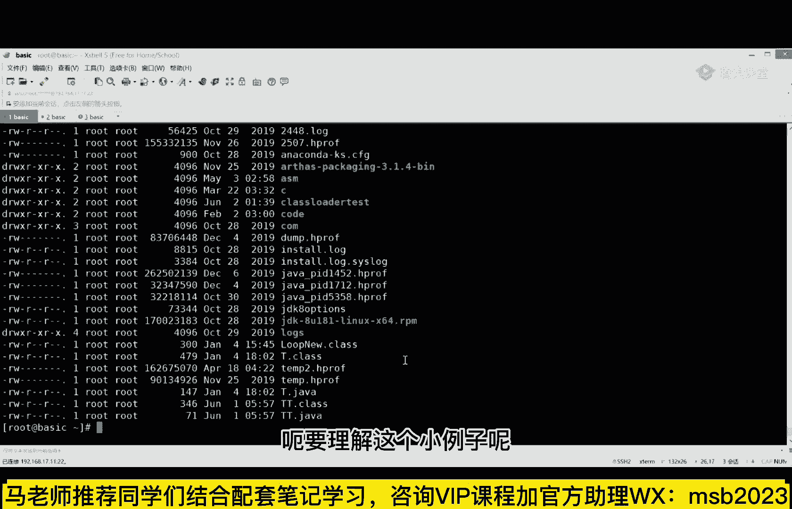

需要大家读一下这两这两个小程序代码啊，这两小时代码比较简单，一个叫mt一点java来读一下小程序，小程序超级简单啊，稍微读一下这程序呢就是一个main方法，留在店面方法里不停的cdinner read。

当我读到一个字符来的时候，我就new一个tt调用它的m方法，当然既然这样的话，你你是不是得理解一下tt这个代码呢，这个代码也也也超级简单，这个代码是啥，t t里面有一个方法叫m。

在这个m的方法里面打印出一个一。

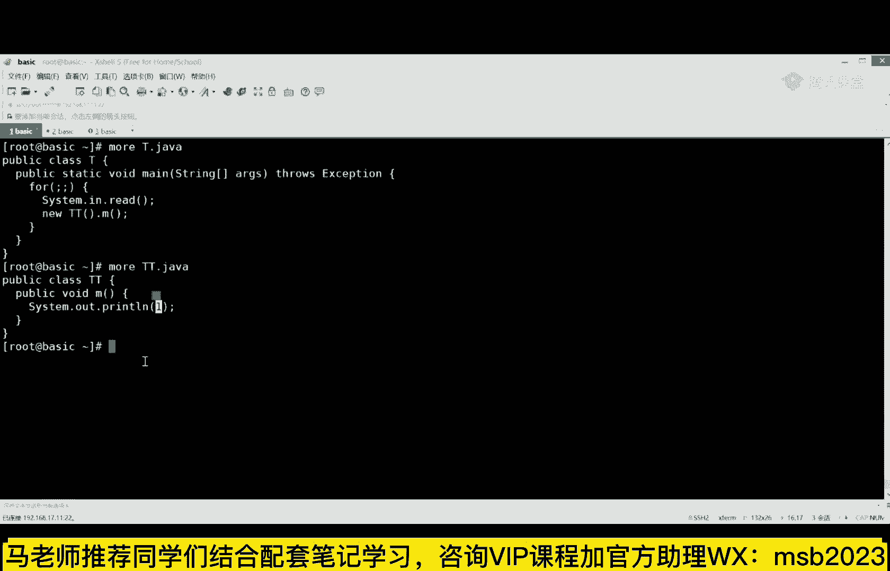

好然后在t里面不停的循环，我回一下车，他就掉一个m，打印一个一。

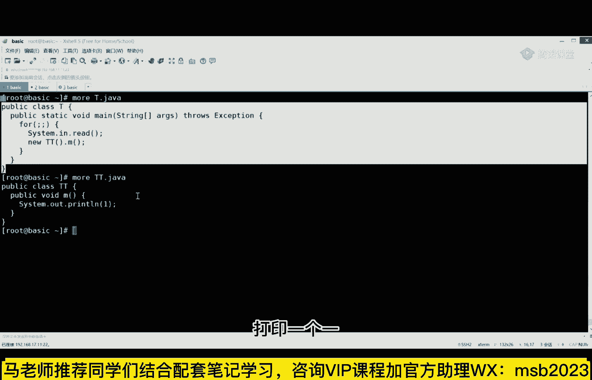

就这么一个小程序，如果你要执行他的话，那就java t回车，当我一回车打一个一单位，一回车等于一，当回车打一回车打一好，就这么简单，一下程序，不知道大家看懂了没有，那现在啊，我假设这个小程序是。

我们扔到生产环境里头上去了，生产环境已经被我扔上去了，每过来一个请求，我会给他打印一个反馈，是一个一，但是当我这个我发现我这个代码扔上去之后，我才想起来这里边有个小bug，这个小bug是什么呢。

我应该给他反馈一个二的，但是我给他反馈了一个一，我再说一下这个场景，再说一下这场景再说一遍，现在假设你已经把这个t t，部署到你的生长环境了，部署上去之后，你才发现我本来应该给他打印二反馈二。

但是我很不幸的是，我反馈了一个一同学们，现在你怎么办，有同学可能就会说，老师这事还不简单，停掉服气，代码下载下来修改一遍，重新上传搞定了，来认为这么改的同学给老师扣一，认为认为这么改，sorry。

认为这么改有问题的，给老师扣一，认为应该这么改的，给老师扣二，好我就想问你现在是一个电商系统，你上去了之后有一个产品，你那个有一个产品里边那个那个那个，我那个那个数字啊，打错了一个小数点。

你本来应该卖31块四的，结果你不小心买了，卖成了333块一毛四，但是你记住你们家的电商系统，可不只卖你一个产品啊，大哥，那你不是不只卖你一个产品，如果你要停掉的话，你要把整个服务器给停掉，各位小伙伴们。

你们想象一下后果后果是啥，就是干脆你们你们你们所有人都停掉，重新服务器再部署一遍，再启动好，所有同学，你们想象一下，作为一个大公司，一个超级的大型企业，你们知道一个线上系统从线下打包部署测试。

到线上开始运行要花多长时间吗，短的几分钟，长的一周，为什么，因为它有内部的流程，你要发布新版本，它是有内部流程的，要经过层层审批的，所以这时候怎么办，看这里passes可以帮你这么办。

nice是怎么办呢，nice，现在我们j d t t呃，你会发现他这时候打印的是个一，对不对啊，说我刚才也不停，但是我想把它修改过来，我怎么办呢，我这样来办，看这里v tt一点java，我把这个一。

给他改成二，直接我在本地做好修改，我修改之后当然要编辑一下，加个cp给点加了，然后在others里干这一件事，redefine，你得重新定义，如果你听过老师讲的class loader。

你应该知道那个class loader里面都有这么一个名字，叫define，define class，对吧，i really fine root gt class，不是好，这时候啊你会发现我程序没停。

但是在我一敲回车，如果几十个案例的上级都怎么，每个都都都都讲一遍，没错啊，几十个案例，你一个脚本不就全改完了吗，这是老师在线改，废话，你要是说你一个程序上去有300个字全写错了，你一个一个在线改。

那你这叫不熟事故好吗，你这你这是事故临时性的，临时性的，有那么一两个可能会产生问题的，稍微大点的公司哪会这样搞大哥，小点的公司才不会是大点的公司，才会这样搞石头，你是不是哪里理解错了。

我说的还不够明确是吗，如果很多，当然了，这是救急办法啊，同学们，这是救急用的服务器很多怎么办，写脚本全部一键替换，door能用吗，当然可以啊，多少为什么不能用docker更简单。

其实docker只要把docker干掉，然后重新起一个就可以了，小公司你怕啥，小公司你直接停了，没关系，修改过了之后再重新部署呗，所以你们很多的理解都是有问题啊，大公司我觉得还是k8 s直接回滚。

你除非有这个版本，万一你没有这个版本，你发布的第一个版本就出现了这个问题，你怎么回滚，你告诉我，你回滚到上一个大版本是吗，去年的双11别扯不可能，docker咋搞，docker。

你就重新把docker整个干掉，重新起一个新的不就完了，我们客户改东西流程两周，这个很正常，我告诉你，有的银行两周都算快的，好吧好吧好吧，你们认为他不牛就不牛吧啊你们认为都是对的，不跟你抬这杠了。

你赢了还不行啊。

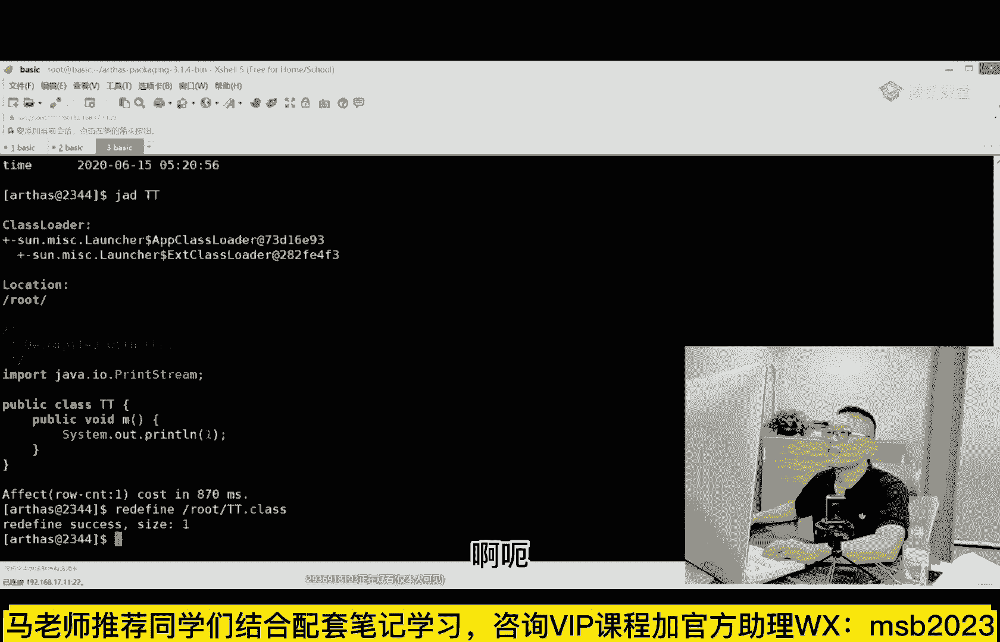

这是今天我要讲给大家的主要的内容，就讲到这吧，嗯因为东西太多了，刚才有同学不是说嘛，说老师这个日志怎么去读啊，日志是这么回事，呃不同的垃圾回收器啊，它的日志格式是不一样的，另外比较还比较牛叉的是。

不同的垃圾回收器，在不同版本上的日志也是不一样的，比如同事几万在1。7的日志，1。8的日志，1。9的日志就全是不一样的，所以对你来说呃读日志这件事呢，一时半会你肯定是拿不下的，比如说那个p的详细的日志。

基本上他有这么多条，哈哈那个你像那个呃，最终down不出来，到最后的那个hip堆的信息有这么多条，每一个到底什么意思，当然还有一些呃g one的日志，java日志呢就更更复杂一些。

因为java你首先要明白它的一些运行的这个阶段，就混合回收和嗯，嗯这种concurrent就是并并发标记啊，这两个这两个过程，然后你才能读清楚他这个日志到底是什么意思。

呃所以读书志这块呢肯定没有办法跟你聊，聊的特别特别细啊，这个没有办法，基本上今天时间肯定是不够的，但是呢我觉得老师这个文档比较牛逼的地方，在于有几个东西特别给力，第一个呢是有一个案例的汇总。

案例汇总是什么意思，呃，我我不是讲过吗，你要敢在你的简历上说我有jvm优化经验，同学们，面试官一定会问你，你们实际当中什么情况下遇到了你，有你才有我这样的经验，对不对，他一定会问你吗。

所以我给了你大概将近20个案例，18个，在这18个案例里，你挑一个用在你的简历上就可以了，贴心吗，但是我告诉你啊，你如果显示你jvm超级牛逼的水平，应该在这，我告诉你就是jim进进程静悄悄的退出。

你该怎么办，这里面会牵扯到linux内核的一些东西，这种的你跟面试官讲清楚好吧，你就是最牛逼的了，当然还有一种是排插直接内存啊，还有它直接内存，就是那个大家知道作为这这这版本内存来说，有有占有堆。

有这个meat space，有有method area，还有一个呢就直接内存叫direct memory，直接内存怎么来着，唉这个比较好，你要你要跟面试官聊，这个就不要有事了，好吧。

呃所以现在有问jvm的问题的，像这种cpu暴增啊，om啊，死锁呀，就这类的问题都都算都算是比较简单的，我直接告诉你，比较难的是这个就是jvm进程静悄悄的退出了，怎么办，你得分析他到底是由什么情况导致的。

所以你第一步要先去干嘛，先去看那个dump文件有没有，如果dump文件都没有，那说明他静悄悄被被别人干掉的，jm自身干掉的，读他日志去，如果不是这个m自身干掉，会被谁干掉呢。

会被linux o m killer那个进程也干掉，他也有日志在哪里，或者是如果这个都没有进一步排查，是硬件或者内存的问题，以前曾经有一个小伙伴我告诉你啊，实际上的案例。

以前能有些小伙伴他们家的进程总是一不小心，jvm内存就不够了，jvm内存就不够了，后来发现中木马了，知道吗，被那个挖矿的挖矿挖矿脚本给给给给给占了，ok把内存全给占了好吧，这个也是很难定位的啊。

很难定位，因为这单本身没问题，但是他老时不时的就被挤爆了，时不时被挤爆了，这个发生过居然是中木马了，牛吧，当然如果上面这四个问题，你发现都不对，都找不着，还有一个万能的解决方案，找我好吧，呃这个。

整个的这个这个嗯，内容呢是其实是我挑了一部分啊，挑了我们整体课程就是jvm呃，调优的这个课程当中的一部分，呃这课呢我你说我想透彻的理解jvm，大概讲了20多个小时，第二个版本可能还要增加一些。

原因是呃这版本的内容呢想讲的东西太多了，越来越多嗯，比如直接内存到底怎么调，我会用案例给你讲清楚，比如说那个呃真正的，如果一个进程被静悄悄的干掉，这是什么情况，我会用案例给你讲清楚，呃，在。

真正的课程里头，我讲了那个从虚拟机的基本概念开始讲的到，讲到class文件结构，讲到内存的加载过程，讲到运行时的内存结构，像这个各种各样的stack program counter在哪里呃。

messada这个方法区是一个什么样的内容，其实这个方法区来说，有好同学可能不太理解这个方法，去跟那个呃permanent space和metadata它们的区别是什么，那听我说嗯。

permanent space，meta space都是方法区的，具体实现1。7叫permanent space，1。8以后叫meta space，这么回事，听懂了吧，文件的一句话给你给你说明白。

讲过这个m常用指令啊，那么给大家讲这些调优，这个是重点中的重点，就是每种具体参数应该怎么样去设置，场景来回收器，它的原理是什么，算法时，而这个jvm的课程呢，又是我们整体课程的一部分呃。

