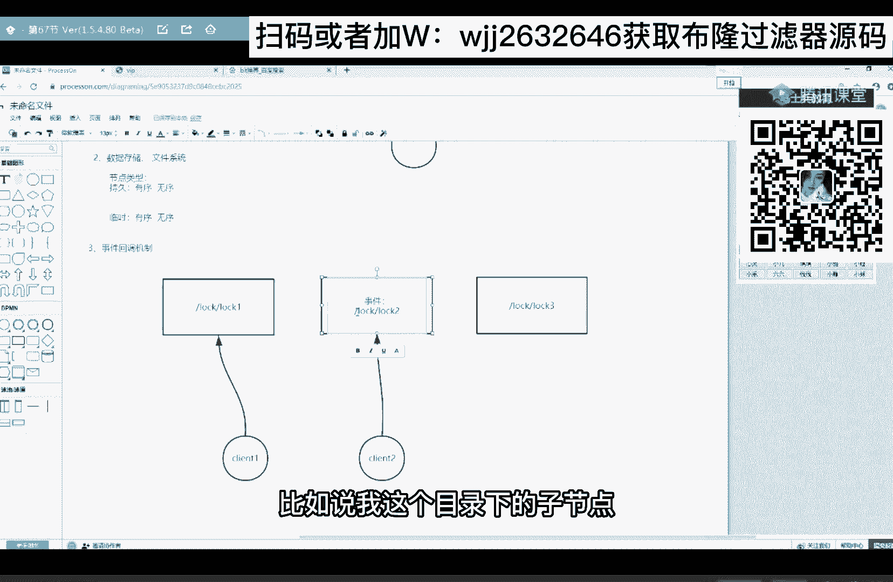
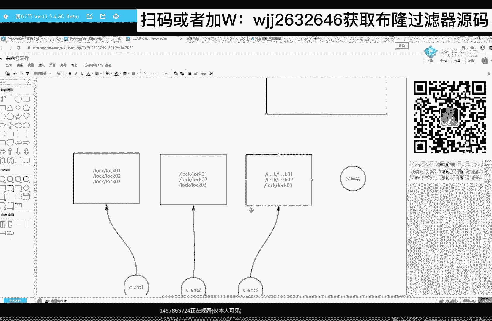
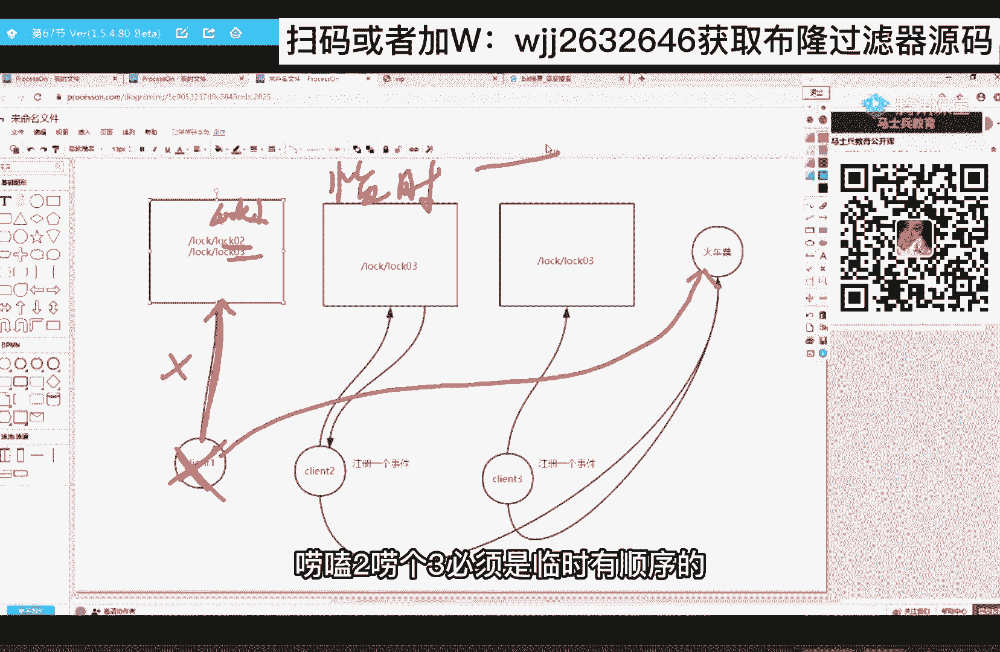
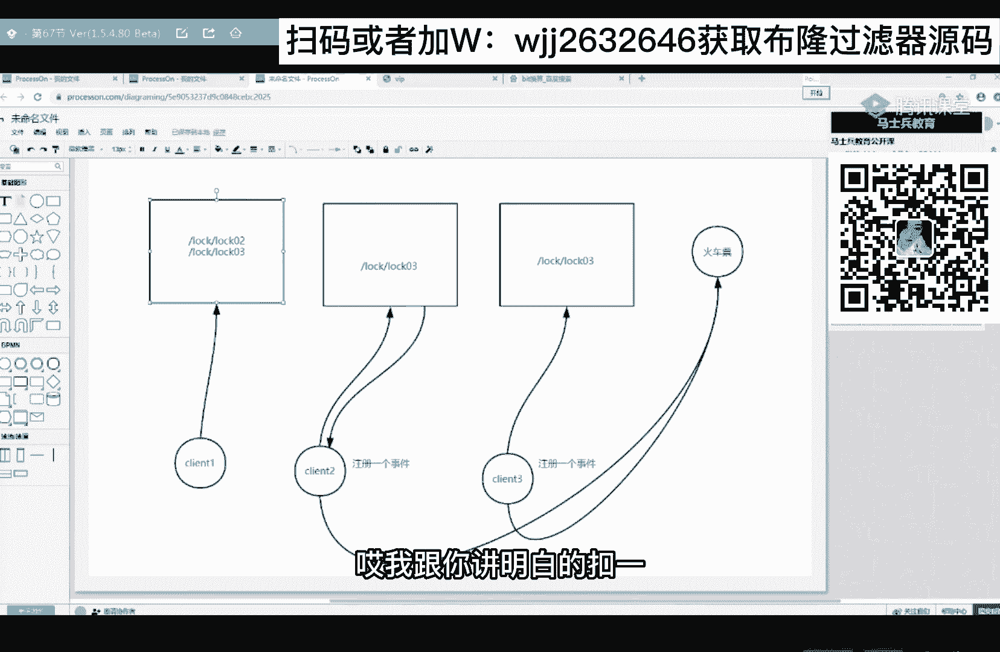

# 系列 6：P100：分布式锁如何解决缓存击穿问题？ - 马士兵学堂 - BV1RY4y1Q7DL

今晚有录播了，加小姐姐有录播。

来刚才讲的是组keeper怎么去存数据的对吧，以及它的一些节点类型，还要再给大家讲一个组合的特点，这也是我们写分布式所必要的一个特点，什么特点呢，事件回调机制。

事件回调机制，画图来讲，诶这个图怎么回事啊，图个方框，假设这是我三来组k宝，我现在有个客户端，我客户端啊连的是它，然后在这个节点上创建了一个，创建一个节点，比如说叫log节点，好吧，叫log节点。

那么这个节点是不会同步到其他的节点上去，比如说在logo下再又创建了一个log 1，这也一样。

创一个log 2，这个也一样，创一个lock 3，这是我client一创建的，然后我client这个client 2他做了一件这样的事，它连接上我们的节点之后啊，随随便连，其实连谁都一样。

因为数据一致性嘛，它假设连接上了它，然后就在这个lock这个目录上面，就在这个层级目录上。

他注册了一个事件，听懂了吧，注册了一个事件。

那么这个事件触发的条件是什么，我们可以自己来设置，比如说我这个目录下的子节点。

发生了数据的改变，或者说发生了节点的删除，发生了节点的删除哎，这个事件都会触发，那么一旦漏一下这个节点发出删除之后，它就会回调我客户端上的回调函数。

它就会回调我客户端上的回调函数，如果你这个回调函数实际上火箭上天，那么火箭就上天了，我再说一遍，我们现在假设来的客户端。

它创建了一堆目录，又来一个客户端，我基于它的父目录，我注册了一个事件。

那么事件处罚的条件，我们可以选择你的节点数据发生了改变，或者你这个子节点发生删除哎，不管发生了哪一个改变。

你这个事件都会触发，它就会回调你客户端上的回调函数。

它就会执行你回调函数里边的逻辑。

这就是事件回调，简单来说来，现在听明白了，666告诉我必须全要点。

好，继续来聊，那么掌握了这三个特点之后啊。

再来聊组keeper分布式锁就轻松很多了。

就轻松很多了，那么在聊这个组k分布式锁的原理之前。

先给大家讲一个小例子。

讲一个小故事，我们应该都去银行去办过业务。

都是中国银行办业务窗口啊，只有一个，窗口只有一个银行里边，下面现在呢都有一个叫叫号机，都有一个叫号机嗯，在这个银行没有开门之前啊，比如在门口堆了一堆的人，等待去银行办业务。

那么就在就在开门的那一刻。

就在上班的那一刻，这九个人。

是不是全部进来了，那么银行是怎么解决这种变呃，这个并发问题的银行怎么解决的，他让这九个人啊，你不要来窗口，这你先来叫号机去叫个号，我最后窗口在受理业务的时候。

通过你的号牌来给你受理，比如说这个人叫的号是一，这个人叫的号是二，这个人叫的号是三，这个人是五，这个人是四，这个人是六，这是九，诶这怎么回事，这个是九。

那继续说继续说啊，我们还我们还是来聊这个这个这个中国银行，去银行办业务这件事，这个办业务的窗口啊，只有一个，上面只有一个，然后这边呢有一个叫号机，假如他们九个人已经过来了。

在这，啊假设就六个吧，不用那么多了，然后这是1号，这是2号，这是3号，这是4号，这是6号，这个是5号。

现在每个人手上是不是都有一个号牌对吧，有个号牌就是杜兰。

这个叫号机，这叫的，那么首先第一个人呢他先去办业务。

先去办业务，那怎么知道1号先去办业务，还有我们说银行里边是不是有个小喇叭。

这个你这个小喇叭是不会会通知啊。

接下来几几号来这边办业务，那1号办完之后，2号是不是也来翻。

你看这个喇叭是相当于是一个，是不是事件的通知啊，对不对，相当于一个事件的通知，我们基于组k一撇去实现一个分布式锁。

一模一样，就这样一个思想，就是这样一个思想来这个例子能听懂的，666告诉我。

ok来。

回到我们这个主题本，这三台节点，然后这个客户端，两个。

三个，然后这是我那个卖票窗口火车票。

好吧好了，那么现在有这么三个人啊，client 1 client 2和client 3。

那么这三个人你想去买火车票，ok先来我这住厕所，先来抢所。

比如说所谓的场所啊。

就是往lock这个目录下去创建一个有序的log。

有序的节点，比如说第一个客户端他先创建的。

那么它的序号就是log 01，那么客户端二它后创建的。

那么它的就叫log 02，你记着我们创建的这个序号，它不可能相同，因为刚才给你演示了。

我们也推断出了，就可以把他给我维护一个全局有序。

并且唯一的序号听懂了吧，那么client 3给我创建的那就是log 03，当然这些数据啊它会同步到各个节点上，没毛病吧，会同步到各个节点上。

这就相当于说我这用户去叫号机。

前面是不是分别叫到一个号啊，听懂了吧。

教导一个号。

比如你客户端一先创建的是log 01，客户端二创建的log 02，这个时候客户端二其实还要做一件事。

他会在log一上注册一个事件，在这些，client 2，那么client 2在创建的时候，他发现还有比它是不是更小的一个序号，那就在它前边那个序号，那个节点上去注册一个事件，那么client 3。

他也是在它前面那个节点上去注册一个事件。

也就是在log 02上听懂了吧，那么第一个去买火车票的肯定是client一啊，因为它的序号最小啊，那么当loud一买完票之后，cloud一是不会把这个节点给干掉。

这个节点一干掉，我注册在log 01上的事件，就会去回调log 2上的回调函数。

那这个回调函数就是去买火车票。

那client 2买完之后，这个节点是不是也会干掉，当然这些都是同步啊。

那你log 02干掉之后，他那个节点上我class 3是不是出错一个事件。

这个时候再定义它的回调函数去买票。

你看基于组cp实现分布式锁的这个思想，并没有使用什么有效期啊，或者说超时时间啊，所以这就解决了我们所说的mysql那些问题。

以及redis那些问题有效期的问题。

来我给你讲明白了，666告诉他。

ok了。

如果大家想听，再再细的这个这个这个组keeper的原理。

二维码去听一下我之前讲的好吧，听一下我之前讲的。

我先来，有同学说，等会儿讲一下pk，我们下一次行吗，我们下一次乖。

ok刚才那位同学说不存在死锁吗。

会不会有死锁啊，来看一下啊。

来看一下，如果我组kep 1，他的我说了。

他的序号是不log一啊，那么他在这买票的时候，假设他宕机了，是不是这个节点挂了，进程挂了，那这个进程挂了和他是不是失去了心跳，对不对啊，这里边忘说了，这些节点必须是一个临时有顺序的节点。

就是这个log 1 log 2 log 3，必须是临时有顺序的。

那你这个节点关了没了心跳，就ka集群自动会给你，把对应的节点是不是给干掉，那你这个节点干掉之后，是不是会通知他去买票。

对不对，那你lock 2档机也一个道理啊，它会自动给你把这个节点干掉。

让下一个人去买票，这不也完美的解决了死锁问题吗，唉我给你讲明白了。

